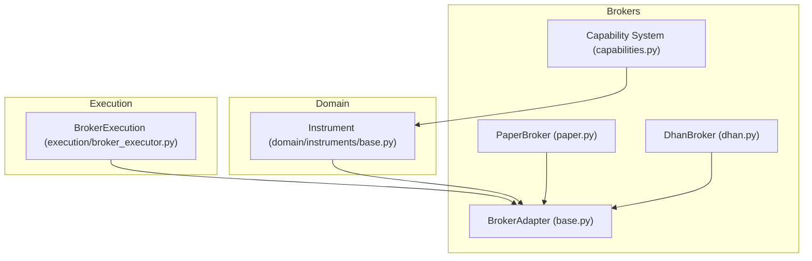
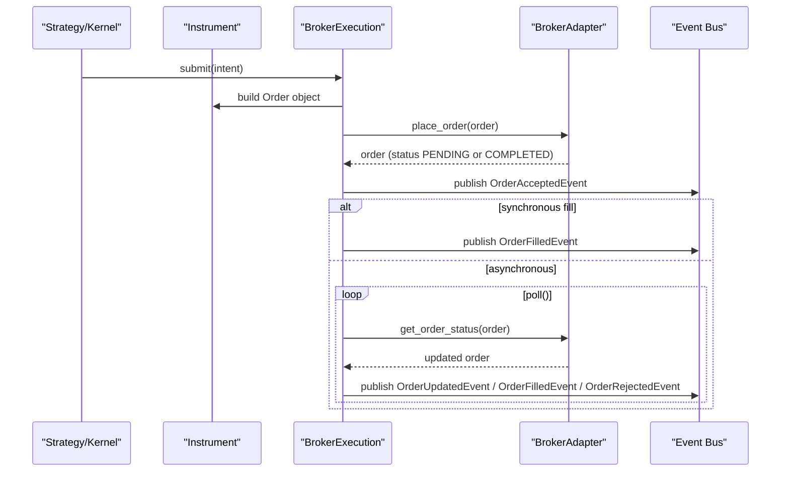
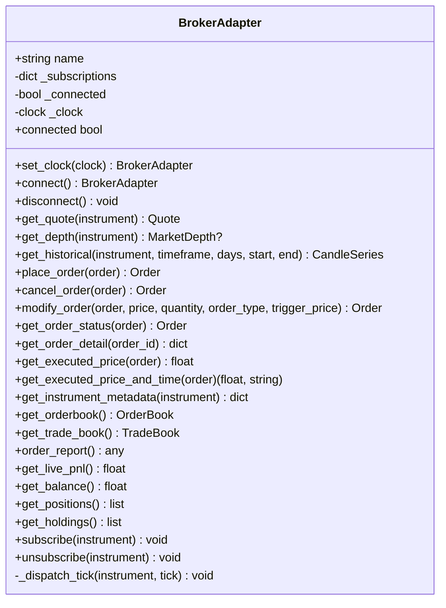
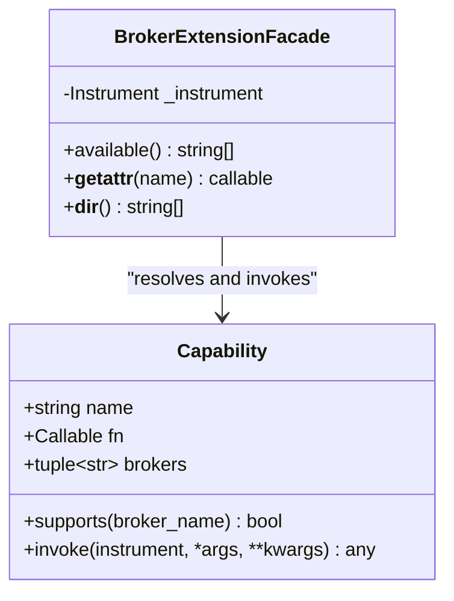
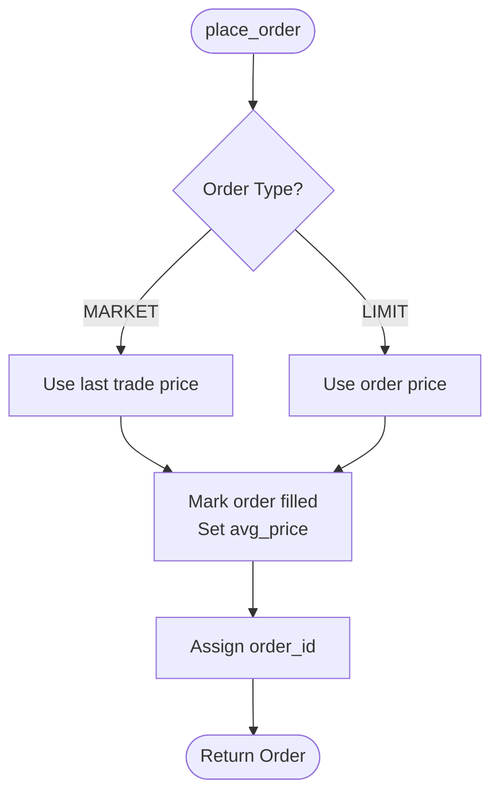
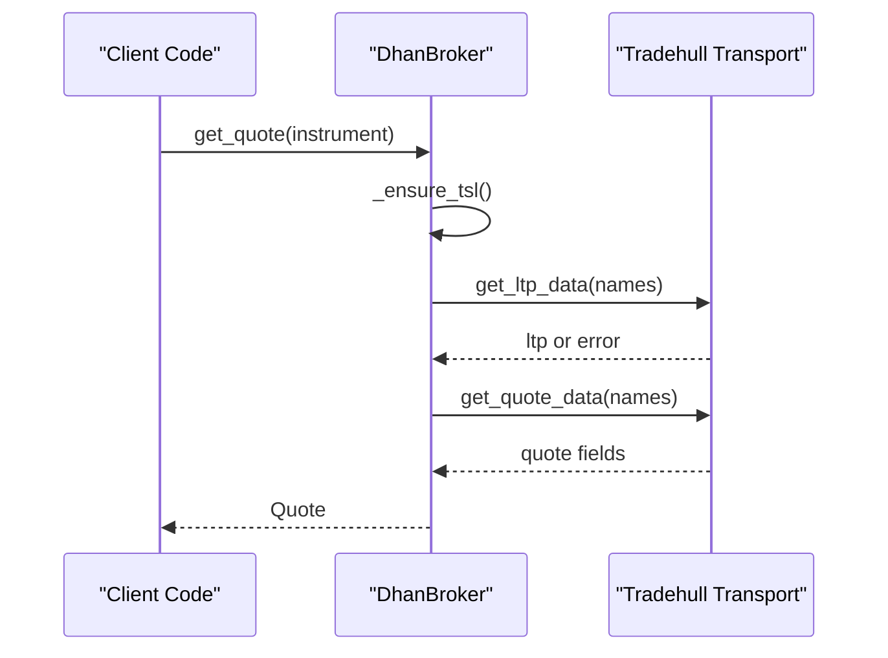
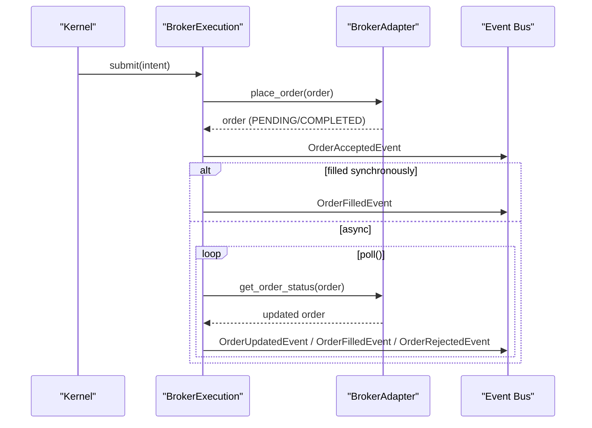
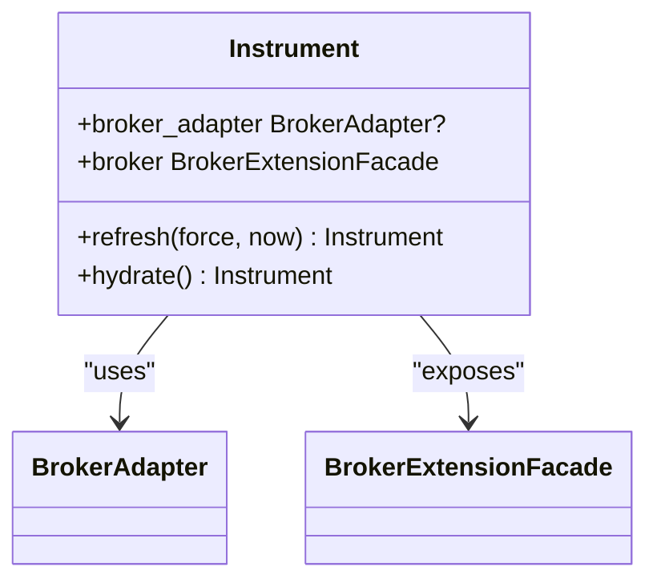
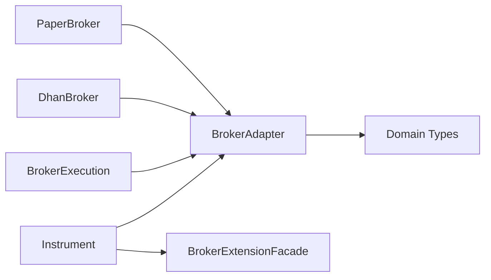

# Broker Adapter Pattern

<cite>
**Referenced Files in This Document**
- [base.py](file://ntrade/brokers/base.py)
- [capabilities.py](file://ntrade/brokers/capabilities.py)
- [paper.py](file://ntrade/brokers/paper.py)
- [dhan.py](file://ntrade/brokers/dhan.py)
- [broker_executor.py](file://ntrade/execution/broker_executor.py)
- [base.py](file://ntrade/domain/instruments/base.py)
</cite>

## Table of Contents
1. [Introduction](#introduction)
2. [Project Structure](#project-structure)
3. [Core Components](#core-components)
4. [Architecture Overview](#architecture-overview)
5. [Detailed Component Analysis](#detailed-component-analysis)
6. [Dependency Analysis](#dependency-analysis)
7. [Performance Considerations](#performance-considerations)
8. [Troubleshooting Guide](#troubleshooting-guide)
9. [Conclusion](#conclusion)
10. [Appendices](#appendices)

## Introduction
This document explains the BrokerAdapter abstract base class and its adapter pattern implementation that unifies broker-specific APIs behind a consistent interface for market data, order management, and position tracking. It details the core abstract methods, optional lifecycle hooks, capability system via decorators, error handling patterns, connection state management, and how adapters integrate with the trading kernel and execution layer. It also provides guidance on implementing a custom broker adapter by extending the base class, defining required methods, and registering capabilities.

## Project Structure
The broker adapter lives under ntrade/brokers and is consumed by domain instruments and the execution layer:
- Base adapter and capability system: ntrade/brokers/base.py, ntrade/brokers/capabilities.py
- Concrete implementations: ntrade/brokers/paper.py (in-memory), ntrade/brokers/dhan.py (live broker)
- Execution integration: ntrade/execution/broker_executor.py
- Instrument wiring to brokers: ntrade/domain/instruments/base.py

**Diagram sources**
- [base.py:25-162](file://ntrade/brokers/base.py#L25-L162)
- [capabilities.py:16-74](file://ntrade/brokers/capabilities.py#L16-L74)
- [paper.py:23-216](file://ntrade/brokers/paper.py#L23-L216)
- [dhan.py:54-1171](file://ntrade/brokers/dhan.py#L54-L1171)
- [base.py:100-151](file://ntrade/domain/instruments/base.py#L100-L151)
- [broker_executor.py:46-262](file://ntrade/execution/broker_executor.py#L46-L262)

**Section sources**
- [base.py:25-162](file://ntrade/brokers/base.py#L25-L162)
- [capabilities.py:16-74](file://ntrade/brokers/capabilities.py#L16-L74)
- [paper.py:23-216](file://ntrade/brokers/paper.py#L23-L216)
- [dhan.py:54-1171](file://ntrade/brokers/dhan.py#L54-L1171)
- [base.py:100-151](file://ntrade/domain/instruments/base.py#L100-L151)
- [broker_executor.py:46-262](file://ntrade/execution/broker_executor.py#L46-L262)

## Core Components
- BrokerAdapter: Abstract base defining the unified interface for all broker integrations.
- Capability system: A decorator-based registry enabling broker-specific features without polluting the base API.
- PaperBroker: In-memory implementation used for tests/backtests/replays.
- DhanBroker: Live broker implementation with extensive capabilities.
- BrokerExecution: Orchestrates order submission and lifecycle polling against the selected BrokerAdapter.
- Instrument: Wires each instrument to its BrokerAdapter and exposes broker capabilities via a facade.

Key responsibilities:
- Market data: get_quote, get_depth, get_historical, get_option_chain
- Orders: place_order, cancel_order, modify_order, get_order_status, get_order_detail
- Portfolio: get_positions, get_holdings, get_balance, get_live_pnl
- Streaming: subscribe/unsubscribe and tick dispatch
- Connection: connect/disconnect and connected state

**Section sources**
- [base.py:25-162](file://ntrade/brokers/base.py#L25-L162)
- [capabilities.py:16-74](file://ntrade/brokers/capabilities.py#L16-L74)
- [paper.py:23-216](file://ntrade/brokers/paper.py#L23-L216)
- [dhan.py:54-1171](file://ntrade/brokers/dhan.py#L54-L1171)
- [broker_executor.py:46-262](file://ntrade/execution/broker_executor.py#L46-L262)
- [base.py:100-151](file://ntrade/domain/instruments/base.py#L100-L151)

## Architecture Overview
The adapter pattern isolates broker-specific transport logic from the rest of the system. Domain objects interact only with BrokerAdapter through Instrument.broker_adapter. The execution layer uses BrokerExecution to submit orders and poll their lifecycle, publishing events to the kernel event bus.

**Diagram sources**
- [broker_executor.py:58-169](file://ntrade/execution/broker_executor.py#L58-L169)
- [base.py:96-110](file://ntrade/brokers/base.py#L96-L110)
- [paper.py:108-118](file://ntrade/brokers/paper.py#L108-L118)
- [dhan.py:304-351](file://ntrade/brokers/dhan.py#L304-L351)

## Detailed Component Analysis

### BrokerAdapter (Abstract Base Class)
BrokerAdapter defines the contract for all broker integrations. It centralizes connection state, timestamp resolution, subscription management, and default behaviors for optional methods.

Key abstract methods:
- connect(): Establish session; must set _connected appropriately.
- get_quote(instrument): Return Quote for the instrument.
- get_historical(instrument, timeframe, days, start, end): Return CandleSeries.
- place_order(order): Submit an order; returns the order with status/id.

Important optional methods:
- disconnect(): Reset state and notify streams.
- get_depth(instrument): Optional depth support.
- cancel_order(order), modify_order(order), get_order_status(order), get_order_detail(order_id)
- get_positions(), get_holdings(), get_balance(), get_live_pnl()
- subscribe(instrument), unsubscribe(instrument), _dispatch_tick(instrument, tick)

Connection state and timestamps:
- connected property reflects internal _connected flag.
- set_clock(clock) enables zero-parity time source; _ts(now) resolves timestamps consistently across replay/live.

Streaming:
- subscribe/unsubscribe manage per-instrument subscriptions and stream state.
- _dispatch_tick pushes ticks into the instrument’s stream pipeline.

Error handling defaults:
- Many optional methods raise NotImplementedError when not implemented by a concrete broker.
- Some return safe defaults (e.g., get_executed_price returns 0 if unknown).

**Diagram sources**
- [base.py:25-162](file://ntrade/brokers/base.py#L25-L162)

**Section sources**
- [base.py:25-162](file://ntrade/brokers/base.py#L25-L162)

### Capability System
Capabilities allow registering broker-specific extensions dynamically. Each capability is a function decorated with @capability(name, brokers=...). The BrokerExtensionFacade exposes them as instrument.broker.<name>(), raising AttributeError if unsupported.

Highlights:
- Capability registration: global registry keyed by name.
- Broker filtering: capabilities can be scoped to specific broker names.
- Dynamic invocation: __getattr__ resolves and invokes the correct capability.

**Diagram sources**
- [capabilities.py:16-74](file://ntrade/brokers/capabilities.py#L16-L74)

**Section sources**
- [capabilities.py:16-74](file://ntrade/brokers/capabilities.py#L16-L74)

### PaperBroker Implementation
PaperBroker implements the full BrokerAdapter contract in-memory for testing and backtesting. It seeds quotes/history, simulates fills, and supports order lifecycle operations.

Notable behaviors:
- Always connected; connect sets _connected = True.
- get_quote returns seeded quote or generates default.
- get_depth synthesizes bid/ask levels.
- get_historical returns generated candles filtered by time range.
- place_order immediately marks filled for simplicity; returns completed order.
- cancel_order/modify_order update stored orders.
- get_order_status syncs order state from internal store.
- get_positions/get_holdings return empty lists; get_balance returns fixed value.

**Diagram sources**
- [paper.py:108-118](file://ntrade/brokers/paper.py#L108-L118)

**Section sources**
- [paper.py:23-216](file://ntrade/brokers/paper.py#L23-L216)

### DhanBroker Implementation
DhanBroker wraps the Dhan-Tradehull library with robust error handling, token refresh, and rich capabilities. It implements all core adapter methods and many advanced features exposed via capabilities.

Key aspects:
- connect authenticates and initializes transport; set_clock propagates clock to transport.
- get_quote retries LTP calls and enriches quote with additional fields.
- get_depth fetches 20-level depth with timeout protection.
- get_historical handles intraday and daily endpoints, including special cases for FUT-type contracts.
- place_order enforces SEBI rules (no MARKET for F&O), supports bracket orders via super order API.
- cancel_order/modify_order/get_order_status interact with OMS and normalize statuses.
- get_positions/get_holdings map broker rows to domain objects; raises on failure to avoid silent wipes.
- Extensive capabilities registered via @capability for depth20, margin_calculator, kill_switch, GTT orders, etc.

**Diagram sources**
- [dhan.py:107-140](file://ntrade/brokers/dhan.py#L107-L140)

**Section sources**
- [dhan.py:54-1171](file://ntrade/brokers/dhan.py#L54-L1171)

### Integration with Execution Layer
BrokerExecution bridges the kernel’s intent model to the BrokerAdapter. It constructs orders, submits them, publishes accepted/filled/rejected events, and polls for lifecycle updates.

Highlights:
- submit builds an Order via instrument.order.place, then calls broker.place_order.
- Immediate acceptance event published; synchronous fills emitted instantly.
- poll refreshes open orders via broker.get_order_status, emitting updates and fills.
- Timeout detection for stale PENDING orders; eviction after threshold.
- restore_open rebuilds tracker from persisted deltas for crash recovery.

**Diagram sources**
- [broker_executor.py:58-169](file://ntrade/execution/broker_executor.py#L58-L169)
- [base.py:96-110](file://ntrade/brokers/base.py#L96-L110)

**Section sources**
- [broker_executor.py:46-262](file://ntrade/execution/broker_executor.py#L46-L262)

### Instrument Wiring and Capabilities
Instruments hold a reference to their BrokerAdapter and expose broker-specific capabilities via a facade. The extension mechanism allows dynamic discovery and invocation of broker features.

Key points:
- broker_adapter property lazily creates broker via factory if needed.
- broker property returns BrokerExtensionFacade for capability access.
- refresh/hydrate use broker methods to pull quote/depth/metadata.

**Diagram sources**
- [base.py:100-151](file://ntrade/domain/instruments/base.py#L100-L151)

**Section sources**
- [base.py:100-151](file://ntrade/domain/instruments/base.py#L100-L151)

## Dependency Analysis
- BrokerAdapter depends on domain types (Quote, MarketDepth, CandleSeries, Order, OrderBook, TradeBook).
- PaperBroker and DhanBroker implement BrokerAdapter and depend on domain types and external libraries (pandas, dhan-tradehull).
- BrokerExecution depends on domain order types and events, and calls BrokerAdapter methods.
- Instrument depends on BrokerAdapter and BrokerExtensionFacade to wire capabilities.

**Diagram sources**
- [base.py:25-162](file://ntrade/brokers/base.py#L25-L162)
- [paper.py:23-216](file://ntrade/brokers/paper.py#L23-L216)
- [dhan.py:54-1171](file://ntrade/brokers/dhan.py#L54-L1171)
- [broker_executor.py:46-262](file://ntrade/execution/broker_executor.py#L46-L262)
- [base.py:100-151](file://ntrade/domain/instruments/base.py#L100-L151)

**Section sources**
- [base.py:25-162](file://ntrade/brokers/base.py#L25-L162)
- [paper.py:23-216](file://ntrade/brokers/paper.py#L23-L216)
- [dhan.py:54-1171](file://ntrade/brokers/dhan.py#L54-L1171)
- [broker_executor.py:46-262](file://ntrade/execution/broker_executor.py#L46-L262)
- [base.py:100-151](file://ntrade/domain/instruments/base.py#L100-L151)

## Performance Considerations
- Timestamp resolution: _ts prioritizes explicit now > injected clock > wall clock to ensure zero-parity in replay/live scenarios.
- Network resilience: DhanBroker retries LTP calls and handles intermittent failures gracefully.
- Depth fetching: Timeouts prevent blocking on websocket snapshots.
- Polling strategy: BrokerExecution evicts stale orders after repeated failures to avoid memory leaks.
- Synchronous vs asynchronous fills: PaperBroker fills immediately; live brokers may require polling.

[No sources needed since this section provides general guidance]

## Troubleshooting Guide
Common issues and resolutions:
- NotImplementedError: Indicates a broker does not implement an optional method. Ensure your BrokerAdapter subclass overrides required methods or handle missing functionality.
- AttributeError on capabilities: Occurs when attempting to call a capability not supported by the current broker. Verify broker.name matches capability registration.
- Stale orders: BrokerExecution tracks staleness and evicts orders after threshold. Investigate network connectivity and broker availability.
- Token expiration: DhanBroker refreshes tokens automatically; ensure authentication setup is correct.
- Empty positions: get_positions raises on failure to avoid silent wipes. Handle exceptions at caller level to distinguish between flat and error states.

**Section sources**
- [base.py:100-146](file://ntrade/brokers/base.py#L100-L146)
- [capabilities.py:60-70](file://ntrade/brokers/capabilities.py#L60-L70)
- [broker_executor.py:121-129](file://ntrade/execution/broker_executor.py#L121-L129)
- [dhan.py:75-94](file://ntrade/brokers/dhan.py#L75-L94)

## Conclusion
The BrokerAdapter pattern provides a clean abstraction over diverse broker APIs, enabling consistent market data access, order management, and portfolio queries across different brokers. The capability system extends functionality without cluttering the core interface. Combined with BrokerExecution and Instrument wiring, it forms a robust foundation for trading strategies that can seamlessly switch between paper and live environments.

[No sources needed since this section summarizes without analyzing specific files]

## Appendices

### Implementing a Custom Broker Adapter
To create a new broker adapter:
1. Extend BrokerAdapter and implement required abstract methods: connect, get_quote, get_historical, place_order.
2. Optionally implement cancel_order, modify_order, get_order_status, get_positions, get_holdings, get_balance.
3. Set self._connected appropriately in connect().
4. Use set_clock(clock) to support replay/live parity.
5. Register broker-specific capabilities using @capability decorator if needed.

Example structure:
- Define class MyBroker(BrokerAdapter) with name = "mybroker"
- Implement connect() to establish session
- Implement get_quote() to return Quote
- Implement get_historical() to return CandleSeries
- Implement place_order() to submit orders
- Override optional methods as needed

**Section sources**
- [base.py:25-162](file://ntrade/brokers/base.py#L25-L162)
- [capabilities.py:32-41](file://ntrade/brokers/capabilities.py#L32-L41)

### Contract Between Adapters and Trading Kernel
- Instruments call broker methods via broker_adapter property
- BrokerExecution orchestrates order lifecycle and publishes events
- Event bus decouples components and ensures consistent state propagation
- Zero-parity timestamps ensure replay/live consistency

**Section sources**
- [base.py:100-151](file://ntrade/domain/instruments/base.py#L100-L151)
- [broker_executor.py:58-169](file://ntrade/execution/broker_executor.py#L58-L169)