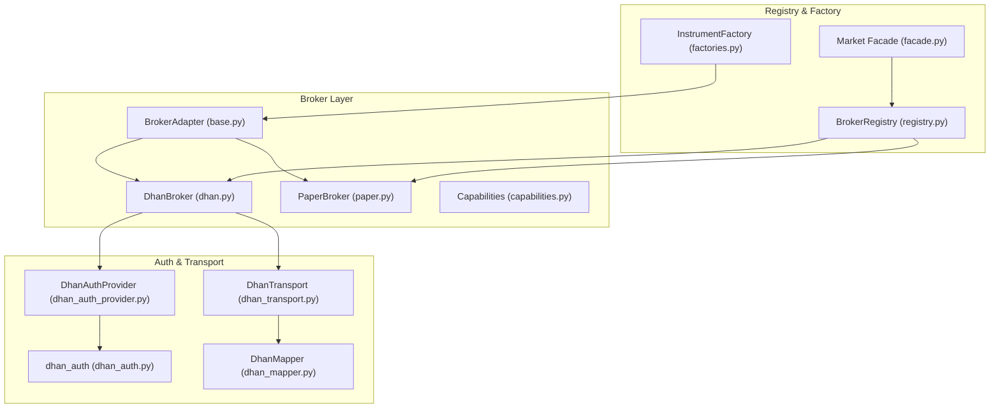
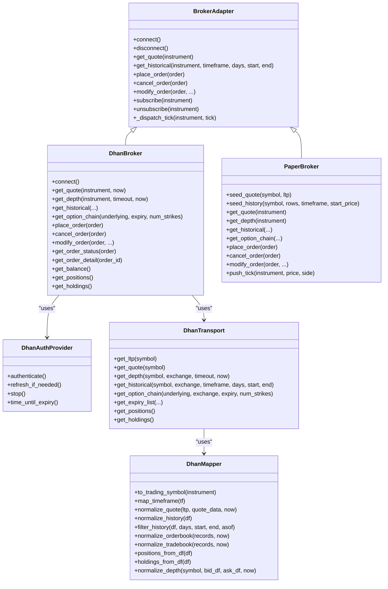
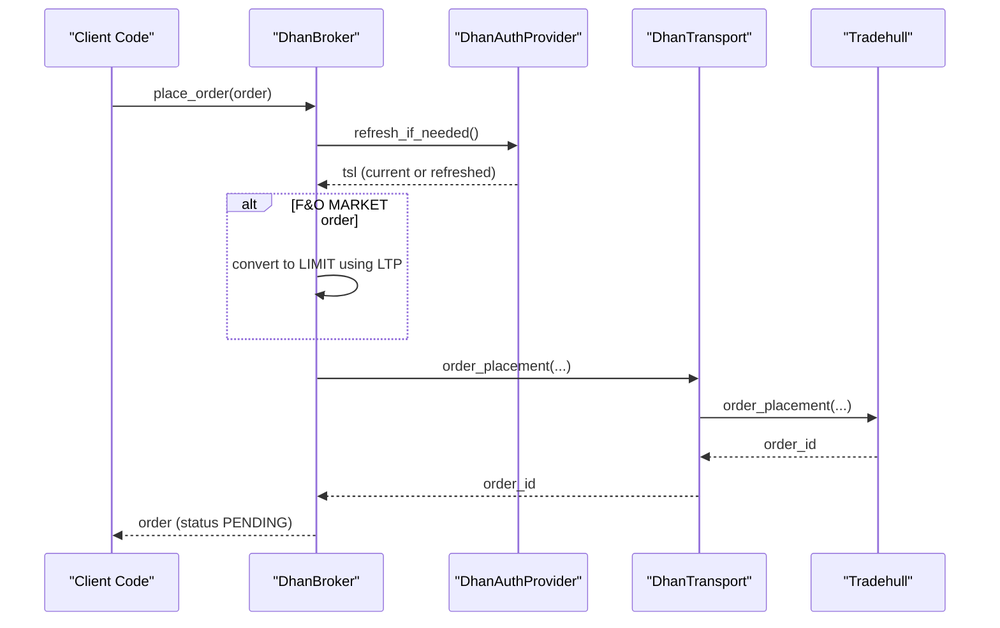
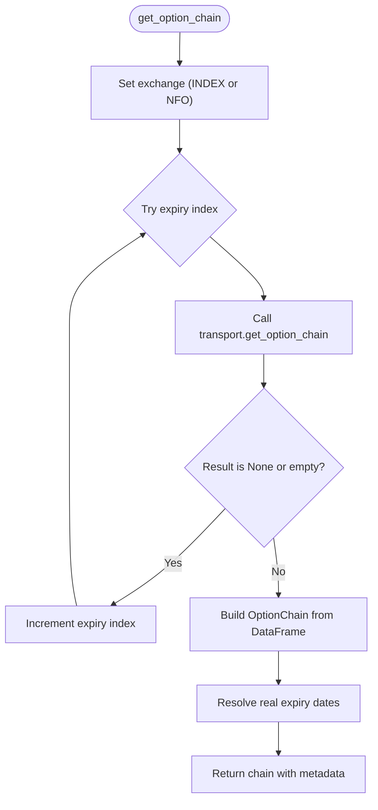
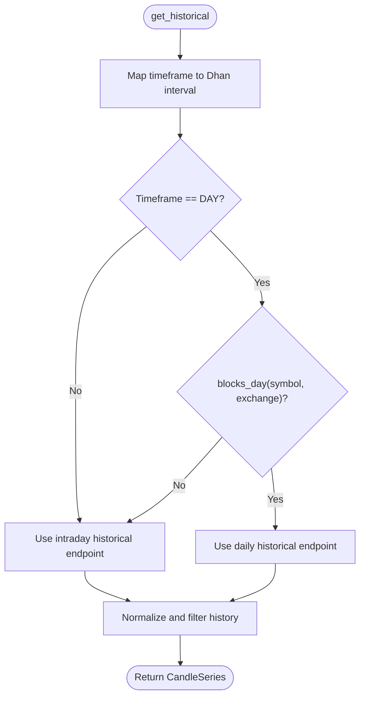
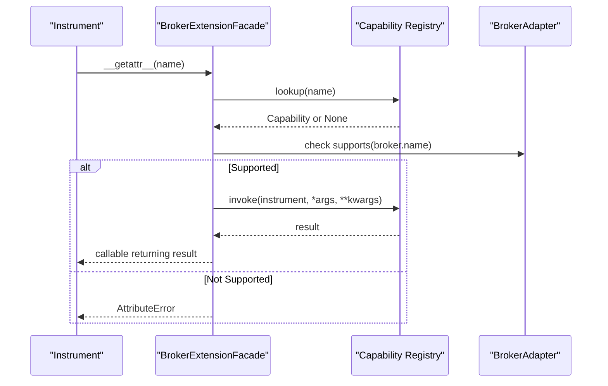
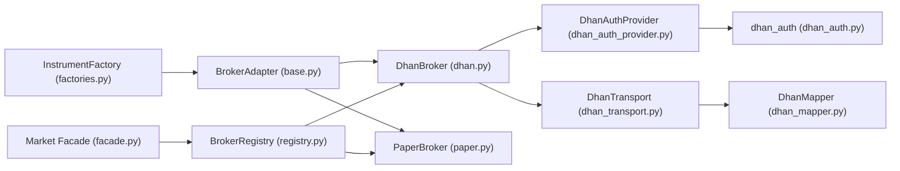

# Broker Integration Guide

<cite>
**Referenced Files in This Document**
- [base.py](file://ntrade/brokers/base.py)
- [capabilities.py](file://ntrade/brokers/capabilities.py)
- [dhan.py](file://ntrade/brokers/dhan.py)
- [paper.py](file://ntrade/brokers/paper.py)
- [dhan_auth.py](file://ntrade/brokers/dhan_auth.py)
- [dhan_transport.py](file://ntrade/brokers/dhan_transport.py)
- [dhan_mapper.py](file://ntrade/brokers/dhan_mapper.py)
- [dhan_auth_provider.py](file://ntrade/brokers/dhan_auth_provider.py)
- [factories.py](file://ntrade/factories.py)
- [registry.py](file://ntrade/registry.py)
- [facade.py](file://ntrade/facade.py)
- [01-install-brokers.md](file://user-guide/01-install-brokers.md)
- [07-broker-capabilities.md](file://user-guide/07-broker-capabilities.md)
</cite>

## Update Summary
**Changes Made**
- Updated document structure to reflect the new modular user-guide organization
- Added references to the split documentation files (01-install-brokers.md and 07-broker-capabilities.md)
- Enhanced cross-references between technical implementation and user-facing documentation
- Maintained all existing technical content while adding new modular structure context

## Table of Contents
1. Introduction
2. Project Structure
3. Core Components
4. Architecture Overview
5. Detailed Component Analysis
6. Dependency Analysis
7. Performance Considerations
8. Troubleshooting Guide
9. Conclusion

## Introduction
This guide explains how to integrate and use brokers in the project with a focus on the Dhan broker implementation, while keeping the same interface for paper trading and future brokers. The design hides transport details (REST/websocket, auth, token refresh) behind a BrokerAdapter so that domain code never talks directly to network endpoints. You can switch between live and paper modes without changing strategy or execution logic.

The documentation has been restructured into a modular approach where:
- **Installation and Setup**: Covered in [Install & Brokers](user-guide/01-install-brokers.md)
- **Advanced Capabilities**: Documented in [Broker Capabilities](user-guide/07-broker-capabilities.md)
- **Technical Implementation**: Covered in this comprehensive guide

Key goals:
- Uniform broker interface via BrokerAdapter
- Capability-driven extensions per broker
- Robust authentication and token lifecycle management
- Normalized data mapping from broker-specific responses to domain objects
- Deterministic paper broker for tests and backtests

## Project Structure
The broker subsystem is organized around a base adapter, concrete implementations, and supporting layers for authentication, transport, and mapping. Factories and registries provide object creation and discovery. A legacy facade remains for backward compatibility.

**Diagram sources**
- [base.py](file://ntrade/brokers/base.py)
- [dhan.py](file://ntrade/brokers/dhan.py)
- [paper.py](file://ntrade/brokers/paper.py)
- [capabilities.py](file://ntrade/brokers/capabilities.py)
- [dhan_auth_provider.py](file://ntrade/brokers/dhan_auth_provider.py)
- [dhan_auth.py](file://ntrade/brokers/dhan_auth.py)
- [dhan_transport.py](file://ntrade/brokers/dhan_transport.py)
- [dhan_mapper.py](file://ntrade/brokers/dhan_mapper.py)
- [registry.py](file://ntrade/registry.py)
- [factories.py](file://ntrade/factories.py)
- [facade.py](file://ntrade/facade.py)

**Section sources**
- [01-install-brokers.md](file://user-guide/01-install-brokers.md)
- [07-broker-capabilities.md](file://user-guide/07-broker-capabilities.md)

## Core Components
- **BrokerAdapter**: Abstract base defining the contract for market data, orders, portfolio, streaming, and optional capabilities. It also manages subscriptions and timestamps with zero-parity support.
- **DhanBroker**: Concrete implementation for Dhan using Tradehull, including quote/history/ordering, option chains, and SEBI-compliant order handling.
- **PaperBroker**: In-memory broker for deterministic testing/backtesting/replays with seeded randomness and consistent API parity.
- **Capabilities**: Decorator-based capability registry enabling broker-specific features exposed via instrument.broker.<name>().
- **DhanAuthProvider**: Lifecycle manager for Dhan authentication with proactive token refresh and PIN+TOTP fallback.
- **DhanTransport**: Wrapper around Tradehull calls with retry policies, rate limiting, and normalization.
- **DhanMapper**: Pure functions to map raw Dhan responses into domain objects (Quote, OrderBook, TradeBook, positions, holdings).
- **BrokerRegistry**: Central registry to discover and construct brokers by name.
- **InstrumentFactory**: Creates instruments with an attached broker context.
- **Market Facade**: Legacy entry point delegating to TradingSession.

**Section sources**
- [base.py](file://ntrade/brokers/base.py)
- [capabilities.py](file://ntrade/brokers/capabilities.py)
- [dhan.py](file://ntrade/brokers/dhan.py)
- [paper.py](file://ntrade/brokers/paper.py)
- [dhan_auth_provider.py](file://ntrade/brokers/dhan_auth_provider.py)
- [dhan_auth.py](file://ntrade/brokers/dhan_auth.py)
- [dhan_transport.py](file://ntrade/brokers/dhan_transport.py)
- [dhan_mapper.py](file://ntrade/brokers/dhan_mapper.py)
- [registry.py](file://ntrade/registry.py)
- [factories.py](file://ntrade/factories.py)
- [facade.py](file://ntrade/facade.py)

## Architecture Overview
The system separates concerns across layers:
- Domain layer uses BrokerAdapter methods only; no direct REST/websocket calls.
- DhanBroker composes AuthProvider, Transport, and Mapper to implement the adapter.
- Authentication handles token persistence, expiry buffers, and PIN+TOTP fallback.
- Transport adds retries, throttling, and error propagation.
- Mapper ensures all outputs are domain objects, not pandas DataFrames.

**Diagram sources**
- [base.py](file://ntrade/brokers/base.py)
- [dhan.py](file://ntrade/brokers/dhan.py)
- [paper.py](file://ntrade/brokers/paper.py)
- [dhan_auth_provider.py](file://ntrade/brokers/dhan_auth_provider.py)
- [dhan_transport.py](file://ntrade/brokers/dhan_transport.py)
- [dhan_mapper.py](file://ntrade/brokers/dhan_mapper.py)

## Detailed Component Analysis

### BrokerAdapter (Base Contract)
Responsibilities:
- Define abstract methods for quotes, history, depth, options chain, orders, portfolio, and streaming.
- Provide default behaviors where possible (e.g., get_depth returns None, cancel/modify raise NotImplementedError unless overridden).
- Manage subscription state and tick dispatch to instrument streams.
- Support zero-parity timestamps via injected clock.

Key patterns:
- Time resolution prefers explicit now > injected clock > wall clock.
- Subscription multiplexing tracks instruments and updates stream states.

**Section sources**
- [base.py](file://ntrade/brokers/base.py)

### DhanBroker (Live Implementation)
Highlights:
- Connects via DhanAuthProvider, sets up DhanTransport with rate limiter and clock injection.
- Enforces SEBI rules for F&O (convert MARKET to LIMIT with LTP-derived price).
- Handles bracket orders via place_super_order when applicable.
- Provides robust option chain fetching with fallback expiries and real expiry resolution.
- Normalizes order status, details, executed prices, and books.
- Exposes many broker-specific capabilities via decorators.

Important flows:
- Token refresh before critical operations.
- Historical data routing: intraday vs daily endpoint based on instrument type/exchange.
- Depth retrieval bounded by timeout thread.

**Section sources**
- [dhan.py](file://ntrade/brokers/dhan.py)

### PaperBroker (Deterministic Offline)
Highlights:
- Always connected, seeded RNG for reproducibility.
- Seeds quotes and history for quick setup.
- Simulates order placement, cancellation, modification, and status queries.
- Produces typed OrderBook and TradeBook from internal order list.
- Pushes ticks to subscribed instruments.

Use cases:
- Unit tests, integration tests, backtests, replays.

**Section sources**
- [paper.py](file://ntrade/brokers/paper.py)

### Capabilities (Broker Extensions)
Mechanism:
- @capability decorator registers functions with optional broker scoping.
- BrokerExtensionFacade exposes them dynamically via instrument.broker.<name>().
- Fail-fast if unsupported by current broker.

Examples:
- depth20, margin_calculator, kill_switch, pnl-based exit, super orders, GTT/forever orders, conditional triggers, ATM/ITM/OTM strike selection, expired option data, exchange time.

For detailed usage examples and available capabilities, see [Broker Capabilities](user-guide/07-broker-capabilities.md).

**Section sources**
- [capabilities.py](file://ntrade/brokers/capabilities.py)
- [dhan.py](file://ntrade/brokers/dhan.py)
- [07-broker-capabilities.md](file://user-guide/07-broker-capabilities.md)

### DhanAuthProvider (Authentication Lifecycle)
Features:
- Wraps dhan_auth.get_tradehull with class-level caching and proactive refresh.
- Schedules background timer to refresh tokens before expiry using PIN+TOTP.
- Thread-safe refresh path and stop hook for shutdown.

Token strategy:
- Prefer shared store token if valid and not near expiry.
- Else try .env access token if not provably expired.
- Else fall back to PIN+TOTP with cooldown protection.

**Section sources**
- [dhan_auth_provider.py](file://ntrade/brokers/dhan_auth_provider.py)
- [dhan_auth.py](file://ntrade/brokers/dhan_auth.py)

### DhanTransport (API Wrapper)
Responsibilities:
- Retry policy for flaky endpoints (LTP/quote).
- Rate limiting to respect Dhan API ceiling.
- Graceful fallbacks for non-critical endpoints; strict errors for critical ones.
- Normalize results to domain objects (no pandas leaks).

Notable methods:
- get_ltp with retry and zero-price guard.
- get_depth with websocket snapshot and timeout thread.
- get_historical and long-term historical with normalization and filtering.
- Order/trade book normalization and position/holding mapping.

**Section sources**
- [dhan_transport.py](file://ntrade/brokers/dhan_transport.py)

### DhanMapper (Pure Mapping)
Functions:
- Symbol mapping to Dhan's custom format for options.
- Timeframe mapping with validation.
- Quote/history normalization and filtering.
- Order/trade book normalization.
- Positions/holdings mapping from DataFrames to domain objects.
- Depth normalization from bid/ask frames.

Design principle:
- No network calls, no auth — pure transforms ensuring domain purity.

**Section sources**
- [dhan_mapper.py](file://ntrade/brokers/dhan_mapper.py)

### Registry and Factory
- **BrokerRegistry**: Thread-safe registration and lookup of broker factories; lazy default registration.
- **InstrumentFactory**: Creates instruments with broker context; flyweight via SymbolMaster.
- **Market Facade**: Legacy wrapper over TradingSession for backward compatibility.

For installation and basic broker setup, refer to [Install & Brokers](user-guide/01-install-brokers.md).

**Section sources**
- [registry.py](file://ntrade/registry.py)
- [factories.py](file://ntrade/factories.py)
- [facade.py](file://ntrade/facade.py)
- [01-install-brokers.md](file://user-guide/01-install-brokers.md)

## Architecture Overview
End-to-end flow for placing an order through DhanBroker:

**Diagram sources**
- [dhan.py](file://ntrade/brokers/dhan.py)
- [dhan_auth_provider.py](file://ntrade/brokers/dhan_auth_provider.py)
- [dhan_transport.py](file://ntrade/brokers/dhan_transport.py)

## Detailed Component Analysis

### Option Chain Fetch Flow

**Diagram sources**
- [dhan.py](file://ntrade/brokers/dhan.py)
- [dhan_transport.py](file://ntrade/brokers/dhan_transport.py)
- [dhan_mapper.py](file://ntrade/brokers/dhan_mapper.py)

### Historical Data Routing Decision

**Diagram sources**
- [dhan.py](file://ntrade/brokers/dhan.py)
- [dhan_transport.py](file://ntrade/brokers/dhan_transport.py)
- [dhan_mapper.py](file://ntrade/brokers/dhan_mapper.py)

### Capability Resolution Flow

**Diagram sources**
- [capabilities.py](file://ntrade/brokers/capabilities.py)
- [dhan.py](file://ntrade/brokers/dhan.py)

## Dependency Analysis
High-level dependencies among broker components:

**Diagram sources**
- [base.py](file://ntrade/brokers/base.py)
- [dhan.py](file://ntrade/brokers/dhan.py)
- [paper.py](file://ntrade/brokers/paper.py)
- [dhan_auth_provider.py](file://ntrade/brokers/dhan_auth_provider.py)
- [dhan_auth.py](file://ntrade/brokers/dhan_auth.py)
- [dhan_transport.py](file://ntrade/brokers/dhan_transport.py)
- [dhan_mapper.py](file://ntrade/brokers/dhan_mapper.py)
- [registry.py](file://ntrade/registry.py)
- [factories.py](file://ntrade/factories.py)
- [facade.py](file://ntrade/facade.py)

**Section sources**
- [registry.py](file://ntrade/registry.py)
- [factories.py](file://ntrade/factories.py)
- [facade.py](file://ntrade/facade.py)

## Performance Considerations
- Use the injected TradingClock for replay/backtest determinism to avoid wall-clock drift.
- Respect rate limits via DhanTransport's rate limiter to avoid throttling.
- Prefer cached history and quotes where available; force refresh only when necessary.
- Depth snapshots are timeout-bounded to prevent blocking threads.
- Avoid unnecessary order detail/status polling; batch updates when possible.
- For large option chains, limit strikes and rely on fallback expiries to reduce failures.

[No sources needed since this section provides general guidance]

## Troubleshooting Guide
Common issues and resolutions:
- **Zero LTP or failed quote fetch**: DhanTransport raises a specific error to prevent corrupt downstream calculations. Ensure retries and network health.
- **Token expiry or DH-905 errors**: DhanAuthProvider proactively refreshes tokens; ensure PIN/TOTP and cooldown paths are configured.
- **Unsupported timeframe**: DhanMapper.map_timeframe raises on invalid intervals; validate inputs before calling historical endpoints.
- **Bracket orders rejected**: Verify target/stop legs and pricing; ensure proper trade_type and exchange.
- **Empty option chain**: The broker tries multiple expiries; inspect returned chain metadata and actual expiry used.
- **Depth unavailable for indices**: Depth is not supported for indices; handle None gracefully.

For common setup issues and configuration problems, refer to the troubleshooting sections in [Install & Brokers](user-guide/01-install-brokers.md).

**Section sources**
- [dhan_transport.py](file://ntrade/brokers/dhan_transport.py)
- [dhan_auth.py](file://ntrade/brokers/dhan_auth.py)
- [dhan_mapper.py](file://ntrade/brokers/dhan_mapper.py)
- [dhan.py](file://ntrade/brokers/dhan.py)
- [01-install-brokers.md](file://user-guide/01-install-brokers.md)

## Conclusion
The broker subsystem provides a clean, extensible, and resilient integration pattern:
- **BrokerAdapter** unifies interfaces across brokers.
- **DhanBroker** implements live trading with robust auth, transport, and mapping.
- **PaperBroker** enables deterministic offline workflows.
- **Capabilities** allow broker-specific features without polluting the core API.
- **Registry and factory patterns** simplify discovery and construction.

The documentation has been restructured into a modular approach:
- Start with [Install & Brokers](user-guide/01-install-brokers.md) for setup and basic usage
- Explore [Broker Capabilities](user-guide/07-broker-capabilities.md) for advanced Dhan-specific features
- Use this technical guide for deep implementation details

Adopt these patterns to add new brokers seamlessly while maintaining consistency across live and paper environments.

[No sources needed since this section summarizes without analyzing specific files]