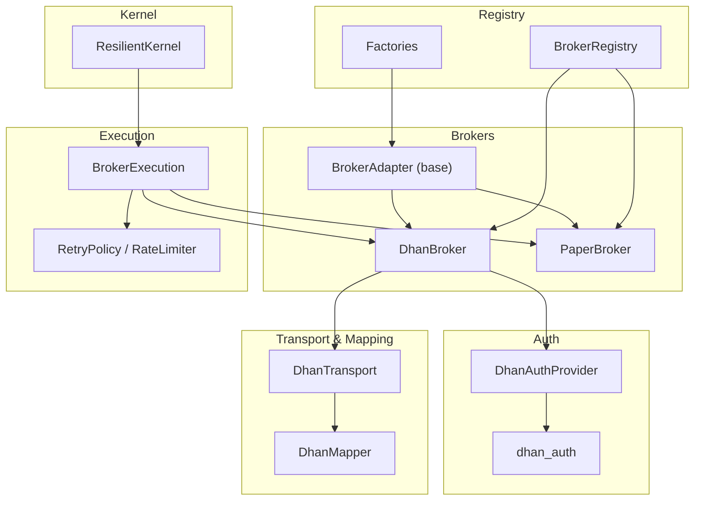
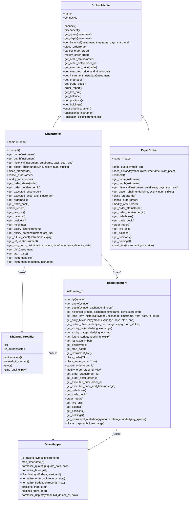
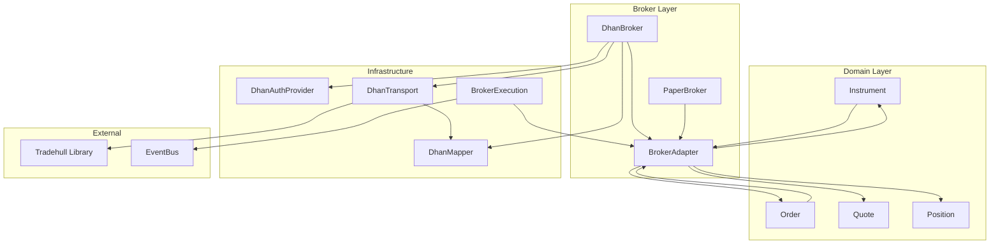

# Broker Integration

<cite>
**Referenced Files in This Document**
- [base.py](file://ntrade/brokers/base.py)
- [capabilities.py](file://ntrade/brokers/capabilities.py)
- [dhan.py](file://ntrade/brokers/dhan.py)
- [paper.py](file://ntrade/brokers/paper.py)
- [dhan_auth.py](file://ntrade/brokers/dhan_auth.py)
- [dhan_auth_provider.py](file://ntrade/brokers/dhan_auth_provider.py)
- [dhan_mapper.py](file://ntrade/brokers/dhan_mapper.py)
- [dhan_transport.py](file://ntrade/brokers/dhan_transport.py)
- [retry.py](file://ntrade/execution/retry.py)
- [broker_executor.py](file://ntrade/execution/broker_executor.py)
- [resilient.py](file://ntrade/kernel/resilient.py)
- [factories.py](file://ntrade/factories.py)
- [registry.py](file://ntrade/registry.py)
</cite>

## Table of Contents
1. [Introduction](#introduction)
2. [Project Structure](#project-structure)
3. [Core Components](#core-components)
4. [Architecture Overview](#architecture-overview)
5. [Detailed Component Analysis](#detailed-component-analysis)
6. [Dependency Analysis](#dependency-analysis)
7. [Performance Considerations](#performance-considerations)
8. [Troubleshooting Guide](#troubleshooting-guide)
9. [Conclusion](#conclusion)
10. [Appendices](#appendices)

## Introduction
This document explains the broker integration architecture that provides a unified interface for multiple trading platforms. It focuses on:
- The abstract BrokerAdapter base class and its contract
- DhanBroker implementation covering authentication, market data streaming, order placement, and position synchronization
- PaperBroker for testing and simulation with realistic fill behavior
- The capability system enabling broker-specific features via decorator-based registration
- Authentication mechanisms including token management, PIN+TOTP fallback, and credential storage
- Transport layer abstraction for API calls and message handling
- Mapper layer converting broker-specific wire formats into domain objects
- Error handling, retry mechanisms, and connection resilience patterns
- Security considerations, rate limiting, and compliance requirements for production deployments

## Project Structure
The broker subsystem is organized around a clear separation of concerns:
- Base adapter defines the broker contract
- Concrete adapters implement platform specifics (Dhan, Paper)
- Authentication provider manages lifecycle and refresh
- Transport encapsulates network calls and retries
- Mapper normalizes wire formats to domain models
- Capability system extends broker functionality dynamically
- Execution layer routes intents to brokers and handles lifecycle events
- Registry and factories manage broker instantiation and symbol caching



**Diagram sources**
- [base.py:25-163](file://ntrade/brokers/base.py#L25-L163)
- [dhan.py:54-630](file://ntrade/brokers/dhan.py#L54-L630)
- [paper.py:23-216](file://ntrade/brokers/paper.py#L23-L216)
- [dhan_auth_provider.py:28-142](file://ntrade/brokers/dhan_auth_provider.py#L28-L142)
- [dhan_auth.py:114-173](file://ntrade/brokers/dhan_auth.py#L114-L173)
- [dhan_transport.py:48-405](file://ntrade/brokers/dhan_transport.py#L48-L405)
- [dhan_mapper.py:35-356](file://ntrade/brokers/dhan_mapper.py#L35-L356)
- [broker_executor.py:46-262](file://ntrade/execution/broker_executor.py#L46-L262)
- [retry.py:19-98](file://ntrade/execution/retry.py#L19-L98)
- [resilient.py:17-147](file://ntrade/kernel/resilient.py#L17-L147)
- [registry.py:61-125](file://ntrade/registry.py#L61-L125)
- [factories.py:20-84](file://ntrade/factories.py#L20-L84)

**Section sources**
- [base.py:25-163](file://ntrade/brokers/base.py#L25-L163)
- [registry.py:61-125](file://ntrade/registry.py#L61-L125)
- [factories.py:20-84](file://ntrade/factories.py#L20-L84)

## Core Components
- BrokerAdapter: Abstract base defining connect/disconnect, market data retrieval, order lifecycle, portfolio queries, and subscription management. Provides timestamp resolution via an injectable clock for zero-parity replay.
- DhanBroker: Concrete adapter implementing Dhan-Tradehull integration with robust auth refresh, quote/history/depth retrieval, option chain fetching, order placement (including SEBI-compliant LIMIT conversion for F&O), and position/holding normalization.
- PaperBroker: In-memory broker for tests/backtests providing deterministic fills, synthetic depth, and option chains; supports push_tick for live-like streaming.
- DhanAuthProvider: Lifecycle manager for Tradehull instance with proactive token refresh using PIN+TOTP when APP tokens near expiry.
- DhanTransport: Network wrapper adding retry policies, graceful fallbacks, and consistent error propagation for critical endpoints.
- DhanMapper: Pure mapping functions for symbol formatting, timeframe normalization, quote/depth/history normalization, and order/trade book conversions.
- RetryPolicy and RateLimiter: Configurable exponential backoff with jitter and thread-safe token-bucket rate limiter.
- BrokerExecution: Orchestrates order submission, polling, timeout detection, and event emission for asynchronous broker lifecycles.
- ResilientKernel: Crash recovery by replaying causal events to rebuild state deterministically before resuming live trading.
- BrokerRegistry and Factories: Flyweight instrument caching and broker factory registration for uniform instantiation.

**Section sources**
- [base.py:25-163](file://ntrade/brokers/base.py#L25-L163)
- [dhan.py:54-630](file://ntrade/brokers/dhan.py#L54-L630)
- [paper.py:23-216](file://ntrade/brokers/paper.py#L23-L216)
- [dhan_auth_provider.py:28-142](file://ntrade/brokers/dhan_auth_provider.py#L28-L142)
- [dhan_transport.py:48-405](file://ntrade/brokers/dhan_transport.py#L48-L405)
- [dhan_mapper.py:35-356](file://ntrade/brokers/dhan_mapper.py#L35-L356)
- [retry.py:19-98](file://ntrade/execution/retry.py#L19-L98)
- [broker_executor.py:46-262](file://ntrade/execution/broker_executor.py#L46-L262)
- [resilient.py:17-147](file://ntrade/kernel/resilient.py#L17-L147)
- [registry.py:61-125](file://ntrade/registry.py#L61-L125)
- [factories.py:20-84](file://ntrade/factories.py#L20-L84)

## Architecture Overview
The broker integration follows a layered design:
- Domain layer uses BrokerAdapter exclusively; no direct REST/websocket access
- Adapter layer implements platform specifics (DhanBroker, PaperBroker)
- Auth provider manages credentials and token lifecycle
- Transport wraps network calls with retry and error handling
- Mapper converts wire formats to domain objects
- Execution layer orchestrates order lifecycle and events
- Kernel ensures crash recovery and zero-parity timestamps



**Diagram sources**
- [base.py:25-163](file://ntrade/brokers/base.py#L25-L163)
- [dhan.py:54-630](file://ntrade/brokers/dhan.py#L54-L630)
- [paper.py:23-216](file://ntrade/brokers/paper.py#L23-L216)
- [dhan_auth_provider.py:28-142](file://ntrade/brokers/dhan_auth_provider.py#L28-L142)
- [dhan_transport.py:48-405](file://ntrade/brokers/dhan_transport.py#L48-L405)
- [dhan_mapper.py:35-356](file://ntrade/brokers/dhan_mapper.py#L35-L356)

## Detailed Component Analysis

### BrokerAdapter Abstract Base Class
BrokerAdapter defines the unified interface for all broker implementations:
- Connection management with connect/disconnect and connected state
- Market data methods: get_quote, get_depth, get_historical, get_option_chain
- Order lifecycle: place_order, cancel_order, modify_order, get_order_status, get_order_detail
- Portfolio queries: get_live_pnl, get_balance, get_positions, get_holdings
- Streaming subscriptions: subscribe/unsubscribe with internal state tracking
- Timestamp resolution via injectable clock for zero-parity replay

Key design principles:
- Abstract methods enforce broker-specific implementations
- Optional methods raise NotImplementedError if unsupported
- Subscription multiplexing over shared transport managed by adapter
- Clock injection enables deterministic timestamps for replay scenarios

**Section sources**
- [base.py:25-163](file://ntrade/brokers/base.py#L25-L163)

### DhanBroker Implementation
DhanBroker implements the full BrokerAdapter contract for Dhan-Tradehull integration:

Authentication and Token Management:
- Uses DhanAuthProvider for lifecycle management
- Proactive token refresh before expiry using PIN+TOTP fallback
- Shared token storage with cooldown protection against TOTP attempts
- Environment variable configuration for client ID, access token, PIN, TOTP secret

Market Data Streaming:
- LTP fetching with retry logic due to intermittent failures
- Quote enrichment with OHLC, volume, and open interest data
- Depth data via websocket snapshot with timeout protection
- Historical data with timeframe validation and DAY endpoint routing for FUT contracts
- Option chain fetching with expiry fallback and ATM strike selection

Order Placement and Management:
- SEBI-compliant MARKET order conversion to LIMIT for F&O exchanges
- Bracket order support via dedicated super order API
- Order status polling with normalized status mapping
- Order modification and cancellation through OMS
- Executed price and time retrieval for completed orders

Position Synchronization:
- Position and holding normalization from DataFrame responses
- Balance retrieval without silent failure masking
- Instrument metadata extraction including tick size, lot size, freeze quantity

Error Handling:
- Robust exception handling throughout all operations
- Graceful degradation for non-critical endpoints
- Clear error propagation for critical operations like order placement

**Section sources**
- [dhan.py:54-630](file://ntrade/brokers/dhan.py#L54-L630)
- [dhan_auth_provider.py:28-142](file://ntrade/brokers/dhan_auth_provider.py#L28-L142)
- [dhan_auth.py:114-173](file://ntrade/brokers/dhan_auth.py#L114-L173)

### PaperBroker for Testing and Simulation
PaperBroker provides a complete BrokerAdapter implementation for testing and backtesting:

Realistic Fill Simulation:
- Immediate order completion with current LTP or specified price
- Synthetic depth generation with random quantities
- Deterministic history seeding with configurable parameters
- Option chain generation with ATM strikes and realistic pricing

Testing Features:
- Seed-based randomness for reproducible results
- Clock injection for replay compatibility
- Push tick functionality for live-like streaming simulation
- Complete order lifecycle support including cancellation and modification

Cost Modeling:
- Fixed initial balance for paper trading
- Realistic order IDs with sequential numbering
- Trade book and order book generation from executed orders

**Section sources**
- [paper.py:23-216](file://ntrade/brokers/paper.py#L23-L216)

### Capability System
The capability system enables broker-specific features through decorator-based registration:

Decorator Registration:
- @capability decorator registers functions with broker-specific availability
- Global capability registry stores name, function, and supported brokers
- Dynamic attribute resolution on instrument.broker.<capability>()

Feature Discovery:
- available() method lists capabilities supported by current broker
- AttributeError raised for unsupported capabilities (fail-fast pattern)
- __dir__ method includes registered capabilities for IDE support

Implementation Pattern:
- Capabilities are pure functions taking instrument as first parameter
- Broker name checking prevents cross-broker feature misuse
- Clean separation between core adapter interface and extended features

**Section sources**
- [capabilities.py:16-74](file://ntrade/brokers/capabilities.py#L16-L74)

### Authentication Mechanisms
Dhan authentication follows a multi-tiered approach:

Token Management:
- Shared token store with JSON persistence and secure file permissions
- JWT expiry parsing with proactive buffer (default 15 minutes)
- Automatic fallback to PIN+TOTP when tokens expire or are invalid

Credential Storage:
- Environment variables for DHAN_CLIENT_ID, DHAN_ACCESS_TOKEN, DHAN_PIN, DHAN_TOTP_SECRET
- Shared paths for token storage and cooldown management
- Secure file permissions (0o600) for sensitive files

Fallback Strategy:
1. Try shared token store if valid and not near expiry
2. Use .env access token if not provably expired
3. Fall back to PIN+TOTP with cooldown protection
4. Raise ConnectionError if all methods fail

Proactive Refresh:
- Background timer schedules refresh before token expiry
- Thread-safe refresh mechanism preventing concurrent attempts
- Silent refresh logging for operational visibility

**Section sources**
- [dhan_auth.py:114-173](file://ntrade/brokers/dhan_auth.py#L114-L173)
- [dhan_auth_provider.py:28-142](file://ntrade/brokers/dhan_auth_provider.py#L28-L142)

### Transport Layer Abstraction
DhanTransport provides a clean abstraction over Tradehull API calls:

Retry and Resilience:
- Configurable RetryPolicy with exponential backoff and jitter
- Graceful fallbacks for non-critical endpoints (returns empty/zero)
- Consistent error propagation for critical operations (orders)

Message Handling:
- WebSocket depth data with timeout protection using threading
- Normalized response formats across different endpoint types
- DataFrame to domain object conversion for positions and holdings

Clock Integration:
- Injected TradingClock for zero-parity timestamps
- Consistent timestamp resolution across all operations
- Replay compatibility for backtesting scenarios

Error Classification:
- BrokerDataError for market data failures that should not be silently ignored
- Exception wrapping with context for debugging
- Defensive programming patterns throughout

**Section sources**
- [dhan_transport.py:48-405](file://ntrade/brokers/dhan_transport.py#L48-L405)
- [retry.py:19-98](file://ntrade/execution/retry.py#L19-L98)

### Mapper Layer
DhanMapper provides pure data transformation functions:

Symbol Mapping:
- Conversion between domain instruments and Dhan tradingsymbols
- Support for both hyphenated and spaced option symbol formats
- Exchange-specific mappings for derivatives instruments

Data Normalization:
- Quote normalization with optional enrichment data
- History DataFrame normalization with column standardization
- Depth level creation from bid/ask DataFrames
- Order/trade book entry creation from raw records

Portfolio Mapping:
- Position and holding creation from DataFrame responses
- NaN-safe field extraction with fallback keys
- Product type and exchange normalization

Utility Functions:
- Type-safe scalar extraction (_f, _first_str, _first_int, _first_float)
- Record normalization for mixed input types (DataFrame, dict, list)
- Timeframe mapping with validation and error reporting

**Section sources**
- [dhan_mapper.py:35-356](file://ntrade/brokers/dhan_mapper.py#L35-L356)

### Execution Layer
BrokerExecution orchestrates order lifecycle management:

Submission Flow:
- Intent to order creation with proper type conversion
- Immediate OrderAcceptedEvent publication
- Synchronous vs asynchronous fill handling based on broker behavior

Lifecycle Polling:
- Periodic status refresh with stale order detection
- Timeout detection for PENDING orders beyond threshold
- Partial fill tracking with delta emission

Crash Recovery:
- Open order tracker restoration from EventStore deltas
- Sequence number bumping to prevent ID collisions
- State reconstruction without re-trading during recovery

Event Emission:
- OrderFilledEvent with partial fill support
- OrderRejectedEvent for failed orders
- OrderUpdatedEvent for status changes
- OrderTimeoutEvent for stale orders

**Section sources**
- [broker_executor.py:46-262](file://ntrade/execution/broker_executor.py#L46-L262)
- [resilient.py:17-147](file://ntrade/kernel/resilient.py#L17-L147)

## Dependency Analysis
The broker system exhibits clear dependency patterns:



**Diagram sources**
- [base.py:25-163](file://ntrade/brokers/base.py#L25-L163)
- [dhan.py:54-630](file://ntrade/brokers/dhan.py#L54-L630)
- [paper.py:23-216](file://ntrade/brokers/paper.py#L23-L216)
- [dhan_auth_provider.py:28-142](file://ntrade/brokers/dhan_auth_provider.py#L28-L142)
- [dhan_transport.py:48-405](file://ntrade/brokers/dhan_transport.py#L48-L405)
- [dhan_mapper.py:35-356](file://ntrade/brokers/dhan_mapper.py#L35-L356)
- [broker_executor.py:46-262](file://ntrade/execution/broker_executor.py#L46-L262)

**Section sources**
- [registry.py:61-125](file://ntrade/registry.py#L61-L125)
- [factories.py:20-84](file://ntrade/factories.py#L20-L84)

## Performance Considerations
Several performance optimizations are implemented throughout the broker system:

Connection Pooling:
- Single Tradehull instance per broker with shared authentication
- Lazy initialization of transport components
- Reuse of instrument metadata and cached responses

Memory Efficiency:
- Flyweight pattern for instrument instances via SymbolMaster
- Generator-based retry delays to minimize memory usage
- Efficient DataFrame operations with minimal copying

Network Optimization:
- Exponential backoff with jitter to reduce server load
- Batch operations where possible (option chains, historical data)
- Timeout protection for blocking operations (websocket depth)

Timestamp Resolution:
- Zero-parity clock injection eliminates wall-clock dependencies
- Minimal timestamp computation overhead
- Consistent time source across all components

Rate Limiting:
- Token bucket algorithm for API call throttling
- Configurable limits per broker requirements
- Cooldown protection for TOTP authentication attempts

[No sources needed since this section provides general guidance]

## Troubleshooting Guide
Common issues and their resolutions:

Authentication Failures:
- Verify environment variables are correctly set
- Check shared token file permissions and expiration
- Ensure PIN+TOTP credentials are valid and not on cooldown
- Review login success indicators (instrument_df and Dhan attributes)

Market Data Issues:
- LTP returns zero after retries indicates network or API problems
- Depth data timeouts suggest websocket connectivity issues
- Historical data failures may indicate unsupported timeframes or instruments

Order Placement Problems:
- SEBI compliance requires LIMIT orders for F&O markets
- Bracket orders require specific API endpoints
- Order status polling failures may indicate stale connections

Connection Resilience:
- Monitor proactive token refresh logs
- Check for stale order eviction warnings
- Verify event bus connectivity for order lifecycle events

Security Considerations:
- Validate file permissions for credential storage
- Monitor TOTP attempt cooldown periods
- Review error messages for sensitive information leakage

**Section sources**
- [dhan_auth.py:114-173](file://ntrade/brokers/dhan_auth.py#L114-L173)
- [dhan_transport.py:48-405](file://ntrade/brokers/dhan_transport.py#L48-L405)
- [broker_executor.py:46-262](file://ntrade/execution/broker_executor.py#L46-L262)

## Conclusion
The broker integration architecture provides a robust, extensible foundation for multi-platform trading integration. Key strengths include:

- Clean separation of concerns through layered architecture
- Comprehensive error handling and resilience patterns
- Flexible capability system for broker-specific features
- Strong security model with multiple authentication fallbacks
- Zero-parity timestamp support for deterministic replay
- Extensive testing support through PaperBroker implementation

The design successfully abstracts broker complexities while maintaining high performance and reliability standards suitable for production deployments.

[No sources needed since this section summarizes without analyzing specific files]

## Appendices

### Implementing Custom Broker Adapters
To create a custom broker adapter:

1. Extend BrokerAdapter and implement required abstract methods
2. Handle authentication and connection management
3. Implement market data retrieval with appropriate error handling
4. Support order lifecycle operations (placement, cancellation, modification)
5. Provide portfolio query methods for positions and holdings
6. Implement streaming subscriptions if supported by the broker

Example structure:
```python
class MyBroker(BrokerAdapter):
    name = "my_broker"
    
    def connect(self):
        # Implement connection logic
        pass
    
    def get_quote(self, instrument):
        # Implement quote retrieval
        pass
    
    def place_order(self, order):
        # Implement order placement
        pass
```

### Registering Capabilities
Capabilities extend broker functionality through decorators:

```python
from ntrade.brokers.capabilities import capability

@capability("custom_feature", brokers=("dhan",))
def custom_feature(instrument, param1=None):
    # Implementation for broker-specific feature
    pass
```

Access capabilities through instrument.broker.<capability_name>(params).

### Handling Broker-Specific Order Types
Different brokers support various order types. Common patterns include:

- Standard orders (LIMIT, MARKET)
- Advanced orders (BRACKET, STOPLOSS)
- Conditional orders (TRIGGER, COVER)

Map broker-specific types to domain OrderType enum and handle conversion appropriately.

### Error Handling Patterns
Implement consistent error handling:

- Use specific exception types for different failure modes
- Log detailed error context for debugging
- Provide meaningful error messages to callers
- Implement graceful degradation for non-critical operations

### Security Best Practices
- Store credentials securely with appropriate file permissions
- Use environment variables for sensitive configuration
- Implement token rotation and automatic refresh
- Audit authentication attempts and failures
- Sanitize error messages to prevent information leakage

### Compliance Requirements
- Follow regulatory requirements for order types and execution
- Implement proper audit trails for all trading activities
- Ensure accurate position and trade reporting
- Support risk management controls and circuit breakers
- Maintain data retention policies for regulatory compliance

[No sources needed since this section provides general guidance]