# Dhan Broker Implementation

<cite>
**Referenced Files in This Document**
- [dhan.py](file://ntrade/brokers/dhan.py)
- [dhan_auth.py](file://ntrade/brokers/dhan_auth.py)
- [dhan_transport.py](file://ntrade/brokers/dhan_transport.py)
- [dhan_mapper.py](file://ntrade/brokers/dhan_mapper.py)
- [dhan_auth_provider.py](file://ntrade/brokers/dhan_auth_provider.py)
- [rate_limit.py](file://ntrade/execution/rate_limit.py)
- [base.py](file://ntrade/brokers/base.py)
- [order.py](file://ntrade/domain/orders/order.py)
- [quote.py](file://ntrade/domain/market/quote.py)
- [portfolio.py](file://ntrade/domain/portfolio.py)
- [retry.py](file://ntrade/execution/retry.py)
- [test_dhan_broker.py](file://tests/test_dhan_broker.py)
- [test_dhan_auth_unit.py](file://tests/test_dhan_auth_unit.py)
- [test_contract_auth_observability.py](file://tests/test_contract_auth_observability.py)
- [check_connection.py](file://check_connection.py)
- [test_rate_limit.py](file://tests/test_rate_limit.py)
- [test_rate_gate_integration.py](file://tests/test_rate_gate_integration.py)
</cite>

## Update Summary
**Changes Made**
- Enhanced rate-limiting propagation with comprehensive RateLimited exception handling across all data retrieval methods including get_orderbook(), get_trade_book(), get_expiry_list(), and other broker methods
- Added detailed docstrings explaining rate-limit behavior and error handling consistency throughout the broker implementation
- Updated documentation to reflect the K-021 findings where rate-limit rejections now properly propagate instead of being masked as empty results
- Strengthened error handling patterns to prevent silent failures that could lead to incorrect trading decisions

## Table of Contents
1. [Introduction](#introduction)
2. [Project Structure](#project-structure)
3. [Core Components](#core-components)
4. [Architecture Overview](#architecture-overview)
5. [Detailed Component Analysis](#detailed-component-analysis)
6. [Dependency Analysis](#dependency-analysis)
7. [Performance Considerations](#performance-considerations)
8. [Troubleshooting Guide](#troubleshooting-guide)
9. [Conclusion](#conclusion)
10. [Appendices](#appendices)

## Introduction
This document explains the DhanBroker implementation that integrates with the Dhan trading platform via the Dhan-Tradehull library. The implementation follows a clean separation of concerns with a three-layer architecture: authentication lifecycle management, transport abstraction for API calls, and data mapping for domain object conversion. 

The architecture has been refactored to delegate all data calls through DhanTransport while maintaining the same public API surface, reducing the broker class complexity and improving maintainability. **Critical architectural principle**: The authentication lifecycle is completely independent from observability - stopping authentication never emits heartbeat, feed, or order events, ensuring clean separation between connection management and system monitoring.

The transport layer provides comprehensive retry policies, sophisticated multi-window rate limiting with quota management, timestamp resolution, and consistent error handling for all Dhan API interactions. Recent hardening improvements include enhanced timeframe handling for sub-5m resampling, atomic authentication refresh operations, and thread-safe lifecycle management to prevent race conditions.

**Updated** The implementation now features enhanced rate-limiting propagation with proper RateLimited exception handling across all data retrieval methods, ensuring that rate-limit violations are never silently masked as empty results, which could lead to incorrect trading decisions.

## Project Structure
The Dhan integration is organized into a clear separation of concerns following the provider pattern:
- Authentication lifecycle and credential storage via DhanAuthProvider
- Transport layer wrapping Tradehull calls with retry, normalization, and sophisticated rate limiting via DhanTransport  
- Mapper layer converting Dhan responses to domain models via DhanMapper
- Broker adapter implementing the broker interface and orchestrating components via DhanBroker
- Domain models for orders, quotes, positions, and holdings
- Resilience utilities for retries and advanced rate limiting via BrokerRateGate

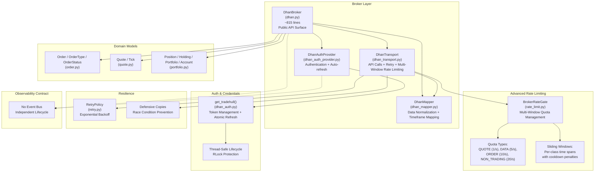

**Diagram sources**
- [dhan.py:51-75](file://ntrade/brokers/dhan.py#L51-L75)
- [dhan_auth_provider.py:28-88](file://ntrade/brokers/dhan_auth_provider.py#L28-88)
- [dhan_transport.py:54-69](file://ntrade/brokers/dhan_transport.py#L54-69)
- [dhan_mapper.py:35-73](file://ntrade/brokers/dhan_mapper.py#L35-73)
- [rate_limit.py:76-103](file://ntrade/execution/rate_limit.py#L76-103)
- [dhan_auth.py:114-167](file://ntrade/brokers/dhan_auth.py#L114-167)
- [order.py:14-41](file://ntrade/domain/orders/order.py#L14-41)
- [quote.py:9-28](file://ntrade/domain/market/quote.py#L9-28)
- [portfolio.py:19-61](file://ntrade/domain/portfolio.py#L19-61)
- [retry.py:19-68](file://ntrade/execution/retry.py#L19-68)

**Section sources**
- [dhan.py:51-75](file://ntrade/brokers/dhan.py#L51-L75)
- [base.py:25-69](file://ntrade/brokers/base.py#L25-69)

## Core Components
- **DhanBroker**: Implements the BrokerAdapter interface for Dhan, orchestrating auth, transport, and mapping. Now delegates all data calls through DhanTransport while maintaining the same public API surface. Handles quote retrieval, historical data, option chains, order placement/cancellation/modification, order/trade books, positions, holdings, and balances. **Critical**: The broker has no event bus and publishes no observability events during lifecycle operations. **Enhanced**: All data retrieval methods now properly propagate RateLimited exceptions instead of masking them as empty results.
- **DhanAuthProvider**: Manages authentication lifecycle, including proactive token refresh using PIN+TOTP when tokens near expiry. Provides automatic background refresh to prevent mid-session failures with thread-safe atomic operations. **Important**: Auth lifecycle is independent of observability - stopping auth never emits heartbeat/feed/order events.
- **DhanTransport**: Central API call coordinator that wraps Tradehull API calls with retry policies, sophisticated multi-window rate limiting via BrokerRateGate, timestamp resolution, and consistent error handling; exposes normalized methods for LTP, quotes, depth, history, options, and order operations.
- **BrokerRateGate**: Thread-safe multi-window rate limiter that enforces Dhan's documented rate limit table across multiple quota classes (QUOTE, DATA, ORDER, NON_TRADING) with sliding windows and penalty mechanisms.
- **DhanMapper**: Pure functions to map Dhan-specific wire formats into ntrade domain objects (quotes, depth, order/trade books, positions, holdings) with enhanced timeframe mapping logic for sub-5m resampling.
- **Domain Models**: Order, Quote, Position, Holding, Portfolio, Account define the canonical abstractions used by engines and strategies.
- **RetryPolicy**: Provides exponential backoff with jitter for resilient API usage, with intelligent rate limit detection to avoid retrying quota violations.

**Section sources**
- [dhan.py:51-75](file://ntrade/brokers/dhan.py#L51-L75)
- [dhan_auth_provider.py:28-88](file://ntrade/brokers/dhan_auth_provider.py#L28-88)
- [dhan_transport.py:54-69](file://ntrade/brokers/dhan_transport.py#L54-69)
- [rate_limit.py:76-103](file://ntrade/execution/rate_limit.py#L76-103)
- [dhan_mapper.py:35-73](file://ntrade/brokers/dhan_mapper.py#L35-73)
- [order.py:14-41](file://ntrade/domain/orders/order.py#L14-41)
- [quote.py:9-28](file://ntrade/domain/market/quote.py#L9-28)
- [portfolio.py:19-61](file://ntrade/domain/portfolio.py#L19-61)
- [retry.py:19-68](file://ntrade/execution/retry.py#L19-68)

## Architecture Overview
The DhanBroker composes three primary subsystems with a clear delegation pattern and strict separation from observability:
- **Authentication** via DhanAuthProvider and dhan_auth.get_tradehull, which supports shared token store, JWT expiry checks, and PIN+TOTP fallback with proactive refresh. **Auth lifecycle is independent of observability**.
- **Transport** via DhanTransport, which encapsulates all Tradehull interactions with retry, sophisticated multi-window rate limiting via BrokerRateGate, and normalization.
- **Mapping** via DhanMapper, which converts raw Dhan responses into domain objects with enhanced timeframe handling.

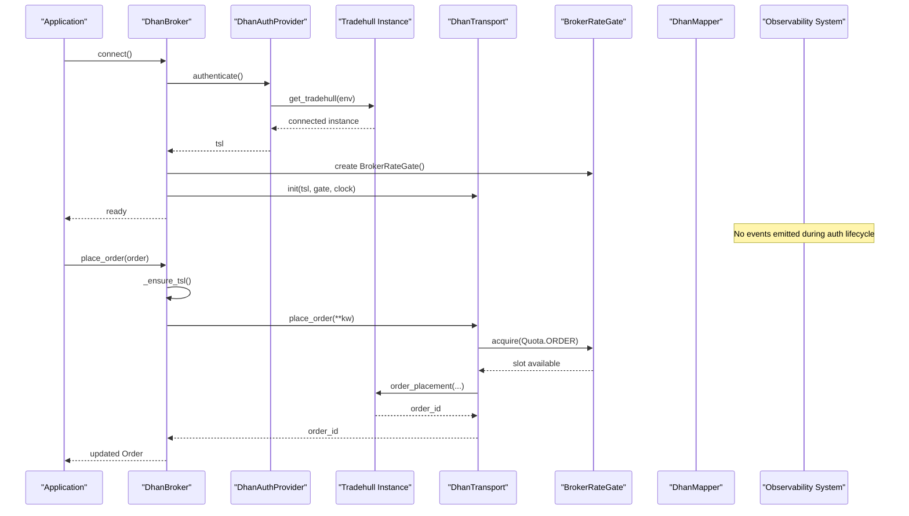

**Diagram sources**
- [dhan.py:66-75](file://ntrade/brokers/dhan.py#L66-75)
- [dhan_auth_provider.py:47-56](file://ntrade/brokers/dhan_auth_provider.py#L47-56)
- [dhan_auth.py:114-167](file://ntrade/brokers/dhan_auth.py#L114-167)
- [dhan_transport.py:88-115](file://ntrade/brokers/dhan_transport.py#L88-115)
- [rate_limit.py:105-121](file://ntrade/execution/rate_limit.py#L105-121)

## Detailed Component Analysis

### Enhanced Timeframe Handling and Sub-5m Resampling
**Updated** The timeframe handling system now includes comprehensive support for sub-5m resampling, addressing the critical issue where Dhan's backend only supports 1/5/15/25/60m + DAY intervals natively.

- **Native Timeframe Support**: Direct mapping for supported intervals (1m, 5m, 15m, 25m, 60m, DAY)
- **Sub-5m Resampling Logic**: 2m/3m/4m timeframes are automatically converted to fetch 1m base data and resample using pandas
- **Error Prevention**: Unsupported timeframes raise ValueError immediately instead of silently failing
- **OHLCV Safety**: Resampling preserves OHLC semantics (open=first, high=max, low=min, close=last, volume/oi=sum)
- **Market Session Alignment**: Resampling anchored at 09:15 IST market open to prevent night-session candle bleeding

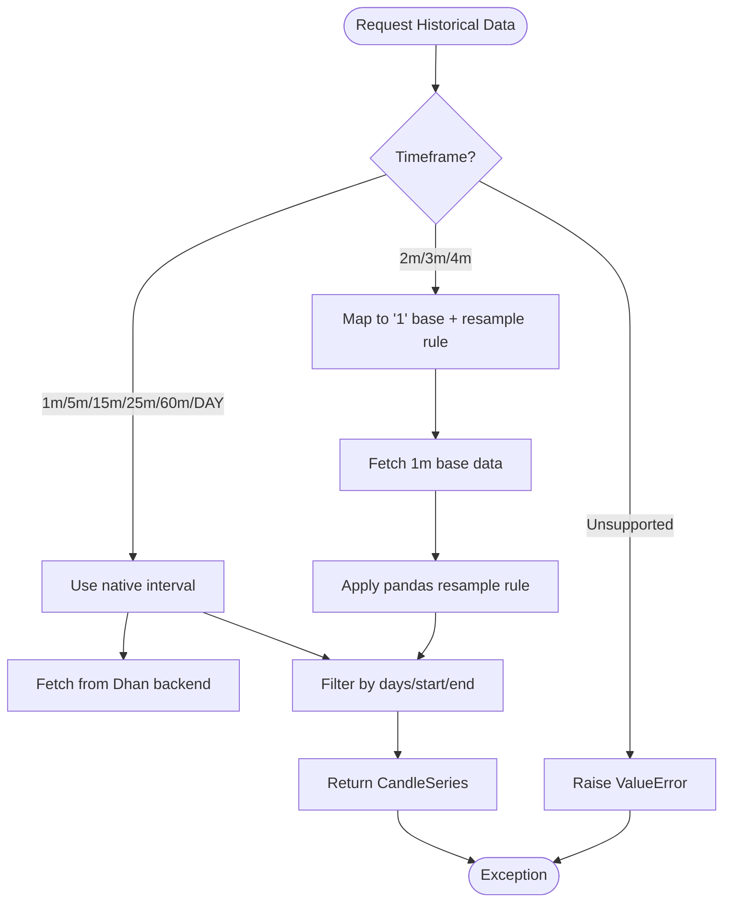

**Diagram sources**
- [dhan_mapper.py:75-92](file://ntrade/brokers/dhan_mapper.py#L75-92)
- [dhan_mapper.py:100-134](file://ntrade/brokers/dhan_mapper.py#L100-134)
- [dhan_transport.py:219-238](file://ntrade/brokers/dhan_transport.py#L219-238)

**Section sources**
- [dhan_mapper.py:75-92](file://ntrade/brokers/dhan_mapper.py#L75-92)
- [dhan_mapper.py:100-134](file://ntrade/brokers/dhan_mapper.py#L100-134)
- [test_dhan_broker.py:114-126](file://tests/test_dhan_broker.py#L114-126)
- [test_dhan_transport.py:126-154](file://tests/test_dhan_transport.py#L126-154)

### Authentication Robustness and Atomic Refresh Operations
**Updated** Enhanced authentication system with atomic refresh operations and thread-safe lifecycle management to prevent race conditions and token churn.

- **Atomic Refresh Operations**: `refresh_if_needed()` uses RLock to ensure thread-safe check-and-refresh operations
- **Proactive Token Refresh**: Background timer schedules refresh before token expiry (EXPIRY_BUFFER_S = 900 seconds)
- **Improved Error Handling**: Only clears shared token store on invalid-token signals (DH-906), not transient failures
- **Thread-Safe Lifecycle**: All authentication operations protected by threading.RLock to prevent concurrent TOTP minting
- **Graceful Degradation**: Silent failures in proactive refresh logged but don't crash the application
- **Security Enhancements**: Restrictive file permissions (0o600) for token and cooldown files

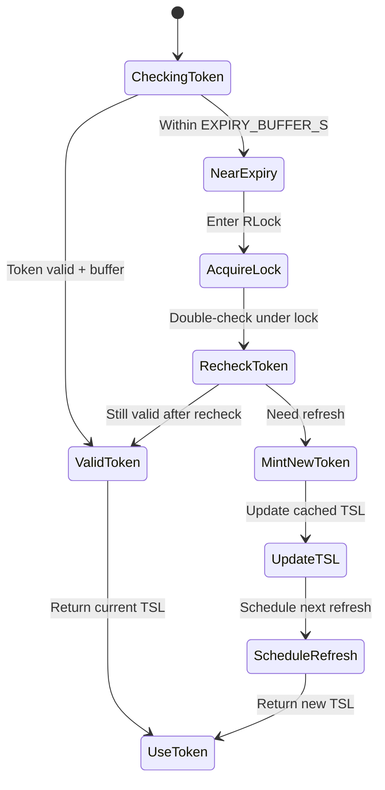

**Diagram sources**
- [dhan_auth_provider.py:69-88](file://ntrade/brokers/dhan_auth_provider.py#L69-88)
- [dhan_auth_provider.py:118-146](file://ntrade/brokers/dhan_auth_provider.py#L118-146)
- [dhan_auth.py:137-186](file://ntrade/brokers/dhan_auth.py#L137-186)

**Section sources**
- [dhan_auth_provider.py:69-88](file://ntrade/brokers/dhan_auth_provider.py#L69-88)
- [dhan_auth_provider.py:118-146](file://ntrade/brokers/dhan_auth_provider.py#L118-146)
- [dhan_auth.py:137-186](file://ntrade/brokers/dhan_auth.py#L137-186)
- [test_dhan_auth_unit.py:179-200](file://tests/test_dhan_auth_unit.py#L179-200)

### Race Condition Prevention and Defensive Programming
**Updated** Comprehensive race condition prevention mechanisms throughout the authentication and transport layers.

- **Thread-Safe Authentication**: RLock prevents concurrent TOTP login attempts during token refresh
- **Defensive Copies**: DataFrame operations use `.copy()` to prevent unintended mutations
- **Atomic State Updates**: Token updates happen atomically within lock context
- **Concurrent Access Protection**: All rate limiting operations are thread-safe with proper locking
- **Safe File Operations**: Token and cooldown file operations wrapped in try-except blocks
- **Null Safety**: Extensive null checks prevent NoneType errors in concurrent scenarios

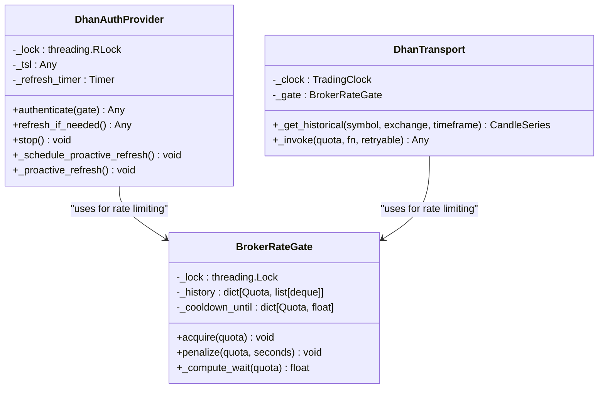

**Diagram sources**
- [dhan_auth_provider.py:28-48](file://ntrade/brokers/dhan_auth_provider.py#L28-48)
- [rate_limit.py:76-103](file://ntrade/execution/rate_limit.py#L76-103)
- [dhan_transport.py:54-69](file://ntrade/brokers/dhan_transport.py#L54-69)

**Section sources**
- [dhan_auth_provider.py:28-48](file://ntrade/brokers/dhan_auth_provider.py#L28-48)
- [rate_limit.py:76-103](file://ntrade/execution/rate_limit.py#L76-103)
- [dhan_transport.py:54-69](file://ntrade/brokers/dhan_transport.py#L54-69)

### Advanced Rate Limiting Infrastructure
**Updated** The system now uses BrokerRateGate, a sophisticated multi-window rate limiting infrastructure that replaces the old simple 10/s LTP-only limiter with comprehensive quota management:

- **Multi-Quota Support**: Four distinct quota classes matching Dhan's documented rate limits:
  - **QUOTE**: 1 request per second (for LTP and quote data)
  - **DATA**: 5 requests per second, 100,000 per day (for market data)
  - **ORDER**: 10 requests per second, 250/min, 1000/hour, 7000/day (for order operations)
  - **NON_TRADING**: 20 requests per second (for account/utility operations)
- **Sliding Window Implementation**: Real sliding windows using deques of timestamps rather than fixed intervals, allowing precise rate control
- **Penalty Mechanism**: Automatic backoff after rate limit violations (DH-904 errors) with configurable cooldown periods
- **Thread Safety**: All rate limiting operations are thread-safe with proper locking
- **Injectable Clock/Sleep**: Deterministic testing support with fake clock and sleep injection

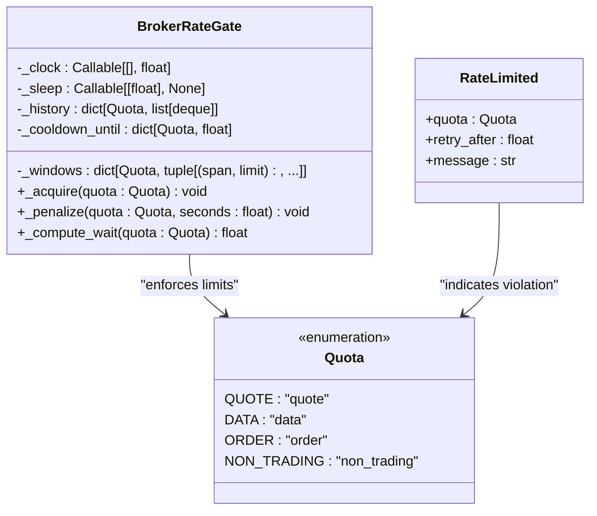

**Diagram sources**
- [rate_limit.py:76-103](file://ntrade/execution/rate_limit.py#L76-103)
- [rate_limit.py:31-38](file://ntrade/execution/rate_limit.py#L31-38)
- [rate_limit.py:50-62](file://ntrade/execution/rate_limit.py#L50-62)

**Section sources**
- [rate_limit.py:1-147](file://ntrade/execution/rate_limit.py#L1-147)
- [test_rate_limit.py:1-170](file://tests/test_rate_limit.py#L1-170)
- [test_rate_gate_integration.py:1-200](file://tests/test_rate_gate_integration.py#L1-200)

### Enhanced Rate-Limiting Propagation and Error Handling
**Updated** The broker implementation now features comprehensive rate-limiting propagation with proper RateLimited exception handling across all data retrieval methods. This addresses the critical K-021 finding where rate-limit rejections were being masked as empty results, potentially leading to incorrect trading decisions.

- **Consistent Exception Propagation**: All data retrieval methods now explicitly catch and re-raise RateLimited exceptions instead of masking them
- **Comprehensive Docstrings**: Each method includes detailed documentation about rate-limit behavior and error handling patterns
- **Protected Critical Methods**: get_orderbook(), get_trade_book(), get_expiry_list(), get_lot_size(), and other critical methods now properly propagate rate-limit exceptions
- **Preserved Degradation Patterns**: Non-rate-limit errors continue to degrade gracefully (e.g., returning empty OrderBook for network failures)
- **Test Coverage**: Comprehensive test coverage ensures rate-limit exceptions are properly propagated while preserving existing degradation behavior

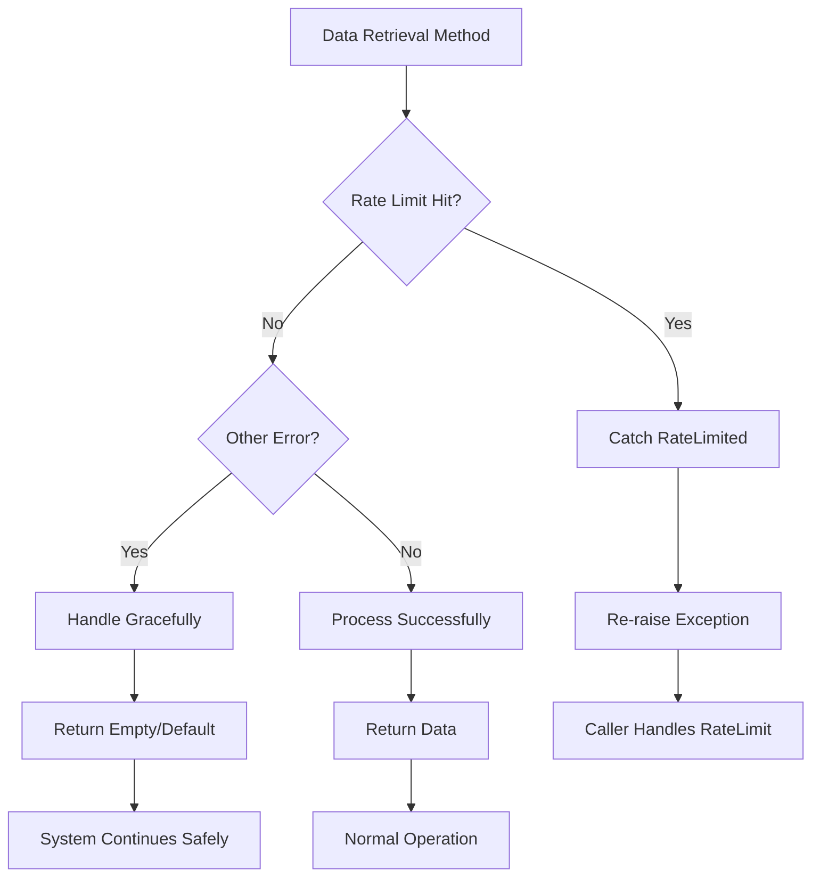

**Diagram sources**
- [dhan.py:405-418](file://ntrade/brokers/dhan.py#L405-418)
- [dhan.py:420-433](file://ntrade/brokers/dhan.py#L420-433)
- [dhan.py:469-481](file://ntrade/brokers/dhan.py#L469-481)
- [test_dhan_broker.py:698-764](file://tests/test_dhan_broker.py#L698-764)

**Section sources**
- [dhan.py:405-418](file://ntrade/brokers/dhan.py#L405-418)
- [dhan.py:420-433](file://ntrade/brokers/dhan.py#L420-433)
- [dhan.py:469-481](file://ntrade/brokers/dhan.py#L469-481)
- [test_dhan_broker.py:698-764](file://tests/test_dhan_broker.py#L698-764)

### Transport Layer Abstraction
**Updated** DhanTransport serves as the central coordinator for all Dhan API calls, providing comprehensive error handling, retry logic, and sophisticated multi-window rate limiting through BrokerRateGate:

- **Centralized API Access**: All data-plane calls now flow through DhanTransport methods rather than direct Tradehull calls
- **Rate Gate Integration**: Every `_tsl.*` call passes through `_invoke(quota, fn)` which acquires the appropriate quota window before execution
- **Intelligent Retry Policy**: Automatic retry with exponential backoff for transient failures, but never retries rate limit violations
- **Consistent Timestamp Resolution**: Uses injected clock or wall clock for replay parity
- **Response Normalization**: Graceful fallbacks for non-critical endpoints and consistent error propagation
- **WebSocket Protection**: Timeout-bounded market depth snapshots to prevent blocking
- **Enhanced Error Handling**: Raises `BrokerDataError` for failed data operations instead of returning empty results

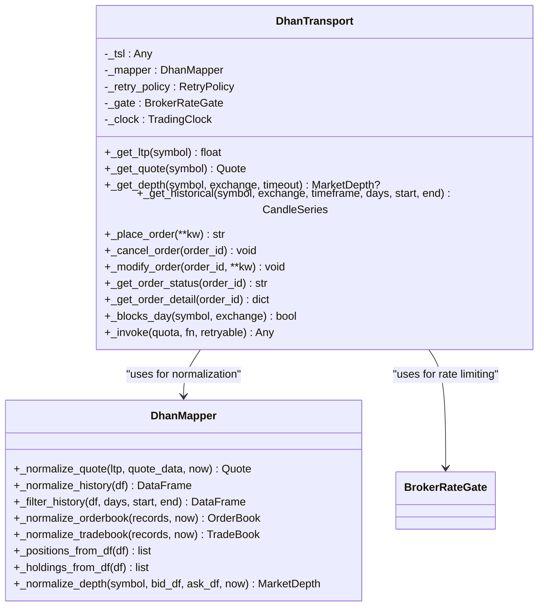

**Diagram sources**
- [dhan_transport.py:54-69](file://ntrade/brokers/dhan_transport.py#L54-69)
- [dhan_mapper.py:74-136](file://ntrade/brokers/dhan_mapper.py#L74-136)

**Section sources**
- [dhan_transport.py:54-69](file://ntrade/brokers/dhan_transport.py#L54-69)
- [dhan_transport.py:88-115](file://ntrade/brokers/dhan_transport.py#L88-115)
- [dhan_mapper.py:74-136](file://ntrade/brokers/dhan_mapper.py#L74-136)

### Mapper Layer: Instrument Mapping, Quote Normalization, Order Status Translation
- **Instrument symbol mapping**: Converts domain instruments to Dhan tradingsymbols, especially for options where the "spaced" custom format is required.
- **Quote normalization**: Builds immutable Quote objects with optional enrichment from quote data.
- **History normalization**: Lowercases columns and filters by days/start/end.
- **Order/trade book normalization**: Maps varied field names into consistent structures.
- **Positions/holdings normalization**: Converts DataFrames into domain objects safely.
- **Depth normalization**: Builds MarketDepth from bid/ask DataFrames.
- **Enhanced Timeframe Mapping**: Improved mapping logic with proper error handling for unsupported timeframes.

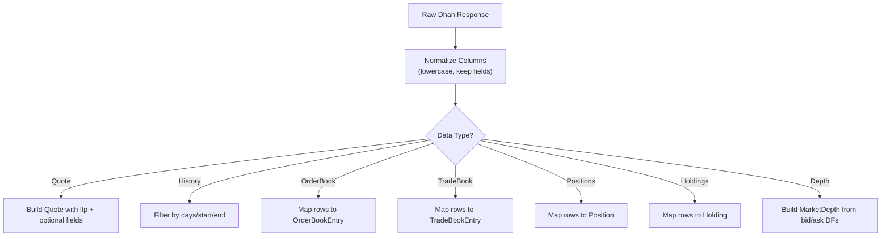

**Diagram sources**
- [dhan_mapper.py:74-136](file://ntrade/brokers/dhan_mapper.py#L74-136)
- [dhan_mapper.py:139-215](file://ntrade/brokers/dhan_mapper.py#L139-215)
- [dhan_mapper.py:218-239](file://ntrade/brokers/dhan_mapper.py#L218-239)

**Section sources**
- [dhan_mapper.py:35-73](file://ntrade/brokers/dhan_mapper.py#L35-73)
- [dhan_mapper.py:74-136](file://ntrade/brokers/dhan_mapper.py#L74-136)
- [dhan_mapper.py:139-215](file://ntrade/brokers/dhan_mapper.py#L139-215)
- [dhan_mapper.py:218-239](file://ntrade/brokers/dhan_mapper.py#L218-239)

### Order Placement and Lifecycle
- **Supported order types**: LIMIT, MARKET, STOP_LIMIT, STOP_MARKET, COVER, BRACKET.
- **SEBI compliance**: For F&O exchanges, MARKET orders are converted to LIMIT using LTP-derived price.
- **Bracket orders**: Route through dedicated super-order endpoint with entry/target/stop legs.
- **Partial fills**: Order status includes PARTIALLY_FILLED; detail queries update filled_qty and avg_price.
- **Idempotency**: Place order returns an Order with assigned order_id; subsequent status/detail calls use this ID.
- **Rate Limiting**: All order operations consume ORDER quota tokens through BrokerRateGate.

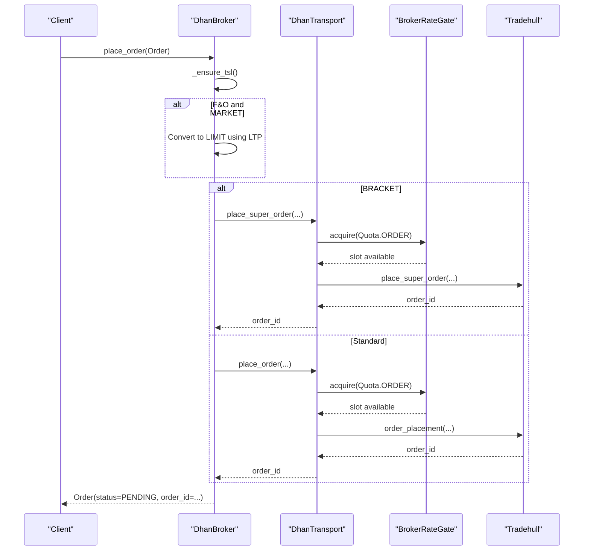

**Diagram sources**
- [dhan.py:237-290](file://ntrade/brokers/dhan.py#L237-290)
- [order.py:14-41](file://ntrade/domain/orders/order.py#L14-41)

**Section sources**
- [dhan.py:237-290](file://ntrade/brokers/dhan.py#L237-290)
- [order.py:14-41](file://ntrade/domain/orders/order.py#L14-41)

### Market Data Streaming and Depth
- **LTP and quotes**: Retries on flaky endpoints; enriches with OHLC, volume, OI. Each quote consumes 2 QUOTE tokens (LTP + quote data).
- **Historical data**: Supports intraday and daily endpoints; routes DAY requests appropriately based on instrument type/exchange.
- **Option chain**: Fetches ATM and chain dataframe; resolves real expiry dates and sets chain metadata.
- **Depth**: WebSocket snapshot bounded by timeout; returns normalized MarketDepth.
- **Rate Limiting**: Market data operations consume appropriate quota classes (QUOTE for LTP/quotes, DATA for historical data).

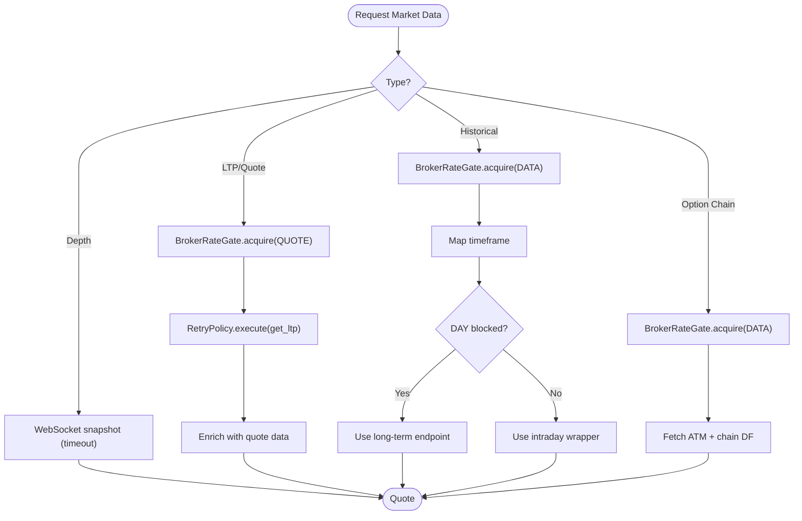

**Diagram sources**
- [dhan.py:144-174](file://ntrade/brokers/dhan.py#L144-174)
- [dhan.py:165-186](file://ntrade/brokers/dhan.py#L165-186)
- [dhan.py:188-234](file://ntrade/brokers/dhan.py#L188-234)
- [dhan.py:151-163](file://ntrade/brokers/dhan.py#L151-163)

**Section sources**
- [dhan.py:144-174](file://ntrade/brokers/dhan.py#L144-174)
- [dhan.py:165-186](file://ntrade/brokers/dhan.py#L165-186)
- [dhan.py:188-234](file://ntrade/brokers/dhan.py#L188-234)
- [dhan.py:151-163](file://ntrade/brokers/dhan.py#L151-163)

### Position Synchronization, Portfolio Updates, and Balance Tracking
- **Positions**: Returned as domain Position objects; raises on fetch failure to preserve state during reconciliation.
- **Holdings**: Returned as domain Holding objects; empty list on failure.
- **Balance**: Returns float; consumers guard against network blips.
- **Live P&L**: Broker-reported live P&L aggregated in Portfolio.

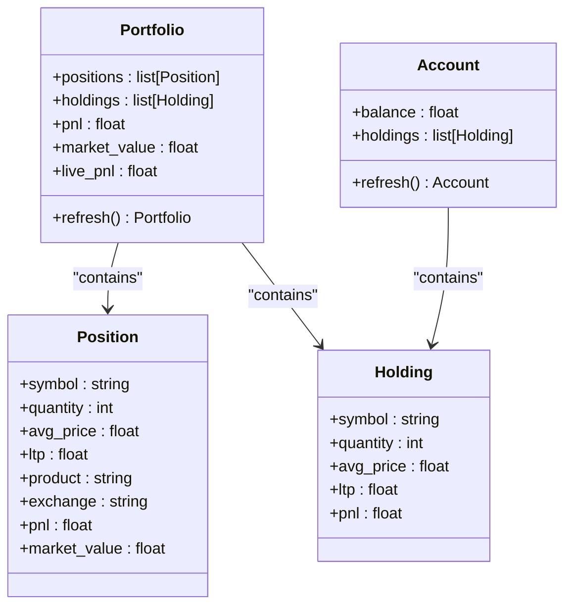

**Diagram sources**
- [portfolio.py:63-135](file://ntrade/domain/portfolio.py#L63-135)
- [portfolio.py:137-173](file://ntrade/domain/portfolio.py#L137-173)
- [portfolio.py:19-61](file://ntrade/domain/portfolio.py#L19-61)

**Section sources**
- [dhan.py:372-387](file://ntrade/brokers/dhan.py#L372-387)
- [portfolio.py:63-135](file://ntrade/domain/portfolio.py#L63-135)
- [portfolio.py:137-173](file://ntrade/domain/portfolio.py#L137-173)

### Authentication Lifecycle and Observability Independence
**Updated** Enhanced documentation to clarify the critical contract that authentication lifecycle operates completely independently from observability systems.

The DhanBroker and DhanAuthProvider have no event bus and publish no observability events whatsoever. When `broker.stop()` is called, it only cancels the auth provider's token-refresh timer without triggering any HeartbeatEvent, FeedDisconnectedEvent, or OrderTimeoutEvent. This separation ensures that authentication state changes cannot affect system monitoring and alerting.

Key aspects of this contract:
- **No Event Bus**: DhanBroker has no `bus` attribute and no `publish` method
- **Timer-only Shutdown**: `stop()` method only cancels `_refresh_timer` in DhanAuthProvider
- **Clean Separation**: Auth lifecycle changes are invisible to observability systems
- **Tested Contract**: Explicitly verified in `test_contract_auth_observability.py`

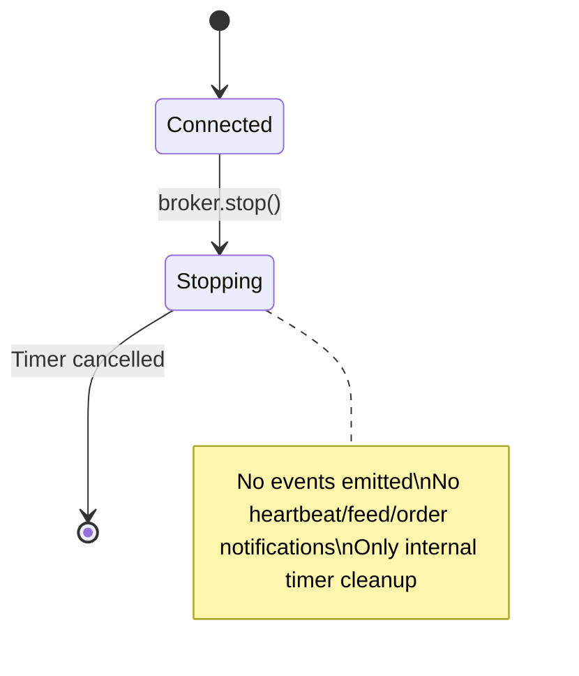

**Diagram sources**
- [dhan.py:127-131](file://ntrade/brokers/dhan.py#L127-131)
- [dhan_auth_provider.py:76-79](file://ntrade/brokers/dhan_auth_provider.py#L76-79)
- [test_contract_auth_observability.py:15-32](file://tests/test_contract_auth_observability.py#L15-32)

**Section sources**
- [dhan.py:127-131](file://ntrade/brokers/dhan.py#L127-131)
- [dhan_auth_provider.py:76-79](file://ntrade/brokers/dhan_auth_provider.py#L76-79)
- [test_contract_auth_observability.py:1-32](file://tests/test_contract_auth_observability.py#L1-32)

## Dependency Analysis
- **DhanBroker** depends on DhanAuthProvider for authentication, DhanTransport for API calls, and DhanMapper for normalization.
- **DhanTransport** uses RetryPolicy for resilient execution, BrokerRateGate for sophisticated multi-window rate limiting, and DhanMapper for normalization.
- **BrokerRateGate** manages four quota classes (QUOTE, DATA, ORDER, NON_TRADING) with sliding windows and penalty mechanisms.
- **Domain models** are independent of broker specifics; adapters normalize broker responses into these models.
- **Observability Independence**: DhanBroker has no dependencies on event buses or observability systems.

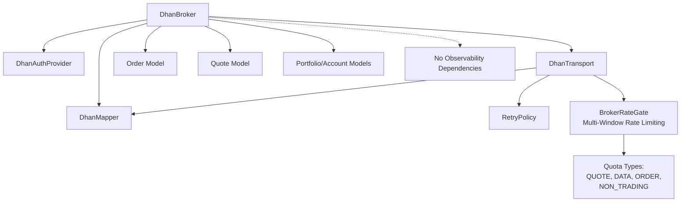

**Diagram sources**
- [dhan.py:51-75](file://ntrade/brokers/dhan.py#L51-75)
- [dhan_transport.py:54-69](file://ntrade/brokers/dhan_transport.py#L54-69)
- [rate_limit.py:76-103](file://ntrade/execution/rate_limit.py#L76-103)
- [order.py:14-41](file://ntrade/domain/orders/order.py#L14-41)
- [quote.py:9-28](file://ntrade/domain/market/quote.py#L9-28)
- [portfolio.py:63-135](file://ntrade/domain/portfolio.py#L63-135)

**Section sources**
- [dhan.py:51-75](file://ntrade/brokers/dhan.py#L51-75)
- [dhan_transport.py:54-69](file://ntrade/brokers/dhan_transport.py#L54-69)
- [rate_limit.py:76-103](file://ntrade/execution/rate_limit.py#L76-103)

## Performance Considerations
- **RetryPolicy** with exponential backoff and jitter reduces contention and improves resilience under transient failures.
- **BrokerRateGate** enforces sophisticated multi-window rate limiting across four quota classes with sliding windows and penalty mechanisms.
- **WebSocket depth snapshots** are timeout-bounded to avoid blocking indefinitely.
- **Timeframe mapping** enforces supported intervals to prevent silent misrouting.
- **Token proactive refresh** avoids mid-session expiry and costly re-authentication during critical operations.
- **Independent Lifecycle**: Auth lifecycle operations have zero overhead on observability systems, preventing unnecessary event processing.
- **Transport Efficiency**: Centralized API calls through DhanTransport reduce code duplication and improve maintainability.
- **Thread Safety**: All rate limiting operations are thread-safe with proper locking to handle concurrent access.
- **Class-Specific Backoff**: Penalties are applied per quota class, preventing one class's rate limit issues from affecting others.
- **Enhanced Timeframe Handling**: Sub-5m resampling reduces backend calls while maintaining data accuracy.
- **Atomic Operations**: Lock-based synchronization prevents race conditions in authentication flows.
- **Rate-Limit Propagation**: Proper exception handling prevents silent failures that could impact performance through incorrect trading decisions.

## Troubleshooting Guide
- **Authentication failures**:
  - Ensure DHAN_CLIENT_ID is set.
  - Validate DHAN_ACCESS_TOKEN or configure DHAN_PIN/DHAN_TOTP_SECRET.
  - Check cooldown file for TOTP attempts.
  - Verify thread-safe authentication operations if experiencing concurrent access issues.
- **Transport layer issues**:
  - **Rate limiting errors**: BrokerRateGate enforces multi-window quotas; check specific quota class limits (QUOTE: 1/s, DATA: 5/s, ORDER: 10/s, NON_TRADING: 20/s).
  - **Quota exhaustion**: Inspect which quota class is being exhausted and adjust request frequency accordingly.
  - **Penalty backoff**: After rate limit violations, the system automatically applies class-specific cooldown periods.
  - **Retry failures**: Check network connectivity and Dhan API availability; inspect retry policy configuration.
  - **Timestamp issues**: Verify clock injection for replay scenarios.
- **LTP/Quote failures**:
  - Retry logic may raise BrokerDataError; inspect network and rate limits.
  - Each quote operation consumes 2 QUOTE tokens (LTP + quote data).
- **Historical data issues**:
  - Unsupported timeframes raise ValueError; verify interval strings.
  - DAY requests for FUT-type contracts route to daily endpoint automatically.
  - Sub-5m timeframes (2m/3m/4m) are automatically resampled from 1m base data.
- **Order placement errors**:
  - F&O MARKET orders require LTP; ensure instrument has refreshed quote.
  - Bracket orders use super-order endpoint; check target/stop prices.
  - Rate limit violations on ORDER quota will raise RateLimited exceptions.
- **Connection check utility**:
  - Use check_connection.py to validate Dhan connectivity and basic market data retrieval.
- **Authentication shutdown behavior**:
  - **Expected**: `broker.stop()` only cancels the token-refresh timer
  - **Not Expected**: No heartbeat, feed, or order events should be emitted
  - **Verification**: Check that broker has no `bus` or `publish` attributes
  - **Debug**: Verify `_auth._refresh_timer` is None after stop()
- **Rate limiting debugging**:
  - **Quota-specific issues**: Different quota classes have different limits and penalties
  - **Sliding window behavior**: Requests are tracked with precise timestamps, not fixed intervals
  - **Penalty application**: Class-specific cooldowns prevent immediate retry after violations
  - **Thread safety**: Concurrent requests are properly serialized within each quota class
- **Timeframe handling issues**:
  - **Sub-5m resampling**: 2m/3m/4m timeframes are automatically converted to 1m base + resample
  - **Unsupported timeframes**: Raise ValueError immediately instead of silent failures
  - **OHLCV preservation**: Resampling maintains correct OHLC semantics
- **Race condition prevention**:
  - **Authentication locks**: RLock prevents concurrent TOTP login attempts
  - **Defensive copies**: DataFrame operations use `.copy()` to prevent mutations
  - **Atomic state updates**: Token updates happen within lock context
- **Rate-limited exception handling**:
  - **Proper propagation**: RateLimited exceptions now propagate correctly instead of being masked as empty results
  - **Critical methods**: get_orderbook(), get_trade_book(), get_expiry_list() now properly handle rate limits
  - **Testing**: Comprehensive test coverage ensures correct exception behavior
  - **Documentation**: Enhanced docstrings explain rate-limit behavior for each method

**Section sources**
- [dhan_auth.py:114-167](file://ntrade/brokers/dhan_auth.py#L114-167)
- [dhan_transport.py:88-115](file://ntrade/brokers/dhan_transport.py#L88-115)
- [rate_limit.py:105-147](file://ntrade/execution/rate_limit.py#L105-147)
- [dhan.py:165-186](file://ntrade/brokers/dhan.py#L165-186)
- [dhan.py:237-290](file://ntrade/brokers/dhan.py#L237-290)
- [check_connection.py:17-38](file://check_connection.py#L17-38)
- [test_contract_auth_observability.py:15-32](file://tests/test_contract_auth_observability.py#L15-32)
- [test_dhan_broker.py:698-764](file://tests/test_dhan_broker.py#L698-764)

## Conclusion
The DhanBroker implementation provides a robust, layered integration with Dhan's trading platform through a clean transport layer abstraction. It separates authentication, transport, and mapping concerns while enforcing domain model purity. The refactored architecture delegates all data calls through DhanTransport while maintaining the same public API surface, improving maintainability and testability. 

**Critical architectural principle**: The authentication lifecycle operates completely independently from observability systems. The DhanBroker and DhanAuthProvider have no event bus and publish no observability events, ensuring that authentication state changes (including shutdown) have no impact on system monitoring and alerting. This separation is enforced by design and tested explicitly.

The transport layer provides comprehensive resilience patterns including retry policies, sophisticated multi-window rate limiting via BrokerRateGate with four quota classes (QUOTE, DATA, ORDER, NON_TRADING), proactive token refresh, and timeout-bounded WebSocket reads. The design supports comprehensive order types, partial fill handling, and accurate portfolio synchronization while maintaining clean separation between connection management and system observability.

**Enhanced capabilities**: Recent hardening improvements include comprehensive timeframe handling with sub-5m resampling logic, atomic authentication refresh operations with thread-safe lifecycle management, and robust race condition prevention mechanisms. **Most importantly**, the implementation now features enhanced rate-limiting propagation with proper RateLimited exception handling across all data retrieval methods, ensuring that rate-limit violations are never silently masked as empty results that could lead to incorrect trading decisions.

**Advanced rate limiting infrastructure**: The new BrokerRateGate system replaces the simple 10/s LTP-only limiter with a sophisticated multi-window approach that precisely matches Dhan's documented rate limit table, providing better control, class-specific penalties, and thread-safe operation across all API calls.

## Appendices

### Usage Examples
- **Connect to Dhan**:
  - Instantiate DhanBroker with environment path; connect() establishes authentication and transport with shared BrokerRateGate.
- **Place orders**:
  - Use OrderFacade methods (buy/sell/limit/market/stop/cover/bracket) bound to an Instrument; underlying broker.place_order handles conversion and submission through rate-limited transport.
- **Subscribe to market data**:
  - Use subscribe/unsubscribe on BrokerAdapter to register instruments; ticks flow through instrument streams with appropriate quota consumption.
- **Handle authentication failures**:
  - Inspect environment variables and cooldown files; ensure PIN+TOTP credentials are correct.
- **Shutdown behavior**:
  - Call `broker.stop()` to cancel token-refresh timers; expect no observability events to be emitted.
- **Rate limiting awareness**:
  - Monitor quota class usage and adjust request frequency to stay within Dhan's documented limits.
  - Handle RateLimited exceptions gracefully with appropriate backoff strategies.
- **Timeframe handling**:
  - Use supported timeframes (1m, 5m, 15m, 25m, 60m, DAY) for native support
  - Sub-5m timeframes (2m, 3m, 4m) are automatically resampled from 1m base data
  - Unsupported timeframes raise ValueError immediately
- **Authentication robustness**:
  - Atomic refresh operations prevent race conditions during token renewal
  - Thread-safe lifecycle management ensures concurrent access protection
  - Proactive token refresh prevents mid-session expiry issues
- **Rate-limited exception handling**:
  - RateLimited exceptions now properly propagate from all data retrieval methods
  - Critical methods like get_orderbook(), get_trade_book(), get_expiry_list() handle rate limits correctly
  - Enhanced docstrings provide clear guidance on rate-limit behavior
  - Test coverage ensures proper exception propagation while preserving degradation patterns

**Section sources**
- [dhan.py:51-75](file://ntrade/brokers/dhan.py#L51-75)
- [order.py:118-173](file://ntrade/domain/orders/order.py#L118-173)
- [base.py:152-163](file://ntrade/brokers/base.py#L152-163)
- [test_dhan_broker.py:22-48](file://tests/test_dhan_broker.py#L22-48)
- [test_dhan_auth_unit.py:88-138](file://tests/test_dhan_auth_unit.py#L88-138)
- [check_connection.py:17-38](file://check_connection.py#L17-38)
- [test_contract_auth_observability.py:15-32](file://tests/test_contract_auth_observability.py#L15-32)
- [test_rate_limit.py:1-170](file://tests/test_rate_limit.py#L1-170)
- [test_rate_gate_integration.py:1-200](file://tests/test_rate_gate_integration.py#L1-200)
- [test_dhan_broker.py:698-764](file://tests/test_dhan_broker.py#L698-764)