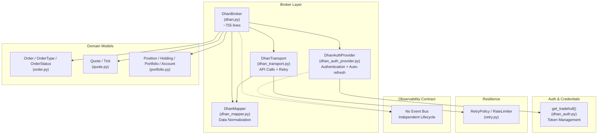
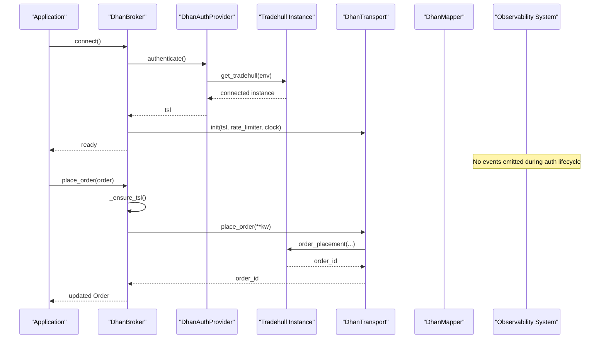
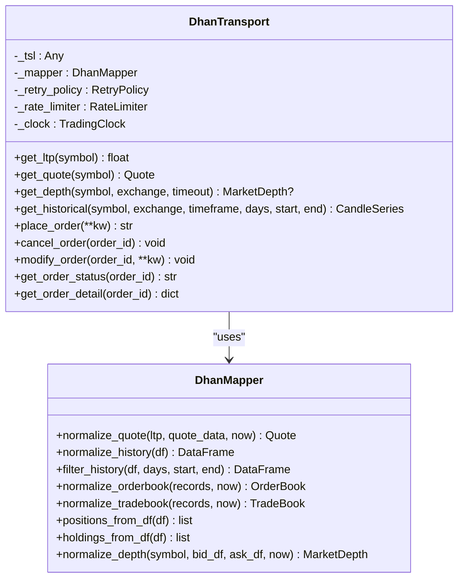
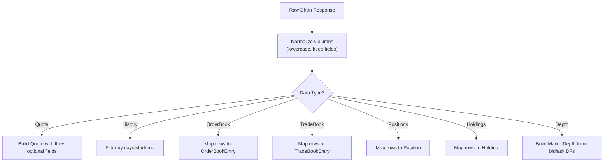
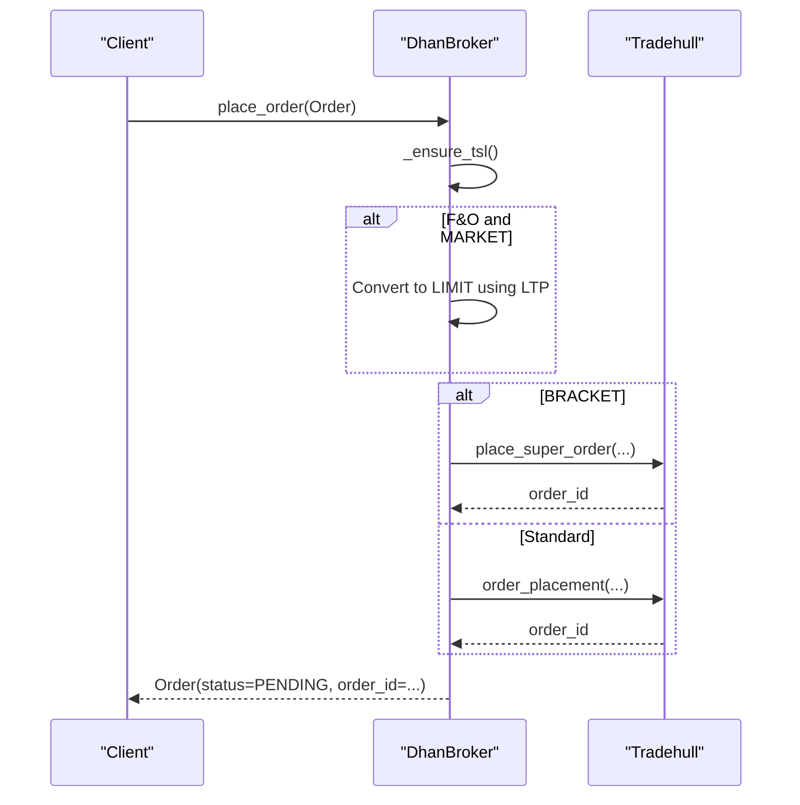
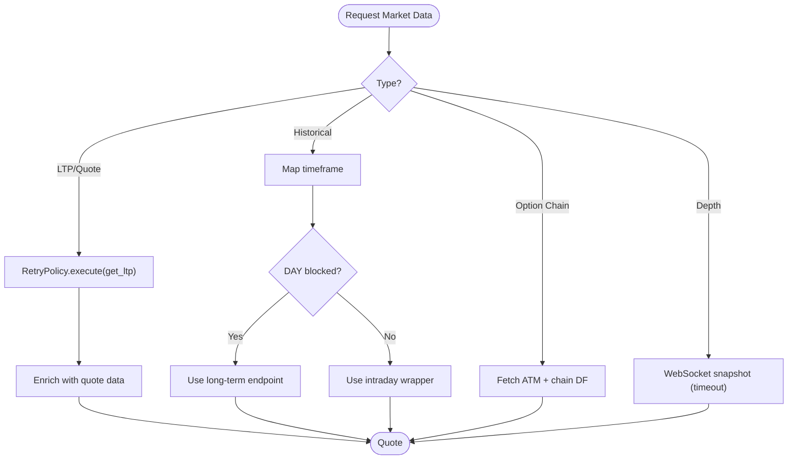
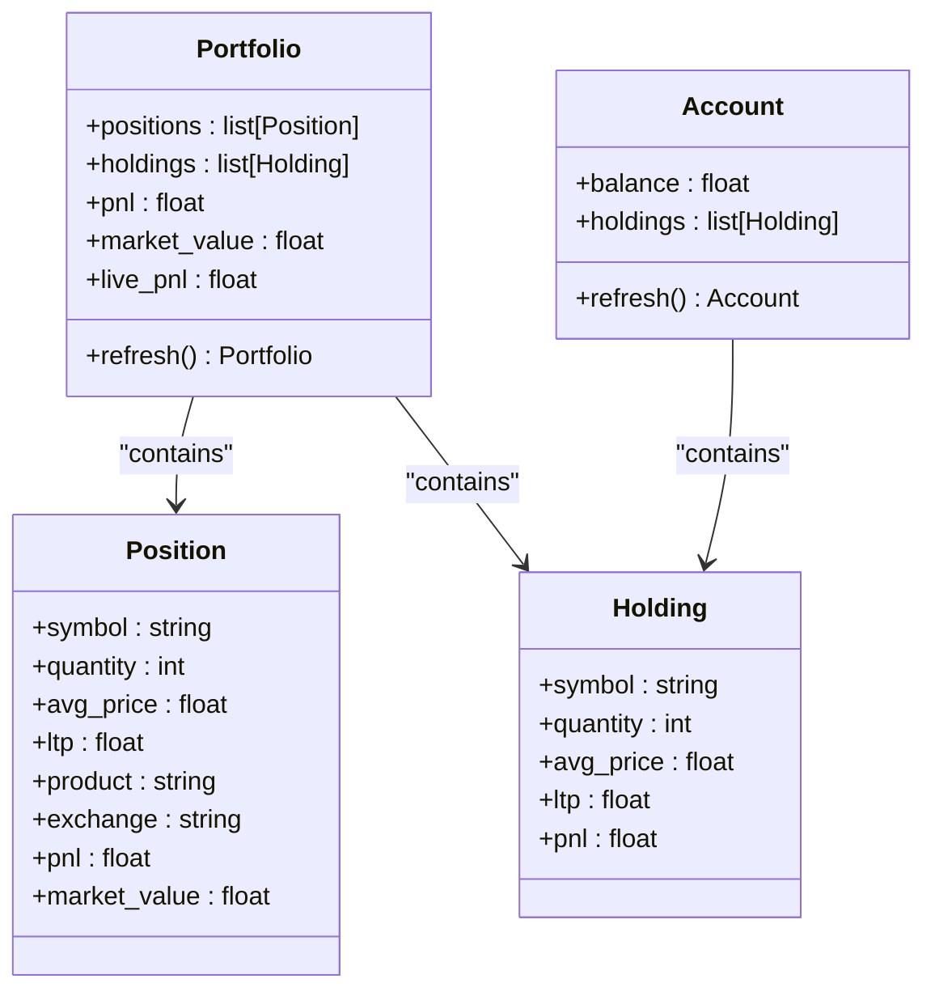
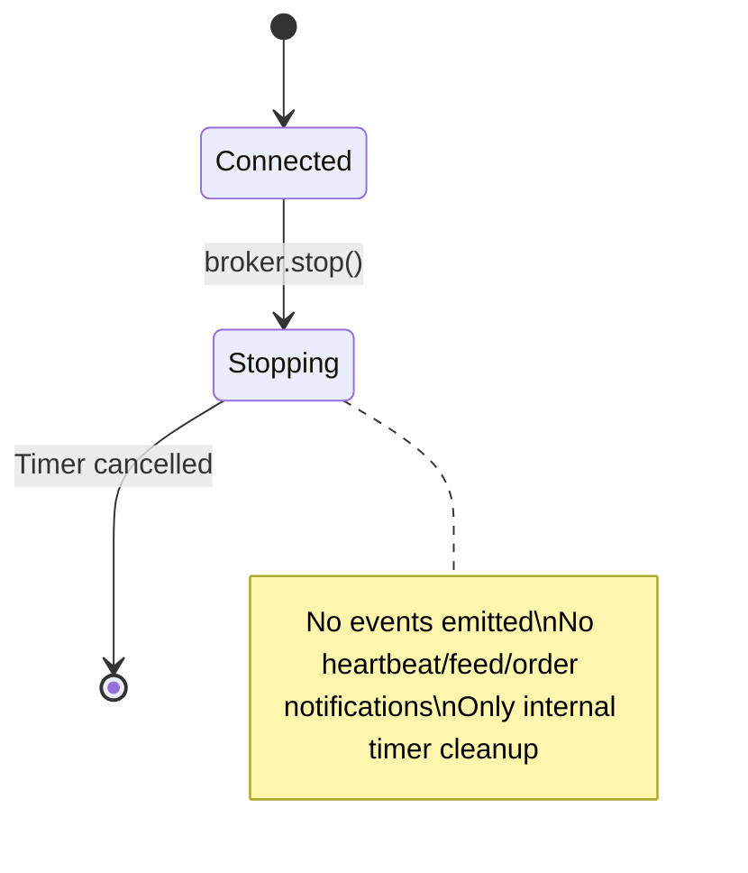
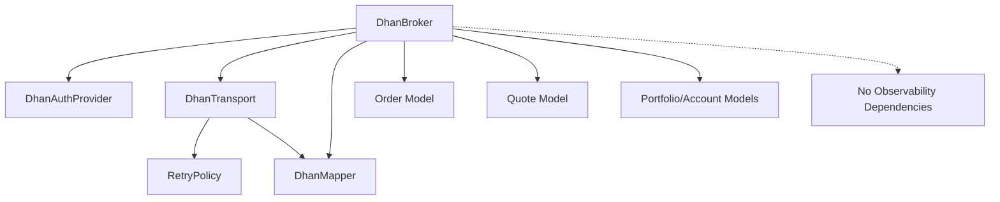

# Dhan Broker Implementation

<cite>
**Referenced Files in This Document**
- [dhan.py](file://ntrade/brokers/dhan.py)
- [dhan_auth.py](file://ntrade/brokers/dhan_auth.py)
- [dhan_transport.py](file://ntrade/brokers/dhan_transport.py)
- [dhan_mapper.py](file://ntrade/brokers/dhan_mapper.py)
- [dhan_auth_provider.py](file://ntrade/brokers/dhan_auth_provider.py)
- [base.py](file://ntrade/brokers/base.py)
- [order.py](file://ntrade/domain/orders/order.py)
- [quote.py](file://ntrade/domain/market/quote.py)
- [portfolio.py](file://ntrade/domain/portfolio.py)
- [retry.py](file://ntrade/execution/retry.py)
- [test_dhan_broker.py](file://tests/test_dhan_broker.py)
- [test_dhan_auth_unit.py](file://tests/test_dhan_auth_unit.py)
- [test_contract_auth_observability.py](file://tests/test_contract_auth_observability.py)
- [check_connection.py](file://check_connection.py)
</cite>

## Update Summary
**Changes Made**
- Enhanced authentication lifecycle documentation to clarify independence from observability
- Updated stop() method documentation to emphasize it only cancels token-refresh timer
- Added explicit contract documentation for auth-observability separation
- Updated architecture diagrams to reflect the clear separation between auth lifecycle and event publishing
- Enhanced troubleshooting section with guidance on auth shutdown behavior

## Table of Contents
1. [Introduction](#introduction)
2. [Project Structure](#project-structure)
3. [Core Components](#core-components)
4. [Architecture Overview](#architecture-overview)
5. [Detailed Component Analysis](#detailed-component-analysis)
6. [Dependency Analysis](#dependency-analysis)
7. [Performance Considerations](#performance-considerations)
8. [Troubleshooting Guide](#troubleshooting-guide)
9. [Conclusion](#conclusion)
10. [Appendices](#appendices)

## Introduction
This document explains the DhanBroker implementation that integrates with the Dhan trading platform via the Dhan-Tradehull library. The implementation follows a clean separation of concerns with a transport layer abstraction pattern. It covers authentication (PIN+TOTP verification, token lifecycle), transport abstraction for REST and WebSocket-based market data, mapping from Dhan wire formats to domain objects, order placement across multiple order types, partial fill handling, idempotent operations, position synchronization, portfolio updates, balance tracking, and resilience patterns such as rate limiting and error recovery tailored to Dhan's API constraints.

The architecture has been refactored to delegate all data calls through DhanTransport while maintaining the same public API surface, reducing the broker class complexity and improving maintainability. **Critical architectural principle**: The authentication lifecycle is completely independent from observability - stopping authentication never emits heartbeat, feed, or order events, ensuring clean separation between connection management and system monitoring.

## Project Structure
The Dhan integration is organized into a clear separation of concerns following the provider pattern:
- Authentication lifecycle and credential storage via DhanAuthProvider
- Transport layer wrapping Tradehull calls with retry and normalization via DhanTransport  
- Mapper layer converting Dhan responses to domain models via DhanMapper
- Broker adapter implementing the broker interface and orchestrating components via DhanBroker
- Domain models for orders, quotes, positions, and holdings
- Resilience utilities for retries and rate limiting



**Diagram sources**
- [dhan.py:51-75](file://ntrade/brokers/dhan.py#L51-L75)
- [dhan_auth_provider.py:28-88](file://ntrade/brokers/dhan_auth_provider.py#L28-88)
- [dhan_transport.py:49-79](file://ntrade/brokers/dhan_transport.py#L49-L79)
- [dhan_mapper.py:35-73](file://ntrade/brokers/dhan_mapper.py#L35-L73)
- [dhan_auth.py:114-167](file://ntrade/brokers/dhan_auth.py#L114-L167)
- [order.py:14-41](file://ntrade/domain/orders/order.py#L14-L41)
- [quote.py:9-28](file://ntrade/domain/market/quote.py#L9-L28)
- [portfolio.py:19-61](file://ntrade/domain/portfolio.py#L19-L61)
- [retry.py:19-68](file://ntrade/execution/retry.py#L19-L68)

**Section sources**
- [dhan.py:51-75](file://ntrade/brokers/dhan.py#L51-L75)
- [base.py:25-69](file://ntrade/brokers/base.py#L25-L69)

## Core Components
- **DhanBroker**: Implements the BrokerAdapter interface for Dhan, orchestrating auth, transport, and mapping. Now delegates all data calls through DhanTransport while maintaining the same public API surface. Handles quote retrieval, historical data, option chains, order placement/cancellation/modification, order/trade books, positions, holdings, and balances. **Critical**: The broker has no event bus and publishes no observability events during lifecycle operations.
- **DhanAuthProvider**: Manages authentication lifecycle, including proactive token refresh using PIN+TOTP when tokens near expiry. Provides automatic background refresh to prevent mid-session failures. **Important**: Auth lifecycle is independent of observability - stopping auth never emits heartbeat/feed/order events.
- **DhanTransport**: Wraps Tradehull API calls with retry policies, timestamp resolution, and consistent error handling; exposes normalized methods for LTP, quotes, depth, history, options, and order operations.
- **DhanMapper**: Pure functions to map Dhan-specific wire formats into ntrade domain objects (quotes, depth, order/trade books, positions, holdings).
- **Domain Models**: Order, Quote, Position, Holding, Portfolio, Account define the canonical abstractions used by engines and strategies.
- **RetryPolicy and RateLimiter**: Provide exponential backoff with jitter and token-bucket rate limiting for resilient API usage.

**Section sources**
- [dhan.py:51-75](file://ntrade/brokers/dhan.py#L51-L75)
- [dhan_auth_provider.py:28-88](file://ntrade/brokers/dhan_auth_provider.py#L28-L88)
- [dhan_transport.py:49-79](file://ntrade/brokers/dhan_transport.py#L49-L79)
- [dhan_mapper.py:35-73](file://ntrade/brokers/dhan_mapper.py#L35-L73)
- [order.py:14-41](file://ntrade/domain/orders/order.py#L14-L41)
- [quote.py:9-28](file://ntrade/domain/market/quote.py#L9-L28)
- [portfolio.py:19-61](file://ntrade/domain/portfolio.py#L19-L61)
- [retry.py:19-68](file://ntrade/execution/retry.py#L19-L68)

## Architecture Overview
The DhanBroker composes three primary subsystems with a clear delegation pattern and strict separation from observability:
- **Authentication** via DhanAuthProvider and dhan_auth.get_tradehull, which supports shared token store, JWT expiry checks, and PIN+TOTP fallback with proactive refresh. **Auth lifecycle is independent of observability**.
- **Transport** via DhanTransport, which encapsulates all Tradehull interactions with retry and normalization.
- **Mapping** via DhanMapper, which converts raw Dhan responses into domain objects.



**Diagram sources**
- [dhan.py:66-75](file://ntrade/brokers/dhan.py#L66-L75)
- [dhan_auth_provider.py:47-56](file://ntrade/brokers/dhan_auth_provider.py#L47-L56)
- [dhan_auth.py:114-167](file://ntrade/brokers/dhan_auth.py#L114-L167)
- [dhan_transport.py:56-63](file://ntrade/brokers/dhan_transport.py#L56-L63)

## Detailed Component Analysis

### Authentication Flow and Credential Storage
- **Shared token store**: The system prefers a valid access token stored in a JSON file at DHAN_TOKEN_PATH. If present and not near expiry (configurable buffer), it is used directly.
- **Environment token**: If no shared token or it is near expiry, an environment-provided access token is attempted if not provably expired.
- **PIN+TOTP fallback**: When both are unavailable/expired, the system authenticates via PIN+TOTP using DHAN_PIN and DHAN_TOTP_SECRET, respecting a cooldown file at DHAN_COOLDOWN_PATH to avoid rapid re-attempts.
- **Proactive refresh**: DhanAuthProvider schedules background refresh before token expiry to prevent mid-session failures.
- **Security**: Persisted tokens and cooldown files are written with restrictive permissions (0o600).
- **Independence from Observability**: **Critical contract** - stopping authentication never emits heartbeat, feed, or order events. The auth lifecycle operates completely independently from any observability system.

```mermaid
flowchart TD
Start(["Start"]) --> CheckStore["Check shared token store"]
CheckStore --> StoreValid{"Token valid<br/>and not near expiry?"}
StoreValid --> |Yes| UseStore["Use stored token"]
StoreValid --> |No| CheckEnv["Check env access token"]
CheckEnv --> EnvValid{"Not expired?<br/>(or unparseable -> attempt)"}
EnvValid --> |Yes| UseEnv["Use env token"]
EnvValid --> |No| PinTOTP["Authenticate via PIN+TOTP"]
PinTOTP --> Cooldown{"Cooldown active?"}
Cooldown --> |Yes| ErrorCooldown["Raise cooldown error"]
Cooldown --> |No| Success{"Login ok?"}
Success --> |Yes| Persist["Persist token + cooldown"]
Success --> |No| ErrorLogin["Raise login error"]
Persist --> End(["Return Tradehull"])
UseStore --> End
UseEnv --> End
Note over Start,End: Auth lifecycle independent of observability
```

**Diagram sources**
- [dhan_auth.py:59-167](file://ntrade/brokers/dhan_auth.py#L59-L167)
- [dhan_auth_provider.py:47-74](file://ntrade/brokers/dhan_auth_provider.py#L47-L74)

**Section sources**
- [dhan_auth.py:114-167](file://ntrade/brokers/dhan_auth.py#L114-L167)
- [dhan_auth_provider.py:47-74](file://ntrade/brokers/dhan_auth_provider.py#L47-L74)
- [test_contract_auth_observability.py:1-32](file://tests/test_contract_auth_observability.py#L1-L32)

### Transport Layer Abstraction
DhanTransport wraps Tradehull calls with comprehensive error handling and retry logic:
- **RetryPolicy** for transient failures (e.g., LTP fetches with exponential backoff)
- **Consistent timestamp resolution** using injected clock or wall clock for replay parity
- **Normalization of responses** and graceful fallbacks for non-critical endpoints
- **WebSocket snapshot** for market depth with timeout protection
- **Rate limiting** integration with configurable calls per second



**Diagram sources**
- [dhan_transport.py:49-79](file://ntrade/brokers/dhan_transport.py#L49-L79)
- [dhan_mapper.py:74-136](file://ntrade/brokers/dhan_mapper.py#L74-L136)

**Section sources**
- [dhan_transport.py:49-79](file://ntrade/brokers/dhan_transport.py#L49-L79)
- [dhan_mapper.py:74-136](file://ntrade/brokers/dhan_mapper.py#L74-L136)

### Mapper Layer: Instrument Mapping, Quote Normalization, Order Status Translation
- **Instrument symbol mapping**: Converts domain instruments to Dhan tradingsymbols, especially for options where the "spaced" custom format is required.
- **Quote normalization**: Builds immutable Quote objects with optional enrichment from quote data.
- **History normalization**: Lowercases columns and filters by days/start/end.
- **Order/trade book normalization**: Maps varied field names into consistent structures.
- **Positions/holdings normalization**: Converts DataFrames into domain objects safely.
- **Depth normalization**: Builds MarketDepth from bid/ask DataFrames.



**Diagram sources**
- [dhan_mapper.py:74-136](file://ntrade/brokers/dhan_mapper.py#L74-L136)
- [dhan_mapper.py:139-215](file://ntrade/brokers/dhan_mapper.py#L139-L215)
- [dhan_mapper.py:218-239](file://ntrade/brokers/dhan_mapper.py#L218-L239)

**Section sources**
- [dhan_mapper.py:35-73](file://ntrade/brokers/dhan_mapper.py#L35-L73)
- [dhan_mapper.py:74-136](file://ntrade/brokers/dhan_mapper.py#L74-L136)
- [dhan_mapper.py:139-215](file://ntrade/brokers/dhan_mapper.py#L139-L215)
- [dhan_mapper.py:218-239](file://ntrade/brokers/dhan_mapper.py#L218-L239)

### Order Placement and Lifecycle
- **Supported order types**: LIMIT, MARKET, STOP_LIMIT, STOP_MARKET, COVER, BRACKET.
- **SEBI compliance**: For F&O exchanges, MARKET orders are converted to LIMIT using LTP-derived price.
- **Bracket orders**: Route through dedicated super-order endpoint with entry/target/stop legs.
- **Partial fills**: Order status includes PARTIALLY_FILLED; detail queries update filled_qty and avg_price.
- **Idempotency**: Place order returns an Order with assigned order_id; subsequent status/detail calls use this ID.



**Diagram sources**
- [dhan.py:203-250](file://ntrade/brokers/dhan.py#L203-L250)
- [order.py:14-41](file://ntrade/domain/orders/order.py#L14-L41)

**Section sources**
- [dhan.py:203-250](file://ntrade/brokers/dhan.py#L203-L250)
- [order.py:14-41](file://ntrade/domain/orders/order.py#L14-L41)

### Market Data Streaming and Depth
- **LTP and quotes**: Retries on flaky endpoints; enriches with OHLC, volume, OI.
- **Historical data**: Supports intraday and daily endpoints; routes DAY requests appropriately based on instrument type/exchange.
- **Option chain**: Fetches ATM and chain dataframe; resolves real expiry dates and sets chain metadata.
- **Depth**: WebSocket snapshot bounded by timeout; returns normalized MarketDepth.



**Diagram sources**
- [dhan.py:114-144](file://ntrade/brokers/dhan.py#L114-L144)
- [dhan.py:158-200](file://ntrade/brokers/dhan.py#L158-L200)
- [dhan.py:135-156](file://ntrade/brokers/dhan.py#L135-L156)
- [dhan.py:121-133](file://ntrade/brokers/dhan.py#L121-L133)

**Section sources**
- [dhan.py:114-144](file://ntrade/brokers/dhan.py#L114-L144)
- [dhan.py:158-200](file://ntrade/brokers/dhan.py#L158-L200)
- [dhan.py:135-156](file://ntrade/brokers/dhan.py#L135-L156)
- [dhan.py:121-133](file://ntrade/brokers/dhan.py#L121-L133)

### Position Synchronization, Portfolio Updates, and Balance Tracking
- **Positions**: Returned as domain Position objects; raises on fetch failure to preserve state during reconciliation.
- **Holdings**: Returned as domain Holding objects; empty list on failure.
- **Balance**: Returns float; consumers guard against network blips.
- **Live P&L**: Broker-reported live P&L aggregated in Portfolio.



**Diagram sources**
- [portfolio.py:63-135](file://ntrade/domain/portfolio.py#L63-L135)
- [portfolio.py:137-173](file://ntrade/domain/portfolio.py#L137-L173)
- [portfolio.py:19-61](file://ntrade/domain/portfolio.py#L19-L61)

**Section sources**
- [dhan.py:372-387](file://ntrade/brokers/dhan.py#L372-L387)
- [portfolio.py:63-135](file://ntrade/domain/portfolio.py#L63-L135)
- [portfolio.py:137-173](file://ntrade/domain/portfolio.py#L137-L173)

### Authentication Lifecycle and Observability Independence
**Updated** Enhanced documentation to clarify the critical contract that authentication lifecycle operates completely independently from observability systems.

The DhanBroker and DhanAuthProvider have no event bus and publish no observability events whatsoever. When `broker.stop()` is called, it only cancels the auth provider's token-refresh timer without triggering any HeartbeatEvent, FeedDisconnectedEvent, or OrderTimeoutEvent. This separation ensures that authentication state changes cannot affect system monitoring and alerting.

Key aspects of this contract:
- **No Event Bus**: DhanBroker has no `bus` attribute and no `publish` method
- **Timer-only Shutdown**: `stop()` method only cancels `_refresh_timer` in DhanAuthProvider
- **Clean Separation**: Auth lifecycle changes are invisible to observability systems
- **Tested Contract**: Explicitly verified in `test_contract_auth_observability.py`



**Diagram sources**
- [dhan.py:97-102](file://ntrade/brokers/dhan.py#L97-L102)
- [dhan_auth_provider.py:76-79](file://ntrade/brokers/dhan_auth_provider.py#L76-L79)
- [test_contract_auth_observability.py:15-32](file://tests/test_contract_auth_observability.py#L15-L32)

**Section sources**
- [dhan.py:97-102](file://ntrade/brokers/dhan.py#L97-L102)
- [dhan_auth_provider.py:76-79](file://ntrade/brokers/dhan_auth_provider.py#L76-L79)
- [test_contract_auth_observability.py:1-32](file://tests/test_contract_auth_observability.py#L1-L32)

## Dependency Analysis
- **DhanBroker** depends on DhanAuthProvider for authentication, DhanTransport for API calls, and DhanMapper for normalization.
- **DhanTransport** uses RetryPolicy for resilient execution and DhanMapper for normalization.
- **Domain models** are independent of broker specifics; adapters normalize broker responses into these models.
- **Observability Independence**: DhanBroker has no dependencies on event buses or observability systems.



**Diagram sources**
- [dhan.py:51-75](file://ntrade/brokers/dhan.py#L51-L75)
- [dhan_transport.py:49-79](file://ntrade/brokers/dhan_transport.py#L49-L79)
- [retry.py:19-68](file://ntrade/execution/retry.py#L19-L68)
- [order.py:14-41](file://ntrade/domain/orders/order.py#L14-L41)
- [quote.py:9-28](file://ntrade/domain/market/quote.py#L9-L28)
- [portfolio.py:63-135](file://ntrade/domain/portfolio.py#L63-L135)

**Section sources**
- [dhan.py:51-75](file://ntrade/brokers/dhan.py#L51-L75)
- [dhan_transport.py:49-79](file://ntrade/brokers/dhan_transport.py#L49-L79)
- [retry.py:19-68](file://ntrade/execution/retry.py#L19-L68)

## Performance Considerations
- **RetryPolicy** with exponential backoff and jitter reduces contention and improves resilience under transient failures.
- **WebSocket depth snapshots** are timeout-bounded to avoid blocking indefinitely.
- **Timeframe mapping** enforces supported intervals to prevent silent misrouting.
- **Token proactive refresh** avoids mid-session expiry and costly re-authentication during critical operations.
- **Rate limiting** ensures compliance with Dhan API constraints (10 calls per second default).
- **Independent Lifecycle**: Auth lifecycle operations have zero overhead on observability systems, preventing unnecessary event processing.

## Troubleshooting Guide
- **Authentication failures**:
  - Ensure DHAN_CLIENT_ID is set.
  - Validate DHAN_ACCESS_TOKEN or configure DHAN_PIN/DHAN_TOTP_SECRET.
  - Check cooldown file for TOTP attempts.
- **LTP/Quote failures**:
  - Retry logic may raise BrokerDataError; inspect network and rate limits.
- **Historical data issues**:
  - Unsupported timeframes raise ValueError; verify interval strings.
  - DAY requests for FUT-type contracts route to daily endpoint automatically.
- **Order placement errors**:
  - F&O MARKET orders require LTP; ensure instrument has refreshed quote.
  - Bracket orders use super-order endpoint; check target/stop prices.
- **Connection check utility**:
  - Use check_connection.py to validate Dhan connectivity and basic market data retrieval.
- **Authentication shutdown behavior**:
  - **Expected**: `broker.stop()` only cancels the token-refresh timer
  - **Not Expected**: No heartbeat, feed, or order events should be emitted
  - **Verification**: Check that broker has no `bus` or `publish` attributes
  - **Debug**: Verify `_auth._refresh_timer` is None after stop()

**Section sources**
- [dhan_auth.py:114-167](file://ntrade/brokers/dhan_auth.py#L114-L167)
- [dhan_transport.py:87-110](file://ntrade/brokers/dhan_transport.py#L87-L110)
- [dhan.py:135-156](file://ntrade/brokers/dhan.py#L135-L156)
- [dhan.py:203-250](file://ntrade/brokers/dhan.py#L203-L250)
- [check_connection.py:17-38](file://check_connection.py#L17-L38)
- [test_contract_auth_observability.py:15-32](file://tests/test_contract_auth_observability.py#L15-L32)

## Conclusion
The DhanBroker implementation provides a robust, layered integration with Dhan's trading platform through a clean transport layer abstraction. It separates authentication, transport, and mapping concerns while enforcing domain model purity. The refactored architecture delegates all data calls through DhanTransport while maintaining the same public API surface, improving maintainability and testability. 

**Critical architectural principle**: The authentication lifecycle operates completely independently from observability systems. The DhanBroker and DhanAuthProvider have no event bus and publish no observability events, ensuring that authentication state changes (including shutdown) have no impact on system monitoring and alerting. This separation is enforced by design and tested explicitly.

Resilience patterns like retry policies, proactive token refresh, and timeout-bounded WebSocket reads ensure reliable operation under Dhan's API constraints. The design supports comprehensive order types, partial fill handling, and accurate portfolio synchronization while maintaining clean separation between connection management and system observability.

## Appendices

### Usage Examples
- **Connect to Dhan**:
  - Instantiate DhanBroker with environment path; connect() establishes authentication and transport.
- **Place orders**:
  - Use OrderFacade methods (buy/sell/limit/market/stop/cover/bracket) bound to an Instrument; underlying broker.place_order handles conversion and submission.
- **Subscribe to market data**:
  - Use subscribe/unsubscribe on BrokerAdapter to register instruments; ticks flow through instrument streams.
- **Handle authentication failures**:
  - Inspect environment variables and cooldown files; ensure PIN+TOTP credentials are correct.
- **Shutdown behavior**:
  - Call `broker.stop()` to cancel token-refresh timers; expect no observability events to be emitted.

**Section sources**
- [dhan.py:51-75](file://ntrade/brokers/dhan.py#L51-L75)
- [order.py:118-173](file://ntrade/domain/orders/order.py#L118-L173)
- [base.py:152-163](file://ntrade/brokers/base.py#L152-L163)
- [test_dhan_broker.py:22-48](file://tests/test_dhan_broker.py#L22-L48)
- [test_dhan_auth_unit.py:88-138](file://tests/test_dhan_auth_unit.py#L88-L138)
- [check_connection.py:17-38](file://check_connection.py#L17-L38)
- [test_contract_auth_observability.py:15-32](file://tests/test_contract_auth_observability.py#L15-L32)