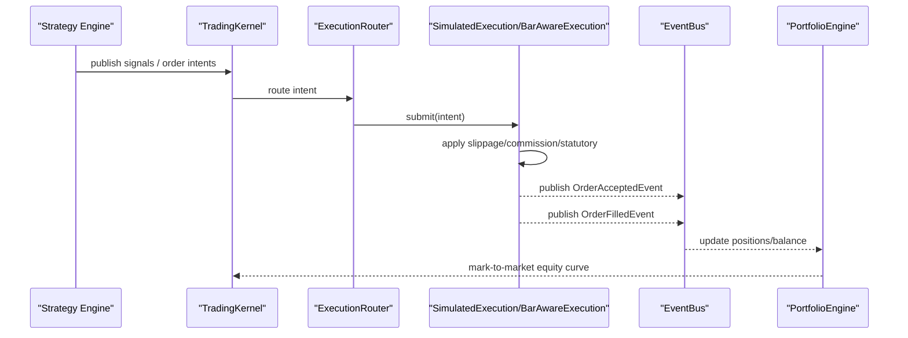
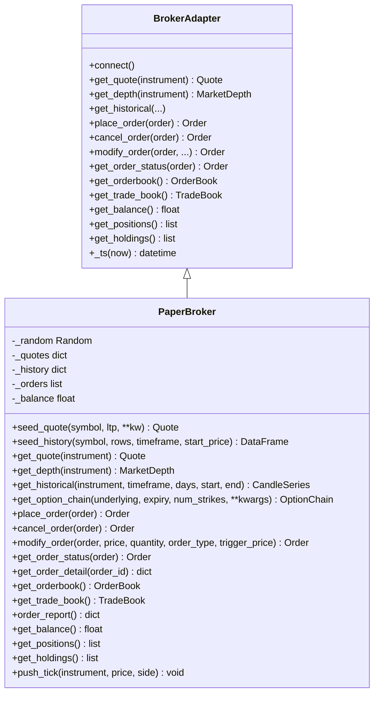
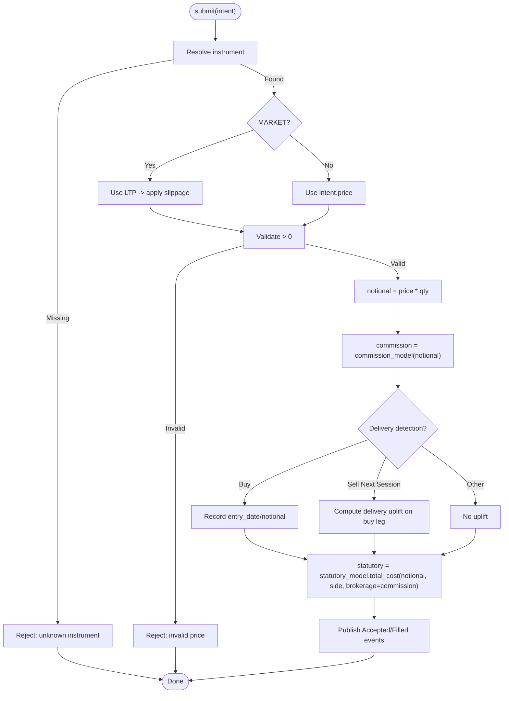
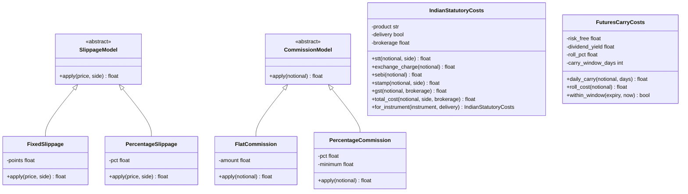
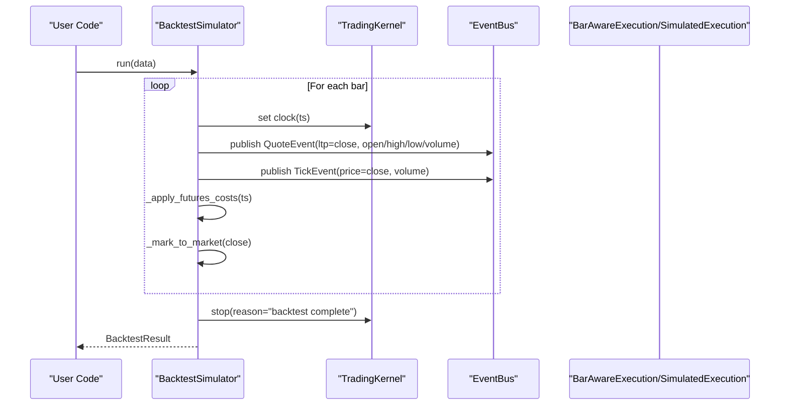
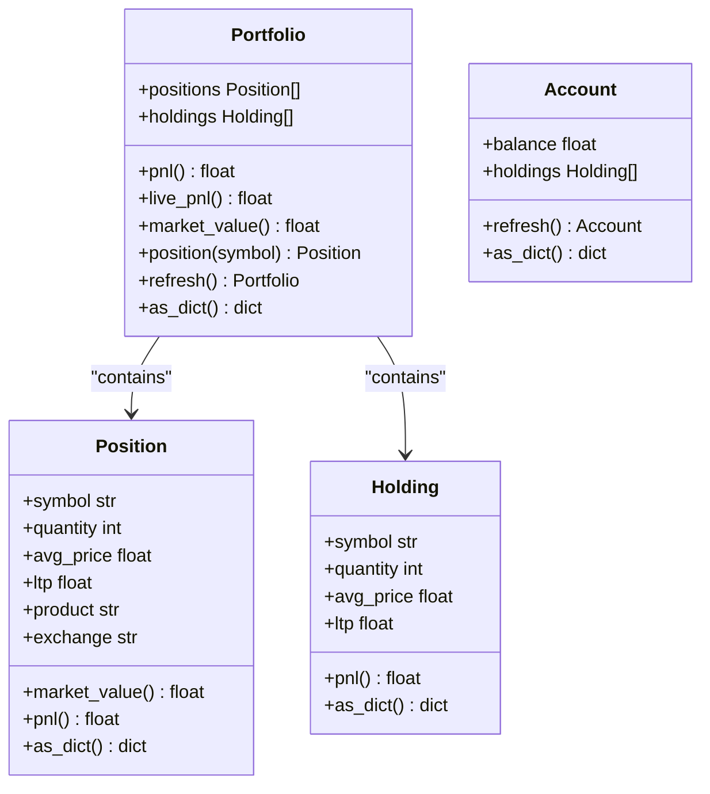
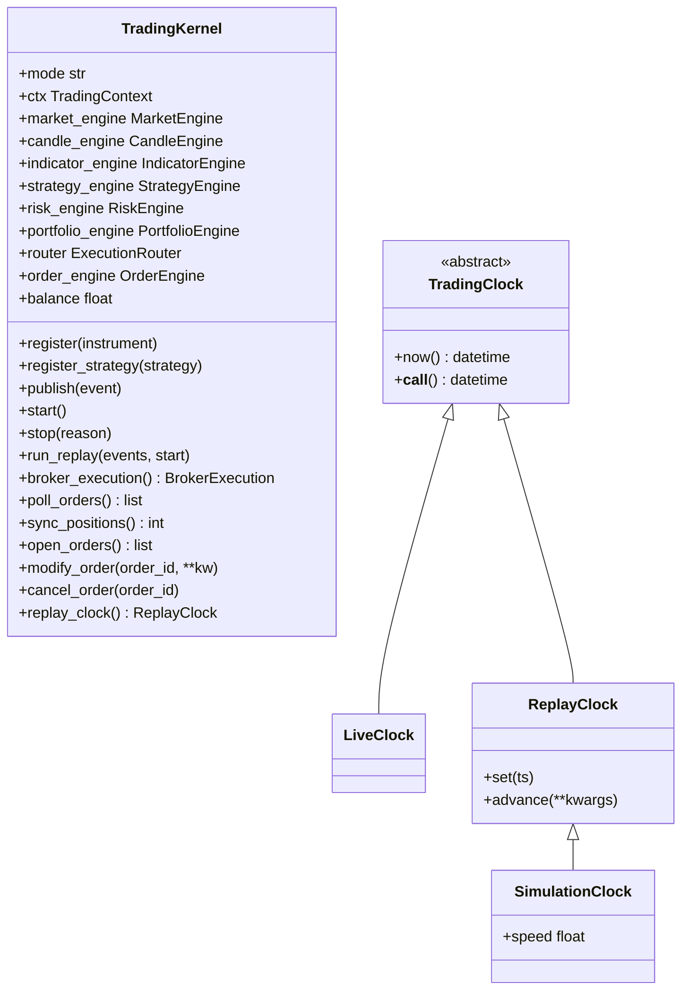
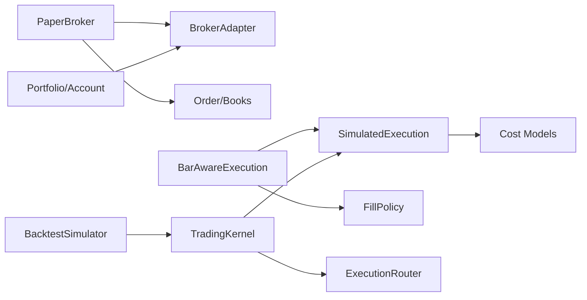

# Paper Broker & Simulation

<cite>
**Referenced Files in This Document**
- [paper.py](file://ntrade/brokers/paper.py)
- [base.py](file://ntrade/brokers/base.py)
- [simulator.py](file://ntrade/execution/simulator.py)
- [costs.py](file://ntrade/execution/costs.py)
- [fills.py](file://ntrade/backtest/fills.py)
- [simulator.py](file://ntrade/backtest/simulator.py)
- [portfolio.py](file://ntrade/domain/portfolio.py)
- [order.py](file://ntrade/domain/orders/order.py)
- [session.py](file://ntrade/kernel/session.py)
- [clock.py](file://ntrade/kernel/clock.py)
- [test_paper_gate.py](file://tests/test_paper_gate.py)
- [paper_gate_run.py](file://scripts/paper_gate_run.py)
</cite>

## Table of Contents
1. [Introduction](#introduction)
2. [Project Structure](#project-structure)
3. [Core Components](#core-components)
4. [Architecture Overview](#architecture-overview)
5. [Detailed Component Analysis](#detailed-component-analysis)
6. [Dependency Analysis](#dependency-analysis)
7. [Performance Considerations](#performance-considerations)
8. [Troubleshooting Guide](#troubleshooting-guide)
9. [Conclusion](#conclusion)
10. [Appendices](#appendices)

## Introduction
This document explains the PaperBroker implementation and its simulation ecosystem for testing and strategy validation. It covers how realistic trading conditions are simulated (order book dynamics, slippage modeling, commission/statutory costs), the fill simulation engine that generates trade executions based on market conditions and order characteristics, cost models across asset classes, position management with P&L and portfolio metrics, configuration examples, differences from live trading, limitations, and best practices for using paper brokers to validate strategies before going live.

## Project Structure
The paper trading and simulation features span several modules:
- Broker adapter layer defines a consistent interface for all brokers, including the in-memory PaperBroker.
- Execution simulation applies slippage, commissions, and statutory charges deterministically.
- Backtest utilities provide bar-aware fills and full backtest runs over OHLCV data.
- Domain objects model positions, holdings, and portfolio/account state.
- Kernel orchestrates engines, event bus, clock, and execution target selection.

```mermaid
graph TB
subgraph "Broker Layer"
Base["BrokerAdapter"]
Paper["PaperBroker"]
end
subgraph "Execution"
SimExec["SimulatedExecution"]
BarExec["BarAwareExecution"]
Costs["Slippage/Commission/Statutory"]
end
subgraph "Backtest"
BtSim["BacktestSimulator"]
Fills["FillPolicy"]
end
subgraph "Domain"
Portfolio["Portfolio/Position/Holding"]
Order["Order/OrderFacade"]
end
subgraph "Kernel"
Kernel["TradingKernel"]
Clock["TradingClock"]
end
Base --> Paper
Kernel --> SimExec
Kernel --> BarExec
SimExec --> Costs
BarExec --> Costs
BtSim --> BarExec
BtSim --> Fills
Kernel --> Portfolio
Order --> Paper
Paper --> Portfolio
```

**Diagram sources**
- [base.py:25-163](file://ntrade/brokers/base.py#L25-L163)
- [paper.py:23-216](file://ntrade/brokers/paper.py#L23-L216)
- [simulator.py:43-147](file://ntrade/execution/simulator.py#L43-L147)
- [fills.py:16-72](file://ntrade/backtest/fills.py#L16-L72)
- [simulator.py:58-220](file://ntrade/backtest/simulator.py#L58-L220)
- [portfolio.py:19-173](file://ntrade/domain/portfolio.py#L19-L173)
- [order.py:44-173](file://ntrade/domain/orders/order.py#L44-L173)
- [session.py:38-198](file://ntrade/kernel/session.py#L38-L198)
- [clock.py:14-55](file://ntrade/kernel/clock.py#L14-L55)

**Section sources**
- [base.py:25-163](file://ntrade/brokers/base.py#L25-L163)
- [paper.py:23-216](file://ntrade/brokers/paper.py#L23-L216)
- [simulator.py:43-147](file://ntrade/execution/simulator.py#L43-L147)
- [fills.py:16-72](file://ntrade/backtest/fills.py#L16-L72)
- [simulator.py:58-220](file://ntrade/backtest/simulator.py#L58-L220)
- [portfolio.py:19-173](file://ntrade/domain/portfolio.py#L19-L173)
- [order.py:44-173](file://ntrade/domain/orders/order.py#L44-L173)
- [session.py:38-198](file://ntrade/kernel/session.py#L38-L198)
- [clock.py:14-55](file://ntrade/kernel/clock.py#L14-L55)

## Core Components
- PaperBroker: In-memory broker implementing the BrokerAdapter contract; provides quotes, depth, historical data, order lifecycle, and books for tests/replays/backtests.
- SimulatedExecution: Deterministic fill engine applying configurable slippage, commission, and Indian statutory costs; supports delivery detection for equity overnight exits.
- BarAwareExecution: Extends SimulatedExecution to enforce limit fills only when bars touch the limit price.
- BacktestSimulator: Runs the kernel over OHLCV bars, publishes Quote/Tick events, accrues futures carry and roll costs, and computes results.
- Cost Models: SlippageModel, CommissionModel, IndianStatutoryCosts, FuturesCarryCosts.
- Portfolio/Account: Position/Holding tracking with P&L and market value calculations; account balance updates reflect fills and costs.
- TradingKernel: Wires engines, execution targets, and clocks; selects simulated or broker execution depending on mode.

**Section sources**
- [paper.py:23-216](file://ntrade/brokers/paper.py#L23-L216)
- [simulator.py:43-147](file://ntrade/execution/simulator.py#L43-L147)
- [fills.py:16-72](file://ntrade/backtest/fills.py#L16-L72)
- [simulator.py:58-220](file://ntrade/backtest/simulator.py#L58-L220)
- [costs.py:21-285](file://ntrade/execution/costs.py#L21-L285)
- [portfolio.py:19-173](file://ntrade/domain/portfolio.py#L19-L173)
- [session.py:38-198](file://ntrade/kernel/session.py#L38-L198)

## Architecture Overview
The system enforces zero parity between live and simulated modes by sharing the same kernel and engine stack. The execution target is interchangeable:
- Live mode uses BrokerExecution against a real broker adapter.
- Replay/backtest modes use SimulatedExecution or BarAwareExecution with deterministic time and synthetic market data.



**Diagram sources**
- [session.py:87-101](file://ntrade/kernel/session.py#L87-L101)
- [simulator.py:72-147](file://ntrade/execution/simulator.py#L72-L147)
- [fills.py:59-72](file://ntrade/backtest/fills.py#L59-L72)
- [simulator.py:116-143](file://ntrade/backtest/simulator.py#L116-L143)

## Detailed Component Analysis

### PaperBroker: Market Data, Orders, and Books
- Market data seeding: seed_quote initializes LTP/bid/ask; seed_history generates OHLCV frames per symbol/timeframe.
- Depth generation: get_depth returns synthetic bid/ask levels around LTP with random quantities.
- Historical retrieval: get_historical returns CandleSeries filtered by start/end if provided.
- Option chain: get_option_chain builds synthetic options around ATM strikes.
- Order placement: place_order immediately completes orders using current quote LTP or order price; assigns order_id and status COMPLETED.
- Order lifecycle: cancel_order/modify_order update stored orders; get_order_status refreshes fields; get_orderbook/get_trade_book expose OrderBook/TradeBook snapshots.
- Balance and positions: returns default balance and empty positions/holdings; push_tick dispatches ticks via base._dispatch_tick.



**Diagram sources**
- [base.py:25-163](file://ntrade/brokers/base.py#L25-L163)
- [paper.py:23-216](file://ntrade/brokers/paper.py#L23-L216)

**Section sources**
- [paper.py:23-216](file://ntrade/brokers/paper.py#L23-L216)
- [base.py:25-163](file://ntrade/brokers/base.py#L25-L163)

### Fill Simulation Engine: SimulatedExecution and BarAwareExecution
- SimulatedExecution:
  - Determines fill price: MARKET uses instrument quote LTP; LIMIT uses intent.price.
  - Applies slippage via SlippageModel.
  - Computes commission via CommissionModel.
  - Calculates statutory costs using IndianStatutoryCosts with product/delivery adjustments.
  - Delivery detection: tracks entry date/notional; uplifts buy leg when sell occurs next session.
  - Publishes OrderAcceptedEvent and OrderFilledEvent; records fills.
- BarAwareExecution:
  - For non-MARKET intents, consults FillPolicy against current bar; rejects if limit not touched.
  - Adjusts intent price to bar-aware fill price before delegating to parent submit.



**Diagram sources**
- [simulator.py:72-147](file://ntrade/execution/simulator.py#L72-L147)
- [fills.py:59-72](file://ntrade/backtest/fills.py#L59-L72)

**Section sources**
- [simulator.py:43-147](file://ntrade/execution/simulator.py#L43-L147)
- [fills.py:16-72](file://ntrade/backtest/fills.py#L16-L72)

### Cost Model Implementation
- SlippageModel: FixedSlippage (points), PercentageSlippage (pct).
- CommissionModel: FlatCommission (fixed amount), PercentageCommission (pct with minimum).
- IndianStatutoryCosts: STT, exchange charge, SEBI fee, GST, stamp duty; product-specific schedules; for_instrument adapts to futures/options/equity delivery/intraday.
- FuturesCarryCosts: daily_carry (contango drag), roll_cost (expiry rollover), within_window (carry window).



**Diagram sources**
- [costs.py:21-285](file://ntrade/execution/costs.py#L21-L285)

**Section sources**
- [costs.py:21-285](file://ntrade/execution/costs.py#L21-L285)

### Backtest Simulator and Bar-Aware Fills
- BacktestSimulator:
  - Initializes kernel with mode=backtest, registers instruments, sets ExecutionRouter with SimulatedExecution or BarAwareExecution.
  - Iterates OHLCV rows, publishes QuoteEvent and TickEvent per bar, marks to market, applies futures carry/roll costs.
  - Produces BacktestResult with final equity, return %, trades, equity curve, total commissions/statutory/futures costs, max drawdown.
- FillPolicy:
  - Configurable market_on ("open"/"close") for MARKET fills.
  - limit_fill checks bar high/low vs limit price; returns better fill price or None.



**Diagram sources**
- [simulator.py:116-143](file://ntrade/backtest/simulator.py#L116-L143)
- [fills.py:59-72](file://ntrade/backtest/fills.py#L59-L72)

**Section sources**
- [simulator.py:58-220](file://ntrade/backtest/simulator.py#L58-L220)
- [fills.py:16-72](file://ntrade/backtest/fills.py#L16-L72)

### Position Management and P&L
- Position: tracks symbol, quantity, avg_price, ltp, product/exchange; exposes market_value and pnl.
- Holding: similar to Position for cash holdings; exposes pnl.
- Portfolio: composite of positions/holdings; computes aggregate pnl/market_value; can refresh from broker; live_pnl delegates to broker.get_live_pnl() when available.
- Account: holds balance and holdings; refreshable from broker; used by kernel to track equity.



**Diagram sources**
- [portfolio.py:19-173](file://ntrade/domain/portfolio.py#L19-L173)

**Section sources**
- [portfolio.py:19-173](file://ntrade/domain/portfolio.py#L19-L173)

### Kernel Wiring and Clocking
- TradingKernel:
  - Creates EventBus, TradingContext, engine stack (market, candle, indicator, strategy, risk, portfolio).
  - Sets execution target: BrokerExecution for live, SimulatedExecution for sim modes; wires router and order_engine.
  - Injects clock into broker for timestamp consistency.
- TradingClock:
  - LiveClock for wall time; ReplayClock for deterministic replay; SimulationClock extends ReplayClock with speed factor.



**Diagram sources**
- [session.py:38-198](file://ntrade/kernel/session.py#L38-L198)
- [clock.py:14-55](file://ntrade/kernel/clock.py#L14-L55)

**Section sources**
- [session.py:38-198](file://ntrade/kernel/session.py#L38-L198)
- [clock.py:14-55](file://ntrade/kernel/clock.py#L14-L55)

## Dependency Analysis
Key dependencies and relationships:
- PaperBroker depends on BrokerAdapter and domain types (Quote, Depth, Order, OrderBook, TradeBook).
- SimulatedExecution depends on context (instrument resolution, bus), cost models, and order events.
- BarAwareExecution wraps SimulatedExecution and consults FillPolicy.
- BacktestSimulator constructs kernel, registers instruments, configures execution target, and drives event publishing.
- Portfolio/Account rely on broker adapters for live refresh but compute local P&L otherwise.
- TradingKernel wires everything and selects execution target based on mode.



**Diagram sources**
- [paper.py:23-216](file://ntrade/brokers/paper.py#L23-L216)
- [base.py:25-163](file://ntrade/brokers/base.py#L25-L163)
- [simulator.py:43-147](file://ntrade/execution/simulator.py#L43-L147)
- [fills.py:16-72](file://ntrade/backtest/fills.py#L16-L72)
- [simulator.py:58-220](file://ntrade/backtest/simulator.py#L58-L220)
- [portfolio.py:19-173](file://ntrade/domain/portfolio.py#L19-L173)
- [session.py:38-198](file://ntrade/kernel/session.py#L38-L198)

**Section sources**
- [paper.py:23-216](file://ntrade/brokers/paper.py#L23-L216)
- [base.py:25-163](file://ntrade/brokers/base.py#L25-L163)
- [simulator.py:43-147](file://ntrade/execution/simulator.py#L43-L147)
- [fills.py:16-72](file://ntrade/backtest/fills.py#L16-L72)
- [simulator.py:58-220](file://ntrade/backtest/simulator.py#L58-L220)
- [portfolio.py:19-173](file://ntrade/domain/portfolio.py#L19-L173)
- [session.py:38-198](file://ntrade/kernel/session.py#L38-L198)

## Performance Considerations
- Deterministic fills: SimulatedExecution avoids network overhead and randomness except where seeded; ensures reproducible results.
- Bar-aware limits: BarAwareExecution prevents unrealistic limit fills outside bar ranges, improving realism without heavy computation.
- Cost models: Additive statutory costs ensure accurate P&L convergence; avoid unnecessary recomputation by caching per-fill values.
- Event-driven pipeline: Publishing Quote/Tick events per bar keeps engines aligned with live behavior while maintaining efficiency.
- Futures carry/roll: Accrued once per day within window; minimal overhead per bar iteration.

[No sources needed since this section provides general guidance]

## Troubleshooting Guide
Common issues and resolutions:
- No fills produced:
  - Ensure quotes exist (seed_quote) and prices are valid; check limit fill policy for bar-touch condition.
  - Verify kernel mode and execution target wiring (SimulatedExecution vs BrokerExecution).
- Unexpected statutory costs:
  - Default statutory costs are enabled; pass statutory=None to opt out if needed.
  - Confirm product/delivery settings via for_instrument for correct schedule.
- Delivery detection anomalies:
  - Entry date/notional tracking affects sell-leg uplift; disable delivery_detection=False if unintended.
- Zero drawdown or unrealistic equity curve:
  - Ensure proper tick/quote publishing per bar; verify mark-to-market logic.
- Paper gate failures:
  - Use paper gate script to validate fills and drawdown thresholds; adjust strategy parameters accordingly.

**Section sources**
- [test_paper_gate.py:11-40](file://tests/test_paper_gate.py#L11-L40)
- [paper_gate_run.py:22-66](file://scripts/paper_gate_run.py#L22-L66)
- [simulator.py:72-147](file://ntrade/execution/simulator.py#L72-L147)
- [fills.py:59-72](file://ntrade/backtest/fills.py#L59-L72)

## Conclusion
PaperBroker and its simulation ecosystem provide a robust, zero-parity environment for testing and validating trading strategies. By combining deterministic fills, realistic cost modeling, and consistent kernel architecture, it enables reliable backtesting and replay scenarios that closely mirror live trading behaviors. Proper configuration of slippage, commissions, statutory costs, and futures carry ensures accurate P&L and performance metrics. Best practices include enabling statutory costs, validating limit fills with bar-aware policies, and using paper gates to assess readiness before going live.

[No sources needed since this section summarizes without analyzing specific files]

## Appendices

### Configuration Examples
- Configure paper trading parameters:
  - Initialize PaperBroker with seed and optional clock for deterministic timestamps.
  - Seed quotes and history to simulate realistic market conditions.
  - Place orders via Instrument.order facade; observe orderbook/tradebook snapshots.
- Set up realistic market conditions:
  - Use SyntheticMarketFeedSource to feed historical OHLCV into kernel for replay/backtest.
  - Configure SlippageModel and CommissionModel to match expected execution costs.
  - Enable IndianStatutoryCosts for accurate statutory charges; customize rates as needed.
- Analyze simulation results:
  - Use BacktestSimulator.results to obtain final_equity, total_return_pct, trades, equity_curve, and cost totals.
  - Review max_drawdown_pct and checklist from paper gate report to validate strategy health.

**Section sources**
- [paper.py:23-216](file://ntrade/brokers/paper.py#L23-L216)
- [simulator.py:43-147](file://ntrade/execution/simulator.py#L43-L147)
- [costs.py:21-285](file://ntrade/execution/costs.py#L21-L285)
- [simulator.py:58-220](file://ntrade/backtest/simulator.py#L58-L220)
- [paper_gate_run.py:22-66](file://scripts/paper_gate_run.py#L22-L66)

### Differences Between Paper Trading and Live Trading
- Execution target: Paper uses SimulatedExecution; live uses BrokerExecution against a real broker adapter.
- Time source: Paper/backtest use ReplayClock/SimulationClock; live uses LiveClock.
- Market data: Paper seeds synthetic quotes/depth/history; live streams real-time data.
- Positions/holdings: Paper returns empty positions/holdings by default; live syncs via broker APIs.
- P&L: Paper computes local P&L; live may report broker-provided live_pnl.

**Section sources**
- [session.py:87-101](file://ntrade/kernel/session.py#L87-L101)
- [clock.py:14-55](file://ntrade/kernel/clock.py#L14-L55)
- [paper.py:201-211](file://ntrade/brokers/paper.py#L201-L211)
- [portfolio.py:88-95](file://ntrade/domain/portfolio.py#L88-L95)

### Limitations of the Simulation
- Order book dynamics are synthetic; depth levels are randomly generated around LTP.
- Immediate fills for all orders in PaperBroker; no partial fills or queueing.
- No latency or network delays; deterministic execution may not capture slippage beyond configured models.
- Futures carry/roll modeled approximately; actual roll spreads may differ.

**Section sources**
- [paper.py:72-118](file://ntrade/brokers/paper.py#L72-L118)
- [simulator.py:145-187](file://ntrade/backtest/simulator.py#L145-L187)

### Best Practices for Strategy Validation Using Paper Brokers
- Always enable statutory costs to converge on live P&L.
- Use bar-aware limit fills to prevent unrealistic executions.
- Validate with multiple timeframes and market regimes via synthetic feeds.
- Run paper gate checks to ensure sufficient trades and acceptable drawdowns.
- Compare simulated results with backtest results to detect discrepancies.

**Section sources**
- [fills.py:16-72](file://ntrade/backtest/fills.py#L16-L72)
- [costs.py:21-285](file://ntrade/execution/costs.py#L21-L285)
- [paper_gate_run.py:22-66](file://scripts/paper_gate_run.py#L22-L66)