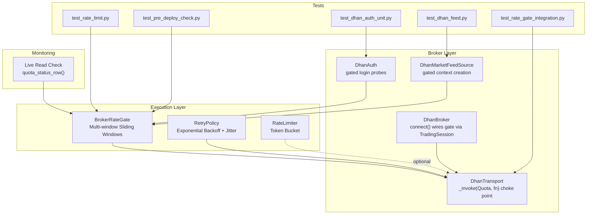
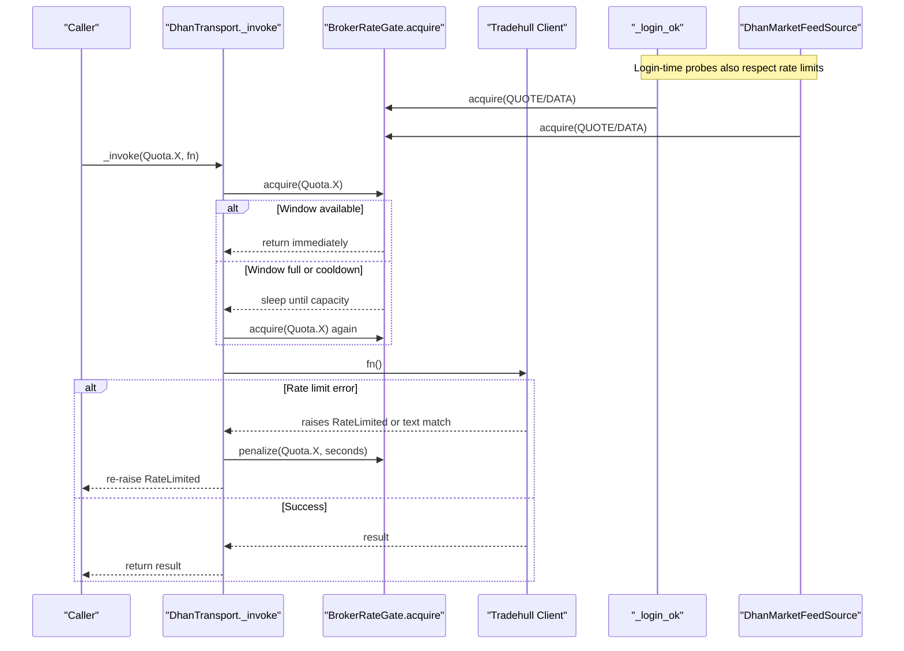
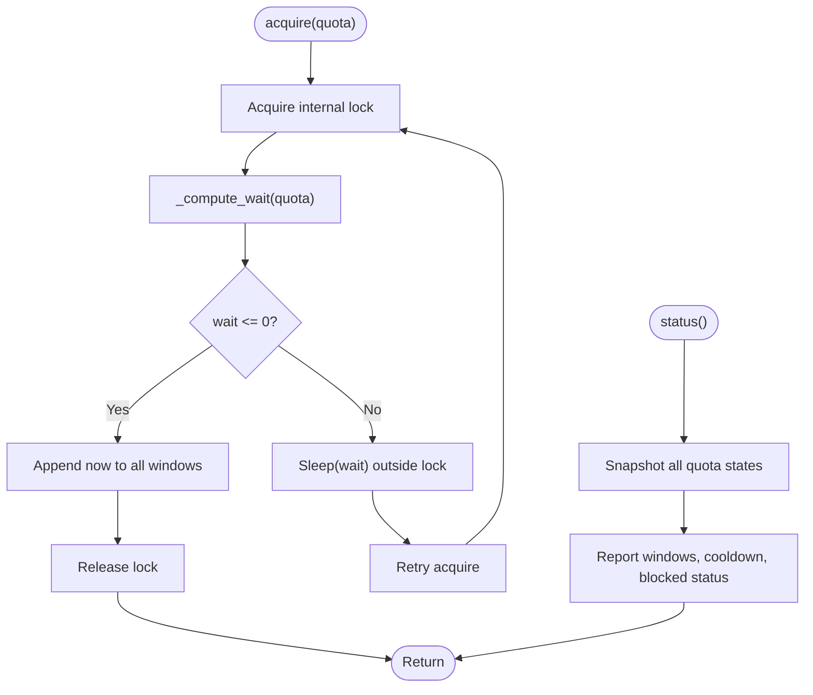
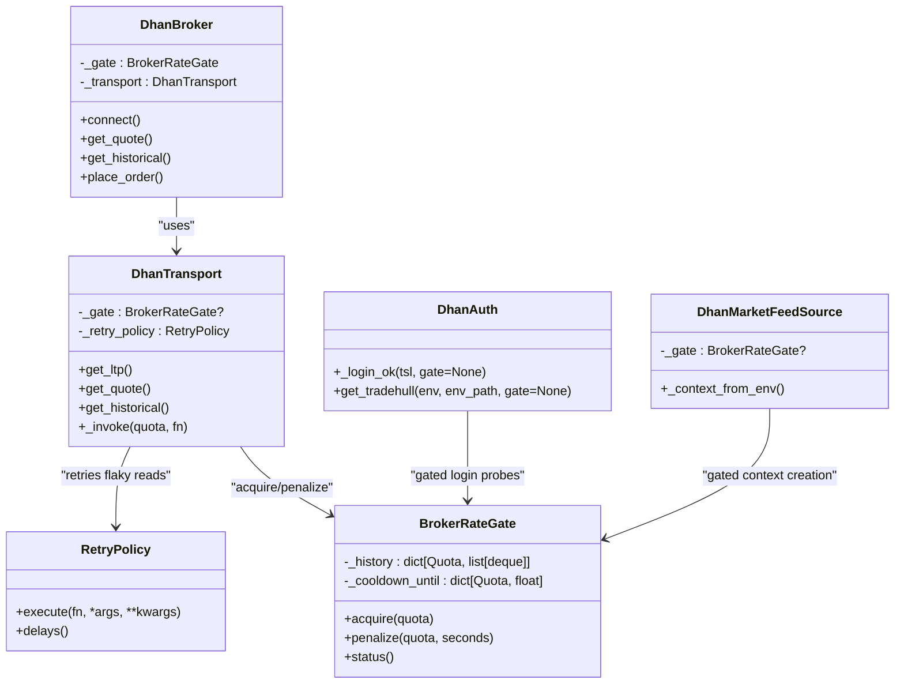
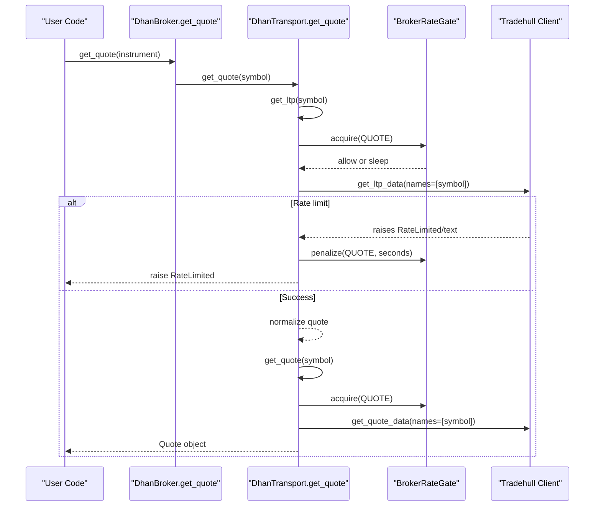
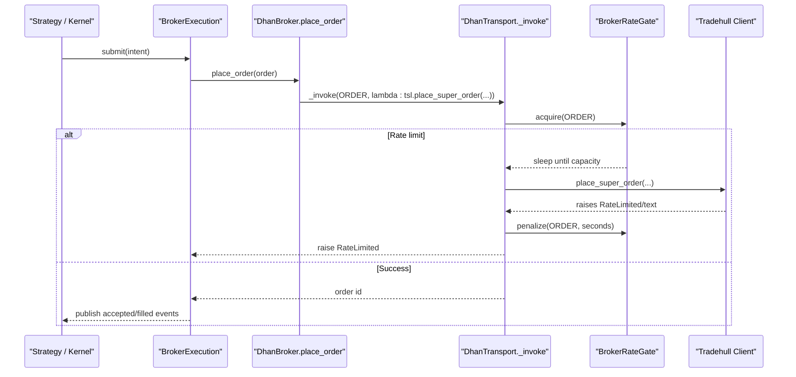
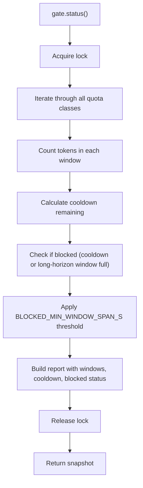
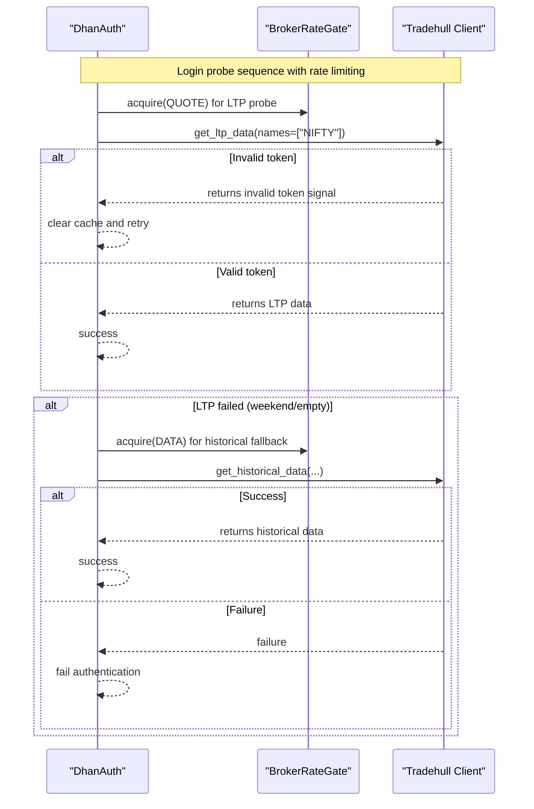
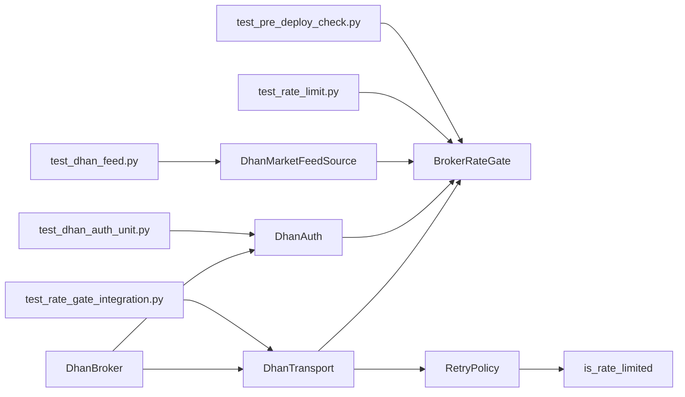

# Rate Limiting Infrastructure

<cite>
**Referenced Files in This Document**
- [rate_limit.py](file://ntrade/execution/rate_limit.py)
- [retry.py](file://ntrade/execution/retry.py)
- [dhan_transport.py](file://ntrade/brokers/dhan_transport.py)
- [dhan.py](file://ntrade/brokers/dhan.py)
- [dhan_auth.py](file://ntrade/brokers/dhan_auth.py)
- [dhan_feed.py](file://ntrade/sources/dhan_feed.py)
- [live_read_check.py](file://scripts/live_read_check.py)
- [test_rate_limit.py](file://tests/test_rate_limit.py)
- [test_rate_gate_integration.py](file://tests/test_rate_gate_integration.py)
- [test_dhan_auth_unit.py](file://tests/test_dhan_auth_unit.py)
- [test_dhan_feed.py](file://tests/test_dhan_feed.py)
- [test_pre_deploy_check.py](file://tests/test_pre_deploy_check.py)
- [ARCHITECTURE.md](file://ARCHITECTURE.md)
</cite>

## Update Summary
**Changes Made**
- Enhanced BrokerRateGate.status() method with new BLOCKED_MIN_WINDOW_SPAN_S constant (60.0s) to distinguish between transient burst window saturation and sustained capacity exhaustion
- Updated status telemetry logic to eliminate false-positive blocked status reporting during login probes and routine operations
- Added comprehensive test coverage for long-horizon window blocking behavior
- Improved quota headroom monitoring accuracy by differentiating between short-term bursts and genuine capacity exhaustion

## Table of Contents
1. [Introduction](#introduction)
2. [Project Structure](#project-structure)
3. [Core Components](#core-components)
4. [Architecture Overview](#architecture-overview)
5. [Detailed Component Analysis](#detailed-component-analysis)
6. [Telemetry and Monitoring](#telemetry-and-monitoring)
7. [Login Probe Rate Limiting](#login-probe-rate-limiting)
8. [Dependency Analysis](#dependency-analysis)
9. [Performance Considerations](#performance-considerations)
10. [Troubleshooting Guide](#troubleshooting-guide)
11. [Conclusion](#conclusion)

## Introduction
This document explains the comprehensive rate limiting infrastructure that protects outbound broker API calls from exceeding Dhan's documented quotas. The system features a multi-window sliding window gate (BrokerRateGate with Quota classes), a typed RateLimited exception, RetryPolicy with exponential backoff, and seamless integration with the Dhan market feed source for login probe rate limiting. The goal is to make the design accessible to both developers and non-experts while providing precise references to the implementation. TradingSession is the preferred entry point that wires the BrokerRateGate into DhanTransport (the single choke point via `DhanTransport._invoke(Quota, fn)`) and propagates it through DhanAuth and DhanMarketFeedSource.

## Project Structure
The rate limiting system lives primarily under ntrade/execution and integrates with the broker layer (ntrade/brokers), authentication (ntrade/brokers/dhan_auth.py), and market feed sources (ntrade/sources). Tests validate behavior across unit and integration scenarios.

**Diagram sources**
- [rate_limit.py:1-194](file://ntrade/execution/rate_limit.py#L1-L194)
- [retry.py:1-128](file://ntrade/execution/retry.py#L1-L128)
- [dhan_transport.py:1-564](file://ntrade/brokers/dhan_transport.py#L1-L564)
- [dhan.py:51-77](file://ntrade/brokers/dhan.py#L51-L77)
- [dhan_auth.py:137-193](file://ntrade/brokers/dhan_auth.py#L137-L193)
- [dhan_feed.py:119-122](file://ntrade/sources/dhan_feed.py#L119-L122)
- [live_read_check.py:19-47](file://scripts/live_read_check.py#L19-L47)

**Section sources**
- [ARCHITECTURE.md:20-60](file://ARCHITECTURE.md#L20-L60)

## Core Components
- **BrokerRateGate**: Thread-safe, multi-window, per-quota sliding windows with cooldown penalization after DH-904. The single choke point every outbound broker REST call passes through.
- **Quota**: Enumerates Dhan's API buckets (QUOTE, DATA, ORDER, NON_TRADING) with default windows.
- **RateLimited**: Typed exception for rate-limit violations; includes optional retry_after.
- **is_rate_limited**: Heuristic to detect rate-limit signals from exceptions.
- **RetryPolicy**: Exponential backoff with jitter; never retries rate-limit failures by default.
- **RateLimiter**: Simple token-bucket limiter for uniform throttling when needed.

Key responsibilities:
- Enforce per-quota limits without a global tick.
- Compute wait times under lock but sleep outside it to avoid head-of-line blocking.
- Normalize DH-904 and similar errors into typed exceptions and apply class-scoped backoff.
- Provide deterministic testing via injectable clock/sleep.
- Support telemetry through status() method for monitoring quota headroom.

**Entry point**: TradingSession (preferred) wires the BrokerRateGate into DhanTransport during `connect("dhan")`, propagating it through DhanAuth and DhanMarketFeedSource.

**Section sources**
- [rate_limit.py:31-194](file://ntrade/execution/rate_limit.py#L31-L194)
- [retry.py:31-128](file://ntrade/execution/retry.py#L31-L128)

## Architecture Overview
The rate limiting architecture is layered and comprehensive. **TradingSession is the preferred entry point** — `connect("dhan")` creates a single `BrokerRateGate` and wires it into `DhanTransport` (the single choke point via `DhanTransport._invoke(Quota, fn)`), `DhanAuth` (login probe rate limiting), and `DhanMarketFeedSource` (context creation). All outbound broker REST calls pass through this gate.

- DhanBroker.connect() creates a shared BrokerRateGate and wires it into DhanTransport.
- DhanTransport._invoke is the single choke point:
  - Acquires the correct quota window.
  - Normalizes exceptions to RateLimited when detected.
  - Applies penalize() to the quota class on rate-limit errors.
- All broker methods route through _invoke with the appropriate Quota.
- Authentication flow (_login_ok) respects rate limits for login probes.
- Market feed source integrates rate limiting for context creation.
- LiveRunner wires the kill switch on RiskHaltedEvent and releases on RiskResumedEvent.

**Diagram sources**
- [dhan_transport.py:88-116](file://ntrade/brokers/dhan_transport.py#L88-L116)
- [rate_limit.py:105-131](file://ntrade/execution/rate_limit.py#L105-L131)
- [dhan_auth.py:156-177](file://ntrade/brokers/dhan_auth.py#L156-L177)
- [dhan_feed.py:162](file://ntrade/sources/dhan_feed.py#L162)

**Section sources**
- [dhan.py:66-77](file://ntrade/brokers/dhan.py#L66-L77)
- [dhan_transport.py:88-116](file://ntrade/brokers/dhan_transport.py#L88-L116)

## Detailed Component Analysis

### BrokerRateGate: Multi-Window Sliding Windows
- Maintains per-quota history deques for each configured window span.
- Computes the maximum wait across all windows and any active cooldown.
- Sleeps outside the lock to prevent slow classes from blocking others.
- Supports injection of clock and sleep for deterministic tests.
- Provides telemetry through status() method for monitoring.

**Diagram sources**
- [rate_limit.py:105-194](file://ntrade/execution/rate_limit.py#L105-L194)

**Section sources**
- [rate_limit.py:76-194](file://ntrade/execution/rate_limit.py#L76-L194)

### Quota Classes and Default Windows
- QUOTE: 1/s
- DATA: 5/s and 100k/day
- ORDER: 10/s, 250/min, 1000/h, 7000/day
- NON_TRADING: 20/s

These defaults align with Dhan's documented rate-limit table and can be overridden at construction.

**Section sources**
- [rate_limit.py:31-47](file://ntrade/execution/rate_limit.py#L31-L47)

### RateLimited Exception and Detection
- Typed exception carrying quota and optional retry_after.
- is_rate_limited detects both typed exceptions and common textual signals (DH-904, 429, etc.).

**Section sources**
- [rate_limit.py:50-74](file://ntrade/execution/rate_limit.py#L50-74)

### RetryPolicy: Exponential Backoff Without Retrying Rate Limits
- Executes a function with configurable max_retries, base_delay, multiplier, max_delay, and jitter.
- Never retries rate-limit failures by default; uses is_rate_limited to short-circuit.

**Section sources**
- [retry.py:31-98](file://ntrade/execution/retry.py#L31-98)

### RateLimiter: Token-Bucket Throttler
- Simple thread-safe limiter enforcing a fixed interval between calls.
- Useful for uniform pacing where a sliding window is not required.

**Section sources**
- [retry.py:100-128](file://ntrade/execution/retry.py#L100-128)

### Integration Points in DhanTransport and DhanBroker
- DhanBroker.connect() creates a shared BrokerRateGate and wires it into DhanTransport.
- DhanTransport._invoke is the single choke point:
  - Acquires the correct quota window.
  - Normalizes exceptions to RateLimited when detected.
  - Applies penalize() to the quota class on rate-limit errors.
- All broker methods route through _invoke with the appropriate Quota.

**Diagram sources**
- [dhan.py:51-77](file://ntrade/brokers/dhan.py#L51-77)
- [dhan_transport.py:54-116](file://ntrade/brokers/dhan_transport.py#L54-116)
- [dhan_auth.py:137-193](file://ntrade/brokers/dhan_auth.py#L137-193)
- [dhan_feed.py:119-122](file://ntrade/sources/dhan_feed.py#L119-122)
- [rate_limit.py:76-131](file://ntrade/execution/rate_limit.py#L76-131)
- [retry.py:31-98](file://ntrade/execution/retry.py#L31-98)

**Section sources**
- [dhan.py:66-77](file://ntrade/brokers/dhan.py#L66-77)
- [dhan_transport.py:88-116](file://ntrade/brokers/dhan_transport.py#L88-L116)

### End-to-End Flow: Quote Fetch

**Diagram sources**
- [dhan_transport.py:147-169](file://ntrade/brokers/dhan_transport.py#L147-169)
- [rate_limit.py:105-131](file://ntrade/execution/rate_limit.py#L105-131)

**Section sources**
- [dhan_transport.py:147-169](file://ntrade/brokers/dhan_transport.py#L147-169)

### Order Placement Flow

**Diagram sources**
- [dhan.py:639-654](file://ntrade/brokers/dhan.py#L639-654)
- [dhan_transport.py:88-116](file://ntrade/brokers/dhan_transport.py#L88-116)
- [rate_limit.py:105-131](file://ntrade/execution/rate_limit.py#L105-131)

**Section sources**
- [dhan.py:639-654](file://ntrade/brokers/dhan.py#L639-654)

## Telemetry and Monitoring

### Status Method for Quota Headroom Monitoring
The BrokerRateGate.status() method provides comprehensive telemetry for monitoring quota usage and headroom:

- Returns a snapshot of all quota classes with their current state
- Shows window usage (used/limit) for each configured time span
- Reports cooldown remaining after rate-limit penalties
- Indicates if a quota class is currently blocked using intelligent threshold detection
- Non-blocking operation that doesn't mutate gate state

**Updated** The blocked status calculation now uses BLOCKED_MIN_WINDOW_SPAN_S (60.0s) to distinguish between transient burst window saturation and sustained capacity exhaustion. Short-term windows (1s/5s) are considered normal operation even when full, while long-horizon windows (≥60s) at capacity indicate genuine exhaustion requiring attention.

**Diagram sources**
- [rate_limit.py:142-177](file://ntrade/execution/rate_limit.py#L142-177)

### Live Read Check Integration
The live_read_check.py script integrates with the rate limiting infrastructure to provide operational visibility:

- Reports quota headroom status during connection checks
- Uses quota_status_row() to render human-readable quota information
- Integrates with go-live decision making (DEGRADED status prevents deployment)
- Shows tightest window usage per quota class for burst shaping insights
- Includes 1.05s settlement period to avoid false positives from login probes

**Section sources**
- [rate_limit.py:142-177](file://ntrade/execution/rate_limit.py#L142-177)
- [live_read_check.py:27-55](file://scripts/live_read_check.py#L27-55)

## Login Probe Rate Limiting

### Authentication Flow with Rate Limiting
The authentication system has been enhanced to respect rate limits during login probes:

- `_login_ok()` function accepts an optional `gate` parameter
- LTP probe calls acquire QUOTA quota before attempting authentication
- Historical data fallback acquires DATA quota when needed
- Gate propagation flows through `get_tradehull()` to `_login_ok()`
- Maintains backward compatibility with `gate=None` (no-op)

**Diagram sources**
- [dhan_auth.py:137-193](file://ntrade/brokers/dhan_auth.py#L137-193)

### Market Feed Source Integration
The DhanMarketFeedSource integrates rate limiting for context creation:

- Accepts optional `gate` parameter in constructor
- Forwards gate to `get_tradehull()` for login probe rate limiting
- Ensures feed construction respects quota windows
- Maintains standalone caller safety with `gate=None`

**Section sources**
- [dhan_auth.py:137-193](file://ntrade/brokers/dhan_auth.py#L137-193)
- [dhan_feed.py:119-122](file://ntrade/sources/dhan_feed.py#L119-122)
- [dhan_feed.py:156-163](file://ntrade/sources/dhan_feed.py#L156-163)

## Dependency Analysis
- DhanBroker depends on DhanTransport and BrokerRateGate.
- DhanTransport depends on BrokerRateGate and RetryPolicy.
- DhanAuth depends on BrokerRateGate for login probe rate limiting.
- DhanMarketFeedSource depends on BrokerRateGate for context creation.
- RetryPolicy depends on is_rate_limited from rate_limit.
- Tests depend on both modules to assert behavior deterministically.

**Diagram sources**
- [dhan.py:51-77](file://ntrade/brokers/dhan.py#L51-77)
- [dhan_transport.py:54-116](file://ntrade/brokers/dhan_transport.py#L54-116)
- [dhan_auth.py:137-193](file://ntrade/brokers/dhan_auth.py#L137-193)
- [dhan_feed.py:119-122](file://ntrade/sources/dhan_feed.py#L119-122)
- [retry.py:23-28](file://ntrade/execution/retry.py#L23-28)
- [test_rate_limit.py:14-16](file://tests/test_rate_limit.py#L14-16)
- [test_rate_gate_integration.py:24-26](file://tests/test_rate_gate_integration.py#L24-26)
- [test_dhan_auth_unit.py:325-381](file://tests/test_dhan_auth_unit.py#L325-381)
- [test_dhan_feed.py:33-35](file://tests/test_dhan_feed.py#L33-35)
- [test_pre_deploy_check.py:158-165](file://tests/test_pre_deploy_check.py#L158-165)

**Section sources**
- [dhan.py:51-77](file://ntrade/brokers/dhan.py#L51-77)
- [dhan_transport.py:54-116](file://ntrade/brokers/dhan_transport.py#L54-116)
- [retry.py:23-28](file://ntrade/execution/retry.py#L23-28)

## Performance Considerations
- Sliding windows vs min-interval: BrokerRateGate uses real sliding windows per quota, allowing mixed rates (e.g., 1/s and 10/s) without a shared tick.
- Lock granularity: Wait computation occurs under the lock; actual sleep happens outside, preventing slow classes from blocking others.
- Class-scoped penalties: Penalize only affects the offending quota, preserving throughput for other classes.
- Retry policy: Exponential backoff with jitter reduces thundering herd; rate-limit failures are not retried to avoid amplifying quota exhaustion.
- Token bucket limiter: Optional simple throttle for uniform pacing when sliding windows are unnecessary.
- Telemetry overhead: status() method is read-only and non-blocking, suitable for frequent monitoring.
- Login probe efficiency: Rate-limited login probes prevent authentication bursts during startup.
- **Enhanced blocking detection**: BLOCKED_MIN_WINDOW_SPAN_S threshold eliminates false positives from short-term window saturation while maintaining sensitivity to genuine capacity exhaustion.

## Troubleshooting Guide
Common issues and resolutions:
- Frequent DH-904 errors: Ensure calls are routed through _invoke with the correct Quota; verify no bypasses exist. Check that penalize is applied on rate-limit exceptions.
- Unexpected delays: Confirm window configuration matches expected quotas; inspect cooldown_until for the affected quota.
- Non-retrying flaky endpoints: Use RetryPolicy.execute for known flaky reads; ensure rate-limit exceptions are not swallowed.
- PaperBroker unaffected: PaperBroker has no gate; if rate limiting appears absent, confirm you are using PaperBroker rather than DhanBroker.
- Login probe failures: Verify that gate is properly propagated through authentication chain; check quota windows for QUOTE and DATA classes.
- Feed connection issues: Ensure gate is passed to DhanMarketFeedSource constructor; verify login probes respect rate limits.
- Monitoring gaps: Use quota_status_row() to diagnose quota headroom; check DEGRADED status in live-read checks.
- **False-positive blocked status**: If status() reports blocked for short-term windows, this is expected behavior - only long-horizon windows (≥60s) at capacity should trigger blocked status.

**Section sources**
- [dhan_transport.py:88-116](file://ntrade/brokers/dhan_transport.py#L88-116)
- [test_rate_gate_integration.py:188-200](file://tests/test_rate_gate_integration.py#L188-200)
- [live_read_check.py:27-55](file://scripts/live_read_check.py#L27-55)

## Conclusion
The comprehensive rate limiting infrastructure provides robust, multi-window enforcement aligned with Dhan's quotas, integrates cleanly into the broker transport, authentication, and market feed layers, and offers resilient retry semantics. Its design emphasizes correctness (typed exceptions, class-scoped backoff), performance (lock scope, sliding windows), testability (injectable clock/sleep), and observability (telemetry status method). With comprehensive tests validating both unit and integration behaviors, including login probe rate limiting and feed source integration, the system ensures safe, predictable throttling across live trading workloads.

**Updated** The recent enhancement to the BLOCKED_MIN_WINDOW_SPAN_S constant (60.0s) significantly improves the accuracy of blocked status reporting by distinguishing between transient burst window saturation and sustained capacity exhaustion. This eliminates false-positive blocked status during login probes and routine operations while maintaining sensitivity to genuine quota exhaustion scenarios.