# Transport Layer & Connectivity

<cite>
**Referenced Files in This Document**
- [dhan.py](file://ntrade/brokers/dhan.py)
- [base.py](file://ntrade/brokers/base.py)
- [dhan_transport.py](file://ntrade/brokers/dhan_transport.py)
- [dhan_mapper.py](file://ntrade/brokers/dhan_mapper.py)
- [dhan_auth.py](file://ntrade/brokers/dhan_auth.py)
- [dhan_auth_provider.py](file://ntrade/brokers/dhan_auth_provider.py)
- [dhan_feed.py](file://ntrade/sources/dhan_feed.py)
- [market_feed.py](file://ntrade/sources/market_feed.py)
- [event_bus.py](file://ntrade/kernel/event_bus.py)
- [retry.py](file://ntrade/execution/retry.py)
- [rate_limit.py](file://ntrade/execution/rate_limit.py)
- [market.py](file://ntrade/events/market.py)
- [base.py](file://ntrade/events/base.py)
- [clock.py](file://ntrade/kernel/clock.py)
</cite>

## Update Summary
**Changes Made**
- Enhanced DhanTransport get_depth method with improved retry mechanism and timeout handling
- Implemented robust LTP failure envelope rejection to prevent stale data corruption
- Updated error propagation patterns to ensure RateLimited exceptions are never swallowed
- Enhanced rate limiting behavior with better BrokerRateGate integration
- Improved troubleshooting guide to reflect new error propagation patterns and rate limiting behavior

## Table of Contents
1. [Introduction](#introduction)
2. [Project Structure](#project-structure)
3. [Core Components](#core-components)
4. [Architecture Overview](#architecture-overview)
5. [Detailed Component Analysis](#detailed-component-analysis)
6. [Advanced Rate Limiting System](#advanced-rate-limiting-system)
7. [WebSocket Feed Management](#websocket-feed-management)
8. [Dependency Analysis](#dependency-analysis)
9. [Performance Considerations](#performance-considerations)
10. [Troubleshooting Guide](#troubleshooting-guide)
11. [Conclusion](#conclusion)
12. [Appendices](#appendices)

## Introduction
This document explains the transport layer abstraction that manages network connectivity and message handling for broker integrations, with a focus on Dhan via Tradehull. It covers:
- WebSocket connection management for market data streaming with simplified feed modes
- REST-based transport for quotes, history, orders, and portfolio
- Message serialization and deserialization between Python objects and broker wire formats
- Event-driven architecture for incoming messages, order confirmations, and market data updates
- Error handling strategies including timeouts, reconnection signals, and protocol errors
- **Comprehensive quota-based rate limiting system using BrokerRateGate to prevent API throttling issues**
- **Simplified feed mode management with hardcoded full-data subscription code 21**
- **Enhanced retry mechanisms and timeout handling for robust connectivity**
- **Improved error propagation patterns ensuring critical failures are never silently ignored**
- Extensibility patterns for custom transports and binary protocols
- Monitoring, metrics, and debugging tools at the network level
- Scalability considerations for concurrent connections and high-frequency processing

## Project Structure
The transport layer is split across several modules:
- Broker adapter and concrete implementation (DhanBroker)
- Transport wrapper around the underlying library (DhanTransport)
- Authentication lifecycle and token refresh (DhanAuthProvider, dhan_auth)
- Data mapping and normalization (DhanMapper)
- Live websocket feed source with simplified feed modes (DhanMarketFeedSource)
- Event bus and canonical events (EventBus, Tick/Quote/Depth events)
- Resilience primitives (RetryPolicy, BrokerRateGate)
- Time source (TradingClock) to ensure zero-parity timestamps

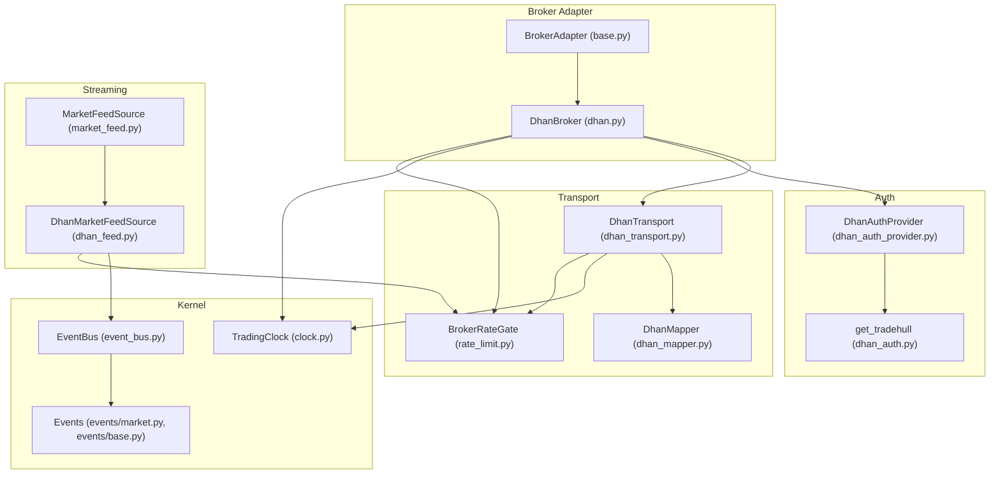

**Diagram sources**
- [base.py:25-163](file://ntrade/brokers/base.py#L25-L163)
- [dhan.py:54-105](file://ntrade/brokers/dhan.py#L54-L105)
- [dhan_transport.py:48-117](file://ntrade/brokers/dhan_transport.py#L48-L117)
- [dhan_mapper.py:35-94](file://ntrade/brokers/dhan_mapper.py#L35-L94)
- [dhan_auth_provider.py:28-75](file://ntrade/brokers/dhan_auth_provider.py#L28-L75)
- [dhan_auth.py:114-167](file://ntrade/brokers/dhan_auth.py#L114-L167)
- [market_feed.py:23-46](file://ntrade/sources/market_feed.py#L23-46)
- [dhan_feed.py:98-166](file://ntrade/sources/dhan_feed.py#L98-L166)
- [event_bus.py:24-81](file://ntrade/kernel/event_bus.py#L24-81)
- [market.py:11-48](file://ntrade/events/market.py#L11-L48)
- [base.py:16-22](file://ntrade/events/base.py#L16-L22)
- [clock.py:14-55](file://ntrade/kernel/clock.py#L14-L55)
- [rate_limit.py:76-147](file://ntrade/execution/rate_limit.py#L76-L147)

**Section sources**
- [base.py:25-163](file://ntrade/brokers/base.py#L25-L163)
- [dhan.py:54-105](file://ntrade/brokers/dhan.py#L54-L105)
- [dhan_transport.py:48-117](file://ntrade/brokers/dhan_transport.py#L48-L117)
- [dhan_mapper.py:35-94](file://ntrade/brokers/dhan_mapper.py#L35-L94)
- [dhan_auth_provider.py:28-75](file://ntrade/brokers/dhan_auth_provider.py#L28-L75)
- [dhan_auth.py:114-167](file://ntrade/brokers/dhan_auth.py#L114-L167)
- [market_feed.py:23-46](file://ntrade/sources/market_feed.py#L23-46)
- [dhan_feed.py:98-166](file://ntrade/sources/dhan_feed.py#L98-L166)
- [event_bus.py:24-81](file://ntrade/kernel/event_bus.py#L24-81)
- [market.py:11-48](file://ntrade/events/market.py#L11-L48)
- [base.py:16-22](file://ntrade/events/base.py#L16-L22)
- [clock.py:14-55](file://ntrade/kernel/clock.py#L14-L55)

## Core Components
- BrokerAdapter: Abstract interface defining connect/disconnect, market data, orders, and streaming subscriptions.
- DhanBroker: Concrete broker implementation orchestrating auth, transport, and mapping; enforces SEBI rules and handles special order types.
- DhanTransport: Thin wrapper over Tradehull API calls with retry and error handling; normalizes responses into domain objects.
- DhanMapper: Pure functions to map raw broker payloads to canonical domain models (quotes, depth, books, positions).
- DhanMarketFeedSource: Live websocket feed adapter publishing canonical events to the kernel bus with simplified feed modes.
- EventBus: Synchronous publish/subscribe bus with thread-safe dispatch and event history.
- RetryPolicy and BrokerRateGate: Resilience primitives for transient failures and sophisticated rate control.
- TradingClock: Deterministic time source ensuring zero-parity across live, replay, and simulation.

Key responsibilities:
- Network boundary isolation: Domain code never touches REST/websocket directly.
- Zero-parity timestamps: All events carry clock-derived timestamps.
- Robustness: Retries, timeouts, and graceful fallbacks.
- Normalization: Consistent domain models regardless of broker specifics.
- **Quota-based rate limiting: Granular API throttling across all Dhan interactions using BrokerRateGate.**
- **Simplified feed management: Hardcoded full-data subscription code 21 for consistent market data delivery.**
- **Enhanced retry mechanisms: Robust retry logic with exponential backoff for flaky endpoints.**
- **Improved error propagation: Critical failures like rate limits are never silently ignored.**

**Section sources**
- [base.py:25-163](file://ntrade/brokers/base.py#L25-L163)
- [dhan.py:54-105](file://ntrade/brokers/dhan.py#L54-L105)
- [dhan_transport.py:48-117](file://ntrade/brokers/dhan_transport.py#L48-L117)
- [dhan_mapper.py:35-94](file://ntrade/brokers/dhan_mapper.py#L35-L94)
- [dhan_feed.py:98-166](file://ntrade/sources/dhan_feed.py#L98-L166)
- [event_bus.py:24-81](file://ntrade/kernel/event_bus.py#L24-81)
- [retry.py:19-98](file://ntrade/execution/retry.py#L19-L98)
- [rate_limit.py:76-147](file://ntrade/execution/rate_limit.py#L76-L147)
- [clock.py:14-55](file://ntrade/kernel/clock.py#L14-L55)

## Architecture Overview
The transport layer separates concerns into authentication, transport, mapping, and streaming. The broker adapter composes these components and exposes a stable domain-facing API.

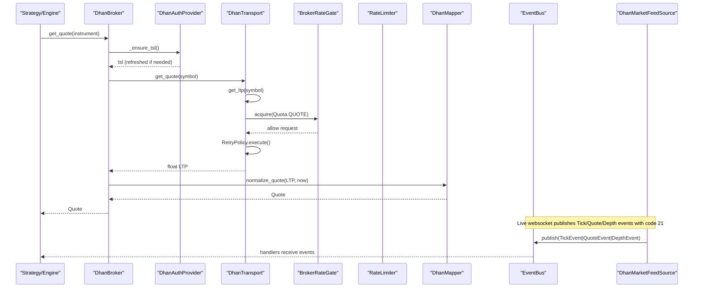

**Diagram sources**
- [dhan.py:107-140](file://ntrade/brokers/dhan.py#L107-L140)
- [dhan_auth_provider.py:58-75](file://ntrade/brokers/dhan_auth_provider.py#L58-75)
- [dhan_transport.py:80-101](file://ntrade/brokers/dhan_transport.py#L80-101)
- [dhan_mapper.py:76-94](file://ntrade/brokers/dhan_mapper.py#L76-94)
- [dhan_feed.py:206-224](file://ntrade/sources/dhan_feed.py#L206-L224)
- [event_bus.py:47-66](file://ntrade/kernel/event_bus.py#L47-66)
- [retry.py:70-98](file://ntrade/execution/retry.py#L70-98)

## Detailed Component Analysis

### BrokerAdapter and DhanBroker
- BrokerAdapter defines the contract for connect/disconnect, market data, orders, and streaming subscriptions.
- DhanBroker implements the contract, integrating:
  - Authentication provider for token lifecycle
  - Transport for REST calls with retries
  - Mapper for normalization
  - Special handling for SEBI-compliant order types and bracket orders
  - **Shared BrokerRateGate instance for sophisticated API throttling**

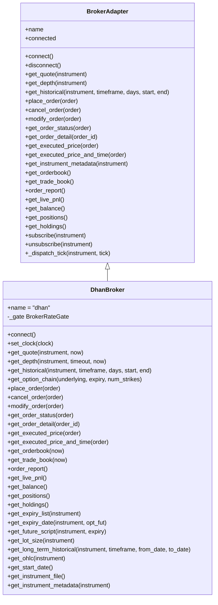

**Diagram sources**
- [base.py:25-163](file://ntrade/brokers/base.py#L25-L163)
- [dhan.py:54-634](file://ntrade/brokers/dhan.py#L54-L634)

**Section sources**
- [base.py:25-163](file://ntrade/brokers/base.py#L25-L163)
- [dhan.py:54-634](file://ntrade/brokers/dhan.py#L54-L634)

### DhanTransport: REST Transport Wrapper with BrokerRateGate Integration
Responsibilities:
- Wrap Tradehull API calls with retry policy and consistent error handling
- Normalize responses into domain objects via mapper
- Provide methods for LTP, quote, depth snapshot, historical data, option chain, orders, and portfolio
- **Implement sophisticated rate limiting through `_invoke(quota, fn)` method with BrokerRateGate**

Key behaviors:
- get_ltp uses RetryPolicy to handle flaky endpoints; raises a specific BrokerDataError on persistent failure or zero price
- **All API calls are routed through `_invoke(quota, fn)` which acquires the appropriate quota window**
- get_depth performs a timeout-bounded snapshot read using a background thread with enhanced retry mechanism
- Historical endpoints normalize and filter results consistently
- **Rate limit violations surface as `RateLimited` exceptions rather than silent failures**

**Updated** Enhanced retry mechanism and timeout handling:

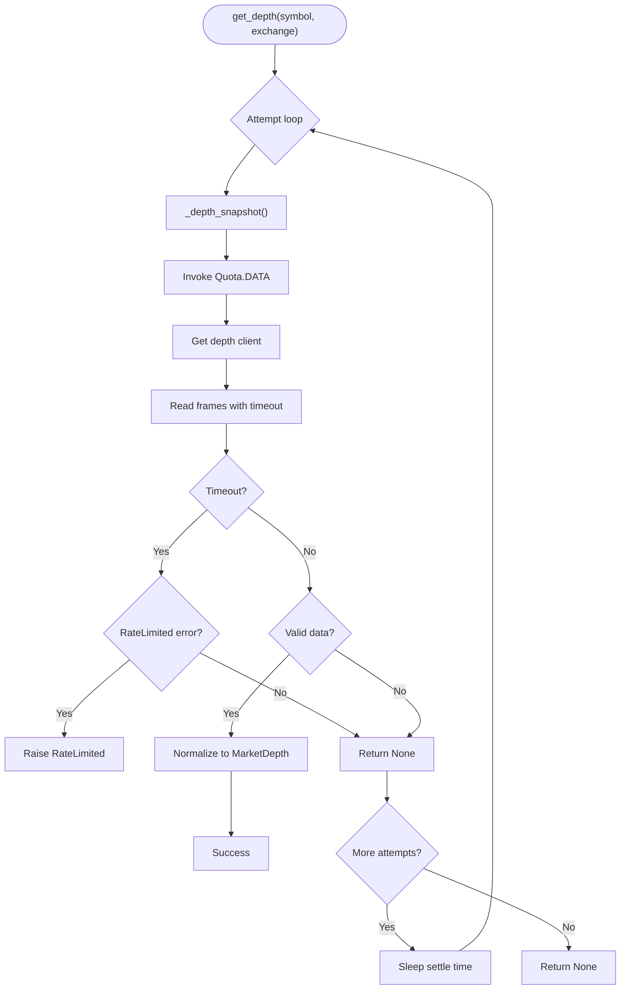

**Diagram sources**
- [dhan_transport.py:183-245](file://ntrade/brokers/dhan_transport.py#L183-L245)

**Section sources**
- [dhan_transport.py:48-117](file://ntrade/brokers/dhan_transport.py#L48-L117)
- [retry.py:19-57](file://ntrade/execution/retry.py#L19-L57)

### DhanMapper: Serialization and Deserialization
Responsibilities:
- Convert broker-specific payloads (dicts, DataFrames) into canonical domain models
- Normalize columns, handle NaN/missing values, and enforce consistent field names
- Build OptionChain from Dhan-style frames, including Greeks when available

Highlights:
- normalize_quote builds Quote with optional enrichment
- normalize_history standardizes OHLCV columns and filters by date ranges
- normalize_orderbook and normalize_tradebook produce typed book entries
- positions_from_df and holdings_from_df map portfolio rows safely

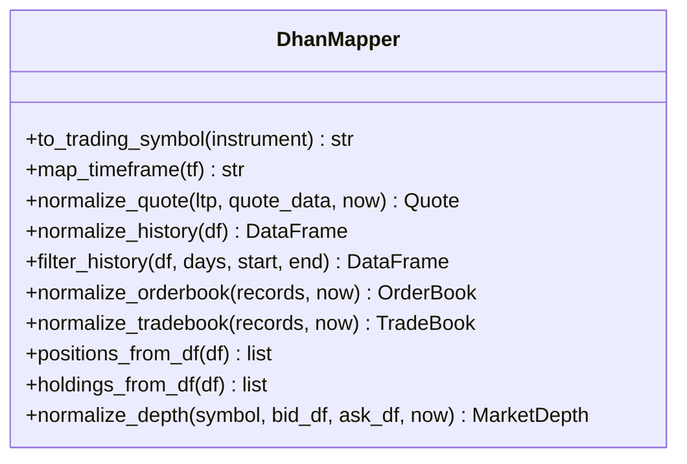

**Diagram sources**
- [dhan_mapper.py:35-239](file://ntrade/brokers/dhan_mapper.py#L35-L239)

**Section sources**
- [dhan_mapper.py:35-239](file://ntrade/brokers/dhan_mapper.py#L35-L239)

### DhanMarketFeedSource: WebSocket Streaming with Simplified Feed Modes
Responsibilities:
- Connect to Dhan's websocket via dhanhq.MarketFeed
- Parse payloads into canonical events (TickEvent, QuoteEvent, DepthEvent)
- Publish events to the kernel bus with deterministic timestamps
- Handle disconnects and emit lifecycle events
- **Implement rate limiting for reconnection attempts**
- **Use hardcoded full-data subscription code 21 for consistent market data delivery**

Connection management:
- Lazy initialization of feed instance
- Background thread started by feed.start()
- wait_ready ensures warmup and minimum payload ingestion
- stop closes connection and resets internal state
- **Reconnection attempts are rate-limited to prevent rapid reconnect loops**
- **Consistent subscription code 21 ensures full market data including depth information**

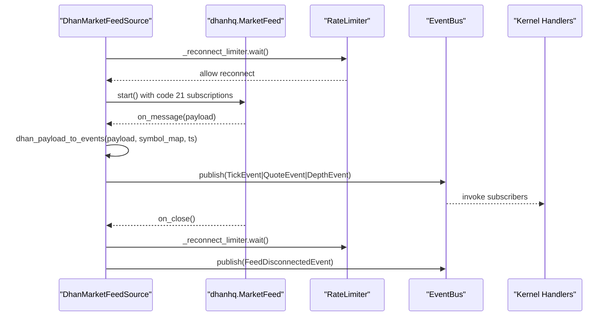

**Diagram sources**
- [dhan_feed.py:175-224](file://ntrade/sources/dhan_feed.py#L175-L224)
- [event_bus.py:47-66](file://ntrade/kernel/event_bus.py#L47-66)
- [retry.py:70-98](file://ntrade/execution/retry.py#L70-98)

**Section sources**
- [dhan_feed.py:98-233](file://ntrade/sources/dhan_feed.py#L98-L233)
- [market_feed.py:23-46](file://ntrade/sources/market_feed.py#L23-L46)

### Authentication and Token Lifecycle
Responsibilities:
- Load environment variables and credentials
- Prefer shared token store, then env access token, then PIN+TOTP fallback
- Proactive token refresh before expiry to avoid DH-905 errors
- Persist tokens securely and manage cooldowns for TOTP attempts

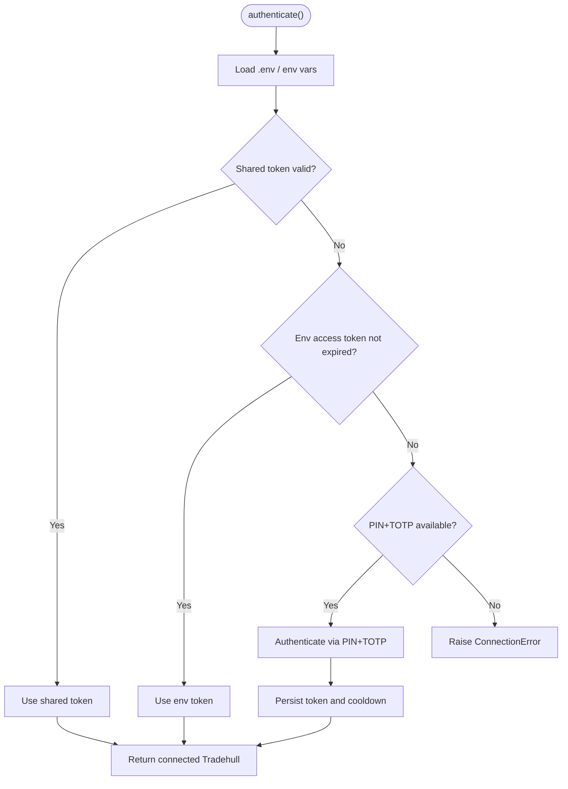

**Diagram sources**
- [dhan_auth.py:114-167](file://ntrade/brokers/dhan_auth.py#L114-L167)
- [dhan_auth_provider.py:47-75](file://ntrade/brokers/dhan_auth_provider.py#L47-L75)

**Section sources**
- [dhan_auth.py:114-167](file://ntrade/brokers/dhan_auth.py#L114-L167)
- [dhan_auth_provider.py:28-142](file://ntrade/brokers/dhan_auth_provider.py#L28-L142)

### Event Bus and Canonical Events
Responsibilities:
- Thread-safe publish/subscribe with reentrant lock
- Record event history for replay/debugging
- Swallow handler exceptions to keep the bus resilient

Event model:
- Base Event carries timestamp and unique ID
- Market events include TickEvent, QuoteEvent, DepthEvent, CandleClosedEvent, QuoteUpdatedEvent, IndicatorUpdatedEvent

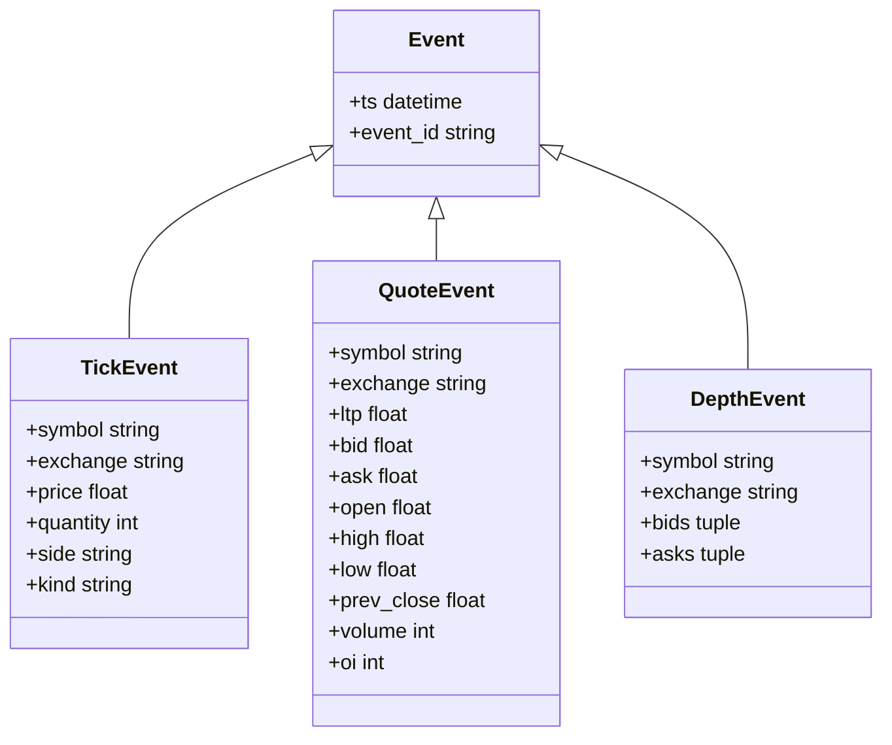

**Diagram sources**
- [base.py:16-22](file://ntrade/events/base.py#L16-L22)
- [market.py:11-48](file://ntrade/events/market.py#L11-L48)

**Section sources**
- [event_bus.py:24-81](file://ntrade/kernel/event_bus.py#L24-81)
- [base.py:16-22](file://ntrade/events/base.py#L16-L22)
- [market.py:11-48](file://ntrade/events/market.py#L11-L48)

### Resilience Primitives
- RetryPolicy: Exponential backoff with jitter for transient failures
- BrokerRateGate: Sophisticated multi-window rate limiter with class-scoped quotas

Usage:
- DhanTransport wraps flaky calls with RetryPolicy.execute
- BrokerRateGate provides granular quota-based throttling across all Dhan interactions
- **DhanBroker initializes BrokerRateGate during connection with default quota windows**
- **DhanMarketFeedSource uses separate RateLimiter for reconnection throttling**

**Section sources**
- [retry.py:19-98](file://ntrade/execution/retry.py#L19-L98)
- [rate_limit.py:76-147](file://ntrade/execution/rate_limit.py#L76-L147)
- [dhan_transport.py:80-101](file://ntrade/brokers/dhan_transport.py#L80-101)

## Advanced Rate Limiting System

**Updated** Comprehensive quota-based rate limiting system implemented throughout Dhan integration using BrokerRateGate, replacing the previous simple RateLimiter approach.

### BrokerRateGate Implementation
The BrokerRateGate provides thread-safe multi-window rate limiting with configurable quota classes:

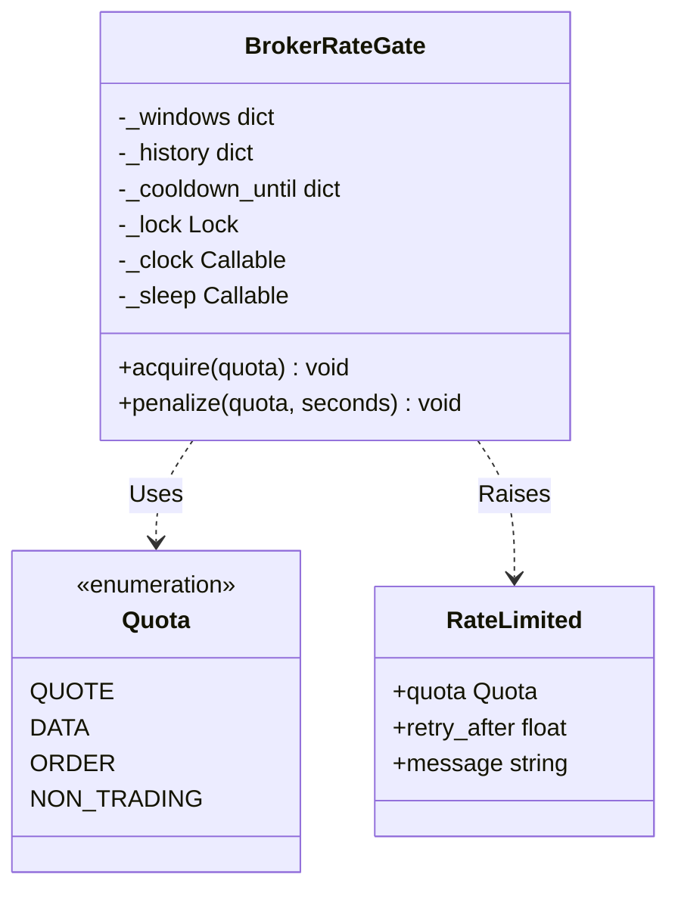

**Diagram sources**
- [rate_limit.py:76-147](file://ntrade/execution/rate_limit.py#L76-L147)
- [rate_limit.py:31-38](file://ntrade/execution/rate_limit.py#L31-L38)
- [rate_limit.py:50-62](file://ntrade/execution/rate_limit.py#L50-L62)

### DhanBroker Rate Gate Configuration
DhanBroker initializes a shared BrokerRateGate instance during connection:

```python
def connect(self) -> "DhanBroker":
    # One shared gate per session — every outbound TSL call is throttled through it
    self._gate = BrokerRateGate()
    self.tsl = self._auth.authenticate(gate=self._gate)
    self._transport = DhanTransport(
        self.tsl, gate=self._gate,
        clock=getattr(self, "_clock", None),
    )
    self._connected = True
    return self
```

### DhanTransport Throttling Mechanism
The transport layer ensures consistent rate limiting across all Dhan API interactions through the `_invoke` method:

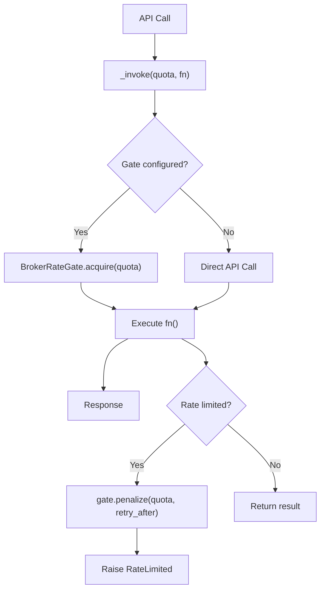

**Diagram sources**
- [dhan_transport.py:88-116](file://ntrade/brokers/dhan_transport.py#L88-L116)

### Quota Classes and Windows
The system supports four distinct quota classes with different rate limits:

- **QUOTE**: 1 request per second (for LTP and quote data)
- **DATA**: 5 requests per second, 100,000 per day (for historical data)
- **ORDER**: 10 requests per second, 250 per minute, 1000 per hour, 7000 per day (for order operations)
- **NON_TRADING**: 20 requests per second (for account and metadata operations)

### WebSocket Feed Reconnection Rate Limiting
The DhanMarketFeedSource implements separate rate limiting for reconnection attempts:

```python
def __init__(self, ...):
    # ... existing initialization ...
    self._reconnect_limiter = RateLimiter(calls_per_second=0.5)  # Slower for reconnects

def start(self) -> None:
    """Start the websocket in a background thread (non-blocking)."""
    self._reconnect_limiter.wait()  # Prevent rapid reconnect loops
    # ... rest of start logic
```

### Rate Limiting Strategy Benefits
- **Prevents API throttling**: Multi-window rate limiting matches Dhan's documented API limits
- **Thread-safe operation**: Multiple concurrent requests are properly serialized per quota class
- **Class-scoped penalties**: Rate limit violations penalize only the affected quota class
- **Graceful degradation**: Requests are delayed rather than rejected when limits are exceeded
- **Resource protection**: Prevents overwhelming the broker's API servers
- **Feed stability**: 0.5 calls/second limit prevents reconnect storms during network issues
- **Proper error propagation**: Rate limit violations surface as `RateLimited` exceptions

**Section sources**
- [dhan.py:66-77](file://ntrade/brokers/dhan.py#L66-L77)
- [dhan_transport.py:88-116](file://ntrade/brokers/dhan_transport.py#L88-L116)
- [dhan_feed.py:124](file://ntrade/sources/dhan_feed.py#L124)
- [rate_limit.py:76-147](file://ntrade/execution/rate_limit.py#L76-L147)

## WebSocket Feed Management

**Updated** Simplified feed mode management with hardcoded full-data subscription code 21.

### Feed Mode Simplification
The DhanMarketFeedSource has been simplified to eliminate speculative feed mode codes:

- **Removed**: `_MODE_CODES` dictionary, `_mode_code()` method, and `mode/version` parameters
- **Implemented**: Hardcoded subscription code 21 for full-data market feeds
- **Benefits**: Consistent behavior, reduced complexity, guaranteed full market data including depth

### Subscription Code 21
The hardcoded code 21 represents full-data subscription which includes:
- Real-time price updates (LTP)
- Quote data (open, high, low, close, volume, OI)
- Market depth information (bid/ask levels)
- Complete tick data with quantities

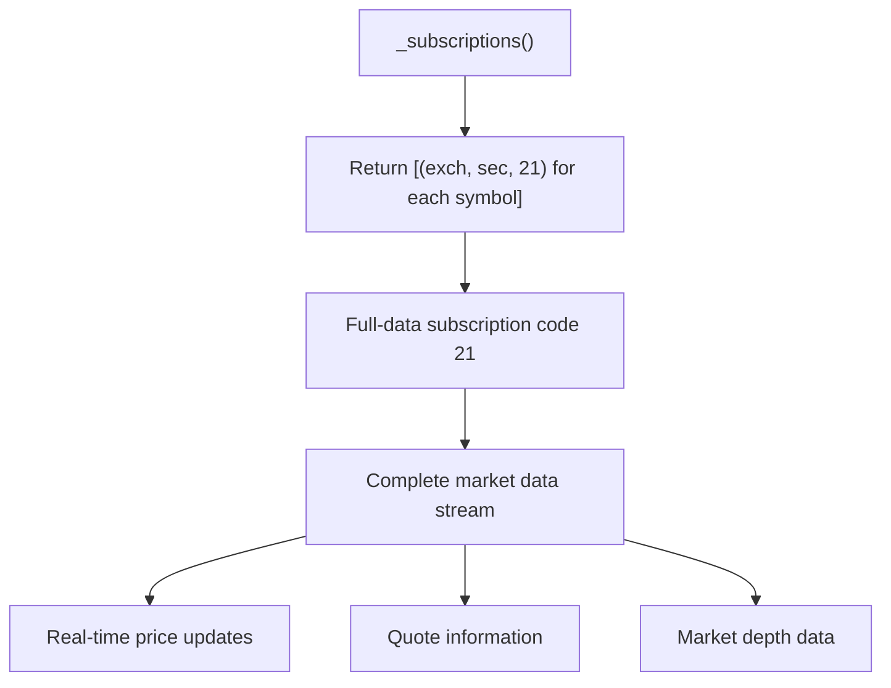

**Diagram sources**
- [dhan_feed.py:128-129](file://ntrade/sources/dhan_feed.py#L128-L129)

### Feed Initialization and Version Management
The feed initialization now uses hardcoded version "v2" for consistency:

```python
def _build_feed(self):
    # ... existing logic ...
    feed = MarketFeed(
        context, self._subscriptions(), version="v2",
        on_message=self._on_message, on_error=self._on_error,
        on_close=self._on_close,
    )
```

### Feed Reconnection Strategy
Enhanced reconnection handling with dedicated rate limiting:

- **Separate RateLimiter**: Dedicated limiter for reconnection attempts (0.5 calls/second)
- **Automatic recovery**: Seamless reconnection after network interruptions
- **State preservation**: Maintains subscription state across reconnections
- **Event notification**: Emits FeedDisconnectedEvent for monitoring and alerting

**Section sources**
- [dhan_feed.py:128-150](file://ntrade/sources/dhan_feed.py#L128-L150)
- [dhan_feed.py:210-224](file://ntrade/sources/dhan_feed.py#L210-L224)

## Dependency Analysis
The transport layer exhibits clear separation:
- BrokerAdapter abstracts broker-specific logic
- DhanBroker composes auth, transport, and mapper
- DhanTransport depends on Tradehull, mapper, and BrokerRateGate
- DhanMarketFeedSource depends on dhanhq and publishes to EventBus
- EventBus decouples producers and consumers
- TradingClock provides deterministic timestamps
- **BrokerRateGate provides shared quota-based rate limiting across components**

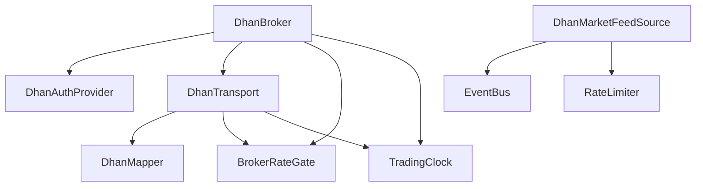

**Diagram sources**
- [dhan.py:54-105](file://ntrade/brokers/dhan.py#L54-L105)
- [dhan_transport.py:48-117](file://ntrade/brokers/dhan_transport.py#L48-L117)
- [dhan_mapper.py:35-94](file://ntrade/brokers/dhan_mapper.py#L35-L94)
- [dhan_feed.py:98-166](file://ntrade/sources/dhan_feed.py#L98-L166)
- [event_bus.py:24-81](file://ntrade/kernel/event_bus.py#L24-81)
- [clock.py:14-55](file://ntrade/kernel/clock.py#L14-L55)
- [rate_limit.py:76-147](file://ntrade/execution/rate_limit.py#L76-L147)

**Section sources**
- [dhan.py:54-105](file://ntrade/brokers/dhan.py#L54-L105)
- [dhan_transport.py:48-117](file://ntrade/brokers/dhan_transport.py#L48-L117)
- [dhan_mapper.py:35-94](file://ntrade/brokers/dhan_mapper.py#L35-L94)
- [dhan_feed.py:98-166](file://ntrade/sources/dhan_feed.py#L98-L166)
- [event_bus.py:24-81](file://ntrade/kernel/event_bus.py#L24-81)
- [clock.py:14-55](file://ntrade/kernel/clock.py#L14-L55)

## Performance Considerations
- WebSocket throughput:
  - DhanMarketFeedSource processes payloads in callbacks; ensure handlers are lightweight
  - Use wait_ready to avoid busy loops during warmup
  - **BrokerRateGate adds minimal overhead (~microseconds per acquire call)**
  - **Hardcoded code 21 eliminates mode selection overhead**
- REST latency:
  - RetryPolicy reduces transient failures but adds delay; tune max_retries and base_delay
  - Batch operations where possible (e.g., option chains)
  - **BrokerRateGate prevents API throttling which would cause longer delays**
- Memory:
  - Avoid retaining large DataFrames beyond normalization; mapper returns domain objects
- Concurrency:
  - EventBus serializes dispatch; avoid heavy work in handlers
  - Use separate threads for blocking I/O (as done for depth snapshots)
  - **BrokerRateGate is thread-safe and efficient for concurrent access**
  - **Separate rate limiters for different operations prevent contention**

## Troubleshooting Guide
Common issues and resolutions:
- LTP fetch failures:
  - DhanTransport raises BrokerDataError after retries; check network and broker status
  - Ensure instrument symbols are correct and mapped properly
  - **Verify BrokerRateGate configuration matches Dhan API limits**
  - **Enhanced failure envelope detection prevents stale data corruption**
- WebSocket disconnects:
  - DhanMarketFeedSource emits FeedDisconnectedEvent; monitor and reconnect as needed
  - Verify credentials and permissions for market data
  - **Check reconnection rate limiter isn't too aggressive**
  - **Ensure code 21 subscriptions are maintained across reconnections**
- Order rejections:
  - DhanBroker enforces SEBI rules; MARKET orders converted to LIMIT for F&O
  - Check LTP availability before placing orders
- Token expiry:
  - DhanAuthProvider proactively refreshes tokens; ensure PIN+TOTP configured
  - Shared token store must be accessible and not near expiry
- **Rate limiting issues:**
  - If API calls are being delayed excessively, verify BrokerRateGate configuration
  - Monitor for excessive throttling which may indicate misconfigured limits
  - Check that shared BrokerRateGate instances are properly initialized
  - **RateLimited exceptions should propagate correctly without being swallowed**
  - **Enhanced error propagation ensures critical failures are never masked**
- **Feed mode issues:**
  - All subscriptions now use code 21; no manual mode configuration needed
  - Verify full market data is received including depth information
  - Check that version "v2" is consistently used across feed operations
- **Enhanced retry mechanisms:**
  - Depth snapshots now have improved retry logic with timeout handling
  - Failed attempts are retried with settle periods to allow websocket re-arming
  - **RateLimited exceptions during timeout are properly propagated instead of being swallowed**

Debugging tips:
- Inspect EventBus.history for recent events
- Log feed errors and close events from DhanMarketFeedSource
- Validate symbol mappings and exchange codes
- Use TradingClock to verify timestamps in replay/simulation
- **Monitor BrokerRateGate._history to verify quota usage patterns**
- **Verify subscription tuples contain code 21 for full data**
- **Check for RateLimited exceptions in logs to identify throttling issues**
- **Monitor depth snapshot retry attempts and timeout patterns**
- **Verify LTP failure envelope detection is working correctly**

**Section sources**
- [dhan_transport.py:80-101](file://ntrade/brokers/dhan_transport.py#L80-L101)
- [dhan_feed.py:215-224](file://ntrade/sources/dhan_feed.py#L215-L224)
- [dhan.py:304-351](file://ntrade/brokers/dhan.py#L304-L351)
- [dhan_auth_provider.py:58-75](file://ntrade/brokers/dhan_auth_provider.py#L58-L75)
- [event_bus.py:68-72](file://ntrade/kernel/event_bus.py#L68-L72)
- [rate_limit.py:76-147](file://ntrade/execution/rate_limit.py#L76-L147)

## Conclusion
The transport layer provides a robust, extensible abstraction for broker connectivity:
- Clear separation between adapter, transport, mapping, and streaming
- Strong resilience through retries, timeouts, and proactive token refresh
- Event-driven design with deterministic timestamps for zero-parity operation
- Scalable patterns for high-frequency data and concurrent connections
- **Comprehensive quota-based rate limiting system using BrokerRateGate preventing API throttling issues**
- **Simplified feed management with hardcoded full-data subscription code 21**
- **Enhanced reconnection resilience with dedicated rate limiting**
- **Improved error propagation ensuring critical failures are never silently ignored**
- **Robust retry mechanisms with timeout handling for reliable connectivity**

Adopting these patterns enables reliable integration with multiple brokers while maintaining performance and correctness. The BrokerRateGate system ensures sustainable API usage while protecting against broker-imposed limits through sophisticated multi-window rate limiting. The simplified feed mode approach provides consistent market data delivery without complex mode selection logic. The enhanced retry mechanisms and improved error propagation patterns ensure robust connectivity even in challenging network conditions.

## Appendices

### Implementing Custom Transport Layers
Steps:
- Extend BrokerAdapter to define your broker's capabilities
- Implement connect/disconnect and market data/order methods
- Create a transport wrapper similar to DhanTransport for REST calls
- Add a feed source similar to DhanMarketFeedSource for websockets
- Use DhanMapper-like utilities for normalization
- **Configure appropriate BrokerRateGate instances for your broker's API limits**
- **Consider simplified feed modes like hardcoded subscription codes for consistency**
- **Implement robust retry mechanisms with proper timeout handling**
- **Ensure proper error propagation patterns for critical failures**

Example references:
- [BrokerAdapter contract:25-163](file://ntrade/brokers/base.py#L25-L163)
- [DhanTransport pattern:48-117](file://ntrade/brokers/dhan_transport.py#L48-L117)
- [DhanMarketFeedSource pattern:98-166](file://ntrade/sources/dhan_feed.py#L98-L166)

### Handling Binary Protocols
- If the broker uses binary frames, implement a parser in the feed source
- Convert binary payloads to dict structures before mapping to events
- Maintain type safety and validate fields rigorously

### Optimizing Message Throughput
- Minimize object creation in hot paths
- Use efficient data structures (tuples, named tuples) for immutable events
- Batch operations where supported by the broker
- Monitor and tune RetryPolicy parameters based on observed failure rates
- **Configure BrokerRateGate appropriately to balance throughput and API compliance**
- **Use hardcoded subscription codes to eliminate mode selection overhead**
- **Implement intelligent retry mechanisms to reduce unnecessary API calls**

### Connection Monitoring and Metrics
- Track feed running state and payloads_ingested counters
- Log heartbeat intervals and disconnect reasons
- Record event counts and latencies in the event bus history
- **Monitor BrokerRateGate usage patterns and throttling frequency**
- **Verify subscription codes and feed versions for consistency**
- **Track retry attempt statistics and timeout patterns**
- **Monitor LTP failure envelope detection effectiveness**

References:
- [DhanMarketFeedSource metrics:124-126](file://ntrade/sources/dhan_feed.py#L124-L126)
- [EventBus history:68-72](file://ntrade/kernel/event_bus.py#L68-L72)
- [BrokerRateGate implementation:76-147](file://ntrade/execution/rate_limit.py#L76-L147)

### Debugging Tools for Network Issues
- Enable logging for feed errors and close events
- Inspect EventBus.history for event sequences
- Validate symbol mappings and exchange codes
- Use TradingClock to verify timestamps in replay scenarios
- **Check BrokerRateGate._history to verify throttling behavior**
- **Verify subscription tuples contain expected codes (code 21 for full data)**
- **Monitor for RateLimited exceptions to identify throttling issues**
- **Analyze depth snapshot retry patterns and timeout occurrences**
- **Verify LTP failure envelope detection is catching all failure cases**

References:
- [Feed error logging:215-224](file://ntrade/sources/dhan_feed.py#L215-L224)
- [EventBus error handling:54-66](file://ntrade/kernel/event_bus.py#L54-L66)
- [BrokerRateGate debug info:76-147](file://ntrade/execution/rate_limit.py#L76-L147)

### Scalability Considerations
- Multiple concurrent connections:
  - Use separate feed instances per broker/account
  - Isolate event handlers to prevent contention
  - **Consider shared vs. separate BrokerRateGate instances per connection**
  - **Use consistent subscription codes across all connections**
  - **Implement connection-specific retry policies for optimal performance**
- High-frequency processing:
  - Offload heavy computations to background workers
  - Use non-blocking I/O where possible
  - Monitor memory usage and garbage collection
  - **Tune BrokerRateGate settings based on expected request patterns**
  - **Simplified feed modes reduce per-request overhead**
  - **Optimize retry mechanisms to minimize impact on high-frequency operations**

### Rate Limiting Best Practices
- Configure appropriate quota classes and windows based on broker API limits
- Use separate BrokerRateGate instances for different types of operations
- Monitor throttling frequency to identify potential bottlenecks
- Test rate limiting under load to ensure proper behavior
- **Document API limits and rate limiting configuration for maintainability**
- **Apply appropriate limits for different operation types (API calls vs reconnections)**
- **Handle RateLimited exceptions properly without swallowing them**
- **Implement exponential backoff with jitter for retry scenarios**

[No sources needed since this section provides general guidance]