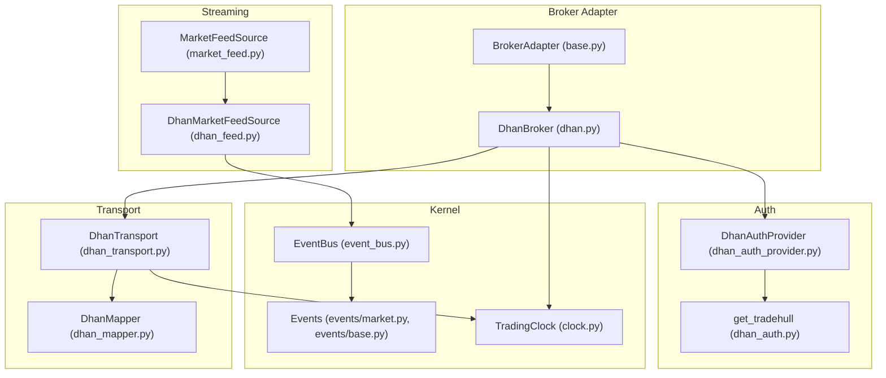
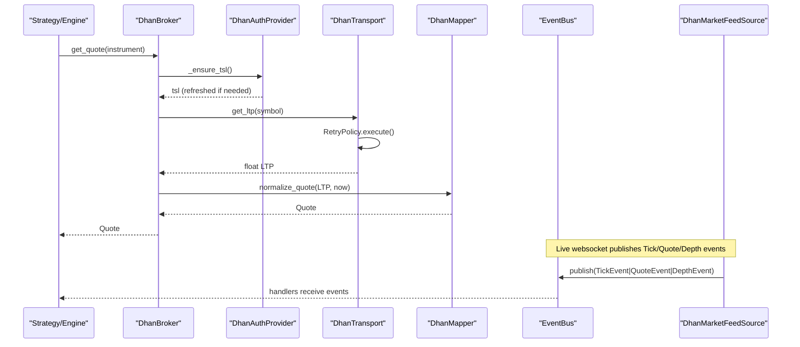
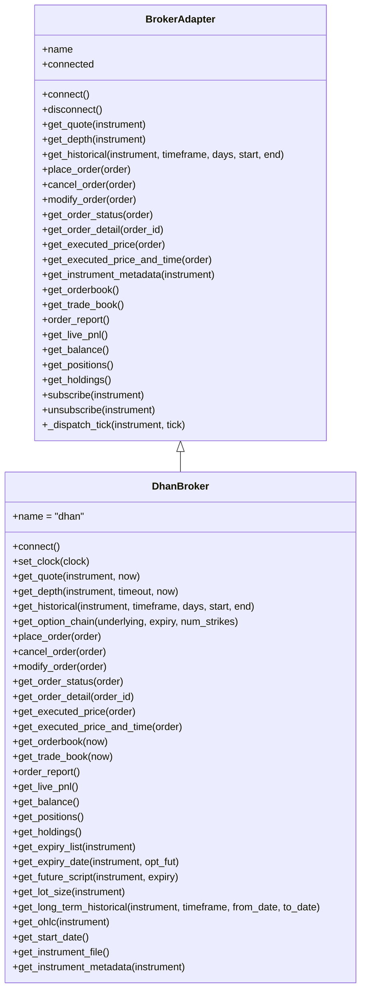
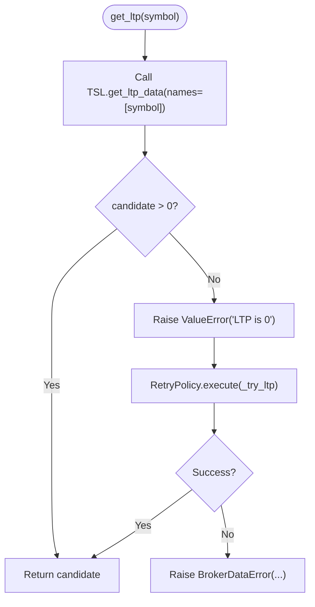
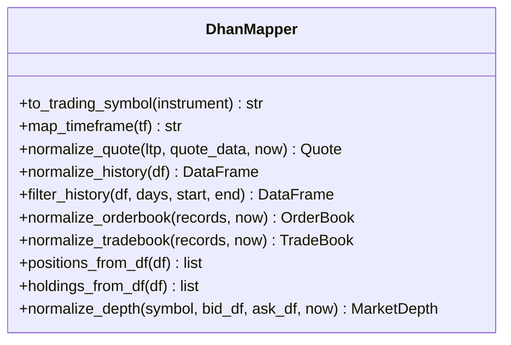
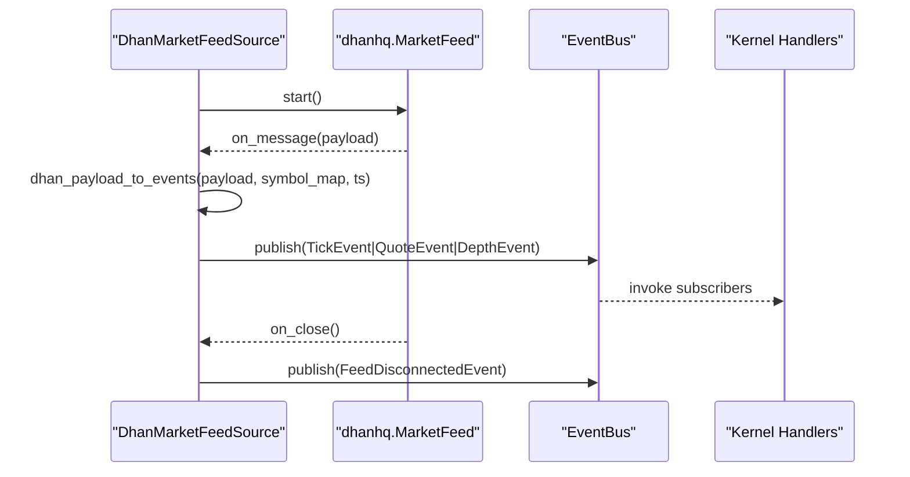
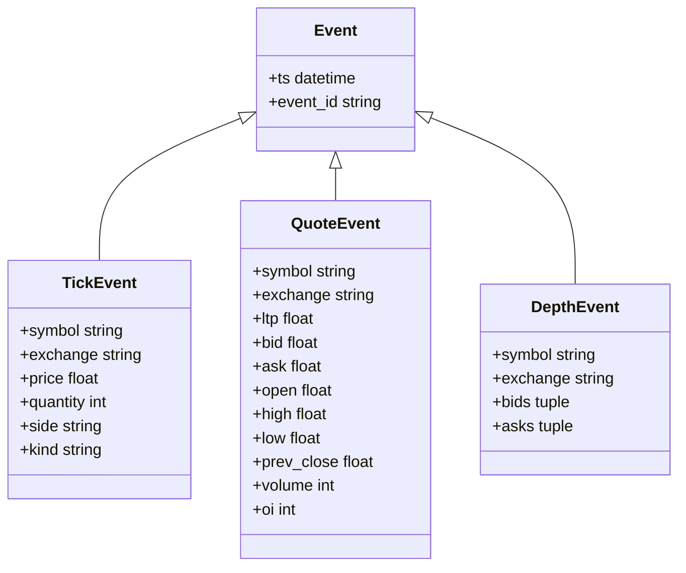
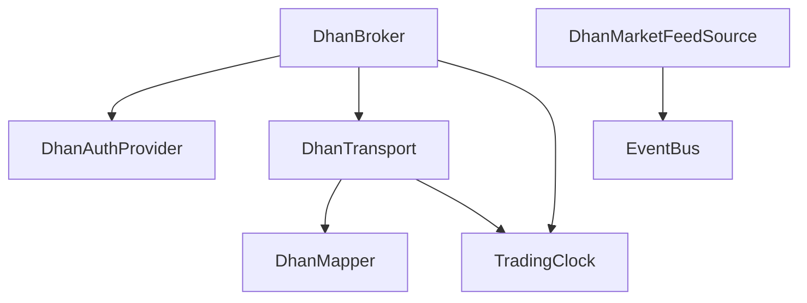

# Transport Layer & Connectivity

<cite>
**Referenced Files in This Document**
- [dhan.py](file://ntrade/brokers/dhan.py)
- [base.py](file://ntrade/brokers/base.py)
- [dhan_transport.py](file://ntrade/brokers/dhan_transport.py)
- [dhan_mapper.py](file://ntrade/brokers/dhan_mapper.py)
- [dhan_auth.py](file://ntrade/brokers/dhan_auth.py)
- [dhan_auth_provider.py](file://ntrade/brokers/dhan_auth_provider.py)
- [dhan_feed.py](file://ntrade/sources/dhan_feed.py)
- [market_feed.py](file://ntrade/sources/market_feed.py)
- [event_bus.py](file://ntrade/kernel/event_bus.py)
- [retry.py](file://ntrade/execution/retry.py)
- [market.py](file://ntrade/events/market.py)
- [base.py](file://ntrade/events/base.py)
- [clock.py](file://ntrade/kernel/clock.py)
</cite>

## Table of Contents
1. [Introduction](#introduction)
2. [Project Structure](#project-structure)
3. [Core Components](#core-components)
4. [Architecture Overview](#architecture-overview)
5. [Detailed Component Analysis](#detailed-component-analysis)
6. [Dependency Analysis](#dependency-analysis)
7. [Performance Considerations](#performance-considerations)
8. [Troubleshooting Guide](#troubleshooting-guide)
9. [Conclusion](#conclusion)
10. [Appendices](#appendices)

## Introduction
This document explains the transport layer abstraction that manages network connectivity and message handling for broker integrations, with a focus on Dhan via Tradehull. It covers:
- WebSocket connection management for market data streaming
- REST-based transport for quotes, history, orders, and portfolio
- Message serialization and deserialization between Python objects and broker wire formats
- Event-driven architecture for incoming messages, order confirmations, and market data updates
- Error handling strategies including timeouts, reconnection signals, and protocol errors
- Extensibility patterns for custom transports and binary protocols
- Monitoring, metrics, and debugging tools at the network level
- Scalability considerations for concurrent connections and high-frequency processing

## Project Structure
The transport layer is split across several modules:
- Broker adapter and concrete implementation (DhanBroker)
- Transport wrapper around the underlying library (DhanTransport)
- Authentication lifecycle and token refresh (DhanAuthProvider, dhan_auth)
- Data mapping and normalization (DhanMapper)
- Live websocket feed source (DhanMarketFeedSource)
- Event bus and canonical events (EventBus, Tick/Quote/Depth events)
- Resilience primitives (RetryPolicy, RateLimiter)
- Time source (TradingClock) to ensure zero-parity timestamps

**Diagram sources**
- [base.py:25-163](file://ntrade/brokers/base.py#L25-L163)
- [dhan.py:54-105](file://ntrade/brokers/dhan.py#L54-L105)
- [dhan_transport.py:48-117](file://ntrade/brokers/dhan_transport.py#L48-L117)
- [dhan_mapper.py:35-94](file://ntrade/brokers/dhan_mapper.py#L35-L94)
- [dhan_auth_provider.py:28-75](file://ntrade/brokers/dhan_auth_provider.py#L28-L75)
- [dhan_auth.py:114-167](file://ntrade/brokers/dhan_auth.py#L114-L167)
- [market_feed.py:23-46](file://ntrade/sources/market_feed.py#L23-L46)
- [dhan_feed.py:98-166](file://ntrade/sources/dhan_feed.py#L98-L166)
- [event_bus.py:24-81](file://ntrade/kernel/event_bus.py#L24-L81)
- [market.py:11-48](file://ntrade/events/market.py#L11-L48)
- [base.py:16-22](file://ntrade/events/base.py#L16-L22)
- [clock.py:14-55](file://ntrade/kernel/clock.py#L14-L55)

**Section sources**
- [base.py:25-163](file://ntrade/brokers/base.py#L25-L163)
- [dhan.py:54-105](file://ntrade/brokers/dhan.py#L54-L105)
- [dhan_transport.py:48-117](file://ntrade/brokers/dhan_transport.py#L48-L117)
- [dhan_mapper.py:35-94](file://ntrade/brokers/dhan_mapper.py#L35-L94)
- [dhan_auth_provider.py:28-75](file://ntrade/brokers/dhan_auth_provider.py#L28-L75)
- [dhan_auth.py:114-167](file://ntrade/brokers/dhan_auth.py#L114-L167)
- [market_feed.py:23-46](file://ntrade/sources/market_feed.py#L23-L46)
- [dhan_feed.py:98-166](file://ntrade/sources/dhan_feed.py#L98-L166)
- [event_bus.py:24-81](file://ntrade/kernel/event_bus.py#L24-L81)
- [market.py:11-48](file://ntrade/events/market.py#L11-L48)
- [base.py:16-22](file://ntrade/events/base.py#L16-L22)
- [clock.py:14-55](file://ntrade/kernel/clock.py#L14-L55)

## Core Components
- BrokerAdapter: Abstract interface defining connect/disconnect, market data, orders, and streaming subscriptions.
- DhanBroker: Concrete broker implementation orchestrating auth, transport, and mapping; enforces SEBI rules and handles special order types.
- DhanTransport: Thin wrapper over Tradehull API calls with retry and error handling; normalizes responses into domain objects.
- DhanMapper: Pure functions to map raw broker payloads to canonical domain models (quotes, depth, books, positions).
- DhanMarketFeedSource: Live websocket feed adapter publishing canonical events to the kernel bus.
- EventBus: Synchronous publish/subscribe bus with thread-safe dispatch and event history.
- RetryPolicy and RateLimiter: Resilience primitives for transient failures and rate control.
- TradingClock: Deterministic time source ensuring zero-parity across live, replay, and simulation.

Key responsibilities:
- Network boundary isolation: Domain code never touches REST/websocket directly.
- Zero-parity timestamps: All events carry clock-derived timestamps.
- Robustness: Retries, timeouts, and graceful fallbacks.
- Normalization: Consistent domain models regardless of broker specifics.

**Section sources**
- [base.py:25-163](file://ntrade/brokers/base.py#L25-L163)
- [dhan.py:54-105](file://ntrade/brokers/dhan.py#L54-L105)
- [dhan_transport.py:48-117](file://ntrade/brokers/dhan_transport.py#L48-L117)
- [dhan_mapper.py:35-94](file://ntrade/brokers/dhan_mapper.py#L35-L94)
- [dhan_feed.py:98-166](file://ntrade/sources/dhan_feed.py#L98-L166)
- [event_bus.py:24-81](file://ntrade/kernel/event_bus.py#L24-L81)
- [retry.py:19-98](file://ntrade/execution/retry.py#L19-L98)
- [clock.py:14-55](file://ntrade/kernel/clock.py#L14-L55)

## Architecture Overview
The transport layer separates concerns into authentication, transport, mapping, and streaming. The broker adapter composes these components and exposes a stable domain-facing API.

**Diagram sources**
- [dhan.py:107-140](file://ntrade/brokers/dhan.py#L107-L140)
- [dhan_auth_provider.py:58-75](file://ntrade/brokers/dhan_auth_provider.py#L58-L75)
- [dhan_transport.py:80-101](file://ntrade/brokers/dhan_transport.py#L80-L101)
- [dhan_mapper.py:76-94](file://ntrade/brokers/dhan_mapper.py#L76-L94)
- [dhan_feed.py:206-224](file://ntrade/sources/dhan_feed.py#L206-L224)
- [event_bus.py:47-66](file://ntrade/kernel/event_bus.py#L47-L66)

## Detailed Component Analysis

### BrokerAdapter and DhanBroker
- BrokerAdapter defines the contract for connect/disconnect, market data, orders, and streaming subscriptions.
- DhanBroker implements the contract, integrating:
  - Authentication provider for token lifecycle
  - Transport for REST calls with retries
  - Mapper for normalization
  - Special handling for SEBI-compliant order types and bracket orders

**Diagram sources**
- [base.py:25-163](file://ntrade/brokers/base.py#L25-L163)
- [dhan.py:54-634](file://ntrade/brokers/dhan.py#L54-L634)

**Section sources**
- [base.py:25-163](file://ntrade/brokers/base.py#L25-L163)
- [dhan.py:54-634](file://ntrade/brokers/dhan.py#L54-L634)

### DhanTransport: REST Transport Wrapper
Responsibilities:
- Wrap Tradehull API calls with retry policy and consistent error handling
- Normalize responses into domain objects via mapper
- Provide methods for LTP, quote, depth snapshot, historical data, option chain, orders, and portfolio

Key behaviors:
- get_ltp uses RetryPolicy to handle flaky endpoints; raises a specific BrokerDataError on persistent failure or zero price
- get_depth performs a timeout-bounded snapshot read using a background thread
- Historical endpoints normalize and filter results consistently

**Diagram sources**
- [dhan_transport.py:80-101](file://ntrade/brokers/dhan_transport.py#L80-L101)

**Section sources**
- [dhan_transport.py:48-117](file://ntrade/brokers/dhan_transport.py#L48-L117)
- [retry.py:19-57](file://ntrade/execution/retry.py#L19-L57)

### DhanMapper: Serialization and Deserialization
Responsibilities:
- Convert broker-specific payloads (dicts, DataFrames) into canonical domain models
- Normalize columns, handle NaN/missing values, and enforce consistent field names
- Build OptionChain from Dhan-style frames, including Greeks when available

Highlights:
- normalize_quote builds Quote with optional enrichment
- normalize_history standardizes OHLCV columns and filters by date ranges
- normalize_orderbook and normalize_tradebook produce typed book entries
- positions_from_df and holdings_from_df map portfolio rows safely

**Diagram sources**
- [dhan_mapper.py:35-239](file://ntrade/brokers/dhan_mapper.py#L35-L239)

**Section sources**
- [dhan_mapper.py:35-239](file://ntrade/brokers/dhan_mapper.py#L35-L239)

### DhanMarketFeedSource: WebSocket Streaming
Responsibilities:
- Connect to Dhan’s websocket via dhanhq.MarketFeed
- Parse payloads into canonical events (TickEvent, QuoteEvent, DepthEvent)
- Publish events to the kernel bus with deterministic timestamps
- Handle disconnects and emit lifecycle events

Connection management:
- Lazy initialization of feed instance
- Background thread started by feed.start()
- wait_ready ensures warmup and minimum payload ingestion
- stop closes connection and resets internal state

**Diagram sources**
- [dhan_feed.py:175-224](file://ntrade/sources/dhan_feed.py#L175-L224)
- [event_bus.py:47-66](file://ntrade/kernel/event_bus.py#L47-L66)

**Section sources**
- [dhan_feed.py:98-233](file://ntrade/sources/dhan_feed.py#L98-L233)
- [market_feed.py:23-46](file://ntrade/sources/market_feed.py#L23-L46)

### Authentication and Token Lifecycle
Responsibilities:
- Load environment variables and credentials
- Prefer shared token store, then env access token, then PIN+TOTP fallback
- Proactive token refresh before expiry to avoid DH-905 errors
- Persist tokens securely and manage cooldowns for TOTP attempts

**Diagram sources**
- [dhan_auth.py:114-167](file://ntrade/brokers/dhan_auth.py#L114-L167)
- [dhan_auth_provider.py:47-75](file://ntrade/brokers/dhan_auth_provider.py#L47-L75)

**Section sources**
- [dhan_auth.py:114-167](file://ntrade/brokers/dhan_auth.py#L114-L167)
- [dhan_auth_provider.py:28-142](file://ntrade/brokers/dhan_auth_provider.py#L28-L142)

### Event Bus and Canonical Events
Responsibilities:
- Thread-safe publish/subscribe with reentrant lock
- Record event history for replay/debugging
- Swallow handler exceptions to keep the bus resilient

Event model:
- Base Event carries timestamp and unique ID
- Market events include TickEvent, QuoteEvent, DepthEvent, CandleClosedEvent, QuoteUpdatedEvent, IndicatorUpdatedEvent

**Diagram sources**
- [base.py:16-22](file://ntrade/events/base.py#L16-L22)
- [market.py:11-48](file://ntrade/events/market.py#L11-L48)

**Section sources**
- [event_bus.py:24-81](file://ntrade/kernel/event_bus.py#L24-L81)
- [base.py:16-22](file://ntrade/events/base.py#L16-L22)
- [market.py:11-48](file://ntrade/events/market.py#L11-L48)

### Resilience Primitives
- RetryPolicy: Exponential backoff with jitter for transient failures
- RateLimiter: Token-bucket limiter to respect broker rate limits

Usage:
- DhanTransport wraps flaky calls with RetryPolicy.execute
- RateLimiter can be used to throttle outbound requests where necessary

**Section sources**
- [retry.py:19-98](file://ntrade/execution/retry.py#L19-L98)
- [dhan_transport.py:80-101](file://ntrade/brokers/dhan_transport.py#L80-L101)

## Dependency Analysis
The transport layer exhibits clear separation:
- BrokerAdapter abstracts broker-specific logic
- DhanBroker composes auth, transport, and mapper
- DhanTransport depends on Tradehull and mapper
- DhanMarketFeedSource depends on dhanhq and publishes to EventBus
- EventBus decouples producers and consumers
- TradingClock provides deterministic timestamps

**Diagram sources**
- [dhan.py:54-105](file://ntrade/brokers/dhan.py#L54-L105)
- [dhan_transport.py:48-117](file://ntrade/brokers/dhan_transport.py#L48-L117)
- [dhan_mapper.py:35-94](file://ntrade/brokers/dhan_mapper.py#L35-L94)
- [dhan_feed.py:98-166](file://ntrade/sources/dhan_feed.py#L98-L166)
- [event_bus.py:24-81](file://ntrade/kernel/event_bus.py#L24-L81)
- [clock.py:14-55](file://ntrade/kernel/clock.py#L14-L55)

**Section sources**
- [dhan.py:54-105](file://ntrade/brokers/dhan.py#L54-L105)
- [dhan_transport.py:48-117](file://ntrade/brokers/dhan_transport.py#L48-L117)
- [dhan_mapper.py:35-94](file://ntrade/brokers/dhan_mapper.py#L35-L94)
- [dhan_feed.py:98-166](file://ntrade/sources/dhan_feed.py#L98-L166)
- [event_bus.py:24-81](file://ntrade/kernel/event_bus.py#L24-L81)
- [clock.py:14-55](file://ntrade/kernel/clock.py#L14-L55)

## Performance Considerations
- WebSocket throughput:
  - DhanMarketFeedSource processes payloads in callbacks; ensure handlers are lightweight
  - Use wait_ready to avoid busy loops during warmup
- REST latency:
  - RetryPolicy reduces transient failures but adds delay; tune max_retries and base_delay
  - Batch operations where possible (e.g., option chains)
- Memory:
  - Avoid retaining large DataFrames beyond normalization; mapper returns domain objects
- Concurrency:
  - EventBus serializes dispatch; avoid heavy work in handlers
  - Use separate threads for blocking I/O (as done for depth snapshots)

[No sources needed since this section provides general guidance]

## Troubleshooting Guide
Common issues and resolutions:
- LTP fetch failures:
  - DhanTransport raises BrokerDataError after retries; check network and broker status
  - Ensure instrument symbols are correct and mapped properly
- WebSocket disconnects:
  - DhanMarketFeedSource emits FeedDisconnectedEvent; monitor and reconnect as needed
  - Verify credentials and permissions for market data
- Order rejections:
  - DhanBroker enforces SEBI rules; MARKET orders converted to LIMIT for F&O
  - Check LTP availability before placing orders
- Token expiry:
  - DhanAuthProvider proactively refreshes tokens; ensure PIN+TOTP configured
  - Shared token store must be accessible and not near expiry

Debugging tips:
- Inspect EventBus.history for recent events
- Log feed errors and close events from DhanMarketFeedSource
- Validate symbol mappings and exchange codes
- Use TradingClock to verify timestamps in replay/simulation

**Section sources**
- [dhan_transport.py:80-101](file://ntrade/brokers/dhan_transport.py#L80-L101)
- [dhan_feed.py:215-224](file://ntrade/sources/dhan_feed.py#L215-L224)
- [dhan.py:304-351](file://ntrade/brokers/dhan.py#L304-L351)
- [dhan_auth_provider.py:58-75](file://ntrade/brokers/dhan_auth_provider.py#L58-L75)
- [event_bus.py:68-72](file://ntrade/kernel/event_bus.py#L68-L72)

## Conclusion
The transport layer provides a robust, extensible abstraction for broker connectivity:
- Clear separation between adapter, transport, mapping, and streaming
- Strong resilience through retries, timeouts, and proactive token refresh
- Event-driven design with deterministic timestamps for zero-parity operation
- Scalable patterns for high-frequency data and concurrent connections

Adopting these patterns enables reliable integration with multiple brokers while maintaining performance and correctness.

[No sources needed since this section summarizes without analyzing specific files]

## Appendices

### Implementing Custom Transport Layers
Steps:
- Extend BrokerAdapter to define your broker’s capabilities
- Implement connect/disconnect and market data/order methods
- Create a transport wrapper similar to DhanTransport for REST calls
- Add a feed source similar to DhanMarketFeedSource for websockets
- Use DhanMapper-like utilities for normalization

Example references:
- [BrokerAdapter contract:25-163](file://ntrade/brokers/base.py#L25-L163)
- [DhanTransport pattern:48-117](file://ntrade/brokers/dhan_transport.py#L48-L117)
- [DhanMarketFeedSource pattern:98-166](file://ntrade/sources/dhan_feed.py#L98-L166)

### Handling Binary Protocols
- If the broker uses binary frames, implement a parser in the feed source
- Convert binary payloads to dict structures before mapping to events
- Maintain type safety and validate fields rigorously

[No sources needed since this section provides general guidance]

### Optimizing Message Throughput
- Minimize object creation in hot paths
- Use efficient data structures (tuples, named tuples) for immutable events
- Batch operations where supported by the broker
- Monitor and tune RetryPolicy parameters based on observed failure rates

[No sources needed since this section provides general guidance]

### Connection Monitoring and Metrics
- Track feed running state and payloads_ingested counters
- Log heartbeat intervals and disconnect reasons
- Record event counts and latencies in the event bus history

References:
- [DhanMarketFeedSource metrics:124-126](file://ntrade/sources/dhan_feed.py#L124-L126)
- [EventBus history:68-72](file://ntrade/kernel/event_bus.py#L68-L72)

### Debugging Tools for Network Issues
- Enable logging for feed errors and close events
- Inspect EventBus.history for event sequences
- Validate symbol mappings and exchange codes
- Use TradingClock to verify timestamps in replay scenarios

References:
- [Feed error logging:215-224](file://ntrade/sources/dhan_feed.py#L215-L224)
- [EventBus error handling:54-66](file://ntrade/kernel/event_bus.py#L54-L66)

### Scalability Considerations
- Multiple concurrent connections:
  - Use separate feed instances per broker/account
  - Isolate event handlers to prevent contention
- High-frequency processing:
  - Offload heavy computations to background workers
  - Use non-blocking I/O where possible
  - Monitor memory usage and garbage collection

[No sources needed since this section provides general guidance]