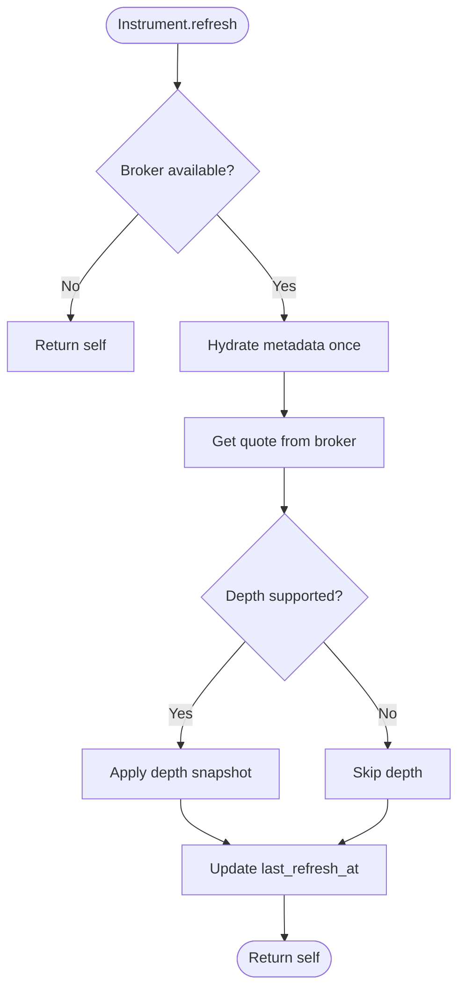
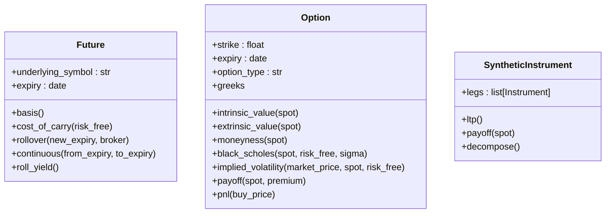
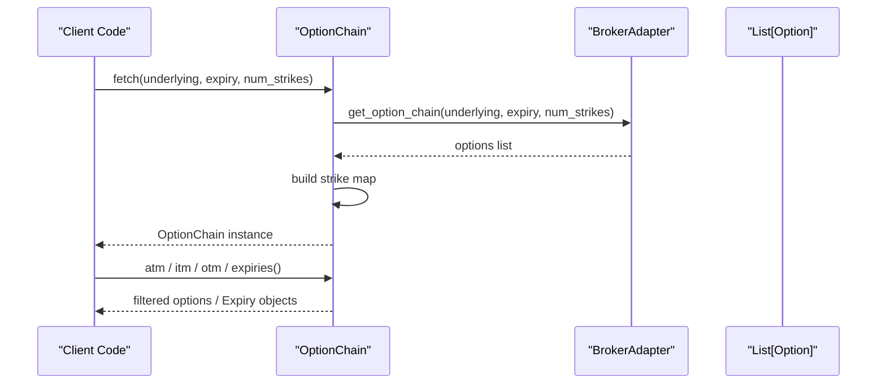
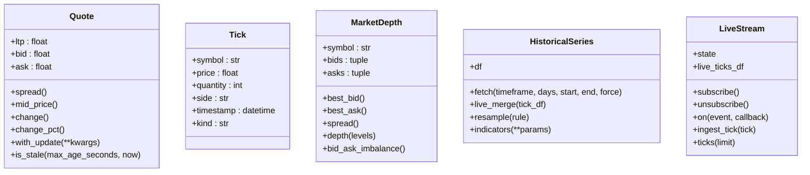
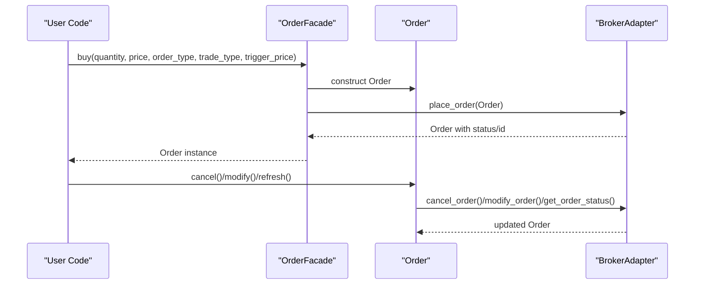
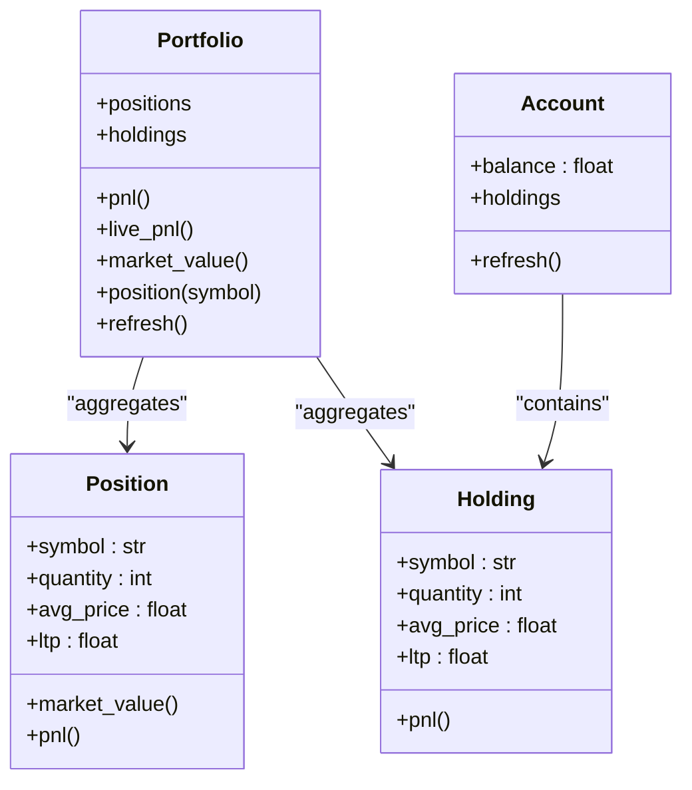
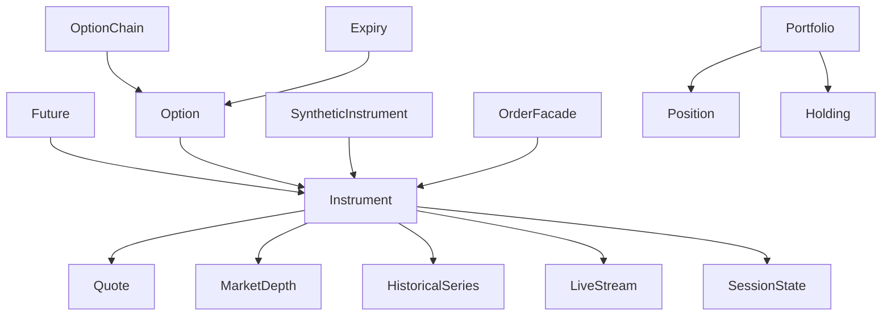

# Domain Model

<cite>
**Referenced Files in This Document**
- [base.py](file://ntrade/domain/instruments/base.py)
- [cash.py](file://ntrade/domain/instruments/cash.py)
- [derivatives.py](file://ntrade/domain/instruments/derivatives.py)
- [chain.py](file://ntrade/domain/instruments/chain.py)
- [expiry.py](file://ntrade/domain/instruments/expiry.py)
- [capabilities.py](file://ntrade/domain/instruments/capabilities.py)
- [quote.py](file://ntrade/domain/market/quote.py)
- [depth.py](file://ntrade/domain/market/depth.py)
- [history.py](file://ntrade/domain/market/history.py)
- [stream.py](file://ntrade/domain/market/stream.py)
- [order.py](file://ntrade/domain/orders/order.py)
- [book.py](file://ntrade/domain/orders/book.py)
- [portfolio.py](file://ntrade/domain/portfolio.py)
- [session.py](file://ntrade/domain/session.py)
</cite>

## Table of Contents
1. [Introduction](#introduction)
2. [Project Structure](#project-structure)
3. [Core Components](#core-components)
4. [Architecture Overview](#architecture-overview)
5. [Detailed Component Analysis](#detailed-component-analysis)
6. [Dependency Analysis](#dependency-analysis)
7. [Performance Considerations](#performance-considerations)
8. [Troubleshooting Guide](#troubleshooting-guide)
9. [Conclusion](#conclusion)
10. [Appendices](#appendices)

## Introduction
This document provides a comprehensive data model for nTrade’s domain objects. It focuses on the Instrument hierarchy, market data structures, order management, and portfolio tracking. The goal is to explain field definitions, data types, validation rules, business logic, relationships between entities, state transitions, and examples of creating and manipulating domain objects with type safety and immutability guarantees.

## Project Structure
The domain layer is organized by feature:
- Instruments: base class and asset-specific implementations, option chain and expiry navigation, capabilities
- Market: immutable quote/tick, depth snapshot, historical series, live stream
- Orders: order model, facade, and broker book value objects
- Portfolio: positions and holdings with P&L calculations
- Session: market state and session state

```mermaid
graph TB
subgraph "Instruments"
Base["Instrument (base)"]
Cash["Equity/Index/ETF/Currency/Commodity/Bond/Crypto/Spot"]
Deriv["Future/Option/SyntheticInstrument"]
Chain["OptionChain"]
Expiry["Expiry / OptionPair"]
Cap["Capabilities (Market/Trade/Stream/Analytics/Derivatives/Extension)"]
end
subgraph "Market Data"
Quote["Quote / Tick"]
Depth["MarketDepth / DepthLevel"]
History["HistoricalSeries"]
Stream["LiveStream"]
end
subgraph "Orders"
OrderModel["Order / OrderFacade"]
Book["OrderBook / TradeBook"]
end
subgraph "Portfolio"
Position["Position / Holding"]
Portfolio["Portfolio / Account"]
end
subgraph "Session"
SessionState["SessionState / MarketState"]
end
Base --> Cash
Base --> Deriv
Base --> Quote
Base --> Depth
Base --> History
Base --> Stream
Base --> SessionState
Deriv --> Chain
Chain --> Expiry
Base --> Cap
OrderModel --> Base
Portfolio --> Position
Portfolio --> Holding
```

**Diagram sources**
- [base.py:1-305](file://ntrade/domain/instruments/base.py#L1-L305)
- [cash.py:1-50](file://ntrade/domain/instruments/cash.py#L1-L50)
- [derivatives.py:1-245](file://ntrade/domain/instruments/derivatives.py#L1-L245)
- [chain.py:1-202](file://ntrade/domain/instruments/chain.py#L1-L202)
- [expiry.py:1-171](file://ntrade/domain/instruments/expiry.py#L1-L171)
- [capabilities.py:1-383](file://ntrade/domain/instruments/capabilities.py#L1-L383)
- [quote.py:1-91](file://ntrade/domain/market/quote.py#L1-L91)
- [depth.py:1-49](file://ntrade/domain/market/depth.py#L1-L49)
- [history.py:1-149](file://ntrade/domain/market/history.py#L1-L149)
- [stream.py:1-131](file://ntrade/domain/market/stream.py#L1-L131)
- [order.py:1-173](file://ntrade/domain/orders/order.py#L1-L173)
- [book.py:1-120](file://ntrade/domain/orders/book.py#L1-L120)
- [portfolio.py:1-173](file://ntrade/domain/portfolio.py#L1-L173)
- [session.py:1-46](file://ntrade/domain/session.py#L1-L46)

**Section sources**
- [base.py:1-305](file://ntrade/domain/instruments/base.py#L1-L305)
- [cash.py:1-50](file://ntrade/domain/instruments/cash.py#L1-L50)
- [derivatives.py:1-245](file://ntrade/domain/instruments/derivatives.py#L1-L245)
- [chain.py:1-202](file://ntrade/domain/instruments/chain.py#L1-L202)
- [expiry.py:1-171](file://ntrade/domain/instruments/expiry.py#L1-L171)
- [capabilities.py:1-383](file://ntrade/domain/instruments/capabilities.py#L1-L383)
- [quote.py:1-91](file://ntrade/domain/market/quote.py#L1-L91)
- [depth.py:1-49](file://ntrade/domain/market/depth.py#L1-L49)
- [history.py:1-149](file://ntrade/domain/market/history.py#L1-L149)
- [stream.py:1-131](file://ntrade/domain/market/stream.py#L1-L131)
- [order.py:1-173](file://ntrade/domain/orders/order.py#L1-L173)
- [book.py:1-120](file://ntrade/domain/orders/book.py#L1-L120)
- [portfolio.py:1-173](file://ntrade/domain/portfolio.py#L1-L173)
- [session.py:1-46](file://ntrade/domain/session.py#L1-L46)

## Core Components
- Instrument root owns state: quote, depth, history, stream, indicators, signals, corporate actions, session, and market status. It exposes capability facets for market data, trading, streaming, analytics, derivatives, and extensions.
- Asset-specific instruments extend Instrument with exchange defaults and specialized fields or methods.
- Derivative instruments add expiry, strike, Greeks, and pricing utilities.
- OptionChain composes Option instruments across expiries and strikes with ATM/ITM/OTM navigation and analytics.
- Market data structures are immutable value objects: Quote, Tick, MarketDepth, HistoricalSeries, LiveStream.
- Order model supports multiple order types and fluent entry via OrderFacade; books normalize broker responses.
- Portfolio tracks positions and holdings with P&L calculations and optional live P&L from broker.

**Section sources**
- [base.py:1-305](file://ntrade/domain/instruments/base.py#L1-L305)
- [cash.py:1-50](file://ntrade/domain/instruments/cash.py#L1-L50)
- [derivatives.py:1-245](file://ntrade/domain/instruments/derivatives.py#L1-L245)
- [chain.py:1-202](file://ntrade/domain/instruments/chain.py#L1-L202)
- [quote.py:1-91](file://ntrade/domain/market/quote.py#L1-L91)
- [depth.py:1-49](file://ntrade/domain/market/depth.py#L1-L49)
- [history.py:1-149](file://ntrade/domain/market/history.py#L1-L149)
- [stream.py:1-131](file://ntrade/domain/market/stream.py#L1-L131)
- [order.py:1-173](file://ntrade/domain/orders/order.py#L1-L173)
- [book.py:1-120](file://ntrade/domain/orders/book.py#L1-L120)
- [portfolio.py:1-173](file://ntrade/domain/portfolio.py#L1-L173)

## Architecture Overview
The domain model follows a composition pattern:
- Instrument is the central entity that composes market data, streaming, history, and capabilities.
- OptionChain and Expiry provide composite views over Option instruments.
- OrderFacade and Order encapsulate order lifecycle and broker interactions.
- Portfolio aggregates positions and holdings and computes P&L.

```mermaid
classDiagram
class Instrument {
+symbol : str
+exchange : str
+name : str
+currency : str
+tick_size : float
+lot_size : int
+freeze_qty : int
+apply_quote(quote)
+apply_depth(depth)
+refresh(force, now)
+hydrate()
+record_corporate_action(...)
+set_signal(name, value)
+get_signal(name, default)
+set_market_status(state)
+clone()
}
class Equity
class Index
class ETF
class Currency
class Commodity
class Bond
class Crypto
class Spot
class Future {
+underlying_symbol : str
+expiry : date
+basis()
+cost_of_carry(risk_free)
+rollover(new_expiry, broker)
+continuous(from_expiry, to_expiry)
+roll_yield()
}
class Option {
+strike : float
+expiry : date
+option_type : str
+greeks
+intrinsic_value(spot)
+extrinsic_value(spot)
+moneyness(spot)
+black_scholes(spot, risk_free, sigma)
+implied_volatility(market_price, spot, risk_free)
+payoff(spot, premium)
+pnl(buy_price)
}
class SyntheticInstrument {
+legs : list[Instrument]
+ltp()
+payoff(spot)
+decompose()
}
class OptionChain {
+calls
+puts
+expiries()
+expiry(offset)
+atm
+itm
+otm
+pcr()
+max_pain()
+greeks_table()
}
class Expiry {
+date : date
+atm(offset)
+pair_at(strike)
+otm(n)
+itm(n)
+pairs()
+calls()
+puts()
+strikes()
}
class Quote {
+ltp : float
+bid : float
+ask : float
+spread()
+mid_price()
+change()
+change_pct()
+with_update(**kwargs)
+is_stale(max_age_seconds, now)
}
class Tick {
+symbol : str
+price : float
+quantity : int
+side : str
+timestamp : datetime
+kind : str
}
class MarketDepth {
+symbol : str
+bids : tuple
+asks : tuple
+best_bid()
+best_ask()
+spread()
+depth(levels)
+bid_ask_imbalance()
}
class HistoricalSeries {
+df
+fetch(timeframe, days, start, end, force)
+live_merge(tick_df)
+resample(rule)
+indicators(**params)
}
class LiveStream {
+state
+subscribe()
+unsubscribe()
+on(event, callback)
+ingest_tick(tick)
+ticks(limit)
+live_ticks_df
}
class Order {
+instrument
+side
+quantity
+order_type
+price
+trigger_price
+target_price
+stop_loss_price
+status
+cancel()
+modify(...)
+refresh()
}
class OrderFacade {
+buy(quantity, price, order_type, trade_type, trigger_price)
+sell(quantity, price, order_type, trade_type, trigger_price)
+limit(side, quantity, price, **kw)
+market(side, quantity, **kw)
+stop(side, quantity, price, trigger_price, **kw)
+cover(side, quantity, price, trigger_price, **kw)
+bracket(side, quantity, price, target_price, stop_loss_price, **kw)
}
class Position {
+symbol : str
+quantity : int
+avg_price : float
+ltp : float
+market_value()
+pnl()
}
class Holding {
+symbol : str
+quantity : int
+avg_price : float
+ltp : float
+pnl()
}
class Portfolio {
+positions
+holdings
+pnl()
+live_pnl()
+market_value()
+position(symbol)
+refresh()
}
Instrument <|-- Equity
Instrument <|-- Index
Instrument <|-- ETF
Instrument <|-- Currency
Instrument <|-- Commodity
Instrument <|-- Bond
Instrument <|-- Crypto
Instrument <|-- Spot
Instrument <|-- Future
Instrument <|-- Option
Instrument <|-- SyntheticInstrument
OptionChain --> Option : "composes"
Expiry --> Option : "groups"
Instrument --> Quote : "owns"
Instrument --> MarketDepth : "owns"
Instrument --> HistoricalSeries : "owns"
Instrument --> LiveStream : "owns"
OrderFacade --> Order : "creates"
Portfolio --> Position : "aggregates"
Portfolio --> Holding : "aggregates"
```



**Diagram sources**
- [base.py:1-305](file://ntrade/domain/instruments/base.py#L1-L305)
- [cash.py:1-50](file://ntrade/domain/instruments/cash.py#L1-L50)
- [derivatives.py:1-245](file://ntrade/domain/instruments/derivatives.py#L1-L245)
- [chain.py:1-202](file://ntrade/domain/instruments/chain.py#L1-L202)
- [expiry.py:1-171](file://ntrade/domain/instruments/expiry.py#L1-L171)
- [quote.py:1-91](file://ntrade/domain/market/quote.py#L1-L91)
- [depth.py:1-49](file://ntrade/domain/market/depth.py#L1-L49)
- [history.py:1-149](file://ntrade/domain/market/history.py#L1-L149)
- [stream.py:1-131](file://ntrade/domain/market/stream.py#L1-L131)
- [order.py:1-173](file://ntrade/domain/orders/order.py#L1-L173)
- [portfolio.py:1-173](file://ntrade/domain/portfolio.py#L1-L173)

## Detailed Component Analysis

### Instrument Hierarchy and State Management
- Instrument maintains internal state: quote, depth, history, stream, indicators, signals, annotations, tags, metadata, subscription state, corporate actions, session, and market status.
- Methods apply_quote and apply_depth update read-only snapshots; refresh hydrates metadata and pulls latest quote/depth via broker adapter.
- Corporate actions can be recorded and retrieved; signals allow strategy/pattern tagging.
- Session state transitions are managed via set_market_status which updates both instrument and session state.



**Diagram sources**
- [base.py:169-210](file://ntrade/domain/instruments/base.py#L169-L210)

**Section sources**
- [base.py:1-305](file://ntrade/domain/instruments/base.py#L1-L305)

### Asset-Specific Implementations
- Equity, Index, ETF, Currency, Commodity, Bond, Crypto, Spot inherit Instrument and define KIND and DEFAULT_EXCHANGE.
- Equity exposes an optional market_cap from metadata.

**Section sources**
- [cash.py:1-50](file://ntrade/domain/instruments/cash.py#L1-L50)

### Derivatives: Future, Option, SyntheticInstrument
- Future adds underlying symbol, expiry, basis calculation, cost-of-carry, rollover, continuous series back-adjustment, and roll yield using linked next-month contract.
- Option includes strike, expiry, option type validation, Greeks accessors, intrinsic/extrinsic values, moneyness classification, Black-Scholes pricing, implied volatility, payoff, and P&L.
- SyntheticInstrument composes legs and aggregates LTP and payoff.



**Diagram sources**
- [derivatives.py:16-245](file://ntrade/domain/instruments/derivatives.py#L16-L245)

**Section sources**
- [derivatives.py:1-245](file://ntrade/domain/instruments/derivatives.py#L1-L245)

### OptionChain Composite Pattern
- OptionChain holds a list of Option instruments, builds a strike map for O(1) lookup, and provides views: calls, puts, expiries, nearest_expiry, atm, itm, otm.
- Analytics include PCR, max pain, IV surface, and Greeks table.
- Lifecycle supports subscribe and refresh via broker fetch.



**Diagram sources**
- [chain.py:1-202](file://ntrade/domain/instruments/chain.py#L1-L202)

**Section sources**
- [chain.py:1-202](file://ntrade/domain/instruments/chain.py#L1-L202)
- [expiry.py:1-171](file://ntrade/domain/instruments/expiry.py#L1-L171)

### Market Data Structures
- Quote and Tick are frozen dataclasses ensuring immutability; Quote provides derived metrics like spread, mid_price, change, change_pct, staleness check, and immutable updates via with_update.
- MarketDepth represents an immutable order-book snapshot with best bid/ask, spread, depth slicing, and imbalance metric.
- HistoricalSeries wraps a pandas DataFrame attached to an Instrument, supporting lazy fetching, caching, merging live ticks into candles, resampling, and indicator computation.
- LiveStream manages subscription lifecycle, event handlers, tick ingestion, and state transitions (not_subscribed -> subscribed -> streaming).



**Diagram sources**
- [quote.py:1-91](file://ntrade/domain/market/quote.py#L1-L91)
- [depth.py:1-49](file://ntrade/domain/market/depth.py#L1-L49)
- [history.py:1-149](file://ntrade/domain/market/history.py#L1-L149)
- [stream.py:1-131](file://ntrade/domain/market/stream.py#L1-L131)

**Section sources**
- [quote.py:1-91](file://ntrade/domain/market/quote.py#L1-L91)
- [depth.py:1-49](file://ntrade/domain/market/depth.py#L1-L49)
- [history.py:1-149](file://ntrade/domain/market/history.py#L1-L149)
- [stream.py:1-131](file://ntrade/domain/market/stream.py#L1-L131)

### Order Management
- Order models support multiple order types: LIMIT, MARKET, STOP_LIMIT, STOP_MARKET, COVER, BRACKET.
- OrderFacade provides fluent entry methods: buy, sell, limit, market, stop, cover, bracket, and generic place.
- Order lifecycle includes cancel, modify, refresh, executed price retrieval.
- OrderBook and TradeBook normalize broker responses into frozen value objects with filtering and conversion helpers.



**Diagram sources**
- [order.py:1-173](file://ntrade/domain/orders/order.py#L1-L173)
- [book.py:1-120](file://ntrade/domain/orders/book.py#L1-L120)

**Section sources**
- [order.py:1-173](file://ntrade/domain/orders/order.py#L1-L173)
- [book.py:1-120](file://ntrade/domain/orders/book.py#L1-L120)

### Portfolio Tracking
- Position and Holding represent tradable and held assets with average price and current LTP; they compute market value and P&L.
- Portfolio aggregates positions and holdings, computes total P&L and market value, supports live P&L via broker, and allows symbol-based lookup and refresh.
- Account mirrors holdings and balance with refresh from broker.



**Diagram sources**
- [portfolio.py:1-173](file://ntrade/domain/portfolio.py#L1-L173)

**Section sources**
- [portfolio.py:1-173](file://ntrade/domain/portfolio.py#L1-L173)

### Session and Market State
- MarketState enumerates states: pre_open, auction, open, halted, circuit, closed, disconnected, live, replay.
- SessionState tracks exchange, current state, and last state change timestamp; provides is_open convenience.

**Section sources**
- [session.py:1-46](file://ntrade/domain/session.py#L1-L46)

## Dependency Analysis
- Instrument depends on market data structures (Quote, MarketDepth, HistoricalSeries, LiveStream) and session state.
- Derivatives depend on Instrument and optionally analytics (Greeks).
- OptionChain depends on Option and Expiry for navigation and analytics.
- OrderFacade depends on Instrument’s broker adapter for execution.
- Portfolio and Account depend on broker adapter for live data.



**Diagram sources**
- [base.py:1-305](file://ntrade/domain/instruments/base.py#L1-L305)
- [derivatives.py:1-245](file://ntrade/domain/instruments/derivatives.py#L1-L245)
- [chain.py:1-202](file://ntrade/domain/instruments/chain.py#L1-L202)
- [expiry.py:1-171](file://ntrade/domain/instruments/expiry.py#L1-L171)
- [order.py:1-173](file://ntrade/domain/orders/order.py#L1-L173)
- [portfolio.py:1-173](file://ntrade/domain/portfolio.py#L1-L173)

**Section sources**
- [base.py:1-305](file://ntrade/domain/instruments/base.py#L1-L305)
- [derivatives.py:1-245](file://ntrade/domain/instruments/derivatives.py#L1-L245)
- [chain.py:1-202](file://ntrade/domain/instruments/chain.py#L1-L202)
- [expiry.py:1-171](file://ntrade/domain/instruments/expiry.py#L1-L171)
- [order.py:1-173](file://ntrade/domain/orders/order.py#L1-L173)
- [portfolio.py:1-173](file://ntrade/domain/portfolio.py#L1-L173)

## Performance Considerations
- Immutability: Quote and Tick are frozen dataclasses; updates use replace semantics to avoid mutation overhead and ensure thread safety.
- Caching: HistoricalSeries caches fetched data per timeframe and freshness window; avoid redundant network calls.
- Lazy initialization: Instrument capabilities are cached properties to defer creation until accessed.
- Efficient lookups: OptionChain builds a strike map for O(1) option retrieval; Expiry precomputes strike lists and pair maps.
- Streaming efficiency: LiveStream uses a bounded deque for ticks and emits events without blocking; errors in callbacks are isolated.

[No sources needed since this section provides general guidance]

## Troubleshooting Guide
- Missing broker adapter: Many operations (refresh, order placement, history fetch, option chain fetch) require a broker adapter; absence raises RuntimeError. Ensure broker is provided or factory is set on Instrument.
- Stale quotes: Quote.is_stale helps detect outdated data; implement refresh logic based on max_age_seconds.
- No expiries or options: OptionChain.expiries and expiry methods raise ValueError when no data is available; validate underlying quote and chain population.
- Invalid option type: Option constructor validates option_type; ensure CE or PE.
- Order modification/cancellation: Requires open orders; verify OrderStatus before calling cancel/modify.

**Section sources**
- [base.py:169-210](file://ntrade/domain/instruments/base.py#L169-L210)
- [quote.py:55-64](file://ntrade/domain/market/quote.py#L55-L64)
- [chain.py:83-90](file://ntrade/domain/instruments/chain.py#L83-L90)
- [derivatives.py:126-132](file://ntrade/domain/instruments/derivatives.py#L126-L132)
- [order.py:69-91](file://ntrade/domain/orders/order.py#L69-L91)

## Conclusion
The nTrade domain model centers around a robust Instrument abstraction with rich state management and capability facets. Market data structures are immutable and efficient, enabling safe concurrent usage. Derivatives and option chains provide powerful analytics and navigation. Order management and portfolio tracking integrate seamlessly with broker adapters while maintaining clear separation of concerns. The design emphasizes immutability, lazy initialization, and performance optimizations suitable for real-time trading systems.

[No sources needed since this section summarizes without analyzing specific files]

## Appendices

### Field Definitions and Validation Rules
- Instrument fields: symbol, exchange, name, currency, tick_size, lot_size, freeze_qty; metadata hydration updates these fields once.
- Quote fields: ltp, bid, ask, bid_qty, ask_qty, open, high, low, prev_close, volume, oi, vwap, avg_price, circuit_low, circuit_high, timestamp; derived methods enforce non-zero checks where applicable.
- MarketDepth fields: symbol, bids, asks, timestamp; best_bid/best_ask return None if empty.
- HistoricalSeries fields: timeframe, df cache, last_fetched_at; fetch enforces timeframe consistency and freshness.
- Option fields: strike, expiry, option_type (validated CE/PE), exercise_style, settlement; Greeks accessor returns zero-filled object if unset.
- Order fields: side, quantity, order_type, trade_type, price, trigger_price, target_price, stop_loss_price, status; enums restrict valid values.
- Position/Holding fields: symbol, quantity, avg_price, ltp; P&L computed as (ltp - avg_price) * quantity.

**Section sources**
- [base.py:56-94](file://ntrade/domain/instruments/base.py#L56-L94)
- [quote.py:9-72](file://ntrade/domain/market/quote.py#L9-L72)
- [depth.py:9-49](file://ntrade/domain/market/depth.py#L9-L49)
- [history.py:25-77](file://ntrade/domain/market/history.py#L25-L77)
- [derivatives.py:126-138](file://ntrade/domain/instruments/derivatives.py#L126-L138)
- [order.py:14-58](file://ntrade/domain/orders/order.py#L14-L58)
- [portfolio.py:19-61](file://ntrade/domain/portfolio.py#L19-L61)

### Examples of Creating and Manipulating Domain Objects
- Create an equity instrument and apply quote/depth snapshots.
- Fetch historical series with timeframe and merge live ticks.
- Subscribe to live stream and handle tick events.
- Place various order types via OrderFacade and manage lifecycle.
- Build an OptionChain, navigate expiries, and compute analytics.
- Construct Portfolio from broker and compute P&L.

These patterns emphasize type safety through enums and frozen dataclasses, and immutability via replace semantics and value objects.

**Section sources**
- [base.py:154-166](file://ntrade/domain/instruments/base.py#L154-L166)
- [history.py:91-114](file://ntrade/domain/market/history.py#L91-L114)
- [stream.py:66-80](file://ntrade/domain/market/stream.py#L66-L80)
- [order.py:124-173](file://ntrade/domain/orders/order.py#L124-L173)
- [chain.py:56-90](file://ntrade/domain/instruments/chain.py#L56-L90)
- [portfolio.py:72-112](file://ntrade/domain/portfolio.py#L72-L112)