# Base Instrument

<cite>
**Referenced Files in This Document**
- [base.py](file://ntrade/domain/instruments/base.py)
- [capabilities.py](file://ntrade/domain/instruments/capabilities.py)
- [quote.py](file://ntrade/domain/market/quote.py)
- [depth.py](file://ntrade/domain/market/depth.py)
- [history.py](file://ntrade/domain/market/history.py)
- [stream.py](file://ntrade/domain/market/stream.py)
- [session.py](file://ntrade/domain/session.py)
- [base.py](file://ntrade/brokers/base.py)
- [capabilities.py](file://ntrade/brokers/capabilities.py)
- [cash.py](file://ntrade/domain/instruments/cash.py)
- [derivatives.py](file://ntrade/domain/instruments/derivatives.py)
- [test_instruments.py](file://tests/test_instruments.py)
</cite>

## Table of Contents
1. Introduction
2. Project Structure
3. Core Components
4. Architecture Overview
5. Detailed Component Analysis
6. Dependency Analysis
7. Performance Considerations
8. Troubleshooting Guide
9. Conclusion
10. Appendices

## Introduction
This document provides comprehensive data model documentation for the base Instrument class, which is the abstract root of every market entity in nTrade. It explains core state management (quote, depth, history, stream), indicators and signals dictionaries, annotations and tags, capability system, broker integration via BrokerAdapter with lazy initialization, lifecycle methods for event-driven read model updates, corporate action handling, session state and market status tracking, serialization/snapshot capabilities, identity management through clone(), and practical usage patterns for instrument creation, state updates, capability access, and corporate action recording.

## Project Structure
The Instrument domain lives under ntrade/domain/instruments with supporting market data models under ntrade/domain/market and broker abstractions under ntrade/brokers. Concrete instrument types extend Instrument to specialize behavior per asset class.

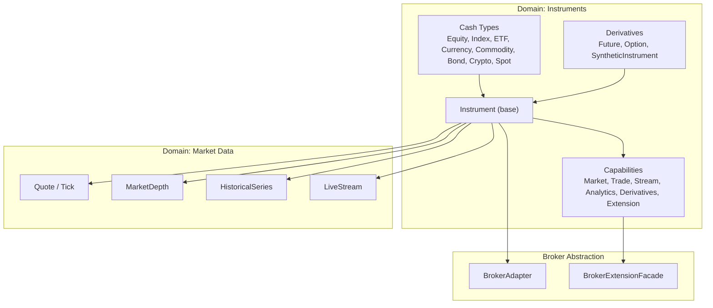

**Diagram sources**
- [base.py:50-152](file://ntrade/domain/instruments/base.py#L50-L152)
- [capabilities.py:37-152](file://ntrade/domain/instruments/capabilities.py#L37-L152)
- [quote.py:9-72](file://ntrade/domain/market/quote.py#L9-L72)
- [depth.py:9-49](file://ntrade/domain/market/depth.py#L9-L49)
- [history.py:14-149](file://ntrade/domain/market/history.py#L14-L149)
- [stream.py:27-131](file://ntrade/domain/market/stream.py#L27-L131)
- [base.py:25-163](file://ntrade/brokers/base.py#L25-L163)
- [capabilities.py:48-74](file://ntrade/brokers/capabilities.py#L48-L74)
- [cash.py:8-50](file://ntrade/domain/instruments/cash.py#L8-L50)
- [derivatives.py:16-245](file://ntrade/domain/instruments/derivatives.py#L16-L245)

**Section sources**
- [base.py:50-152](file://ntrade/domain/instruments/base.py#L50-L152)
- [capabilities.py:37-152](file://ntrade/domain/instruments/capabilities.py#L37-L152)
- [quote.py:9-72](file://ntrade/domain/market/quote.py#L9-L72)
- [depth.py:9-49](file://ntrade/domain/market/depth.py#L9-L49)
- [history.py:14-149](file://ntrade/domain/market/history.py#L14-L149)
- [stream.py:27-131](file://ntrade/domain/market/stream.py#L27-L131)
- [base.py:25-163](file://ntrade/brokers/base.py#L25-L163)
- [capabilities.py:48-74](file://ntrade/brokers/capabilities.py#L48-L74)
- [cash.py:8-50](file://ntrade/domain/instruments/cash.py#L8-L50)
- [derivatives.py:16-245](file://ntrade/domain/instruments/derivatives.py#L16-L245)

## Core Components
- Instrument: Abstract root owning all read-model state and exposing six capabilities plus broker integration.
- Quote and Tick: Immutable value objects representing point-in-time quotes and live ticks.
- MarketDepth: Immutable order book snapshot with best bid/ask and imbalance metrics.
- HistoricalSeries: Pandas-backed OHLCV series attached to an instrument with caching and resampling.
- LiveStream: Subscription lifecycle and event dispatching for tick/quote/trade/depth events.
- SessionState and MarketState: Enumerated market states and per-instrument session tracking.
- BrokerAdapter: Abstract transport boundary hiding broker specifics from domain logic.
- BrokerExtensionFacade: Dynamic capability resolution for broker-specific features.
- Capability classes: MarketCapability, TradeCapability (with OrderBuilder), StreamCapability, AnalyticsCapability, DerivativesCapability, ExtensionCapability.

Key responsibilities:
- State ownership remains on Instrument; capabilities are stateless views over that state.
- Event-driven updates via apply_quote() and apply_depth().
- Lazy broker wiring via broker_factory to keep instruments broker-free by default.
- Corporate actions recorded as a list of typed dataclasses.
- Serialization via snapshot() and identity duplication via clone().

**Section sources**
- [base.py:50-305](file://ntrade/domain/instruments/base.py#L50-L305)
- [capabilities.py:37-383](file://ntrade/domain/instruments/capabilities.py#L37-L383)
- [quote.py:9-91](file://ntrade/domain/market/quote.py#L9-L91)
- [depth.py:9-49](file://ntrade/domain/market/depth.py#L9-L49)
- [history.py:14-149](file://ntrade/domain/market/history.py#L14-L149)
- [stream.py:27-131](file://ntrade/domain/market/stream.py#L27-L131)
- [session.py:10-46](file://ntrade/domain/session.py#L10-L46)
- [base.py:25-163](file://ntrade/brokers/base.py#L25-L163)
- [capabilities.py:48-74](file://ntrade/brokers/capabilities.py#L48-L74)

## Architecture Overview
The Instrument composes its internal state and delegates operations to capability objects. Broker interactions are abstracted behind BrokerAdapter, with lazy instantiation via broker_factory. Events flow into the instrument through LiveStream ingestion or explicit apply_* methods, updating the read model without network calls.

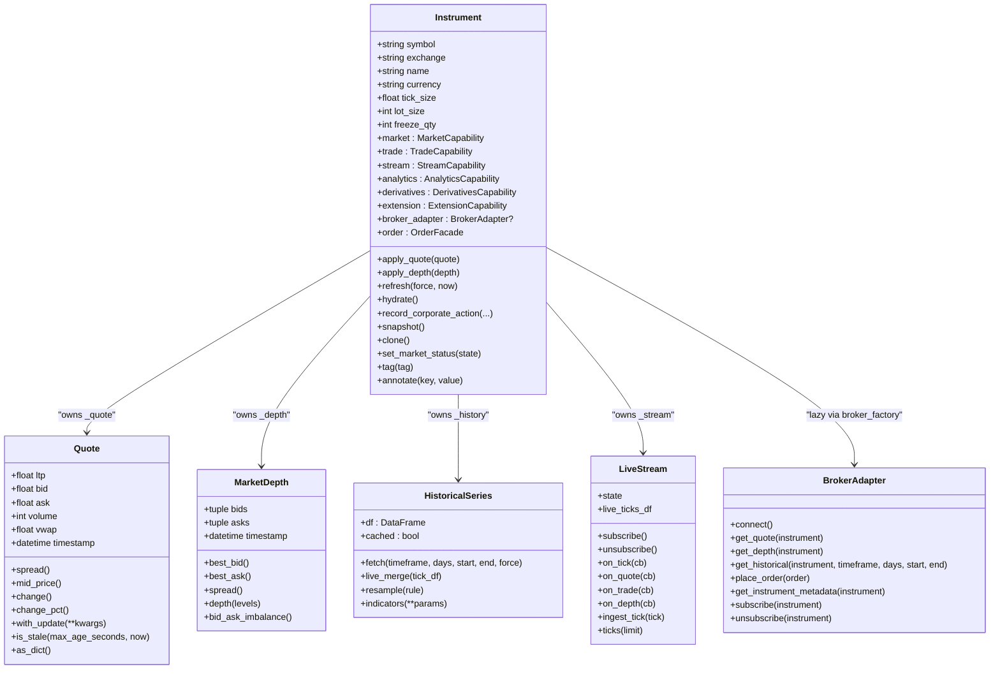

**Diagram sources**
- [base.py:50-305](file://ntrade/domain/instruments/base.py#L50-L305)
- [quote.py:9-91](file://ntrade/domain/market/quote.py#L9-L91)
- [depth.py:9-49](file://ntrade/domain/market/depth.py#L9-L49)
- [history.py:14-149](file://ntrade/domain/market/history.py#L14-L149)
- [stream.py:27-131](file://ntrade/domain/market/stream.py#L27-L131)
- [base.py:25-163](file://ntrade/brokers/base.py#L25-L163)

## Detailed Component Analysis

### Instrument Core State Management
- Quote: Immutable point-in-time snapshot with derived spread, mid price, change metrics, staleness check, and update factory method.
- Depth: Immutable order book with best bid/ask, spread, top N levels, and bid-ask imbalance.
- History: Cached OHLCV DataFrame with fetch lifecycle, freshness checks, live merge, resampling, and indicator computation.
- Stream: Subscription lifecycle, event handlers, tick cache, and ingestion pipeline updating quote state and emitting events.
- Indicators and Signals: Mutable dictionaries storing computed indicators and strategy/pattern signals.
- Annotations and Tags: Lightweight metadata storage for human-readable notes and categorization.
- Session and Market Status: Per-instrument session state and market status enum transitions.

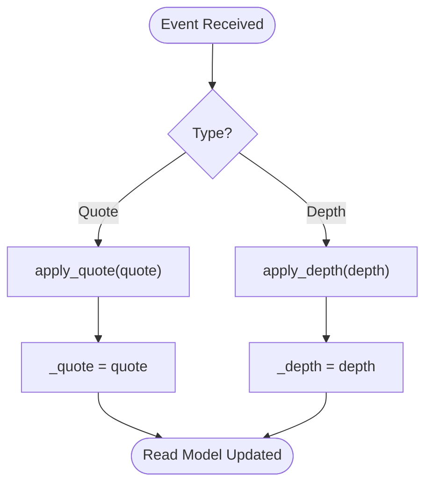

**Diagram sources**
- [base.py:154-166](file://ntrade/domain/instruments/base.py#L154-L166)
- [quote.py:9-72](file://ntrade/domain/market/quote.py#L9-L72)
- [depth.py:9-49](file://ntrade/domain/market/depth.py#L9-L49)

**Section sources**
- [base.py:78-94](file://ntrade/domain/instruments/base.py#L78-L94)
- [quote.py:9-72](file://ntrade/domain/market/quote.py#L9-L72)
- [depth.py:9-49](file://ntrade/domain/market/depth.py#L9-L49)
- [history.py:14-149](file://ntrade/domain/market/history.py#L14-L149)
- [stream.py:27-131](file://ntrade/domain/market/stream.py#L27-L131)

### Capability System
Six capability objects provide cohesive, stateless views over Instrument state:
- MarketCapability: Read-only access to quote, depth, history, candles, and scalar metrics like LTP, bid, ask, volume, OI, VWAP, prev close, spread, mid price, staleness, and imbalance.
- TradeCapability: Fluent order entry via OrderBuilder supporting market/limit/stop orders, quantity, product type, target/stop-loss legs, and submission through OrderFacade.
- StreamCapability: Subscribe/unsubscribe, event registration (tick/quote/trade/depth/disconnect/reconnect), tick retrieval, live candle stream, and live status.
- AnalyticsCapability: Indicator computation (RSI, ATR, Supertrend, Heikin-Ashi, Renko), statistics, bulk compute bundle, pattern detection (breakout, imbalance, absorption).
- DerivativesCapability: Option chain fetching via OptionChain.
- ExtensionCapability: Provider-specific extensions resolved against current broker via BrokerExtensionFacade.

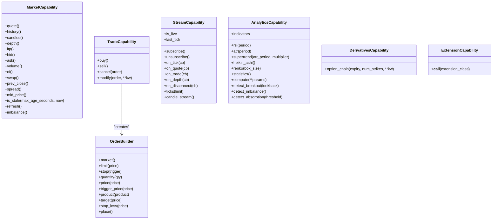

**Diagram sources**
- [capabilities.py:37-383](file://ntrade/domain/instruments/capabilities.py#L37-L383)

**Section sources**
- [capabilities.py:37-383](file://ntrade/domain/instruments/capabilities.py#L37-L383)

### Broker Integration and Lazy Initialization
- BrokerAdapter defines the transport boundary for quotes, depth, historical data, option chains, order placement, and streaming subscriptions.
- Instrument.broker_adapter lazily constructs the adapter using broker_factory if not provided directly, enabling broker-free instrument creation.
- BrokerExtensionFacade resolves dynamic capabilities by name based on registered capabilities and supported brokers.

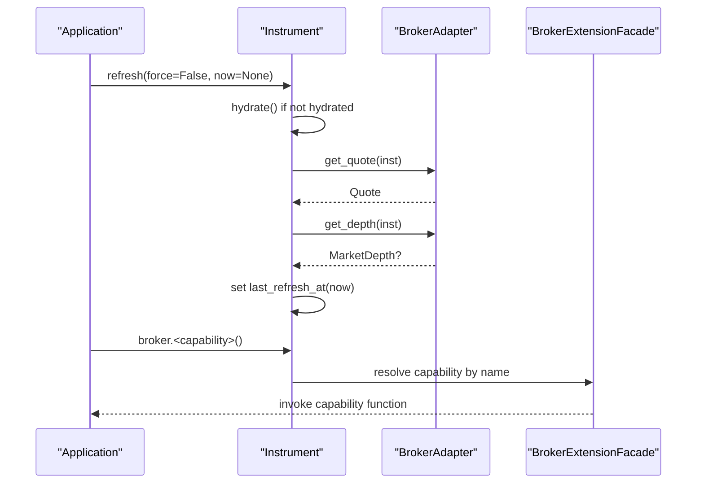

**Diagram sources**
- [base.py:169-209](file://ntrade/domain/instruments/base.py#L169-L209)
- [base.py:25-163](file://ntrade/brokers/base.py#L25-L163)
- [capabilities.py:48-74](file://ntrade/brokers/capabilities.py#L48-L74)

**Section sources**
- [base.py:96-121](file://ntrade/domain/instruments/base.py#L96-L121)
- [base.py:25-163](file://ntrade/brokers/base.py#L25-L163)
- [capabilities.py:48-74](file://ntrade/brokers/capabilities.py#L48-L74)

### Lifecycle Methods: refresh(), hydrate(), apply_quote(), apply_depth()
- refresh(): Pulls latest quote and optional depth from broker, hydrates metadata once, updates last refresh timestamp.
- hydrate(): Fetches broker-known metadata (tick size, lot size, freeze qty, circuit limits) and applies to instrument state.
- apply_quote()/apply_depth(): Event-driven read model updates replacing internal quote/depth snapshots.

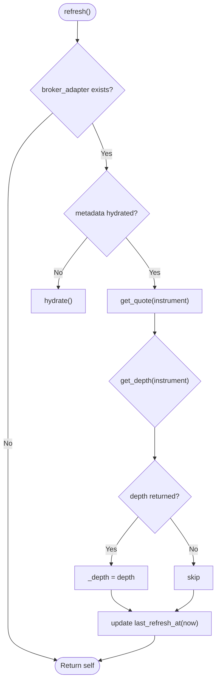

**Diagram sources**
- [base.py:169-209](file://ntrade/domain/instruments/base.py#L169-L209)

**Section sources**
- [base.py:169-209](file://ntrade/domain/instruments/base.py#L169-L209)

### Corporate Action Handling
CorporateAction dataclass supports dividend, split, bonus, merger events with fields for amount, ratio, ex_date, record_date, and description. Instrument maintains a list of corporate actions and provides methods to record and clear them.

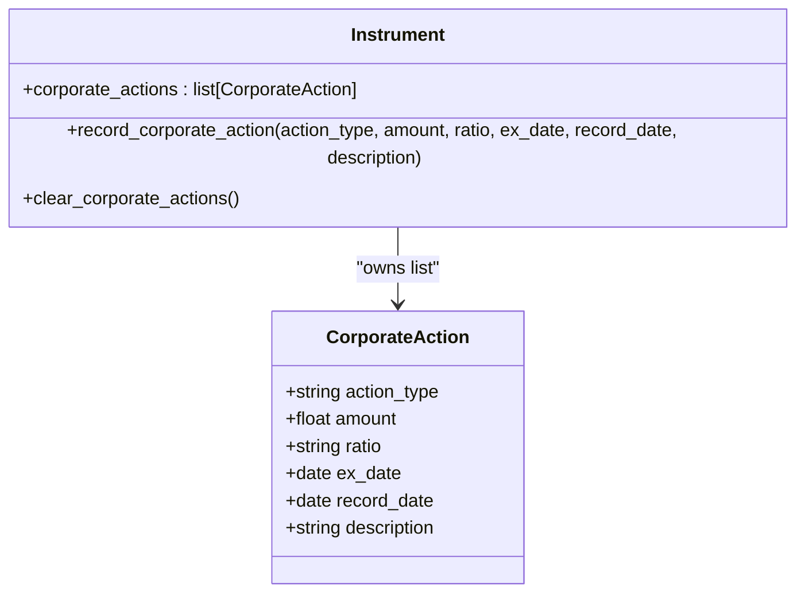

**Diagram sources**
- [base.py:38-48](file://ntrade/domain/instruments/base.py#L38-L48)
- [base.py:215-234](file://ntrade/domain/instruments/base.py#L215-L234)

**Section sources**
- [base.py:38-48](file://ntrade/domain/instruments/base.py#L38-L48)
- [base.py:215-234](file://ntrade/domain/instruments/base.py#L215-L234)

### Session State and Market Status Tracking
SessionState tracks exchange, current state, and last state change timestamp. MarketState enumerates possible market conditions. Instrument exposes setters to transition market status and integrates with session state.

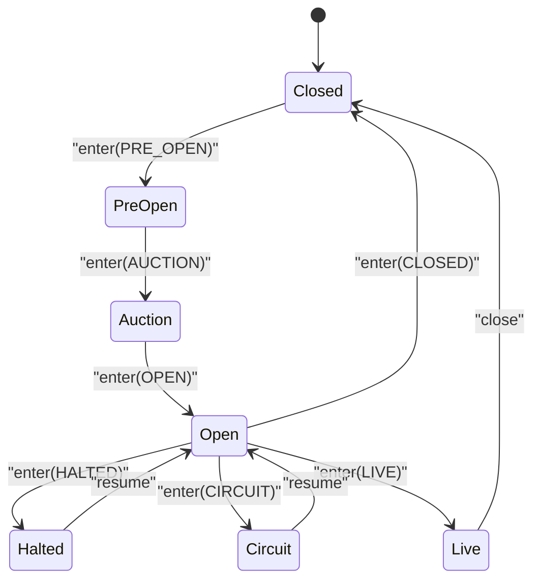

**Diagram sources**
- [session.py:10-46](file://ntrade/domain/session.py#L10-L46)
- [base.py:273-279](file://ntrade/domain/instruments/base.py#L273-L279)

**Section sources**
- [session.py:10-46](file://ntrade/domain/session.py#L10-L46)
- [base.py:273-279](file://ntrade/domain/instruments/base.py#L273-L279)

### Serialization and Snapshot Capabilities
Instrument.snapshot() serializes key state including symbol, exchange, kind, name, quote dict, live status, market status, session state, and last refresh timestamp. serialize() aliases snapshot().

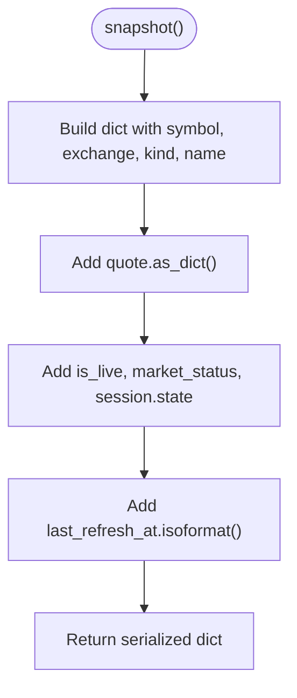

**Diagram sources**
- [base.py:253-262](file://ntrade/domain/instruments/base.py#L253-L262)

**Section sources**
- [base.py:253-262](file://ntrade/domain/instruments/base.py#L253-L262)

### Identity Management with clone()
clone() creates a fresh independent copy preserving identity fields (symbol, exchange, name, currency, tick/lot/freeze sizes, broker reference, and metadata). Internal state (quote, depth, history, stream) is reset to defaults.

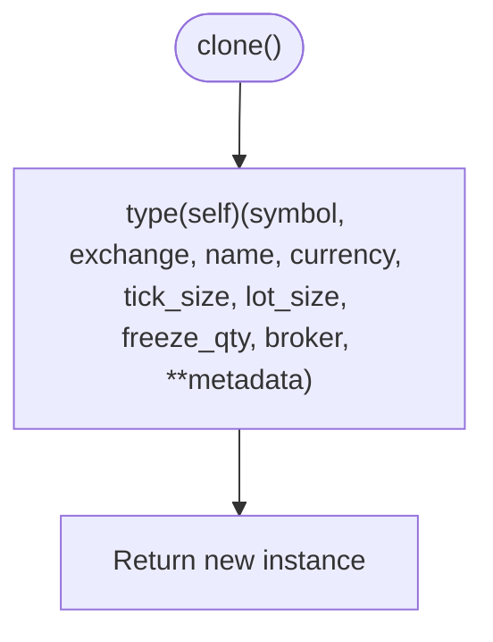

**Diagram sources**
- [base.py:264-270](file://ntrade/domain/instruments/base.py#L264-L270)

**Section sources**
- [base.py:264-270](file://ntrade/domain/instruments/base.py#L264-L270)

### Usage Examples and Patterns
- Instrument creation: Instantiate Equity/Index/Future/Option with symbol, exchange, and optional broker or broker_factory.
- State updates: Use apply_quote() and apply_depth() for event-driven updates; use refresh() to pull latest data from broker.
- Capability access: Access market data via instrument.market.*, place orders via instrument.trade.buy().market().quantity(100).place(), subscribe to streams via instrument.stream.subscribe().
- Corporate actions: Record actions via instrument.record_corporate_action("dividend", amount=10.0, ex_date=date(...)).
- Session and status: Transition market status via instrument.set_market_status(MarketState.OPEN).
- Serialization: Capture state via instrument.snapshot() or instrument.serialize().
- Cloning: Create independent copies via instrument.clone().

**Section sources**
- [test_instruments.py:11-165](file://tests/test_instruments.py#L11-L165)
- [base.py:56-94](file://ntrade/domain/instruments/base.py#L56-L94)
- [capabilities.py:106-188](file://ntrade/domain/instruments/capabilities.py#L106-L188)

## Dependency Analysis
Instrument depends on market data models (Quote, MarketDepth, HistoricalSeries, LiveStream), session state, and broker abstraction. Capabilities depend on Instrument internals but remain stateless. Concrete instrument types inherit from Instrument and add specialized attributes/methods.

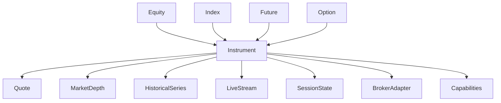

**Diagram sources**
- [base.py:50-152](file://ntrade/domain/instruments/base.py#L50-L152)
- [quote.py:9-72](file://ntrade/domain/market/quote.py#L9-L72)
- [depth.py:9-49](file://ntrade/domain/market/depth.py#L9-L49)
- [history.py:14-149](file://ntrade/domain/market/history.py#L14-L149)
- [stream.py:27-131](file://ntrade/domain/market/stream.py#L27-L131)
- [session.py:10-46](file://ntrade/domain/session.py#L10-L46)
- [base.py:25-163](file://ntrade/brokers/base.py#L25-L163)
- [cash.py:8-50](file://ntrade/domain/instruments/cash.py#L8-L50)
- [derivatives.py:16-245](file://ntrade/domain/instruments/derivatives.py#L16-L245)

**Section sources**
- [base.py:50-152](file://ntrade/domain/instruments/base.py#L50-L152)
- [cash.py:8-50](file://ntrade/domain/instruments/cash.py#L8-L50)
- [derivatives.py:16-245](file://ntrade/domain/instruments/derivatives.py#L16-L245)

## Performance Considerations
- Immutability: Quote and MarketDepth are immutable, reducing mutation overhead and ensuring consistent reads.
- Caching: HistoricalSeries caches fetched data per timeframe with freshness checks to minimize redundant network calls.
- Lazy initialization: BrokerAdapter is created only when needed via broker_factory, avoiding unnecessary setup costs.
- Event-driven updates: apply_quote() and apply_depth() avoid polling by directly updating read model state.
- Stream buffering: LiveStream uses bounded deque for ticks to prevent unbounded memory growth.

## Troubleshooting Guide
- No broker adapter: If refresh() fails due to missing broker, ensure broker or broker_factory is provided during Instrument construction.
- Stale quotes: Use Quote.is_stale() to detect outdated quotes and trigger refresh if needed.
- History fetch errors: HistoricalSeries.fetch() raises RuntimeError if no broker adapter is available; verify broker configuration.
- Capability not supported: BrokerExtensionFacade raises AttributeError if a capability is not supported by the current broker; check available capabilities via BrokerExtensionFacade.available().
- Stream disconnects: LiveStream.notify_disconnect() resets subscription state; handle reconnect events via on_reconnect().

**Section sources**
- [base.py:169-184](file://ntrade/domain/instruments/base.py#L169-L184)
- [quote.py:59-63](file://ntrade/domain/market/quote.py#L59-L63)
- [history.py:68-71](file://ntrade/domain/market/history.py#L68-L71)
- [capabilities.py:60-70](file://ntrade/brokers/capabilities.py#L60-L70)
- [stream.py:124-130](file://ntrade/domain/market/stream.py#L124-L130)

## Conclusion
The Instrument class serves as the foundational data model for all market entities in nTrade, encapsulating state, capabilities, and broker integration in a clean, extensible architecture. Its design emphasizes immutability where appropriate, lazy initialization for performance, event-driven updates for responsiveness, and a rich capability system for modular functionality. By adhering to these patterns, developers can build robust trading systems with clear separation of concerns and scalable broker integrations.

## Appendices
- Example usage patterns are validated in tests, demonstrating instrument creation, state updates, capability access, and lifecycle management.
- For advanced analytics and derivatives, leverage AnalyticsCapability and DerivativesCapability respectively.
- Extend Instrument for custom asset classes by subclassing and overriding KIND and DEFAULT_EXCHANGE as needed.

**Section sources**
- [test_instruments.py:11-165](file://tests/test_instruments.py#L11-L165)
- [capabilities.py:269-383](file://ntrade/domain/instruments/capabilities.py#L269-L383)
- [derivatives.py:16-245](file://ntrade/domain/instruments/derivatives.py#L16-L245)
- [cash.py:8-50](file://ntrade/domain/instruments/cash.py#L8-L50)