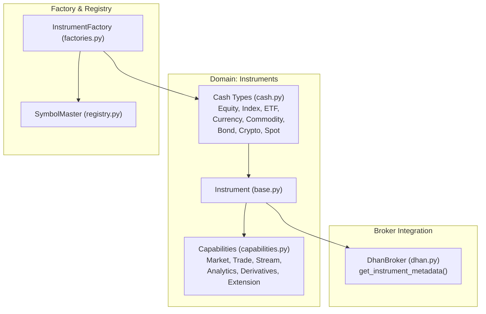
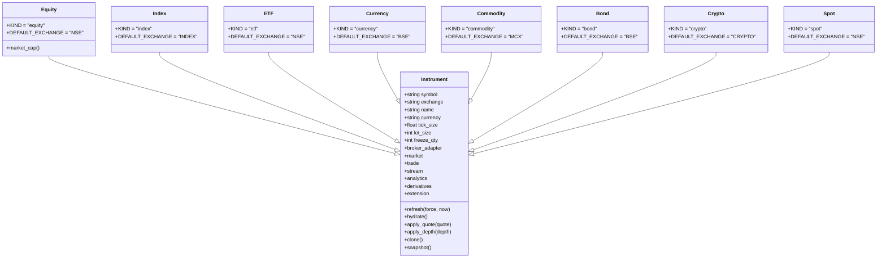
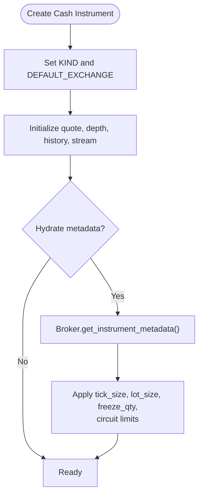
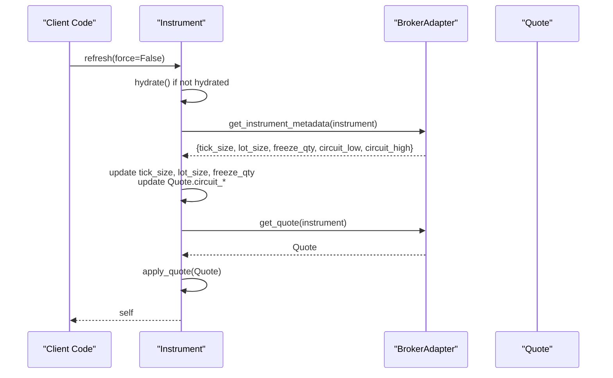
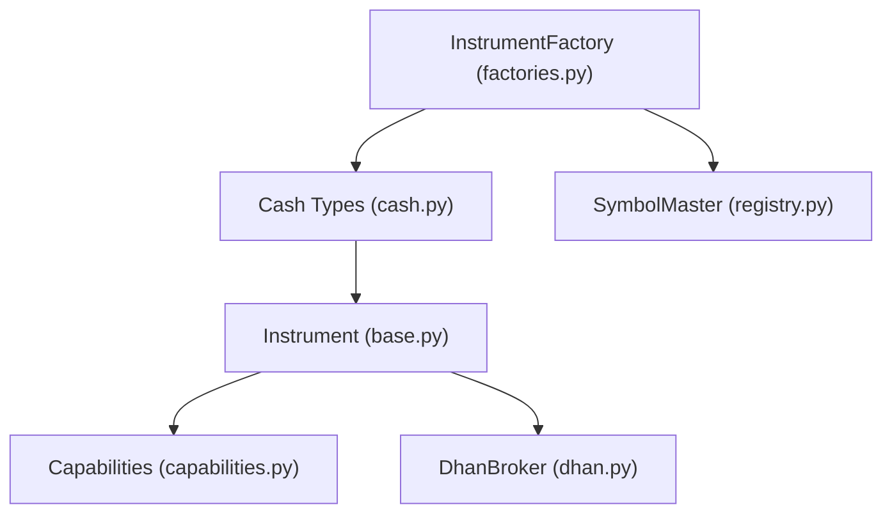
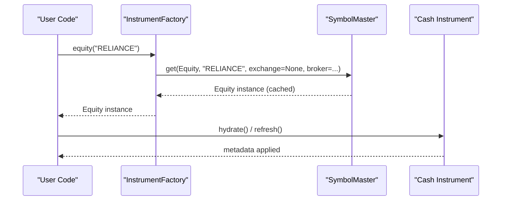

# Cash Instruments

<cite>
**Referenced Files in This Document**
- [base.py](file://ntrade/domain/instruments/base.py)
- [cash.py](file://ntrade/domain/instruments/cash.py)
- [capabilities.py](file://ntrade/domain/instruments/capabilities.py)
- [__init__.py](file://ntrade/domain/instruments/__init__.py)
- [factories.py](file://ntrade/factories.py)
- [registry.py](file://ntrade/registry.py)
- [dhan.py](file://ntrade/brokers/dhan.py)
- [test_instruments.py](file://tests/test_instruments.py)
</cite>

## Table of Contents
1. [Introduction](#introduction)
2. [Project Structure](#project-structure)
3. [Core Components](#core-components)
4. [Architecture Overview](#architecture-overview)
5. [Detailed Component Analysis](#detailed-component-analysis)
6. [Dependency Analysis](#dependency-analysis)
7. [Performance Considerations](#performance-considerations)
8. [Troubleshooting Guide](#troubleshooting-guide)
9. [Conclusion](#conclusion)
10. [Appendices](#appendices)

## Introduction
This document explains the cash instruments implementation for Equity, Index, ETF, Currency, Commodity, Bond, Crypto, and Spot asset classes. It details how each cash instrument extends the base Instrument class with asset-specific characteristics, validation rules, trading conventions, and exchange defaults. It also documents common properties such as tick_size, lot_size, freeze_qty, metadata handling, and broker-driven hydration. Practical examples show how to create different cash instrument types, access their specific attributes, and implement asset-class-specific business logic. The inheritance hierarchy and shared functionality across cash instruments are covered with diagrams and code-level references.

## Project Structure
Cash instruments live under the domain layer and are exposed via a clean package interface. Factories and registries provide consistent creation and caching behavior. Broker adapters supply exchange-specific metadata and capabilities.

**Diagram sources**
- [base.py:50-152](file://ntrade/domain/instruments/base.py#L50-L152)
- [cash.py:8-50](file://ntrade/domain/instruments/cash.py#L8-L50)
- [capabilities.py:37-151](file://ntrade/domain/instruments/capabilities.py#L37-L151)
- [factories.py:20-44](file://ntrade/factories.py#L20-L44)
- [registry.py:16-43](file://ntrade/registry.py#L16-L43)
- [dhan.py:608-633](file://ntrade/brokers/dhan.py#L608-L633)

**Section sources**
- [base.py:50-152](file://ntrade/domain/instruments/base.py#L50-L152)
- [cash.py:8-50](file://ntrade/domain/instruments/cash.py#L8-L50)
- [capabilities.py:37-151](file://ntrade/domain/instruments/capabilities.py#L37-L151)
- [factories.py:20-44](file://ntrade/factories.py#L20-L44)
- [registry.py:16-43](file://ntrade/registry.py#L16-L43)
- [dhan.py:608-633](file://ntrade/brokers/dhan.py#L608-L633)

## Core Components
- Instrument base class provides core identity, state ownership (quote, depth, history, stream), capability composition, lifecycle methods (refresh, hydrate), corporate actions, signals, tags, annotations, serialization, and cloning.
- Cash instrument subclasses specialize KIND and DEFAULT_EXCHANGE; Equity adds a market_cap property derived from metadata.
- Capabilities expose read-only market data, fluent order entry, streaming, analytics, derivatives, and provider extensions.
- InstrumentFactory creates typed instances through SymbolMaster, which caches by (kind, symbol, exchange).
- BrokerAdapter.get_instrument_metadata supplies exchange-specific tick_size, lot_size, freeze_qty, and circuit limits.

Key responsibilities:
- Asset class specialization: KIND and default exchange per cash type.
- Metadata hydration: tick_size, lot_size, freeze_qty, circuit limits.
- Capability delegation: market, trade, stream, analytics, derivatives, extension.
- Creation and caching: factory + registry patterns.

**Section sources**
- [base.py:50-210](file://ntrade/domain/instruments/base.py#L50-L210)
- [cash.py:8-50](file://ntrade/domain/instruments/cash.py#L8-L50)
- [capabilities.py:37-151](file://ntrade/domain/instruments/capabilities.py#L37-L151)
- [factories.py:20-44](file://ntrade/factories.py#L20-L44)
- [registry.py:16-43](file://ntrade/registry.py#L16-L43)
- [dhan.py:608-633](file://ntrade/brokers/dhan.py#L608-L633)

## Architecture Overview
The cash instrument architecture follows a composition pattern where Instrument is the root and capabilities are delegated views over internal state. Exchange-specific behavior is encapsulated in broker adapters.

**Diagram sources**
- [base.py:50-152](file://ntrade/domain/instruments/base.py#L50-L152)
- [cash.py:8-50](file://ntrade/domain/instruments/cash.py#L8-L50)

## Detailed Component Analysis

### Inheritance Hierarchy and Shared Functionality
All cash instruments inherit from Instrument and override KIND and DEFAULT_EXCHANGE. Equity adds a market_cap property sourced from metadata. All share:
- Identity fields: symbol, exchange, name, currency
- Trading parameters: tick_size, lot_size, freeze_qty
- State: quote, depth, history, stream, indicators, signals, annotations, tags
- Lifecycle: refresh(), hydrate(), apply_quote(), apply_depth()
- Serialization: snapshot(), clone()

**Diagram sources**
- [base.py:169-210](file://ntrade/domain/instruments/base.py#L169-L210)
- [dhan.py:608-633](file://ntrade/brokers/dhan.py#L608-L633)

**Section sources**
- [base.py:50-210](file://ntrade/domain/instruments/base.py#L50-L210)
- [cash.py:8-50](file://ntrade/domain/instruments/cash.py#L8-L50)

### Common Properties: tick_size, lot_size, freeze_qty
- tick_size: minimum price increment; hydrated once per instrument instance via hydrate().
- lot_size: minimum tradable quantity; used by order builders and broker adapters.
- freeze_qty: maximum allowable quantity per order; enforced by brokers.

These values are populated from broker metadata when available; otherwise they remain None unless explicitly provided at construction.

**Section sources**
- [base.py:186-210](file://ntrade/domain/instruments/base.py#L186-L210)
- [dhan.py:608-633](file://ntrade/brokers/dhan.py#L608-L633)

### Exchange-Specific Configurations and Metadata Handling
- Each cash type defines DEFAULT_EXCHANGE to route lookups and historical data correctly.
- BrokerAdapter.get_instrument_metadata returns exchange-aware metadata (tick_size, lot_size, freeze_qty, circuit limits).
- For indices, exchanges may be mapped to specialized identifiers during history retrieval.

Examples:
- Index uses INDEX exchange by default.
- Commodity uses MCX exchange by default.
- Currency uses BSE exchange by default.

**Section sources**
- [cash.py:17-34](file://ntrade/domain/instruments/cash.py#L17-L34)
- [dhan.py:575-586](file://ntrade/brokers/dhan.py#L575-L586)
- [dhan.py:608-633](file://ntrade/brokers/dhan.py#L608-L633)

### Creating Different Cash Instrument Types
Use InstrumentFactory or direct instantiation via SymbolMaster:
- equity(symbol, exchange=None, **kw)
- index(symbol, exchange=None, **kw)
- etf(symbol, exchange=None, **kw)
- commodity(symbol, exchange=None, **kw)
- currency(symbol, exchange=None, **kw)
- spot(symbol, exchange=None, **kw)

Factories pass broker kwargs and leverage SymbolMaster for flyweight caching by (kind, symbol, exchange).

**Section sources**
- [factories.py:20-44](file://ntrade/factories.py#L20-L44)
- [registry.py:16-43](file://ntrade/registry.py#L16-L43)

### Accessing Specific Attributes and Business Logic
- Equity.market_cap reads metadata field "market_cap".
- Other cash types can extend metadata usage similarly.
- Business logic can be implemented using capabilities:
  - MarketCapability for read-only quotes, depth, history.
  - TradeCapability.OrderBuilder for fluent order construction.
  - AnalyticsCapability for indicators and pattern detection.
  - StreamCapability for live subscriptions.

Example flows:
- Read LTP: instrument.market.ltp()
- Place order: instrument.trade.buy().market().quantity(lot_size).place()
- Subscribe: instrument.stream.subscribe(); instrument.stream.on_tick(callback)

**Section sources**
- [cash.py:12-14](file://ntrade/domain/instruments/cash.py#L12-L14)
- [capabilities.py:37-151](file://ntrade/domain/instruments/capabilities.py#L37-L151)
- [test_instruments.py:11-29](file://tests/test_instruments.py#L11-L29)

### Validation Rules and Trading Conventions
- Validation occurs primarily in broker adapters and order builders:
  - Timeframe validation for historical requests.
  - Order type and product constraints handled by OrderBuilder and broker adapter.
- Trading conventions:
  - Lot-based quantities for most instruments.
  - Freeze qty caps per broker policy.
  - Circuit limits applied to quotes upon hydration.

Tests demonstrate:
- Hydration sets tick_size, lot_size, freeze_qty once.
- Circuit limits injected into quote on hydrate.
- History cache per timeframe.

**Section sources**
- [dhan.py:732-745](file://ntrade/brokers/dhan.py#L732-L745)
- [test_mission_gaps.py:159-193](file://tests/test_mission_gaps.py#L159-L193)
- [test_instruments.py:77-104](file://tests/test_instruments.py#L77-L104)

### Sequence Diagram: Hydration and Quote Refresh

**Diagram sources**
- [base.py:169-210](file://ntrade/domain/instruments/base.py#L169-L210)
- [dhan.py:608-633](file://ntrade/brokers/dhan.py#L608-L633)

## Dependency Analysis
Cash instruments depend on:
- Instrument base for shared state and capabilities.
- Capabilities for market data, trading, streaming, analytics, derivatives, extensions.
- Factories and SymbolMaster for creation and caching.
- Broker adapters for metadata and exchange-specific behavior.

**Diagram sources**
- [base.py:50-152](file://ntrade/domain/instruments/base.py#L50-L152)
- [cash.py:8-50](file://ntrade/domain/instruments/cash.py#L8-L50)
- [capabilities.py:37-151](file://ntrade/domain/instruments/capabilities.py#L37-L151)
- [factories.py:20-44](file://ntrade/factories.py#L20-L44)
- [registry.py:16-43](file://ntrade/registry.py#L16-L43)
- [dhan.py:608-633](file://ntrade/brokers/dhan.py#L608-L633)

**Section sources**
- [base.py:50-152](file://ntrade/domain/instruments/base.py#L50-L152)
- [cash.py:8-50](file://ntrade/domain/instruments/cash.py#L8-L50)
- [capabilities.py:37-151](file://ntrade/domain/instruments/capabilities.py#L37-L151)
- [factories.py:20-44](file://ntrade/factories.py#L20-L44)
- [registry.py:16-43](file://ntrade/registry.py#L16-L43)
- [dhan.py:608-633](file://ntrade/brokers/dhan.py#L608-L633)

## Performance Considerations
- Hydration runs once per instrument instance to avoid repeated metadata fetches.
- SymbolMaster caches instrument instances by key to reduce memory and ensure shared state.
- Historical series caching is per timeframe to prevent cross-timeframe contamination.
- Capabilities are cached_property-backed where appropriate to minimize overhead.

Recommendations:
- Prefer factory creation to benefit from caching.
- Avoid unnecessary refresh calls; rely on event-driven updates when possible.
- Use timeframe-specific history fetches to maintain cache integrity.

[No sources needed since this section provides general guidance]

## Troubleshooting Guide
Common issues and resolutions:
- Missing metadata: Ensure broker adapter implements get_instrument_metadata and that hydrate() is called before accessing tick_size/lot_size/freeze_qty.
- Incorrect exchange mapping: Verify DEFAULT_EXCHANGE for the cash type and any exchange mappings in broker adapters.
- Timeframe errors: Validate timeframe strings against supported values in broker adapters.
- Stale quotes: Check stream subscription status and last_refresh_at timestamps.

Relevant tests:
- Hydration sets tick_size, lot_size, freeze_qty once.
- Circuit limits injected into quote on hydrate.
- History cache per timeframe.

**Section sources**
- [test_mission_gaps.py:159-193](file://tests/test_mission_gaps.py#L159-L193)
- [test_instruments.py:77-104](file://tests/test_instruments.py#L77-L104)

## Conclusion
Cash instruments in nTrade provide a robust, extensible foundation for Equity, Index, ETF, Currency, Commodity, Bond, Crypto, and Spot asset classes. They inherit shared functionality from Instrument while specializing asset-specific traits like KIND, DEFAULT_EXCHANGE, and metadata-driven properties. Broker adapters supply exchange-specific configurations and metadata, ensuring accurate trading conventions and validations. Factories and registries streamline creation and caching, while capabilities offer a clean API for market data, trading, streaming, analytics, and extensions.

[No sources needed since this section summarizes without analyzing specific files]

## Appendices

### Appendix A: Creating Cash Instruments Example Flow

**Diagram sources**
- [factories.py:20-44](file://ntrade/factories.py#L20-L44)
- [registry.py:16-43](file://ntrade/registry.py#L16-L43)
- [base.py:169-210](file://ntrade/domain/instruments/base.py#L169-L210)

### Appendix B: Capability Usage Summary
- MarketCapability: quote(), history(), candles(), depth(), ltp(), bid(), ask(), volume(), oi(), vwap(), prev_close(), spread(), mid_price(), is_stale(), refresh(), imbalance()
- TradeCapability: buy(), sell(), cancel(), modify()
- StreamCapability: subscribe(), unsubscribe(), on_tick(), on_quote(), on_trade(), on_depth(), on_disconnect(), ticks(), candle_stream(), is_live, last_tick
- AnalyticsCapability: rsi(), atr(), supertrend(), heikin_ashi(), renko(), statistics(), compute(), detect_breakout(), detect_imbalance(), detect_absorption(), indicators
- DerivativesCapability: option_chain()
- ExtensionCapability: __call__(extension_class)

**Section sources**
- [capabilities.py:37-151](file://ntrade/domain/instruments/capabilities.py#L37-L151)