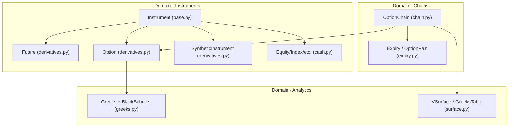
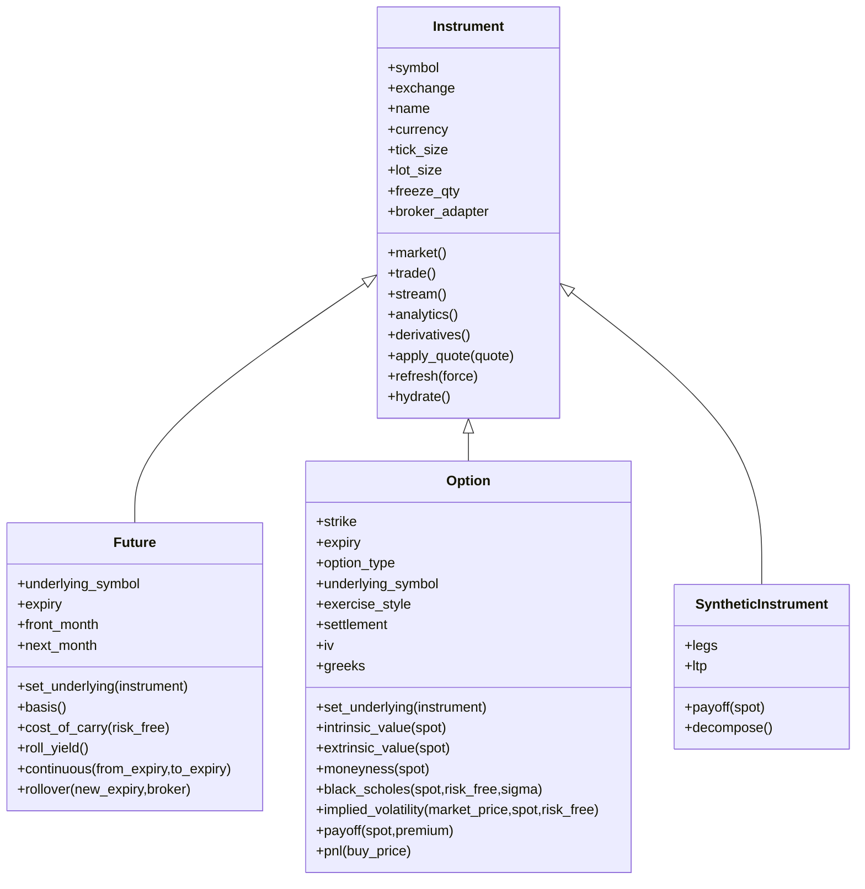
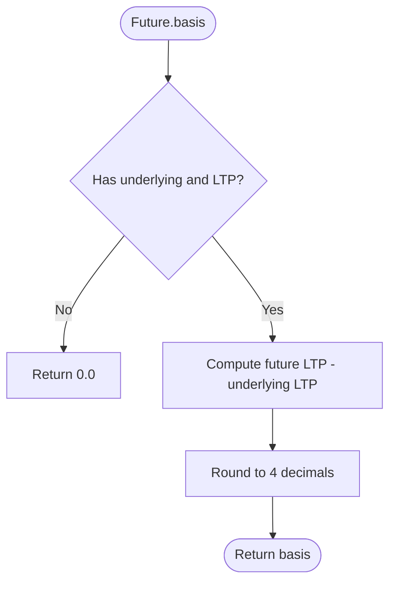
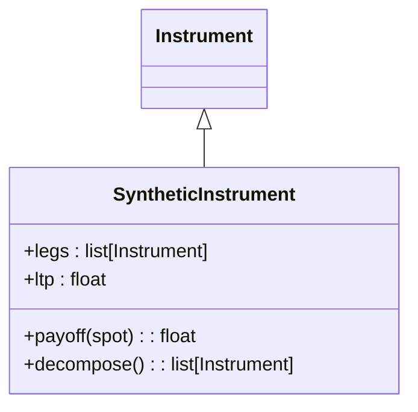
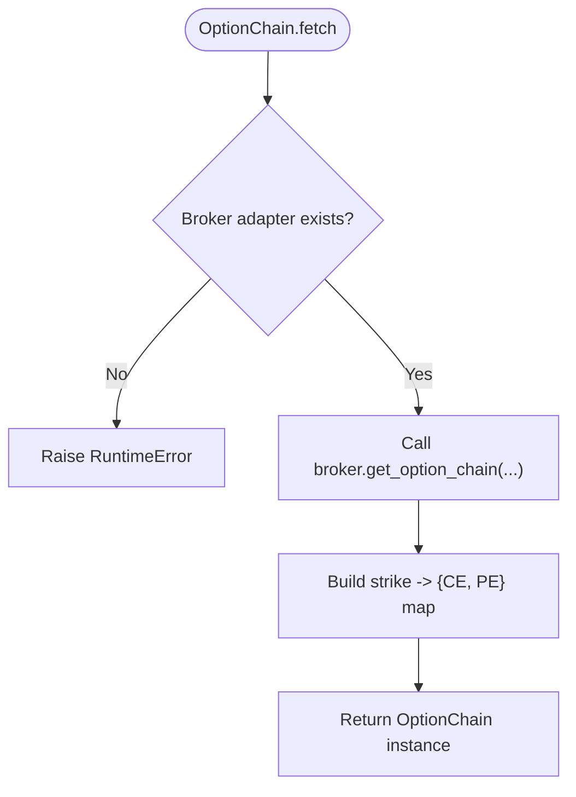
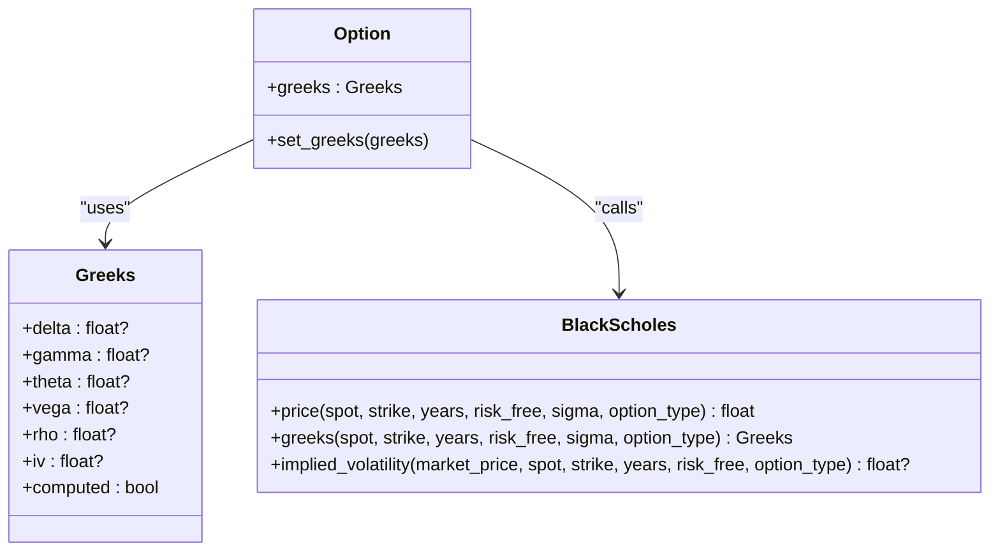
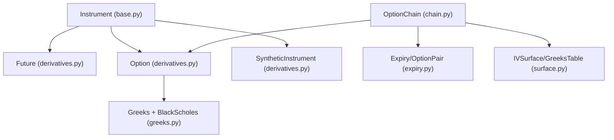

# Derivatives Instruments

<cite>
**Referenced Files in This Document**
- [base.py](file://ntrade/domain/instruments/base.py)
- [derivatives.py](file://ntrade/domain/instruments/derivatives.py)
- [capabilities.py](file://ntrade/domain/instruments/capabilities.py)
- [greeks.py](file://ntrade/domain/analytics/greeks.py)
- [chain.py](file://ntrade/domain/instruments/chain.py)
- [expiry.py](file://ntrade/domain/instruments/expiry.py)
- [surface.py](file://ntrade/domain/analytics/surface.py)
- [test_instruments.py](file://tests/test_instruments.py)
- [test_options_analytics.py](file://tests/test_options_analytics.py)
- [test_futures_carry_costs.py](file://tests/test_futures_carry_costs.py)
</cite>

## Table of Contents
1. [Introduction](#introduction)
2. [Project Structure](#project-structure)
3. [Core Components](#core-components)
4. [Architecture Overview](#architecture-overview)
5. [Detailed Component Analysis](#detailed-component-analysis)
6. [Dependency Analysis](#dependency-analysis)
7. [Performance Considerations](#performance-considerations)
8. [Troubleshooting Guide](#troubleshooting-guide)
9. [Conclusion](#conclusion)

## Introduction
This document explains the derivatives instrument model and analytics in the system, focusing on:
- Future contracts with expiry linkage, basis, cost-of-carry, roll yield, and continuous series construction.
- Option contracts with strike/expiry validation, intrinsic/extrinsic value, moneyness, Black-Scholes pricing, implied volatility, and Greeks integration.
- SyntheticInstrument for composing composite instruments from existing legs.
- The relationship between underlying instruments and their derivative contracts.
- Derivatives-specific validation rules, pricing calculations, and Greeks computation integration.

The goal is to provide both a conceptual overview and code-level mapping so that users can confidently create futures and options, compute analytics, and build synthetic strategies.

## Project Structure
Derivatives are modeled as specialized Instrument subclasses under the domain layer. Core files:
- Base instrument and shared capabilities live in base.py and capabilities.py.
- Derivative types (Future, Option, SyntheticInstrument) are defined in derivatives.py.
- Analytics (Black-Scholes, Greeks) are implemented in greeks.py.
- Option chain navigation and analytics are in chain.py and expiry.py.
- Surface wrappers for IV and Greeks tables are in surface.py.
- Tests demonstrate usage patterns and validation behaviors.



**Diagram sources**
- [base.py](file://ntrade/domain/instruments/base.py)
- [derivatives.py](file://ntrade/domain/instruments/derivatives.py)
- [greeks.py](file://ntrade/domain/analytics/greeks.py)
- [chain.py](file://ntrade/domain/instruments/chain.py)
- [expiry.py](file://ntrade/domain/instruments/expiry.py)
- [surface.py](file://ntrade/domain/analytics/surface.py)

**Section sources**
- [base.py](file://ntrade/domain/instruments/base.py)
- [derivatives.py](file://ntrade/domain/instruments/derivatives.py)
- [capabilities.py](file://ntrade/domain/instruments/capabilities.py)
- [greeks.py](file://ntrade/domain/analytics/greeks.py)
- [chain.py](file://ntrade/domain/instruments/chain.py)
- [expiry.py](file://ntrade/domain/instruments/expiry.py)
- [surface.py](file://ntrade/domain/analytics/surface.py)

## Core Components
- Instrument: Abstract root providing market state, streaming, history, broker wiring, and capability accessors. All derivatives inherit this foundation.
- Future: Extends Instrument with expiry, underlying symbol, basis/cost-of-carry, roll yield, and continuous series helpers.
- Option: Extends Instrument with strike, expiry, option type validation, intrinsic/extrinsic value, moneyness, Black-Scholes pricing, implied volatility, and Greeks integration.
- SyntheticInstrument: Composite instrument aggregating multiple legs; computes combined LTP and payoff.

Key relationships:
- Futures and Options maintain optional references to an underlying Instrument for analytics like basis and intrinsic value.
- Option exposes a lazy Greeks accessor returning a zero-filled default when not computed, ensuring safe chaining.

**Section sources**
- [base.py](file://ntrade/domain/instruments/base.py)
- [derivatives.py](file://ntrade/domain/instruments/derivatives.py)
- [capabilities.py](file://ntrade/domain/instruments/capabilities.py)

## Architecture Overview
The derivatives architecture composes:
- Instrument as the core entity with capabilities (market, trade, stream, analytics, derivatives).
- Future and Option specialize behavior and add domain fields.
- OptionChain organizes Option instances by expiry and strike, exposing ATM/ITM/OTM views and analytics.
- Greeks and Black-Scholes provide pure math pricing and risk metrics.



**Diagram sources**
- [base.py](file://ntrade/domain/instruments/base.py)
- [derivatives.py](file://ntrade/domain/instruments/derivatives.py)

## Detailed Component Analysis

### Future
Responsibilities:
- Expiry management and linking to front/next month contracts.
- Basis calculation relative to underlying spot price.
- Cost-of-carry estimation using annualized basis over days-to-expiry.
- Roll yield derived from linked next-month contract prices.
- Continuous series construction via proportional back-adjustment.

Key fields and methods:
- Fields: underlying_symbol, expiry, front_month, next_month, _underlying.
- Methods: set_underlying, basis, cost_of_carry, rollover, continuous, roll_yield.

Validation and edge cases:
- Basis returns 0.0 if no underlying or missing LTP.
- Cost-of-carry returns 0.0 if missing underlying/LTP or invalid expiry/days.
- Roll yield returns 0.0 if next_month not linked or prices missing.

Usage examples (conceptual):
- Create a future with underlying symbol and expiry date.
- Link the underlying instrument to compute basis and cost-of-carry.
- Build a continuous series for backtesting across expiries.



**Diagram sources**
- [derivatives.py](file://ntrade/domain/instruments/derivatives.py)

**Section sources**
- [derivatives.py](file://ntrade/domain/instruments/derivatives.py)
- [test_instruments.py](file://tests/test_instruments.py)

### Option
Responsibilities:
- Strike/expiry/type validation and storage.
- Intrinsic/extrinsic value computation based on spot or underlying LTP.
- Moneyness classification (ITM/ATM/OTM) with ATM threshold.
- Black-Scholes pricing and implied volatility solver.
- Greeks integration via a lazy accessor returning a zero-filled default when unset.

Key fields and methods:
- Fields: strike, expiry, option_type, underlying_symbol, exercise_style, settlement, iv, _greeks.
- Methods: set_underlying, greeks, set_greeks, delta/gamma/theta/vega/rho properties, intrinsic_value, extrinsic_value, moneyness, black_scholes, implied_volatility, payoff, pnl.

Validation rules:
- option_type must be "CE" or "PE"; otherwise raises ValueError.
- Implied volatility returns NOT_COMPUTED (None sentinel) when inputs are invalid or unsolvable.

Usage examples (conceptual):
- Create a call or put with strike and expiry; validate type.
- Set underlying to compute intrinsic value and moneyness.
- Compute theoretical price via Black-Scholes and derive implied volatility.
- Attach Greeks to enable safe property access.

```mermaid
sequenceDiagram
participant Client as "Client Code"
participant Opt as "Option"
participant BS as "BlackScholes"
participant Greeks as "Greeks"
Client->>Opt : black_scholes(spot, risk_free, sigma)
Opt->>BS : price(spot, strike, years, risk_free, sigma, option_type)
BS-->>Opt : theoretical price
Opt-->>Client : price
Client->>Opt : implied_volatility(market_price, spot, risk_free)
Opt->>BS : implied_volatility(market_price, spot, strike, years, risk_free, option_type)
BS-->>Opt : iv or None
Opt-->>Client : iv or None
```

**Diagram sources**
- [derivatives.py](file://ntrade/domain/instruments/derivatives.py)
- [greeks.py](file://ntrade/domain/analytics/greeks.py)

**Section sources**
- [derivatives.py](file://ntrade/domain/instruments/derivatives.py)
- [greeks.py](file://ntrade/domain/analytics/greeks.py)
- [test_options_analytics.py](file://tests/test_options_analytics.py)

### SyntheticInstrument
Responsibilities:
- Aggregate multiple leg instruments into a single synthetic instrument.
- Provide combined last traded price (sum of leg LTPs).
- Compute aggregate payoff across legs at a given spot.
- Decompose into constituent legs.

Usage examples (conceptual):
- Construct a straddle by combining a call and put at the same strike/expiry.
- Use payoff(spot) to evaluate strategy PnL across scenarios.



**Diagram sources**
- [derivatives.py](file://ntrade/domain/instruments/derivatives.py)

**Section sources**
- [derivatives.py](file://ntrade/domain/instruments/derivatives.py)

### OptionChain and Expiry Navigation
Responsibilities:
- Organize Option instances by expiry and strike.
- Provide ATM/ITM/OTM selection, PCR, max pain, IV surface, and Greeks table.
- Support subscription and refresh flows through underlying broker adapter.

Key features:
- O(1) strike lookup via internal map.
- Expiry grouping with OptionPair bundles for strikes.
- Analytics: pcr(), max_pain(), iv_surface(), greeks_table().



**Diagram sources**
- [chain.py](file://ntrade/domain/instruments/chain.py)

**Section sources**
- [chain.py](file://ntrade/domain/instruments/chain.py)
- [expiry.py](file://ntrade/domain/instruments/expiry.py)
- [test_options_analytics.py](file://tests/test_options_analytics.py)

### Greeks and Black-Scholes Integration
Responsibilities:
- Pure math engine for option pricing, Greeks, and implied volatility.
- Sentinel handling for NOT_COMPUTED values to avoid ambiguity.
- Safe defaults in Option.greeks to prevent attribute errors during chaining.

Key components:
- Greeks dataclass with delta, gamma, theta, vega, rho, iv.
- BlackScholes static methods: price, greeks, implied_volatility.
- Option.greeks property returns a zero-filled Greeks when not set.



**Diagram sources**
- [greeks.py](file://ntrade/domain/analytics/greeks.py)
- [derivatives.py](file://ntrade/domain/instruments/derivatives.py)

**Section sources**
- [greeks.py](file://ntrade/domain/analytics/greeks.py)
- [derivatives.py](file://ntrade/domain/instruments/derivatives.py)

## Dependency Analysis
- Instrument provides capability accessors (market, trade, stream, analytics, derivatives).
- Future and Option extend Instrument and rely on its quote/history/stream state.
- Option integrates with BlackScholes and Greeks for pricing and risk metrics.
- OptionChain depends on Option instances and uses IVSurface/GreeksTable wrappers.
- Capabilities expose clean APIs without leaking internal state.



**Diagram sources**
- [base.py](file://ntrade/domain/instruments/base.py)
- [derivatives.py](file://ntrade/domain/instruments/derivatives.py)
- [greeks.py](file://ntrade/domain/analytics/greeks.py)
- [chain.py](file://ntrade/domain/instruments/chain.py)
- [expiry.py](file://ntrade/domain/instruments/expiry.py)
- [surface.py](file://ntrade/domain/analytics/surface.py)

**Section sources**
- [capabilities.py](file://ntrade/domain/instruments/capabilities.py)
- [chain.py](file://ntrade/domain/instruments/chain.py)

## Performance Considerations
- Lazy initialization: Capability objects are cached properties on Instrument to avoid repeated instantiation.
- Default Greeks: Option.greeks returns a zero-filled object when not computed, preventing runtime errors and enabling safe chaining.
- Back-adjusted continuous series: Proportional normalization removes seams across expiries efficiently.
- Strike map: OptionChain builds an O(1) strike lookup index for fast retrieval.
- NOT_COMPUTED sentinel: Avoids ambiguous zero values in IV and Greeks computations.

[No sources needed since this section provides general guidance]

## Troubleshooting Guide
Common issues and resolutions:
- Invalid option_type: Ensure option_type is "CE" or "PE". Construction raises ValueError otherwise.
- Missing underlying for basis/cost-of-carry: Set underlying via set_underlying before computing basis or cost_of_carry.
- No next-month link for roll_yield: Link next_month to compute roll yield; otherwise returns 0.0.
- No broker adapter for OptionChain.fetch: Ensure the underlying has a broker_adapter configured; otherwise raises RuntimeError.
- Implied volatility not computable: Returns NOT_COMPUTED (None) when inputs are invalid or bounds cannot be found.

**Section sources**
- [derivatives.py](file://ntrade/domain/instruments/derivatives.py)
- [chain.py](file://ntrade/domain/instruments/chain.py)
- [greeks.py](file://ntrade/domain/analytics/greeks.py)
- [test_instruments.py](file://tests/test_instruments.py)
- [test_options_analytics.py](file://tests/test_options_analytics.py)

## Conclusion
The derivatives model provides a robust, composable framework for futures and options:
- Future supports expiry-driven analytics and roll mechanics.
- Option offers comprehensive pricing, Greeks, and validation.
- SyntheticInstrument enables strategy composition.
- OptionChain and Expiry facilitate navigation and analytics across strikes and expiries.
- Integration with Black-Scholes and Greeks ensures accurate risk and pricing calculations.

Adhering to the documented validation rules and leveraging the provided APIs will ensure reliable creation and analysis of derivatives instruments.

[No sources needed since this section summarizes without analyzing specific files]