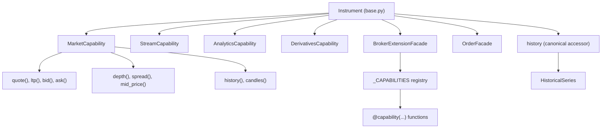
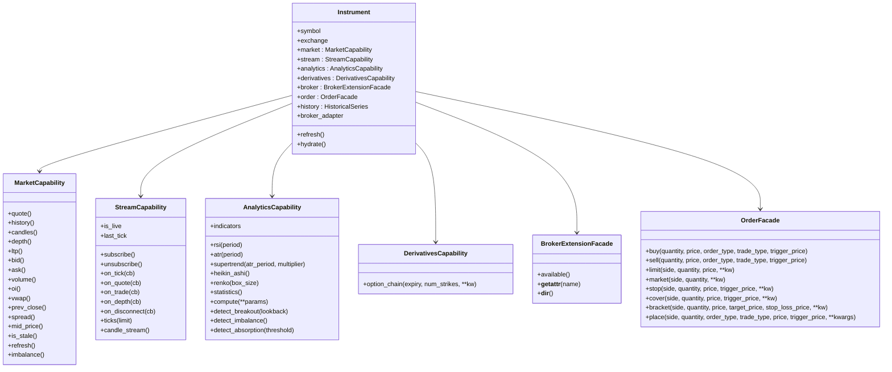
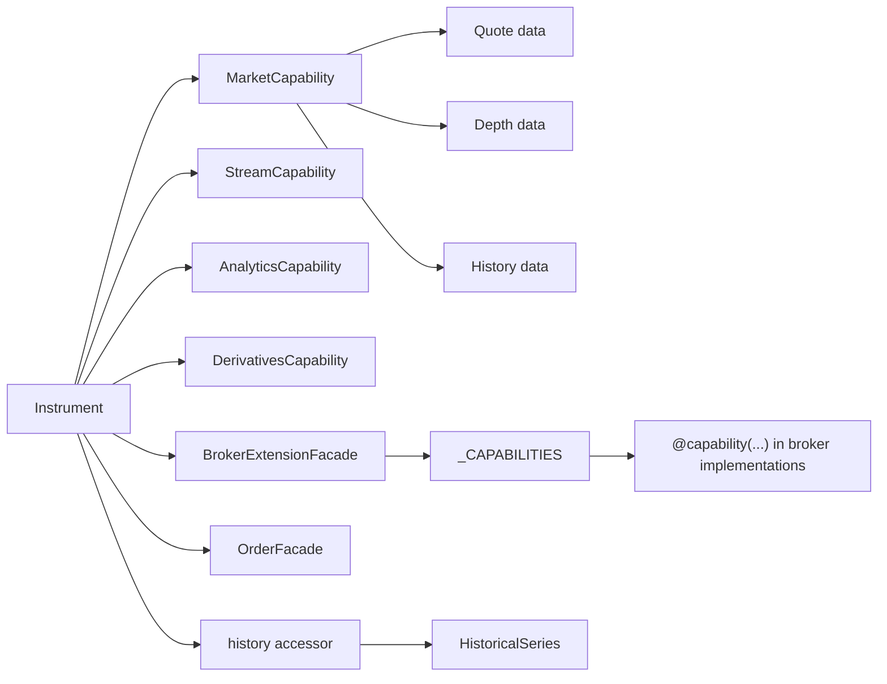

# Instrument Capabilities

<cite>
**Referenced Files in This Document**
- [capabilities.py](file://ntrade/domain/instruments/capabilities.py)
- [base.py](file://ntrade/domain/instruments/base.py)
- [capabilities.py](file://ntrade/brokers/capabilities.py)
- [order.py](file://ntrade/domain/orders/order.py)
- [test_instruments.py](file://tests/test_instruments.py)
- [market_engine.py](file://ntrade/engines/market_engine.py)
- [risk_engine.py](file://ntrade/engines/risk_engine.py)
- [builtin.py](file://ntrade/scanners/builtin.py)
</cite>

## Update Summary
**Changes Made**
- Removed all references to TradeCapability, OrderBuilder, and ExtensionCapability facades from documentation
- Updated architecture diagrams to reflect the current four-capability system (Market, Stream, Analytics, Derivatives)
- Added documentation for the new Instrument.history canonical accessor
- Updated examples to show the standardized instrument.market interface usage
- Revised order placement documentation to use the simplified OrderFacade pattern
- Updated production code references to show canonical accessor usage in engines and scanners

## Table of Contents
1. [Introduction](#introduction)
2. [Project Structure](#project-structure)
3. [Core Components](#core-components)
4. [Architecture Overview](#architecture-overview)
5. [Detailed Component Analysis](#detailed-component-analysis)
6. [Dependency Analysis](#dependency-analysis)
7. [Performance Considerations](#performance-considerations)
8. [Troubleshooting Guide](#troubleshooting-guide)
9. [Conclusion](#conclusion)
10. [Appendices](#appendices)

## Introduction
This document explains the capability system that extends instrument functionality through specialized, lazily instantiated, and cached capability classes. The system provides a clean separation between core instrument state and specialized capabilities for different domains. It covers:
- MarketCapability for read-only market data operations through the standardized `instrument.market` interface
- StreamCapability for real-time data streaming
- AnalyticsCapability for technical analysis over cached history
- DerivativesCapability for options/futures specific operations
- BrokerExtensionFacade for broker-specific features via a registration mechanism
- OrderFacade for direct order execution without complex builder patterns

The system emphasizes canonical accessors like `instrument.history` and standardized market data access through `instrument.market` for consistency and maintainability.

**Updated** The system now uses a streamlined four-capability architecture with canonical accessors and simplified order placement. All production code routes market data reads through the canonical `instrument.market` interface rather than accessing private attributes directly.

## Project Structure
The capability system is centered around the Instrument base class, which composes four capability objects exposed as properties plus additional canonical accessors. Each capability encapsulates a coherent set of behaviors and delegates to the instrument's internal state (quote, depth, history, stream, indicators). Broker-specific extensions are resolved dynamically at runtime through the broker facade.

**Diagram sources**
- [base.py](file://ntrade/domain/instruments/base.py)
- [capabilities.py](file://ntrade/domain/instruments/capabilities.py)
- [capabilities.py](file://ntrade/brokers/capabilities.py)
- [order.py](file://ntrade/domain/orders/order.py)

**Section sources**
- [base.py](file://ntrade/domain/instruments/base.py)
- [capabilities.py](file://ntrade/domain/instruments/capabilities.py)
- [capabilities.py](file://ntrade/brokers/capabilities.py)
- [order.py](file://ntrade/domain/orders/order.py)

## Core Components
- **Instrument**: The composition root exposing lazy, cached capability properties and owning all mutable state (quote, depth, history, stream, indicators). Includes canonical accessors like `history` for consistent data access.
- **MarketCapability**: Read-only accessors over quote/depth/history and derived metrics like spread, mid_price, imbalance through the standardized `instrument.market` interface.
- **StreamCapability**: Subscription lifecycle and event handlers for live ticks, quotes, trades, and depth.
- **AnalyticsCapability**: Indicator computation and pattern detection over cached history; bulk compute bundle support.
- **DerivativesCapability**: Option chain retrieval and derivatives analytics helpers.
- **BrokerExtensionFacade**: Class-based resolution of broker-specific capabilities via a global registry.
- **OrderFacade**: Direct order placement through `instrument.order` with simple method calls.

Key design principles:
- **Statelessness**: Capabilities do not hold mutable state; they are thin views over Instrument's internal state.
- **Lazy instantiation and caching**: Capabilities are created once per instrument instance using cached_property.
- **Canonical accessors**: Consistent access patterns through `instrument.market` and `instrument.history`.
- **Fail-fast extension resolution**: Unsupported broker capabilities raise AttributeError immediately.
- **Simplified order entry**: Direct method calls instead of fluent builders for better performance.

**Section sources**
- [base.py](file://ntrade/domain/instruments/base.py)
- [capabilities.py](file://ntrade/domain/instruments/capabilities.py)
- [capabilities.py](file://ntrade/brokers/capabilities.py)
- [order.py](file://ntrade/domain/orders/order.py)

## Architecture Overview
The capability architecture separates concerns cleanly with canonical accessors:
- Instrument owns state and exposes capabilities via cached properties plus canonical accessors.
- Each capability focuses on a single responsibility area.
- Broker-specific features are decoupled via a decorator-driven registry and dynamic attribute resolution.
- Order placement uses a straightforward facade pattern without complex builder chains.
- Production code consistently uses canonical accessors (`instrument.market`, `instrument.history`) instead of private attributes.

**Diagram sources**
- [base.py](file://ntrade/domain/instruments/base.py)
- [capabilities.py](file://ntrade/domain/instruments/capabilities.py)
- [capabilities.py](file://ntrade/brokers/capabilities.py)
- [order.py](file://ntrade/domain/orders/order.py)

## Detailed Component Analysis

### MarketCapability
Responsibilities:
- Provide read-only access to quote, depth, and historical series through the standardized `instrument.market` interface.
- Expose scalar metrics (LTP, bid, ask, volume, OI, VWAP, prev close, spread, mid price).
- Staleness checks and optional refresh to pull latest data from the broker.
- Derived metrics such as bid-ask imbalance.

Usage patterns:
- Access current quote fields directly via methods: `instrument.market.ltp()`, `instrument.market.bid()`, `instrument.market.ask()`
- Retrieve full quote or depth objects for advanced usage: `instrument.market.quote()`, `instrument.market.depth()`
- Refresh to synchronize with broker when needed: `instrument.market.refresh()`

Production usage:
- Engines and scanners consistently use canonical accessors instead of private attributes
- Example: `instrument.market.ltp()` instead of `instrument._quote.ltp`

Error handling:
- Methods return values from internal state; network calls only occur via explicit refresh.

Performance:
- No copies of underlying data structures; direct references to instrument's internal state.

**Section sources**
- [capabilities.py](file://ntrade/domain/instruments/capabilities.py)
- [base.py](file://ntrade/domain/instruments/base.py)
- [market_engine.py](file://ntrade/engines/market_engine.py)
- [risk_engine.py](file://ntrade/engines/risk_engine.py)
- [builtin.py](file://ntrade/scanners/builtin.py)

### StreamCapability
Responsibilities:
- Manage subscription lifecycle (subscribe/unsubscribe).
- Register event handlers for tick, quote, trade, depth, and disconnect events.
- Access last tick and live DataFrame view of ticks.
- Query recent ticks with an optional limit.

Usage patterns:
- Subscribe, attach handlers, process events, then unsubscribe.
- `instrument.stream.subscribe(); instrument.stream.on_tick(handler); instrument.stream.unsubscribe()`

Error handling:
- Handlers receive events; ensure robustness in callbacks.

Performance:
- Delegates to the instrument's internal LiveStream; no extra copying.

**Section sources**
- [capabilities.py](file://ntrade/domain/instruments/capabilities.py)
- [base.py](file://ntrade/domain/instruments/base.py)

### AnalyticsCapability
Responsibilities:
- Scalar indicators (RSI, ATR) from cached indicators dictionary.
- Series analytics (Supertrend, Heikin-Ashi, Renko) computed over the instrument's historical DataFrame.
- Bulk computation via compute_bundle to populate multiple indicators efficiently.
- Pattern detection (breakouts, imbalance, absorption) leveraging depth and history.

Usage patterns:
- Compute bundles before accessing indicators to avoid recomputation: `instrument.analytics.compute(rsi=True, atr=True)`
- Use statistics() for quick descriptive metrics.

Error handling:
- Returns NaN or None when data is insufficient; callers should guard accordingly.

Performance:
- Uses cached history and indicators; bulk compute reduces repeated computations.

**Section sources**
- [capabilities.py](file://ntrade/domain/instruments/capabilities.py)
- [base.py](file://ntrade/domain/instruments/base.py)

### DerivativesCapability
Responsibilities:
- Fetch option chains for a given expiry and number of strikes.
- Return OptionChain instances for further analytics.

Usage patterns:
- `instrument.derivatives.option_chain(expiry=..., num_strikes=...)`

Error handling:
- Delegates to OptionChain.fetch; errors propagate from underlying fetch logic.

**Section sources**
- [capabilities.py](file://ntrade/domain/instruments/capabilities.py)
- [base.py](file://ntrade/domain/instruments/base.py)

### BrokerExtensionFacade and Broker-Specific Capabilities
Responsibilities:
- Resolve broker-specific capabilities by name against the current broker adapter.
- Provide fail-fast behavior when a capability is unsupported.
- Allow registering new capabilities globally via a decorator.

Registration mechanism:
- Use the @capability(name, brokers=(...)) decorator to define a function that takes an instrument and returns the desired result.
- BrokerExtensionFacade.__getattr__ resolves the capability dynamically and invokes it if supported.

Examples of registered capabilities:
- depth20, margin_calculator, kill_switch, enable_pnl_based_exit, expiry_list, lot_size, future_script, long_term_history, ohlc, start_date, instrument_file, and various advanced order types.

Usage patterns:
- `instrument.broker.depth20(levels=20)`
- `instrument.broker.margin_calculator(quantity, transaction_type, trade_type, price, trigger_price, exchange)`

Error handling:
- AttributeError raised when capability is not supported by the current broker.

**Section sources**
- [capabilities.py](file://ntrade/brokers/capabilities.py)
- [base.py](file://ntrade/domain/instruments/base.py)

### OrderFacade - Direct Order Placement
Responsibilities:
- Simple order placement through `instrument.order` facade.
- Support for various order types: buy, sell, limit, market, stop, cover, bracket.
- Direct parameter passing without complex builder chains.

Usage patterns:
- `instrument.order.buy(100, price=1000.0)`
- `instrument.order.sell(50, price=950.0, order_type="STOP_LIMIT", trigger_price=900.0)`
- `instrument.order.bracket("BUY", 100, price=1000.0, target_price=1100.0, stop_loss_price=950.0)`

Error handling:
- Raises RuntimeError if no broker adapter is configured.
- Validates order parameters during placement.

Performance:
- Direct method calls without intermediate builder objects reduce memory overhead.

**Section sources**
- [order.py](file://ntrade/domain/orders/order.py)
- [base.py](file://ntrade/domain/instruments/base.py)

### Canonical Accessors
The Instrument class provides canonical accessors for consistent data access patterns:

**History Accessor**:
- `instrument.history` returns the HistoricalSeries object directly
- Provides consistent access to historical OHLCV data
- Mirrors the market interface pattern for historical data

**Market Interface**:
- All market data access goes through `instrument.market`
- Standardizes access to quote, depth, and derived metrics
- Eliminates direct access to private attributes in production code

**Section sources**
- [base.py](file://ntrade/domain/instruments/base.py)

## Dependency Analysis
Capabilities depend on the Instrument's internal state and, where applicable, the broker adapter. Broker-specific capabilities are decoupled via a registry and facade. Production code consistently uses canonical accessors.

**Diagram sources**
- [base.py](file://ntrade/domain/instruments/base.py)
- [capabilities.py](file://ntrade/domain/instruments/capabilities.py)
- [capabilities.py](file://ntrade/brokers/capabilities.py)
- [order.py](file://ntrade/domain/orders/order.py)

**Section sources**
- [base.py](file://ntrade/domain/instruments/base.py)
- [capabilities.py](file://ntrade/brokers/capabilities.py)
- [order.py](file://ntrade/domain/orders/order.py)

## Performance Considerations
- **Lazy instantiation and caching**: Capability objects are created once per instrument instance using cached_property, avoiding repeated allocations.
- **Stateless views**: Capabilities do not duplicate state; they reference instrument internals directly for minimal memory overhead.
- **Bulk indicator computation**: Use `analytics.compute(**params)` to compute multiple indicators in one pass over history.
- **History caching**: HistoricalSeries caches fetched data per timeframe; avoid redundant fetches by reusing series objects.
- **Stream efficiency**: Event handlers should be lightweight; avoid heavy processing in callbacks to prevent backpressure.
- **Direct order placement**: Simple method calls eliminate the overhead of builder object creation and chaining.
- **Canonical accessors**: Consistent access patterns reduce cognitive load and improve code maintainability.

## Troubleshooting Guide
Common issues and resolutions:
- **AttributeError on broker.capability()**: Indicates the capability is not supported by the current broker. Ensure the broker supports the capability or check available() list.
- **Empty or stale analytics results**: Ensure history has been fetched and compute_bundle has been run; check df emptiness and column presence.
- **Stream not receiving events**: Verify subscribe() was called and handlers were attached before subscribing.
- **Order placement failures**: Validate order parameters (side, quantity, price, product type); inspect order facade responses and exceptions.
- **No broker adapter configured**: Ensure a broker is properly configured when placing orders.
- **Inconsistent market data access**: Always use canonical accessors (`instrument.market.*`) instead of private attributes (`instrument._quote.*`).

**Section sources**
- [capabilities.py](file://ntrade/brokers/capabilities.py)
- [capabilities.py](file://ntrade/domain/instruments/capabilities.py)
- [order.py](file://ntrade/domain/orders/order.py)
- [test_instruments.py](file://tests/test_instruments.py)

## Conclusion
The capability system provides a clean, extensible, and performant way to expose instrument functionality across market data, streaming, analytics, derivatives, and broker-specific features. By keeping capabilities stateless and lazily cached, the system balances usability and efficiency. The decorator-based registration mechanism enables easy addition of new broker capabilities without polluting the core API. The simplified order placement API provides direct, efficient order execution without the complexity of fluent builders. The introduction of canonical accessors ensures consistent data access patterns throughout the codebase.

## Appendices

### How to Add a New Broker Capability
Steps:
1. Define a function decorated with @capability(name, brokers=("your_broker",)).
2. Implement the function to accept an instrument and any additional parameters.
3. Call the appropriate broker adapter methods inside the function.
4. Access via `instrument.broker.<name>(...)`.

Example reference:
- See existing @capability definitions in the broker implementation file.

**Section sources**
- [capabilities.py](file://ntrade/brokers/capabilities.py)

### Example Usage Patterns
- **Market data**: `instrument.market.ltp()`, `instrument.market.spread()`, `instrument.market.refresh()`
- **Streaming**: `instrument.stream.subscribe(); instrument.stream.on_tick(handler); instrument.stream.unsubscribe()`
- **Analytics**: `instrument.analytics.compute(rsi=True, atr=True); val = instrument.analytics.rsi(14)`
- **Derivatives**: `chain = instrument.derivatives.option_chain(expiry=..., num_strikes=10)`
- **Extensions**: `instrument.broker.depth20(levels=20)`
- **Orders**: `instrument.order.buy(100, price=1000.0)`, `instrument.order.sell(50, price=950.0)`
- **History**: `series = instrument.history.fetch(timeframe="5m")`

**Section sources**
- [test_instruments.py](file://tests/test_instruments.py)
- [capabilities.py](file://ntrade/domain/instruments/capabilities.py)
- [capabilities.py](file://ntrade/brokers/capabilities.py)
- [order.py](file://ntrade/domain/orders/order.py)

### Relationship Between Capabilities and Instrument State
- All capabilities are read-only views except for explicit actions like refresh() and order placement.
- Mutable state (quote, depth, history, stream, indicators) lives on the Instrument; capabilities operate on these attributes directly.
- Hydration and refresh ensure metadata and market data are synchronized with the broker when needed.
- Canonical accessors provide consistent interfaces while maintaining separation of concerns.

**Section sources**
- [base.py](file://ntrade/domain/instruments/base.py)
- [capabilities.py](file://ntrade/domain/instruments/capabilities.py)

### Error Handling Patterns
- Fail-fast for unsupported capabilities via AttributeError.
- Graceful degradation for missing data (NaN/None returns) in analytics and market accessors.
- Exceptions during refresh are caught and previous state retained to maintain stability.
- RuntimeError raised when attempting to place orders without a configured broker adapter.
- Consistent error handling across all capability layers.

**Section sources**
- [capabilities.py](file://ntrade/brokers/capabilities.py)
- [base.py](file://ntrade/domain/instruments/base.py)
- [capabilities.py](file://ntrade/domain/instruments/capabilities.py)
- [order.py](file://ntrade/domain/orders/order.py)

### Production Code Migration Examples
The following shows how production code migrated from private attributes to canonical accessors:

**Before**: `instrument._quote.ltp`
**After**: `instrument.market.ltp()`

**Before**: `inst._quote.prev_close`
**After**: `inst.market.prev_close()`

**Before**: `inst._quote.volume`
**After**: `inst.market.volume()`

**Before**: `instrument._quote.bid`
**After**: `instrument.market.bid()`

**Section sources**
- [market_engine.py](file://ntrade/engines/market_engine.py)
- [risk_engine.py](file://ntrade/engines/risk_engine.py)
- [builtin.py](file://ntrade/scanners/builtin.py)