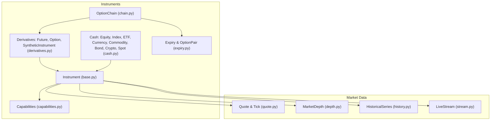
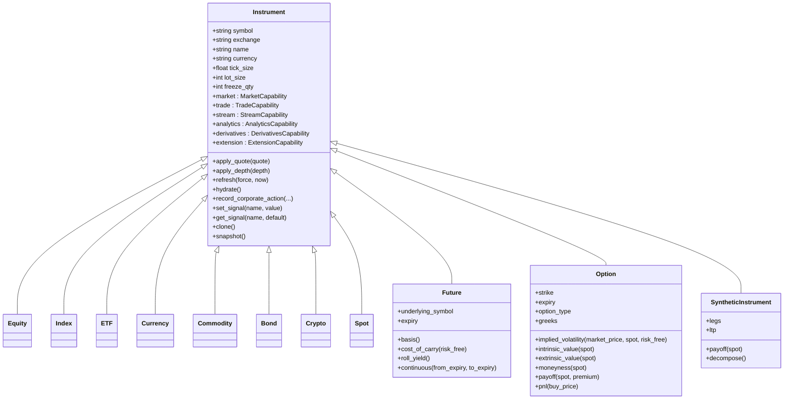
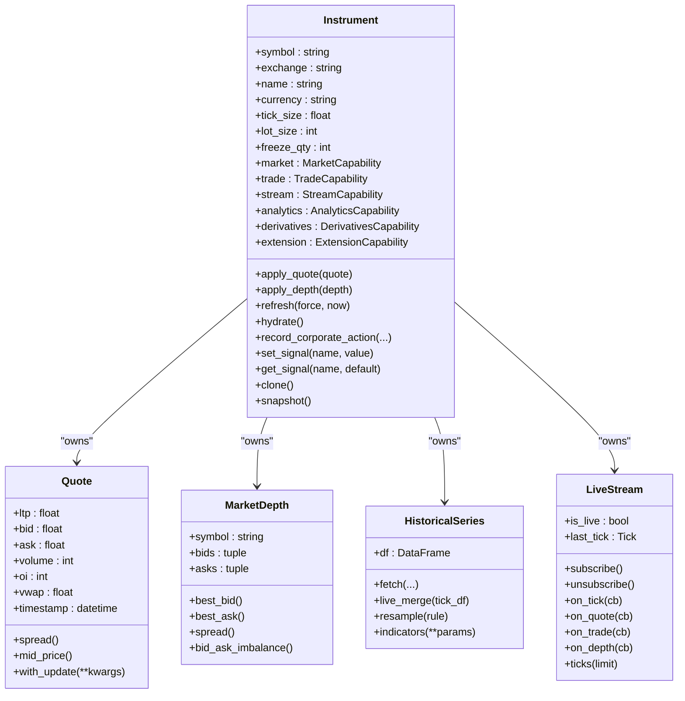
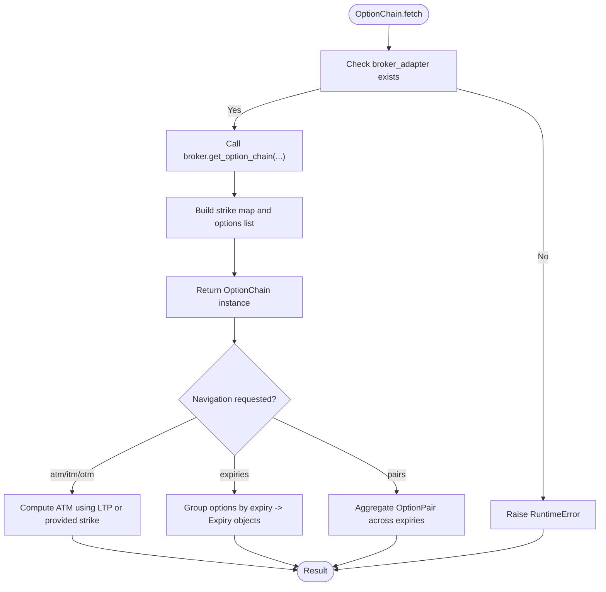
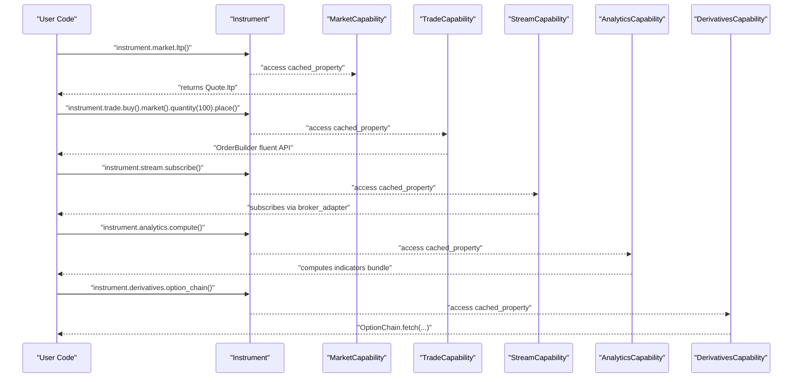
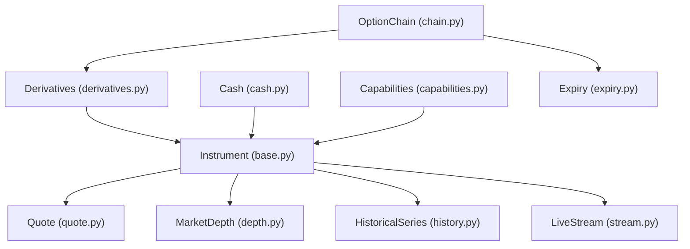

# Instruments

<cite>
**Referenced Files in This Document**
- [base.py](file://ntrade/domain/instruments/base.py)
- [cash.py](file://ntrade/domain/instruments/cash.py)
- [derivatives.py](file://ntrade/domain/instruments/derivatives.py)
- [capabilities.py](file://ntrade/domain/instruments/capabilities.py)
- [chain.py](file://ntrade/domain/instruments/chain.py)
- [expiry.py](file://ntrade/domain/instruments/expiry.py)
- [quote.py](file://ntrade/domain/market/quote.py)
- [depth.py](file://ntrade/domain/market/depth.py)
- [history.py](file://ntrade/domain/market/history.py)
- [stream.py](file://ntrade/domain/market/stream.py)
- [factories.py](file://ntrade/factories.py)
- [test_instruments.py](file://tests/test_instruments.py)
- [test_chain_navigation.py](file://tests/test_chain_navigation.py)
</cite>

## Table of Contents
1. [Introduction](#introduction)
2. [Project Structure](#project-structure)
3. [Core Components](#core-components)
4. [Architecture Overview](#architecture-overview)
5. [Detailed Component Analysis](#detailed-component-analysis)
6. [Dependency Analysis](#dependency-analysis)
7. [Performance Considerations](#performance-considerations)
8. [Troubleshooting Guide](#troubleshooting-guide)
9. [Conclusion](#conclusion)
10. [Appendices](#appendices)

## Introduction
This document provides a comprehensive data model for nTrade’s instrument hierarchy. It explains the base Instrument class and its state management (quote, depth, history, stream, indicators, signals, corporate actions), asset-specific implementations across cash and derivatives, the OptionChain composite pattern for options analytics, and the capability system that extends instrument functionality with market data, trading, streaming, analytics, derivatives, and provider extensions. It also includes field definitions, validation rules, business logic, relationships, and usage examples via factories and tests.

## Project Structure
The instrument domain is organized under ntrade/domain/instruments with supporting market data models under ntrade/domain/market. Factories and tests demonstrate creation and behavior.



**Diagram sources**
- [base.py](file://ntrade/domain/instruments/base.py)
- [cash.py](file://ntrade/domain/instruments/cash.py)
- [derivatives.py](file://ntrade/domain/instruments/derivatives.py)
- [capabilities.py](file://ntrade/domain/instruments/capabilities.py)
- [chain.py](file://ntrade/domain/instruments/chain.py)
- [expiry.py](file://ntrade/domain/instruments/expiry.py)
- [quote.py](file://ntrade/domain/market/quote.py)
- [depth.py](file://ntrade/domain/market/depth.py)
- [history.py](file://ntrade/domain/market/history.py)
- [stream.py](file://ntrade/domain/market/stream.py)

**Section sources**
- [base.py](file://ntrade/domain/instruments/base.py)
- [cash.py](file://ntrade/domain/instruments/cash.py)
- [derivatives.py](file://ntrade/domain/instruments/derivatives.py)
- [capabilities.py](file://ntrade/domain/instruments/capabilities.py)
- [chain.py](file://ntrade/domain/instruments/chain.py)
- [expiry.py](file://ntrade/domain/instruments/expiry.py)
- [quote.py](file://ntrade/domain/market/quote.py)
- [depth.py](file://ntrade/domain/market/depth.py)
- [history.py](file://ntrade/domain/market/history.py)
- [stream.py](file://ntrade/domain/market/stream.py)

## Core Components
- Instrument (base): Abstract root owning quote, depth, history, stream, indicators, signals, annotations, tags, metadata, session, market status, and corporate actions. Provides broker wiring, lifecycle methods (refresh, hydrate), and capability accessors.
- Asset classes (cash): Equity, Index, ETF, Currency, Commodity, Bond, Crypto, Spot extend Instrument with asset-specific defaults and properties.
- Derivatives (derivatives): Future, Option, SyntheticInstrument add derivative-specific fields and analytics (basis, cost-of-carry, roll yield, Greeks, implied vol, payoff/PnL).
- Capabilities (capabilities): MarketCapability, TradeCapability, StreamCapability, AnalyticsCapability, DerivativesCapability, ExtensionCapability provide focused views over Instrument state.
- Option chain (chain, expiry): OptionChain composes Option instruments, exposes expiries, strikes, ATM/ITM/OTM navigation, PCR, max pain, IV surface, and Greeks table; Expiry groups options by date with pair views and ITM/OTM selection.

Key responsibilities:
- State ownership remains on Instrument; capabilities are read-only or action-oriented views.
- Broker integration is lazy and optional; operations requiring a broker raise clear errors when absent.
- Immutability where appropriate (Quote, Tick, MarketDepth) to ensure safe event-driven updates.

**Section sources**
- [base.py](file://ntrade/domain/instruments/base.py)
- [cash.py](file://ntrade/domain/instruments/cash.py)
- [derivatives.py](file://ntrade/domain/instruments/derivatives.py)
- [capabilities.py](file://ntrade/domain/instruments/capabilities.py)
- [chain.py](file://ntrade/domain/instruments/chain.py)
- [expiry.py](file://ntrade/domain/instruments/expiry.py)

## Architecture Overview
The architecture centers on Instrument as a composition root. Each instrument owns its market state and delegates specialized behaviors to capability objects. Derivative instruments compose additional analytics and relationships. The OptionChain acts as a composite over Option instruments to support options analytics and navigation.



**Diagram sources**
- [base.py](file://ntrade/domain/instruments/base.py)
- [cash.py](file://ntrade/domain/instruments/cash.py)
- [derivatives.py](file://ntrade/domain/instruments/derivatives.py)

## Detailed Component Analysis

### Base Instrument and State Management
- Fields and state:
  - Identity: symbol, exchange, name, currency, tick_size, lot_size, freeze_qty.
  - Internal state: _quote (Quote), _depth (MarketDepth), _history (HistoricalSeries), _stream (LiveStream), _indicators (dict), _signals (dict), _annotations (dict), _tags (set), _metadata (dict), _subscription_state, _corporate_actions (list), _metadata_hydrated, _last_refresh_at, _session, _market_status.
- Lifecycle:
  - refresh(force, now): pulls latest quote and depth from broker if available; hydrates metadata once.
  - hydrate(): fetches tick size, lot size, freeze qty, circuit limits from broker adapter.
  - set_market_status(state): updates internal market status and session state.
- Corporate actions:
  - record_corporate_action(action_type, amount, ratio, ex_date, record_date, description).
  - corporate_actions property returns a copy of the list.
- Signals:
  - set_signal(name, value), get_signal(name, default), signals property returns a copy.
- Snapshotting and serialization:
  - snapshot() returns a dict with key fields including quote and session info.
  - serialize() mirrors snapshot().
- Cloning:
  - clone() creates an independent copy preserving identity and broker wiring.

Validation and error handling:
- Broker-dependent operations gracefully handle missing broker_adapter by returning early or raising explicit runtime errors in downstream components (e.g., history fetch).

**Section sources**
- [base.py](file://ntrade/domain/instruments/base.py)

### Cash Asset Classes
- Equity: KIND="equity", DEFAULT_EXCHANGE="NSE"; exposes market_cap via metadata.
- Index: KIND="index", DEFAULT_EXCHANGE="INDEX".
- ETF: KIND="etf", DEFAULT_EXCHANGE="NSE".
- Currency: KIND="currency", DEFAULT_EXCHANGE="BSE".
- Commodity: KIND="commodity", DEFAULT_EXCHANGE="MCX".
- Bond: KIND="bond", DEFAULT_EXCHANGE="BSE".
- Crypto: KIND="crypto", DEFAULT_EXCHANGE="CRYPTO".
- Spot: KIND="spot", DEFAULT_EXCHANGE="NSE".

These classes inherit all Instrument behavior and customize defaults per asset class.

**Section sources**
- [cash.py](file://ntrade/domain/instruments/cash.py)

### Derivative Instruments
- Future:
  - Fields: underlying_symbol, expiry, front_month, next_month, underlying (Instrument).
  - Methods: basis(), cost_of_carry(risk_free), rollover(new_expiry, broker), continuous(from_expiry, to_expiry), roll_yield().
  - Business logic: basis uses LTP difference; cost_of_carry annualizes based on days to expiry; roll_yield uses linked next-month contract prices.
- Option:
  - Fields: strike, expiry, option_type ("CE"/"PE"), underlying_symbol, exercise_style, settlement, iv, greeks.
  - Validation: option_type must be CE or PE; otherwise raises ValueError.
  - Analytics: greeks property ensures a non-null Greeks object; delta/gamma/theta/vega/rho accessors; intrinsic/extrinsic values; moneyness; Black-Scholes price; implied volatility; payoff and PnL.
- SyntheticInstrument:
  - Composition of legs (list[Instrument]); ltp aggregates leg prices; payoff sums leg payoffs; decompose returns legs.

**Section sources**
- [derivatives.py](file://ntrade/domain/instruments/derivatives.py)

### OptionChain Composite Pattern
- Construction:
  - OptionChain.fetch(underlying, expiry, num_strikes, **kw) retrieves chain via broker adapter; requires broker_adapter else raises RuntimeError.
- Navigation:
  - calls, puts lists; expiries() returns Expiry objects; expiry(offset) selects nearest/next; pairs() aggregates OptionPair across expiries.
  - at_strike(strike, option_type=None) O(1) lookup via prebuilt index; atm property resolves ATM option; itm/otm filter by moneyness.
- Analytics:
  - pcr() computes put-call ratio using OI; max_pain() finds strike minimizing total seller payout; iv_surface() builds IVSurface; greeks_table()/greeks() build GreeksTable.
- Lifecycle:
  - subscribe() subscribes all options; refresh() re-fetches chain.

Expiry and OptionPair:
- Expiry groups options by date; atm(offset) returns OptionPair; pair_at(strike) exact lookup; otm(n)/itm(n) return interleaved selections; pairs()/calls()/puts()/strikes() views.
- OptionPair provides straddle_premium, pcr, synthetic_long_price, synthetic_short_price.

**Section sources**
- [chain.py](file://ntrade/domain/instruments/chain.py)
- [expiry.py](file://ntrade/domain/instruments/expiry.py)

### Capability System
- MarketCapability:
  - Read-only view over _quote, _depth, _history; methods: quote(), history(), candles(), depth(), scalar accessors (ltp, bid, ask, volume, oi, vwap, prev_close, spread, mid_price), is_stale(max_age_seconds), refresh(), imbalance().
- TradeCapability:
  - Fluent order entry via OrderBuilder: buy()/sell() builders with market/limit/stop, quantity, price, trigger_price, product, target, stop_loss, place().
- StreamCapability:
  - Subscriptions: subscribe(), unsubscribe(); event handlers: on_tick/on_quote/on_trade/on_depth/on_disconnect; ticks(limit), candle_stream(), is_live, last_tick.
- AnalyticsCapability:
  - Indicators: rsi(period), atr(period); series analytics: supertrend, heikin_ashi, renko; statistics; compute(**params) bundles indicators; detect_breakout(lookback), detect_imbalance(), detect_absorption(threshold); indicators property.
- DerivativesCapability:
  - option_chain(expiry=0, num_strikes=10, **kw) returns OptionChain via broker adapter.
- ExtensionCapability:
  - extension(Cls) resolves provider-specific extensions through BrokerExtensionFacade using class-based names.

**Section sources**
- [capabilities.py](file://ntrade/domain/instruments/capabilities.py)

### Market Data Models
- Quote (immutable):
  - Fields: ltp, bid, ask, bid_qty, ask_qty, open, high, low, prev_close, volume, oi, vwap, avg_price, circuit_low, circuit_high, timestamp.
  - Derived: spread(), mid_price(), change(), change_pct(), with_update(**kwargs), is_stale(max_age_seconds, now), as_dict().
- Tick:
  - Fields: symbol, price, quantity, side, timestamp, kind; as_dict().
- MarketDepth:
  - DepthLevel(price, quantity, orders); MarketDepth(symbol, bids, asks, timestamp); best_bid(), best_ask(), spread(), depth(levels), bid_ask_imbalance().
- HistoricalSeries:
  - Wraps pandas DataFrame attached to Instrument; fetch(timeframe, days, start, end, force) with caching and timeframe-awareness; live_merge(tick_df), resample(rule), indicators(**params), to_df(), dataframe-like delegation.
- LiveStream:
  - Manages subscription lifecycle and events; ingest_tick(tick) updates instrument quote and emits events; is_live/is_subscribed states; on_* handlers; ticks(limit), live_ticks_df.

**Section sources**
- [quote.py](file://ntrade/domain/market/quote.py)
- [depth.py](file://ntrade/domain/market/depth.py)
- [history.py](file://ntrade/domain/market/history.py)
- [stream.py](file://ntrade/domain/market/stream.py)

### Creation and Usage Examples
- Creating instruments via factories:
  - InstrumentFactory.equity/index/etf/commodity/currency/spot with SymbolMaster caching.
  - OptionFactory.create for synthetic options without broker.
  - Futures and options created with underlying references and default symbols.
- Accessing capabilities:
  - instrument.market.ltp(), instrument.trade.buy().market().quantity(100).place(), instrument.stream.subscribe(), instrument.analytics.compute(), instrument.derivatives.option_chain().
- Handling corporate actions:
  - instrument.record_corporate_action("dividend", amount=..., ex_date=...).
- Type safety:
  - Option constructor validates option_type; historical fetch raises RuntimeError if no broker_adapter; OptionChain.fetch requires broker_adapter.

**Section sources**
- [factories.py](file://ntrade/factories.py)
- [test_instruments.py](file://tests/test_instruments.py)
- [test_chain_navigation.py](file://tests/test_chain_navigation.py)

## Architecture Overview
The following sequence diagram shows how a live tick flows through the system to update instrument state and emit events.

```mermaid
sequenceDiagram
participant Broker as "BrokerAdapter"
participant Stream as "LiveStream"
participant Inst as "Instrument"
participant Quote as "Quote"
Broker-->>Stream : "Tick(kind='trade', price, timestamp)"
Stream->>Stream : "ingest_tick(tick)"
Stream->>Inst : "_quote = _quote.with_update(ltp, timestamp)"
Stream-->>Stream : "_emit('tick', tick)"
Stream-->>Stream : "_emit('trade', tick)"
Note over Stream,Inst : "Callbacks invoked safely; errors do not break stream"
```

**Diagram sources**
- [stream.py](file://ntrade/domain/market/stream.py)
- [quote.py](file://ntrade/domain/market/quote.py)
- [base.py](file://ntrade/domain/instruments/base.py)

## Detailed Component Analysis

### Instrument Class Diagram


**Diagram sources**
- [base.py](file://ntrade/domain/instruments/base.py)
- [quote.py](file://ntrade/domain/market/quote.py)
- [depth.py](file://ntrade/domain/market/depth.py)
- [history.py](file://ntrade/domain/market/history.py)
- [stream.py](file://ntrade/domain/market/stream.py)

### OptionChain Flowchart


**Diagram sources**
- [chain.py](file://ntrade/domain/instruments/chain.py)

### Capability Access Sequence


**Diagram sources**
- [capabilities.py](file://ntrade/domain/instruments/capabilities.py)
- [base.py](file://ntrade/domain/instruments/base.py)

## Dependency Analysis
The instrument hierarchy exhibits clear separation between core state (Instrument) and specialized behaviors (capabilities, derivatives, chains). Dependencies are mostly one-directional:
- Instrument depends on market data models (Quote, MarketDepth, HistoricalSeries, LiveStream).
- Derivatives depend on Instrument and optionally on analytics modules (Greeks, BlackScholes).
- OptionChain depends on Option and Expiry structures.
- Capabilities are decoupled views over Instrument state.



**Diagram sources**
- [base.py](file://ntrade/domain/instruments/base.py)
- [cash.py](file://ntrade/domain/instruments/cash.py)
- [derivatives.py](file://ntrade/domain/instruments/derivatives.py)
- [capabilities.py](file://ntrade/domain/instruments/capabilities.py)
- [chain.py](file://ntrade/domain/instruments/chain.py)
- [expiry.py](file://ntrade/domain/instruments/expiry.py)
- [quote.py](file://ntrade/domain/market/quote.py)
- [depth.py](file://ntrade/domain/market/depth.py)
- [history.py](file://ntrade/domain/market/history.py)
- [stream.py](file://ntrade/domain/market/stream.py)

**Section sources**
- [base.py](file://ntrade/domain/instruments/base.py)
- [cash.py](file://ntrade/domain/instruments/cash.py)
- [derivatives.py](file://ntrade/domain/instruments/derivatives.py)
- [capabilities.py](file://ntrade/domain/instruments/capabilities.py)
- [chain.py](file://ntrade/domain/instruments/chain.py)
- [expiry.py](file://ntrade/domain/instruments/expiry.py)
- [quote.py](file://ntrade/domain/market/quote.py)
- [depth.py](file://ntrade/domain/market/depth.py)
- [history.py](file://ntrade/domain/market/history.py)
- [stream.py](file://ntrade/domain/market/stream.py)

## Performance Considerations
- Immutability of Quote, Tick, MarketDepth reduces copying overhead and ensures thread-safe event processing.
- HistoricalSeries caches per timeframe; switching timeframes forces re-fetch to avoid stale data.
- LiveStream buffers ticks with bounded deque to prevent memory growth.
- OptionChain builds strike maps for O(1) lookups; analytics computations are deferred until accessed.
- Capability objects are cached_properties on Instrument to avoid repeated instantiation.

## Troubleshooting Guide
Common issues and resolutions:
- No broker adapter:
  - History fetch and OptionChain.fetch raise RuntimeError when broker_adapter is None. Ensure a broker is wired during instrument creation or factory usage.
- Stale quotes:
  - Use market.is_stale(max_age_seconds) to detect outdated quotes; call refresh() to pull fresh data.
- Missing option type validation:
  - Option constructor enforces CE/PE; invalid types raise ValueError.
- Subscription state:
  - stream.is_live indicates active subscription; subscribe/unsubscribe transitions are managed via broker_adapter.
- Corporate actions:
  - record_corporate_action appends actions; use clear_corporate_actions() to reset.

**Section sources**
- [history.py](file://ntrade/domain/market/history.py)
- [chain.py](file://ntrade/domain/instruments/chain.py)
- [derivatives.py](file://ntrade/domain/instruments/derivatives.py)
- [stream.py](file://ntrade/domain/market/stream.py)
- [base.py](file://ntrade/domain/instruments/base.py)

## Conclusion
nTrade’s instrument hierarchy provides a robust, extensible foundation for market entities. Instrument centralizes state and lifecycle while capabilities offer focused interfaces for market data, trading, streaming, analytics, derivatives, and provider extensions. Asset-specific classes and derivatives enrich functionality with domain-specific analytics. The OptionChain composite pattern enables efficient options analytics and navigation. Clear validation, immutability, and lazy broker integration ensure reliability and performance.

## Appendices

### Field Definitions and Validation Rules
- Instrument fields: symbol, exchange, name, currency, tick_size, lot_size, freeze_qty; internal state includes quote, depth, history, stream, indicators, signals, annotations, tags, metadata, corporate actions, session, market status.
- Quote fields: ltp, bid, ask, bid_qty, ask_qty, open, high, low, prev_close, volume, oi, vwap, avg_price, circuit_low, circuit_high, timestamp; derived methods include spread, mid_price, change, change_pct, with_update, is_stale.
- MarketDepth fields: symbol, bids, asks, timestamp; methods include best_bid, best_ask, spread, depth, bid_ask_imbalance.
- Option fields: strike, expiry, option_type (validated CE/PE), underlying_symbol, exercise_style, settlement, iv, greeks; analytics include intrinsic/extrinsic, moneyness, Black-Scholes, implied vol, payoff, pnl.
- Future fields: underlying_symbol, expiry, front_month, next_month, underlying; methods include basis, cost_of_carry, roll_yield, continuous.

**Section sources**
- [base.py](file://ntrade/domain/instruments/base.py)
- [quote.py](file://ntrade/domain/market/quote.py)
- [depth.py](file://ntrade/domain/market/depth.py)
- [derivatives.py](file://ntrade/domain/instruments/derivatives.py)

### Example Usage Patterns
- Create instruments via factories:
  - equity, index, etf, commodity, currency, spot with SymbolMaster caching.
  - OptionFactory.create for synthetic options without broker.
- Access capabilities:
  - instrument.market.ltp(), instrument.trade.buy().market().quantity(100).place(), instrument.stream.subscribe(), instrument.analytics.compute(), instrument.derivatives.option_chain().
- Handle corporate actions:
  - instrument.record_corporate_action("dividend", amount=..., ex_date=...).
- Validate option type:
  - Option constructor raises ValueError for invalid option_type.

**Section sources**
- [factories.py](file://ntrade/factories.py)
- [test_instruments.py](file://tests/test_instruments.py)
- [test_chain_navigation.py](file://tests/test_chain_navigation.py)