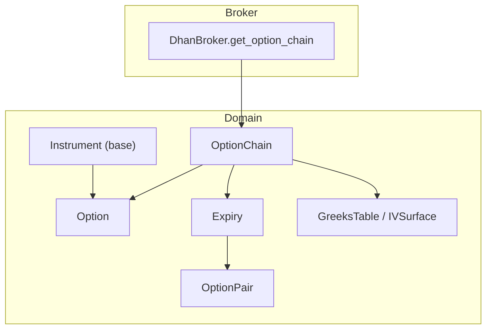
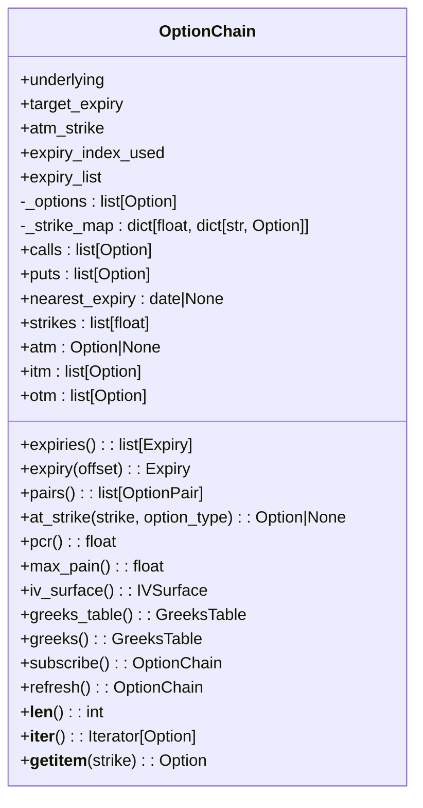
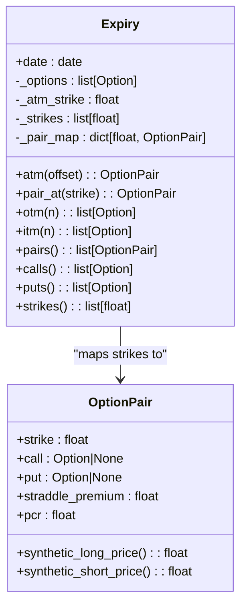
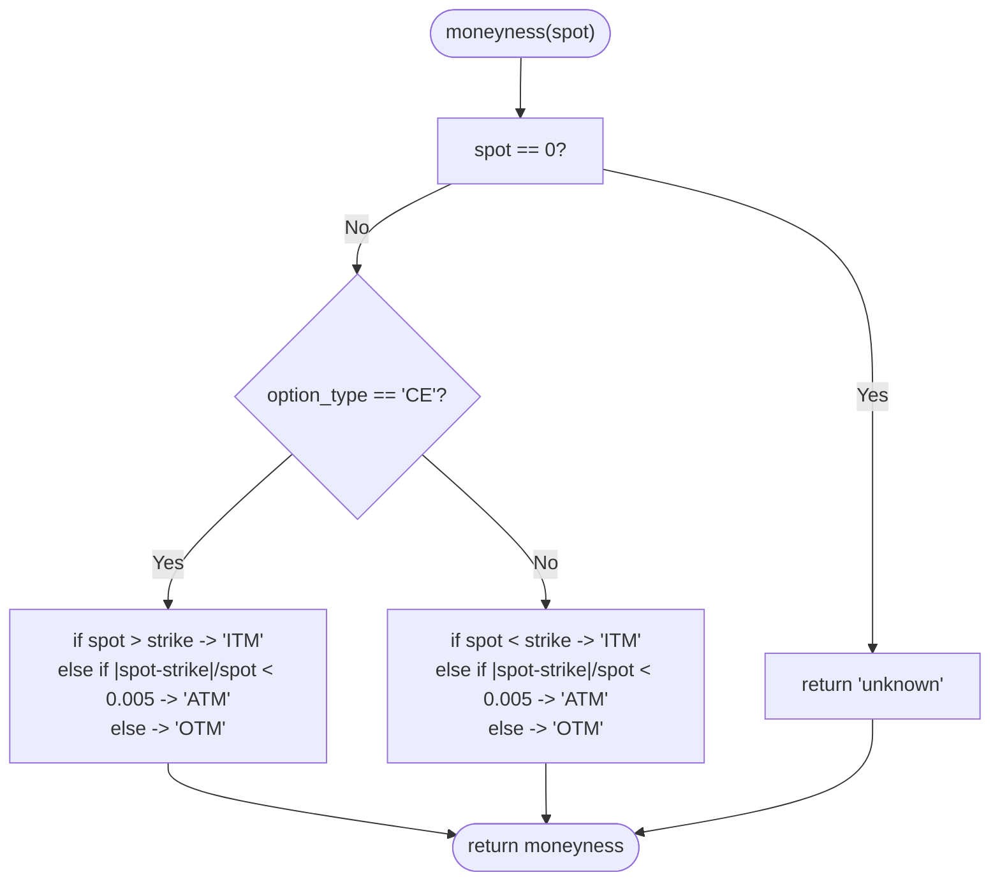
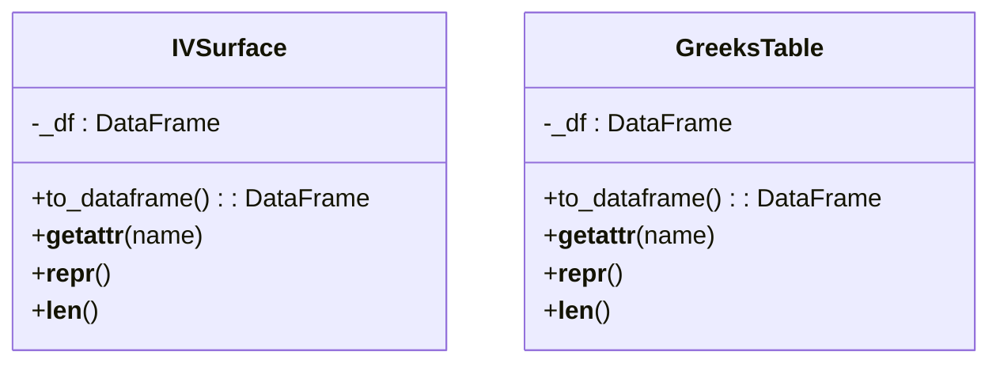
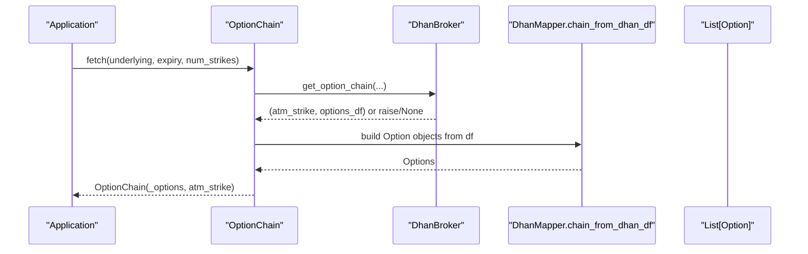
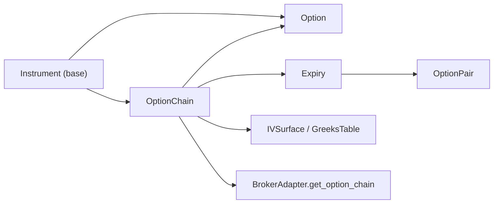

# Option Chains

<cite>
**Referenced Files in This Document**
- [chain.py](file://ntrade/domain/instruments/chain.py)
- [expiry.py](file://ntrade/domain/instruments/expiry.py)
- [derivatives.py](file://ntrade/domain/instruments/derivatives.py)
- [greeks.py](file://ntrade/domain/analytics/greeks.py)
- [surface.py](file://ntrade/domain/analytics/surface.py)
- [base.py](file://ntrade/domain/instruments/base.py)
- [cash.py](file://ntrade/domain/instruments/cash.py)
- [dhan.py](file://ntrade/brokers/dhan.py)
- [test_chain_navigation.py](file://tests/test_chain_navigation.py)
</cite>

## Table of Contents
1. [Introduction](#introduction)
2. [Project Structure](#project-structure)
3. [Core Components](#core-components)
4. [Architecture Overview](#architecture-overview)
5. [Detailed Component Analysis](#detailed-component-analysis)
6. [Dependency Analysis](#dependency-analysis)
7. [Performance Considerations](#performance-considerations)
8. [Troubleshooting Guide](#troubleshooting-guide)
9. [Conclusion](#conclusion)

## Introduction
This document explains the OptionChain composite pattern used to manage option series for a given underlying symbol and expiry date. It covers chain navigation methods (atm, itm, otm, expiries), how chains aggregate multiple option contracts, filtering by strike ranges and option types, and chain-wide analytics such as PCR, max pain, IV surface, and Greeks tables. It also includes practical examples of building chains from underlying instruments, navigating structures, performing chain-wide operations, and considerations for performance and memory management on large option chains.

## Project Structure
The OptionChain implementation spans domain models for instruments and analytics, with broker adapters providing live data:
- OptionChain aggregates Option instances and exposes views and analytics.
- Expiry groups options by expiration and provides ATM/ITM/OTM selection per expiry.
- Option represents individual call/put contracts with moneyness and pricing helpers.
- Analytics provide Greeks computation and tabular surfaces.
- Broker adapter fetches and normalizes option chain data.



**Diagram sources**
- [chain.py:19-104](file://ntrade/domain/instruments/chain.py#L19-L104)
- [expiry.py:18-82](file://ntrade/domain/instruments/expiry.py#L18-L82)
- [derivatives.py:109-199](file://ntrade/domain/instruments/derivatives.py#L109-L199)
- [surface.py:19-85](file://ntrade/domain/analytics/surface.py#L19-L85)
- [dhan.py:259-330](file://ntrade/brokers/dhan.py#L259-L330)

**Section sources**
- [chain.py:19-104](file://ntrade/domain/instruments/chain.py#L19-L104)
- [expiry.py:18-82](file://ntrade/domain/instruments/expiry.py#L18-L82)
- [derivatives.py:109-199](file://ntrade/domain/instruments/derivatives.py#L109-L199)
- [surface.py:19-85](file://ntrade/domain/analytics/surface.py#L19-L85)
- [dhan.py:259-330](file://ntrade/brokers/dhan.py#L259-L330)

## Core Components
- OptionChain: Composite container of Option instruments for an underlying; provides calls/puts lists, expiries(), expiry(offset), atm, itm, otm, at_strike(strike, type), strikes, pcr(), max_pain(), iv_surface(), greeks_table(), subscribe(), refresh().
- Expiry: All options sharing one expiry; provides atm(offset), pair_at(strike), otm(n), itm(n), pairs(), calls(), puts(), strikes().
- Option: Individual contract with strike, expiry, type; supports moneyness(spot), intrinsic/extrinsic value, Black-Scholes price/IV, Greeks accessors.
- Greeks and IVSurface/GreeksTable: Pure math engine and typed DataFrame wrappers for analytics.

Key responsibilities:
- Aggregation and indexing for O(1) strike lookups.
- Navigation across expiries and strikes.
- Chain-level analytics (PCR, max pain, IV surface, Greeks table).
- Subscription and refresh lifecycle.

**Section sources**
- [chain.py:19-202](file://ntrade/domain/instruments/chain.py#L19-L202)
- [expiry.py:18-171](file://ntrade/domain/instruments/expiry.py#L18-L171)
- [derivatives.py:109-224](file://ntrade/domain/instruments/derivatives.py#L109-L224)
- [greeks.py:13-120](file://ntrade/domain/analytics/greeks.py#L13-L120)
- [surface.py:19-85](file://ntrade/domain/analytics/surface.py#L19-L85)

## Architecture Overview
OptionChain is built via broker adapters that return normalized Option objects grouped by underlying and expiry. The chain indexes strikes for fast lookup and builds Expiry objects per unique expiry date. Users navigate using high-level APIs without dealing with raw data frames.

```mermaid
sequenceDiagram
participant App as "Application"
participant Inst as "Underlying Instrument"
participant Broker as "DhanBroker"
participant Chain as "OptionChain"
participant Exp as "Expiry"
participant Opt as "Option"
App->>Inst : Create Index("NIFTY")
App->>Chain : OptionChain.fetch(underlying, expiry=0, num_strikes=...)
Chain->>Broker : get_option_chain(underlying, expiry, num_strikes)
Broker-->>Chain : (atm_strike, options_df)
Chain->>Chain : Build _options, _strike_map, set atm_strike
App->>Chain : chain.expiries()
Chain-->>App : [Expiry(date, options, spot)]
App->>Exp : exp.atm(offset=0)
Exp-->>App : OptionPair(call, put)
App->>Opt : opt.moneyness(spot)
Opt-->>App : "ITM"/"ATM"/"OTM"
```

**Diagram sources**
- [chain.py:56-62](file://ntrade/domain/instruments/chain.py#L56-L62)
- [dhan.py:259-330](file://ntrade/brokers/dhan.py#L259-L330)
- [expiry.py:71-82](file://ntrade/domain/instruments/expiry.py#L71-L82)
- [derivatives.py:192-199](file://ntrade/domain/instruments/derivatives.py#L192-L199)

## Detailed Component Analysis

### OptionChain Class
Responsibilities:
- Construction with underlying instrument, list of Option instances, optional atm_strike, and optional prebuilt DataFrame.
- Maintains internal index _strike_map for O(1) retrieval by strike and option type.
- Provides views: calls, puts, expiries(), expiry(offset), pairs(), nearest_expiry, strikes.
- Navigation: atm (nearest to LTP or explicit atm_strike), itm, otm based on moneyness.
- Analytics: pcr(), max_pain(), iv_surface(), greeks_table()/greeks().
- Lifecycle: subscribe() subscribes all options, refresh() re-fetches via broker.
- Container protocol: __len__, __iter__, __getitem__ by strike.



**Diagram sources**
- [chain.py:19-202](file://ntrade/domain/instruments/chain.py#L19-L202)

**Section sources**
- [chain.py:19-202](file://ntrade/domain/instruments/chain.py#L19-L202)

### Expiry and OptionPair
Responsibilities:
- Expiry groups options by a single expiry date, computes sorted strikes, and maps strike to OptionPair.
- atm(offset) returns the OptionPair nearest to ATM with optional offset.
- pair_at(strike) returns exact strike pair or raises KeyError.
- otm(n) and itm(n) return interleaved top-n OTM/ITM options around ATM.
- OptionPair provides straddle premium, PCR, synthetic long/short prices.



**Diagram sources**
- [expiry.py:18-82](file://ntrade/domain/instruments/expiry.py#L18-L82)
- [expiry.py:83-149](file://ntrade/domain/instruments/expiry.py#L83-L149)

**Section sources**
- [expiry.py:18-171](file://ntrade/domain/instruments/expiry.py#L18-L171)

### Option and Moneyness
Responsibilities:
- Stores strike, expiry, option_type ("CE"/"PE"), underlying_symbol, exercise_style, settlement.
- Provides Greeks accessor (returns zero-filled if not computed), intrinsic/extrinsic values, moneyness classification, Black-Scholes price and implied volatility, payoff and PnL helpers.



**Diagram sources**
- [derivatives.py:192-199](file://ntrade/domain/instruments/derivatives.py#L192-L199)

**Section sources**
- [derivatives.py:109-224](file://ntrade/domain/instruments/derivatives.py#L109-L224)

### Analytics Surfaces
- IVSurface wraps a DataFrame with columns strike, expiry, type, iv; delegates DataFrame methods while exposing a domain-typed API.
- GreeksTable wraps a DataFrame with columns strike, type, delta, gamma, theta, vega, iv; same delegation pattern.



**Diagram sources**
- [surface.py:19-85](file://ntrade/domain/analytics/surface.py#L19-L85)

**Section sources**
- [surface.py:19-85](file://ntrade/domain/analytics/surface.py#L19-L85)

### Broker Integration and Chain Building
- OptionChain.fetch delegates to the underlying’s broker_adapter.get_option_chain.
- DhanBroker.get_option_chain handles transient failures and fallbacks across expiries, returning (atm_strike, options_df).
- PaperBroker.get_option_chain provides test-friendly behavior.



**Diagram sources**
- [chain.py:56-62](file://ntrade/domain/instruments/chain.py#L56-L62)
- [dhan.py:259-330](file://ntrade/brokers/dhan.py#L259-L330)

**Section sources**
- [chain.py:56-62](file://ntrade/domain/instruments/chain.py#L56-L62)
- [dhan.py:259-330](file://ntrade/brokers/dhan.py#L259-L330)

## Dependency Analysis
- OptionChain depends on Option, Expiry, IVSurface, GreeksTable, and the underlying Instrument’s broker adapter.
- Expiry depends on Option and OptionPair.
- Option depends on Instrument base and the Greeks engine.
- Broker integration is isolated behind BrokerAdapter; DhanBroker implements provider-specific logic.



**Diagram sources**
- [base.py:50-152](file://ntrade/domain/instruments/base.py#L50-L152)
- [chain.py:19-104](file://ntrade/domain/instruments/chain.py#L19-L104)
- [expiry.py:18-82](file://ntrade/domain/instruments/expiry.py#L18-L82)
- [derivatives.py:109-199](file://ntrade/domain/instruments/derivatives.py#L109-L199)

**Section sources**
- [base.py:50-152](file://ntrade/domain/instruments/base.py#L50-L152)
- [chain.py:19-104](file://ntrade/domain/instruments/chain.py#L19-L104)
- [expiry.py:18-82](file://ntrade/domain/instruments/expiry.py#L18-L82)
- [derivatives.py:109-199](file://ntrade/domain/instruments/derivatives.py#L109-L199)

## Performance Considerations
- Strike lookup: OptionChain uses a pre-built _strike_map for O(1) retrieval by strike and option type.
- ATM selection: When no explicit atm_strike is provided, atm scans calls/options to find nearest strike to LTP; this is O(k) where k is number of calls/options considered.
- ITM/OTM filters: Chain-level itm/otm iterate over all options once; complexity O(n). For large chains, consider caching results or limiting n.
- Expiries grouping: expiries() groups by unique dates and constructs Expiry objects; complexity O(n).
- Analytics:
  - pcr() sums open interest across calls/puts: O(n).
  - max_pain() iterates strikes and options: O(n*s) where s is number of strikes.
  - iv_surface() and greeks_table() construct DataFrames from options; O(n).
- Memory:
  - Each Option holds quote, indicators, stream, and metadata; avoid retaining unnecessary references.
  - Use chain.subscribe() only when streaming is needed; otherwise keep chains read-only.
  - Prefer iterating over filtered views (calls/puts) rather than duplicating lists.
- Broker fallbacks: DhanBroker may retry across expiries; ensure you handle exceptions and empty frames gracefully.

[No sources needed since this section provides general guidance]

## Troubleshooting Guide
Common issues and resolutions:
- No broker adapter: OptionChain.fetch raises when the underlying has no broker adapter. Ensure the underlying Instrument is created with a valid broker.
- Empty chain frame: If the broker returns an empty DataFrame, the adapter should reject it and trigger fallback or raise an error. Validate inputs and network conditions.
- Missing expiries: Calling chain.expiry(offset) on an empty chain raises ValueError. Verify chain construction and data availability.
- Key errors on pair_at: Expiry.pair_at(strike) raises KeyError if strike is absent. Confirm strike exists in the chain.
- ATM resolution: If LTP is missing, atm falls back to atm_strike or None. Provide atm_strike explicitly when constructing the chain for deterministic behavior.
- Greeks not computed: Option.greeks returns a zero-filled object if not set. Use set_greeks or compute via analytics engines before reading Greeks fields.

**Section sources**
- [chain.py:56-62](file://ntrade/domain/instruments/chain.py#L56-L62)
- [chain.py:83-90](file://ntrade/domain/instruments/chain.py#L83-L90)
- [expiry.py:77-82](file://ntrade/domain/instruments/expiry.py#L77-L82)
- [derivatives.py:149-161](file://ntrade/domain/instruments/derivatives.py#L149-L161)

## Conclusion
The OptionChain composite pattern provides a robust, navigable structure for managing option series across expiries and strikes. With O(1) strike lookups, clear navigation methods (atm, itm, otm, expiries), and rich analytics (PCR, max pain, IV surface, Greeks tables), it enables efficient chain-wide operations. Proper use of broker adapters ensures resilience against transient failures and missing data. For large chains, leverage indexed lookups, limit iterative scans, and manage subscriptions carefully to optimize performance and memory usage.

[No sources needed since this section summarizes without analyzing specific files]