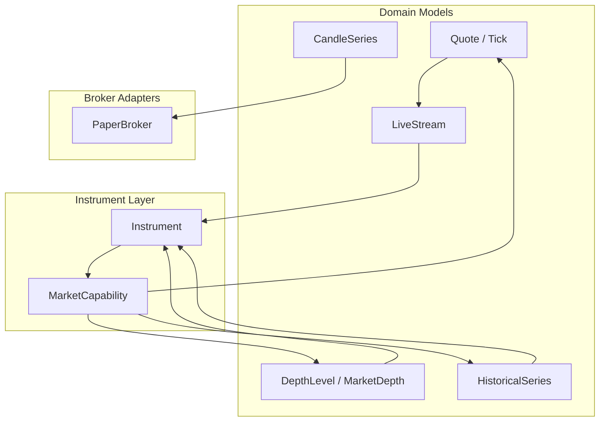
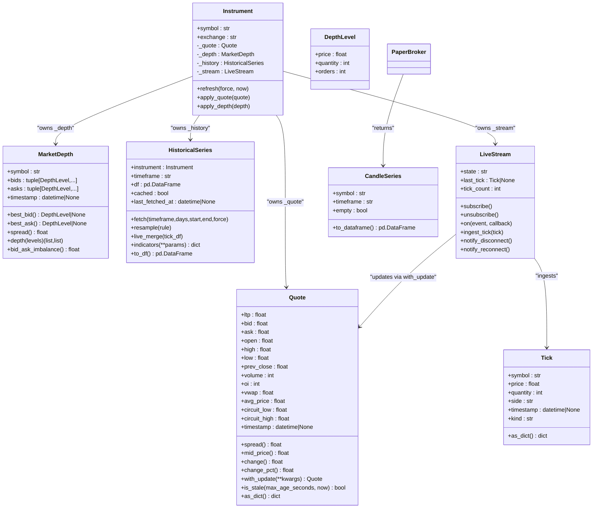
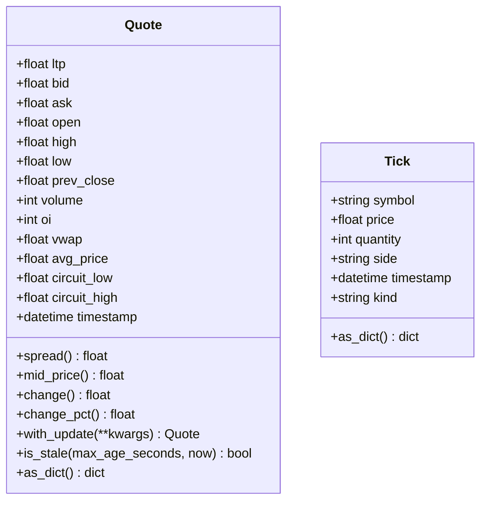
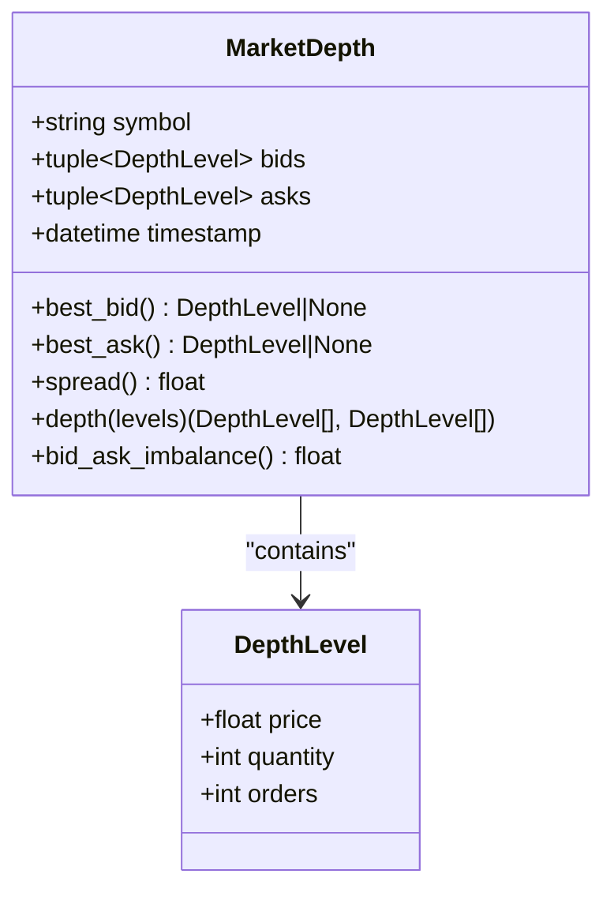
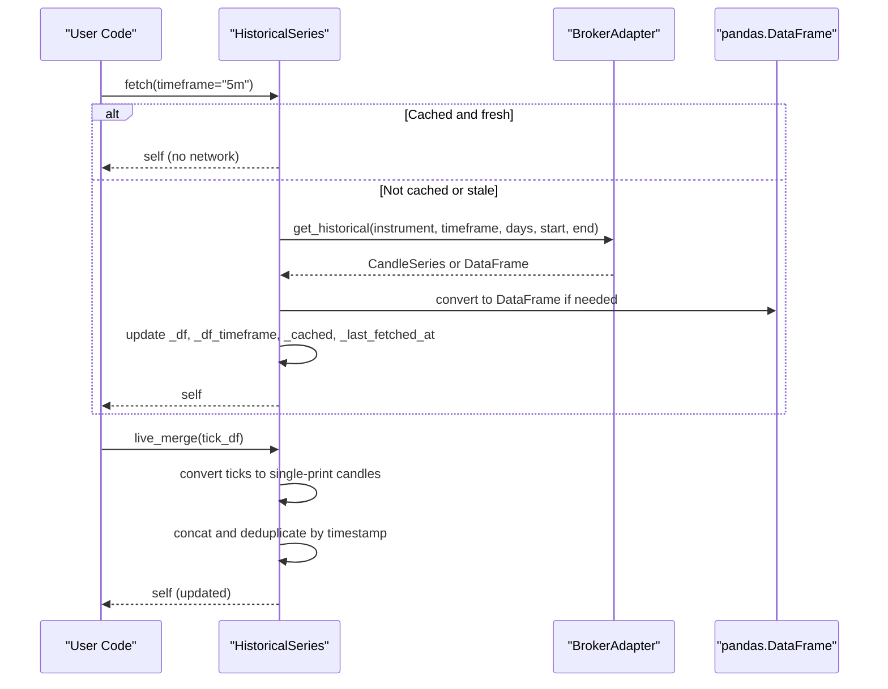
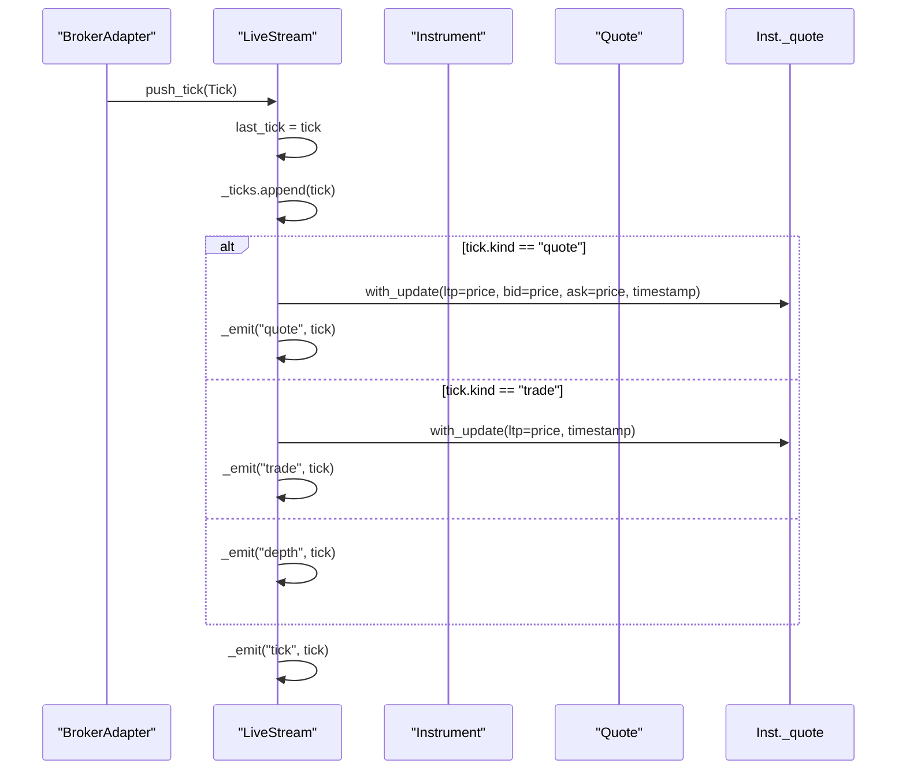
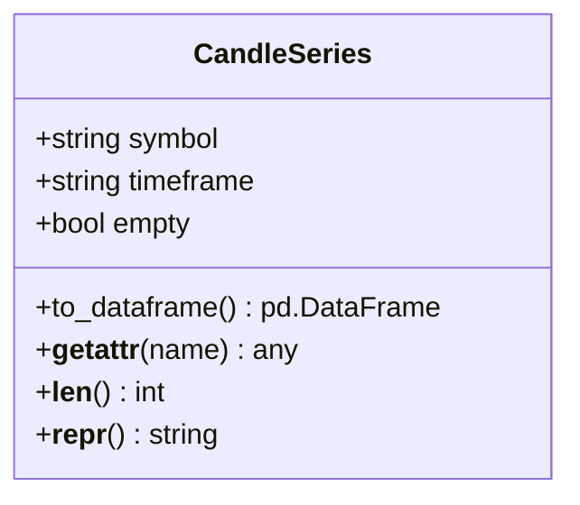
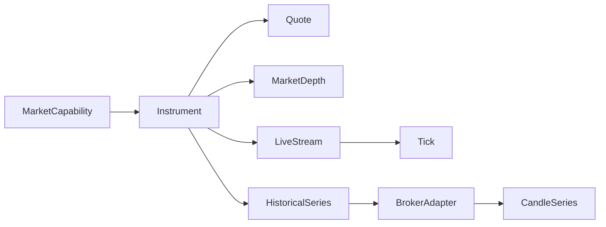

# Market Data

<cite>
**Referenced Files in This Document**
- [quote.py](file://ntrade/domain/market/quote.py)
- [depth.py](file://ntrade/domain/market/depth.py)
- [history.py](file://ntrade/domain/market/history.py)
- [stream.py](file://ntrade/domain/market/stream.py)
- [candles.py](file://ntrade/domain/market/candles.py)
- [base.py](file://ntrade/domain/instruments/base.py)
- [capabilities.py](file://ntrade/domain/instruments/capabilities.py)
- [paper.py](file://ntrade/brokers/paper.py)
- [test_quote.py](file://tests/test_quote.py)
- [test_candle_series.py](file://tests/test_candle_series.py)
- [test_history_stream.py](file://tests/test_history_stream.py)
</cite>

## Table of Contents
1. [Introduction](#introduction)
2. [Project Structure](#project-structure)
3. [Core Components](#core-components)
4. [Architecture Overview](#architecture-overview)
5. [Detailed Component Analysis](#detailed-component-analysis)
6. [Dependency Analysis](#dependency-analysis)
7. [Performance Considerations](#performance-considerations)
8. [Troubleshooting Guide](#troubleshooting-guide)
9. [Conclusion](#conclusion)
10. [Appendices](#appendices)

## Introduction
This document provides comprehensive data model documentation for nTrade’s market data structures. It focuses on the Quote, MarketDepth, HistoricalSeries, LiveStream, and CandleSeries classes that underpin real-time quotes, order book snapshots, historical time-series, live streaming, and candle aggregation. The goal is to explain field definitions, data types, validation rules, business logic, and usage patterns with examples drawn from tests and broker adapters.

## Project Structure
The market data domain lives under ntrade/domain/market and integrates with instruments and brokers:
- Domain models: Quote, Tick, DepthLevel, MarketDepth, HistoricalSeries, LiveStream, CandleSeries
- Instrument integration: Instrument owns instances of these models and exposes capabilities
- Broker adapters: Provide depth and historical data as domain-typed objects (CandleSeries)

**Diagram sources**
- [quote.py:1-91](file://ntrade/domain/market/quote.py#L1-L91)
- [depth.py:1-49](file://ntrade/domain/market/depth.py#L1-L49)
- [history.py:1-149](file://ntrade/domain/market/history.py#L1-L149)
- [stream.py:1-131](file://ntrade/domain/market/stream.py#L1-L131)
- [candles.py:1-67](file://ntrade/domain/market/candles.py#L1-L67)
- [base.py:50-94](file://ntrade/domain/instruments/base.py#L50-L94)
- [capabilities.py:37-87](file://ntrade/domain/instruments/capabilities.py#L37-L87)
- [paper.py:72-87](file://ntrade/brokers/paper.py#L72-L87)

**Section sources**
- [base.py:50-94](file://ntrade/domain/instruments/base.py#L50-L94)
- [capabilities.py:37-87](file://ntrade/domain/instruments/capabilities.py#L37-L87)

## Core Components
- Quote: Immutable point-in-time quote value object with derived metrics and staleness checks.
- Tick: Immutable single tick event used by LiveStream ingestion.
- MarketDepth: Immutable order book snapshot with bid/ask levels and spread/imbalance utilities.
- HistoricalSeries: DataFrame-like wrapper around OHLCV candles with fetch, cache, resample, and live merge.
- LiveStream: Subscription lifecycle manager with event handling and bounded tick buffer.
- CandleSeries: Domain-typed wrapper around OHLCV DataFrame returned by brokers.

Key responsibilities:
- Immutability for value objects (Quote, Tick, DepthLevel, MarketDepth).
- Event-driven updates via LiveStream.
- Time-series management and caching via HistoricalSeries.
- Type-safe broker interop via CandleSeries.

**Section sources**
- [quote.py:1-91](file://ntrade/domain/market/quote.py#L1-L91)
- [depth.py:1-49](file://ntrade/domain/market/depth.py#L1-L49)
- [history.py:1-149](file://ntrade/domain/market/history.py#L1-L149)
- [stream.py:1-131](file://ntrade/domain/market/stream.py#L1-L131)
- [candles.py:1-67](file://ntrade/domain/market/candles.py#L1-L67)

## Architecture Overview
The Instrument owns core market data state and capabilities:
- _quote: Quote instance updated by stream ingestion or refresh
- _depth: MarketDepth snapshot refreshed via broker
- _history: HistoricalSeries attached to instrument for OHLCV
- _stream: LiveStream managing subscriptions and events

**Diagram sources**
- [base.py:50-94](file://ntrade/domain/instruments/base.py#L50-L94)
- [quote.py:1-91](file://ntrade/domain/market/quote.py#L1-L91)
- [depth.py:1-49](file://ntrade/domain/market/depth.py#L1-L49)
- [history.py:1-149](file://ntrade/domain/market/history.py#L1-L149)
- [stream.py:1-131](file://ntrade/domain/market/stream.py#L1-L131)
- [candles.py:1-67](file://ntrade/domain/market/candles.py#L1-L67)
- [paper.py:72-87](file://ntrade/brokers/paper.py#L72-L87)

## Detailed Component Analysis

### Quote and Tick
- Quote fields include ltp, bid, ask, open, high, low, prev_close, volume, oi, vwap, avg_price, circuit_low, circuit_high, timestamp. All are immutable due to frozen dataclass.
- Derived methods:
  - spread(): ask - bid when both present; else 0.0
  - mid_price(): average of bid/ask if available; otherwise ltp
  - change(): ltp - prev_close
  - change_pct(): percentage change relative to prev_close
  - with_update(**kwargs): returns a new Quote with specified fields changed (immutability preserved)
  - is_stale(max_age_seconds, now): compares timestamp to current time
  - as_dict(): serializes key fields including timestamp ISO string
- Tick fields include symbol, price, quantity, side, timestamp, kind ("trade", "quote", "depth"). Used by LiveStream ingestion.

Validation and business logic:
- Spread and mid_price guard against missing bid/ask.
- Change calculations guard against zero prev_close.
- Staleness check handles None timestamps.

Examples:
- Creating an empty Quote and verifying defaults.
- Updating Quote immutably and asserting original unchanged.
- Checking staleness with explicit now parameter.

**Section sources**
- [quote.py:1-91](file://ntrade/domain/market/quote.py#L1-L91)
- [test_quote.py:1-66](file://tests/test_quote.py#L1-L66)

#### Class Diagram: Quote and Tick

**Diagram sources**
- [quote.py:1-91](file://ntrade/domain/market/quote.py#L1-L91)

### MarketDepth and DepthLevel
- DepthLevel: price, quantity, orders (optional).
- MarketDepth: symbol, bids tuple, asks tuple, timestamp.
- Methods:
  - best_bid(), best_ask(): return top level or None
  - spread(): difference between best ask and best bid
  - depth(levels): returns lists of top N levels
  - bid_ask_imbalance(): normalized imbalance metric across all levels

Validation and business logic:
- Spread returns 0.0 when best levels missing.
- Imbalance handles zero total quantity gracefully.

Examples:
- PaperBroker constructs MarketDepth using LTP-based offsets and random quantities.

**Section sources**
- [depth.py:1-49](file://ntrade/domain/market/depth.py#L1-L49)
- [paper.py:72-87](file://ntrade/brokers/paper.py#L72-L87)

#### Class Diagram: MarketDepth

**Diagram sources**
- [depth.py:1-49](file://ntrade/domain/market/depth.py#L1-L49)

### HistoricalSeries
- Wraps a pandas DataFrame of OHLCV candles and remains attached to an Instrument.
- Properties: df, cached, last_fetched_at, timeframe.
- Fetch lifecycle:
  - fetch(timeframe, days, start, end, force): lazy, cached download through broker adapter; validates timeframe consistency and freshness.
  - __call__(): callable form to fetch.
  - refresh(), download(): force fresh downloads.
- Data manipulation:
  - live_merge(tick_df=None): merges live ticks into candles safely, preserving schema.
  - resample(rule): resamples to coarser timeframe with proper OHLCV aggregation.
  - indicators(**params): computes indicator bundle over series.
  - to_df(): returns copy of underlying DataFrame.
- Pandas-like access: __len__, __getitem__, __getattr__ delegation.

Validation and business logic:
- Cache validity depends on timeframe match and freshness window.
- live_merge converts raw ticks to single-print candles and deduplicates by timestamp.
- resample aggregates columns appropriately (first open, max high, min low, last close, sum volume/oi).

Examples:
- Fetching history via instrument._history.fetch and checking cached/fresh states.
- Resampling to coarser timeframe and verifying columns.
- Merging live ticks and ensuring no leakage of non-OHLCV columns.

**Section sources**
- [history.py:1-149](file://ntrade/domain/market/history.py#L1-L149)
- [test_history_stream.py:1-126](file://tests/test_history_stream.py#L1-L126)

#### Sequence Diagram: HistoricalSeries Fetch and Merge

**Diagram sources**
- [history.py:52-124](file://ntrade/domain/market/history.py#L52-L124)

### LiveStream
- Manages subscription lifecycle and event handling per instrument.
- State machine: NOT_SUBSCRIBED -> SUBSCRIBED -> STREAMING.
- Bounded tick buffer: deque(maxlen=10_000) ensures memory safety.
- Events: tick, quote, trade, depth, disconnect, reconnect.
- Methods:
  - subscribe(), unsubscribe(): interact with broker adapter.
  - on(event, callback), on_tick, on_quote, on_trade, on_depth, on_disconnect, on_reconnect: register handlers.
  - ingest_tick(tick): updates last_tick, appends to buffer, updates instrument quote based on tick kind, emits events.
  - notify_disconnect(), notify_reconnect(): update state and emit events.
  - live_ticks_df: property returning DataFrame of recent ticks.

Validation and business logic:
- Unknown events raise ValueError.
- Callback exceptions are swallowed to avoid killing the stream.
- Quote updates use with_update to preserve immutability.

Examples:
- Subscribing and unsubscribing, verifying is_live and state transitions.
- Registering handlers and verifying tick counts and DataFrame output.
- Ingesting depth ticks and emitting depth events.

**Section sources**
- [stream.py:1-131](file://ntrade/domain/market/stream.py#L1-L131)
- [test_history_stream.py:72-126](file://tests/test_history_stream.py#L72-L126)

#### Sequence Diagram: LiveStream Ingestion

**Diagram sources**
- [stream.py:106-123](file://ntrade/domain/market/stream.py#L106-L123)

### CandleSeries
- Domain-typed wrapper around OHLCV DataFrame returned by brokers.
- Properties: symbol, timeframe, empty.
- Methods:
  - to_dataframe(): escape hatch to underlying DataFrame.
  - __getattr__ delegation allows DataFrame methods while enforcing domain API.
- Validation:
  - Raises AttributeError for unknown attributes not present in DataFrame.

Examples:
- Creating CandleSeries from sample DataFrame and verifying properties.
- Delegating DataFrame methods like .columns, .iloc, .head.
- Ensuring backward compatibility where DataFrame was previously returned.

**Section sources**
- [candles.py:1-67](file://ntrade/domain/market/candles.py#L1-L67)
- [test_candle_series.py:1-98](file://tests/test_candle_series.py#L1-L98)

#### Class Diagram: CandleSeries

**Diagram sources**
- [candles.py:1-67](file://ntrade/domain/market/candles.py#L1-L67)

## Dependency Analysis
- Instrument owns Quote, MarketDepth, HistoricalSeries, LiveStream.
- LiveStream ingests Tick and updates Quote immutably.
- HistoricalSeries interacts with BrokerAdapter for fetching and uses pandas for data manipulation.
- CandleSeries wraps DataFrame and is returned by BrokerAdapter.get_historical.
- MarketCapability exposes read-only views of instrument state.

**Diagram sources**
- [base.py:50-94](file://ntrade/domain/instruments/base.py#L50-L94)
- [capabilities.py:37-87](file://ntrade/domain/instruments/capabilities.py#L37-L87)
- [paper.py:72-87](file://ntrade/brokers/paper.py#L72-L87)

**Section sources**
- [base.py:50-94](file://ntrade/domain/instruments/base.py#L50-L94)
- [capabilities.py:37-87](file://ntrade/domain/instruments/capabilities.py#L37-L87)
- [paper.py:72-87](file://ntrade/brokers/paper.py#L72-L87)

## Performance Considerations
- Immutability: Quote, Tick, DepthLevel, MarketDepth are frozen dataclasses, preventing accidental mutation and enabling safe sharing.
- Bounded buffers: LiveStream uses deque(maxlen=10_000) to cap memory usage during high-frequency streaming.
- Caching: HistoricalSeries caches fetched data with timeframe-aware validity and freshness checks to minimize redundant network calls.
- Efficient merging: live_merge converts ticks to single-print candles and deduplicates by timestamp to maintain schema integrity.
- DataFrame delegation: CandleSeries delegates attribute access to underlying DataFrame, avoiding unnecessary copies while maintaining type safety.

[No sources needed since this section provides general guidance]

## Troubleshooting Guide
Common issues and resolutions:
- Unknown event registration: LiveStream.on raises ValueError for invalid event names. Ensure one of the supported EVENT_NAMES is used.
- Callback exceptions: Errors in event handlers are swallowed to prevent stream disruption. Inspect handler logic separately.
- Stale quotes: Use Quote.is_stale to detect outdated data; consider refreshing via Instrument.refresh or forcing HistorySeries.download.
- Missing broker adapter: HistoricalSeries.fetch raises RuntimeError if no broker adapter is set; ensure instrument has a valid broker.
- Schema leakage: live_merge ensures only OHLCV columns are merged; verify tick_df schema before merging.

**Section sources**
- [stream.py:83-104](file://ntrade/domain/market/stream.py#L83-L104)
- [history.py:68-77](file://ntrade/domain/market/history.py#L68-L77)
- [test_history_stream.py:97-115](file://tests/test_history_stream.py#L97-L115)

## Conclusion
nTrade’s market data model emphasizes immutability, event-driven updates, and efficient time-series management. Quote and Tick provide safe value objects with derived metrics. MarketDepth captures order book snapshots with useful analytics. HistoricalSeries offers robust caching, resampling, and live merging capabilities. LiveStream manages subscriptions and events with bounded memory. CandleSeries ensures type-safe broker interop. Together, these components form a resilient foundation for real-time and historical market data processing.

[No sources needed since this section summarizes without analyzing specific files]

## Appendices

### Field Definitions and Types
- Quote: ltp (float), bid (float), ask (float), open (float), high (float), low (float), prev_close (float), volume (int), oi (int), vwap (float), avg_price (float), circuit_low (float), circuit_high (float), timestamp (datetime|None)
- Tick: symbol (str), price (float), quantity (int), side (str), timestamp (datetime|None), kind (str)
- DepthLevel: price (float), quantity (int), orders (int)
- MarketDepth: symbol (str), bids (tuple[DepthLevel,...]), asks (tuple[DepthLevel,...]), timestamp (datetime|None)
- HistoricalSeries: instrument (Instrument), timeframe (str), _df (pd.DataFrame), _cached (bool), _last_fetched_at (datetime|None)
- LiveStream: instrument (Instrument), state (str), last_tick (Tick|None), _ticks (deque), _handlers (dict)
- CandleSeries: _df (pd.DataFrame), _symbol (str), _timeframe (str)

**Section sources**
- [quote.py:1-91](file://ntrade/domain/market/quote.py#L1-L91)
- [depth.py:1-49](file://ntrade/domain/market/depth.py#L1-L49)
- [history.py:1-149](file://ntrade/domain/market/history.py#L1-L149)
- [stream.py:1-131](file://ntrade/domain/market/stream.py#L1-L131)
- [candles.py:1-67](file://ntrade/domain/market/candles.py#L1-L67)

### Usage Examples
- Create Quote and update immutably:
  - See test_quote.py for creating empty Quote, updating with with_update, and checking staleness.
- Access MarketDepth and compute spread:
  - See paper.py for constructing MarketDepth from Quote and computing spread.
- Fetch and resample HistoricalSeries:
  - See test_history_stream.py for fetch, resample, and live_merge operations.
- Subscribe and handle LiveStream events:
  - See test_history_stream.py for subscribing, registering handlers, and verifying tick counts.
- Wrap DataFrame with CandleSeries:
  - See test_candle_series.py for creating CandleSeries and delegating DataFrame methods.

**Section sources**
- [test_quote.py:1-66](file://tests/test_quote.py#L1-L66)
- [paper.py:72-87](file://ntrade/brokers/paper.py#L72-L87)
- [test_history_stream.py:1-126](file://tests/test_history_stream.py#L1-L126)
- [test_candle_series.py:1-98](file://tests/test_candle_series.py#L1-L98)