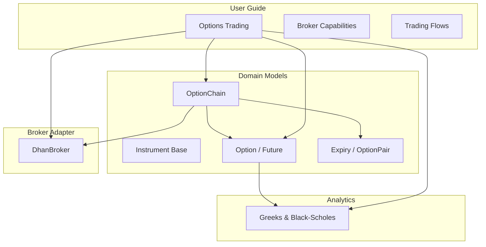
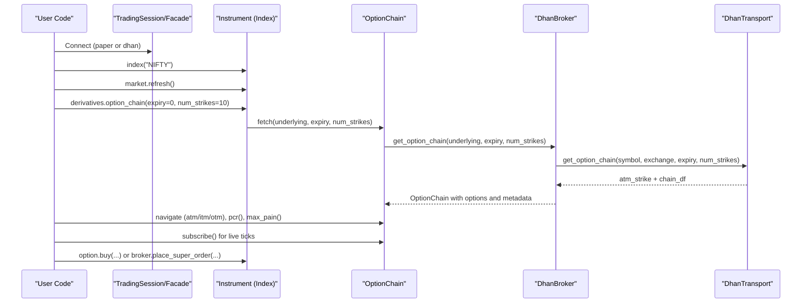
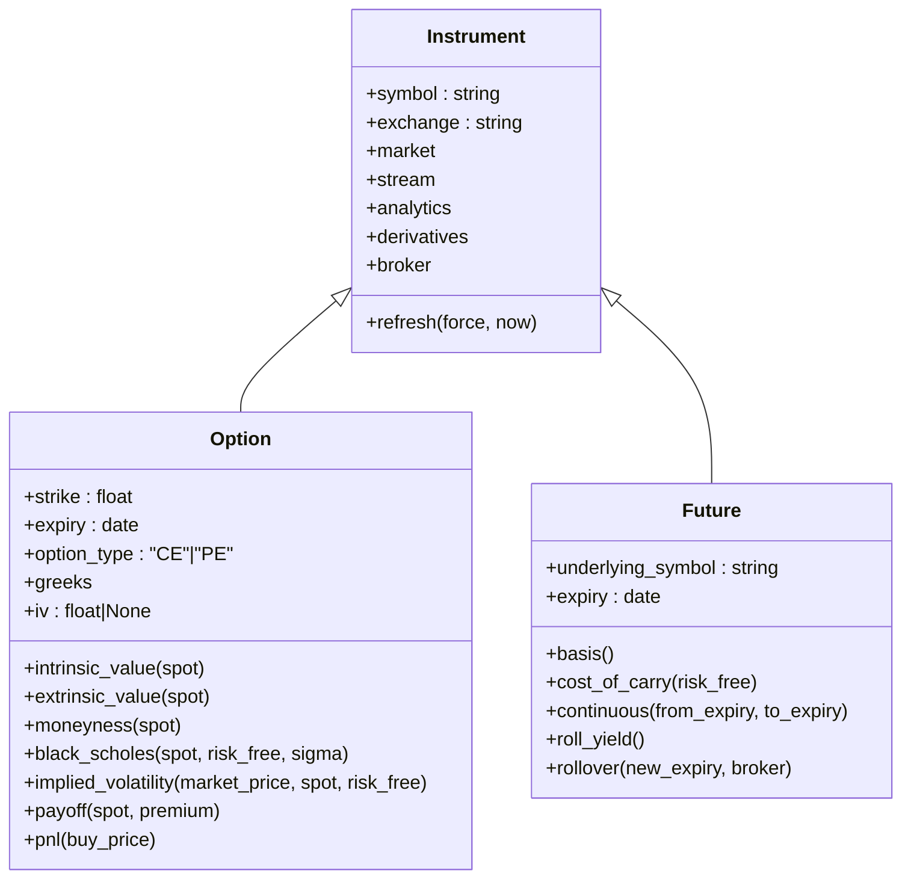
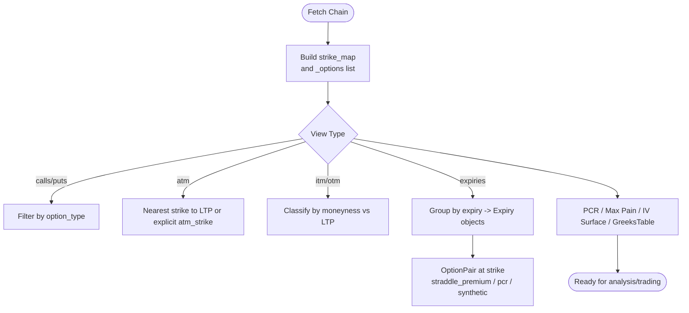
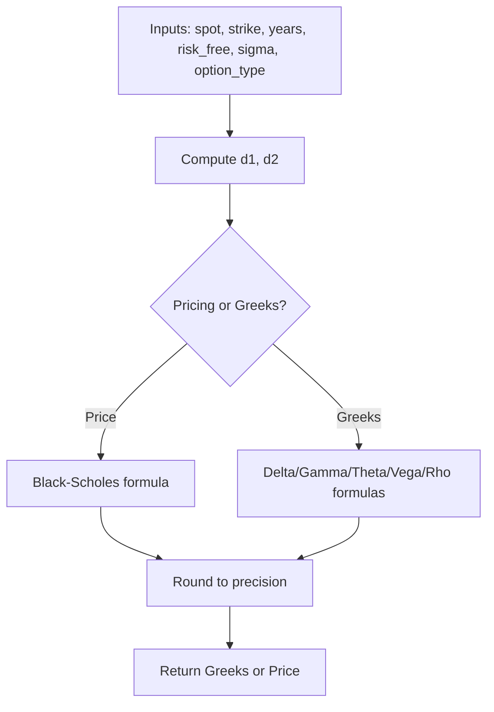
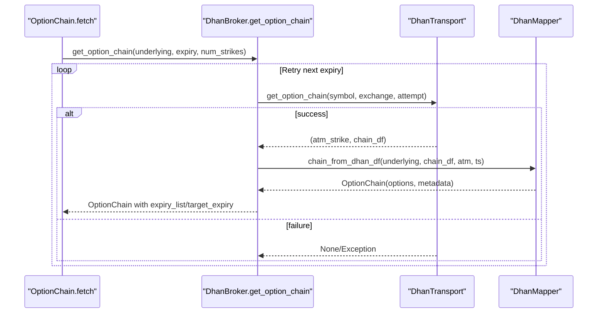
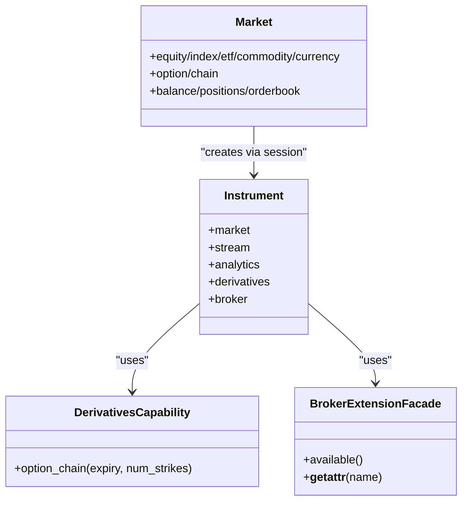
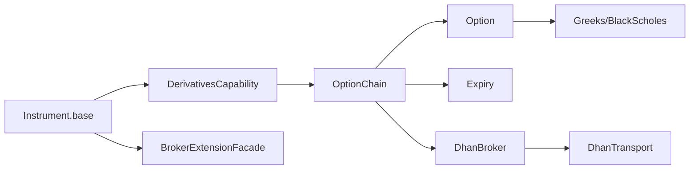

# Options Trading User Guide

<cite>
**Referenced Files in This Document**
- [08-options-trading.md](file://user-guide/08-options-trading.md)
- [07-broker-capabilities.md](file://user-guide/07-broker-capabilities.md)
- [09-trading-flows.md](file://user-guide/09-trading-flows.md)
- [derivatives.py](file://ntrade/domain/instruments/derivatives.py)
- [chain.py](file://ntrade/domain/instruments/chain.py)
- [expiry.py](file://ntrade/domain/instruments/expiry.py)
- [greeks.py](file://ntrade/domain/analytics/greeks.py)
- [capabilities.py](file://ntrade/domain/instruments/capabilities.py)
- [base.py](file://ntrade/domain/instruments/base.py)
- [dhan.py](file://ntrade/brokers/dhan.py)
- [facade.py](file://ntrade/facade.py)
</cite>

## Table of Contents
1. Introduction
2. Project Structure
3. Core Components
4. Architecture Overview
5. Detailed Component Analysis
6. Dependency Analysis
7. Performance Considerations
8. Troubleshooting Guide
9. Conclusion

## Introduction
This user guide explains how to trade options with nTrade, from fetching live chains and navigating ATM/ITM/OTM strikes to placing orders and using broker-specific capabilities. It covers both paper (offline) and live (Dhan) modes, and shows how the domain models, analytics, and broker adapters work together to deliver a consistent experience across environments.

## Project Structure
The options trading feature spans three layers:
- Domain models for instruments and chains
- Analytics for Greeks and implied volatility
- Broker adapter for live data and order execution

**Diagram sources**
- [08-options-trading.md:1-222](file://user-guide/08-options-trading.md#L1-L222)
- [07-broker-capabilities.md:1-238](file://user-guide/07-broker-capabilities.md#L1-L238)
- [09-trading-flows.md:1-309](file://user-guide/09-trading-flows.md#L1-L309)
- [derivatives.py:1-245](file://ntrade/domain/instruments/derivatives.py#L1-L245)
- [chain.py:1-202](file://ntrade/domain/instruments/chain.py#L1-L202)
- [expiry.py:1-171](file://ntrade/domain/instruments/expiry.py#L1-L171)
- [greeks.py:1-120](file://ntrade/domain/analytics/greeks.py#L1-L120)
- [dhan.py:1-755](file://ntrade/brokers/dhan.py#L1-L755)

**Section sources**
- [08-options-trading.md:1-222](file://user-guide/08-options-trading.md#L1-L222)
- [07-broker-capabilities.md:1-238](file://user-guide/07-broker-capabilities.md#L1-L238)
- [09-trading-flows.md:1-309](file://user-guide/09-trading-flows.md#L1-L309)

## Core Components
- Instrument base provides market, stream, analytics, derivatives, and broker capability accessors.
- Derivatives define Option and Future with Greeks, moneyness, pricing helpers, and expiry math.
- OptionChain composes Option instruments, exposes ATM/ITM/OTM views, PCR, max pain, IV surface, and greeks table.
- Expiry groups options by date and offers pair views and ITM/OTM selection.
- Greeks and Black-Scholes provide pricing, greeks computation, and IV solver.
- DhanBroker implements live chain fetch, order placement, and advanced capabilities.

Key usage patterns:
- Fetch a chain via instrument.derivatives.option_chain or session.chain helper.
- Navigate chain.atm, chain.itm, chain.otm; use chain.expiries() and expiry.atm()/otm()/itm().
- Read greeks and iv_surface; place orders through instrument.order facade or broker.place_super_order on live.

**Section sources**
- [base.py:47-144](file://ntrade/domain/instruments/base.py#L47-L144)
- [derivatives.py:109-224](file://ntrade/domain/instruments/derivatives.py#L109-L224)
- [chain.py:19-176](file://ntrade/domain/instruments/chain.py#L19-L176)
- [expiry.py:18-171](file://ntrade/domain/instruments/expiry.py#L18-L171)
- [greeks.py:13-120](file://ntrade/domain/analytics/greeks.py#L13-L120)
- [capabilities.py:241-250](file://ntrade/domain/instruments/capabilities.py#L241-L250)
- [dhan.py:158-200](file://ntrade/brokers/dhan.py#L158-L200)

## Architecture Overview
The options flow connects the user-facing API to domain models and the broker adapter.

**Diagram sources**
- [facade.py:27-60](file://ntrade/facade.py#L27-L60)
- [capabilities.py:241-250](file://ntrade/domain/instruments/capabilities.py#L241-L250)
- [chain.py:56-63](file://ntrade/domain/instruments/chain.py#L56-L63)
- [dhan.py:158-200](file://ntrade/brokers/dhan.py#L158-L200)

## Detailed Component Analysis

### Option and Futures Model
- Option encapsulates strike, expiry, type (CE/PE), underlying symbol, exercise style, settlement, and optional Greeks/IV.
- Provides intrinsic/extrinsic value, moneyness classification, Black-Scholes price, implied volatility solver, payoff, and PnL helpers.
- Future supports basis, cost-of-carry, continuous series construction, roll yield, and rollover.

**Diagram sources**
- [base.py:47-144](file://ntrade/domain/instruments/base.py#L47-L144)
- [derivatives.py:16-107](file://ntrade/domain/instruments/derivatives.py#L16-L107)
- [derivatives.py:109-224](file://ntrade/domain/instruments/derivatives.py#L109-L224)

**Section sources**
- [derivatives.py:16-107](file://ntrade/domain/instruments/derivatives.py#L16-L107)
- [derivatives.py:109-224](file://ntrade/domain/instruments/derivatives.py#L109-L224)

### OptionChain and Expiry Navigation
- OptionChain builds an O(1) strike map, exposes calls/puts, nearest expiry, ATM/ITM/OTM lists, PCR, max pain, IV surface, and greeks table.
- Expiry groups options by date, provides pair_at(strike), ATM/OTM/ITM selections, and pair-level analytics like straddle premium and synthetic forward prices.

**Diagram sources**
- [chain.py:19-176](file://ntrade/domain/instruments/chain.py#L19-L176)
- [expiry.py:18-171](file://ntrade/domain/instruments/expiry.py#L18-L171)

**Section sources**
- [chain.py:19-176](file://ntrade/domain/instruments/chain.py#L19-L176)
- [expiry.py:18-171](file://ntrade/domain/instruments/expiry.py#L18-L171)

### Greeks and Implied Volatility
- Greeks dataclass holds delta, gamma, theta, vega, rho, and iv with a sentinel for not-computed values.
- BlackScholes computes price, greeks, and solves for implied volatility via bisection.

**Diagram sources**
- [greeks.py:13-120](file://ntrade/domain/analytics/greeks.py#L13-L120)

**Section sources**
- [greeks.py:13-120](file://ntrade/domain/analytics/greeks.py#L13-L120)

### Broker Integration (Dhan)
- DhanBroker wraps authentication, transport, and mapping to return OptionChain and quotes.
- get_option_chain retries expiries, resolves real expiry dates, and populates chain metadata.
- Order placement enforces SEBI rules (no MARKET for F&O), routes bracket orders to super-order API, and manages status updates.

**Diagram sources**
- [dhan.py:158-200](file://ntrade/brokers/dhan.py#L158-L200)

**Section sources**
- [dhan.py:158-200](file://ntrade/brokers/dhan.py#L158-L200)
- [dhan.py:203-250](file://ntrade/brokers/dhan.py#L203-L250)

### Capability System and Facade
- Instrument.capabilities expose market, stream, analytics, and derivatives views without polluting the base API.
- BrokerExtensionFacade enables dynamic capability invocation (e.g., depth20, margin_calculator, place_super_order).
- Facade provides legacy Market entry points delegating to TradingSession.

**Diagram sources**
- [capabilities.py:241-250](file://ntrade/domain/instruments/capabilities.py#L241-L250)
- [capabilities.py:48-74](file://ntrade/brokers/capabilities.py#L48-L74)
- [facade.py:27-60](file://ntrade/facade.py#L27-L60)

**Section sources**
- [capabilities.py:241-250](file://ntrade/domain/instruments/capabilities.py#L241-L250)
- [capabilities.py:48-74](file://ntrade/brokers/capabilities.py#L48-L74)
- [facade.py:27-60](file://ntrade/facade.py#L27-L60)

## Dependency Analysis
- OptionChain depends on Option and Expiry for navigation and analytics.
- Option uses Greeks and Black-Scholes for pricing and greeks.
- DhanBroker orchestrates transport and mapper to build OptionChain and execute orders.
- Instrument.base wires capabilities and broker extension facade.

**Diagram sources**
- [base.py:120-144](file://ntrade/domain/instruments/base.py#L120-L144)
- [capabilities.py:241-250](file://ntrade/domain/instruments/capabilities.py#L241-L250)
- [chain.py:19-63](file://ntrade/domain/instruments/chain.py#L19-L63)
- [derivatives.py:109-224](file://ntrade/domain/instruments/derivatives.py#L109-L224)
- [greeks.py:46-120](file://ntrade/domain/analytics/greeks.py#L46-L120)
- [dhan.py:158-200](file://ntrade/brokers/dhan.py#L158-L200)

**Section sources**
- [base.py:120-144](file://ntrade/domain/instruments/base.py#L120-L144)
- [capabilities.py:241-250](file://ntrade/domain/instruments/capabilities.py#L241-L250)
- [chain.py:19-63](file://ntrade/domain/instruments/chain.py#L19-L63)
- [derivatives.py:109-224](file://ntrade/domain/instruments/derivatives.py#L109-L224)
- [greeks.py:46-120](file://ntrade/domain/analytics/greeks.py#L46-L120)
- [dhan.py:158-200](file://ntrade/brokers/dhan.py#L158-L200)

## Performance Considerations
- OptionChain strike lookup is O(1) via prebuilt strike map.
- Chain analytics (PCR, max pain) iterate over options; keep num_strikes reasonable to avoid heavy computations.
- Live subscriptions should be scoped to needed symbols to reduce overhead.
- Use paper mode for development and backtesting before live runs.

[No sources needed since this section provides general guidance]

## Troubleshooting Guide
- Empty or None chains: Dhan may return None for a requested expiry; the adapter retries subsequent expiries and sets chain.expiry_index_used. Verify chain.expiry_list and target_expiry.
- Missing LTP: If LTP is zero or missing, refresh the instrument first; MARKET orders are converted to LIMIT with a small buffer.
- Capability errors: On paper, Dhan-only capabilities raise AttributeError; switch to live Dhan when needed.
- Bracket orders: On Dhan, bracket orders route to place_super_order; ensure target and stop prices are set correctly.

**Section sources**
- [dhan.py:158-200](file://ntrade/brokers/dhan.py#L158-L200)
- [dhan.py:203-250](file://ntrade/brokers/dhan.py#L203-L250)
- [07-broker-capabilities.md:1-238](file://user-guide/07-broker-capabilities.md#L1-L238)

## Conclusion
nTrade’s options trading stack provides a unified, robust path from chain discovery to execution, with rich analytics and broker-specific capabilities. Develop on paper, validate flows, then move to live with confidence.

[No sources needed since this section summarizes without analyzing specific files]