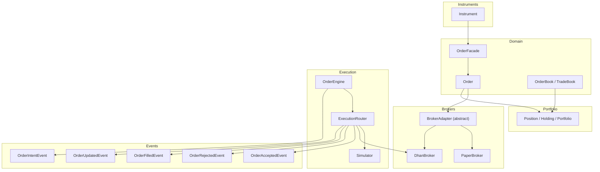
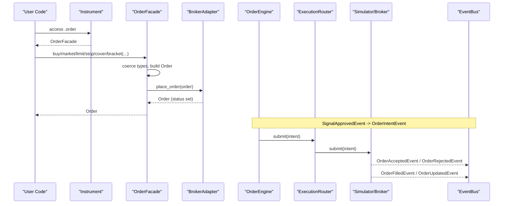
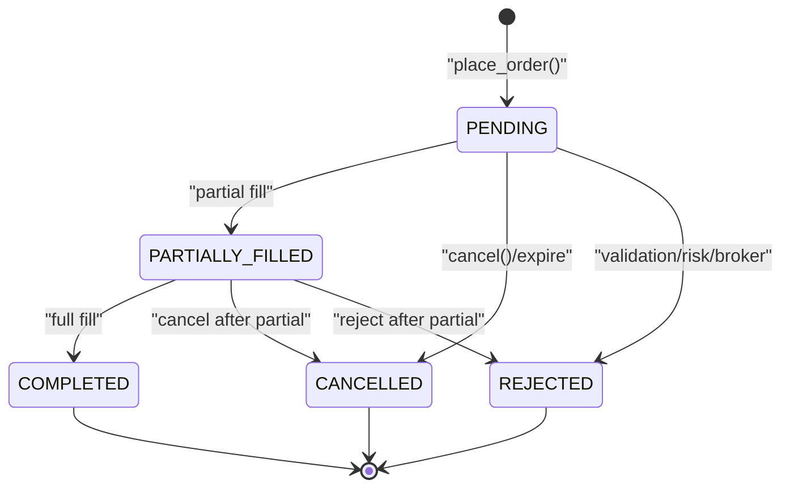
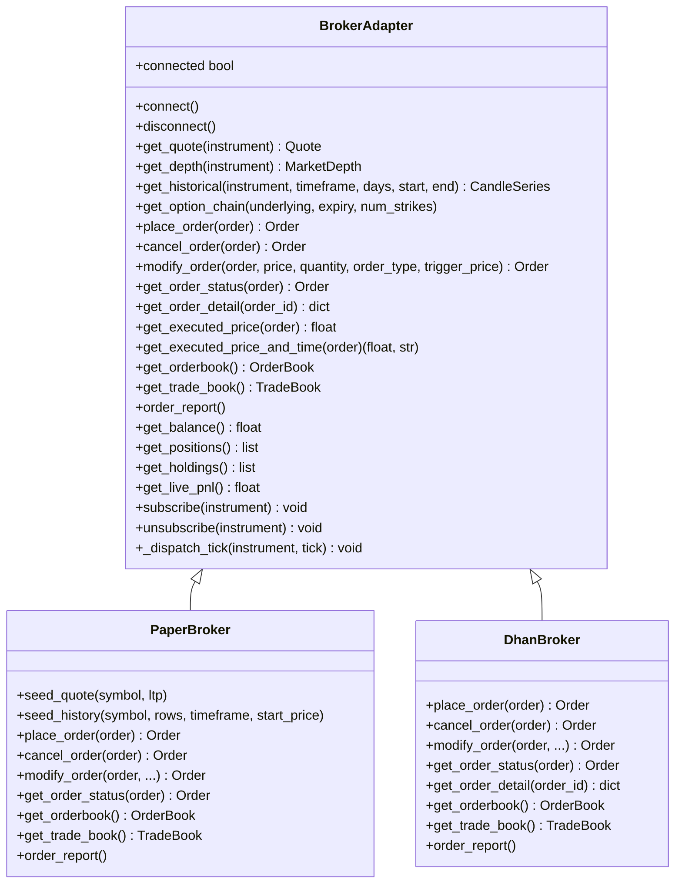
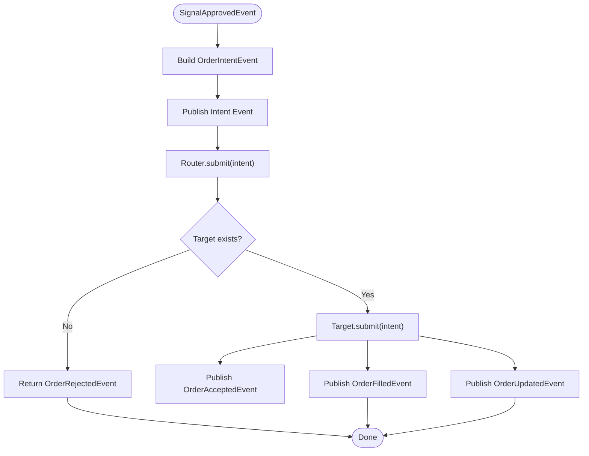
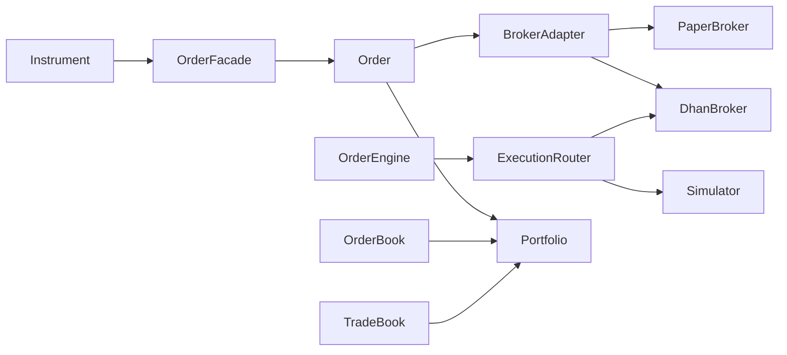

# Orders

<cite>
**Referenced Files in This Document**
- [order.py](file://ntrade/domain/orders/order.py)
- [book.py](file://ntrade/domain/orders/book.py)
- [base.py](file://ntrade/brokers/base.py)
- [paper.py](file://ntrade/brokers/paper.py)
- [dhan.py](file://ntrade/brokers/dhan.py)
- [base.py](file://ntrade/domain/instruments/base.py)
- [order_engine.py](file://ntrade/engines/order_engine.py)
- [router.py](file://ntrade/execution/router.py)
- [simulator.py](file://ntrade/execution/simulator.py)
- [order.py](file://ntrade/events/order.py)
- [portfolio.py](file://ntrade/domain/portfolio.py)
- [facade.py](file://ntrade/facade.py)
- [test_orders.py](file://tests/test_orders.py)
</cite>

## Table of Contents
1. [Introduction](#introduction)
2. [Project Structure](#project-structure)
3. [Core Components](#core-components)
4. [Architecture Overview](#architecture-overview)
5. [Detailed Component Analysis](#detailed-component-analysis)
6. [Dependency Analysis](#dependency-analysis)
7. [Performance Considerations](#performance-considerations)
8. [Troubleshooting Guide](#troubleshooting-guide)
9. [Conclusion](#conclusion)
10. [Appendices](#appendices)

## Introduction
This document provides comprehensive data model documentation for nTrade’s order management system. It covers the Order class and its lifecycle, the OrderFacade for natural entry syntax (e.g., stock.order.buy(75)), and the OrderBook/TradeBook structures used to track active orders and trade history. It also explains relationships with instruments and portfolio tracking, field definitions, validation rules, state transitions, and business logic for order processing across paper and live brokers.

## Project Structure
The order domain is implemented under ntrade/domain/orders with supporting broker adapters, execution routing, and event models:
- Domain models: Order, OrderFacade, enums for side/type/status/trade type; immutable OrderBook and TradeBook entries
- Broker adapters: abstract base and concrete implementations (PaperBroker, DhanBroker)
- Execution pipeline: OrderEngine, ExecutionRouter, and simulator
- Events: order lifecycle events (intent, accepted, rejected, filled, updated, timeout)
- Portfolio: Position/Holding/Portfolio composites for position tracking

**Diagram sources**
- [order.py:1-173](file://ntrade/domain/orders/order.py#L1-L173)
- [book.py:1-120](file://ntrade/domain/orders/book.py#L1-L120)
- [base.py:1-163](file://ntrade/brokers/base.py#L1-L163)
- [paper.py:1-216](file://ntrade/brokers/paper.py#L1-L216)
- [dhan.py:300-499](file://ntrade/brokers/dhan.py#L300-L499)
- [base.py:1-305](file://ntrade/domain/instruments/base.py#L1-L305)
- [order_engine.py:1-34](file://ntrade/engines/order_engine.py#L1-L34)
- [router.py:1-49](file://ntrade/execution/router.py#L1-L49)
- [simulator.py:72-99](file://ntrade/execution/simulator.py#L72-L99)
- [order.py:1-91](file://ntrade/events/order.py#L1-L91)
- [portfolio.py:1-173](file://ntrade/domain/portfolio.py#L1-L173)

**Section sources**
- [order.py:1-173](file://ntrade/domain/orders/order.py#L1-L173)
- [book.py:1-120](file://ntrade/domain/orders/book.py#L1-L120)
- [base.py:1-163](file://ntrade/brokers/base.py#L1-L163)
- [paper.py:1-216](file://ntrade/brokers/paper.py#L1-L216)
- [dhan.py:300-499](file://ntrade/brokers/dhan.py#L300-L499)
- [base.py:1-305](file://ntrade/domain/instruments/base.py#L1-L305)
- [order_engine.py:1-34](file://ntrade/engines/order_engine.py#L1-L34)
- [router.py:1-49](file://ntrade/execution/router.py#L1-L49)
- [simulator.py:72-99](file://ntrade/execution/simulator.py#L72-L99)
- [order.py:1-91](file://ntrade/events/order.py#L1-L91)
- [portfolio.py:1-173](file://ntrade/domain/portfolio.py#L1-L173)

## Core Components
- Order: Dataclass representing an order intent and execution state, including fields for symbol via instrument, side, quantity, price, trigger/target/stop-loss prices, status, fills, and timestamps. Provides lifecycle helpers like cancel, modify, refresh, executed_price, and as_dict.
- OrderFacade: Natural entry API bound to an Instrument instance enabling expressions like stock.order.buy(75). Supports limit, market, stop, cover, bracket, and generic place methods with type coercion for strings to enums.
- OrderBook and TradeBook: Immutable collections of typed entries for open orders and executed trades, with filtering by symbol and conversion utilities.
- BrokerAdapter: Abstract interface defining order placement, modification, cancellation, status polling, and book retrieval. Concrete implementations include PaperBroker (in-memory) and DhanBroker (live).
- OrderEngine and ExecutionRouter: Engine materializes approved signals into order intents and routes them to execution targets (simulator or broker), publishing lifecycle events.
- Events: Typed events for order lifecycle transitions (intent, accepted, rejected, filled, updated, timeout).
- Portfolio: Composite objects for positions and holdings that reflect results of order executions.

**Section sources**
- [order.py:1-173](file://ntrade/domain/orders/order.py#L1-L173)
- [book.py:1-120](file://ntrade/domain/orders/book.py#L1-L120)
- [base.py:1-163](file://ntrade/brokers/base.py#L1-L163)
- [paper.py:1-216](file://ntrade/brokers/paper.py#L1-L216)
- [dhan.py:300-499](file://ntrade/brokers/dhan.py#L300-L499)
- [order_engine.py:1-34](file://ntrade/engines/order_engine.py#L1-L34)
- [router.py:1-49](file://ntrade/execution/router.py#L1-L49)
- [order.py:1-91](file://ntrade/events/order.py#L1-L91)
- [portfolio.py:1-173](file://ntrade/domain/portfolio.py#L1-L173)

## Architecture Overview
The order flow begins at Instrument.order (OrderFacade), which constructs an Order and delegates to the broker adapter. The OrderEngine converts strategy signals into OrderIntentEvent and submits through ExecutionRouter to either a simulator or a live broker. Lifecycle events are published throughout the process. OrderBook and TradeBook provide normalized views of open orders and executed trades. Portfolio aggregates positions and holdings derived from fills.

**Diagram sources**
- [base.py:117-121](file://ntrade/domain/instruments/base.py#L117-L121)
- [order.py:118-173](file://ntrade/domain/orders/order.py#L118-L173)
- [order_engine.py:14-34](file://ntrade/engines/order_engine.py#L14-L34)
- [router.py:19-49](file://ntrade/execution/router.py#L19-L49)
- [simulator.py:72-99](file://ntrade/execution/simulator.py#L72-L99)
- [order.py:1-91](file://ntrade/events/order.py#L1-L91)

## Detailed Component Analysis

### Order Data Model and Lifecycle
- Fields:
  - instrument: reference to the underlying Instrument
  - side: BUY or SELL
  - quantity: integer number of units
  - order_type: LIMIT, MARKET, STOP_LIMIT, STOP_MARKET, COVER, BRACKET
  - trade_type: MIS, CNC, MARGIN, MTF
  - price: limit price (for non-market orders)
  - trigger_price: stop trigger price
  - target_price: bracket target leg
  - stop_loss_price: bracket stop leg
  - order_id: broker-assigned identifier
  - status: PENDING, COMPLETED, REJECTED, CANCELLED, PARTIALLY_FILLED
  - filled_qty: cumulative filled quantity
  - avg_price: average execution price
  - created_at: optional timestamp
- Properties:
  - is_open: true when PENDING or PARTIALLY_FILLED
  - is_filled: true when COMPLETED
- Methods:
  - cancel(): delegate to instrument.broker_adapter.cancel_order
  - modify(...): delegate to instrument.broker_adapter.modify_order
  - refresh(): poll broker for latest status
  - executed_price() / executed_price_and_time(): fetch from broker if available
  - as_dict(): serialization helper

Lifecycle states and transitions:
- New/PENDING on placement
- PARTIALLY_FILLED on partial fill
- COMPLETED on full fill
- CANCELLED on user/cancel or expiry
- REJECTED on validation/risk/broker rejection

Validation rules and business logic:
- Market orders for F&O exchanges are converted to LIMIT with a small premium/discount around LTP (broker-specific enforcement)
- Bracket orders route to specialized APIs where supported
- Missing broker adapter raises RuntimeError on place/cancel/modify

**Diagram sources**
- [order.py:35-66](file://ntrade/domain/orders/order.py#L35-L66)
- [dhan.py:304-351](file://ntrade/brokers/dhan.py#L304-L351)
- [paper.py:108-144](file://ntrade/brokers/paper.py#L108-L144)

**Section sources**
- [order.py:1-173](file://ntrade/domain/orders/order.py#L1-L173)
- [dhan.py:304-351](file://ntrade/brokers/dhan.py#L304-L351)
- [paper.py:108-144](file://ntrade/brokers/paper.py#L108-L144)

### OrderFacade: Natural Entry Syntax
- Methods:
  - buy(quantity, price=0, order_type=LIMIT, trade_type=MIS, trigger_price=0)
  - sell(quantity, price=0, order_type=LIMIT, trade_type=MIS, trigger_price=0)
  - limit(side, quantity, price, **kw)
  - market(side, quantity, **kw)
  - stop(side, quantity, price, trigger_price, **kw)
  - cover(side, quantity, price=0, trigger_price=0, **kw)
  - bracket(side, quantity, price, target_price, stop_loss_price, **kw)
  - place(side, quantity, order_type, trade_type, price, trigger_price, **kwargs)
- Behavior:
  - Coerces string inputs to enums
  - Constructs Order with instrument context
  - Delegates to instrument.broker_adapter.place_order
  - Raises RuntimeError if no broker adapter is configured

Usage examples (described without code):
- Create a limit buy: stock.order.buy(75, price=2500)
- Place a market sell: stock.order.market("SELL", quantity=50)
- Stop order: stock.order.stop("SELL", 75, price=2490, trigger_price=2495)
- Cover order: stock.order.cover("SELL", 75)
- Bracket order: stock.order.bracket("BUY", 75, price=2500, target_price=2600, stop_loss_price=2450)

**Section sources**
- [order.py:118-173](file://ntrade/domain/orders/order.py#L118-L173)
- [base.py:117-121](file://ntrade/domain/instruments/base.py#L117-L121)
- [test_orders.py:9-90](file://tests/test_orders.py#L9-L90)

### OrderBook and TradeBook: Active Orders and Trade History
- OrderBookEntry fields: symbol, order_id, side, quantity, price, status, exchange, timestamp
- OrderBook: frozen collection with for_symbol(symbol), iteration, indexing, and dict conversion
- TradeBookEntry fields: symbol, trade_id, order_id, side, quantity, price, timestamp
- TradeBook: frozen collection with for_symbol(symbol), iteration, indexing, and dict conversion

Behavior:
- Immutable value objects ensure thread-safe reads
- Normalized from broker raw responses
- Used by broker adapters to expose current books

**Section sources**
- [book.py:1-120](file://ntrade/domain/orders/book.py#L1-L120)
- [paper.py:161-188](file://ntrade/brokers/paper.py#L161-L188)
- [dhan.py:439-476](file://ntrade/brokers/dhan.py#L439-L476)

### BrokerAdapter and Implementations
- Abstract interface defines:
  - connect(), disconnect(), connected
  - get_quote(), get_depth(), get_historical(), get_option_chain()
  - place_order(), cancel_order(), modify_order(), get_order_status(), get_order_detail()
  - get_executed_price(), get_executed_price_and_time()
  - get_orderbook(), get_trade_book(), order_report()
  - get_balance(), get_positions(), get_holdings(), get_live_pnl()
  - subscribe(), unsubscribe(), _dispatch_tick()
- PaperBroker:
  - In-memory simulation with seed-based randomness
  - Immediate fills for market/limit orders
  - Implements cancel/modify/status polling and books
- DhanBroker:
  - Live integration with token management
  - Enforces SEBI rule: convert F&O MARKET to LIMIT with LTP-based price
  - Routes BRACKET orders to dedicated API
  - Maps broker statuses to domain OrderStatus

**Diagram sources**
- [base.py:25-163](file://ntrade/brokers/base.py#L25-L163)
- [paper.py:23-216](file://ntrade/brokers/paper.py#L23-L216)
- [dhan.py:304-499](file://ntrade/brokers/dhan.py#L304-L499)

**Section sources**
- [base.py:1-163](file://ntrade/brokers/base.py#L1-L163)
- [paper.py:1-216](file://ntrade/brokers/paper.py#L1-L216)
- [dhan.py:300-499](file://ntrade/brokers/dhan.py#L300-L499)

### OrderEngine and ExecutionRouter
- OrderEngine subscribes to SignalApprovedEvent, builds OrderIntentEvent, publishes it, and submits to router
- ExecutionRouter selects execution target by strategy name or default, returns OrderRejectedEvent if none found
- Simulator validates instrument availability, price validity, applies slippage, and publishes acceptance/fill events

**Diagram sources**
- [order_engine.py:14-34](file://ntrade/engines/order_engine.py#L14-L34)
- [router.py:19-49](file://ntrade/execution/router.py#L19-L49)
- [simulator.py:72-99](file://ntrade/execution/simulator.py#L72-L99)
- [order.py:1-91](file://ntrade/events/order.py#L1-L91)

**Section sources**
- [order_engine.py:1-34](file://ntrade/engines/order_engine.py#L1-L34)
- [router.py:1-49](file://ntrade/execution/router.py#L1-L49)
- [simulator.py:72-99](file://ntrade/execution/simulator.py#L72-L99)
- [order.py:1-91](file://ntrade/events/order.py#L1-L91)

### Portfolio Relationships
- Position: tracks symbol, quantity, avg_price, ltp, product, exchange, metadata; computes market_value and pnl
- Holding: similar to Position but for cash holdings
- Portfolio: composite of positions and holdings; supports refresh from broker, live_pnl, market_value, and lookup by symbol
- Account: composite of balance and holdings; supports refresh from broker

Integration points:
- Order fills update positions/holdings via higher-level engines (not shown here)
- Portfolio.refresh pulls fresh data from broker adapter

**Section sources**
- [portfolio.py:1-173](file://ntrade/domain/portfolio.py#L1-L173)

## Dependency Analysis
Key dependencies and coupling:
- Order depends on Instrument for broker adapter access
- OrderFacade depends on Instrument and Order
- BrokerAdapter abstracts all broker interactions; PaperBroker and DhanBroker implement specifics
- OrderEngine depends on events and router; ExecutionRouter depends on registered targets
- OrderBook/TradeBook are consumed by broker adapters and exposed to callers
- Portfolio depends on BrokerAdapter for live data

**Diagram sources**
- [base.py:117-121](file://ntrade/domain/instruments/base.py#L117-L121)
- [order.py:118-173](file://ntrade/domain/orders/order.py#L118-L173)
- [base.py:25-163](file://ntrade/brokers/base.py#L25-L163)
- [paper.py:23-216](file://ntrade/brokers/paper.py#L23-L216)
- [dhan.py:304-499](file://ntrade/brokers/dhan.py#L304-L499)
- [order_engine.py:14-34](file://ntrade/engines/order_engine.py#L14-L34)
- [router.py:19-49](file://ntrade/execution/router.py#L19-L49)
- [simulator.py:72-99](file://ntrade/execution/simulator.py#L72-L99)
- [portfolio.py:63-135](file://ntrade/domain/portfolio.py#L63-L135)

**Section sources**
- [base.py:1-305](file://ntrade/domain/instruments/base.py#L1-L305)
- [order.py:1-173](file://ntrade/domain/orders/order.py#L1-L173)
- [base.py:1-163](file://ntrade/brokers/base.py#L1-L163)
- [paper.py:1-216](file://ntrade/brokers/paper.py#L1-L216)
- [dhan.py:300-499](file://ntrade/brokers/dhan.py#L300-L499)
- [order_engine.py:1-34](file://ntrade/engines/order_engine.py#L1-L34)
- [router.py:1-49](file://ntrade/execution/router.py#L1-L49)
- [simulator.py:72-99](file://ntrade/execution/simulator.py#L72-L99)
- [portfolio.py:1-173](file://ntrade/domain/portfolio.py#L1-L173)

## Performance Considerations
- Immutability: OrderBook and TradeBook use frozen dataclasses and tuples for thread-safe reads
- Lazy broker initialization: Instrument delays broker adapter creation until needed
- Efficient polling: Broker.get_order_status updates only changed fields; OrderEngine minimizes redundant calls
- Zero-parity timestamps: Use injected clock for consistent timekeeping across replay/live modes
- Minimal object churn: Value objects reduce allocations and simplify concurrency

[No sources needed since this section provides general guidance]

## Troubleshooting Guide
Common issues and resolutions:
- RuntimeError when placing/modifying/cancelling without a broker adapter: ensure Instrument is constructed with a broker or via TradingSession/Market facade
- F&O MARKET order rejection: convert to LIMIT with LTP-based price; DhanBroker enforces this automatically
- Partial fill handling: check Order.status == PARTIALLY_FILLED and compare filled_qty vs quantity; use refresh to sync latest state
- Missing order IDs: some brokers may not assign IDs immediately; resilient kernel uses fallback identifiers
- Stale quotes: refresh instrument before placing orders to ensure valid LTP for market conversions

Error handling patterns:
- BrokerAdapter methods raise RuntimeError on unsupported operations or failures
- ExecutionRouter returns OrderRejectedEvent when no target is available
- Simulator rejects intents with invalid prices or unknown instruments

**Section sources**
- [order.py:69-98](file://ntrade/domain/orders/order.py#L69-L98)
- [dhan.py:304-351](file://ntrade/brokers/dhan.py#L304-L351)
- [router.py:37-49](file://ntrade/execution/router.py#L37-L49)
- [simulator.py:72-99](file://ntrade/execution/simulator.py#L72-L99)
- [test_orders.py:38-44](file://tests/test_orders.py#L38-L44)

## Conclusion
nTrade’s order management system provides a robust, extensible data model and execution pipeline. The Order class encapsulates lifecycle and properties, OrderFacade offers intuitive entry syntax, and OrderBook/TradeBook normalize broker data. BrokerAdapter abstracts implementation details, while OrderEngine and ExecutionRouter orchestrate event-driven flows. Portfolio composites integrate order outcomes into position tracking. The design emphasizes immutability, zero-parity timing, and clear separation between domain and transport layers.

[No sources needed since this section summarizes without analyzing specific files]

## Appendices

### Field Definitions Summary
- Order fields: instrument, side, quantity, order_type, trade_type, price, trigger_price, target_price, stop_loss_price, order_id, status, filled_qty, avg_price, created_at
- OrderBookEntry fields: symbol, order_id, side, quantity, price, status, exchange, timestamp
- TradeBookEntry fields: symbol, trade_id, order_id, side, quantity, price, timestamp
- Position fields: symbol, quantity, avg_price, ltp, product, exchange, metadata
- Holding fields: symbol, quantity, avg_price, ltp, metadata

**Section sources**
- [order.py:44-58](file://ntrade/domain/orders/order.py#L44-L58)
- [book.py:14-26](file://ntrade/domain/orders/book.py#L14-L26)
- [book.py:69-80](file://ntrade/domain/orders/book.py#L69-L80)
- [portfolio.py:19-27](file://ntrade/domain/portfolio.py#L19-L27)
- [portfolio.py:46-52](file://ntrade/domain/portfolio.py#L46-L52)

### Examples of Creating Different Order Types
- Limit buy: use OrderFacade.limit or buy with price
- Market sell: use OrderFacade.market
- Stop order: use OrderFacade.stop with trigger_price
- Cover order: use OrderFacade.cover for square-off with stop
- Bracket order: use OrderFacade.bracket with target and stop legs

**Section sources**
- [order.py:132-154](file://ntrade/domain/orders/order.py#L132-L154)
- [test_orders.py:9-63](file://tests/test_orders.py#L9-L63)

### Modifying Orders and Handling Partial Fills
- Modify: call order.modify(price=..., quantity=..., order_type=..., trigger_price=...)
- Refresh: call order.refresh() to sync status and fills
- Partial fills: check status PARTIALLY_FILLED and filled_qty; continue monitoring until COMPLETED or CANCELLED

**Section sources**
- [order.py:76-91](file://ntrade/domain/orders/order.py#L76-L91)
- [paper.py:131-153](file://ntrade/brokers/paper.py#L131-L153)
- [dhan.py:363-407](file://ntrade/brokers/dhan.py#L363-L407)

### Managing Order Books with Error Handling
- Retrieve OrderBook/TradeBook via broker adapter methods
- Filter by symbol using for_symbol
- Convert to dicts for compatibility if needed
- Handle exceptions gracefully; return empty collections on errors

**Section sources**
- [book.py:41-67](file://ntrade/domain/orders/book.py#L41-L67)
- [book.py:94-119](file://ntrade/domain/orders/book.py#L94-L119)
- [paper.py:161-188](file://ntrade/brokers/paper.py#L161-L188)
- [dhan.py:439-476](file://ntrade/brokers/dhan.py#L439-L476)