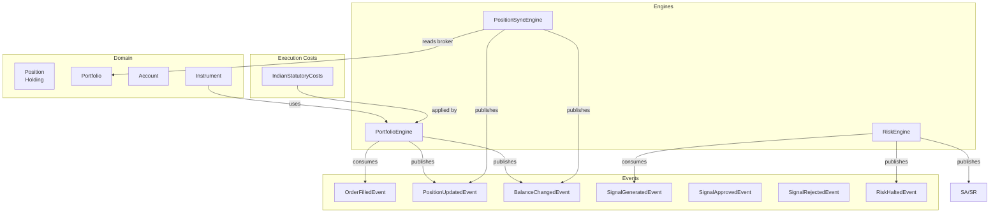
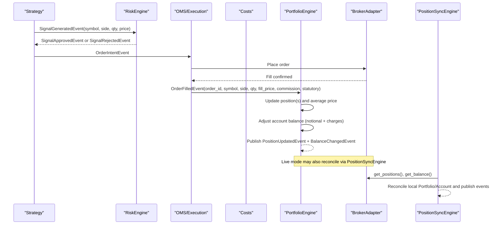
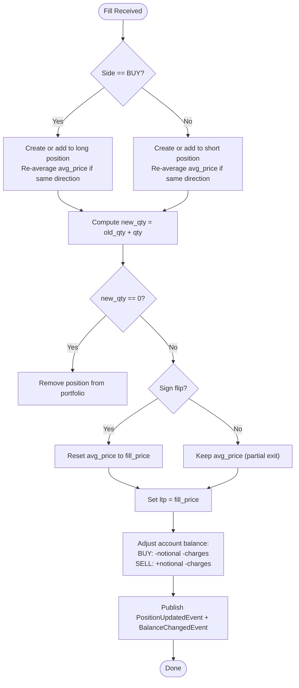
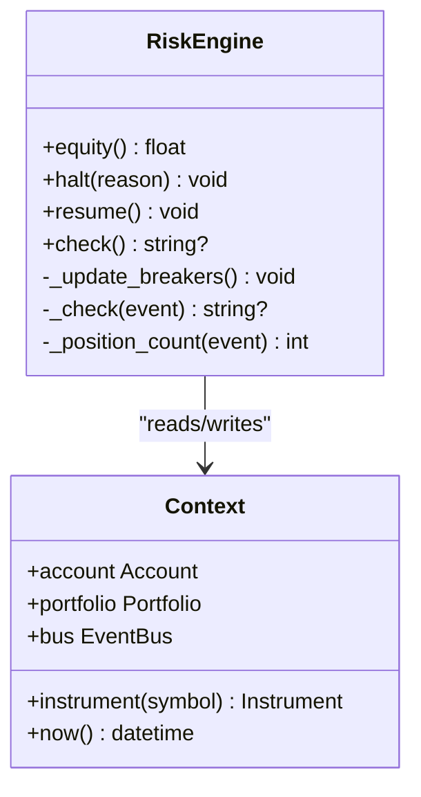
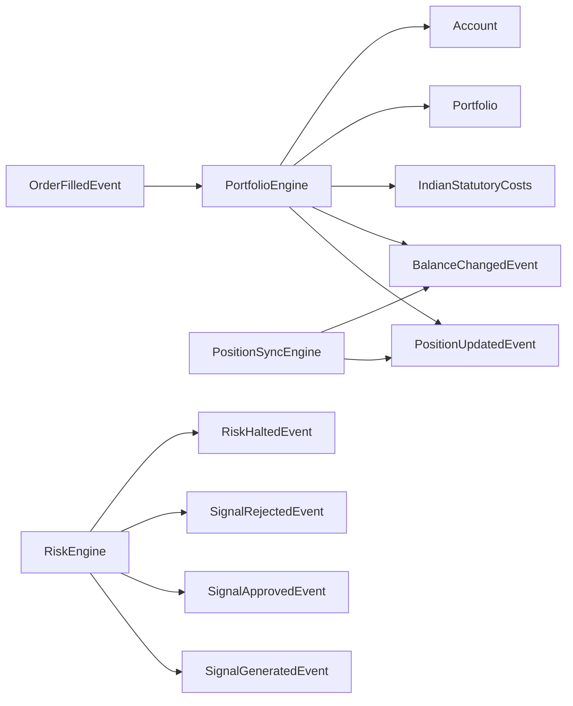

# Portfolio & Positions

<cite>
**Referenced Files in This Document**
- [portfolio.py](file://ntrade/domain/portfolio.py)
- [portfolio_engine.py](file://ntrade/engines/portfolio_engine.py)
- [position_sync.py](file://ntrade/engines/position_sync.py)
- [portfolio_events.py](file://ntrade/events/portfolio.py)
- [order_events.py](file://ntrade/events/order.py)
- [risk_engine.py](file://ntrade/engines/risk_engine.py)
- [risk_events.py](file://ntrade/events/risk.py)
- [costs.py](file://ntrade/execution/costs.py)
- [instruments_base.py](file://ntrade/domain/instruments/base.py)
- [test_portfolio_account.py](file://tests/test_portfolio_account.py)
- [test_portfolio_exit_cost.py](file://tests/test_portfolio_exit_cost.py)
</cite>

## Table of Contents
1. [Introduction](#introduction)
2. [Project Structure](#project-structure)
3. [Core Components](#core-components)
4. [Architecture Overview](#architecture-overview)
5. [Detailed Component Analysis](#detailed-component-analysis)
6. [Dependency Analysis](#dependency-analysis)
7. [Performance Considerations](#performance-considerations)
8. [Troubleshooting Guide](#troubleshooting-guide)
9. [Conclusion](#conclusion)
10. [Appendices](#appendices)

## Introduction
This document provides comprehensive data model documentation for nTrade’s portfolio and position management. It explains the Position and Portfolio classes, how positions are created and updated through order fills, how account balance is adjusted with statutory costs, and how risk controls monitor exposure and enforce limits. It also covers relationships with orders, instruments, and market data, and includes examples of creating positions, calculating P&L, managing portfolio risk, and generating reports with financial accuracy and type safety.

## Project Structure
The portfolio and position domain lives under the domain layer, while engines orchestrate state changes based on events. Events bridge the execution pipeline to read models (Portfolio/Account). Risk enforcement sits alongside these flows to gate signals and halt trading when thresholds are breached.

**Diagram sources**
- [portfolio.py:19-135](file://ntrade/domain/portfolio.py#L19-L135)
- [portfolio_engine.py:15-69](file://ntrade/engines/portfolio_engine.py#L15-L69)
- [position_sync.py:22-80](file://ntrade/engines/position_sync.py#L22-L80)
- [portfolio_events.py:11-27](file://ntrade/events/portfolio.py#L11-L27)
- [order_events.py:49-64](file://ntrade/events/order.py#L49-L64)
- [risk_engine.py:19-63](file://ntrade/engines/risk_engine.py#L19-L63)
- [risk_events.py:11-52](file://ntrade/events/risk.py#L11-L52)
- [costs.py:70-174](file://ntrade/execution/costs.py#L70-L174)

**Section sources**
- [portfolio.py:1-173](file://ntrade/domain/portfolio.py#L1-L173)
- [portfolio_engine.py:1-69](file://ntrade/engines/portfolio_engine.py#L1-L69)
- [position_sync.py:1-110](file://ntrade/engines/position_sync.py#L1-L110)
- [portfolio_events.py:1-27](file://ntrade/events/portfolio.py#L1-L27)
- [order_events.py:1-91](file://ntrade/events/order.py#L1-L91)
- [risk_engine.py:1-141](file://ntrade/engines/risk_engine.py#L1-L141)
- [risk_events.py:1-52](file://ntrade/events/risk.py#L1-L52)
- [costs.py:1-285](file://ntrade/execution/costs.py#L1-L285)
- [instruments_base.py:50-151](file://ntrade/domain/instruments/base.py#L50-L151)

## Core Components
- Position: Represents a single tradable holding with symbol, quantity, average price, last traded price (ltp), product, exchange, and metadata. Provides derived metrics like market value and unrealized P&L.
- Holding: Similar to Position but used for long-only holdings in Account context.
- Portfolio: Aggregates positions and holdings; computes aggregate P&L and market value; supports iteration and lookup by symbol; can refresh from a broker adapter.
- Account: Holds cash balance and holdings; can be refreshed from a broker adapter.

Key behaviors:
- P&L calculation uses ltp minus avg_price times quantity.
- Market value equals quantity times ltp.
- Portfolio aggregates per-position metrics into totals.

Validation rules:
- Position fields are strongly typed via dataclasses.
- Portfolio lookups raise KeyError for missing symbols.
- Account and Portfolio support safe refresh operations that preserve state on transient failures.

Business logic highlights:
- Average price updates follow netting rules: same-direction fills re-average; partial exits keep entry price; exit-and-reverse resets average price to the new side’s fill price.
- Cash adjustments deduct notional plus statutory charges on buys and credit net proceeds minus charges on sells.

**Section sources**
- [portfolio.py:19-61](file://ntrade/domain/portfolio.py#L19-L61)
- [portfolio.py:63-135](file://ntrade/domain/portfolio.py#L63-L135)
- [portfolio.py:137-173](file://ntrade/domain/portfolio.py#L137-L173)
- [test_portfolio_account.py:9-26](file://tests/test_portfolio_account.py#L9-L26)

## Architecture Overview
The system follows an event-driven architecture where order fills update the portfolio and account, and risk checks gate signals before they become orders.

**Diagram sources**
- [risk_engine.py:73-111](file://ntrade/engines/risk_engine.py#L73-L111)
- [order_events.py:49-64](file://ntrade/events/order.py#L49-L64)
- [portfolio_engine.py:20-69](file://ntrade/engines/portfolio_engine.py#L20-L69)
- [position_sync.py:28-80](file://ntrade/engines/position_sync.py#L28-L80)
- [costs.py:164-174](file://ntrade/execution/costs.py#L164-L174)

## Detailed Component Analysis

### Position Data Model
Fields:
- symbol: str — instrument identifier
- quantity: int — signed quantity (positive for long, negative for short)
- avg_price: float — weighted average entry price
- ltp: float — last traded price used for mark-to-market
- product: str — product code (e.g., MIS)
- exchange: str — exchange code (e.g., NSE)
- metadata: dict[str, Any] — strategy attribution and other tags

Derived properties:
- market_value: float — quantity × ltp rounded to 2 decimals
- pnl: float — (ltp − avg_price) × quantity rounded to 2 decimals

Type safety:
- All fields are declared with explicit types via dataclass.
- Properties return floats with deterministic rounding.

Validation:
- No explicit validation at construction; downstream engines ensure consistent updates.

Business logic:
- Unrealized P&L reflects current mark-to-market relative to average cost.
- As_dict exposes all fields plus computed values for reporting.

**Section sources**
- [portfolio.py:19-44](file://ntrade/domain/portfolio.py#L19-L44)
- [test_portfolio_account.py:9-12](file://tests/test_portfolio_account.py#L9-L12)

### Portfolio Aggregate Model
Responsibilities:
- Maintain list of Position objects and Holding objects
- Compute aggregate pnl and market_value
- Provide lookup by symbol and iteration
- Refresh from broker adapter if available

Key methods:
- position(symbol): returns Position or None
- refresh(): pulls latest positions and holdings from broker
- as_dict(): serializes portfolio including positions, holdings, pnl, market_value

Risk integration:
- PortfolioEngine consumes fills to update positions and account balance
- PositionSyncEngine reconciles broker-reported state to maintain canonical read models

**Section sources**
- [portfolio.py:63-135](file://ntrade/domain/portfolio.py#L63-L135)
- [portfolio_engine.py:20-69](file://ntrade/engines/portfolio_engine.py#L20-L69)
- [position_sync.py:28-80](file://ntrade/engines/position_sync.py#L28-L80)

### Account Model
Responsibilities:
- Hold cash balance and holdings
- Support refresh from broker adapter
- Provide holding lookup by symbol

Key methods:
- holding(symbol): returns Holding or None
- refresh(): pulls latest balance and holdings from broker
- as_dict(): serializes balance and holdings

**Section sources**
- [portfolio.py:137-173](file://ntrade/domain/portfolio.py#L137-L173)

### Position Lifecycle and Cost Accounting
Lifecycle stages:
- Open: On BUY fill, create Position with positive quantity and set avg_price to fill price
- Add to existing: Same-direction fills re-average total cost across combined quantity
- Partial exit: Reduces quantity without changing avg_price
- Exit-and-reverse: If sign flips, reset avg_price to new side’s fill price
- Close: When quantity reaches zero, remove position

Cost accounting:
- Notional = fill_price × quantity
- Statutory charges include STT, exchange transaction charges, SEBI fee, GST, stamp duty
- Buy: debit notional + charges from balance
- Sell: credit notional − charges to balance

P&L implications:
- Unrealized P&L updates with ltp changes
- Realized P&L emerges when exiting positions; statutory costs reduce realized gains or increase losses

**Diagram sources**
- [portfolio_engine.py:20-69](file://ntrade/engines/portfolio_engine.py#L20-L69)
- [order_events.py:49-64](file://ntrade/events/order.py#L49-L64)
- [costs.py:164-174](file://ntrade/execution/costs.py#L164-L174)

**Section sources**
- [portfolio_engine.py:20-69](file://ntrade/engines/portfolio_engine.py#L20-L69)
- [test_portfolio_exit_cost.py:21-47](file://tests/test_portfolio_exit_cost.py#L21-L47)
- [costs.py:70-174](file://ntrade/execution/costs.py#L70-L174)

### Risk Engine and Exposure Monitoring
Capabilities:
- Enforce static limits: max quantity, max notional, max positions, allowlist
- Circuit breakers: daily loss cap, max drawdown percentage, price deviation guard
- Track equity: cash balance + mark-to-market of open positions
- Halt/resume trading with events

Equity calculation:
- equity = account.balance + sum(position.market_value for all positions)

Halt conditions:
- Daily loss exceeds configured cap
- Drawdown from peak equity exceeds configured percentage
- Price deviation from reference quote exceeds threshold

Exposure monitoring:
- Position count enforced globally or per-strategy depending on engine configuration
- Allowlist restricts eligible symbols

**Diagram sources**
- [risk_engine.py:19-63](file://ntrade/engines/risk_engine.py#L19-L63)
- [risk_engine.py:113-141](file://ntrade/engines/risk_engine.py#L113-L141)

**Section sources**
- [risk_engine.py:19-141](file://ntrade/engines/risk_engine.py#L19-L141)
- [risk_events.py:11-52](file://ntrade/events/risk.py#L11-L52)

### Relationships with Orders, Instruments, and Market Data
- Orders: OrderFilledEvent carries symbol, side, quantity, fill_price, commission, statutory charges; PortfolioEngine uses this to update positions and balances.
- Instruments: Provide quote and depth; RiskEngine references instrument quotes for price deviation checks.
- Market data: LTP drives unrealized P&L and market value; PositionSyncEngine ensures consistency with broker-reported state.

Integration points:
- PortfolioEngine subscribes to OrderFilledEvent
- PositionSyncEngine periodically reconciles broker state
- RiskEngine subscribes to SignalGeneratedEvent and publishes approval/rejection

**Section sources**
- [order_events.py:49-64](file://ntrade/events/order.py#L49-L64)
- [instruments_base.py:154-184](file://ntrade/domain/instruments/base.py#L154-L184)
- [position_sync.py:28-80](file://ntrade/engines/position_sync.py#L28-L80)

## Dependency Analysis
The portfolio subsystem depends on events for decoupled communication, engines for state mutation, and cost models for accurate statutory charge calculations.

**Diagram sources**
- [portfolio_engine.py:15-69](file://ntrade/engines/portfolio_engine.py#L15-L69)
- [position_sync.py:22-80](file://ntrade/engines/position_sync.py#L22-L80)
- [risk_engine.py:19-63](file://ntrade/engines/risk_engine.py#L19-L63)
- [portfolio_events.py:11-27](file://ntrade/events/portfolio.py#L11-L27)
- [order_events.py:49-64](file://ntrade/events/order.py#L49-L64)
- [risk_events.py:11-52](file://ntrade/events/risk.py#L11-L52)
- [costs.py:70-174](file://ntrade/execution/costs.py#L70-L174)

**Section sources**
- [portfolio_engine.py:1-69](file://ntrade/engines/portfolio_engine.py#L1-L69)
- [position_sync.py:1-110](file://ntrade/engines/position_sync.py#L1-L110)
- [risk_engine.py:1-141](file://ntrade/engines/risk_engine.py#L1-L141)
- [portfolio_events.py:1-27](file://ntrade/events/portfolio.py#L1-L27)
- [order_events.py:1-91](file://ntrade/events/order.py#L1-L91)
- [risk_events.py:1-52](file://ntrade/events/risk.py#L1-L52)
- [costs.py:1-285](file://ntrade/execution/costs.py#L1-L285)

## Performance Considerations
- Event-driven updates avoid tight coupling and enable asynchronous processing.
- Position reconciliation uses safe fallbacks to prevent state corruption on transient broker errors.
- Rounding to 2 decimals for monetary values ensures consistent reporting and avoids floating-point drift.
- Equity calculation sums market values efficiently; consider caching if portfolio size grows significantly.

[No sources needed since this section provides general guidance]

## Troubleshooting Guide
Common issues and resolutions:
- Missing position lookup: Portfolio raises KeyError when querying non-existent symbol; verify symbol casing and exchange.
- Incorrect average price after partial exits: Ensure same-direction vs opposite-direction logic is followed; tests validate behavior.
- Broker sync failures: PositionSyncEngine preserves existing state on transient errors; check network connectivity and retry strategy.
- Risk halts: Review halt reasons from RiskHaltedEvent; adjust limits or resume after corrective action.

**Section sources**
- [portfolio.py:120-124](file://ntrade/domain/portfolio.py#L120-L124)
- [test_portfolio_exit_cost.py:21-47](file://tests/test_portfolio_exit_cost.py#L21-L47)
- [position_sync.py:88-102](file://ntrade/engines/position_sync.py#L88-L102)
- [risk_engine.py:49-63](file://ntrade/engines/risk_engine.py#L49-L63)

## Conclusion
nTrade’s portfolio and position management combines robust data models with event-driven engines to maintain accurate positions, balances, and risk metrics. The design emphasizes type safety, financial accuracy through statutory cost modeling, and resilience against transient failures. By following the documented lifecycle and business rules, developers can implement reliable trading systems with precise P&L tracking and effective risk controls.

[No sources needed since this section summarizes without analyzing specific files]

## Appendices

### Field Definitions Summary
- Position: symbol, quantity, avg_price, ltp, product, exchange, metadata
- Holding: symbol, quantity, avg_price, ltp, metadata
- Portfolio: positions, holdings, _broker
- Account: balance, holdings, _broker, metadata

### Validation Rules Summary
- Strongly typed fields via dataclasses
- Portfolio symbol lookup enforces existence
- Safe refresh operations preserve state on errors
- Risk engine enforces configurable limits and circuit breakers

### Business Logic Summary
- P&L = (ltp − avg_price) × quantity
- Market value = quantity × ltp
- Average price updates follow netting rules
- Statutory costs deducted on each leg
- Equity = cash + mark-to-market

### Examples
- Creating positions: Use PortfolioEngine to handle OrderFilledEvent and update positions automatically
- Calculating P&L: Access Position.pnl or Portfolio.pnl for aggregated metrics
- Managing portfolio risk: Configure RiskEngine with appropriate limits and monitor halt events
- Generating reports: Use as_dict() methods for serialization and reporting

**Section sources**
- [portfolio.py:19-135](file://ntrade/domain/portfolio.py#L19-L135)
- [portfolio_engine.py:20-69](file://ntrade/engines/portfolio_engine.py#L20-L69)
- [risk_engine.py:44-63](file://ntrade/engines/risk_engine.py#L44-L63)
- [costs.py:164-174](file://ntrade/execution/costs.py#L164-L174)