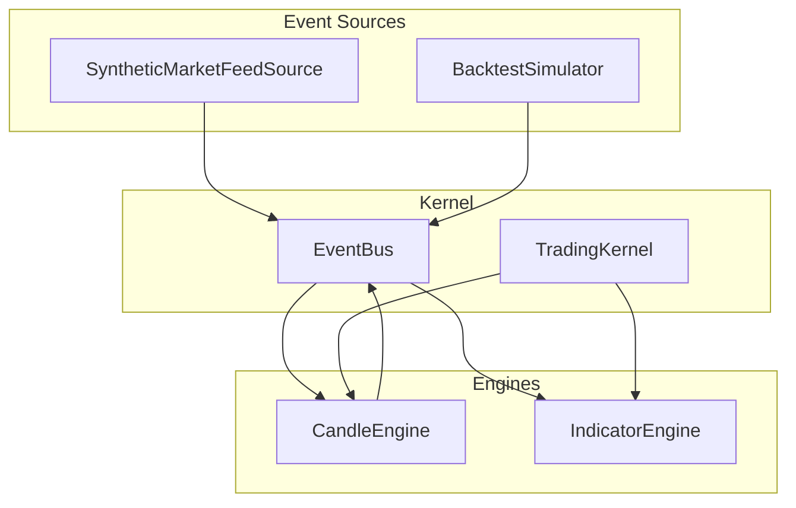
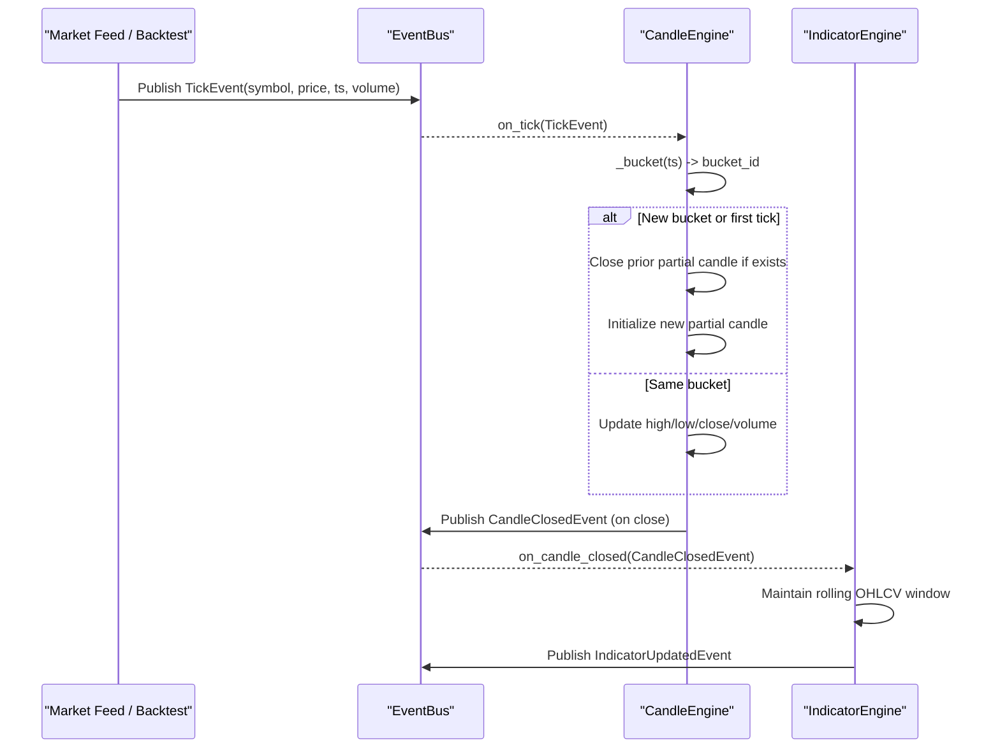
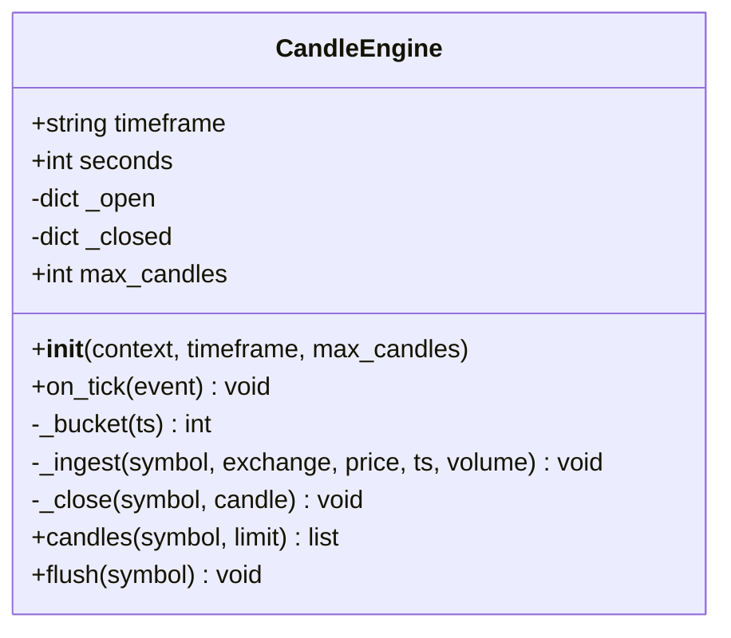
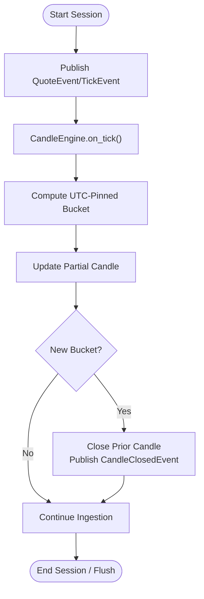
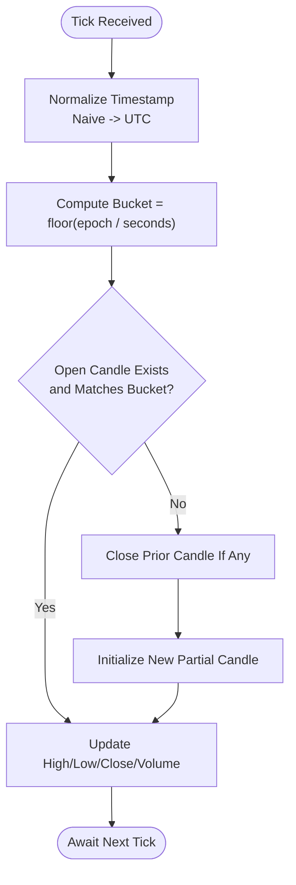
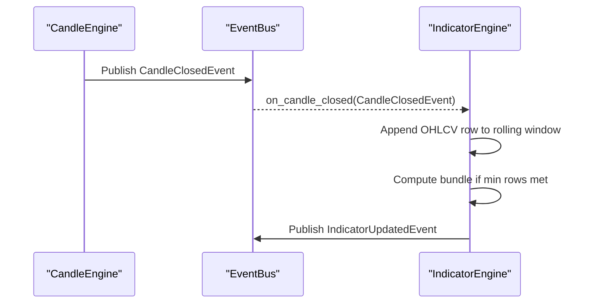
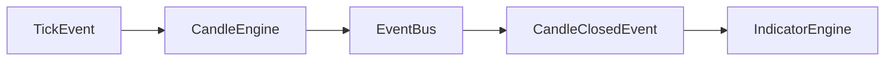

# Candle Engine

<cite>
**Referenced Files in This Document**
- [candle_engine.py](file://ntrade/engines/candle_engine.py)
- [market.py](file://ntrade/events/market.py)
- [session.py](file://ntrade/kernel/session.py)
- [indicator_engine.py](file://ntrade/engines/indicator_engine.py)
- [synthetic_feed.py](file://ntrade/sources/synthetic_feed.py)
- [simulator.py](file://ntrade/backtest/simulator.py)
- [test_candle_timezone.py](file://tests/test_candle_timezone.py)
- [test_candle_series.py](file://tests/test_candle_series.py)
</cite>

## Table of Contents
1. [Introduction](#introduction)
2. [Project Structure](#project-structure)
3. [Core Components](#core-components)
4. [Architecture Overview](#architecture-overview)
5. [Detailed Component Analysis](#detailed-component-analysis)
6. [Dependency Analysis](#dependency-analysis)
7. [Performance Considerations](#performance-considerations)
8. [Troubleshooting Guide](#troubleshooting-guide)
9. [Conclusion](#conclusion)
10. [Appendices](#appendices)

## Introduction
This document explains the CandleEngine responsible for aggregating tick data into OHLCV candles and emitting completed candle events to downstream consumers (indicators, strategies). It covers configurable timeframe support, candle formation logic, real-time updates, lifecycle from open to close, partial candle handling, timezone considerations, built-in presets, custom timeframes, integration with market data streams, examples for configuration and historical generation, and performance optimization for multi-symbol processing.

## Project Structure
The CandleEngine is part of the engine stack wired by the TradingKernel. Ticks flow from sources or replay feeds into the kernel’s event bus; the CandleEngine subscribes to ticks, aggregates them per symbol and timeframe, and publishes closed candles. Downstream engines consume these events.

**Diagram sources**
- [synthetic_feed.py:1-77](file://ntrade/sources/synthetic_feed.py#L1-L77)
- [simulator.py:116-143](file://ntrade/backtest/simulator.py#L116-L143)
- [session.py:79-86](file://ntrade/kernel/session.py#L79-L86)
- [candle_engine.py:19-30](file://ntrade/engines/candle_engine.py#L19-L30)
- [indicator_engine.py:18-26](file://ntrade/engines/indicator_engine.py#L18-L26)

**Section sources**
- [session.py:79-86](file://ntrade/kernel/session.py#L79-L86)
- [candle_engine.py:19-30](file://ntrade/engines/candle_engine.py#L19-L30)
- [synthetic_feed.py:1-77](file://ntrade/sources/synthetic_feed.py#L1-L77)
- [simulator.py:116-143](file://ntrade/backtest/simulator.py#L116-L143)

## Core Components
- CandleEngine: Aggregates TickEvent instances into OHLCV candles per symbol and timeframe. Emits CandleClosedEvent on bucket transitions and supports flushing partial candles at session end.
- Events: TickEvent (input), CandleClosedEvent (output), IndicatorUpdatedEvent (consumed downstream).
- Integration points: TradingKernel wires the CandleEngine into the event bus; synthetic feed and backtest simulator publish TickEvent inputs.

Key responsibilities:
- Timeframe validation and mapping to seconds
- Bucketing timestamps to fixed intervals
- Maintaining per-symbol open/partial candles
- Closing and buffering completed candles
- Publishing closed candles to the bus
- Querying recent closed candles

**Section sources**
- [candle_engine.py:14-30](file://ntrade/engines/candle_engine.py#L14-L30)
- [candle_engine.py:31-55](file://ntrade/engines/candle_engine.py#L31-L55)
- [candle_engine.py:56-82](file://ntrade/engines/candle_engine.py#L56-L82)
- [market.py:11-21](file://ntrade/events/market.py#L11-L21)
- [market.py:50-62](file://ntrade/events/market.py#L50-L62)

## Architecture Overview
The CandleEngine operates as a stateful aggregator within the kernel’s event-driven pipeline. It subscribes to TickEvent, maintains per-symbol partial candles keyed by time buckets, and publishes CandleClosedEvent when a new bucket begins. The indicator engine consumes these events to compute indicators and broadcast results.

**Diagram sources**
- [candle_engine.py:38-55](file://ntrade/engines/candle_engine.py#L38-L55)
- [candle_engine.py:56-70](file://ntrade/engines/candle_engine.py#L56-L70)
- [indicator_engine.py:28-51](file://ntrade/engines/indicator_engine.py#L28-L51)

## Detailed Component Analysis

### CandleEngine Class
Responsibilities:
- Validate and map timeframe to seconds
- Compute deterministic UTC-pinned buckets
- Aggregate ticks into per-symbol partial candles
- Emit closed candles and buffer bounded history
- Provide query API and flush for partials

Timeframe presets:
- Built-in presets include 1s, 5s, 1m, 5m, 15m, 1h, 1d via an internal mapping.

Custom timeframes:
- To add a custom timeframe, extend the internal mapping with the desired key and second value.

Bucketing and timezone:
- Naive timestamps are pinned to UTC before computing epoch-based buckets, ensuring host-timezone independence.

Partial candle handling:
- A new bucket closes the previous partial candle for the same symbol.
- Flush can be called explicitly to finalize any remaining partials.

Bounded storage:
- Closed candles are stored per symbol with a maximum length; older entries are trimmed.

**Diagram sources**
- [candle_engine.py:19-30](file://ntrade/engines/candle_engine.py#L19-L30)
- [candle_engine.py:31-55](file://ntrade/engines/candle_engine.py#L31-L55)
- [candle_engine.py:56-82](file://ntrade/engines/candle_engine.py#L56-L82)

**Section sources**
- [candle_engine.py:14-30](file://ntrade/engines/candle_engine.py#L14-L30)
- [candle_engine.py:31-55](file://ntrade/engines/candle_engine.py#L31-L55)
- [candle_engine.py:56-82](file://ntrade/engines/candle_engine.py#L56-L82)

### Event Types
- TickEvent: Input event containing symbol, exchange, price, quantity, side, kind, and timestamp.
- CandleClosedEvent: Output event with OHLCV fields, timeframe, and timestamp label.

These types define the contract between sources, the CandleEngine, and downstream consumers.

**Section sources**
- [market.py:11-21](file://ntrade/events/market.py#L11-L21)
- [market.py:50-62](file://ntrade/events/market.py#L50-L62)

### Integration with Market Data Streams
- Synthetic feed produces TickEvent and QuoteEvent per simulated second from 1m OHLCV frames.
- Backtest simulator publishes QuoteEvent and a closing TickEvent per bar.
- Both integrate seamlessly with the CandleEngine through the shared event bus.

**Diagram sources**
- [synthetic_feed.py:52-77](file://ntrade/sources/synthetic_feed.py#L52-L77)
- [simulator.py:124-143](file://ntrade/backtest/simulator.py#L124-L143)
- [candle_engine.py:38-55](file://ntrade/engines/candle_engine.py#L38-L55)

**Section sources**
- [synthetic_feed.py:1-77](file://ntrade/sources/synthetic_feed.py#L1-L77)
- [simulator.py:116-143](file://ntrade/backtest/simulator.py#L116-L143)

### Candle Lifecycle and Timezone Behavior
Lifecycle:
- Open: First tick in a bucket initializes a partial candle with open/high/low/close equal to the first price and zero volume.
- Update: Subsequent ticks update high, low, close, and accumulate volume.
- Close: When a tick arrives in a later bucket, the prior partial candle is closed and emitted.
- Flush: At session end, any remaining partial candles are closed and emitted.

Timezone:
- Buckets are computed using UTC-pinned epochs regardless of process timezone.
- Closed candle labels are naive UTC wall-clock timestamps derived from bucket boundaries.

**Diagram sources**
- [candle_engine.py:31-55](file://ntrade/engines/candle_engine.py#L31-L55)
- [candle_engine.py:56-70](file://ntrade/engines/candle_engine.py#L56-L70)

**Section sources**
- [test_candle_timezone.py:32-55](file://tests/test_candle_timezone.py#L32-L55)
- [candle_engine.py:31-70](file://ntrade/engines/candle_engine.py#L31-L70)

### Indicator Engine Consumption
The IndicatorEngine subscribes to CandleClosedEvent, maintains a rolling OHLCV window per symbol, computes indicator bundles, updates instrument read models, and broadcasts IndicatorUpdatedEvent.

**Diagram sources**
- [indicator_engine.py:28-51](file://ntrade/engines/indicator_engine.py#L28-L51)

**Section sources**
- [indicator_engine.py:18-55](file://ntrade/engines/indicator_engine.py#L18-L55)

### Historical Candle Generation and Usage
Historical OHLCV frames can be converted into deterministic tick streams for testing or simulation. The synthetic feed transforms 1m bars into per-second ticks, while the backtest simulator publishes QuoteEvent and a closing TickEvent per bar. These flows exercise the CandleEngine identically to live trading.

For domain-typed access to OHLCV data, CandleSeries wraps pandas DataFrames and exposes symbol/timeframe metadata with DataFrame escape hatches.

**Section sources**
- [synthetic_feed.py:1-77](file://ntrade/sources/synthetic_feed.py#L1-L77)
- [simulator.py:116-143](file://ntrade/backtest/simulator.py#L116-L143)
- [test_candle_series.py:1-98](file://tests/test_candle_series.py#L1-L98)

## Dependency Analysis
The CandleEngine depends on:
- EventBus for subscribing to TickEvent and publishing CandleClosedEvent
- TradingContext for bus access
- Events module for TickEvent and CandleClosedEvent definitions

Downstream dependencies:
- IndicatorEngine consumes CandleClosedEvent
- Strategies may subscribe to CandleClosedEvent or IndicatorUpdatedEvent

**Diagram sources**
- [candle_engine.py:19-30](file://ntrade/engines/candle_engine.py#L19-L30)
- [market.py:11-21](file://ntrade/events/market.py#L11-L21)
- [market.py:50-62](file://ntrade/events/market.py#L50-L62)
- [indicator_engine.py:28-51](file://ntrade/engines/indicator_engine.py#L28-L51)

**Section sources**
- [candle_engine.py:19-30](file://ntrade/engines/candle_engine.py#L19-L30)
- [indicator_engine.py:18-26](file://ntrade/engines/indicator_engine.py#L18-L26)

## Performance Considerations
- Per-symbol state: Each symbol maintains its own partial candle dictionary entry; ensure symbols are well-defined to avoid unbounded growth.
- Bounded buffers: Closed candles are trimmed to max_candles per symbol to prevent memory growth.
- Efficient bucketing: Epoch-based integer arithmetic ensures O(1) bucket computation per tick.
- Minimal allocations: Partial candle dictionaries are updated in place; only closed events are allocated and published.
- Multi-symbol throughput: For many symbols, consider batching ingestion where possible and avoiding heavy operations inside on_tick.
- Indicator engine window: Rolling windows are bounded by max_rows; keep this reasonable to control memory and CPU usage.

[No sources needed since this section provides general guidance]

## Troubleshooting Guide
Common issues and resolutions:
- Unsupported timeframe: Ensure timeframe is one of the supported presets or extend the internal mapping.
- Incorrect bucketing due to timezone: Verify timestamps are naive and treated as UTC; tests confirm UTC-pinned behavior.
- Missing closed candles: Ensure flush is called at session end to emit partial candles.
- Memory growth: Adjust max_candles and max_rows to bound memory usage.
- Indicator not updating: Confirm timeframe matches between CandleEngine and IndicatorEngine subscriptions.

**Section sources**
- [candle_engine.py:20-23](file://ntrade/engines/candle_engine.py#L20-L23)
- [test_candle_timezone.py:32-55](file://tests/test_candle_timezone.py#L32-L55)
- [candle_engine.py:76-82](file://ntrade/engines/candle_engine.py#L76-L82)

## Conclusion
The CandleEngine provides a robust, timezone-safe aggregation layer that converts tick streams into OHLCV candles with clear lifecycle semantics. It integrates cleanly with the kernel’s event bus, supports multiple symbols efficiently, and enables downstream analytics through standardized events. Proper configuration of timeframes, bounded buffers, and explicit flushing ensures correctness and performance across live, replay, and backtest modes.

[No sources needed since this section summarizes without analyzing specific files]

## Appendices

### Configuring Timeframes
- Built-in presets: 1s, 5s, 1m, 5m, 15m, 1h, 1d.
- Custom timeframes: Extend the internal mapping with your desired key and seconds value.

**Section sources**
- [candle_engine.py:14-16](file://ntrade/engines/candle_engine.py#L14-L16)

### Example: Candle Configuration and Usage
- Create a TradingKernel with a chosen timeframe; the CandleEngine is automatically instantiated.
- Publish TickEvent instances from a feed or simulator.
- Query closed candles via the engine’s API or listen to CandleClosedEvent on the bus.
- Call flush at session end to finalize partial candles.

**Section sources**
- [session.py:79-86](file://ntrade/kernel/session.py#L79-L86)
- [synthetic_feed.py:52-77](file://ntrade/sources/synthetic_feed.py#L52-L77)
- [simulator.py:124-143](file://ntrade/backtest/simulator.py#L124-L143)
- [candle_engine.py:72-82](file://ntrade/engines/candle_engine.py#L72-L82)

### Example: Historical Candle Generation
- Use the backtest simulator to run over an OHLCV frame; it publishes QuoteEvent and a closing TickEvent per bar.
- Alternatively, use the synthetic feed to generate per-second ticks from 1m bars.

**Section sources**
- [simulator.py:116-143](file://ntrade/backtest/simulator.py#L116-L143)
- [synthetic_feed.py:1-77](file://ntrade/sources/synthetic_feed.py#L1-L77)

### Example: Domain-Typed OHLCV Access
- Wrap pandas DataFrames with CandleSeries to access symbol/timeframe metadata and delegate DataFrame methods.

**Section sources**
- [test_candle_series.py:1-98](file://tests/test_candle_series.py#L1-L98)