# Engine Stack

<cite>
**Referenced Files in This Document**
- [engines/__init__.py](file://ntrade/engines/__init__.py)
- [market_engine.py](file://ntrade/engines/market_engine.py)
- [candle_engine.py](file://ntrade/engines/candle_engine.py)
- [indicator_engine.py](file://ntrade/engines/indicator_engine.py)
- [strategy_engine.py](file://ntrade/engines/strategy_engine.py)
- [risk_engine.py](file://ntrade/engines/risk_engine.py)
- [order_engine.py](file://ntrade/engines/order_engine.py)
- [portfolio_engine.py](file://ntrade/engines/portfolio_engine.py)
- [position_sync.py](file://ntrade/engines/position_sync.py)
- [events/__init__.py](file://ntrade/events/__init__.py)
- [events/market.py](file://ntrade/events/market.py)
- [events/order.py](file://ntrade/events/order.py)
- [events/portfolio.py](file://ntrade/events/portfolio.py)
- [events/risk.py](file://ntrade/events/risk.py)
- [event_bus.py](file://ntrade/kernel/event_bus.py)
</cite>

## Table of Contents
1. [Introduction](#introduction)
2. [Project Structure](#project-structure)
3. [Core Components](#core-components)
4. [Architecture Overview](#architecture-overview)
5. [Detailed Component Analysis](#detailed-component-analysis)
6. [Dependency Analysis](#dependency-analysis)
7. [Performance Considerations](#performance-considerations)
8. [Troubleshooting Guide](#troubleshooting-guide)
9. [Conclusion](#conclusion)
10. [Appendices](#appendices)

## Introduction
This document explains the engine stack architecture that processes market data, aggregates it into candles, computes indicators, generates and screens trading signals, executes orders, updates portfolio state, and reconciles broker positions with kernel state. The system is event-driven: each engine subscribes to specific events, transforms or enforces them, and publishes downstream events via a thread-safe event bus.

## Project Structure
The engines live under ntrade/engines and communicate through canonical events defined under ntrade/events. The synchronous EventBus provides publish/subscribe semantics with history recording and exception isolation.

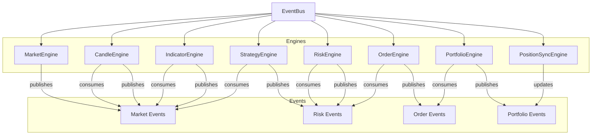

**Diagram sources**
- [engines/__init__.py:1-17](file://ntrade/engines/__init__.py#L1-L17)
- [events/__init__.py:1-44](file://ntrade/events/__init__.py#L1-L44)
- [event_bus.py:1-81](file://ntrade/kernel/event_bus.py#L1-L81)

**Section sources**
- [engines/__init__.py:1-17](file://ntrade/engines/__init__.py#L1-L17)
- [events/__init__.py:1-44](file://ntrade/events/__init__.py#L1-L44)
- [event_bus.py:1-81](file://ntrade/kernel/event_bus.py#L1-L81)

## Core Components
- MarketEngine: Normalizes raw ticks/quotes/depth into instrument read-model state and broadcasts QuoteUpdatedEvent.
- CandleEngine: Aggregates ticks into OHLCV candles per timeframe; emits CandleClosedEvent on bucket transitions and supports flush at session end.
- IndicatorEngine: Maintains rolling OHLCV windows per symbol, computes indicator bundles, updates instrument state, and broadcasts IndicatorUpdatedEvent.
- StrategyEngine: Dispatches kernel events to registered strategies via hook methods; strategies emit trade signals as SignalGeneratedEvent.
- RiskEngine: Screens signals against static limits and circuit breakers (daily loss, drawdown, price deviation), publishing approved/rejected events and halt/resume control.
- OrderEngine (OMS): Converts approved signals into order intents, submits via router, and republishes rejections when applicable.
- PortfolioEngine: Updates positions and account balance on fills, emitting PositionUpdatedEvent and BalanceChangedEvent.
- PositionSyncEngine: Reconciles broker-reported positions and cash into kernel state safely, publishing canonical events for consistency.

**Section sources**
- [market_engine.py:1-64](file://ntrade/engines/market_engine.py#L1-L64)
- [candle_engine.py:1-82](file://ntrade/engines/candle_engine.py#L1-L82)
- [indicator_engine.py:1-55](file://ntrade/engines/indicator_engine.py#L1-L55)
- [strategy_engine.py:1-102](file://ntrade/engines/strategy_engine.py#L1-L102)
- [risk_engine.py:1-141](file://ntrade/engines/risk_engine.py#L1-L141)
- [order_engine.py:1-34](file://ntrade/engines/order_engine.py#L1-L34)
- [portfolio_engine.py:1-69](file://ntrade/engines/portfolio_engine.py#L1-L69)
- [position_sync.py:1-110](file://ntrade/engines/position_sync.py#L1-L110)

## Architecture Overview
The pipeline flows from market data ingestion through aggregation, analysis, signal generation, risk screening, execution, and portfolio updates. All communication is decoupled via the EventBus.

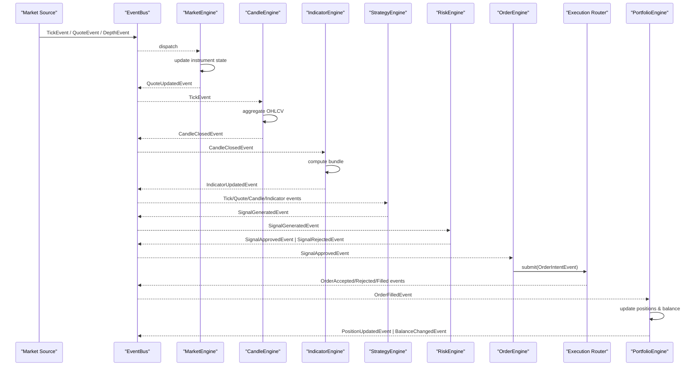

**Diagram sources**
- [market_engine.py:1-64](file://ntrade/engines/market_engine.py#L1-L64)
- [candle_engine.py:1-82](file://ntrade/engines/candle_engine.py#L1-L82)
- [indicator_engine.py:1-55](file://ntrade/engines/indicator_engine.py#L1-L55)
- [strategy_engine.py:1-102](file://ntrade/engines/strategy_engine.py#L1-L102)
- [risk_engine.py:1-141](file://ntrade/engines/risk_engine.py#L1-L141)
- [order_engine.py:1-34](file://ntrade/engines/order_engine.py#L1-L34)
- [portfolio_engine.py:1-69](file://ntrade/engines/portfolio_engine.py#L1-L69)
- [event_bus.py:1-81](file://ntrade/kernel/event_bus.py#L1-L81)

## Detailed Component Analysis

### MarketEngine
- Role: Consumes TickEvent, QuoteEvent, DepthEvent; updates instrument read-model state; publishes QuoteUpdatedEvent for downstream consumers.
- Key behaviors:
  - Normalizes incoming events into domain objects and applies them to the instrument’s internal quote/stream state.
  - Ensures downstream engines see a single normalized stream via QuoteUpdatedEvent.
- Event flow:
  - on_tick -> instrument ingest -> QuoteUpdatedEvent
  - on_quote -> apply_quote -> QuoteUpdatedEvent
  - on_depth -> apply_depth

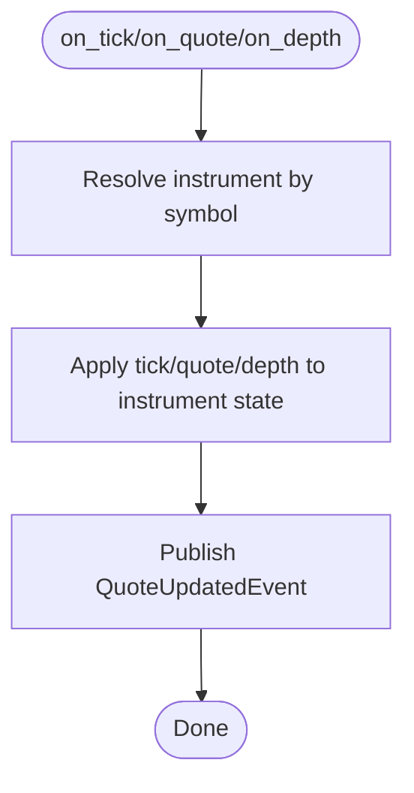

**Diagram sources**
- [market_engine.py:1-64](file://ntrade/engines/market_engine.py#L1-L64)

**Section sources**
- [market_engine.py:1-64](file://ntrade/engines/market_engine.py#L1-L64)
- [events/market.py:1-83](file://ntrade/events/market.py#L1-L83)

### CandleEngine
- Role: Aggregates ticks into OHLCV candles per configured timeframe; emits CandleClosedEvent when a new bucket starts; supports flushing partial candles at session end.
- Key behaviors:
  - Buckets timestamps by timeframe seconds; maintains open candle per symbol.
  - Caps closed-candle buffer size via max_candles.
  - Flush closes any remaining partial candles.
- Timeframes: Supports multiple intervals including seconds, minutes, hours, and days.

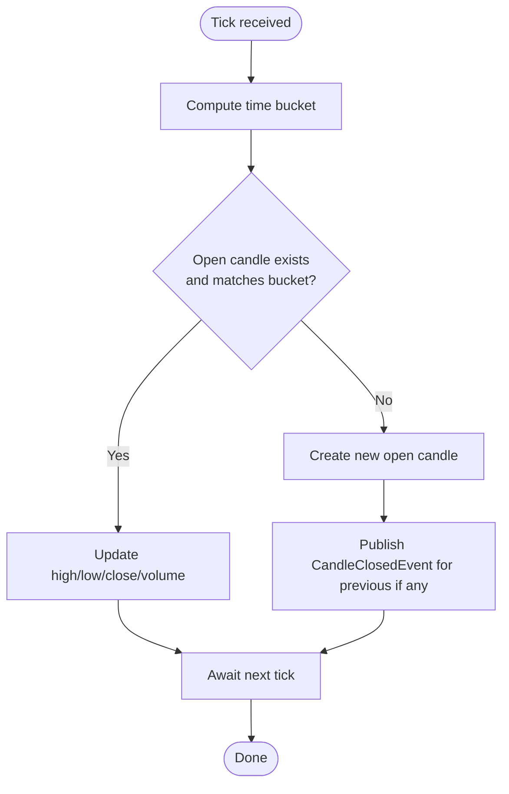

**Diagram sources**
- [candle_engine.py:1-82](file://ntrade/engines/candle_engine.py#L1-L82)

**Section sources**
- [candle_engine.py:1-82](file://ntrade/engines/candle_engine.py#L1-L82)
- [events/market.py:1-83](file://ntrade/events/market.py#L1-L83)

### IndicatorEngine
- Role: Recomputes indicator bundles on each CandleClosedEvent for matching timeframe; updates instrument indicators; broadcasts IndicatorUpdatedEvent.
- Key behaviors:
  - Maintains rolling OHLCV rows per symbol up to max_rows.
  - Requires minimum rows before computing to avoid incomplete results.
  - Uses pandas DataFrame for efficient computation and returns a bundle dict.

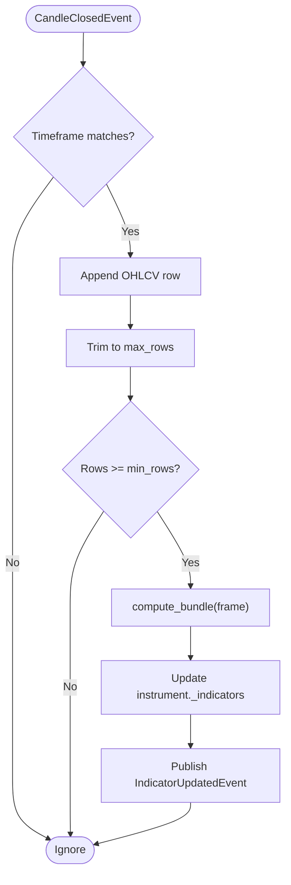

**Diagram sources**
- [indicator_engine.py:1-55](file://ntrade/engines/indicator_engine.py#L1-L55)

**Section sources**
- [indicator_engine.py:1-55](file://ntrade/engines/indicator_engine.py#L1-L55)
- [events/market.py:1-83](file://ntrade/events/market.py#L1-L83)

### StrategyEngine
- Role: Fans kernel events to registered strategies via hook methods; strategies emit signals using emit_signal(); errors in strategy hooks are swallowed to protect the bus.
- Key behaviors:
  - Subscribes to multiple event types and dispatches to corresponding hooks.
  - Provides enable/disable toggling and dynamic registration/removal.
  - Emits SignalGeneratedEvent with timestamp from context clock.

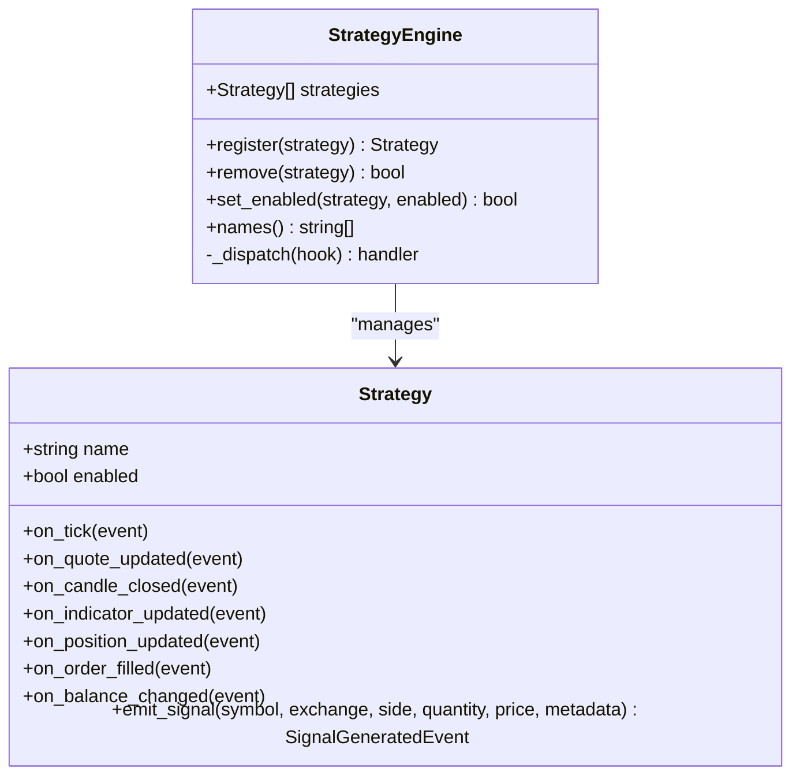

**Diagram sources**
- [strategy_engine.py:1-102](file://ntrade/engines/strategy_engine.py#L1-L102)

**Section sources**
- [strategy_engine.py:1-102](file://ntrade/engines/strategy_engine.py#L1-L102)
- [events/risk.py:1-52](file://ntrade/events/risk.py#L1-L52)

### RiskEngine
- Role: Screens signals before they become order intents; enforces static limits and circuit breakers; supports halt/resume with events.
- Key behaviors:
  - Static checks: allowlist, quantity, notional, position count.
  - Circuit breakers: daily-loss cap, max drawdown percentage, price deviation guard.
  - Periodic check() allows mid-session tripping even without signals.
  - Publishes RiskHaltedEvent/RiskResumedEvent; downstream components can react to these.

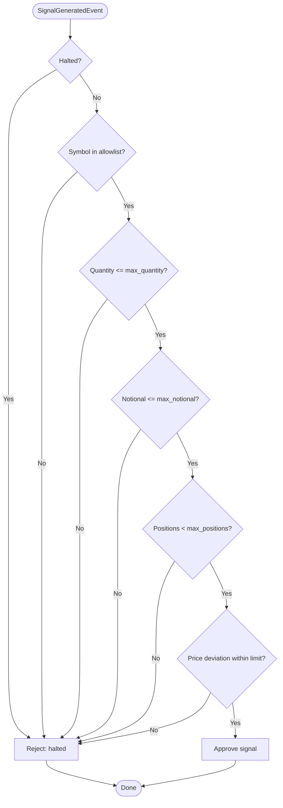

**Diagram sources**
- [risk_engine.py:1-141](file://ntrade/engines/risk_engine.py#L1-L141)

**Section sources**
- [risk_engine.py:1-141](file://ntrade/engines/risk_engine.py#L1-L141)
- [events/risk.py:1-52](file://ntrade/events/risk.py#L1-L52)

### OrderEngine (OMS)
- Role: Materializes approved signals into order intents; submits via router; republishes rejections.
- Key behaviors:
  - Converts SignalApprovedEvent into OrderIntentEvent with type determined by presence of price.
  - Delegates submission to router; relays OrderRejectedEvent if returned.

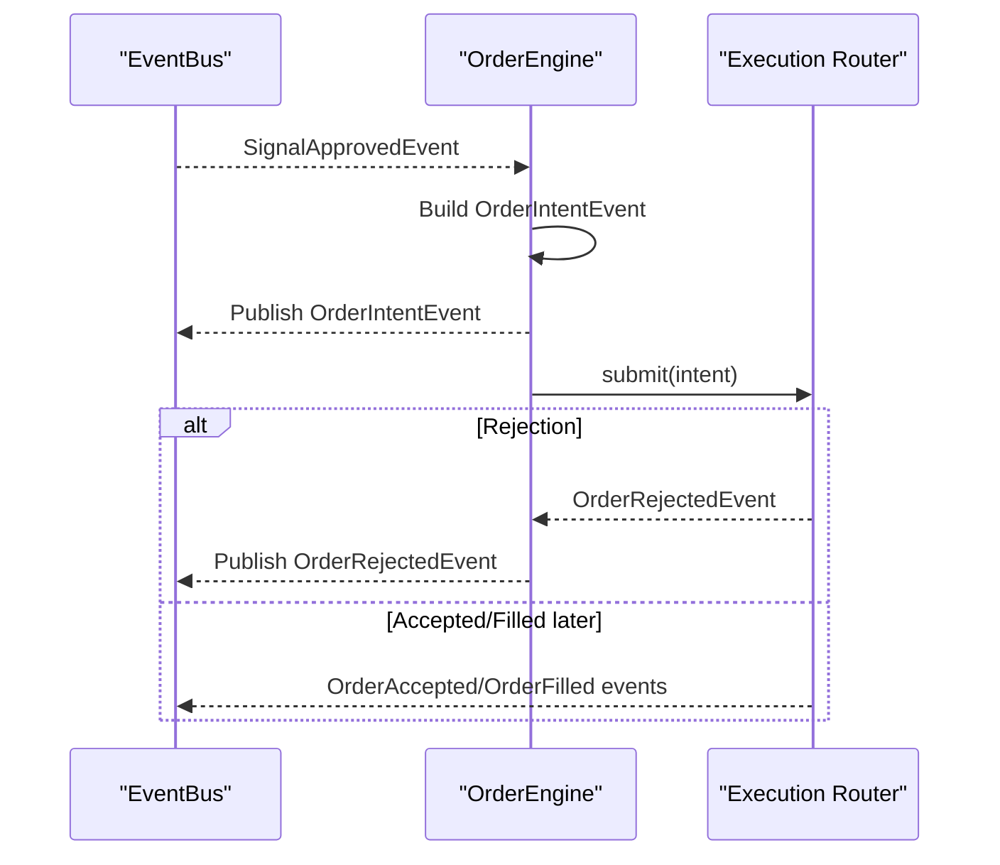

**Diagram sources**
- [order_engine.py:1-34](file://ntrade/engines/order_engine.py#L1-L34)
- [events/order.py:1-91](file://ntrade/events/order.py#L1-L91)

**Section sources**
- [order_engine.py:1-34](file://ntrade/engines/order_engine.py#L1-L34)
- [events/order.py:1-91](file://ntrade/events/order.py#L1-L91)

### PortfolioEngine
- Role: Maintains portfolio/account read models from fills; nets positions, averages entry prices, updates cash with charges, and publishes canonical events.
- Key behaviors:
  - Creates or updates positions based on fill side and quantity.
  - Deducts/adds notional and statutory charges on buys/sells.
  - Emits PositionUpdatedEvent and BalanceChangedEvent after updates.

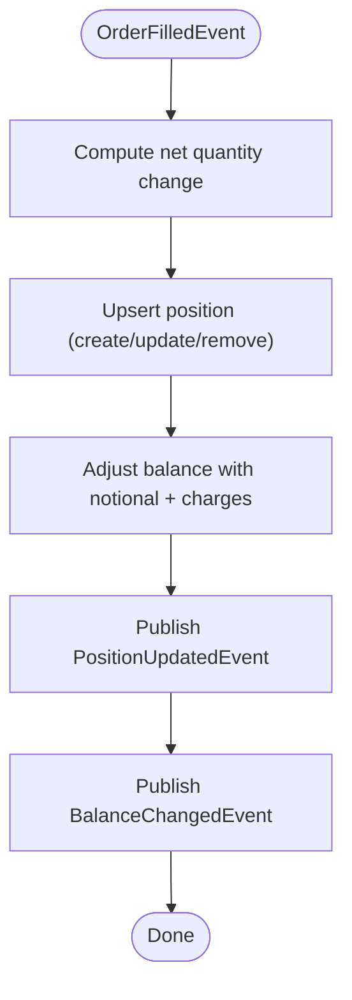

**Diagram sources**
- [portfolio_engine.py:1-69](file://ntrade/engines/portfolio_engine.py#L1-L69)
- [events/portfolio.py:1-27](file://ntrade/events/portfolio.py#L1-L27)

**Section sources**
- [portfolio_engine.py:1-69](file://ntrade/engines/portfolio_engine.py#L1-L69)
- [events/portfolio.py:1-27](file://ntrade/events/portfolio.py#L1-L27)

### PositionSyncEngine
- Role: Reconciles broker-reported positions and cash into kernel state; safe against transient failures; publishes canonical events.
- Key behaviors:
  - Upserts positions reported by broker; drops local positions no longer reported.
  - Overwrites account balance with broker value when available.
  - Never wipes state on transient errors; keeps previous state intact.

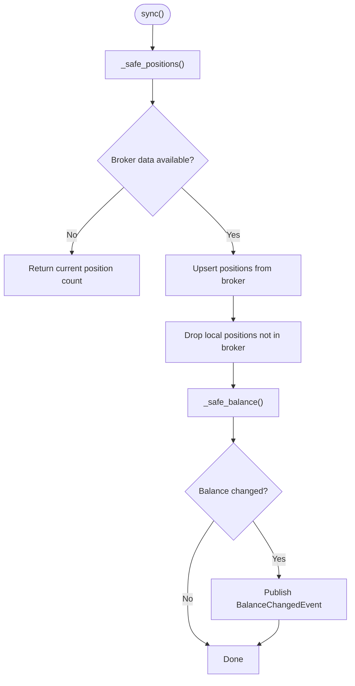

**Diagram sources**
- [position_sync.py:1-110](file://ntrade/engines/position_sync.py#L1-L110)
- [events/portfolio.py:1-27](file://ntrade/events/portfolio.py#L1-L27)

**Section sources**
- [position_sync.py:1-110](file://ntrade/engines/position_sync.py#L1-L110)
- [events/portfolio.py:1-27](file://ntrade/events/portfolio.py#L1-L27)

## Dependency Analysis
Engines depend on the EventBus for decoupled communication and on domain models for state representation. Event definitions provide a stable contract across subsystems.

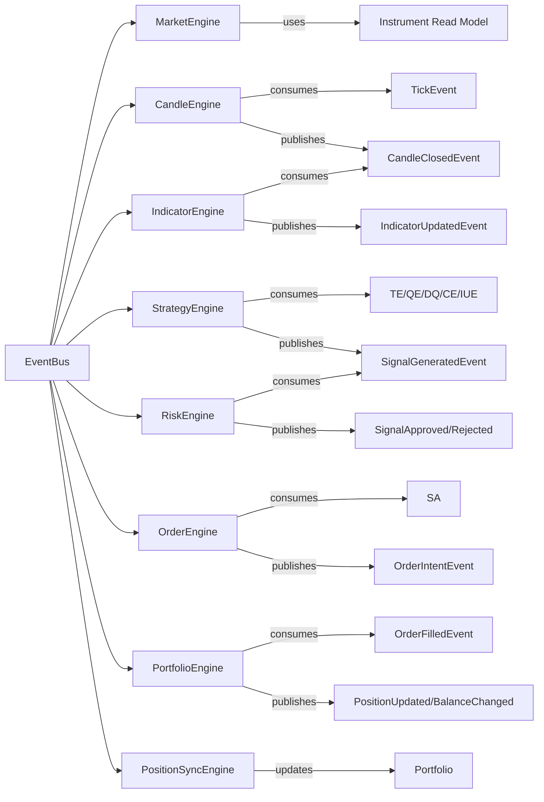

**Diagram sources**
- [events/__init__.py:1-44](file://ntrade/events/__init__.py#L1-L44)
- [event_bus.py:1-81](file://ntrade/kernel/event_bus.py#L1-L81)
- [market_engine.py:1-64](file://ntrade/engines/market_engine.py#L1-L64)
- [candle_engine.py:1-82](file://ntrade/engines/candle_engine.py#L1-L82)
- [indicator_engine.py:1-55](file://ntrade/engines/indicator_engine.py#L1-L55)
- [strategy_engine.py:1-102](file://ntrade/engines/strategy_engine.py#L1-L102)
- [risk_engine.py:1-141](file://ntrade/engines/risk_engine.py#L1-L141)
- [order_engine.py:1-34](file://ntrade/engines/order_engine.py#L1-L34)
- [portfolio_engine.py:1-69](file://ntrade/engines/portfolio_engine.py#L1-L69)
- [position_sync.py:1-110](file://ntrade/engines/position_sync.py#L1-L110)

**Section sources**
- [events/__init__.py:1-44](file://ntrade/events/__init__.py#L1-L44)
- [event_bus.py:1-81](file://ntrade/kernel/event_bus.py#L1-L81)

## Performance Considerations
- Event bus serialization: The EventBus uses a reentrant lock during dispatch to ensure consistent reads/writes across threads; this prevents torn state but serializes handler execution.
- Buffering and limits:
  - CandleEngine caps closed-candle buffers via max_candles to bound memory.
  - IndicatorEngine limits rolling rows via max_rows and only computes after _MIN_ROWS to reduce churn.
- Pandas usage: IndicatorEngine builds DataFrames from recent rows; keep window sizes reasonable to avoid overhead.
- Risk checks: check() enables periodic evaluation of circuit breakers without waiting for signals, reducing latency in halting conditions.
- Instrument updates: MarketEngine normalizes events once and broadcasts a single QuoteUpdatedEvent to minimize redundant processing downstream.

[No sources needed since this section provides general guidance]

## Troubleshooting Guide
- Strategies not receiving events:
  - Verify subscriptions in StrategyEngine._HOOKS and ensure strategies implement the expected hooks.
- Signals rejected unexpectedly:
  - Inspect RiskEngine configuration (allowlist, quantity/notional limits, position counts, price deviation).
  - Check if RiskEngine is halted due to daily loss or drawdown; call resume() when appropriate.
- Missing candles or indicators:
  - Confirm timeframe alignment between CandleEngine and IndicatorEngine.
  - Ensure sufficient historical rows have been ingested before computations start.
- Portfolio inconsistencies:
  - Use PositionSyncEngine.sync() to reconcile broker state; transient failures will preserve existing state.
- Event bus exceptions:
  - Handler exceptions are logged and swallowed; inspect logs for failing subscribers.

**Section sources**
- [strategy_engine.py:1-102](file://ntrade/engines/strategy_engine.py#L1-L102)
- [risk_engine.py:1-141](file://ntrade/engines/risk_engine.py#L1-L141)
- [candle_engine.py:1-82](file://ntrade/engines/candle_engine.py#L1-L82)
- [indicator_engine.py:1-55](file://ntrade/engines/indicator_engine.py#L1-L55)
- [position_sync.py:1-110](file://ntrade/engines/position_sync.py#L1-L110)
- [event_bus.py:1-81](file://ntrade/kernel/event_bus.py#L1-L81)

## Conclusion
The engine stack implements a robust, event-driven trading pipeline where each component has a clear responsibility and communicates via immutable events. Market data flows through normalization, aggregation, analysis, signal generation, risk screening, execution, and portfolio updates while maintaining safety and performance through bounded buffers, circuit breakers, and a serialized event bus.

[No sources needed since this section summarizes without analyzing specific files]

## Appendices

### Example: Engine Configuration
- MarketEngine: Initialize with context; automatically subscribes to market events.
- CandleEngine: Configure timeframe and optional max_candles.
- IndicatorEngine: Configure timeframe, max_rows, and indicator parameters.
- StrategyEngine: Register strategies; toggle enabled flags; remove dynamically.
- RiskEngine: Set limits (quantity, notional, positions), allowlist, strategy filter, and circuit breakers (daily loss, drawdown, price deviation).
- OrderEngine: Provide context and execution router; handles intent creation and rejection relay.
- PortfolioEngine: Initialize with context; reacts to fills.
- PositionSyncEngine: Provide context and broker instance; call sync() periodically.

**Section sources**
- [market_engine.py:1-64](file://ntrade/engines/market_engine.py#L1-L64)
- [candle_engine.py:1-82](file://ntrade/engines/candle_engine.py#L1-L82)
- [indicator_engine.py:1-55](file://ntrade/engines/indicator_engine.py#L1-L55)
- [strategy_engine.py:1-102](file://ntrade/engines/strategy_engine.py#L1-L102)
- [risk_engine.py:1-141](file://ntrade/engines/risk_engine.py#L1-L141)
- [order_engine.py:1-34](file://ntrade/engines/order_engine.py#L1-L34)
- [portfolio_engine.py:1-69](file://ntrade/engines/portfolio_engine.py#L1-L69)
- [position_sync.py:1-110](file://ntrade/engines/position_sync.py#L1-L110)

### Example: Custom Engine Development
- Create a new engine class that initializes with context and subscribes to relevant events via context.bus.subscribe.
- Implement handlers that transform or enforce constraints, then publish downstream events.
- Avoid direct coupling between engines; rely on the EventBus for decoupling.
- Handle exceptions gracefully to prevent bus disruption.

**Section sources**
- [event_bus.py:1-81](file://ntrade/kernel/event_bus.py#L1-L81)
- [strategy_engine.py:1-102](file://ntrade/engines/strategy_engine.py#L1-L102)

### Example: Performance Optimization Techniques
- Tune max_candles and max_rows to balance memory vs. responsiveness.
- Minimize heavy computations inside hot paths; batch where possible.
- Use timeframe-specific engines to avoid unnecessary processing.
- Leverage check() in RiskEngine for proactive halts without waiting for signals.

**Section sources**
- [candle_engine.py:1-82](file://ntrade/engines/candle_engine.py#L1-L82)
- [indicator_engine.py:1-55](file://ntrade/engines/indicator_engine.py#L1-L55)
- [risk_engine.py:1-141](file://ntrade/engines/risk_engine.py#L1-L141)