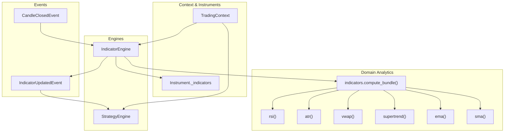
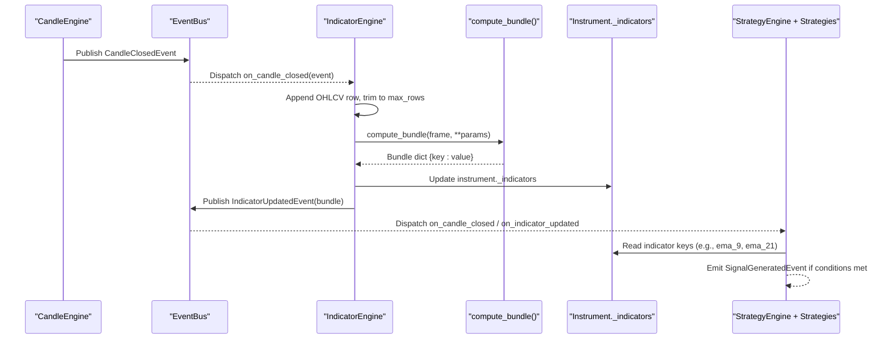
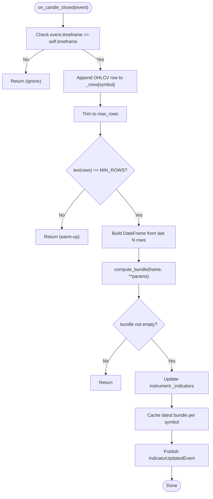
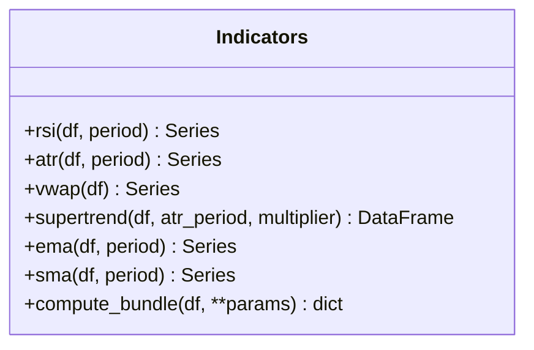
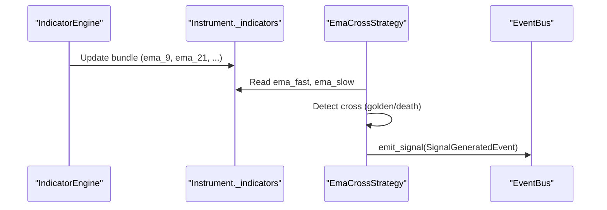
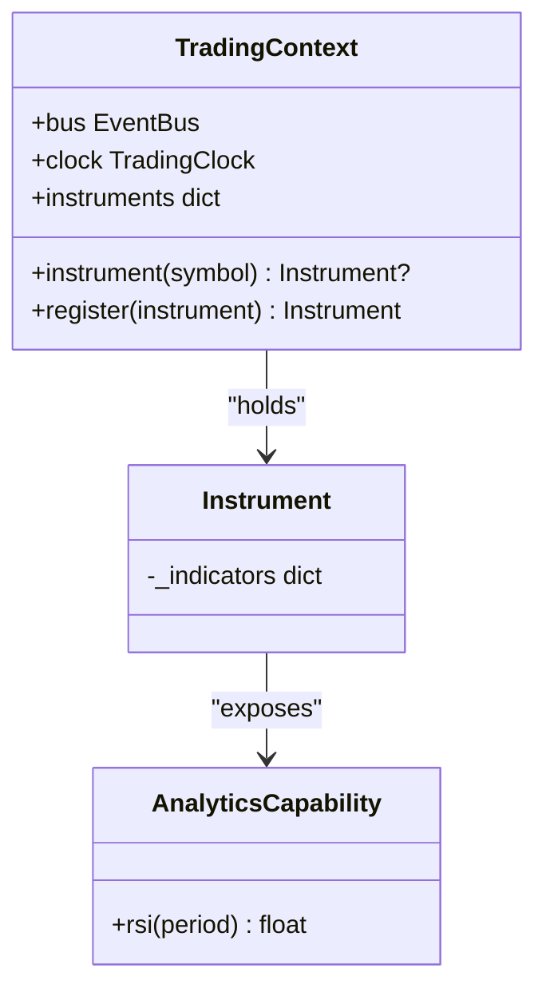
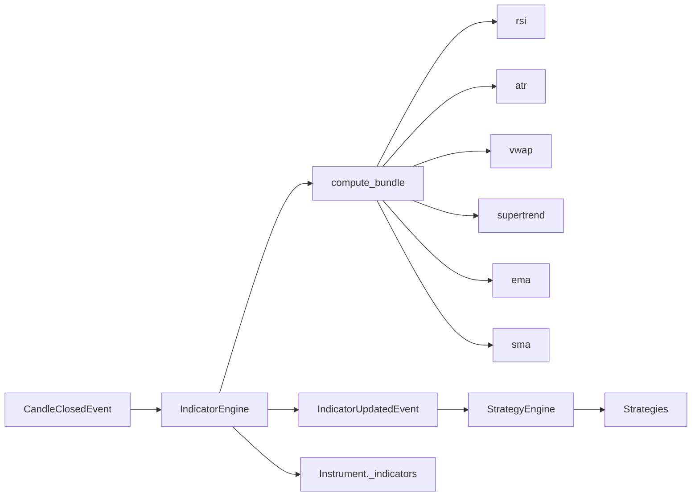

# Indicator Engine

<cite>
**Referenced Files in This Document**
- [indicator_engine.py](file://ntrade/engines/indicator_engine.py)
- [indicators.py](file://ntrade/domain/analytics/indicators.py)
- [market.py](file://ntrade/events/market.py)
- [strategy_engine.py](file://ntrade/engines/strategy_engine.py)
- [strategies.py](file://ntrade/engines/strategies.py)
- [context.py](file://ntrade/kernel/context.py)
- [capabilities.py](file://ntrade/domain/instruments/capabilities.py)
- [test_indicators.py](file://tests/test_indicators.py)
- [ema_cross_run.py](file://scripts/ema_cross_run.py)
</cite>

## Table of Contents
1. [Introduction](#introduction)
2. [Project Structure](#project-structure)
3. [Core Components](#core-components)
4. [Architecture Overview](#architecture-overview)
5. [Detailed Component Analysis](#detailed-component-analysis)
6. [Dependency Analysis](#dependency-analysis)
7. [Performance Considerations](#performance-considerations)
8. [Troubleshooting Guide](#troubleshooting-guide)
9. [Conclusion](#conclusion)
10. [Appendices](#appendices)

## Introduction
This document explains the IndicatorEngine that computes technical indicators on market data streams. It covers:
- The indicator registration and computation pipeline
- Built-in indicators (RSI, ATR, VWAP, SuperTrend, EMA, SMA)
- Custom indicator development patterns
- Caching mechanisms and multi-symbol support
- Indicator parameters, signal generation, and integration with strategy engines
- Examples for creating custom indicators, optimizing calculations, and debugging outputs

The system is event-driven: CandleClosedEvent triggers indicator recomputation, which updates instrument read-model state and broadcasts IndicatorUpdatedEvent consumed by strategies.

## Project Structure
Key files involved in the indicator pipeline:
- Event definitions for candle closes and indicator updates
- Indicator engine that maintains per-symbol OHLCV windows and publishes updated bundles
- Domain analytics module implementing indicator functions and a bundle composer
- Strategy base class and example strategy consuming indicator values
- Context and instrument capabilities used to store and read indicator values

**Diagram sources**
- [indicator_engine.py:18-54](file://ntrade/engines/indicator_engine.py#L18-L54)
- [indicators.py:148-193](file://ntrade/domain/analytics/indicators.py#L148-L193)
- [market.py:50-83](file://ntrade/events/market.py#L50-L83)
- [strategy_engine.py:48-102](file://ntrade/engines/strategy_engine.py#L48-L102)
- [context.py:17-79](file://ntrade/kernel/context.py#L17-L79)

**Section sources**
- [indicator_engine.py:18-54](file://ntrade/engines/indicator_engine.py#L18-L54)
- [indicators.py:148-193](file://ntrade/domain/analytics/indicators.py#L148-L193)
- [market.py:50-83](file://ntrade/events/market.py#L50-L83)
- [strategy_engine.py:48-102](file://ntrade/engines/strategy_engine.py#L48-L102)
- [context.py:17-79](file://ntrade/kernel/context.py#L17-L79)

## Core Components
- IndicatorEngine: Subscribes to CandleClosedEvent, maintains per-symbol rolling OHLCV window, computes indicator bundle, updates instrument state, and publishes IndicatorUpdatedEvent.
- compute_bundle: Pure function composing multiple indicators over an OHLCV DataFrame; returns a flat dictionary keyed by canonical names.
- Indicator functions: rsi, atr, vwap, supertrend, ema, sma implemented as pandas-based series computations.
- Strategy base and EmaCrossStrategy: Consume indicator values from instrument._indicators or IndicatorUpdatedEvent to generate signals.

**Section sources**
- [indicator_engine.py:18-54](file://ntrade/engines/indicator_engine.py#L18-L54)
- [indicators.py:15-93](file://ntrade/domain/analytics/indicators.py#L15-L93)
- [indicators.py:148-193](file://ntrade/domain/analytics/indicators.py#L148-L193)
- [strategies.py:13-66](file://ntrade/engines/strategies.py#L13-L66)

## Architecture Overview
The indicator pipeline is event-driven and decoupled:
- CandleEngine emits CandleClosedEvent when a timeframe completes.
- IndicatorEngine consumes the event, builds a DataFrame from its rolling window, calls compute_bundle, updates instrument._indicators, and publishes IndicatorUpdatedEvent.
- Strategies subscribe to events via StrategyEngine and read indicator values from the instrument’s _indicators dict or on_indicator_updated hook.

**Diagram sources**
- [indicator_engine.py:28-51](file://ntrade/engines/indicator_engine.py#L28-L51)
- [indicators.py:148-193](file://ntrade/domain/analytics/indicators.py#L148-L193)
- [market.py:50-83](file://ntrade/events/market.py#L50-L83)
- [strategy_engine.py:48-102](file://ntrade/engines/strategy_engine.py#L48-L102)

## Detailed Component Analysis

### IndicatorEngine
Responsibilities:
- Timeframe filtering: Only processes candles matching configured timeframe.
- Rolling window: Per-symbol list of OHLCV rows, trimmed to max_rows.
- Computation: Builds a DataFrame from recent rows (up to last 500), calls compute_bundle with engine params.
- State projection: Updates instrument._indicators and keeps latest bundle per symbol.
- Event publishing: Emits IndicatorUpdatedEvent with symbol, exchange, timeframe, indicators, and timestamp.

Key behaviors:
- Warm-up guard: Skips computation until minimum number of rows is reached.
- Error isolation: compute_bundle captures exceptions per indicator and logs warnings.
- Multi-symbol: Separate rolling windows per symbol.

**Diagram sources**
- [indicator_engine.py:28-51](file://ntrade/engines/indicator_engine.py#L28-L51)

**Section sources**
- [indicator_engine.py:18-54](file://ntrade/engines/indicator_engine.py#L18-L54)

### Indicator Functions and Bundle
Built-in indicators:
- RSI: Smoothed gains/losses with exponential weighting; clipped to [0, 100].
- ATR: True range smoothed exponentially.
- VWAP: Cumulative typical price weighted by volume.
- SuperTrend: Adds a directional column based on ATR bands and price action.
- EMA/SMA: Moving averages over close.

Bundle composition:
- Parameters: rsi_period, atr_period, st_period, st_mult, ema_periods, sma_periods.
- Canonical keys: rsi_N, atr_N, vwap, stx_A_B, ema_X, sma_Y.
- Robustness: Each indicator computed inside try/except; NaN values skipped; warnings logged on failure.

**Diagram sources**
- [indicators.py:15-93](file://ntrade/domain/analytics/indicators.py#L15-L93)
- [indicators.py:148-193](file://ntrade/domain/analytics/indicators.py#L148-L193)

**Section sources**
- [indicators.py:15-93](file://ntrade/domain/analytics/indicators.py#L15-L93)
- [indicators.py:148-193](file://ntrade/domain/analytics/indicators.py#L148-L193)
- [test_indicators.py:23-122](file://tests/test_indicators.py#L23-L122)

### Strategy Integration
Strategies consume indicator values through two primary paths:
- Reading from instrument._indicators in on_candle_closed (as done by EmaCrossStrategy).
- Optionally subscribing to IndicatorUpdatedEvent via on_indicator_updated hook.

EmaCrossStrategy example:
- Reads fast and slow EMA values from bundle keys (e.g., ema_9, ema_21).
- Detects golden/death crosses and emits signals respecting position constraints.

**Diagram sources**
- [strategies.py:38-66](file://ntrade/engines/strategies.py#L38-L66)
- [strategy_engine.py:36-45](file://ntrade/engines/strategy_engine.py#L36-L45)

**Section sources**
- [strategies.py:13-66](file://ntrade/engines/strategies.py#L13-L66)
- [strategy_engine.py:18-45](file://ntrade/engines/strategy_engine.py#L18-L45)

### Context and Instrument Storage
- TradingContext provides bus, clock, instruments registry, and thread-safe accessors.
- Instrument stores indicator values in _indicators dict; IndicatorEngine updates this dict directly.
- AnalyticsCapability exposes convenience methods to read indicator values by canonical key.

**Diagram sources**
- [context.py:17-79](file://ntrade/kernel/context.py#L17-L79)
- [capabilities.py:269-277](file://ntrade/domain/instruments/capabilities.py#L269-L277)

**Section sources**
- [context.py:17-79](file://ntrade/kernel/context.py#L17-L79)
- [capabilities.py:269-277](file://ntrade/domain/instruments/capabilities.py#L269-L277)

## Dependency Analysis
- IndicatorEngine depends on:
  - Events: CandleClosedEvent, IndicatorUpdatedEvent
  - Domain analytics: compute_bundle
  - Context: bus and instrument lookup
- compute_bundle depends on:
  - Individual indicator functions (RSI, ATR, VWAP, SuperTrend, EMA, SMA)
- Strategies depend on:
  - StrategyEngine dispatching events
  - Instrument._indicators for reading canonical keys

**Diagram sources**
- [indicator_engine.py:12-13](file://ntrade/engines/indicator_engine.py#L12-L13)
- [indicators.py:148-193](file://ntrade/domain/analytics/indicators.py#L148-L193)
- [market.py:50-83](file://ntrade/events/market.py#L50-L83)
- [strategy_engine.py:48-102](file://ntrade/engines/strategy_engine.py#L48-L102)

**Section sources**
- [indicator_engine.py:12-13](file://ntrade/engines/indicator_engine.py#L12-L13)
- [indicators.py:148-193](file://ntrade/domain/analytics/indicators.py#L148-L193)
- [market.py:50-83](file://ntrade/events/market.py#L50-L83)
- [strategy_engine.py:48-102](file://ntrade/engines/strategy_engine.py#L48-L102)

## Performance Considerations
- Rolling window size: max_rows controls memory usage; default 1,000 rows per symbol.
- DataFrame slice: Uses last 500 rows for computation to balance accuracy and speed.
- Minimum warm-up: _MIN_ROWS prevents premature computation.
- Vectorized operations: All indicators use pandas vectorization for efficiency.
- Exception handling: Per-indicator try/except avoids cascading failures.

Optimization tips:
- Tune max_rows and slice size based on symbol volatility and latency requirements.
- Use minimal set of ema_periods/sma_periods to reduce computation.
- Avoid unnecessary re-registration of strategies; reuse instances.

[No sources needed since this section provides general guidance]

## Troubleshooting Guide
Common issues and diagnostics:
- Missing indicator keys: Ensure compute_bundle is called with correct parameters; verify canonical keys (e.g., rsi_14, atr_14, stx_10_3, ema_9, ema_21).
- Empty bundle: Check that enough candles have been received (_MIN_ROWS); confirm timeframe matches engine configuration.
- NaN values: Some indicators require warm-up periods; handle None/NaN in strategies before using values.
- Logging: compute_bundle logs warnings for failed indicators; inspect logs to identify problematic symbols or data.

Debugging steps:
- Inspect latest bundle per symbol via IndicatorEngine.latest(symbol).
- Validate DataFrame shape and columns before compute_bundle.
- Add logging in strategies around indicator reads and signal emission.

**Section sources**
- [indicators.py:160-176](file://ntrade/domain/analytics/indicators.py#L160-L176)
- [test_indicators.py:129-148](file://tests/test_indicators.py#L129-L148)

## Conclusion
The IndicatorEngine provides a robust, event-driven pipeline for computing technical indicators on market data streams. It integrates seamlessly with the kernel’s event bus, updates instrument state, and enables strategies to react to indicator changes. With built-in indicators, configurable parameters, and clear extension points, it supports both standard analyses and custom indicator development.

[No sources needed since this section summarizes without analyzing specific files]

## Appendices

### Indicator Registration System
- No explicit registration API exists; compute_bundle composes indicators based on parameters passed to IndicatorEngine.
- To add new indicators:
  - Implement a function in indicators.py returning a Series or scalar.
  - Extend compute_bundle to include the new indicator with a canonical key.
  - Configure via engine params (e.g., ema_periods, sma_periods).

**Section sources**
- [indicators.py:148-193](file://ntrade/domain/analytics/indicators.py#L148-L193)

### Built-in Indicators Reference
- RSI: Period configurable; output bounded [0, 100].
- ATR: Volatility measure; exponential smoothing.
- VWAP: Volume-weighted average price.
- SuperTrend: Directional signal based on ATR bands.
- EMA/SMA: Moving averages with configurable periods.

**Section sources**
- [indicators.py:15-93](file://ntrade/domain/analytics/indicators.py#L15-L93)

### Custom Indicator Development Pattern
Steps:
1. Define a function in indicators.py that accepts a DataFrame and returns a Series or scalar.
2. Integrate into compute_bundle with a unique canonical key.
3. Pass parameters via IndicatorEngine constructor.
4. Access values in strategies via instrument._indicators or IndicatorUpdatedEvent.

Example pattern:
- New indicator function: def my_indicator(df, param): ...
- Bundle integration: _series_last("my_indicator", lambda: my_indicator(df, param), store_key="my_indicator")
- Strategy usage: value = bundle.get("my_indicator")

**Section sources**
- [indicators.py:160-176](file://ntrade/domain/analytics/indicators.py#L160-L176)

### Multi-Symbol Calculation
- IndicatorEngine maintains separate rolling windows per symbol.
- Each CandleClosedEvent updates only the corresponding symbol’s window.
- Latest bundle accessible per symbol via latest(symbol).

**Section sources**
- [indicator_engine.py:28-51](file://ntrade/engines/indicator_engine.py#L28-L51)

### Example: EMA Cross Strategy Flow
End-to-end flow from historical data to signals:
- Fetch historical OHLCV via SimulatedFeedSource.
- Kernel processes events through MarketEngine, CandleEngine, IndicatorEngine.
- EmaCrossStrategy reads EMA values and emits signals.

**Section sources**
- [ema_cross_run.py:27-82](file://scripts/ema_cross_run.py#L27-L82)

### Testing and Validation
- Unit tests validate indicator bounds, trends, and bundle keys.
- Engine behavior tested for row limits and event processing.

**Section sources**
- [test_indicators.py:23-122](file://tests/test_indicators.py#L23-L122)
- [test_indicators.py:129-148](file://tests/test_indicators.py#L129-L148)