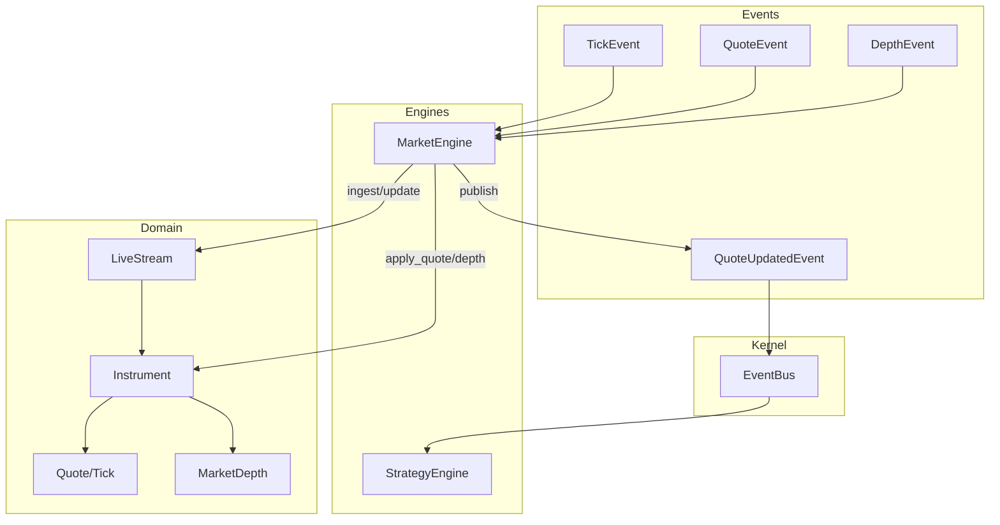
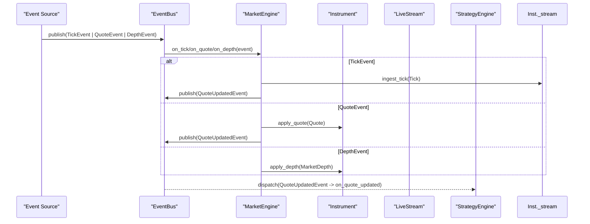
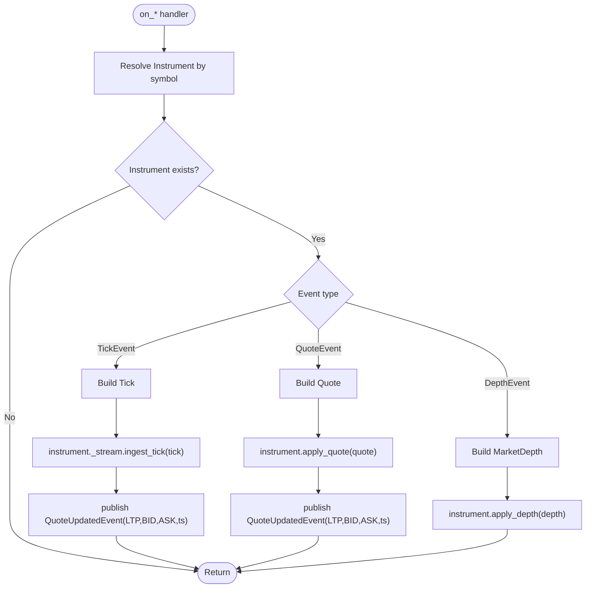
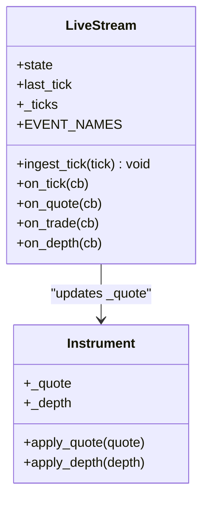
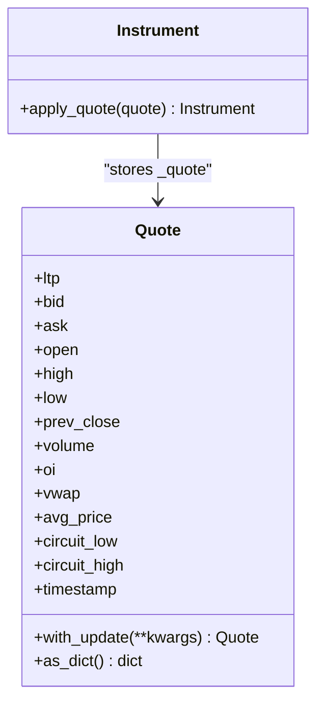
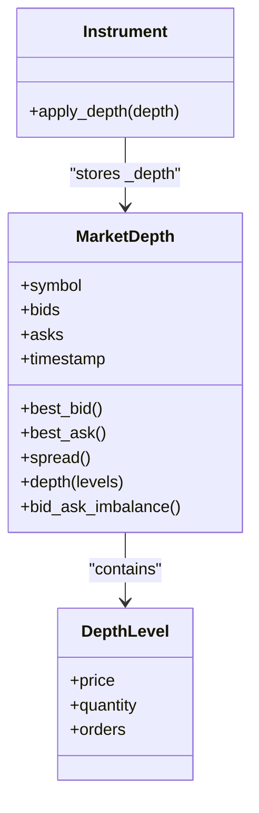
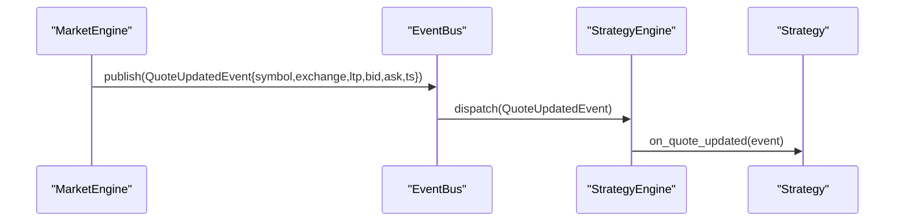
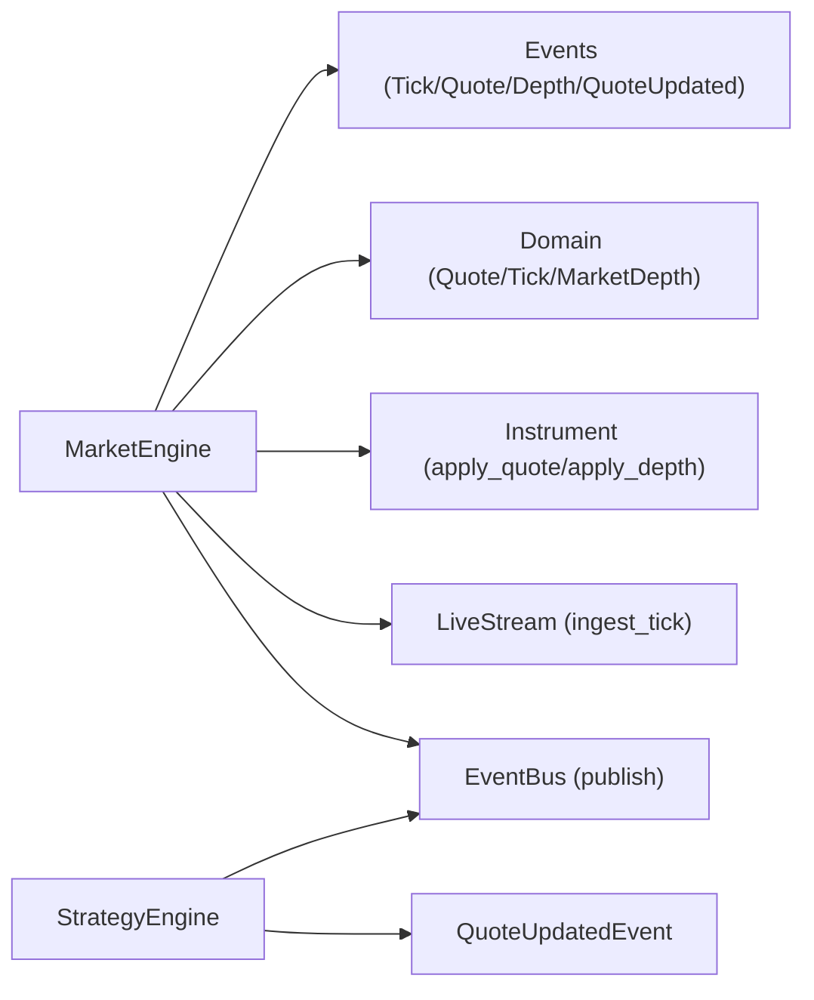

# Market Engine

<cite>
**Referenced Files in This Document**
- [market_engine.py](file://ntrade/engines/market_engine.py)
- [market.py](file://ntrade/events/market.py)
- [event_bus.py](file://ntrade/kernel/event_bus.py)
- [base.py](file://ntrade/domain/instruments/base.py)
- [quote.py](file://ntrade/domain/market/quote.py)
- [depth.py](file://ntrade/domain/market/depth.py)
- [stream.py](file://ntrade/domain/market/stream.py)
- [strategy_engine.py](file://ntrade/engines/strategy_engine.py)
- [bench.py](file://ntrade/runner/bench.py)
</cite>

## Table of Contents
1. [Introduction](#introduction)
2. [Project Structure](#project-structure)
3. [Core Components](#core-components)
4. [Architecture Overview](#architecture-overview)
5. [Detailed Component Analysis](#detailed-component-analysis)
6. [Dependency Analysis](#dependency-analysis)
7. [Performance Considerations](#performance-considerations)
8. [Troubleshooting Guide](#troubleshooting-guide)
9. [Conclusion](#conclusion)

## Introduction
This document explains the MarketEngine component and how it normalizes raw market events into a consistent instrument state, then broadcasts QuoteUpdatedEvent for downstream consumers. It covers:
- Event subscription mechanism (TickEvent, QuoteEvent, DepthEvent)
- Tick processing pipeline via LiveStream
- Quote application logic to Instrument read-model
- Depth-of-book handling
- QuoteUpdatedEvent broadcasting pattern and consumption by StrategyEngine
- Examples of data flow, instrument state management, and performance considerations for high-frequency data

## Project Structure
The MarketEngine sits at the intersection of event sources (broker/replay/simulator), domain models (Quote, Tick, MarketDepth), and downstream engines (StrategyEngine). The key files involved are:
- ntrade/engines/market_engine.py — normalization and broadcasting
- ntrade/events/market.py — event definitions
- ntrade/kernel/event_bus.py — synchronous publish/subscribe bus
- ntrade/domain/instruments/base.py — Instrument read-model updates
- ntrade/domain/market/quote.py — immutable Quote/Tick value objects
- ntrade/domain/market/depth.py — immutable MarketDepth/DepthLevel
- ntrade/domain/market/stream.py — per-instrument LiveStream tick ingestion
- ntrade/engines/strategy_engine.py — consumer of QuoteUpdatedEvent
- ntrade/runner/bench.py — throughput measurement utilities

**Diagram sources**
- [market_engine.py:15-63](file://ntrade/engines/market_engine.py#L15-L63)
- [market.py:11-83](file://ntrade/events/market.py#L11-L83)
- [event_bus.py:24-81](file://ntrade/kernel/event_bus.py#L24-L81)
- [base.py:153-166](file://ntrade/domain/instruments/base.py#L153-L166)
- [quote.py:9-91](file://ntrade/domain/market/quote.py#L9-L91)
- [depth.py:9-49](file://ntrade/domain/market/depth.py#L9-L49)
- [stream.py:27-131](file://ntrade/domain/market/stream.py#L27-L131)
- [strategy_engine.py:48-102](file://ntrade/engines/strategy_engine.py#L48-L102)

**Section sources**
- [market_engine.py:1-63](file://ntrade/engines/market_engine.py#L1-L63)
- [market.py:1-83](file://ntrade/events/market.py#L1-L83)
- [event_bus.py:1-81](file://ntrade/kernel/event_bus.py#L1-L81)
- [base.py:1-305](file://ntrade/domain/instruments/base.py#L1-L305)
- [quote.py:1-91](file://ntrade/domain/market/quote.py#L1-L91)
- [depth.py:1-49](file://ntrade/domain/market/depth.py#L1-L49)
- [stream.py:1-131](file://ntrade/domain/market/stream.py#L1-L131)
- [strategy_engine.py:1-102](file://ntrade/engines/strategy_engine.py#L1-L102)

## Core Components
- MarketEngine: Subscribes to TickEvent, QuoteEvent, DepthEvent; normalizes them into domain objects; updates Instrument state; publishes QuoteUpdatedEvent.
- Instrument: Owns read-model state (_quote, _depth); exposes apply_quote and apply_depth for event-driven updates.
- LiveStream: Per-instrument stream that ingests ticks, updates quote fields, caches recent ticks, and emits typed callbacks.
- Events: TickEvent, QuoteEvent, DepthEvent as inputs; QuoteUpdatedEvent as normalized output.
- EventBus: Synchronous pub/sub with serialized dispatch and history recording.

Key responsibilities:
- Normalize heterogeneous inputs into canonical Quote/Tick/MarketDepth
- Maintain low-latency, thread-safe event dispatch
- Provide a single normalized QuoteUpdatedEvent stream for downstream engines

**Section sources**
- [market_engine.py:15-63](file://ntrade/engines/market_engine.py#L15-L63)
- [base.py:153-166](file://ntrade/domain/instruments/base.py#L153-L166)
- [stream.py:105-131](file://ntrade/domain/market/stream.py#L105-L131)
- [market.py:11-83](file://ntrade/events/market.py#L11-L83)
- [event_bus.py:24-81](file://ntrade/kernel/event_bus.py#L24-L81)

## Architecture Overview
The MarketEngine acts as a normalization layer between raw market events and the rest of the system. It ensures all downstream consumers see a consistent QuoteUpdatedEvent with current LTP/BID/ASK derived from the instrument’s read-model.

**Diagram sources**
- [market_engine.py:25-63](file://ntrade/engines/market_engine.py#L25-L63)
- [stream.py:105-131](file://ntrade/domain/market/stream.py#L105-L131)
- [base.py:153-166](file://ntrade/domain/instruments/base.py#L153-L166)
- [strategy_engine.py:48-102](file://ntrade/engines/strategy_engine.py#L48-L102)
- [event_bus.py:47-66](file://ntrade/kernel/event_bus.py#L47-L66)

## Detailed Component Analysis

### MarketEngine: Event Subscription and Normalization
- Subscribes to three input event types during initialization.
- For each event:
  - Resolves the target Instrument via context.
  - Normalizes into domain objects (Tick, Quote, MarketDepth).
  - Updates Instrument state through either LiveStream or direct apply methods.
  - Publishes QuoteUpdatedEvent with latest LTP/BID/ASK and timestamp.

**Diagram sources**
- [market_engine.py:25-63](file://ntrade/engines/market_engine.py#L25-L63)

**Section sources**
- [market_engine.py:15-63](file://ntrade/engines/market_engine.py#L15-L63)

### Tick Processing Pipeline via LiveStream
- LiveStream.ingest_tick updates the instrument’s quote immutably based on tick kind:
  - kind == "quote": sets LTP=BID=ASK=price and timestamp
  - kind == "trade": sets LTP=price and timestamp
  - otherwise: emits depth callback
- Always appends to an in-memory circular buffer of ticks and emits generic "tick" event.

**Diagram sources**
- [stream.py:27-131](file://ntrade/domain/market/stream.py#L27-L131)
- [base.py:153-166](file://ntrade/domain/instruments/base.py#L153-L166)

**Section sources**
- [stream.py:105-131](file://ntrade/domain/market/stream.py#L105-L131)

### Quote Application Logic
- Quote is an immutable value object with derived helpers (spread, mid_price, change, etc.).
- Instrument.apply_quote replaces the internal Quote snapshot.
- MarketEngine constructs Quote from QuoteEvent fields and applies it directly.

**Diagram sources**
- [quote.py:9-91](file://ntrade/domain/market/quote.py#L9-L91)
- [base.py:153-166](file://ntrade/domain/instruments/base.py#L153-L166)

**Section sources**
- [quote.py:1-91](file://ntrade/domain/market/quote.py#L1-L91)
- [base.py:153-166](file://ntrade/domain/instruments/base.py#L153-L166)

### Depth-of-Book Handling
- DepthEvent carries bids/asks as tuples of (price, qty, orders).
- MarketEngine converts these into immutable DepthLevel and wraps into MarketDepth.
- Instrument.apply_depth stores the snapshot for later use.

**Diagram sources**
- [depth.py:9-49](file://ntrade/domain/market/depth.py#L9-L49)
- [base.py:153-166](file://ntrade/domain/instruments/base.py#L153-L166)

**Section sources**
- [depth.py:1-49](file://ntrade/domain/market/depth.py#L1-L49)
- [base.py:153-166](file://ntrade/domain/instruments/base.py#L153-L166)

### QuoteUpdatedEvent Broadcasting Pattern and Consumption
- After updating Instrument state, MarketEngine publishes QuoteUpdatedEvent with symbol, exchange, ltp, bid, ask, ts.
- StrategyEngine subscribes to QuoteUpdatedEvent and invokes strategy.on_quote_updated(event) for each registered strategy.

**Diagram sources**
- [market_engine.py:34-51](file://ntrade/engines/market_engine.py#L34-L51)
- [strategy_engine.py:48-102](file://ntrade/engines/strategy_engine.py#L48-L102)
- [event_bus.py:47-66](file://ntrade/kernel/event_bus.py#L47-L66)

**Section sources**
- [market_engine.py:25-63](file://ntrade/engines/market_engine.py#L25-L63)
- [strategy_engine.py:1-102](file://ntrade/engines/strategy_engine.py#L1-L102)

## Dependency Analysis
- MarketEngine depends on:
  - Event types (TickEvent, QuoteEvent, DepthEvent, QuoteUpdatedEvent)
  - Domain models (Quote, Tick, MarketDepth, DepthLevel)
  - Instrument read-model methods (apply_quote, apply_depth) and LiveStream (ingest_tick)
  - EventBus for publishing QuoteUpdatedEvent
- StrategyEngine depends on QuoteUpdatedEvent for strategy hooks.
- EventBus provides thread-safe, serialized dispatch and event history.

**Diagram sources**
- [market_engine.py:15-63](file://ntrade/engines/market_engine.py#L15-L63)
- [market.py:11-83](file://ntrade/events/market.py#L11-L83)
- [base.py:153-166](file://ntrade/domain/instruments/base.py#L153-L166)
- [stream.py:105-131](file://ntrade/domain/market/stream.py#L105-L131)
- [strategy_engine.py:48-102](file://ntrade/engines/strategy_engine.py#L48-L102)
- [event_bus.py:24-81](file://ntrade/kernel/event_bus.py#L24-L81)

**Section sources**
- [market_engine.py:15-63](file://ntrade/engines/market_engine.py#L15-L63)
- [event_bus.py:24-81](file://ntrade/kernel/event_bus.py#L24-L81)
- [strategy_engine.py:48-102](file://ntrade/engines/strategy_engine.py#L48-L102)

## Performance Considerations
- Event bus serialization: EventBus holds an RLock across dispatch to ensure serialized access to shared read-models and prevent torn states under concurrent producers.
- Immutable models: Quote and MarketDepth are immutable, reducing contention and enabling safe sharing.
- Circular tick buffer: LiveStream maintains a bounded deque of ticks to limit memory growth while preserving recent history.
- Throughput benchmarking: Bench utility measures ticks/sec and events/sec to validate pipeline performance.

Recommendations:
- Keep handlers lightweight; avoid blocking operations inside event handlers.
- Prefer immutable updates (Quote.with_update) to minimize allocations and side effects.
- Monitor EventBus.history size and tune max_history if needed.
- Use streaming callbacks for real-time analytics instead of polling.

**Section sources**
- [event_bus.py:24-81](file://ntrade/kernel/event_bus.py#L24-L81)
- [quote.py:9-91](file://ntrade/domain/market/quote.py#L9-L91)
- [depth.py:9-49](file://ntrade/domain/market/depth.py#L9-L49)
- [stream.py:27-64](file://ntrade/domain/market/stream.py#L27-L64)
- [bench.py:11-25](file://ntrade/runner/bench.py#L11-L25)

## Troubleshooting Guide
Common issues and where to look:
- Missing instrument: If context.instrument(symbol) returns None, MarketEngine silently returns without processing. Ensure instruments are registered before events arrive.
- Stale quotes: Quote.is_stale can be used to detect outdated snapshots; verify timestamps in QuoteUpdatedEvent.
- Handler exceptions: EventBus swallows exceptions in handlers; check logs for handler errors.
- Depth not applied: Confirm DepthEvent contains non-empty bids/asks and that MarketDepth is constructed correctly.
- Strategy not receiving updates: Verify StrategyEngine is subscribed to QuoteUpdatedEvent and strategy implements on_quote_updated.

**Section sources**
- [market_engine.py:25-63](file://ntrade/engines/market_engine.py#L25-L63)
- [event_bus.py:47-66](file://ntrade/kernel/event_bus.py#L47-L66)
- [quote.py:59-64](file://ntrade/domain/market/quote.py#L59-L64)
- [strategy_engine.py:48-102](file://ntrade/engines/strategy_engine.py#L48-L102)

## Conclusion
MarketEngine centralizes normalization of diverse market events into a consistent instrument read-model and emits a single QuoteUpdatedEvent stream. This design decouples sources from consumers, simplifies downstream logic, and supports high-frequency processing through immutable models, serialized dispatch, and efficient streaming. Proper registration of instruments and robust downstream consumers (e.g., StrategyEngine) complete the pipeline for reliable, scalable market data processing.