# Order Engine (OMS)

<cite>
**Referenced Files in This Document**
- [order_engine.py](file://ntrade/engines/order_engine.py)
- [router.py](file://ntrade/execution/router.py)
- [broker_executor.py](file://ntrade/execution/broker_executor.py)
- [base.py](file://ntrade/brokers/base.py)
- [paper.py](file://ntrade/brokers/paper.py)
- [order.py](file://ntrade/domain/orders/order.py)
- [book.py](file://ntrade/domain/orders/book.py)
- [order_events.py](file://ntrade/events/order.py)
- [event_bus.py](file://ntrade/kernel/event_bus.py)
- [test_order_state_events.py](file://tests/test_order_state_events.py)
- [test_orders.py](file://tests/test_orders.py)
</cite>

## Table of Contents
1. [Introduction](#introduction)
2. [Project Structure](#project-structure)
3. [Core Components](#core-components)
4. [Architecture Overview](#architecture-overview)
5. [Detailed Component Analysis](#detailed-component-analysis)
6. [Dependency Analysis](#dependency-analysis)
7. [Performance Considerations](#performance-considerations)
8. [Troubleshooting Guide](#troubleshooting-guide)
9. [Conclusion](#conclusion)

## Introduction
This document provides comprehensive documentation for the Order Engine (Order Management System, OMS) that manages the complete order lifecycle: placement, modification, cancellation, and fill processing. It explains order state transitions, order book maintenance, trade history tracking, advanced order types (Market, Limit, Stop, Cover, Bracket), partial fill handling, idempotent operations, order routing, fill reconciliation, and audit trail generation. The system is event-driven and broker-agnostic, ensuring zero-parity across paper, backtest, and live environments.

## Project Structure
The OMS spans several layers:
- Domain models define orders, order types, statuses, and immutable books for open orders and executed trades.
- Engines translate approved signals into order intents and route them to execution targets.
- Execution layer handles submission, polling, timeouts, partial fills, and cost accounting.
- Broker adapters abstract transport details and provide order lifecycle methods.
- Event bus ensures reliable, serialized dispatch of lifecycle events.

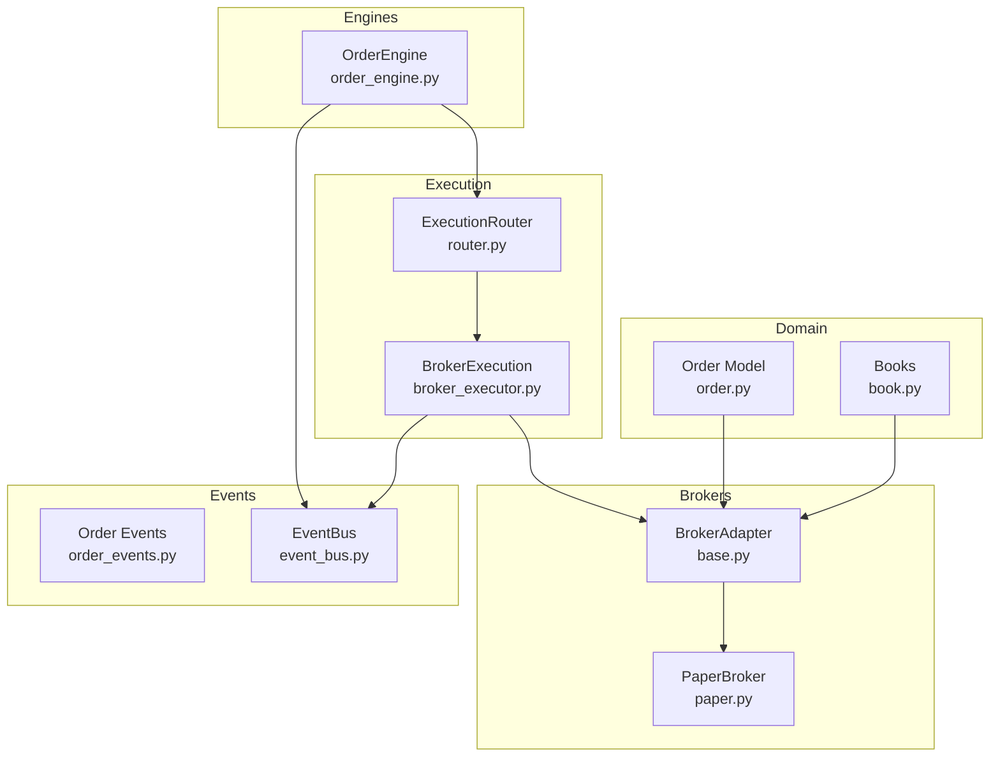

**Diagram sources**
- [order_engine.py:1-34](file://ntrade/engines/order_engine.py#L1-L34)
- [router.py:1-49](file://ntrade/execution/router.py#L1-L49)
- [broker_executor.py:1-290](file://ntrade/execution/broker_executor.py#L1-L290)
- [base.py:1-163](file://ntrade/brokers/base.py#L1-L163)
- [paper.py:1-216](file://ntrade/brokers/paper.py#L1-L216)
- [order.py:1-173](file://ntrade/domain/orders/order.py#L1-L173)
- [book.py:1-120](file://ntrade/domain/orders/book.py#L1-L120)
- [order_events.py:1-91](file://ntrade/events/order.py#L1-L91)
- [event_bus.py:1-81](file://ntrade/kernel/event_bus.py#L1-L81)

**Section sources**
- [order_engine.py:1-34](file://ntrade/engines/order_engine.py#L1-L34)
- [router.py:1-49](file://ntrade/execution/router.py#L1-L49)
- [broker_executor.py:1-290](file://ntrade/execution/broker_executor.py#L1-L290)
- [base.py:1-163](file://ntrade/brokers/base.py#L1-L163)
- [paper.py:1-216](file://ntrade/brokers/paper.py#L1-L216)
- [order.py:1-173](file://ntrade/domain/orders/order.py#L1-L173)
- [book.py:1-120](file://ntrade/domain/orders/book.py#L1-L120)
- [order_events.py:1-91](file://ntrade/events/order.py#L1-L91)
- [event_bus.py:1-81](file://ntrade/kernel/event_bus.py#L1-L81)

## Core Components
- OrderModel and OrderFacade: Rich order model with lifecycle helpers and instrument-bound entry points for placing Market, Limit, Stop, Cover, and Bracket orders.
- OrderEngine: Consumes approved signals, materializes OrderIntentEvent, publishes it, and submits via router; republishes rejections.
- ExecutionRouter: Routes intents to execution targets by strategy name or default target.
- BrokerExecution: Live execution engine that places orders, tracks open orders, polls status, emits fills/rejections/updates/timeouts, and supports crash recovery.
- BrokerAdapter and PaperBroker: Abstract broker interface and an in-memory implementation used for tests/backtests.
- Order/Trade Books: Immutable value objects representing open orders and executed trades.
- Events: Canonical event types for order lifecycle and base event model with kernel-clock timestamps.
- EventBus: Synchronous publish/subscribe bus with serialization and history.

**Section sources**
- [order.py:1-173](file://ntrade/domain/orders/order.py#L1-L173)
- [order_engine.py:1-34](file://ntrade/engines/order_engine.py#L1-L34)
- [router.py:1-49](file://ntrade/execution/router.py#L1-L49)
- [broker_executor.py:1-290](file://ntrade/execution/broker_executor.py#L1-L290)
- [base.py:1-163](file://ntrade/brokers/base.py#L1-L163)
- [paper.py:1-216](file://ntrade/brokers/paper.py#L1-L216)
- [book.py:1-120](file://ntrade/domain/orders/book.py#L1-L120)
- [order_events.py:1-91](file://ntrade/events/order.py#L1-L91)
- [event_bus.py:1-81](file://ntrade/kernel/event_bus.py#L1-L81)

## Architecture Overview
The OMS follows a clean separation between domain, engines, execution, and brokers, connected by an event bus. Signals become order intents, which are routed to execution targets. For live trading, BrokerExecution coordinates asynchronous broker lifecycles, while for paper/backtesting, PaperBroker provides synchronous fills.

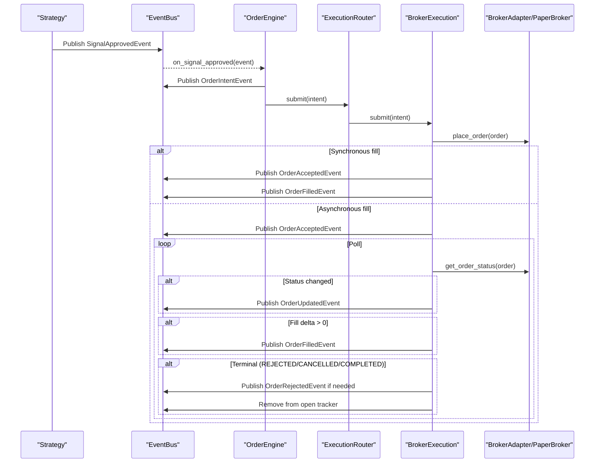

**Diagram sources**
- [order_engine.py:1-34](file://ntrade/engines/order_engine.py#L1-L34)
- [router.py:1-49](file://ntrade/execution/router.py#L1-L49)
- [broker_executor.py:1-290](file://ntrade/execution/broker_executor.py#L1-L290)
- [base.py:1-163](file://ntrade/brokers/base.py#L1-L163)
- [paper.py:1-216](file://ntrade/brokers/paper.py#L1-L216)
- [order_events.py:1-91](file://ntrade/events/order.py#L1-L91)
- [event_bus.py:1-81](file://ntrade/kernel/event_bus.py#L1-L81)

## Detailed Component Analysis

### Order Model and Facade
- Order dataclass encapsulates side, quantity, type, prices, status, and fill metrics. Provides helper properties for open/filled checks and broker-backed lifecycle methods (cancel, modify, refresh, executed price).
- OrderFacade binds order creation to an Instrument, exposing convenient methods for buy/sell, limit/market/stop/cover/bracket. Enforces type normalization and delegates placement to the instrument’s broker adapter.

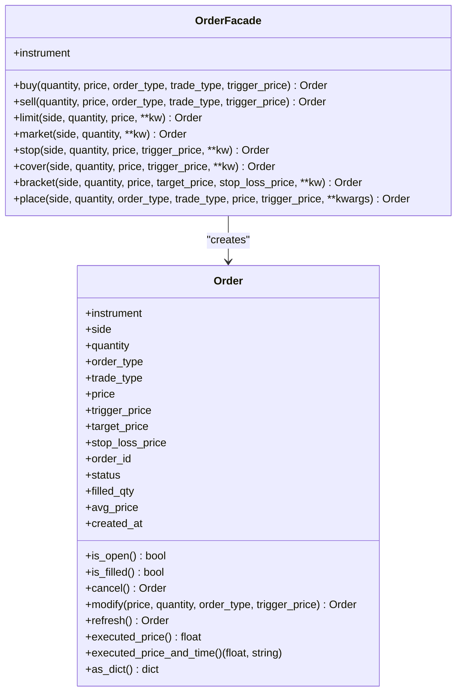

**Diagram sources**
- [order.py:1-173](file://ntrade/domain/orders/order.py#L1-L173)

**Section sources**
- [order.py:1-173](file://ntrade/domain/orders/order.py#L1-L173)

### OrderBook and TradeBook
- Immutable frozen dataclasses represent collections of open orders and executed trades. Provide symbol filtering and conversion utilities. Used by broker adapters to expose consistent views.

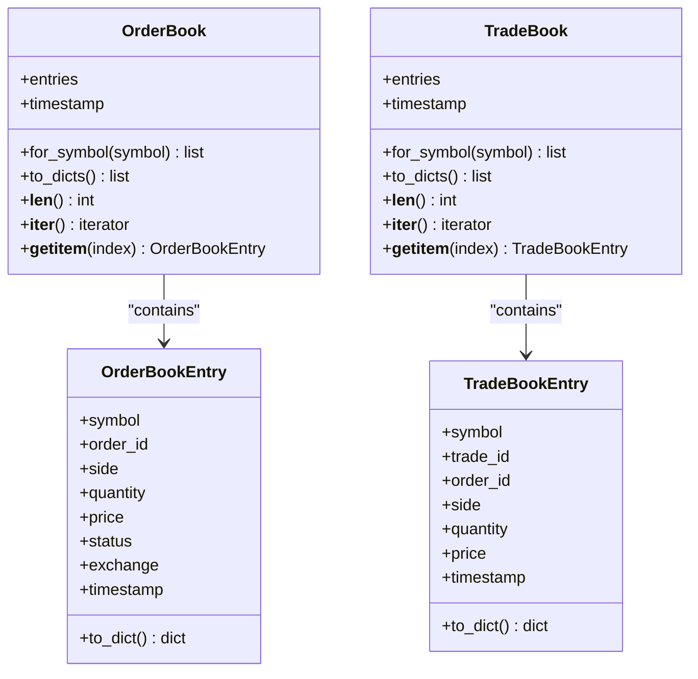

**Diagram sources**
- [book.py:1-120](file://ntrade/domain/orders/book.py#L1-L120)

**Section sources**
- [book.py:1-120](file://ntrade/domain/orders/book.py#L1-L120)

### OrderEngine
- Subscribes to SignalApprovedEvent, constructs OrderIntentEvent, publishes it, and submits via router. Republishes any rejection outcome.

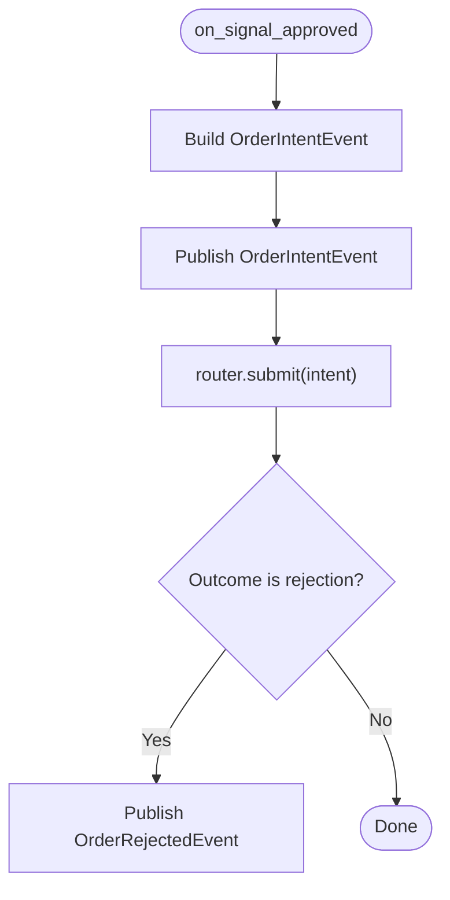

**Diagram sources**
- [order_engine.py:1-34](file://ntrade/engines/order_engine.py#L1-L34)

**Section sources**
- [order_engine.py:1-34](file://ntrade/engines/order_engine.py#L1-L34)

### ExecutionRouter
- Maintains named execution targets and a default fallback. Resolves target by intent.strategy; returns OrderRejectedEvent when no target exists.

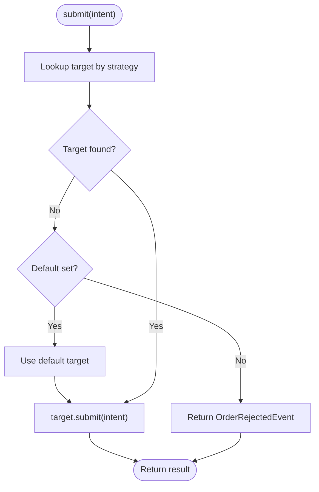

**Diagram sources**
- [router.py:1-49](file://ntrade/execution/router.py#L1-L49)

**Section sources**
- [router.py:1-49](file://ntrade/execution/router.py#L1-L49)

### BrokerExecution (Live OMS)
- Places orders via instrument.order.place, publishes OrderAcceptedEvent immediately, and either emits synchronous fills or tracks open orders for asynchronous polling.
- poll() refreshes order status, publishes updates, computes partial fill deltas, emits fills and rejections, detects timeouts, and removes terminal orders.
- restore_open() rebuilds open-order state from event store deltas after crash recovery.
- modify/cancel delegate to broker adapter for open orders.

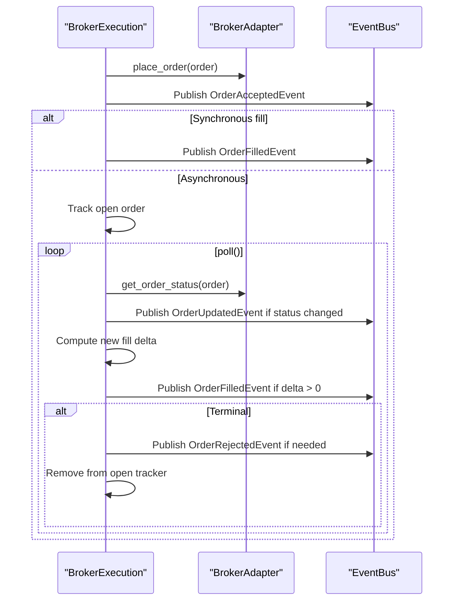

**Diagram sources**
- [broker_executor.py:1-290](file://ntrade/execution/broker_executor.py#L1-L290)

**Section sources**
- [broker_executor.py:1-290](file://ntrade/execution/broker_executor.py#L1-L290)

### BrokerAdapter and PaperBroker
- BrokerAdapter defines the contract for market data, order lifecycle, and portfolio access. Timestamps are resolved via an injected clock for zero-parity.
- PaperBroker implements in-memory behavior: instant fills for market/limit orders, order tracking, order/trade books, and simple balance/positions.

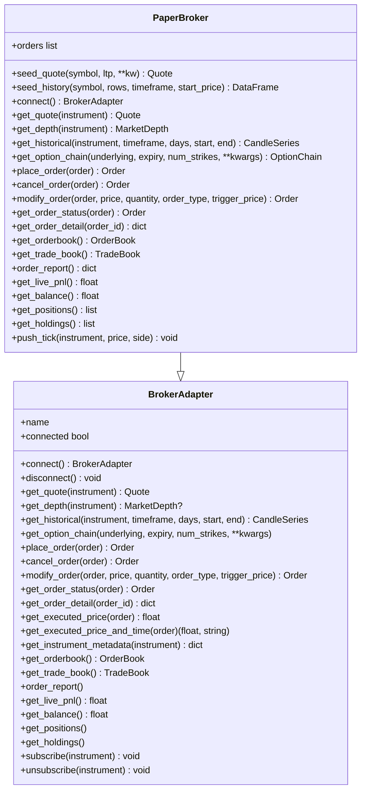

**Diagram sources**
- [base.py:1-163](file://ntrade/brokers/base.py#L1-L163)
- [paper.py:1-216](file://ntrade/brokers/paper.py#L1-L216)

**Section sources**
- [base.py:1-163](file://ntrade/brokers/base.py#L1-L163)
- [paper.py:1-216](file://ntrade/brokers/paper.py#L1-L216)

### Events and EventBus
- Order lifecycle events include Intent, Accepted, Rejected, Filled, Updated, and Timeout. All extend a base Event with kernel-clock timestamp and unique event_id.
- EventBus provides thread-safe publish/subscribe with handler isolation and event history for replay.

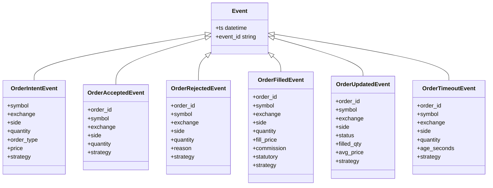

**Diagram sources**
- [order_events.py:1-91](file://ntrade/events/order.py#L1-L91)
- [event_bus.py:1-81](file://ntrade/kernel/event_bus.py#L1-L81)

**Section sources**
- [order_events.py:1-91](file://ntrade/events/order.py#L1-L91)
- [event_bus.py:1-81](file://ntrade/kernel/event_bus.py#L1-L81)

### Order State Transitions and Partial Fill Handling
- States: PENDING -> PARTIALLY_FILLED -> COMPLETED; also REJECTED and CANCELLED terminal states.
- Partial fills are emitted incrementally; only the delta since last poll is published, ensuring idempotency.
- Timeouts: PENDING orders older than threshold emit OrderTimeoutEvent.
- Crash recovery: restore_open reconstructs open-order trackers from event store deltas, preventing duplicate fill emissions.

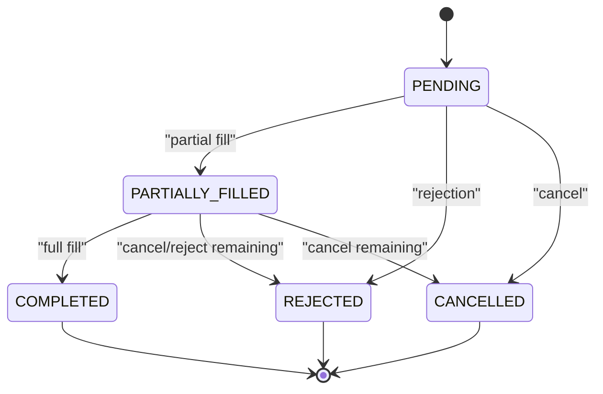

**Diagram sources**
- [broker_executor.py:1-290](file://ntrade/execution/broker_executor.py#L1-L290)
- [order_events.py:1-91](file://ntrade/events/order.py#L1-L91)

**Section sources**
- [broker_executor.py:1-290](file://ntrade/execution/broker_executor.py#L1-L290)
- [order_events.py:1-91](file://ntrade/events/order.py#L1-L91)

### Advanced Order Types
- Market: Immediate fill at current LTP (paper) or best available price (live).
- Limit: Fill at specified price or better.
- Stop (Stop-Limit): Triggered when price reaches trigger_price; then placed as limit.
- Cover (CO): Entry with attached stop-loss leg.
- Bracket (BO): Entry with both target and stop-loss legs.

These are exposed via OrderFacade methods and enforced by broker adapters where required (e.g., converting F&O market orders to limit per regulations).

**Section sources**
- [order.py:1-173](file://ntrade/domain/orders/order.py#L1-L173)
- [test_orders.py:1-90](file://tests/test_orders.py#L1-L90)

### Order Routing Examples
- Strategy emits signal -> OrderEngine creates intent -> ExecutionRouter selects target by strategy -> BrokerExecution places order.
- If no target matches, OrderRejectedEvent is returned immediately.

**Section sources**
- [order_engine.py:1-34](file://ntrade/engines/order_engine.py#L1-L34)
- [router.py:1-49](file://ntrade/execution/router.py#L1-L49)

### Fill Reconciliation and Audit Trail
- Each fill includes commission and statutory costs computed against notional and product schedule.
- OrderUpdatedEvent captures status changes, filled quantities, and average price.
- EventBus maintains event history for replay and auditing.

**Section sources**
- [broker_executor.py:1-290](file://ntrade/execution/broker_executor.py#L1-L290)
- [event_bus.py:1-81](file://ntrade/kernel/event_bus.py#L1-L81)

## Dependency Analysis
The OMS components have clear dependencies:
- OrderEngine depends on events and router.
- ExecutionRouter depends on registered targets (BrokerExecution).
- BrokerExecution depends on BrokerAdapter and events.
- PaperBroker implements BrokerAdapter.
- Order model interacts with BrokerAdapter via instrument.broker_adapter.
- EventBus underpins all event-driven interactions.

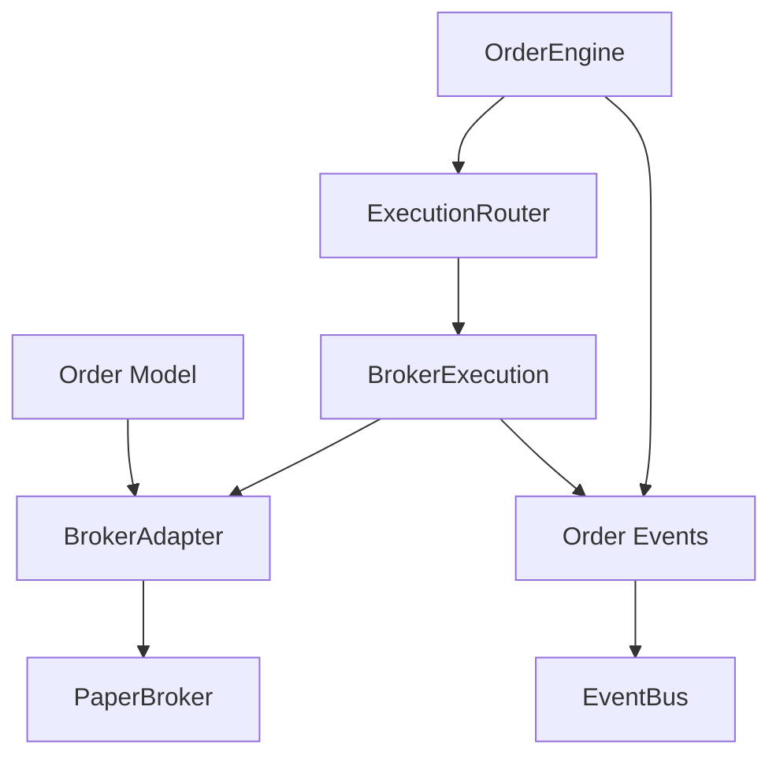

**Diagram sources**
- [order_engine.py:1-34](file://ntrade/engines/order_engine.py#L1-L34)
- [router.py:1-49](file://ntrade/execution/router.py#L1-L49)
- [broker_executor.py:1-290](file://ntrade/execution/broker_executor.py#L1-L290)
- [base.py:1-163](file://ntrade/brokers/base.py#L1-L163)
- [paper.py:1-216](file://ntrade/brokers/paper.py#L1-L216)
- [order_events.py:1-91](file://ntrade/events/order.py#L1-L91)
- [event_bus.py:1-81](file://ntrade/kernel/event_bus.py#L1-L81)

**Section sources**
- [order_engine.py:1-34](file://ntrade/engines/order_engine.py#L1-L34)
- [router.py:1-49](file://ntrade/execution/router.py#L1-L49)
- [broker_executor.py:1-290](file://ntrade/execution/broker_executor.py#L1-L290)
- [base.py:1-163](file://ntrade/brokers/base.py#L1-L163)
- [paper.py:1-216](file://ntrade/brokers/paper.py#L1-L216)
- [order_events.py:1-91](file://ntrade/events/order.py#L1-L91)
- [event_bus.py:1-81](file://ntrade/kernel/event_bus.py#L1-L81)

## Performance Considerations
- EventBus serializes dispatch using a reentrant lock to prevent torn state across producers.
- BrokerExecution limits stale polling failures before evicting orders to avoid memory leaks.
- Partial fill emission computes deltas to minimize redundant events.
- PaperBroker uses in-memory structures for fast testing and backtesting.

[No sources needed since this section provides general guidance]

## Troubleshooting Guide
Common issues and resolutions:
- No execution target for strategy: Ensure ExecutionRouter has a target registered for the intent’s strategy or a default target.
- Missing broker adapter: Order placement requires an instrument with a broker adapter; otherwise, RuntimeError is raised.
- Stale orders: Excessive polling failures lead to eviction; check broker connectivity and error handling.
- Duplicate IDs: When brokers return missing or invalid IDs, BrokerExecution assigns BRK- fallback IDs to avoid collisions.
- Partial fill re-emission: Idempotent design ensures only new fill deltas are emitted; verify open-order tracking state.

**Section sources**
- [router.py:1-49](file://ntrade/execution/router.py#L1-L49)
- [order.py:1-173](file://ntrade/domain/orders/order.py#L1-L173)
- [broker_executor.py:1-290](file://ntrade/execution/broker_executor.py#L1-L290)
- [test_order_state_events.py:1-109](file://tests/test_order_state_events.py#L1-L109)

## Conclusion
The Order Engine provides a robust, event-driven OMS that manages the full order lifecycle across paper, backtest, and live environments. It enforces zero-parity through kernel-clock timestamps, supports advanced order types, handles partial fills idempotently, and maintains comprehensive audit trails. The modular architecture ensures easy extension and integration with different brokers while preserving reliability and performance.