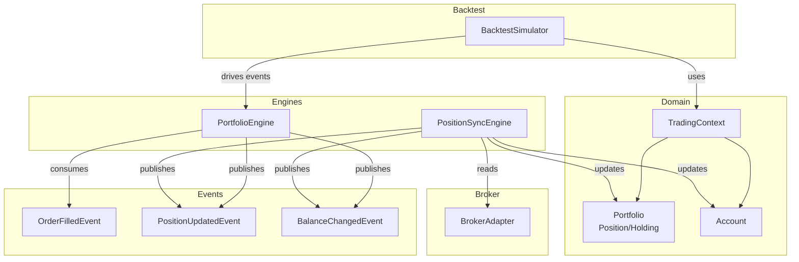
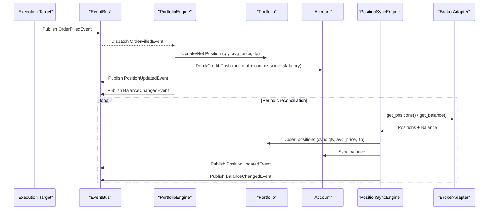
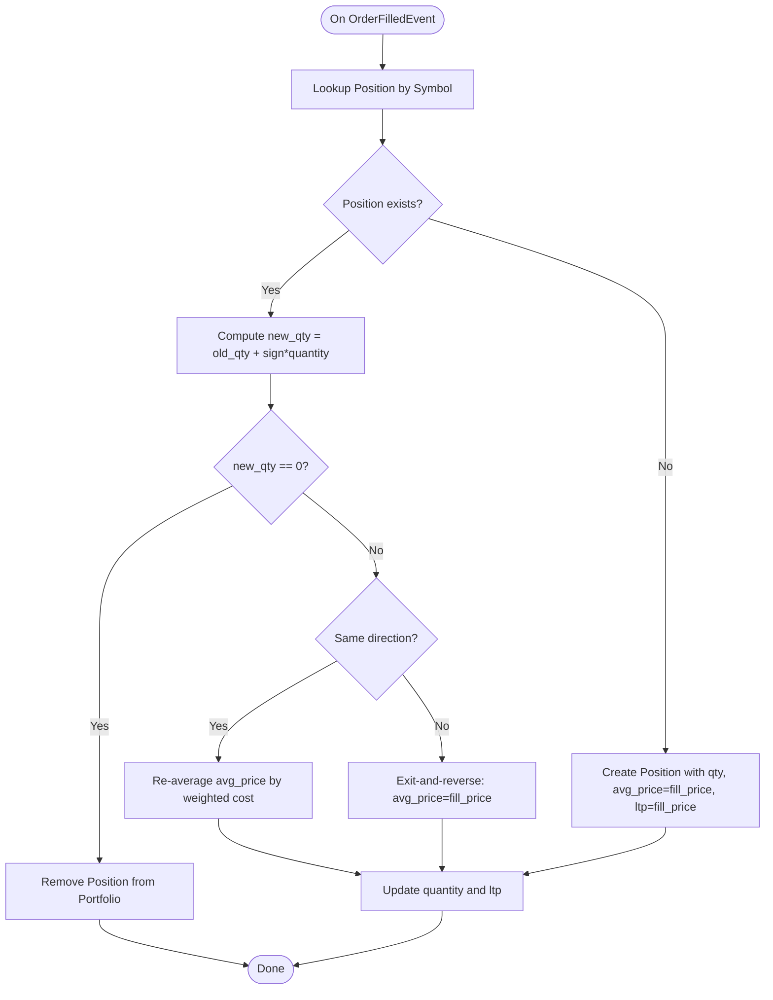
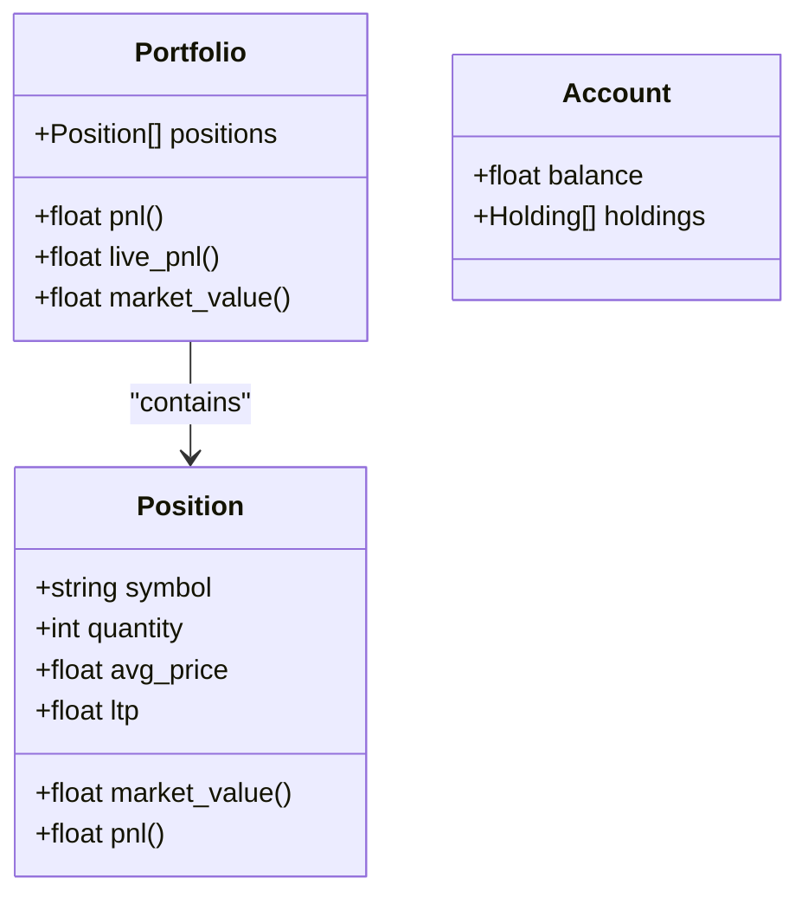
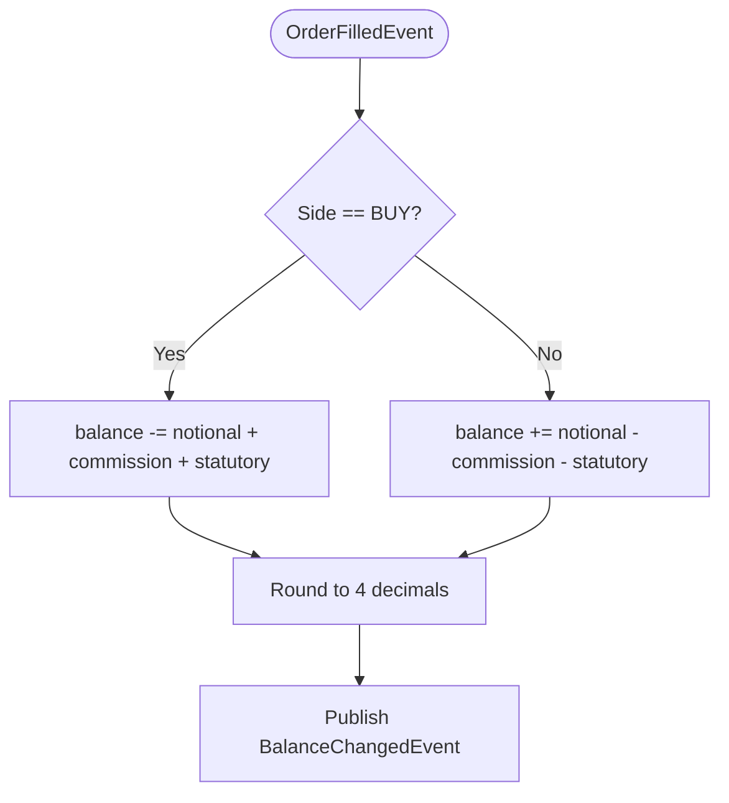
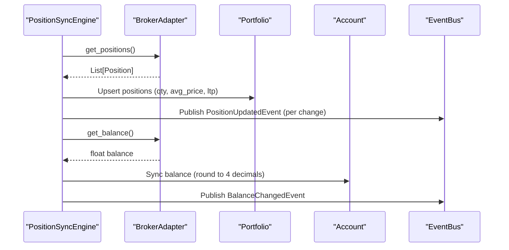
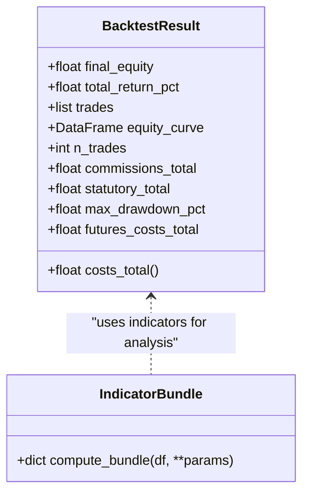
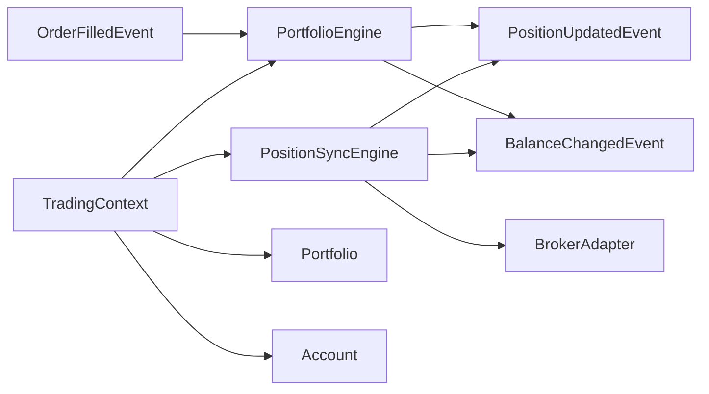

# Portfolio Engine

<cite>
**Referenced Files in This Document**
- [portfolio_engine.py](file://ntrade/engines/portfolio_engine.py)
- [portfolio.py](file://ntrade/domain/portfolio.py)
- [position_sync.py](file://ntrade/engines/position_sync.py)
- [order.py](file://ntrade/events/order.py)
- [portfolio_events.py](file://ntrade/events/portfolio.py)
- [context.py](file://ntrade/kernel/context.py)
- [base.py](file://ntrade/brokers/base.py)
- [simulator.py](file://ntrade/backtest/simulator.py)
- [cash.py](file://ntrade/domain/instruments/cash.py)
</cite>

## Table of Contents
1. Introduction
2. Project Structure
3. Core Components
4. Architecture Overview
5. Detailed Component Analysis
6. Dependency Analysis
7. Performance Considerations
8. Troubleshooting Guide
9. Conclusion
10. Appendices

## Introduction
This document explains the PortfolioEngine and its surrounding components that track positions, calculate P&L, and manage portfolio balances. It covers position lifecycle management, unrealized and realized P&L calculations, cash balance updates, account synchronization with brokers, multi-account considerations, currency handling, and reporting/analytics integration points. It also outlines how backtesting and live modes interact with the same read models to ensure parity.

## Project Structure
The portfolio subsystem spans domain models, event definitions, engines for processing fills and reconciling broker state, and the shared context that holds portfolio/account state.

**Diagram sources**
- [portfolio_engine.py:15-69](file://ntrade/engines/portfolio_engine.py#L15-L69)
- [position_sync.py:22-80](file://ntrade/engines/position_sync.py#L22-L80)
- [portfolio.py:63-135](file://ntrade/domain/portfolio.py#L63-L135)
- [order.py:50-64](file://ntrade/events/order.py#L50-L64)
- [portfolio_events.py:11-27](file://ntrade/events/portfolio.py#L11-L27)
- [context.py:17-46](file://ntrade/kernel/context.py#L17-L46)
- [base.py:137-149](file://ntrade/brokers/base.py#L137-L149)
- [simulator.py:58-143](file://ntrade/backtest/simulator.py#L58-L143)

**Section sources**
- [portfolio_engine.py:1-69](file://ntrade/engines/portfolio_engine.py#L1-L69)
- [position_sync.py:1-110](file://ntrade/engines/position_sync.py#L1-L110)
- [portfolio.py:1-173](file://ntrade/domain/portfolio.py#L1-L173)
- [order.py:1-91](file://ntrade/events/order.py#L1-L91)
- [portfolio_events.py:1-27](file://ntrade/events/portfolio.py#L1-L27)
- [context.py:1-79](file://ntrade/kernel/context.py#L1-L79)
- [base.py:1-163](file://ntrade/brokers/base.py#L1-L163)
- [simulator.py:1-200](file://ntrade/backtest/simulator.py#L1-L200)
- [cash.py:1-50](file://ntrade/domain/instruments/cash.py#L1-L50)

## Core Components
- Position and Holding: lightweight dataclasses with computed market value and P&L based on last traded price (ltp) and average entry price.
- Portfolio: composite over a list of positions; aggregates total P&L and market value; supports lookup by symbol and refresh from broker.
- Account: holds cash balance and holdings; supports refresh from broker.
- TradingContext: central mutable state holding bus, clock, instruments, portfolio, and account; thread-safe access patterns via lock.
- PortfolioEngine: consumes OrderFilledEvent to net positions, update average prices, debit/credit cash including statutory charges, and publish PositionUpdatedEvent and BalanceChangedEvent.
- PositionSyncEngine: reconciles broker-reported positions and balance into the kernel’s read models, publishing canonical events; resilient to transient failures.
- BrokerAdapter: abstract boundary for broker interactions including get_positions, get_balance, get_holdings, and optional get_live_pnl.
- BacktestSimulator: drives the same kernel and engine stack with historical bars, applying slippage/commission/statutory costs and futures carry/roll costs while updating account balance consistently.

**Section sources**
- [portfolio.py:19-135](file://ntrade/domain/portfolio.py#L19-L135)
- [portfolio.py:137-173](file://ntrade/domain/portfolio.py#L137-L173)
- [context.py:17-46](file://ntrade/kernel/context.py#L17-L46)
- [portfolio_engine.py:15-69](file://ntrade/engines/portfolio_engine.py#L15-L69)
- [position_sync.py:22-80](file://ntrade/engines/position_sync.py#L22-L80)
- [base.py:137-149](file://ntrade/brokers/base.py#L137-L149)
- [simulator.py:58-143](file://ntrade/backtest/simulator.py#L58-L143)

## Architecture Overview
The PortfolioEngine is an event-driven component that transforms execution outcomes into consistent portfolio and account state. In live mode, PositionSyncEngine periodically reconciles broker-reported state to keep the kernel’s read models authoritative.

**Diagram sources**
- [portfolio_engine.py:20-68](file://ntrade/engines/portfolio_engine.py#L20-L68)
- [position_sync.py:28-80](file://ntrade/engines/position_sync.py#L28-L80)
- [order.py:50-64](file://ntrade/events/order.py#L50-L64)
- [portfolio_events.py:11-27](file://ntrade/events/portfolio.py#L11-L27)
- [base.py:137-149](file://ntrade/brokers/base.py#L137-L149)

## Detailed Component Analysis

### Position Lifecycle Management
- New position creation: On BUY fill, if no existing position, create Position with quantity, avg_price set to fill price, and ltp set to fill price.
- Netting and averaging: For same-direction trades, re-average entry price using weighted cost. For opposite-direction trades that cross zero, treat residual as a fresh opposite position. Partial exits preserve original avg_price.
- Position removal: When net quantity becomes zero, remove position from portfolio.
- LTP updates: Each fill updates ltp to reflect latest trade price.

**Diagram sources**
- [portfolio_engine.py:20-47](file://ntrade/engines/portfolio_engine.py#L20-L47)

**Section sources**
- [portfolio_engine.py:20-47](file://ntrade/engines/portfolio_engine.py#L20-L47)

### Unrealized and Realized P&L Calculations
- Unrealized P&L per position: Computed as (ltp - avg_price) * quantity, rounded to two decimals.
- Portfolio-level unrealized P&L: Sum of all position P&L.
- Live P&L: If a broker adapter provides get_live_pnl(), Portfolio.live_pnl returns it; otherwise falls back to computed pnl.

**Diagram sources**
- [portfolio.py:19-44](file://ntrade/domain/portfolio.py#L19-L44)
- [portfolio.py:63-112](file://ntrade/domain/portfolio.py#L63-L112)

**Section sources**
- [portfolio.py:29-44](file://ntrade/domain/portfolio.py#L29-L44)
- [portfolio.py:84-95](file://ntrade/domain/portfolio.py#L84-L95)

### Cash Balance Updates and Charges
- Notional impact: BUY debits notional; SELL credits notional.
- Statutory charges: Commission and statutory fees are deducted on every leg, mirroring live broker payout behavior.
- Rounding: Cash balance is rounded to four decimals after each update.

**Diagram sources**
- [portfolio_engine.py:48-58](file://ntrade/engines/portfolio_engine.py#L48-L58)
- [portfolio_events.py:22-27](file://ntrade/events/portfolio.py#L22-L27)

**Section sources**
- [portfolio_engine.py:48-58](file://ntrade/engines/portfolio_engine.py#L48-L58)

### Account Synchronization (Live Mode)
- PositionSyncEngine pulls positions and balance from BrokerAdapter.
- Upserts local positions with broker-reported values; preserves strategy metadata when available.
- Drops local positions not reported by broker; publishes zeroed-out PositionUpdatedEvent.
- Resilience: Transient errors return None; previous state is retained to avoid wiping portfolio or zeroing balance.

**Diagram sources**
- [position_sync.py:28-80](file://ntrade/engines/position_sync.py#L28-L80)
- [base.py:137-149](file://ntrade/brokers/base.py#L137-L149)

**Section sources**
- [position_sync.py:28-80](file://ntrade/engines/position_sync.py#L28-L80)

### Multi-Account Support
- The current design centers around a single Account instance within TradingContext.
- To support multiple accounts, extend TradingContext to hold a mapping of account identifiers to Account instances and adjust PortfolioEngine/PositionSyncEngine to target the correct account based on order metadata or routing rules.
- Ensure event payloads include account_id where necessary to disambiguate balance changes across accounts.

[No sources needed since this section proposes architectural extension without analyzing specific files]

### Currency Conversion
- Instrument types include Currency and Spot among others; however, explicit currency conversion logic is not implemented in the analyzed files.
- Recommended approach: Introduce a currency converter service that maps instrument currencies to a base currency and applies exchange rates when computing portfolio equity and P&L.
- Apply conversion at mark-to-market and equity aggregation steps to maintain consistent reporting.

[No sources needed since this section provides general guidance]

### Portfolio Rebalancing Features
- Rebalancing can be implemented as a strategy that generates OrderIntentEvent signals to adjust weights across positions.
- ExecutionRouter routes intents to SimulatedExecution or BarAwareExecution depending on backtest/live configuration.
- After fills, PortfolioEngine nets positions and updates cash; PositionSyncEngine ensures consistency with broker state.

[No sources needed since this section provides general guidance]

### Portfolio Reporting and Analytics Integration
- BacktestResult aggregates final equity, return percentage, number of trades, commissions, statutory costs, max drawdown, and futures costs.
- Equity curve construction uses mark-to-market snapshots combining account balance and position values.
- Indicators bundle provides technical metrics (RSI, ATR, VWAP, EMA/SMA, SuperTrend) for performance attribution and strategy analysis.

**Diagram sources**
- [simulator.py:29-55](file://ntrade/backtest/simulator.py#L29-L55)
- [indicators.py:148-195](file://ntrade/domain/analytics/indicators.py#L148-L195)

**Section sources**
- [simulator.py:29-55](file://ntrade/backtest/simulator.py#L29-L55)
- [indicators.py:148-195](file://ntrade/domain/analytics/indicators.py#L148-L195)

### Performance Attribution and Optimization Techniques
- Attribution: Decompose returns into alpha (strategy edge), beta (market exposure), and costs (commissions, statutory, futures carry/roll). Use indicator outputs and position exposures to attribute performance drivers.
- Optimization: Use indicator-based signals (e.g., RSI thresholds, SuperTrend direction) to tune entry/exit rules; incorporate volatility measures (ATR) for dynamic sizing.
- Risk controls: Enforce position limits and drawdown thresholds via risk engine integration; monitor live vs. unrealized P&L divergence.

[No sources needed since this section provides general guidance]

## Dependency Analysis
PortfolioEngine depends on events and domain models; PositionSyncEngine depends on BrokerAdapter; both operate within TradingContext.

**Diagram sources**
- [portfolio_engine.py:15-69](file://ntrade/engines/portfolio_engine.py#L15-L69)
- [position_sync.py:22-80](file://ntrade/engines/position_sync.py#L22-L80)
- [order.py:50-64](file://ntrade/events/order.py#L50-L64)
- [portfolio_events.py:11-27](file://ntrade/events/portfolio.py#L11-L27)
- [context.py:17-46](file://ntrade/kernel/context.py#L17-L46)
- [base.py:137-149](file://ntrade/brokers/base.py#L137-L149)

**Section sources**
- [portfolio_engine.py:15-69](file://ntrade/engines/portfolio_engine.py#L15-L69)
- [position_sync.py:22-80](file://ntrade/engines/position_sync.py#L22-L80)
- [order.py:50-64](file://ntrade/events/order.py#L50-L64)
- [portfolio_events.py:11-27](file://ntrade/events/portfolio.py#L11-L27)
- [context.py:17-46](file://ntrade/kernel/context.py#L17-L46)
- [base.py:137-149](file://ntrade/brokers/base.py#L137-L149)

## Performance Considerations
- Event throughput: PortfolioEngine processes fills synchronously; ensure EventBus dispatch is efficient under high-frequency trading scenarios.
- Rounding precision: Cash balance rounding to four decimals avoids floating-point drift but may introduce minor discrepancies; standardize rounding policy across components.
- Reconciliation frequency: PositionSyncEngine should reconcile at intervals balancing freshness and broker rate limits.
- Memory usage: Portfolio and Account lists grow with active symbols; prune stale entries and limit history buffers.

[No sources needed since this section provides general guidance]

## Troubleshooting Guide
- Missing positions after fills: Verify OrderFilledEvent fields (symbol, side, quantity, fill_price) and ensure PortfolioEngine subscription is active.
- Incorrect average price: Check same-direction vs. opposite-direction logic; confirm partial exit behavior preserves avg_price.
- Cash imbalance: Inspect statutory charges and commission wiring; ensure BUY debits and SELL credits apply correctly.
- Stale broker state: Confirm PositionSyncEngine sync interval and error handling; transient failures should retain prior state.
- Live P&L mismatch: Validate BrokerAdapter.get_live_pnl() implementation; fallback to computed pnl when unavailable.

**Section sources**
- [portfolio_engine.py:20-68](file://ntrade/engines/portfolio_engine.py#L20-L68)
- [position_sync.py:88-102](file://ntrade/engines/position_sync.py#L88-L102)
- [base.py:137-149](file://ntrade/brokers/base.py#L137-L149)

## Conclusion
The PortfolioEngine provides a robust, event-driven mechanism for maintaining accurate portfolio and account state. Combined with PositionSyncEngine, it ensures consistency between internal read models and broker-reported reality. The design supports clear P&L calculations, charge deductions, and extensibility for multi-account, currency conversion, and rebalancing features. Backtesting and live modes share the same engine stack, ensuring parity and reliable analytics.

## Appendices
- Example workflows:
  - Fills pipeline: OrderIntentEvent → OrderAcceptedEvent → OrderFilledEvent → PositionUpdatedEvent + BalanceChangedEvent.
  - Reconciliation cycle: Periodic sync → upsert positions → sync balance → publish canonical events.
- Best practices:
  - Always round monetary values consistently.
  - Handle transient broker errors gracefully to protect read models.
  - Use indicator bundles for performance attribution and strategy tuning.

[No sources needed since this section summarizes without analyzing specific files]