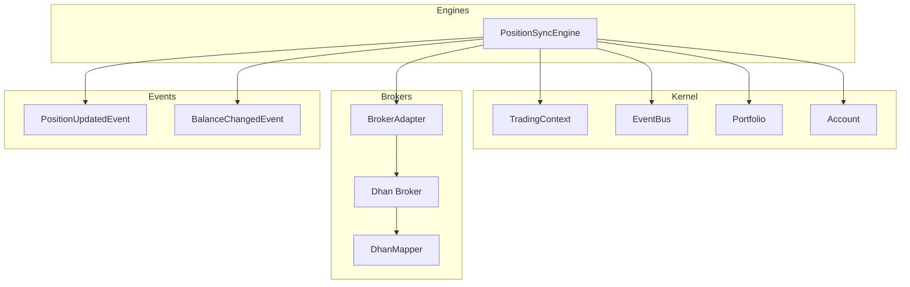
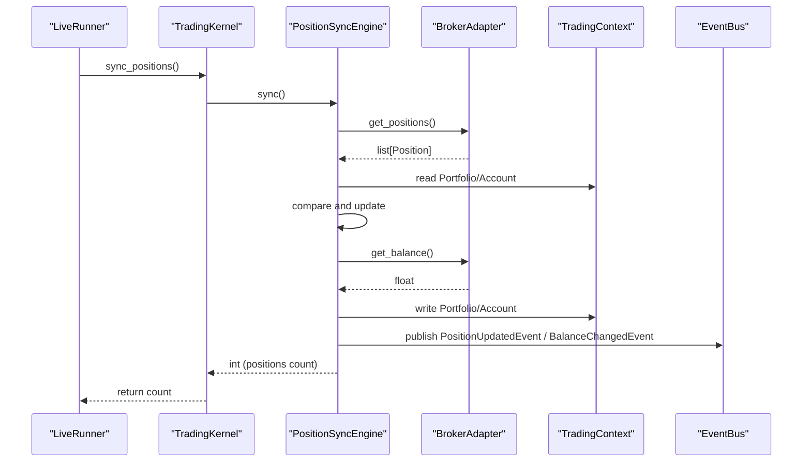
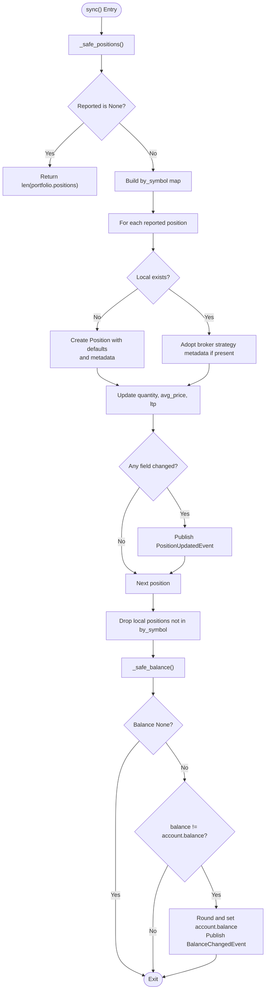
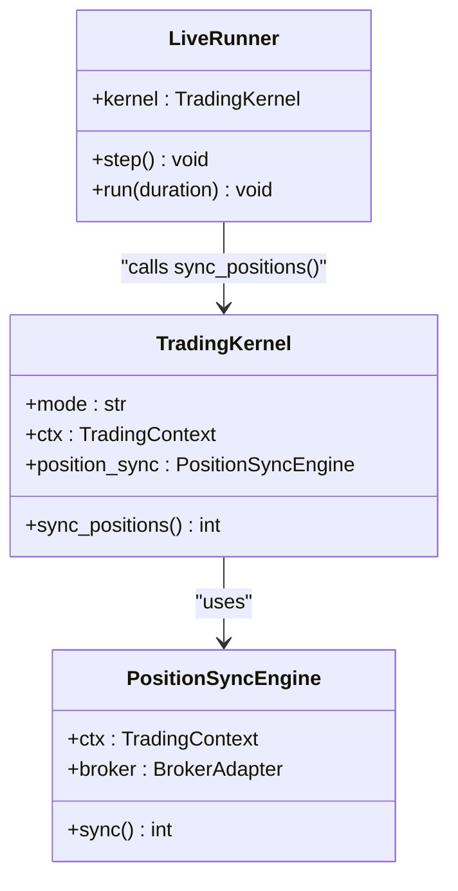
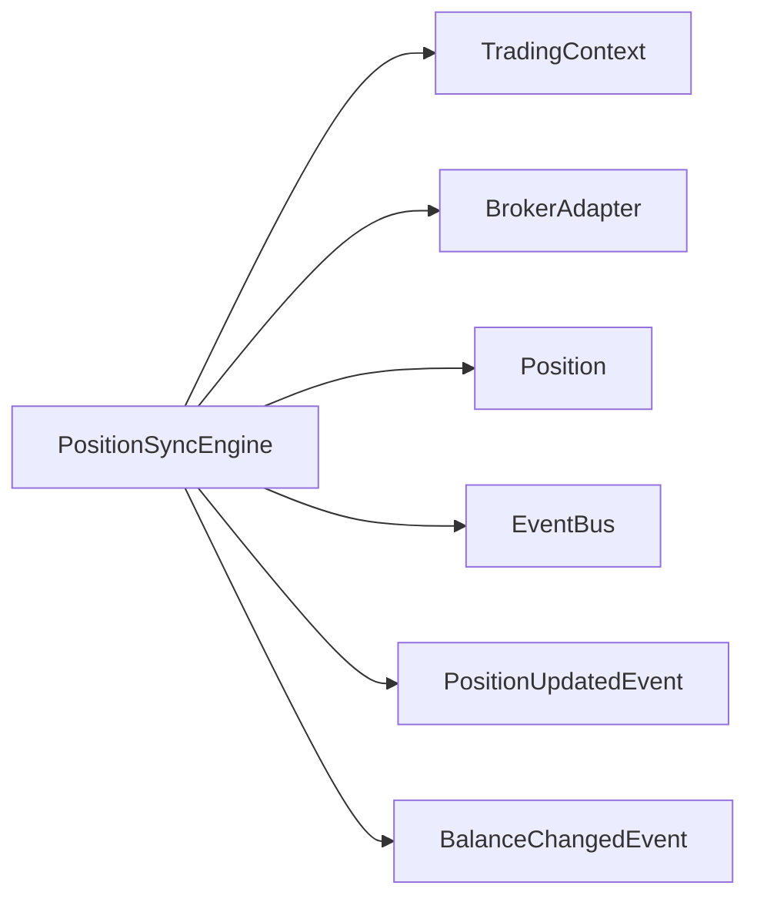

# Position Sync Engine

<cite>
**Referenced Files in This Document**
- [position_sync.py](file://ntrade/engines/position_sync.py)
- [portfolio.py](file://ntrade/domain/portfolio.py)
- [portfolio_events.py](file://ntrade/events/portfolio.py)
- [base.py](file://ntrade/brokers/base.py)
- [session.py](file://ntrade/kernel/session.py)
- [context.py](file://ntrade/kernel/context.py)
- [dhan_mapper.py](file://ntrade/brokers/dhan_mapper.py)
- [dhan.py](file://ntrade/brokers/dhan.py)
- [live_runner.py](file://docs/superpowers/plans/2026-07-31-g2-live-harness.md)
- [test_live_execution.py](file://tests/test_live_execution.py)
</cite>

## Table of Contents
1. Introduction
2. Project Structure
3. Core Components
4. Architecture Overview
5. Detailed Component Analysis
6. Dependency Analysis
7. Performance Considerations
8. Troubleshooting Guide
9. Conclusion

## Introduction
This document explains the PositionSyncEngine, which reconciles broker-reported positions and cash into the kernel’s read models (Portfolio and Account). It covers how discrepancies are detected, how automatic corrections are applied, the comparison algorithm used for positions, scheduling and integration with the live runner, broker-specific data normalization, and performance considerations. It also provides configuration examples, manual reconciliation procedures, and troubleshooting guidance.

## Project Structure
The PositionSyncEngine lives under the engines layer and integrates with:
- Domain models for positions and accounts
- Broker adapters that normalize broker responses
- The kernel context and event bus for publishing canonical events
- The live runner that schedules periodic synchronization

**Diagram sources**
- [position_sync.py:22-80](file://ntrade/engines/position_sync.py#L22-L80)
- [portfolio.py:63-135](file://ntrade/domain/portfolio.py#L63-L135)
- [portfolio_events.py:11-27](file://ntrade/events/portfolio.py#L11-L27)
- [base.py:137-149](file://ntrade/brokers/base.py#L137-L149)
- [dhan.py:507-524](file://ntrade/brokers/dhan.py#L507-L524)
- [dhan_mapper.py:156-172](file://ntrade/brokers/dhan_mapper.py#L156-L172)

**Section sources**
- [position_sync.py:1-110](file://ntrade/engines/position_sync.py#L1-L110)
- [portfolio.py:1-173](file://ntrade/domain/portfolio.py#L1-L173)
- [portfolio_events.py:1-27](file://ntrade/events/portfolio.py#L1-L27)
- [base.py:1-163](file://ntrade/brokers/base.py#L1-L163)
- [dhan.py:507-540](file://ntrade/brokers/dhan.py#L507-L540)
- [dhan_mapper.py:1-172](file://ntrade/brokers/dhan_mapper.py#L1-L172)

## Core Components
- PositionSyncEngine: Orchestrates reconciliation by fetching broker positions and balance, comparing with local state, updating Portfolio/Account, and publishing canonical events only when changes occur.
- Portfolio and Account: Read models maintained by the kernel; updated in-place during reconciliation.
- BrokerAdapter: Abstract interface for brokers; concrete implementations (e.g., Dhan) provide get_positions() and get_balance().
- Events: PositionUpdatedEvent and BalanceChangedEvent are published to keep strategies and recording consistent with canonical updates.

Key behaviors:
- Failure safety: transient broker errors do not wipe portfolio or zero account; previous state is preserved.
- Metadata handling: broker-reported strategy metadata overrides local if present; otherwise local metadata is preserved.
- Cash reconciliation: broker-reported balance is authoritative in live mode.

**Section sources**
- [position_sync.py:22-110](file://ntrade/engines/position_sync.py#L22-L110)
- [portfolio.py:19-61](file://ntrade/domain/portfolio.py#L19-L61)
- [portfolio.py:63-135](file://ntrade/domain/portfolio.py#L63-L135)
- [portfolio_events.py:11-27](file://ntrade/events/portfolio.py#L11-L27)
- [base.py:137-149](file://ntrade/brokers/base.py#L137-L149)

## Architecture Overview
The PositionSyncEngine is wired into the TradingKernel and invoked periodically by the LiveRunner. It reads from the broker via the adapter, normalizes data through broker mappers, compares against local Portfolio/Account, and publishes canonical events.

**Diagram sources**
- [session.py:165-169](file://ntrade/kernel/session.py#L165-L169)
- [position_sync.py:28-80](file://ntrade/engines/position_sync.py#L28-L80)
- [base.py:137-149](file://ntrade/brokers/base.py#L137-L149)
- [portfolio_events.py:11-27](file://ntrade/events/portfolio.py#L11-L27)

## Detailed Component Analysis

### PositionSyncEngine.sync() — Reconciliation Algorithm
- Fetches broker positions safely; on failure returns current position count without mutating state.
- Builds a symbol-indexed map of reported positions.
- Upserts each reported position:
  - If missing locally, creates a new Position with defaults and optional strategy metadata.
  - If present, updates quantity, average price, and last traded price; adopts broker strategy metadata when available.
  - Emits PositionUpdatedEvent only when any of these fields change.
- Removes local positions not reported by the broker and emits zeroed events for them.
- Reconciles cash: fetches balance safely, rounds to 4 decimals, updates account balance, and emits BalanceChangedEvent if changed.

**Diagram sources**
- [position_sync.py:28-80](file://ntrade/engines/position_sync.py#L28-L80)

**Section sources**
- [position_sync.py:28-80](file://ntrade/engines/position_sync.py#L28-L80)

### Data Normalization and Broker Formats
- BrokerAdapter defines get_positions() and get_balance() contracts.
- Dhan broker normalizes raw API rows into domain Position objects using mapper utilities.
- Position fields include symbol, quantity, avg_price, ltp, product, exchange, and metadata.

Normalization highlights:
- DhanMapper transforms raw records into domain structures (e.g., OrderBook, TradeBook), ensuring consistent field names and types across brokers.
- Dhan.get_positions() raises on transport failures so PositionSyncEngine can preserve prior state.

**Section sources**
- [base.py:137-149](file://ntrade/brokers/base.py#L137-L149)
- [dhan.py:507-524](file://ntrade/brokers/dhan.py#L507-L524)
- [dhan_mapper.py:156-172](file://ntrade/brokers/dhan_mapper.py#L156-L172)
- [portfolio.py:19-61](file://ntrade/domain/portfolio.py#L19-L61)

### Event Publishing and State Updates
- PositionUpdatedEvent includes symbol, exchange, quantity, avg_price, ltp, and timestamp.
- BalanceChangedEvent includes balance and timestamp.
- Events ensure downstream consumers (strategies, recording) see canonical updates identical to internal fills.

**Section sources**
- [portfolio_events.py:11-27](file://ntrade/events/portfolio.py#L11-L27)
- [position_sync.py:58-79](file://ntrade/engines/position_sync.py#L58-L79)

### Integration with Kernel and Scheduling
- TradingKernel wires PositionSyncEngine and exposes sync_positions() method.
- LiveRunner calls sync_positions() at a configurable interval (default 30 seconds) alongside poll_orders().

**Diagram sources**
- [session.py:88-102](file://ntrade/kernel/session.py#L88-L102)
- [session.py:165-169](file://ntrade/kernel/session.py#L165-L169)
- [live_runner.py:578-653](file://docs/superpowers/plans/2026-07-31-g2-live-harness.md#L578-L653)

**Section sources**
- [session.py:88-102](file://ntrade/kernel/session.py#L88-L102)
- [session.py:165-169](file://ntrade/kernel/session.py#L165-L169)
- [live_runner.py:578-653](file://docs/superpowers/plans/2026-07-31-g2-live-harness.md#L578-L653)

### Conflict Resolution Strategy
- When both local and broker report a position, broker-reported strategy metadata takes precedence if present; otherwise local metadata is preserved.
- Quantity, average price, and LTP are overwritten by broker values; events emitted only on actual changes.
- Stale local positions (not reported by broker) are removed and zeroed via events.

**Section sources**
- [position_sync.py:48-51](file://ntrade/engines/position_sync.py#L48-L51)
- [position_sync.py:54-62](file://ntrade/engines/position_sync.py#L54-L62)
- [position_sync.py:65-71](file://ntrade/engines/position_sync.py#L65-L71)

## Dependency Analysis
PositionSyncEngine depends on:
- TradingContext for Portfolio, Account, and EventBus access
- BrokerAdapter for positions and balance retrieval
- Domain Position model for upsert logic
- Portfolio events for canonical updates

**Diagram sources**
- [position_sync.py:22-80](file://ntrade/engines/position_sync.py#L22-L80)
- [portfolio.py:19-61](file://ntrade/domain/portfolio.py#L19-L61)
- [portfolio_events.py:11-27](file://ntrade/events/portfolio.py#L11-L27)
- [base.py:137-149](file://ntrade/brokers/base.py#L137-L149)

**Section sources**
- [position_sync.py:22-80](file://ntrade/engines/position_sync.py#L22-L80)
- [portfolio.py:19-61](file://ntrade/domain/portfolio.py#L19-L61)
- [portfolio_events.py:11-27](file://ntrade/events/portfolio.py#L11-L27)
- [base.py:137-149](file://ntrade/brokers/base.py#L137-L149)

## Performance Considerations
- Minimal I/O: Only two broker calls per sync (positions and balance).
- Efficient comparison: Changes are detected before publishing events to avoid unnecessary work.
- Safe parsing: _safe_float ensures robust numeric conversion without exceptions.
- Rounding: Balance rounded to 4 decimals to maintain precision and reduce noise.
- Scheduling: Default 30-second interval balances freshness and load; tune based on market activity and broker rate limits.

[No sources needed since this section provides general guidance]

## Troubleshooting Guide
Common issues and resolutions:
- No events emitted after sync: Ensure broker returns non-empty positions and balance; verify changes occurred. Tests confirm quiet behavior when nothing changes.
- Positions wiped unexpectedly: Transient broker errors are handled; ensure broker.get_positions() raises on network failures rather than returning empty lists.
- Strategy metadata lost: Confirm broker reports metadata when applicable; otherwise local metadata persists.
- Balance not updating: Verify broker.get_balance() returns a valid float; check rounding and equality comparisons.

Manual reconciliation procedure:
- Call kernel.sync_positions() directly to force a reconcile.
- Inspect kernel.ctx.portfolio.positions and kernel.ctx.account.balance.
- Review event history for PositionUpdatedEvent and BalanceChangedEvent counts.

**Section sources**
- [test_live_execution.py:441-454](file://tests/test_live_execution.py#L441-L454)
- [test_live_execution.py:457-491](file://tests/test_live_execution.py#L457-L491)
- [position_sync.py:88-102](file://ntrade/engines/position_sync.py#L88-L102)

## Conclusion
The PositionSyncEngine provides a robust, failure-safe reconciliation mechanism between broker-reported state and the kernel’s read models. By normalizing broker data, comparing fields precisely, and publishing canonical events only on changes, it ensures consistency across strategies, recording, and risk systems. Its integration with the kernel and live runner enables reliable, scheduled synchronization suitable for production trading environments.