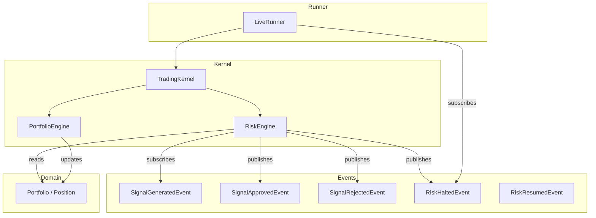
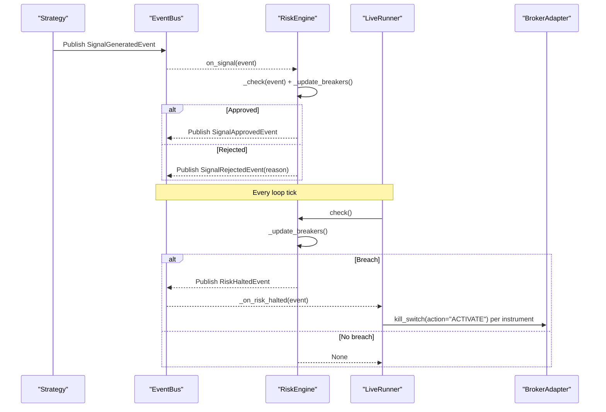
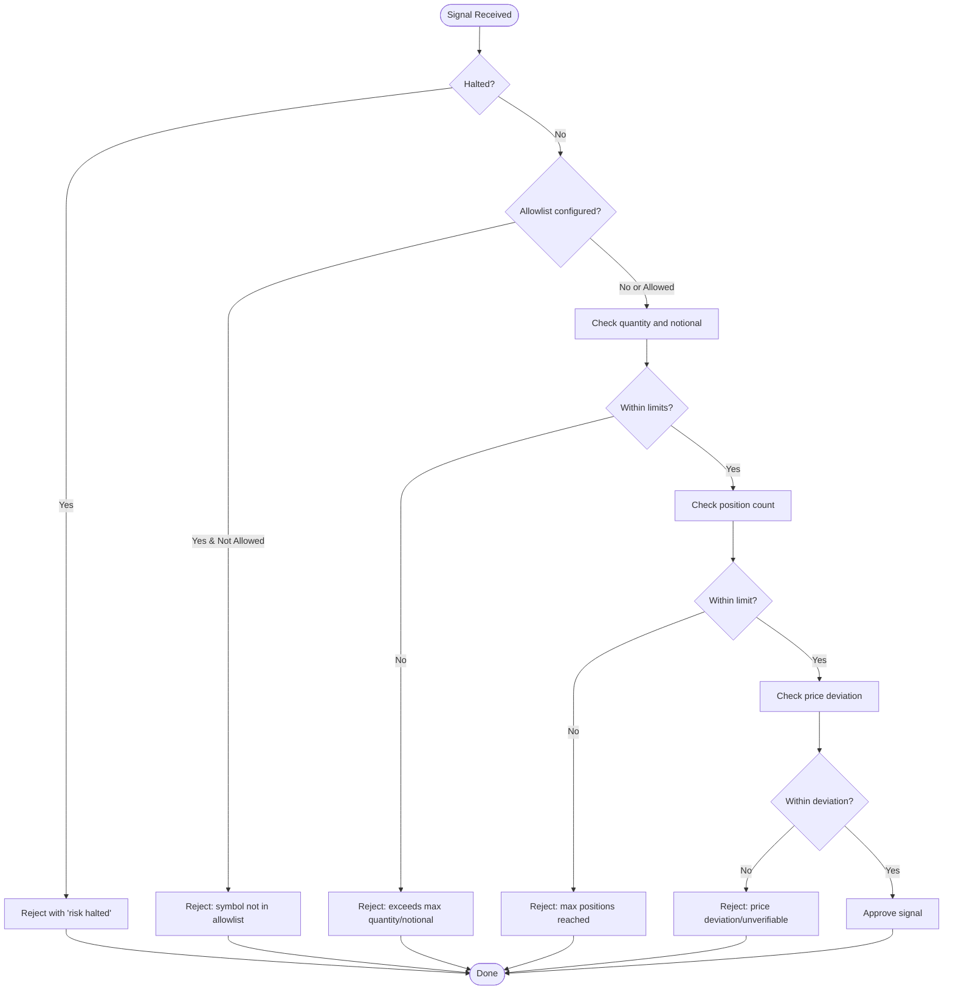
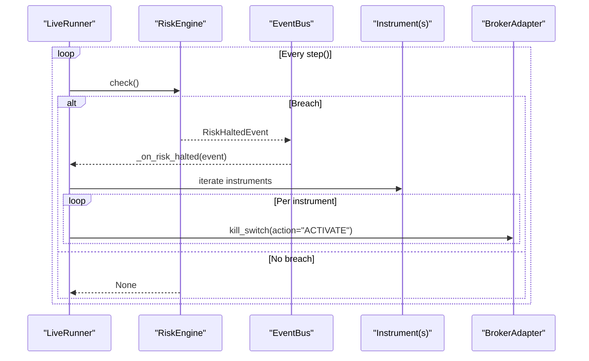
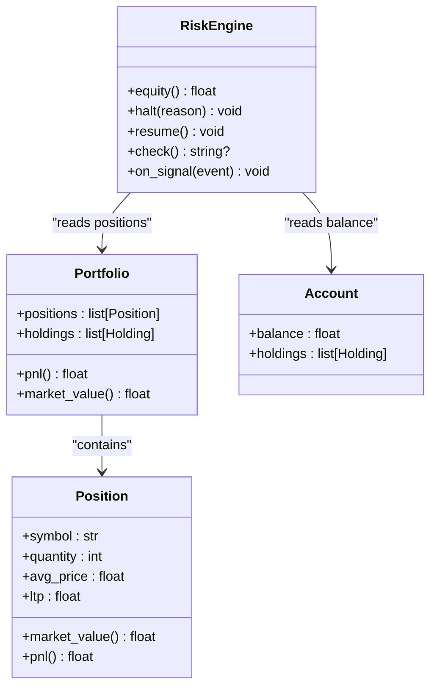
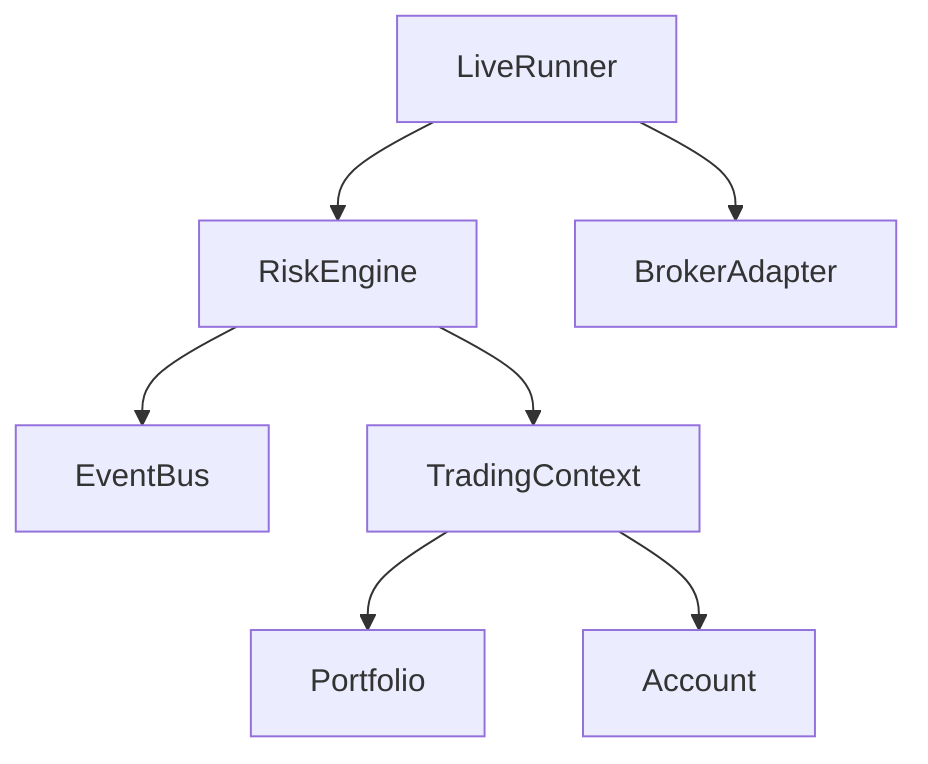

# Risk Engine

<cite>
**Referenced Files in This Document**
- [risk_engine.py](file://ntrade/engines/risk_engine.py)
- [risk.py](file://ntrade/events/risk.py)
- [live_runner.py](file://ntrade/runner/live_runner.py)
- [session.py](file://ntrade/kernel/session.py)
- [portfolio.py](file://ntrade/domain/portfolio.py)
- [portfolio_engine.py](file://ntrade/engines/portfolio_engine.py)
- [test_risk_breakers.py](file://tests/test_risk_breakers.py)
- [test_kill_switch_wiring.py](file://tests/test_kill_switch_wiring.py)
</cite>

## Table of Contents
1. [Introduction](#introduction)
2. [Project Structure](#project-structure)
3. [Core Components](#core-components)
4. [Architecture Overview](#architecture-overview)
5. [Detailed Component Analysis](#detailed-component-analysis)
6. [Dependency Analysis](#dependency-analysis)
7. [Performance Considerations](#performance-considerations)
8. [Troubleshooting Guide](#troubleshooting-guide)
9. [Conclusion](#conclusion)
10. [Appendices](#appendices)

## Introduction
This document explains the RiskEngine that enforces circuit breakers, position limits, and exposure controls across strategies. It covers risk rule configuration, real-time validation of signals, automatic halt/resume behavior, types of risk checks (position limits, daily loss limits, drawdown, concentration via allowlist), risk event handling, compliance enforcement, the kill switch mechanism, monitoring hooks, and guidance for extending with custom validators. Examples are provided as references to tests and configuration points within the codebase.

## Project Structure
The RiskEngine is part of the engine stack orchestrated by the TradingKernel and driven in live mode by the LiveRunner. It subscribes to strategy-generated signals, validates them against configured rules, and publishes approval or rejection events. When circuit breakers trip, it emits a halt event that triggers the LiveRunner’s kill switch on broker instruments.

**Diagram sources**
- [session.py:84](file://ntrade/kernel/session.py#L84)
- [risk_engine.py:19-41](file://ntrade/engines/risk_engine.py#L19-L41)
- [risk.py:11-52](file://ntrade/events/risk.py#L11-L52)
- [live_runner.py:50](file://ntrade/runner/live_runner.py#L50)
- [portfolio.py:20-35](file://ntrade/domain/portfolio.py#L20-L35)
- [portfolio_engine.py:20-69](file://ntrade/engines/portfolio_engine.py#L20-L69)

**Section sources**
- [session.py:38-103](file://ntrade/kernel/session.py#L38-L103)
- [risk_engine.py:1-41](file://ntrade/engines/risk_engine.py#L1-L41)
- [risk.py:1-52](file://ntrade/events/risk.py#L1-L52)
- [live_runner.py:21-53](file://ntrade/runner/live_runner.py#L21-L53)
- [portfolio.py:19-35](file://ntrade/domain/portfolio.py#L19-L35)
- [portfolio_engine.py:15-69](file://ntrade/engines/portfolio_engine.py#L15-L69)

## Core Components
- RiskEngine: Validates signals against static and dynamic rules; manages halt/resume state; computes equity and drawdown; exposes a periodic check() for bleed protection.
- Events: SignalGeneratedEvent, SignalApprovedEvent, SignalRejectedEvent, RiskHaltedEvent, RiskResumedEvent.
- LiveRunner: Calls engine.check() every loop tick; reacts to RiskHaltedEvent by invoking broker kill switches per instrument.
- PortfolioEngine: Updates positions and account balance from fills; provides data used by RiskEngine for equity and position counts.
- TradingKernel: Wires engines together and initializes RiskEngine with the shared context.

Key responsibilities:
- Static screening: allowlist, max quantity, max notional, max positions.
- Dynamic circuit breakers: daily loss cap, max drawdown percentage.
- Price deviation guard: rejects fat-finger prices when reference price is unavailable or deviates beyond threshold.
- Halt/resume lifecycle: halts trading and publishes RiskHaltedEvent; resume resets counters and reinitializes peak equity.

**Section sources**
- [risk_engine.py:19-141](file://ntrade/engines/risk_engine.py#L19-L141)
- [risk.py:11-52](file://ntrade/events/risk.py#L11-L52)
- [live_runner.py:96-104](file://ntrade/runner/live_runner.py#L96-L104)
- [live_runner.py:181-196](file://ntrade/runner/live_runner.py#L181-L196)
- [portfolio_engine.py:20-69](file://ntrade/engines/portfolio_engine.py#L20-L69)
- [session.py:84](file://ntrade/kernel/session.py#L84)

## Architecture Overview
The RiskEngine sits between strategy outputs and execution. It ensures no signal becomes an order unless it passes all checks. In live mode, the LiveRunner continuously evaluates risk even without new signals to catch bleeding positions.

**Diagram sources**
- [risk_engine.py:73-111](file://ntrade/engines/risk_engine.py#L73-L111)
- [risk_engine.py:113-128](file://ntrade/engines/risk_engine.py#L113-L128)
- [live_runner.py:96-104](file://ntrade/runner/live_runner.py#L96-L104)
- [live_runner.py:181-196](file://ntrade/runner/live_runner.py#L181-L196)
- [risk.py:11-52](file://ntrade/events/risk.py#L11-L52)

## Detailed Component Analysis

### RiskEngine
Responsibilities:
- Subscribe to SignalGeneratedEvent and screen each signal.
- Enforce static limits: allowlist, quantity, notional, position count.
- Enforce dynamic circuit breakers: daily loss cap and drawdown limit.
- Provide check() for periodic evaluation independent of signals.
- Emit RiskHaltedEvent and RiskResumedEvent to coordinate system-wide actions.

Configuration parameters:
- max_quantity: maximum allowed order quantity.
- max_notional: maximum allowed notional value per order.
- max_positions: maximum number of open positions (global or per-strategy).
- allowlist: set of permitted symbols.
- strategy: optional filter to apply only to a specific strategy.
- max_daily_loss: absolute daily loss threshold from session start balance.
- max_drawdown_pct: percentage drawdown from session peak equity.
- price_deviation_pct: maximum acceptable deviation from reference price.

Validation flow:
- If halted, reject all signals with reason referencing halt.
- Allowlist check: symbol must be present if allowlist is configured.
- Quantity and notional checks: enforce hard caps.
- Position count: total or strategy-scoped depending on configuration.
- Price deviation: compare against latest last traded price or previous close; reject if unverifiable or exceeds threshold.

Circuit breaker logic:
- Compute equity = cash balance + mark-to-market of positions.
- Update peak equity whenever equity increases.
- Daily loss: if start_balance - equity > max_daily_loss, halt.
- Drawdown: if (peak_equity - equity)/peak_equity*100 > max_drawdown_pct, halt.

Resume behavior:
- Clears halted state, resets peak equity, and refreshes start balance.
- Emits RiskResumedEvent.

**Diagram sources**
- [risk_engine.py:84-111](file://ntrade/engines/risk_engine.py#L84-L111)

**Section sources**
- [risk_engine.py:19-141](file://ntrade/engines/risk_engine.py#L19-L141)

### Events
Types:
- SignalGeneratedEvent: carries intended trade parameters (symbol, exchange, side, quantity, price, strategy, metadata).
- SignalApprovedEvent: indicates risk passed the signal.
- SignalRejectedEvent: indicates risk blocked the signal with reason.
- RiskHaltedEvent: indicates circuit breaker tripped; includes reason and current equity.
- RiskResumedEvent: indicates circuit breaker cleared.

These events form the contract between strategies, risk, and execution layers.

**Section sources**
- [risk.py:11-52](file://ntrade/events/risk.py#L11-L52)

### LiveRunner Integration and Kill Switch
- Subscribes to RiskHaltedEvent and OrderFilledEvent.
- On each loop iteration, calls RiskEngine.check() to evaluate circuit breakers even without signals.
- On RiskHaltedEvent, iterates over registered instruments and invokes broker.kill_switch(action="ACTIVATE").
- Tracks kill_switched and kill_switch_failed flags for observability.
- Includes feed watchdog: if no ticks are received for N checks, publishes RiskHaltedEvent to protect against frozen feeds.

**Diagram sources**
- [live_runner.py:96-104](file://ntrade/runner/live_runner.py#L96-L104)
- [live_runner.py:181-196](file://ntrade/runner/live_runner.py#L181-L196)
- [risk_engine.py:113-128](file://ntrade/engines/risk_engine.py#L113-L128)

**Section sources**
- [live_runner.py:21-53](file://ntrade/runner/live_runner.py#L21-L53)
- [live_runner.py:96-104](file://ntrade/runner/live_runner.py#L96-L104)
- [live_runner.py:154-174](file://ntrade/runner/live_runner.py#L154-L174)
- [live_runner.py:181-196](file://ntrade/runner/live_runner.py#L181-L196)

### Portfolio and Equity Calculation
- Equity is computed as account.balance plus sum of position market values.
- Position market value uses ltp; portfolio updates occur on fills via PortfolioEngine.
- Position count can be global or per-strategy based on RiskEngine.strategy configuration.

**Diagram sources**
- [portfolio.py:20-35](file://ntrade/domain/portfolio.py#L20-L35)
- [portfolio.py:63-134](file://ntrade/domain/portfolio.py#L63-L134)
- [portfolio.py:137-173](file://ntrade/domain/portfolio.py#L137-L173)
- [risk_engine.py:44-47](file://ntrade/engines/risk_engine.py#L44-L47)

**Section sources**
- [portfolio.py:20-35](file://ntrade/domain/portfolio.py#L20-L35)
- [portfolio.py:63-134](file://ntrade/domain/portfolio.py#L63-L134)
- [portfolio_engine.py:20-69](file://ntrade/engines/portfolio_engine.py#L20-L69)
- [risk_engine.py:44-47](file://ntrade/engines/risk_engine.py#L44-L47)

### Wiring and Initialization
- TradingKernel constructs RiskEngine with the shared context and wires it into the engine stack.
- Execution targets (broker or simulator) are separate; RiskEngine remains broker-agnostic.

**Section sources**
- [session.py:84](file://ntrade/kernel/session.py#L84)
- [session.py:38-103](file://ntrade/kernel/session.py#L38-L103)

## Dependency Analysis
RiskEngine depends on:
- EventBus for publishing/subscribing events.
- TradingContext for account, portfolio, and instrument access.
- PortfolioEngine indirectly through context for up-to-date positions and balance.
- LiveRunner for periodic evaluation and kill switch activation.

**Diagram sources**
- [risk_engine.py:19-41](file://ntrade/engines/risk_engine.py#L19-L41)
- [session.py:38-103](file://ntrade/kernel/session.py#L38-L103)
- [live_runner.py:50](file://ntrade/runner/live_runner.py#L50)

**Section sources**
- [risk_engine.py:19-41](file://ntrade/engines/risk_engine.py#L19-L41)
- [session.py:38-103](file://ntrade/kernel/session.py#L38-L103)
- [live_runner.py:50](file://ntrade/runner/live_runner.py#L50)

## Performance Considerations
- Equity computation sums position market values; keep position lists bounded to avoid O(n) overhead on frequent checks.
- Price deviation check accesses instrument quote fields; ensure timely tick updates to avoid fallback to prev_close.
- Periodic check() runs every loop iteration; tune poll_interval and sync_interval in LiveRunner to balance responsiveness and CPU usage.
- Avoid excessive logging during high-frequency loops; rely on events for audit trails.

[No sources needed since this section provides general guidance]

## Troubleshooting Guide
Common issues and resolutions:
- Signals rejected due to allowlist: verify symbol is included in allowlist configuration.
- Quantity or notional exceeded: adjust max_quantity or max_notional thresholds.
- Max positions reached: reduce concurrent positions or increase max_positions.
- Price deviation rejection: ensure valid quotes are available; confirm price_deviation_pct is appropriate.
- Circuit breaker tripped: inspect daily loss and drawdown thresholds; review equity and MTM losses.
- Kill switch failure: check broker adapter availability and network connectivity; monitor kill_switch_failed flag.

Operational tips:
- Use RiskResumedEvent to confirm safe resumption after corrective action.
- Monitor HeartbeatEvent for tick counts and open orders to detect feed stalls.
- Review SignalRejectedEvent reasons for immediate diagnostics.

**Section sources**
- [test_risk_breakers.py:30-111](file://tests/test_risk_breakers.py#L30-L111)
- [test_kill_switch_wiring.py:36-75](file://tests/test_kill_switch_wiring.py#L36-L75)
- [live_runner.py:154-174](file://ntrade/runner/live_runner.py#L154-L174)

## Conclusion
The RiskEngine provides robust pre-trade validation and post-trade circuit breakers to safeguard capital and enforce compliance. Its design separates concerns cleanly: strategies generate signals, RiskEngine enforces rules, and LiveRunner executes emergency actions. Configuration supports both static limits and dynamic safeguards, while event-driven architecture enables extensibility and observability.

[No sources needed since this section summarizes without analyzing specific files]

## Appendices

### Risk Rule Configuration Examples
- Static limits:
  - max_quantity: restricts order size.
  - max_notional: restricts order value.
  - max_positions: caps open positions globally or per strategy.
  - allowlist: restricts eligible symbols.
- Dynamic safeguards:
  - max_daily_loss: absolute daily loss cap from session start balance.
  - max_drawdown_pct: percentage drawdown from session peak equity.
  - price_deviation_pct: fat-finger guard using last traded price or previous close.

Reference examples:
- Kernel initialization wiring: [session.py:84](file://ntrade/kernel/session.py#L84)
- RiskEngine constructor parameters: [risk_engine.py:19-35](file://ntrade/engines/risk_engine.py#L19-L35)
- Test configurations demonstrating usage: [test_risk_breakers.py:12-21](file://tests/test_risk_breakers.py#L12-L21)

### Real-Time Risk Validation Flow
- Strategy emits SignalGeneratedEvent.
- RiskEngine screens and either approves or rejects.
- LiveRunner periodically calls check() to evaluate circuit breakers even without signals.
- On breach, RiskHaltedEvent triggers broker kill switch.

References:
- Screening logic: [risk_engine.py:73-111](file://ntrade/engines/risk_engine.py#L73-L111)
- Periodic evaluation: [live_runner.py:96-104](file://ntrade/runner/live_runner.py#L96-L104)
- Kill switch activation: [live_runner.py:181-196](file://ntrade/runner/live_runner.py#L181-L196)

### Emergency Procedures
- Immediate halt:
  - Triggered automatically by circuit breakers or feed watchdog.
  - LiveRunner activates kill switch on all instruments’ brokers.
- Resume:
  - Call RiskEngine.resume() after mitigating risks.
  - Verify RiskResumedEvent published before resuming trading.

References:
- Halt emission: [risk_engine.py:49-55](file://ntrade/engines/risk_engine.py#L49-L55)
- Resume behavior: [risk_engine.py:56-63](file://ntrade/engines/risk_engine.py#L56-L63)
- Kill switch wiring: [test_kill_switch_wiring.py:36-75](file://tests/test_kill_switch_wiring.py#L36-L75)

### Risk Monitoring Dashboards
- HeartbeatEvent provides tick counts and open orders for health checks.
- Event history (bus.history in tests) allows replay and auditing.
- Flags in LiveRunner:
  - kill_switched: true when kill switch activated successfully.
  - kill_switch_failed: true when kill switch activation raised an exception.

References:
- Heartbeat emission: [live_runner.py:143-152](file://ntrade/runner/live_runner.py#L143-L152)
- Watchdog and halt on stale feed: [live_runner.py:154-174](file://ntrade/runner/live_runner.py#L154-L174)
- Kill switch flags: [live_runner.py:181-196](file://ntrade/runner/live_runner.py#L181-L196)

### Custom Risk Validator Development
To add custom checks:
- Extend RiskEngine._check() to include additional validations.
- Optionally introduce new events for specialized risk categories.
- Ensure periodic check() also evaluates any stateful custom rules.

Guidance:
- Follow existing patterns for rejecting signals with clear reasons.
- Maintain idempotency and avoid duplicate event emissions.
- Keep performance considerations in mind for high-frequency loops.

References:
- Extension point: [risk_engine.py:84-111](file://ntrade/engines/risk_engine.py#L84-L111)
- Periodic evaluation hook: [live_runner.py:96-104](file://ntrade/runner/live_runner.py#L96-L104)

### Risk Reporting
- Audit trail via bus.history in tests demonstrates capturing events for reporting.
- Use SignalApprovedEvent and SignalRejectedEvent counts for throughput metrics.
- Track RiskHaltedEvent and RiskResumedEvent frequencies for incident analysis.

References:
- Event assertions and history usage: [test_risk_breakers.py:30-111](file://tests/test_risk_breakers.py#L30-L111)
- Kill switch event handling: [test_kill_switch_wiring.py:36-75](file://tests/test_kill_switch_wiring.py#L36-L75)