# Strategy Engine

<cite>
**Referenced Files in This Document**
- [strategy_engine.py](file://ntrade/engines/strategy_engine.py)
- [strategies.py](file://ntrade/engines/strategies.py)
- [event_bus.py](file://ntrade/kernel/event_bus.py)
- [context.py](file://ntrade/kernel/context.py)
- [trading_session.py](file://ntrade/kernel/trading_session.py)
- [session.py](file://ntrade/kernel/session.py)
- [scanner.py](file://ntrade/domain/scanner.py)
- [builtin.py](file://ntrade/scanners/builtin.py)
- [live_runner.py](file://ntrade/runner/live_runner.py)
- [risk_engine.py](file://ntrade/engines/risk_engine.py)
- [order_engine.py](file://ntrade/engines/order_engine.py)
- [market.py](file://ntrade/events/market.py)
- [order.py](file://ntrade/events/order.py)
- [risk.py](file://ntrade/events/risk.py)
- [base.py](file://ntrade/events/base.py)
- [lifecycle.py](file://ntrade/events/lifecycle.py)
</cite>

## Update Summary
**Changes Made**
- Updated Scanner Throttling and Performance Optimization section to reflect the 30-second rate limiting configuration
- Enhanced architecture diagrams to show unified ScannerFacade._run as the canonical path for ranking and throttling
- Added detailed explanation of eliminated divergent Scanner.top implementation
- Updated dependency analysis to emphasize the separation between strategy and scanner systems
- Enhanced troubleshooting guide with scanner-specific performance issues

## Table of Contents
1. [Introduction](#introduction)
2. [Project Structure](#project-structure)
3. [Core Components](#core-components)
4. [Architecture Overview](#architecture-overview)
5. [Detailed Component Analysis](#detailed-component-analysis)
6. [Dependency Analysis](#dependency-analysis)
7. [Performance Considerations](#performance-considerations)
8. [Troubleshooting Guide](#troubleshooting-guide)
9. [Conclusion](#conclusion)
10. [Appendices](#appendices)

## Introduction
This document explains the StrategyEngine and its surrounding orchestration for trading strategy execution. It covers:
- Hook-based architecture for lifecycle management
- Signal generation from indicators and market events
- Order signal dispatching through risk and order engines
- Strategy registration, parameter configuration, and multi-strategy coordination
- The event loop, error handling, and performance monitoring
- Examples of strategy development patterns, backtesting integration, and live deployment strategies

The system is built around a synchronous publish/subscribe event bus that ensures deterministic replay across live, replay, and backtest modes. Strategies react to canonical events via hooks and emit signals that flow through risk checks into order intents and execution.

**Key Design Principle**: Strategy lifecycle management is completely orthogonal to scanner throttling - registering strategies through StrategyEngine never resets ScannerFacade's rate-limit cache, maintaining scanner performance optimization mechanisms.

## Project Structure
At a high level, the StrategyEngine sits at the center of an event-driven kernel with clear separation from scanner subsystems:
- Market data and indicator updates are published as events
- Strategies subscribe to these events via hooks
- Strategies emit signals which are screened by RiskEngine and materialized by OrderEngine
- LiveRunner drives the live loop, orchestrating feed, polling, synchronization, and kill-switch behavior
- TradingSession provides a unified API to wire broker, instruments, kernel, and strategies
- ScannerFacade operates independently with its own throttling mechanism

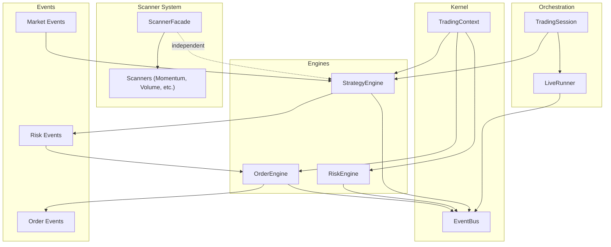

**Diagram sources**
- [strategy_engine.py:48-102](file://ntrade/engines/strategy_engine.py#L48-L102)
- [scanner.py:67-160](file://ntrade/domain/scanner.py#L67-L160)
- [builtin.py:120-128](file://ntrade/scanners/builtin.py#L120-L128)
- [risk_engine.py:19-141](file://ntrade/engines/risk_engine.py#L19-L141)
- [order_engine.py:14-34](file://ntrade/engines/order_engine.py#L14-L34)
- [event_bus.py:24-81](file://ntrade/kernel/event_bus.py#L24-81)
- [context.py:17-79](file://ntrade/kernel/context.py#L17-L79)
- [live_runner.py:21-196](file://ntrade/runner/live_runner.py#L21-L196)
- [trading_session.py:39-306](file://ntrade/kernel/trading_session.py#L39-L306)

**Section sources**
- [strategy_engine.py:1-104](file://ntrade/engines/strategy_engine.py#L1-L104)
- [event_bus.py:1-81](file://ntrade/kernel/event_bus.py#L1-L81)
- [context.py:1-79](file://ntrade/kernel/context.py#L1-L79)
- [trading_session.py:1-306](file://ntrade/kernel/trading_session.py#L1-L306)
- [live_runner.py:1-196](file://ntrade/runner/live_runner.py#L1-L196)
- [scanner.py:1-160](file://ntrade/domain/scanner.py#L1-L160)
- [builtin.py:1-267](file://ntrade/scanners/builtin.py#L1-L267)

## Core Components
- Strategy base class and StrategyEngine: define hook-based lifecycle and fan-out event dispatch to registered strategies
- Reusable strategies (e.g., EMA cross): demonstrate indicator-driven signal emission
- Event bus: thread-safe, serialized dispatch with history for replay
- TradingContext: shared mutable state (bus, clock, portfolio, account, instruments)
- RiskEngine: screens signals with static limits and circuit breakers
- OrderEngine: converts approved signals into order intents and submits via router
- LiveRunner: orchestrates feed, polling, sync, heartbeats, and kill-switch on risk halt
- TradingSession: unified entry point to connect broker, register instruments/strategies, and start/stop sessions
- ScannerFacade: independent scanner system with rate-limit throttling for performance optimization

Key responsibilities:
- StrategyEngine subscribes to canonical events and calls matching hooks per strategy
- Strategies call emit_signal() to publish SignalGeneratedEvent
- RiskEngine evaluates constraints and publishes approval or rejection
- OrderEngine builds OrderIntentEvent and submits to execution router
- LiveRunner periodically polls orders, syncs positions, emits heartbeats, and triggers kill switch on risk halt
- ScannerFacade maintains independent throttling cache that is never affected by strategy registration

**Updated** Added ScannerFacade as a core component with independent throttling mechanism that remains unaffected by strategy lifecycle operations.

**Section sources**
- [strategy_engine.py:18-104](file://ntrade/engines/strategy_engine.py#L18-L104)
- [strategies.py:13-67](file://ntrade/engines/strategies.py#L13-L67)
- [event_bus.py:24-81](file://ntrade/kernel/event_bus.py#L24-81)
- [context.py:17-79](file://ntrade/kernel/context.py#L17-L79)
- [risk_engine.py:19-141](file://ntrade/engines/risk_engine.py#L19-L141)
- [order_engine.py:14-34](file://ntrade/engines/order_engine.py#L14-L34)
- [live_runner.py:21-196](file://ntrade/runner/live_runner.py#L21-L196)
- [trading_session.py:39-306](file://ntrade/kernel/trading_session.py#L39-L306)
- [scanner.py:67-160](file://ntrade/domain/scanner.py#L67-L160)

## Architecture Overview
The StrategyEngine orchestrates a clean separation between strategy logic, risk controls, and order execution using events, while maintaining complete independence from scanner throttling mechanisms.

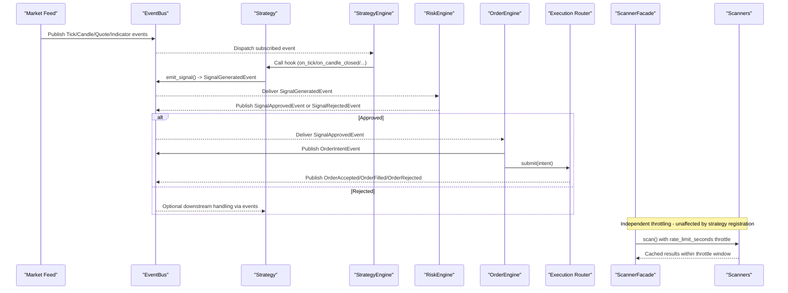

**Diagram sources**
- [strategy_engine.py:48-102](file://ntrade/engines/strategy_engine.py#L48-L102)
- [scanner.py:130-160](file://ntrade/domain/scanner.py#L130-L160)
- [builtin.py:120-128](file://ntrade/scanners/builtin.py#L120-L128)
- [risk_engine.py:73-111](file://ntrade/engines/risk_engine.py#L73-L111)
- [order_engine.py:21-34](file://ntrade/engines/order_engine.py#L21-L34)
- [event_bus.py:47-66](file://ntrade/kernel/event_bus.py#L47-66)
- [market.py:11-83](file://ntrade/events/market.py#L11-L83)
- [risk.py:11-52](file://ntrade/events/risk.py#L11-L52)
- [order.py:11-91](file://ntrade/events/order.py#L11-L91)

## Detailed Component Analysis

### StrategyBase and StrategyEngine
- Strategy defines hook methods for lifecycle events and a helper to emit signals
- StrategyEngine maps event types to hook names and dispatches each event to all enabled strategies
- Errors inside strategy hooks are swallowed to prevent one failing strategy from disrupting the kernel
- Strategies can be dynamically enabled/disabled or removed at runtime
- **Critical Design**: Strategy registration is completely orthogonal to scanner throttling - it never resets ScannerFacade's rate-limit cache

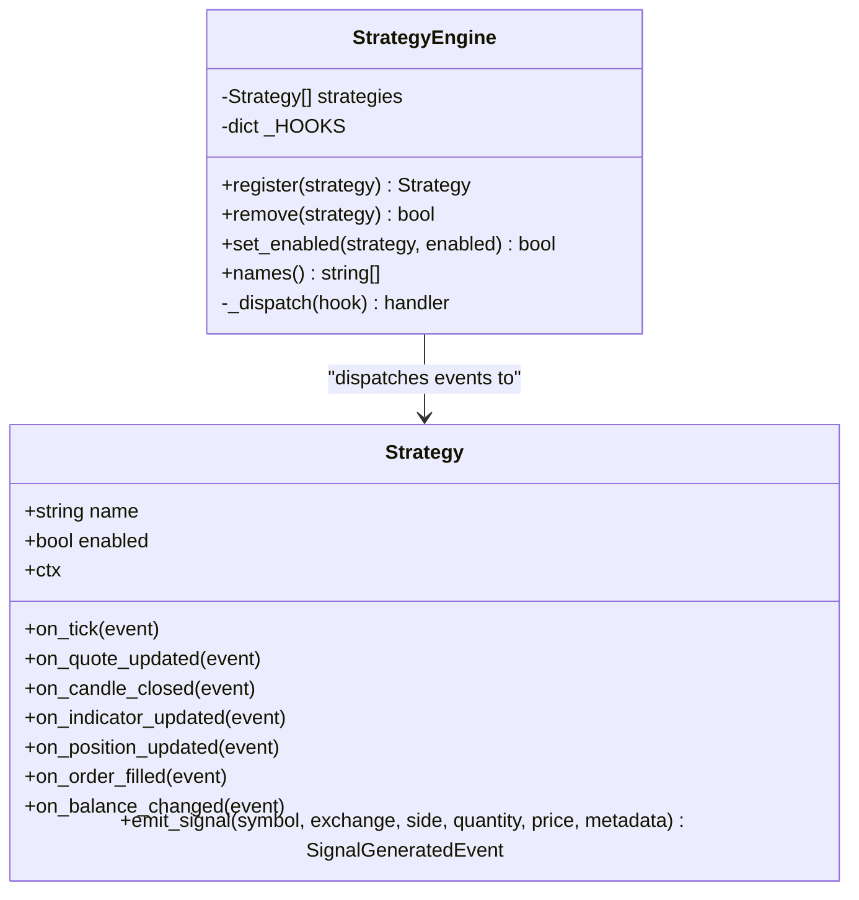

**Updated** Added emphasis on the orthogonal relationship between strategy lifecycle and scanner throttling.

**Diagram sources**
- [strategy_engine.py:18-104](file://ntrade/engines/strategy_engine.py#L18-L104)

**Section sources**
- [strategy_engine.py:18-104](file://ntrade/engines/strategy_engine.py#L18-L104)

### Scanner Throttling and Performance Optimization
- ScannerFacade implements rate-limit throttling to prevent full universe rescans every tick
- Built-in scanners (Momentum, VolumeSpike, Breakout) have `rate_limit_seconds = 30.0` configured
- Throttle cache is keyed by scanner instance AND call parameters for optimal performance
- Strategy registration operations never affect scanner throttling state or cache
- Cache serves cached results within throttle windows, significantly reducing CPU usage
- **Unified Implementation**: ScannerFacade._run is now the canonical path for ranking and throttling, eliminating the divergent Scanner.top implementation

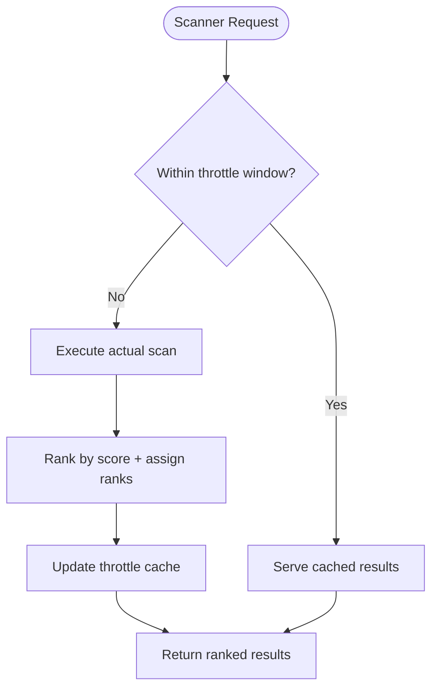

**Diagram sources**
- [scanner.py:130-160](file://ntrade/domain/scanner.py#L130-L160)
- [builtin.py:90](file://ntrade/scanners/builtin.py#L90)
- [builtin.py:128](file://ntrade/scanners/builtin.py#L128)
- [builtin.py:176](file://ntrade/scanners/builtin.py#L176)

**Section sources**
- [scanner.py:67-160](file://ntrade/domain/scanner.py#L67-L160)
- [builtin.py:90](file://ntrade/scanners/builtin.py#L90)
- [builtin.py:128](file://ntrade/scanners/builtin.py#L128)
- [builtin.py:176](file://ntrade/scanners/builtin.py#L176)

### Reusable Strategy Example: EMA Cross
- Reads EMA values from instrument indicators bundle; falls back if not available
- Detects golden/death crosses and emits BUY/SELL signals based on current position
- Demonstrates parameterization (fast/slow periods, quantity, symbol filter)

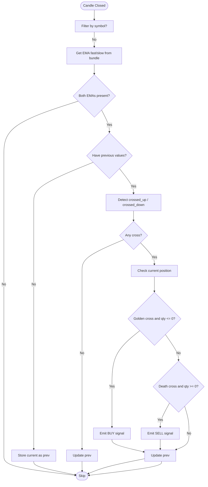

**Diagram sources**
- [strategies.py:13-67](file://ntrade/engines/strategies.py#L13-L67)

**Section sources**
- [strategies.py:13-67](file://ntrade/engines/strategies.py#L13-L67)

### Event Bus and Context
- EventBus provides thread-safe, serialized dispatch with history for replay
- Subscribers receive events according to MRO; exceptions are logged and swallowed
- TradingContext holds bus, clock, mode, instruments, portfolio, account, and session metadata
- Thread safety via reentrant lock protects instrument registration and snapshots

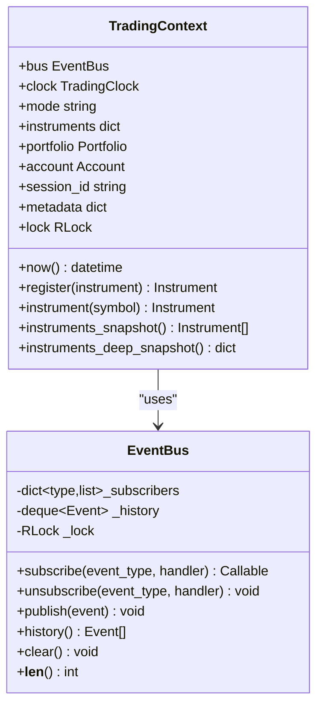

**Diagram sources**
- [event_bus.py:24-81](file://ntrade/kernel/event_bus.py#L24-81)
- [context.py:17-79](file://ntrade/kernel/context.py#L17-L79)

**Section sources**
- [event_bus.py:1-81](file://ntrade/kernel/event_bus.py#L1-L81)
- [context.py:1-79](file://ntrade/kernel/context.py#L1-L79)

### RiskEngine
- Screens signals against allowlist, quantity, notional, max positions, daily loss cap, drawdown limit, and price deviation guard
- Emits RiskHaltedEvent when tripped; supports resume() to clear halt state
- Periodic check() allows mid-session halting even without new signals

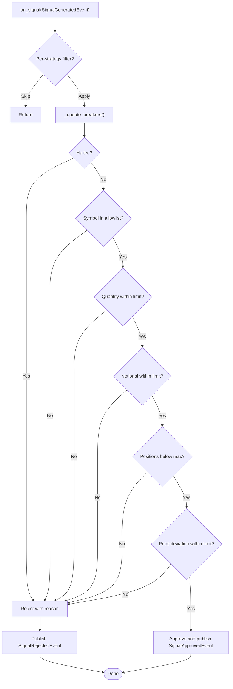

**Diagram sources**
- [risk_engine.py:73-111](file://ntrade/engines/risk_engine.py#L73-L111)

**Section sources**
- [risk_engine.py:19-141](file://ntrade/engines/risk_engine.py#L19-L141)

### OrderEngine
- Converts approved signals into OrderIntentEvent
- Submits intent via router and republishes any immediate rejections

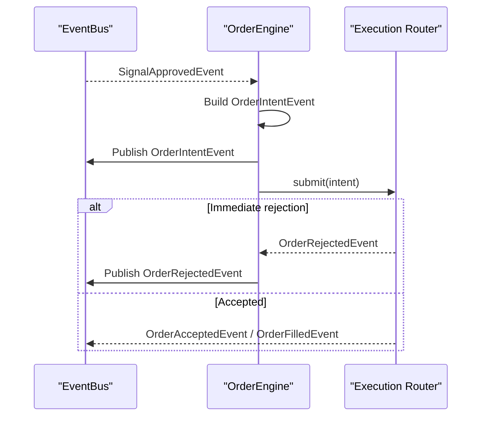

**Diagram sources**
- [order_engine.py:21-34](file://ntrade/engines/order_engine.py#L21-L34)

**Section sources**
- [order_engine.py:14-34](file://ntrade/engines/order_engine.py#L14-L34)

### LiveRunner Orchestration
- Starts feed and kernel, waits for warmup, publishes RunnerStartedEvent
- Loop performs periodic poll_orders(), sync_positions(), watchdog checks, and heartbeat emission
- On RiskHaltedEvent, activates broker kill switches per instrument

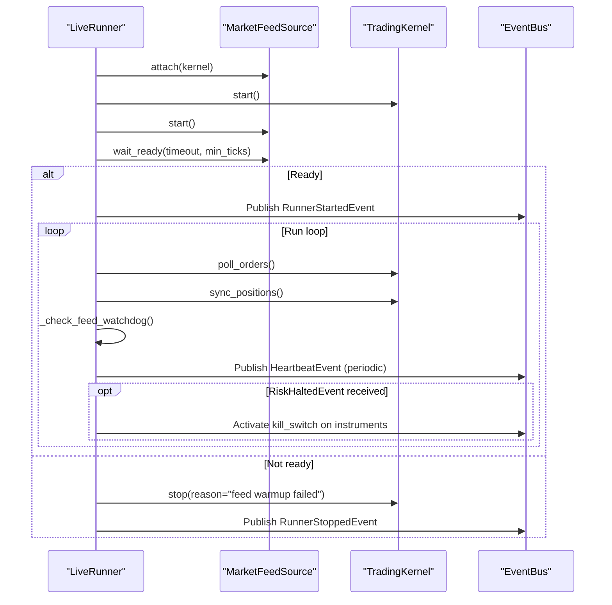

**Diagram sources**
- [live_runner.py:55-141](file://ntrade/runner/live_runner.py#L55-L141)
- [live_runner.py:143-196](file://ntrade/runner/live_runner.py#L143-L196)

**Section sources**
- [live_runner.py:21-196](file://ntrade/runner/live_runner.py#L21-L196)

### TradingSession Integration
- Unified API to connect broker, create instruments, register strategies, and start/stop sessions
- Supports live, paper, and replay modes
- Delegates strategy registration to StrategyRunner and kernel wiring
- Provides independent access to ScannerFacade for scanning operations

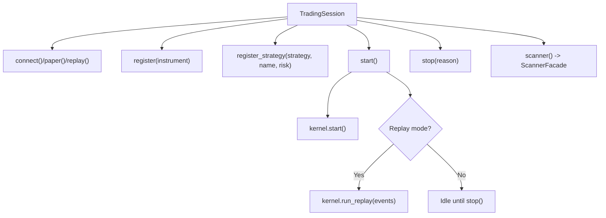

**Diagram sources**
- [trading_session.py:73-142](file://ntrade/kernel/trading_session.py#L73-L142)
- [trading_session.py:225-249](file://ntrade/kernel/trading_session.py#L225-249)
- [trading_session.py:253-258](file://ntrade/kernel/trading_session.py#L253-258)

**Section sources**
- [trading_session.py:39-306](file://ntrade/kernel/trading_session.py#L39-L306)

## Dependency Analysis
The following diagram shows key dependencies among core components, highlighting the independence between strategy and scanner systems:

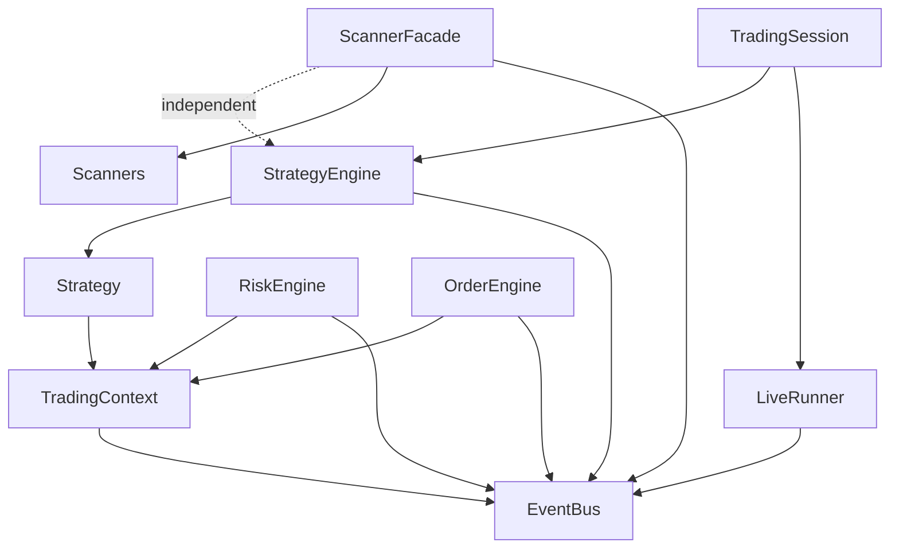

**Updated** Added ScannerFacade and Scanners showing their independent operation separate from StrategyEngine.

**Diagram sources**
- [strategy_engine.py:48-102](file://ntrade/engines/strategy_engine.py#L48-L102)
- [scanner.py:67-160](file://ntrade/domain/scanner.py#L67-L160)
- [builtin.py:120-128](file://ntrade/scanners/builtin.py#L120-L128)
- [risk_engine.py:19-141](file://ntrade/engines/risk_engine.py#L19-L141)
- [order_engine.py:14-34](file://ntrade/engines/order_engine.py#L14-L34)
- [live_runner.py:21-196](file://ntrade/runner/live_runner.py#L21-L196)
- [trading_session.py:39-306](file://ntrade/kernel/trading_session.py#L39-L306)
- [event_bus.py:24-81](file://ntrade/kernel/event_bus.py#L24-81)
- [context.py:17-79](file://ntrade/kernel/context.py#L17-L79)

**Section sources**
- [strategy_engine.py:48-102](file://ntrade/engines/strategy_engine.py#L48-L102)
- [scanner.py:67-160](file://ntrade/domain/scanner.py#L67-L160)
- [builtin.py:120-128](file://ntrade/scanners/builtin.py#L120-L128)
- [risk_engine.py:19-141](file://ntrade/engines/risk_engine.py#L19-L141)
- [order_engine.py:14-34](file://ntrade/engines/order_engine.py#L14-L34)
- [live_runner.py:21-196](file://ntrade/runner/live_runner.py#L21-L196)
- [trading_session.py:39-306](file://ntrade/kernel/trading_session.py#L39-L306)
- [event_bus.py:24-81](file://ntrade/kernel/event_bus.py#L24-81)
- [context.py:17-79](file://ntrade/kernel/context.py#L17-L79)

## Performance Considerations
- Event bus serialization: All handlers run under a reentrant lock; ensure hooks are lightweight and avoid blocking I/O
- History size: EventBus maintains a bounded deque; tune max_history for memory vs. replay needs
- Strategy hook efficiency: Avoid heavy computations in on_tick; prefer on_candle_closed or on_indicator_updated for batched logic
- Risk checks: Use per-strategy RiskEngine instances to limit scope and reduce contention
- LiveRunner intervals: Tune poll_interval and sync_interval to balance responsiveness and overhead
- Indicator bundles: Ensure IndicatorEngine computes only necessary indicators to minimize CPU usage
- **Scanner throttling**: Built-in scanners use 30-second rate limiting to prevent full universe rescans; cache serves results within throttle windows
- **Strategy-scanner independence**: Strategy registration never affects scanner throttling cache, maintaining optimal performance
- **Unified throttling path**: ScannerFacade._run provides consistent ranking and throttling across all scanners, eliminating performance inconsistencies

**Updated** Added specific guidance on scanner throttling performance and the importance of strategy-scanner independence.

## Troubleshooting Guide
Common issues and resolutions:
- Strategy hook exceptions: Logged and swallowed by EventBus; inspect logs to identify failing strategies
- Signals rejected: Review RiskEngine reasons (allowlist, quantity, notional, positions, price deviation)
- Risk halted: Check RiskHaltedEvent reason; verify equity and drawdown metrics; use resume() after conditions normalize
- Feed watchdog: If no ticks observed for multiple checks, LiveRunner triggers RiskHaltedEvent; verify feed connectivity
- Kill switch failures: Inspect logs for broker kill switch activation errors; ensure broker adapter implements kill_switch correctly
- **Scanner performance issues**: Verify rate_limit_seconds configuration; check if throttle cache is working properly
- **Strategy registration impact**: Confirm that strategy registration doesn't unexpectedly trigger scanner rescans
- **Scanner throttling verification**: Use test_facade_ranks_scores_via_run pattern to verify proper ranking and throttling behavior

**Updated** Added troubleshooting guidance for scanner-related issues and strategy registration concerns.

**Section sources**
- [event_bus.py:47-66](file://ntrade/kernel/event_bus.py#L47-L66)
- [risk_engine.py:49-63](file://ntrade/engines/risk_engine.py#L49-L63)
- [live_runner.py:154-196](file://ntrade/runner/live_runner.py#L154-L196)
- [scanner.py:130-160](file://ntrade/domain/scanner.py#L130-L160)

## Conclusion
The StrategyEngine provides a robust, event-driven foundation for trading strategy execution with a critical design principle: complete orthogonality to scanner throttling mechanisms. Its hook-based design enables modular strategy development, while RiskEngine and OrderEngine enforce safety and standardize execution. The ScannerFacade operates independently with sophisticated rate-limit throttling that is never affected by strategy lifecycle operations. LiveRunner ensures operational resilience with feed monitoring, periodic reconciliation, and emergency kill-switch capabilities. Together, these components support consistent behavior across live, replay, and backtest environments while maintaining optimal performance through independent subsystems.

## Appendices

### Strategy Development Patterns
- Implement minimal hooks required for your strategy (e.g., on_candle_closed)
- Use ctx.instrument(symbol)._indicators to access computed indicators; fall back to local computation if unavailable
- Emit signals via emit_signal() with appropriate metadata for traceability
- Parameterize strategies (periods, quantities, symbols) and register multiple instances with distinct names
- **Important**: Strategy registration operations are completely independent of scanner throttling mechanisms

**Section sources**
- [strategies.py:13-67](file://ntrade/engines/strategies.py#L13-L67)
- [strategy_engine.py:37-46](file://ntrade/engines/strategy_engine.py#L37-L46)

### Backtesting Integration
- Use TradingSession.replay(events) to drive the kernel with pre-recorded events
- ReplayClock ensures deterministic timestamps identical to live mode
- Validate strategies against historical candles and indicator bundles
- Scanner throttling works consistently across all modes for reliable performance testing

**Section sources**
- [trading_session.py:118-142](file://ntrade/kernel/trading_session.py#L118-L142)

### Live Trading Deployment Strategies
- Use TradingSession.connect(broker) for live sessions
- Wire LiveRunner with appropriate poll and sync intervals
- Monitor HeartbeatEvent for liveness and open order counts
- Handle RiskHaltedEvent to activate broker kill switches and pause trading
- Leverage scanner throttling for optimal performance during live trading

**Section sources**
- [trading_session.py:73-94](file://ntrade/kernel/trading_session.py#L73-L94)
- [live_runner.py:55-141](file://ntrade/runner/live_runner.py#L55-L141)
- [lifecycle.py:44-57](file://ntrade/events/lifecycle.py#L44-L57)

### Scanner Throttling Configuration
- Built-in scanners (Momentum, VolumeSpike, Breakout) have 30-second rate limiting configured
- Custom scanners can set `rate_limit_seconds` attribute for throttling control
- Throttle cache is keyed by scanner instance and call parameters
- Strategy registration never affects scanner throttling state or cache
- **Unified Implementation**: ScannerFacade._run is the canonical path for ranking and throttling, ensuring consistent behavior across all scanners

**Section sources**
- [builtin.py:90](file://ntrade/scanners/builtin.py#L90)
- [builtin.py:128](file://ntrade/scanners/builtin.py#L128)
- [builtin.py:176](file://ntrade/scanners/builtin.py#L176)
- [scanner.py:130-160](file://ntrade/domain/scanner.py#L130-L160)