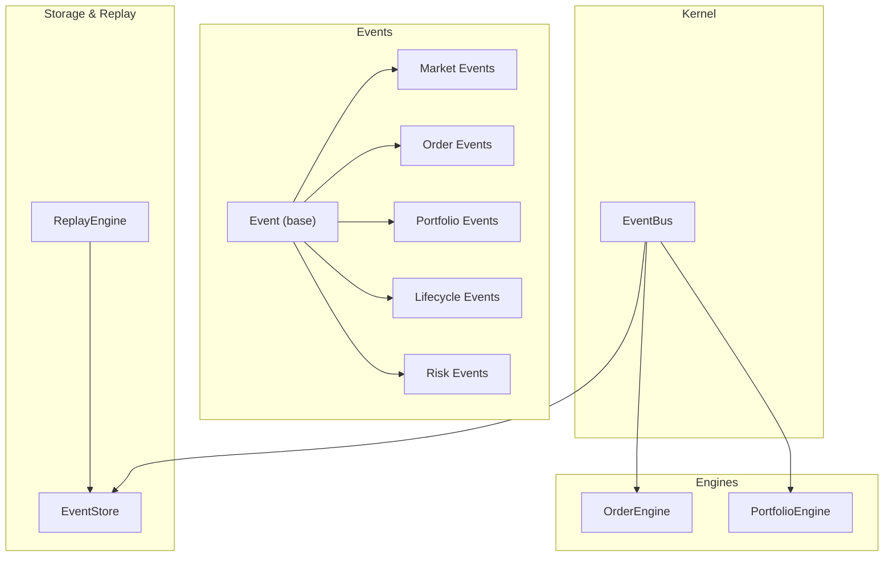
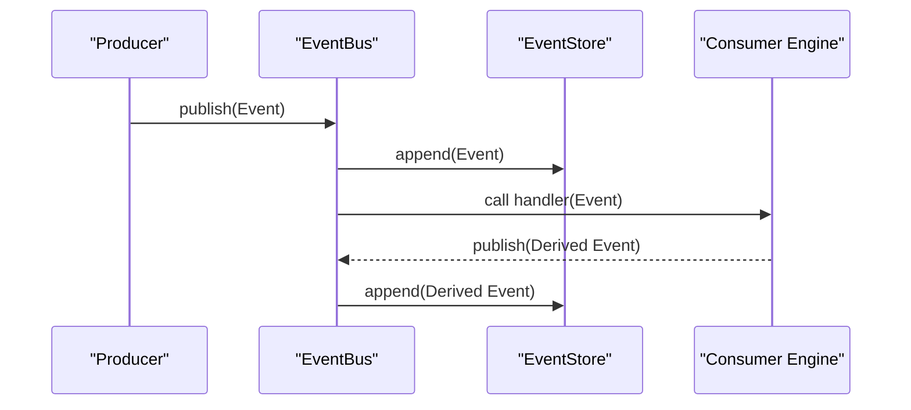
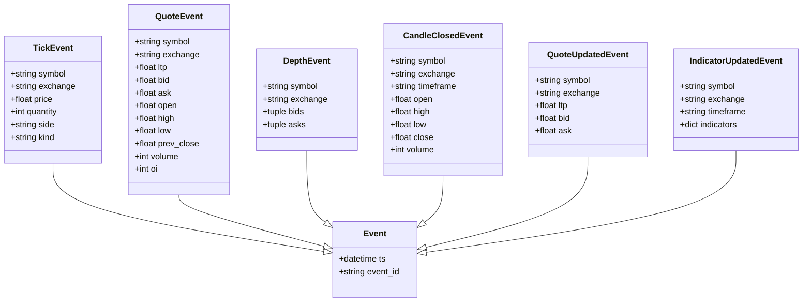
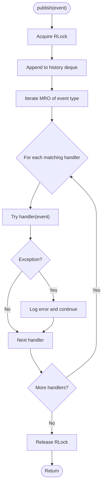
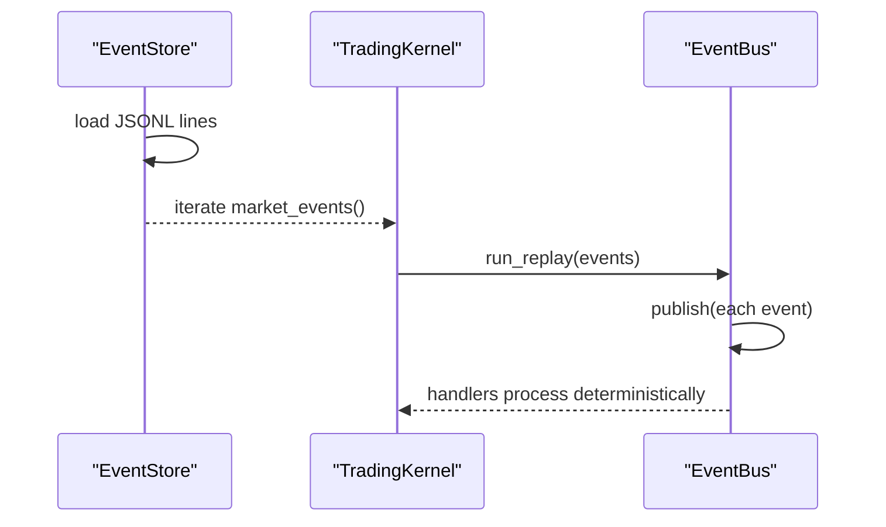
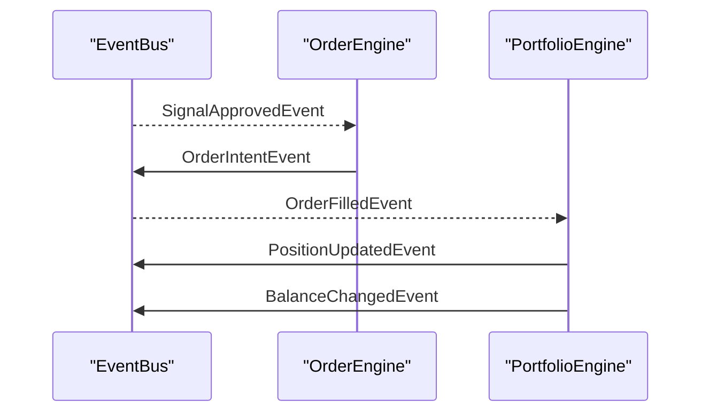
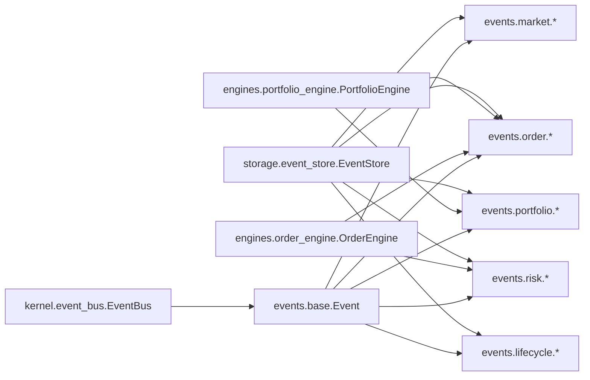
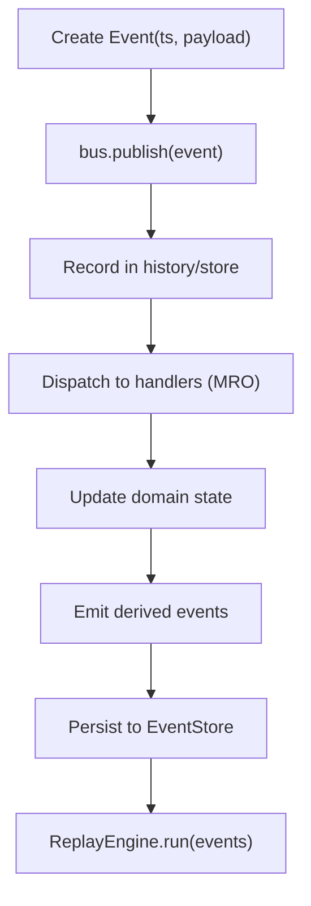

# Events System

<cite>
**Referenced Files in This Document**
- [base.py](file://ntrade/events/base.py)
- [event_bus.py](file://ntrade/kernel/event_bus.py)
- [market.py](file://ntrade/events/market.py)
- [order.py](file://ntrade/events/order.py)
- [portfolio.py](file://ntrade/events/portfolio.py)
- [lifecycle.py](file://ntrade/events/lifecycle.py)
- [risk.py](file://ntrade/events/risk.py)
- [event_store.py](file://ntrade/storage/event_store.py)
- [replay_engine.py](file://ntrade/replay/replay_engine.py)
- [order_engine.py](file://ntrade/engines/order_engine.py)
- [portfolio_engine.py](file://ntrade/engines/portfolio_engine.py)
- [test_event_bus_threads.py](file://tests/test_event_bus_threads.py)
- [test_kernel_recording.py](file://tests/test_kernel_recording.py)
</cite>

## Table of Contents
1. [Introduction](#introduction)
2. [Project Structure](#project-structure)
3. [Core Components](#core-components)
4. [Architecture Overview](#architecture-overview)
5. [Detailed Component Analysis](#detailed-component-analysis)
6. [Dependency Analysis](#dependency-analysis)
7. [Performance Considerations](#performance-considerations)
8. [Troubleshooting Guide](#troubleshooting-guide)
9. [Conclusion](#conclusion)
10. [Appendices](#appendices)

## Introduction
This document explains the event-driven architecture and event system used by the trading kernel. It covers the base Event class and frozen dataclass pattern for immutable payloads, the full set of domain events (market, order, portfolio, lifecycle, risk), the EventBus publish-subscribe implementation with handler registration and error isolation, the end-to-end event lifecycle from creation to dispatch and handler execution, serialization for persistence and replay, and how events update domain state such as instrument positions. It also includes performance considerations for high-frequency processing, memory management, debugging techniques, and design principles that decouple components.

## Project Structure
The event system is organized into clear layers:
- Base model and bus: ntrade/events/base.py defines the canonical Event; ntrade/kernel/event_bus.py implements the synchronous, thread-safe publish-subscribe bus.
- Domain events: ntrade/events/{market,order,portfolio,lifecycle,risk}.py define typed, frozen dataclasses for each domain.
- Engines consuming events: ntrade/engines/{order_engine,portfolio_engine}.py subscribe to specific events and publish follow-up events.
- Persistence and replay: ntrade/storage/event_store.py serializes and replays events deterministically; ntrade/replay/replay_engine.py drives a kernel over recorded streams.

**Diagram sources**
- [base.py:1-22](file://ntrade/events/base.py#L1-L22)
- [event_bus.py:1-81](file://ntrade/kernel/event_bus.py#L1-L81)
- [market.py:1-83](file://ntrade/events/market.py#L1-L83)
- [order.py:1-91](file://ntrade/events/order.py#L1-L91)
- [portfolio.py:1-27](file://ntrade/events/portfolio.py#L1-L27)
- [lifecycle.py:1-57](file://ntrade/events/lifecycle.py#L1-L57)
- [risk.py:1-52](file://ntrade/events/risk.py#L1-L52)
- [event_store.py:1-236](file://ntrade/storage/event_store.py#L1-L236)
- [replay_engine.py:1-24](file://ntrade/replay/replay_engine.py#L1-L24)
- [order_engine.py:1-34](file://ntrade/engines/order_engine.py#L1-L34)
- [portfolio_engine.py:1-69](file://ntrade/engines/portfolio_engine.py#L1-L69)

**Section sources**
- [base.py:1-22](file://ntrade/events/base.py#L1-L22)
- [event_bus.py:1-81](file://ntrade/kernel/event_bus.py#L1-L81)
- [market.py:1-83](file://ntrade/events/market.py#L1-L83)
- [order.py:1-91](file://ntrade/events/order.py#L1-L91)
- [portfolio.py:1-27](file://ntrade/events/portfolio.py#L1-L27)
- [lifecycle.py:1-57](file://ntrade/events/lifecycle.py#L1-L57)
- [risk.py:1-52](file://ntrade/events/risk.py#L1-L52)
- [event_store.py:1-236](file://ntrade/storage/event_store.py#L1-L236)
- [replay_engine.py:1-24](file://ntrade/replay/replay_engine.py#L1-L24)
- [order_engine.py:1-34](file://ntrade/engines/order_engine.py#L1-L34)
- [portfolio_engine.py:1-69](file://ntrade/engines/portfolio_engine.py#L1-L69)

## Core Components
- Base Event and frozen dataclass pattern: All events inherit from a minimal base carrying a deterministic timestamp and an ID. Frozen dataclasses ensure immutability, hashability, and deterministic serialization for replay.
- EventBus: A small, synchronous pub/sub bus with:
  - Handler registration by type (including inheritance via MRO).
  - Thread-safe publish with a reentrant lock to serialize dispatch across threads.
  - Error isolation: exceptions in handlers are caught and logged without stopping the bus.
  - Bounded history for recent events and utilities to clear or inspect.
- Domain events: Typed, immutable payloads grouped by domain:
  - Market: Tick, Quote, Depth, CandleClosed, QuoteUpdated, IndicatorUpdated.
  - Order: OrderIntent, OrderAccepted, OrderRejected, OrderFilled, OrderUpdated, OrderTimeout.
  - Portfolio: PositionUpdated, BalanceChanged.
  - Lifecycle: KernelStarted, SessionStarted, SessionStopped, RunnerStarted, RunnerStopped, Heartbeat, FeedDisconnected.
  - Risk: SignalGenerated, SignalApproved, SignalRejected, RiskHalted, RiskResumed.
- EventStore: Append-only JSONL-backed store with encode/decode for all registered event types, query helpers, and deterministic recovery/replay sequences.
- ReplayEngine: Drives a TradingKernel over recorded market events to achieve zero-parity between live and replay.

**Section sources**
- [base.py:1-22](file://ntrade/events/base.py#L1-L22)
- [event_bus.py:1-81](file://ntrade/kernel/event_bus.py#L1-L81)
- [market.py:1-83](file://ntrade/events/market.py#L1-L83)
- [order.py:1-91](file://ntrade/events/order.py#L1-L91)
- [portfolio.py:1-27](file://ntrade/events/portfolio.py#L1-L27)
- [lifecycle.py:1-57](file://ntrade/events/lifecycle.py#L1-L57)
- [risk.py:1-52](file://ntrade/events/risk.py#L1-L52)
- [event_store.py:1-236](file://ntrade/storage/event_store.py#L1-L236)
- [replay_engine.py:1-24](file://ntrade/replay/replay_engine.py#L1-L24)

## Architecture Overview
The system follows a strict event-driven design:
- Producers (feeds, simulators, engines) publish immutable events to the EventBus.
- Consumers (engines, strategies, monitors) subscribe to event types and react by updating state and publishing new events.
- The EventStore records every event for persistence, auditing, crash recovery, and deterministic replay.

**Diagram sources**
- [event_bus.py:47-66](file://ntrade/kernel/event_bus.py#L47-L66)
- [event_store.py:89-99](file://ntrade/storage/event_store.py#L89-L99)

**Section sources**
- [event_bus.py:1-81](file://ntrade/kernel/event_bus.py#L1-L81)
- [event_store.py:1-236](file://ntrade/storage/event_store.py#L1-L236)

## Detailed Component Analysis

### Base Event and Frozen Dataclass Pattern
- Immutable, hashable payloads ensure safe sharing across threads and deterministic ordering during replay.
- Timestamps come from the kernel clock to guarantee identical behavior across live, replay, and backtest modes.
- Auto-generated IDs provide stable identity for correlation and audit trails.

**Diagram sources**
- [base.py:16-22](file://ntrade/events/base.py#L16-L22)
- [market.py:11-83](file://ntrade/events/market.py#L11-L83)

**Section sources**
- [base.py:1-22](file://ntrade/events/base.py#L1-L22)
- [market.py:1-83](file://ntrade/events/market.py#L1-L83)

### EventBus Implementation
Key behaviors:
- Type-based subscription supports inheritance via MRO so subscribing to a base receives subclasses.
- Publish serializes access with a reentrant lock to prevent concurrent dispatch races.
- Exceptions in handlers are caught and logged; one failing handler cannot stop others.
- History is bounded and thread-safe; clear and length operations are protected.

**Diagram sources**
- [event_bus.py:47-66](file://ntrade/kernel/event_bus.py#L47-L66)

**Section sources**
- [event_bus.py:1-81](file://ntrade/kernel/event_bus.py#L1-L81)
- [test_event_bus_threads.py:1-63](file://tests/test_event_bus_threads.py#L1-L63)

### Market Events
- TickEvent: single trade/quote/depth print with symbol, exchange, price, quantity, side, kind.
- QuoteEvent: snapshot fields including last, bid/ask, OHLC, volume, OI.
- DepthEvent: order book snapshots with tuples of (price, qty, orders).
- CandleClosedEvent: produced by candle engine after a period closes.
- QuoteUpdatedEvent: broadcast after projection into instruments.
- IndicatorUpdatedEvent: indicator bundles computed on completed candles.

Use cases:
- Strategy engines consume ticks and quotes to compute signals.
- Candle engine aggregates ticks into closed candles.
- Indicator engine emits updated indicators per timeframe.

**Section sources**
- [market.py:1-83](file://ntrade/events/market.py#L1-L83)

### Order Events
- OrderIntentEvent: pre-execution intent derived from approved signals.
- OrderAcceptedEvent: execution target accepted the order.
- OrderRejectedEvent: execution target or risk rejected the order.
- OrderFilledEvent: fill with price, commission, statutory charges, strategy tag.
- OrderUpdatedEvent: lifecycle status changes (PENDING, PARTIALLY_FILLED, etc.).
- OrderTimeoutEvent: pending order exceeded timeout.

Flow example:
- Risk approves signal → OrderEngine materializes intent → Execution returns acceptance/failure → Fills arrive later.

**Section sources**
- [order.py:1-91](file://ntrade/events/order.py#L1-L91)
- [order_engine.py:1-34](file://ntrade/engines/order_engine.py#L1-L34)

### Portfolio Events
- PositionUpdatedEvent: position quantity and average price updates after fills.
- BalanceChangedEvent: account balance changes due to notional and charges.

Behavior:
- PortfolioEngine consumes OrderFilledEvent to net positions, adjust cash, and publish updates.

**Section sources**
- [portfolio.py:1-27](file://ntrade/events/portfolio.py#L1-L27)
- [portfolio_engine.py:1-69](file://ntrade/engines/portfolio_engine.py#L1-L69)

### Lifecycle Events
- KernelStartedEvent: kernel wiring complete and live.
- SessionStartedEvent/SessionStoppedEvent: session boundaries with IDs and reasons.
- RunnerStartedEvent/RunnerStoppedEvent: orchestration loop boundaries.
- HeartbeatEvent: periodic liveness probe with tick count and open orders.
- FeedDisconnectedEvent: feed websocket disconnect reason.

Usage:
- Observers monitor health and orchestrate restarts or graceful shutdowns.

**Section sources**
- [lifecycle.py:1-57](file://ntrade/events/lifecycle.py#L1-L57)

### Risk Events
- SignalGeneratedEvent: strategy’s intended trade parameters.
- SignalApprovedEvent/SignalRejectedEvent: risk gate decisions.
- RiskHaltedEvent/RiskResumedEvent: circuit breaker states with equity context.

Usage:
- Risk engine evaluates signals and enforces limits; halts/resumes trading based on thresholds.

**Section sources**
- [risk.py:1-52](file://ntrade/events/risk.py#L1-L52)

### Event Serialization and Replay
- EventStore encodes events to JSONL with recursive handling of nested events and datetime serialization.
- Decoding reconstructs typed events using a registry of known event classes.
- Query helpers filter by type and symbol; specialized methods extract market-only events and recovery sequences.
- Recovery sorts by timestamp then insertion index to preserve causality when timestamps tie.
- ReplayEngine runs a kernel over recorded market events to achieve deterministic parity.

**Diagram sources**
- [event_store.py:51-74](file://ntrade/storage/event_store.py#L51-L74)
- [event_store.py:116-135](file://ntrade/storage/event_store.py#L116-L135)
- [event_store.py:183-210](file://ntrade/storage/event_store.py#L183-L210)
- [replay_engine.py:1-24](file://ntrade/replay/replay_engine.py#L1-L24)

**Section sources**
- [event_store.py:1-236](file://ntrade/storage/event_store.py#L1-L236)
- [replay_engine.py:1-24](file://ntrade/replay/replay_engine.py#L1-L24)
- [test_kernel_recording.py:1-94](file://tests/test_kernel_recording.py#L1-L94)

### Relationship Between Events and Domain Objects
- OrderFilledEvent drives PortfolioEngine to update Position objects and account balances, then publishes PositionUpdatedEvent and BalanceChangedEvent.
- Market events flow through engines to produce derived events (candles, indicators, quote projections) which strategies consume to generate signals.
- Events carry enough metadata (symbol, exchange, strategy tags) to correlate with domain entities without tight coupling.

**Diagram sources**
- [order_engine.py:14-34](file://ntrade/engines/order_engine.py#L14-L34)
- [portfolio_engine.py:15-69](file://ntrade/engines/portfolio_engine.py#L15-L69)

**Section sources**
- [order_engine.py:1-34](file://ntrade/engines/order_engine.py#L1-L34)
- [portfolio_engine.py:1-69](file://ntrade/engines/portfolio_engine.py#L1-L69)

## Dependency Analysis
- Event modules depend only on the base Event and standard library.
- Engines depend on specific event types and the shared bus via a context object.
- EventStore registers all event modules to support dynamic decode.
- Tests validate concurrency, isolation, and recording/replay equivalence.

**Diagram sources**
- [base.py:1-22](file://ntrade/events/base.py#L1-L22)
- [event_bus.py:1-81](file://ntrade/kernel/event_bus.py#L1-L81)
- [market.py:1-83](file://ntrade/events/market.py#L1-L83)
- [order.py:1-91](file://ntrade/events/order.py#L1-L91)
- [portfolio.py:1-27](file://ntrade/events/portfolio.py#L1-L27)
- [lifecycle.py:1-57](file://ntrade/events/lifecycle.py#L1-L57)
- [risk.py:1-52](file://ntrade/events/risk.py#L1-L52)
- [event_store.py:18-29](file://ntrade/storage/event_store.py#L18-L29)
- [order_engine.py:1-34](file://ntrade/engines/order_engine.py#L1-L34)
- [portfolio_engine.py:1-69](file://ntrade/engines/portfolio_engine.py#L1-L69)

**Section sources**
- [event_store.py:18-29](file://ntrade/storage/event_store.py#L18-L29)
- [order_engine.py:1-34](file://ntrade/engines/order_engine.py#L1-L34)
- [portfolio_engine.py:1-69](file://ntrade/engines/portfolio_engine.py#L1-L69)

## Performance Considerations
- Immutability: Frozen dataclasses avoid accidental mutation and enable safe sharing across threads.
- Serialization overhead: JSONL encoding/decoding is efficient but should be used judiciously in hot paths; prefer in-memory bus for real-time dispatch.
- Memory management:
  - EventBus maintains a bounded deque for history; tune max_history to balance observability vs memory.
  - EventStore persists to disk; use streaming writes and periodic flushes to limit IO bursts.
- Concurrency:
  - EventBus uses a reentrant lock to serialize publish/dispatch; keep handlers fast and non-blocking.
  - Avoid long-running work inside handlers; offload heavy tasks to background workers.
- Deterministic replay:
  - Use market-only events for replay to avoid double-application of derived effects.
  - Causal ordering relies on timestamp plus insertion index to resolve ties.

[No sources needed since this section provides general guidance]

## Troubleshooting Guide
Common issues and remedies:
- Handler exceptions:
  - Symptoms: missing downstream updates, logs showing errors.
  - Cause: exceptions in handlers are swallowed; check logs under the bus logger.
  - Fix: isolate slow or failing logic; add retries or dead-letter queues outside the bus.
- Lost events under concurrency:
  - Symptoms: inconsistent counts between seen and history.
  - Cause: race conditions if bus was not locked.
  - Fix: ensure EventBus uses serialized publish; verify tests pass.
- Incorrect replay results:
  - Symptoms: different fills or state than live.
  - Cause: feeding derived events instead of raw market events; incorrect causal ordering.
  - Fix: use EventStore.market_events() and recovery_events() for deterministic replay.
- High memory usage:
  - Symptoms: growing history or large JSONL files.
  - Cause: unbounded history or excessive logging.
  - Fix: reduce max_history; rotate or truncate stored files; avoid storing large payloads in events.

**Section sources**
- [event_bus.py:47-66](file://ntrade/kernel/event_bus.py#L47-L66)
- [test_event_bus_threads.py:1-63](file://tests/test_event_bus_threads.py#L1-L63)
- [test_kernel_recording.py:1-94](file://tests/test_kernel_recording.py#L1-L94)
- [event_store.py:116-135](file://ntrade/storage/event_store.py#L116-L135)

## Conclusion
The event system provides a robust, deterministic foundation for the trading kernel. Immutable, typed events decouple producers and consumers, while the EventBus ensures safe, isolated dispatch. EventStore enables persistence, auditing, and exact replay, ensuring parity between live and simulated environments. Engines transform market inputs into order flows and portfolio updates, maintaining clear separation of concerns and enabling scalable, testable systems.

[No sources needed since this section summarizes without analyzing specific files]

## Appendices

### Creating Custom Events
Steps:
- Define a new frozen dataclass inheriting from Event with kw_only=True.
- Include necessary payload fields (e.g., symbol, exchange, quantities, prices).
- Ensure timestamps are provided by the kernel clock.
- Register any new module with EventStore if you need decoding support.

Example references:
- See existing event definitions for patterns and field conventions.

**Section sources**
- [base.py:16-22](file://ntrade/events/base.py#L16-L22)
- [market.py:11-83](file://ntrade/events/market.py#L11-L83)
- [event_store.py:18-29](file://ntrade/storage/event_store.py#L18-L29)

### Registering Handlers and Processing Streams
- Subscribe to event types using bus.subscribe(type, handler).
- Unsubscribe when handlers are no longer needed.
- Process streams by iterating bus.history or EventStore.replay() for post-mortem analysis.

Practical examples:
- Observe lifecycle events for heartbeat monitoring.
- Track order lifecycle via OrderAccepted/OrderFilled/OrderRejected.

**Section sources**
- [event_bus.py:30-45](file://ntrade/kernel/event_bus.py#L30-L45)
- [lifecycle.py:44-57](file://ntrade/events/lifecycle.py#L44-L57)
- [order.py:24-64](file://ntrade/events/order.py#L24-L64)
- [event_store.py:212-214](file://ntrade/storage/event_store.py#L212-L214)

### Event Lifecycle Summary
- Creation: producer constructs an immutable Event with kernel timestamp.
- Dispatch: EventBus appends to history and calls matching handlers in MRO order.
- Effects: handlers update domain state and may publish derived events.
- Persistence: EventStore records events for replay and recovery.
- Replay: ReplayEngine feeds market events to a fresh kernel for deterministic outcomes.

**Diagram sources**
- [event_bus.py:47-66](file://ntrade/kernel/event_bus.py#L47-L66)
- [event_store.py:89-99](file://ntrade/storage/event_store.py#L89-L99)
- [replay_engine.py:21-24](file://ntrade/replay/replay_engine.py#L21-L24)