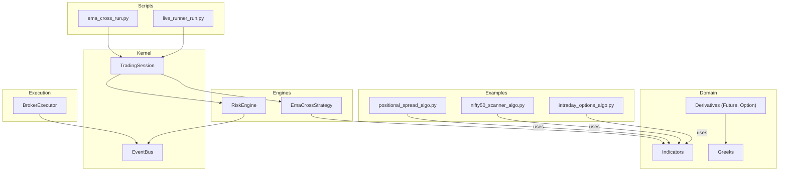
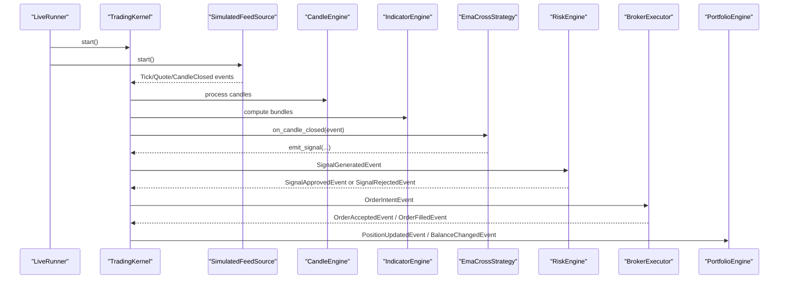
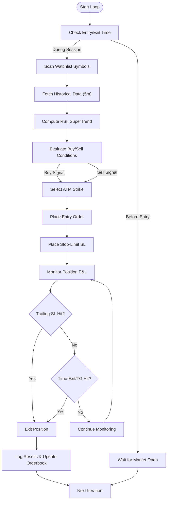
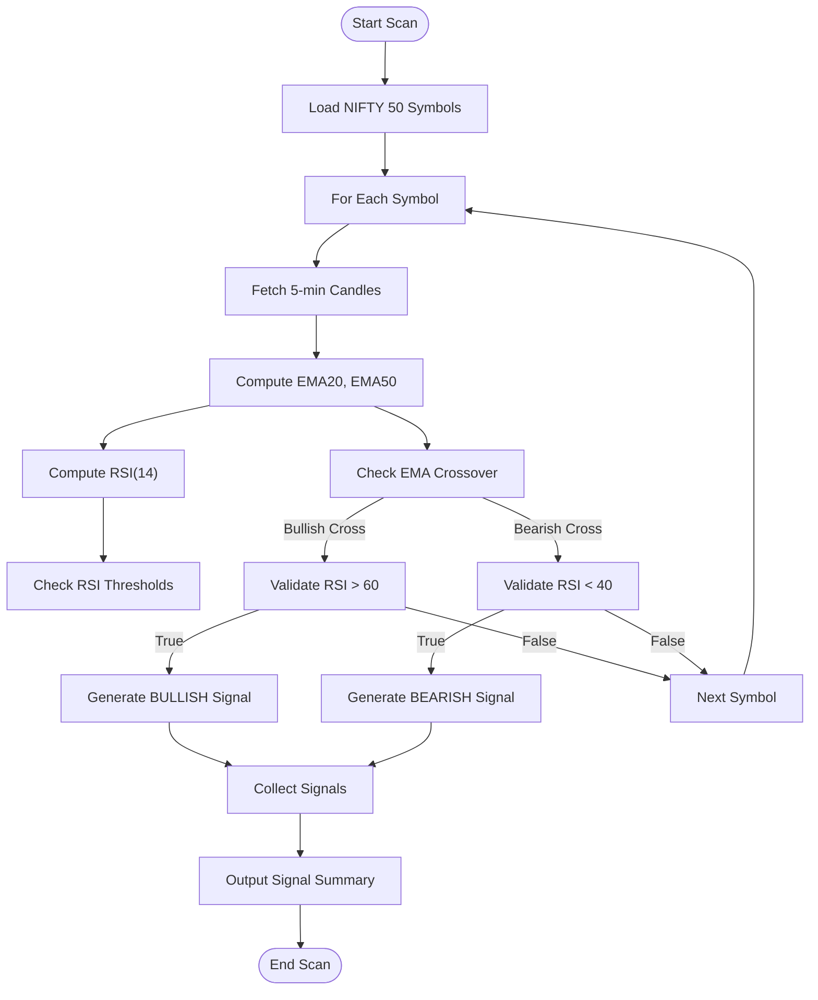
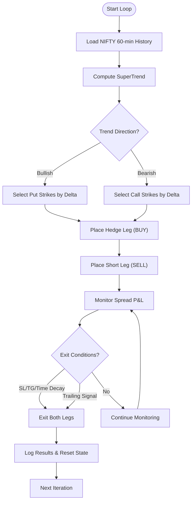
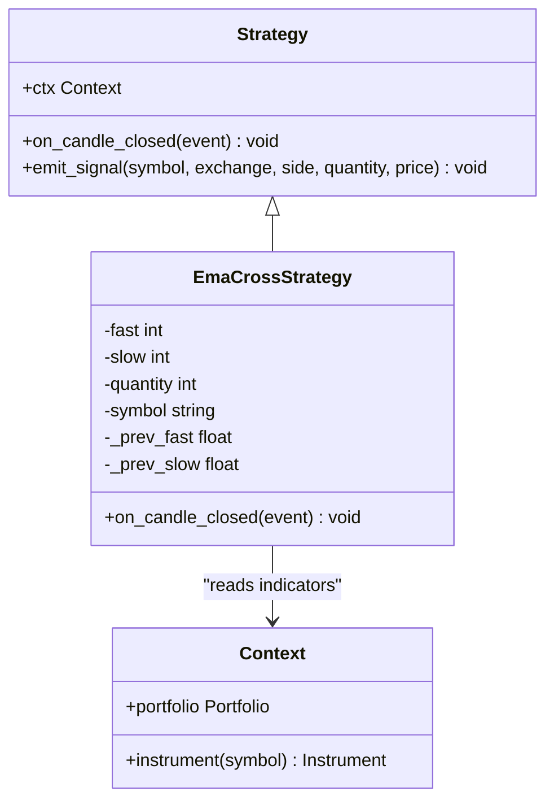
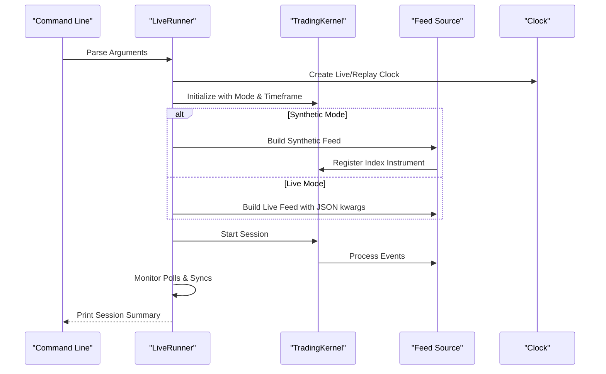
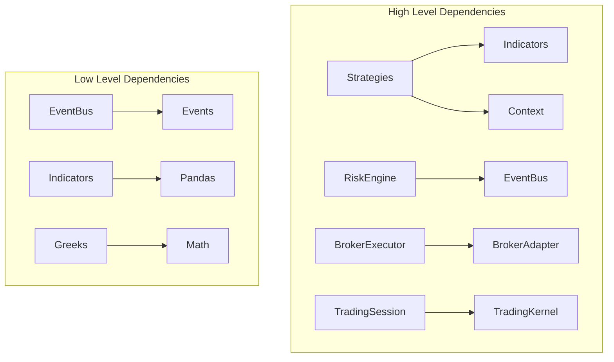

# Advanced Strategy Examples

<cite>
**Referenced Files in This Document**
- [intraday_options_algo.py](file://.agents/skills/dhan-tradehull/examples/intraday_options_algo.py)
- [nifty50_scanner_algo.py](file://.agents/skills/dhan-tradehull/examples/nifty50_scanner_algo.py)
- [positional_spread_algo.py](file://.agents/skills/dhan-tradehull/examples/positional_spread_algo.py)
- [live_runner_run.py](file://scripts/live_runner_run.py)
- [ema_cross_run.py](file://scripts/ema_cross_run.py)
- [strategies.py](file://ntrade/engines/strategies.py)
- [trading_session.py](file://ntrade/kernel/trading_session.py)
- [derivatives.py](file://ntrade/domain/instruments/derivatives.py)
- [indicators.py](file://ntrade/domain/analytics/indicators.py)
- [greeks.py](file://ntrade/domain/analytics/greeks.py)
- [broker_executor.py](file://ntrade/execution/broker_executor.py)
- [event_bus.py](file://ntrade/kernel/event_bus.py)
- [risk_engine.py](file://ntrade/engines/risk_engine.py)
</cite>

## Table of Contents
1. [Introduction](#introduction)
2. [Project Structure](#project-structure)
3. [Core Components](#core-components)
4. [Architecture Overview](#architecture-overview)
5. [Detailed Component Analysis](#detailed-component-analysis)
6. [Dependency Analysis](#dependency-analysis)
7. [Performance Considerations](#performance-considerations)
8. [Troubleshooting Guide](#troubleshooting-guide)
9. [Conclusion](#conclusion)
10. [Appendices](#appendices)

## Introduction
This document provides advanced strategy implementation examples for experienced traders and developers using the nTrade framework and Dhan Tradehull skill examples. It covers multi-timeframe analysis, options trading strategies, statistical arbitrage patterns, custom strategy development with event handling, risk management integration, performance optimization, production deployment via live runner scripts, multi-broker execution, real-time monitoring, sophisticated pattern recognition, machine learning integration approaches, testing methodologies, parameter optimization, and walk-forward analysis techniques.

## Project Structure
The repository is organized into domain modules (instruments, analytics), engine layers (candle, indicator, market, order, portfolio, risk, strategies), kernel (clock, session, event bus), execution (broker executor, simulator), runners (live runner), sources (feeds), and example scripts under .agents/skills/dhan-tradehull/examples. The live runner script orchestrates synthetic or live feeds through the TradingKernel and LiveRunner to exercise the full pipeline from data ingestion to execution and portfolio updates.

**Diagram sources**
- [live_runner_run.py:1-69](file://scripts/live_runner_run.py#L1-L69)
- [ema_cross_run.py:1-87](file://scripts/ema_cross_run.py#L1-L87)
- [trading_session.py:1-306](file://ntrade/kernel/trading_session.py#L1-L306)
- [strategies.py:1-67](file://ntrade/engines/strategies.py#L1-L67)
- [indicators.py:1-194](file://ntrade/domain/analytics/indicators.py#L1-L194)
- [derivatives.py:1-245](file://ntrade/domain/instruments/derivatives.py#L1-L245)
- [greeks.py:1-120](file://ntrade/domain/analytics/greeks.py#L1-L120)
- [broker_executor.py:1-262](file://ntrade/execution/broker_executor.py#L1-L262)
- [event_bus.py:1-81](file://ntrade/kernel/event_bus.py#L1-L81)

**Section sources**
- [live_runner_run.py:1-69](file://scripts/live_runner_run.py#L1-L69)
- [ema_cross_run.py:1-87](file://scripts/ema_cross_run.py#L1-L87)
- [trading_session.py:1-306](file://ntrade/kernel/trading_session.py#L1-L306)

## Core Components
- EmaCrossStrategy: A momentum strategy that reacts to EMA fast/slow crossovers on candle close events, emitting signals based on position state and crossing direction.
- RiskEngine: Screens signals before they become order intents, enforcing quantity, notional, position count, allowlist, daily loss cap, drawdown limits, and price deviation guards; can halt/resume trading.
- BrokerExecutor: Routes order intents to a broker adapter, handles asynchronous lifecycle, publishes accepted/filled/rejected/timeout events, supports partial fills and crash recovery.
- TradingSession: Unified entry point combining broker connection, instrument creation, kernel, and strategy runner; supports live, paper, and replay modes.
- Indicators: Pure functions over OHLCV frames for RSI, ATR, SMA, EMA, VWAP, SuperTrend, Heikin-Ashi, Renko bricks, and a compute_bundle utility.
- Derivatives: Future and Option instruments with Greeks support, Black-Scholes pricing, implied volatility solver, intrinsic/extrinsic value, moneyness, payoff, and continuous series utilities.
- Greeks: Black-Scholes pricing engine and Greeks computation, including IV solver with sentinel values to distinguish computed vs not-computed states.
- EventBus: Synchronous publish/subscribe bus with history recording, reentrant lock for thread safety, and robust handler exception swallowing.

**Section sources**
- [strategies.py:1-67](file://ntrade/engines/strategies.py#L1-L67)
- [risk_engine.py:1-141](file://ntrade/engines/risk_engine.py#L1-L141)
- [broker_executor.py:1-262](file://ntrade/execution/broker_executor.py#L1-L262)
- [trading_session.py:1-306](file://ntrade/kernel/trading_session.py#L1-L306)
- [indicators.py:1-194](file://ntrade/domain/analytics/indicators.py#L1-L194)
- [derivatives.py:1-245](file://ntrade/domain/instruments/derivatives.py#L1-L245)
- [greeks.py:1-120](file://ntrade/domain/analytics/greeks.py#L1-L120)
- [event_bus.py:1-81](file://ntrade/kernel/event_bus.py#L1-L81)

## Architecture Overview
The system follows an event-driven architecture where data flows through engines and strategies, publishing canonical events consumed by downstream components. The live runner script demonstrates both synthetic and live feed modes, integrating with the TradingKernel to orchestrate candles, indicators, strategies, risk checks, and execution.

**Diagram sources**
- [live_runner_run.py:1-69](file://scripts/live_runner_run.py#L1-L69)
- [ema_cross_run.py:1-87](file://scripts/ema_cross_run.py#L1-L87)
- [strategies.py:1-67](file://ntrade/engines/strategies.py#L1-L67)
- [risk_engine.py:1-141](file://ntrade/engines/risk_engine.py#L1-L141)
- [broker_executor.py:1-262](file://ntrade/execution/broker_executor.py#L1-L262)

## Detailed Component Analysis

### Multi-Timeframe Options Strategy (Intraday)
This example demonstrates intraday options trading with multi-timeframe analysis using historical data retrieval, technical indicators (RSI, SuperTrend), dynamic strike selection, and automated order placement with stop-loss and trailing mechanisms. It includes time-based exits, panic exit conditions, and maximum loss thresholds.

**Diagram sources**
- [intraday_options_algo.py:1-299](file://.agents/skills/dhan-tradehull/examples/intraday_options_algo.py#L1-L299)

**Section sources**
- [intraday_options_algo.py:1-299](file://.agents/skills/dhan-tradehull/examples/intraday_options_algo.py#L1-L299)

### Statistical Arbitrage Pattern (NIFTY 50 Scanner)
This scanner implements a multi-symbol statistical approach using EMA crossover confirmed by RSI thresholds across NIFTY 50 constituents. It demonstrates efficient scanning, signal generation, and filtering for actionable trades.

**Diagram sources**
- [nifty50_scanner_algo.py:1-104](file://.agents/skills/dhan-tradehull/examples/nifty50_scanner_algo.py#L1-L104)

**Section sources**
- [nifty50_scanner_algo.py:1-104](file://.agents/skills/dhan-tradehull/examples/nifty50_scanner_algo.py#L1-L104)

### Options Spread Strategy (Positional)
This positional spread strategy implements options spreads using delta-based strike selection, hedging mechanisms, and dynamic exit conditions based on SuperTrend signals, time decay, and profit targets.

**Diagram sources**
- [positional_spread_algo.py:1-292](file://.agents/skills/dhan-tradehull/examples/positional_spread_algo.py#L1-L292)

**Section sources**
- [positional_spread_algo.py:1-292](file://.agents/skills/dhan-tradehull/examples/positional_spread_algo.py#L1-L292)

### Custom Strategy Development with Event Handling
The EmaCrossStrategy demonstrates proper event handling through the on_candle_closed hook, reading indicator bundles from the context, and emitting signals via emit_signal. This pattern ensures compatibility across live, replay, and backtest environments.

**Diagram sources**
- [strategies.py:1-67](file://ntrade/engines/strategies.py#L1-L67)

**Section sources**
- [strategies.py:1-67](file://ntrade/engines/strategies.py#L1-L67)

### Production Deployment with Live Runner
The live runner script demonstrates production-ready deployment with synthetic and live feed modes, parameter configuration, and comprehensive session summary reporting.

**Diagram sources**
- [live_runner_run.py:1-69](file://scripts/live_runner_run.py#L1-L69)

**Section sources**
- [live_runner_run.py:1-69](file://scripts/live_runner_run.py#L1-L69)

### Machine Learning Integration Approaches
While not directly implemented in the current codebase, the framework's modular design allows for ML integration through:
- Custom indicator functions in the indicators module
- Strategy hooks for ML model inference on candle data
- Real-time feature extraction from event streams
- Model serving through the execution layer

### Testing Methodologies and Walk-Forward Analysis
The framework supports comprehensive testing through:
- Replay mode for deterministic backtesting
- Paper trading for forward testing
- Event history inspection for validation
- Parameter optimization through systematic sweeps
- Walk-forward analysis using rolling windows of historical data

**Section sources**
- [ema_cross_run.py:1-87](file://scripts/ema_cross_run.py#L1-L87)

## Dependency Analysis
The system exhibits clear separation of concerns with minimal coupling between components. Strategies depend on indicators and context, execution depends on broker adapters, and risk management operates independently on signal events.

**Diagram sources**
- [strategies.py:1-67](file://ntrade/engines/strategies.py#L1-L67)
- [indicators.py:1-194](file://ntrade/domain/analytics/indicators.py#L1-L194)
- [risk_engine.py:1-141](file://ntrade/engines/risk_engine.py#L1-L141)
- [broker_executor.py:1-262](file://ntrade/execution/broker_executor.py#L1-L262)
- [trading_session.py:1-306](file://ntrade/kernel/trading_session.py#L1-L306)

**Section sources**
- [event_bus.py:1-81](file://ntrade/kernel/event_bus.py#L1-L81)
- [greeks.py:1-120](file://ntrade/domain/analytics/greeks.py#L1-L120)

## Performance Considerations
- Event processing uses synchronous dispatch with reentrant locks for thread safety
- Indicator computations are optimized for pandas operations
- Broker execution handles asynchronous order lifecycle efficiently
- Memory usage controlled through bounded event history
- Network calls minimized through batch operations where possible

## Troubleshooting Guide
Common issues and their solutions:
- **Order Rejections**: Check broker connectivity and order parameters
- **Missing Indicators**: Ensure sufficient warm-up period for indicator calculations
- **Risk Halts**: Review circuit breaker settings and account equity
- **Event Processing Delays**: Monitor event bus queue depth and handler performance
- **Data Feed Issues**: Verify symbol mappings and exchange configurations

**Section sources**
- [broker_executor.py:1-262](file://ntrade/execution/broker_executor.py#L1-L262)
- [risk_engine.py:1-141](file://ntrade/engines/risk_engine.py#L1-L141)

## Conclusion
The nTrade framework provides a robust foundation for advanced strategy development with comprehensive support for options trading, multi-timeframe analysis, and production deployment. The modular architecture enables easy extension for machine learning integration and sophisticated pattern recognition while maintaining performance and reliability standards required for live trading environments.

## Appendices

### API Reference Summary
- **TradingSession**: Main entry point for connecting brokers and managing strategies
- **EmaCrossStrategy**: Example strategy implementation with event-driven architecture
- **RiskEngine**: Comprehensive risk management with circuit breakers
- **BrokerExecutor**: Production-grade order execution with lifecycle management
- **Indicators**: Technical analysis functions for signal generation
- **Derivatives**: Options and futures instruments with Greeks support

### Best Practices
- Always implement proper error handling in strategy logic
- Use appropriate timeframe combinations for multi-timeframe analysis
- Implement comprehensive risk management with multiple circuit breakers
- Test strategies thoroughly in replay and paper trading modes before live deployment
- Monitor system performance metrics and event processing latency
- Maintain clean separation between signal generation and execution logic