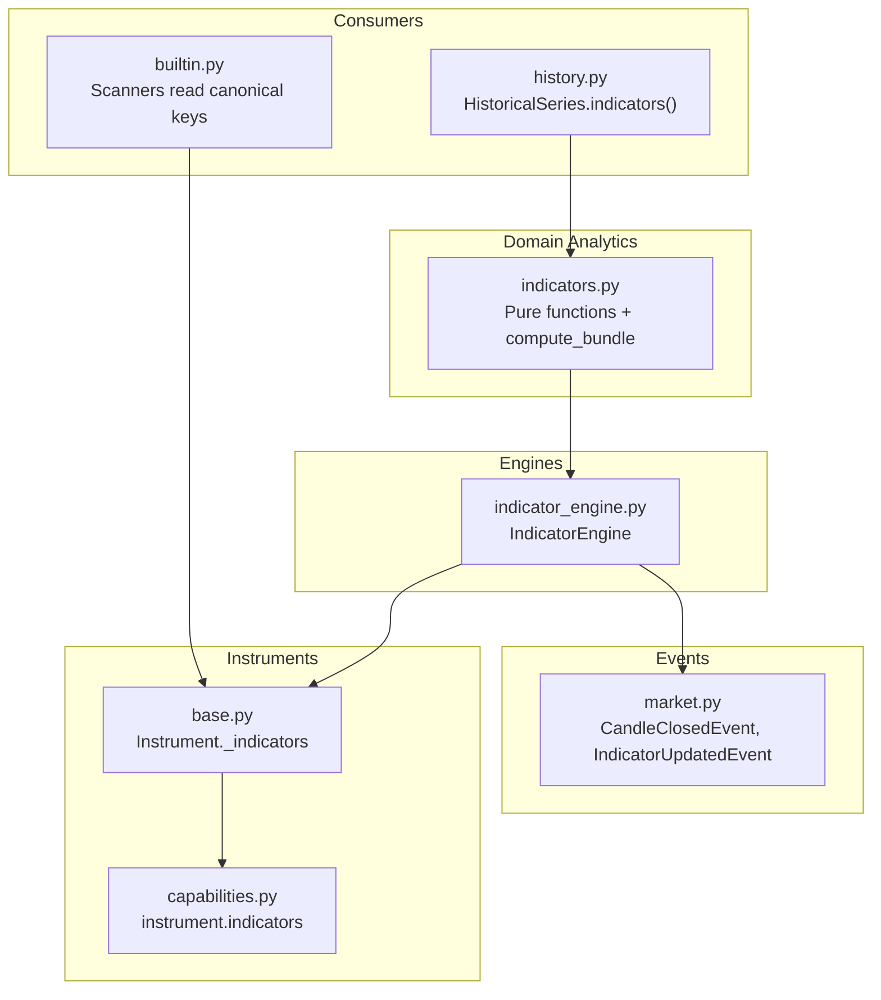
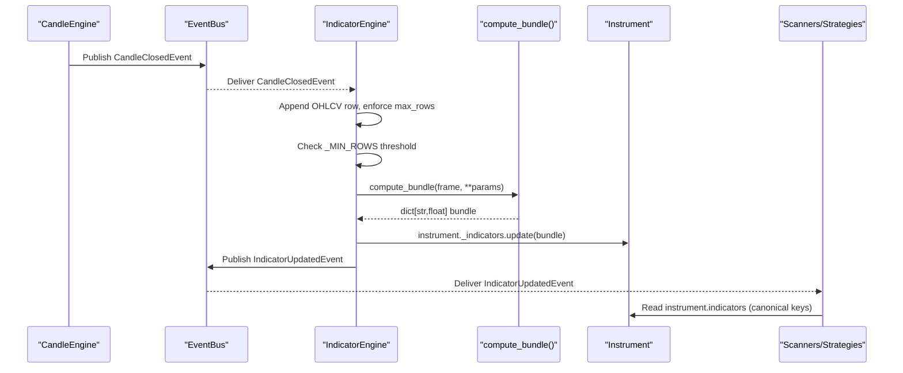
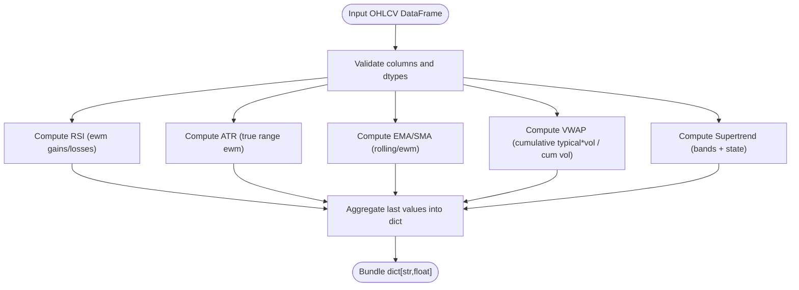
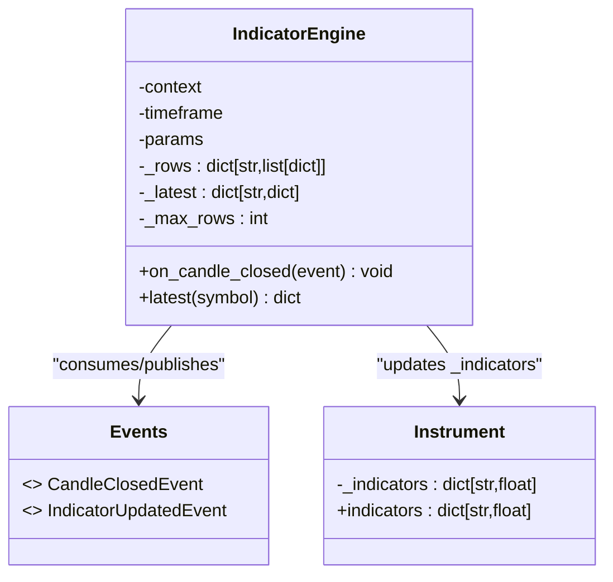
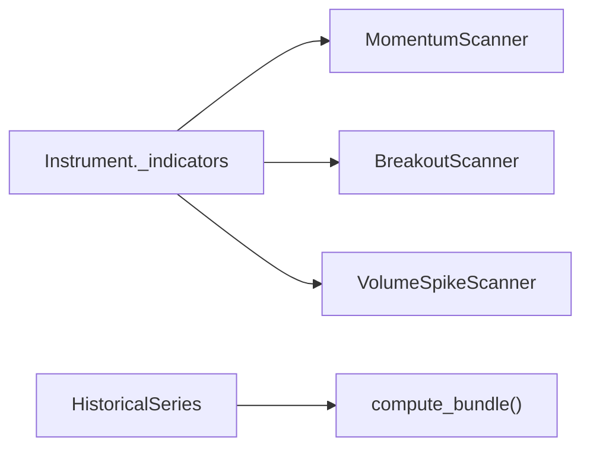
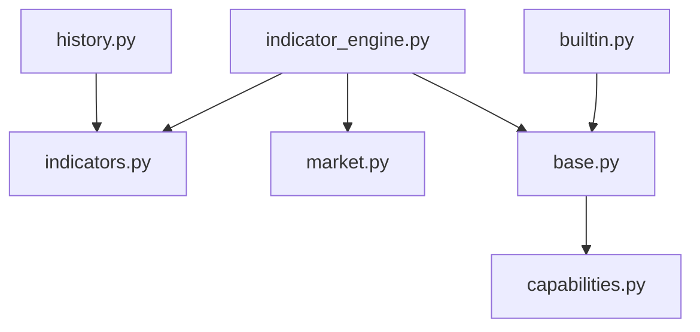

# Custom Indicators Development

<cite>
**Referenced Files in This Document**
- [indicators.py](file://ntrade/domain/analytics/indicators.py)
- [indicator_engine.py](file://ntrade/engines/indicator_engine.py)
- [market.py](file://ntrade/events/market.py)
- [history.py](file://ntrade/domain/market/history.py)
- [base.py](file://ntrade/domain/instruments/base.py)
- [capabilities.py](file://ntrade/domain/instruments/capabilities.py)
- [builtin.py](file://ntrade/scanners/builtin.py)
- [test_indicators.py](file://tests/test_indicators.py)
</cite>

## Table of Contents
1. Introduction
2. Project Structure
3. Core Components
4. Architecture Overview
5. Detailed Component Analysis
6. Dependency Analysis
7. Performance Considerations
8. Troubleshooting Guide
9. Conclusion
10. Appendices

## Introduction
This document explains how to develop custom technical indicators in nTrade, focusing on the indicator base structure, computation pipeline, and integration with the IndicatorEngine. It provides best practices for handling missing data, warm-up periods, memory optimization, and performance. It also includes examples of common indicator types (oscillators, trend followers, volume-based), composite indicators, custom aggregation functions, validation and unit testing approaches, debugging methods, and advanced indicator ideas such as machine learning signals, custom volatility measures, and market microstructure indicators.

## Project Structure
The indicator system is implemented as a clean separation between:
- Pure indicator functions over pandas DataFrames (domain layer)
- An event-driven engine that maintains rolling OHLCV windows and publishes indicator bundles
- Consumers (scanners, strategies, history API) that read canonical indicator keys from instruments or historical series

**Diagram sources**
- [indicators.py:148-195](file://ntrade/domain/analytics/indicators.py#L148-L195)
- [indicator_engine.py:18-55](file://ntrade/engines/indicator_engine.py#L18-L55)
- [market.py:51-83](file://ntrade/events/market.py#L51-L83)
- [base.py:83](file://ntrade/domain/instruments/base.py#L83)
- [capabilities.py:343-344](file://ntrade/domain/instruments/capabilities.py#L343-L344)
- [builtin.py:35-38](file://ntrade/scanners/builtin.py#L35-L38)
- [history.py:126-129](file://ntrade/domain/market/history.py#L126-L129)

**Section sources**
- [indicators.py:1-195](file://ntrade/domain/analytics/indicators.py#L1-L195)
- [indicator_engine.py:1-55](file://ntrade/engines/indicator_engine.py#L1-L55)
- [market.py:1-83](file://ntrade/events/market.py#L1-L83)
- [base.py:1-200](file://ntrade/domain/instruments/base.py#L1-L200)
- [capabilities.py:340-383](file://ntrade/domain/instruments/capabilities.py#L340-L383)
- [builtin.py:1-264](file://ntrade/scanners/builtin.py#L1-L264)
- [history.py:120-149](file://ntrade/domain/market/history.py#L120-L149)

## Core Components
- Indicator functions: Pure, vectorized pandas functions for RSI, ATR, SMA, EMA, VWAP, Supertrend, Heikin-Ashi, Renko bricks. They operate on OHLCV DataFrames and return Series or modified frames.
- Bundle computation: A single function aggregates multiple indicators into a flat dictionary of scalar values keyed by canonical names (e.g., rsi_14, atr_14, vwap, stx_10_3, ema_9, ema_21, sma_N, avg_volume).
- IndicatorEngine: Subscribes to CandleClosedEvent, maintains per-symbol rolling OHLCV rows, computes the bundle when enough rows are available, updates instrument._indicators, and publishes IndicatorUpdatedEvent.
- Consumers: Scanners read canonical keys from instrument._indicators; HistoricalSeries exposes an indicators() method delegating to compute_bundle.

Key behaviors:
- Warm-up: Rolling windows require min_periods; early values may be NaN until sufficient data is available.
- Missing data: Functions handle missing columns gracefully; bundle computation logs warnings instead of crashing.
- Memory: Engine caps stored rows per symbol and only passes a bounded window to pandas operations.

**Section sources**
- [indicators.py:15-146](file://ntrade/domain/analytics/indicators.py#L15-L146)
- [indicators.py:148-195](file://ntrade/domain/analytics/indicators.py#L148-L195)
- [indicator_engine.py:18-55](file://ntrade/engines/indicator_engine.py#L18-L55)
- [builtin.py:35-38](file://ntrade/scanners/builtin.py#L35-L38)
- [history.py:126-129](file://ntrade/domain/market/history.py#L126-L129)

## Architecture Overview
The indicator pipeline is event-driven and decoupled:

**Diagram sources**
- [indicator_engine.py:28-51](file://ntrade/engines/indicator_engine.py#L28-L51)
- [indicators.py:148-195](file://ntrade/domain/analytics/indicators.py#L148-L195)
- [market.py:51-83](file://ntrade/events/market.py#L51-L83)
- [capabilities.py:343-344](file://ntrade/domain/instruments/capabilities.py#L343-L344)

## Detailed Component Analysis

### Indicator Functions and Bundle Computation
- Oscillators: RSI computed via smoothed gains/losses with safe division to avoid NaN in strong trends.
- Volatility: ATR based on true range and exponential smoothing.
- Trend followers: SMA and EMA over close with proper warm-up via min_periods.
- Volume-based: VWAP using cumulative typical price times volume divided by cumulative volume.
- Regime/trend filters: Supertrend adds a directional column derived from ATR bands and price action.
- Transformations: Heikin-Ashi and Renko bricks provide alternative candle representations.
- Bundle: Aggregates latest scalar values under canonical keys; uses a helper to capture results and log failures without breaking the pipeline.

Best practices demonstrated:
- Use vectorized pandas operations for performance.
- Enforce min_periods to handle warm-up explicitly.
- Guard against zero-loss streaks and missing columns.
- Return consistent types and bounds (e.g., RSI clipped to [0,100]).

**Diagram sources**
- [indicators.py:15-146](file://ntrade/domain/analytics/indicators.py#L15-L146)
- [indicators.py:148-195](file://ntrade/domain/analytics/indicators.py#L148-L195)

**Section sources**
- [indicators.py:15-146](file://ntrade/domain/analytics/indicators.py#L15-L146)
- [indicators.py:148-195](file://ntrade/domain/analytics/indicators.py#L148-L195)

### IndicatorEngine Integration
Responsibilities:
- Subscribe to CandleClosedEvent for a specific timeframe.
- Maintain a rolling list of OHLCV rows per symbol with a maximum size cap.
- Skip computation until a minimum number of rows is reached.
- Build a DataFrame from the most recent window and call compute_bundle.
- Update instrument._indicators and publish IndicatorUpdatedEvent with the bundle.

Design highlights:
- Timeframe filtering ensures correct alignment with candle generation.
- Row capping prevents unbounded memory growth.
- Early exit on insufficient data avoids partial/warm-up artifacts.
- Latest snapshot cache enables quick access without recomputation.

**Diagram sources**
- [indicator_engine.py:18-55](file://ntrade/engines/indicator_engine.py#L18-L55)
- [market.py:51-83](file://ntrade/events/market.py#L51-L83)
- [base.py:83](file://ntrade/domain/instruments/base.py#L83)
- [capabilities.py:343-344](file://ntrade/domain/instruments/capabilities.py#L343-L344)

**Section sources**
- [indicator_engine.py:18-55](file://ntrade/engines/indicator_engine.py#L18-L55)
- [market.py:51-83](file://ntrade/events/market.py#L51-L83)
- [base.py:83](file://ntrade/domain/instruments/base.py#L83)
- [capabilities.py:343-344](file://ntrade/domain/instruments/capabilities.py#L343-L344)

### Consumers: Scanners and History API
- Scanners read canonical indicator keys from instrument._indicators via a safe accessor. Examples include momentum (rsi_14), breakout (stx_10_3), and volume spike (avg_volume).
- HistoricalSeries exposes an indicators(**params) method that delegates to compute_bundle, enabling offline analysis over backtested series.

**Diagram sources**
- [builtin.py:35-38](file://ntrade/scanners/builtin.py#L35-L38)
- [builtin.py:119-158](file://ntrade/scanners/builtin.py#L119-L158)
- [builtin.py:163-222](file://ntrade/scanners/builtin.py#L163-L222)
- [history.py:126-129](file://ntrade/domain/market/history.py#L126-L129)

**Section sources**
- [builtin.py:35-38](file://ntrade/scanners/builtin.py#L35-L38)
- [builtin.py:119-158](file://ntrade/scanners/builtin.py#L119-L158)
- [builtin.py:163-222](file://ntrade/scanners/builtin.py#L163-L222)
- [history.py:126-129](file://ntrade/domain/market/history.py#L126-L129)

## Dependency Analysis
- Domain analytics depends only on pandas; no external TA libraries.
- IndicatorEngine depends on events and domain analytics; it does not depend on brokers or execution.
- Scanners depend on instrument state and indicator keys; they do not recompute indicators.
- HistoricalSeries depends on domain analytics for offline computations.

**Diagram sources**
- [indicators.py:148-195](file://ntrade/domain/analytics/indicators.py#L148-L195)
- [indicator_engine.py:12-13](file://ntrade/engines/indicator_engine.py#L12-L13)
- [market.py:51-83](file://ntrade/events/market.py#L51-L83)
- [base.py:83](file://ntrade/domain/instruments/base.py#L83)
- [capabilities.py:343-344](file://ntrade/domain/instruments/capabilities.py#L343-L344)
- [builtin.py:35-38](file://ntrade/scanners/builtin.py#L35-L38)
- [history.py:126-129](file://ntrade/domain/market/history.py#L126-L129)

**Section sources**
- [indicators.py:148-195](file://ntrade/domain/analytics/indicators.py#L148-L195)
- [indicator_engine.py:12-13](file://ntrade/engines/indicator_engine.py#L12-L13)
- [market.py:51-83](file://ntrade/events/market.py#L51-L83)
- [base.py:83](file://ntrade/domain/instruments/base.py#L83)
- [capabilities.py:343-344](file://ntrade/domain/instruments/capabilities.py#L343-L344)
- [builtin.py:35-38](file://ntrade/scanners/builtin.py#L35-L38)
- [history.py:126-129](file://ntrade/domain/market/history.py#L126-L129)

## Performance Considerations
- Vectorization: All indicator functions use pandas vectorized operations; avoid Python loops where possible.
- Window sizing: IndicatorEngine limits stored rows per symbol and slices the most recent window before computing. Tune max_rows to balance accuracy and memory.
- Warm-up: Ensure min_periods aligns with your strategy’s needs; early NaN values are expected and should be handled by consumers.
- Avoid redundant recomputation: IndicatorEngine caches the latest bundle per symbol; scanners and strategies should read from instrument.indicators rather than recompute.
- Memory hygiene: Prefer in-place operations where safe; avoid unnecessary copies of large DataFrames.

[No sources needed since this section provides general guidance]

## Troubleshooting Guide
Common issues and resolutions:
- Missing volume column: compute_bundle logs a warning and skips avg_volume; ensure OHLCV includes volume or handle absence in consumers.
- Insufficient rows: IndicatorEngine waits for at least _MIN_ROWS before computing; verify timeframe alignment and data feed continuity.
- NaN outputs: Warm-up periods produce NaN; validate thresholds and guard against NaN in logic.
- Canonical key mismatches: Scanners expect canonical keys like rsi_14, atr_14, stx_10_3, avg_volume; confirm bundle emission and consumer reads match these keys.

Validation and testing:
- Unit tests cover bounds and behavior for RSI, ATR, VWAP, Supertrend, EMA/SMA, and bundle composition.
- Engine-level tests assert row bounding and event publishing after sufficient candles.

**Section sources**
- [indicators.py:148-195](file://ntrade/domain/analytics/indicators.py#L148-L195)
- [indicator_engine.py:28-51](file://ntrade/engines/indicator_engine.py#L28-L51)
- [test_indicators.py:23-151](file://tests/test_indicators.py#L23-L151)

## Conclusion
nTrade’s indicator system emphasizes simplicity, correctness, and performance through pure pandas functions, a robust event-driven engine, and canonical key contracts. By following the patterns shown here—vectorized computations, explicit warm-up handling, bounded memory, and clear integration points—you can extend the system with new indicators and composites while maintaining reliability and speed.

[No sources needed since this section summarizes without analyzing specific files]

## Appendices

### Best Practices for Indicator Design
- Keep functions pure and side-effect free; accept and return pandas objects.
- Use min_periods to define warm-up explicitly; document expected NaN behavior.
- Guard against missing or invalid data; prefer logging and graceful degradation.
- Emit canonical keys consistently; avoid ambiguous names.
- Optimize with vectorization; profile hot paths if adding heavy computations.

[No sources needed since this section provides general guidance]

### Composite Indicators and Custom Aggregation
- Combine multiple base indicators in a wrapper function that returns a dict of scalars.
- Reuse compute_bundle’s pattern: wrap each computation in a try/capture helper to isolate failures.
- For custom aggregations, ensure numerical stability (e.g., avoid division by zero) and maintain consistent units.

[No sources needed since this section provides general guidance]

### Validation and Unit Testing Approaches
- Test boundary conditions: empty inputs, minimal rows, NaN presence.
- Assert output ranges and monotonicity where applicable (e.g., RSI in [0,100], ATR positive).
- Verify warm-up behavior: first N values should be NaN for rolling windows.
- Simulate engine flow: feed CandleClosedEvent and assert IndicatorUpdatedEvent and instrument._indicators updates.

**Section sources**
- [test_indicators.py:23-151](file://tests/test_indicators.py#L23-L151)

### Debugging Methods
- Enable logging around compute_bundle to trace failures per indicator.
- Print or log the shape and dtypes of input DataFrames to detect type issues.
- Temporarily reduce max_rows and _MIN_ROWS to reproduce edge cases quickly.
- Use HistoricalSeries.indicators() to validate offline behavior against backtested data.

**Section sources**
- [indicators.py:148-195](file://ntrade/domain/analytics/indicators.py#L148-L195)
- [history.py:126-129](file://ntrade/domain/market/history.py#L126-L129)

### Example Indicator Types
- Oscillators: RSI (momentum oscillator with smoothed gains/losses).
- Trend followers: EMA/SMA (smoothed averages with configurable periods).
- Volume-based: VWAP (volume-weighted average price), avg_volume (window mean).
- Regime/trend filters: Supertrend (ATR-based directional signal).
- Transformations: Heikin-Ashi and Renko bricks for alternative charting.

**Section sources**
- [indicators.py:15-146](file://ntrade/domain/analytics/indicators.py#L15-L146)

### Advanced Indicator Ideas
- Machine learning-based signals: Train a lightweight model offline; compute features from OHLCV and emit a probability score as a new indicator key.
- Custom volatility measures: Realized volatility, Garman-Klass, Parkinson estimator; integrate via a new function and add to compute_bundle.
- Market microstructure indicators: Order book imbalance, trade flow imbalance, tick direction autocorrelation; aggregate from depth/trade streams and expose as indicators.

[No sources needed since this section provides general guidance]