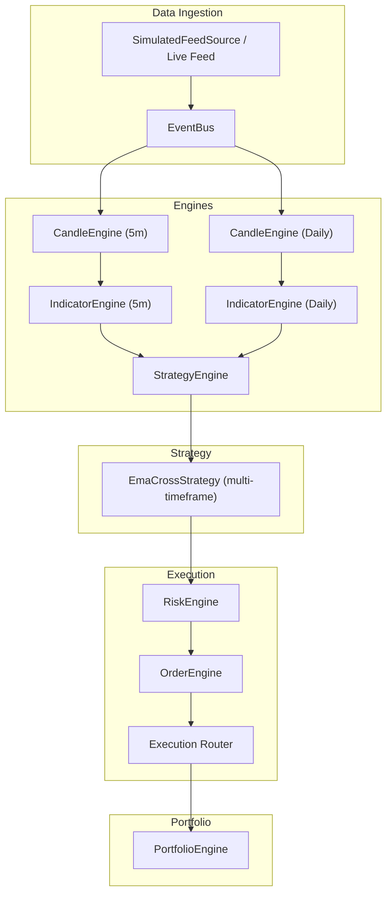
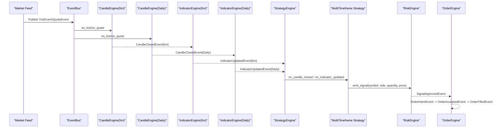
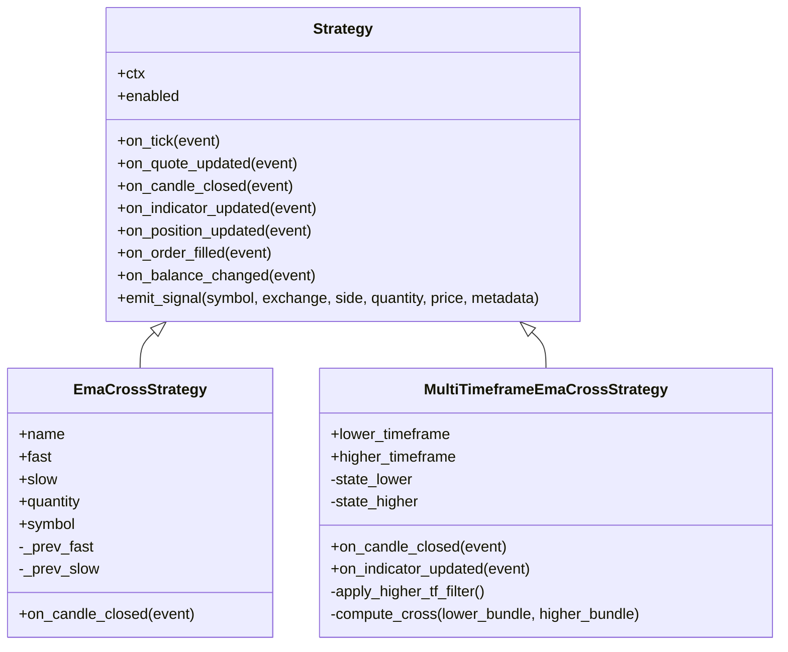
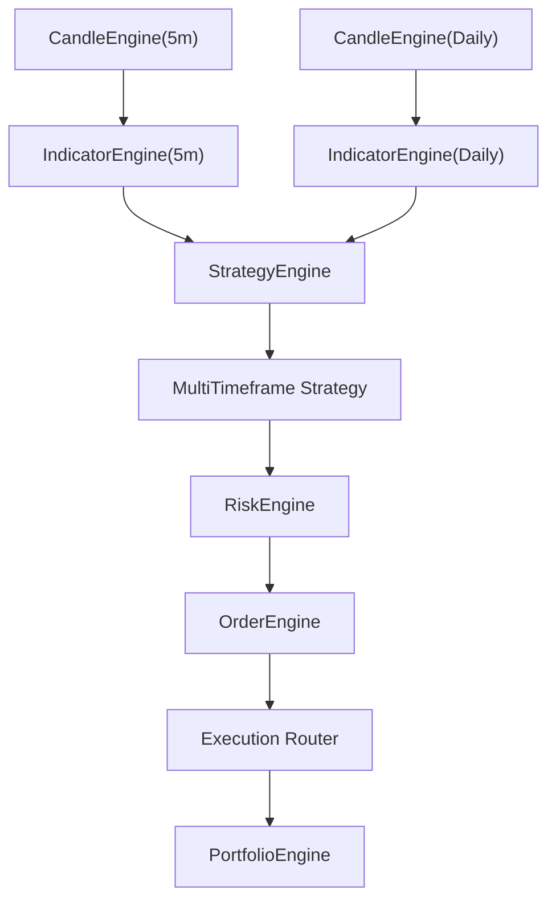
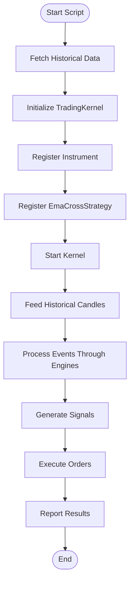

# Multi-Timeframe Analysis Strategies

<cite>
**Referenced Files in This Document**
- [strategies.py](file://ntrade/engines/strategies.py)
- [strategy_engine.py](file://ntrade/engines/strategy_engine.py)
- [candle_engine.py](file://ntrade/engines/candle_engine.py)
- [indicator_engine.py](file://ntrade/engines/indicator_engine.py)
- [session.py](file://ntrade/kernel/session.py)
- [trading_session.py](file://ntrade/kernel/trading_session.py)
- [market.py](file://ntrade/events/market.py)
- [history.py](file://ntrade/domain/market/history.py)
- [candles.py](file://ntrade/domain/market/candles.py)
- [ema_cross_run.py](file://scripts/ema_cross_run.py)
- [test_ema_cross_strategy.py](file://tests/test_ema_cross_strategy.py)
</cite>

## Table of Contents
1. [Introduction](#introduction)
2. [Project Structure](#project-structure)
3. [Core Components](#core-components)
4. [Architecture Overview](#architecture-overview)
5. [Detailed Component Analysis](#detailed-component-analysis)
6. [Dependency Analysis](#dependency-analysis)
7. [Performance Considerations](#performance-considerations)
8. [Troubleshooting Guide](#troubleshooting-guide)
9. [Conclusion](#conclusion)
10. [Appendices](#appendices)

## Introduction
This document explains how to implement multi-timeframe analysis strategies using the nTrade framework. It focuses on combining different timeframes (e.g., 5-minute and daily charts) to enhance signal generation, extending the existing EmaCrossStrategy as a foundation, coordinating signals across multiple instruments and timeframes, managing position sizing based on higher timeframe trends, and implementing trend filtering mechanisms. Practical guidance is provided for event handling across multiple candle streams, state management across timeframes, risk-adjusted position sizing, and avoiding common pitfalls such as lookahead bias and data synchronization issues.

## Project Structure
The nTrade kernel orchestrates market data ingestion, candle aggregation, indicator computation, strategy execution, risk checks, order routing, and portfolio updates. For multi-timeframe strategies, you will typically:
- Run one CandleEngine per timeframe to produce CandleClosedEvent streams.
- Run one IndicatorEngine per timeframe to compute indicators and publish IndicatorUpdatedEvent.
- Subscribe strategies to both lower and higher timeframe events to coordinate decisions.
- Use the TradingKernel or TradingSession to wire engines and manage lifecycle.

**Diagram sources**
- [candle_engine.py:19-33](file://ntrade/engines/candle_engine.py#L19-L33)
- [indicator_engine.py:18-27](file://ntrade/engines/indicator_engine.py#L18-L27)
- [strategy_engine.py:48-64](file://ntrade/engines/strategy_engine.py#L48-L64)
- [session.py:79-85](file://ntrade/kernel/session.py#L79-L85)

**Section sources**
- [session.py:79-85](file://ntrade/kernel/session.py#L79-L85)
- [trading_session.py:225-249](file://ntrade/kernel/trading_session.py#L225-L249)

## Core Components
- CandleEngine aggregates ticks into candles per timeframe and publishes CandleClosedEvent.
- IndicatorEngine computes indicator bundles per timeframe and publishes IndicatorUpdatedEvent.
- StrategyEngine dispatches events to registered strategies via hooks.
- EmaCrossStrategy demonstrates a simple crossover logic that can be extended for multi-timeframe coordination.
- TradingKernel wires all engines and provides start/stop and replay capabilities.
- TradingSession offers a unified API to connect brokers, register instruments, and run strategies.

Key responsibilities:
- Timeframe separation: Each CandleEngine and IndicatorEngine instance is bound to a single timeframe string.
- Event-driven processing: Strategies react to events without polling.
- Read model projection: Indicators are projected onto instruments for easy access by strategies.

**Section sources**
- [candle_engine.py:19-33](file://ntrade/engines/candle_engine.py#L19-L33)
- [indicator_engine.py:18-27](file://ntrade/engines/indicator_engine.py#L18-L27)
- [strategy_engine.py:18-34](file://ntrade/engines/strategy_engine.py#L18-L34)
- [strategies.py:13-24](file://ntrade/engines/strategies.py#L13-L24)
- [session.py:79-85](file://ntrade/kernel/session.py#L79-L85)

## Architecture Overview
Multi-timeframe architecture extends the base kernel by instantiating multiple CandleEngine and IndicatorEngine instances with different timeframes. A multi-timeframe strategy subscribes to both lower and higher timeframe events to make coordinated decisions.

**Diagram sources**
- [candle_engine.py:87-100](file://ntrade/engines/candle_engine.py#L87-L100)
- [indicator_engine.py:28-51](file://ntrade/engines/indicator_engine.py#L28-L51)
- [strategy_engine.py:89-101](file://ntrade/engines/strategy_engine.py#L89-L101)
- [market.py:50-83](file://ntrade/events/market.py#L50-L83)

## Detailed Component Analysis

### Extending EmaCrossStrategy for Multi-Timeframe Scenarios
The base EmaCrossStrategy reacts to a single timeframe’s candle close and uses indicator bundles to detect crossovers. To extend it for multi-timeframe:
- Maintain separate state for each timeframe (e.g., previous EMA values).
- Subscribe to both lower and higher timeframe events.
- Combine signals: e.g., only take lower timeframe BUY signals when higher timeframe trend is bullish.

Implementation patterns:
- Store per-symbol, per-timeframe state dictionaries for previous EMAs and trend flags.
- On each candle close, update the relevant timeframe’s state and compute cross conditions.
- Apply a higher timeframe filter before emitting signals.

**Diagram sources**
- [strategy_engine.py:18-46](file://ntrade/engines/strategy_engine.py#L18-L46)
- [strategies.py:13-67](file://ntrade/engines/strategies.py#L13-L67)

**Section sources**
- [strategies.py:13-67](file://ntrade/engines/strategies.py#L13-L67)
- [strategy_engine.py:18-46](file://ntrade/engines/strategy_engine.py#L18-L46)

### Coordinating Signals Across Multiple Instruments and Timeframes
To coordinate across instruments:
- Use symbol filters in strategy hooks to process only relevant symbols.
- Maintain per-instrument state for each timeframe.
- Combine signals from multiple instruments if needed (e.g., sector momentum).

For multiple timeframes:
- Register multiple CandleEngine and IndicatorEngine instances with different timeframes.
- Ensure the strategy subscribes to both timeframe events and applies consistent logic.

Practical considerations:
- Avoid lookahead bias by using only closed candles and previously computed indicators.
- Synchronize timestamps carefully; rely on event timestamps rather than wall clock.

**Section sources**
- [strategies.py:39-67](file://ntrade/engines/strategies.py#L39-L67)
- [candle_engine.py:19-33](file://ntrade/engines/candle_engine.py#L19-L33)
- [indicator_engine.py:18-27](file://ntrade/engines/indicator_engine.py#L18-L27)

### Managing Position Sizing Based on Higher Timeframe Trends
Position sizing should reflect higher timeframe trend strength:
- Increase size when higher timeframe trend is strong and aligned with lower timeframe signal.
- Reduce size or avoid entries when higher timeframe trend is weak or conflicting.

Approach:
- Compute a trend metric from higher timeframe indicators (e.g., EMA slope, ADX, or simple direction).
- Map trend strength to position sizing rules (e.g., fraction of capital or fixed multiplier).
- Apply risk limits (max drawdown, per-trade risk) to cap exposure.

**Section sources**
- [strategies.py:57-67](file://ntrade/engines/strategies.py#L57-L67)
- [indicator_engine.py:28-51](file://ntrade/engines/indicator_engine.py#L28-L51)

### Implementing Trend Filtering Mechanisms
Trend filters prevent trading against the dominant trend:
- Use higher timeframe EMA alignment (e.g., fast > slow for uptrend).
- Incorporate volatility filters (e.g., ATR thresholds) to avoid low-quality signals.
- Combine multiple filters with logical AND/OR to refine entry conditions.

Implementation tips:
- Cache higher timeframe trend state to avoid recomputation.
- Debounce signals to reduce whipsaw in choppy markets.
- Validate filter inputs to ensure sufficient history.

**Section sources**
- [strategies.py:39-67](file://ntrade/engines/strategies.py#L39-L67)
- [indicator_engine.py:28-51](file://ntrade/engines/indicator_engine.py#L28-L51)

### Practical Code Examples and Event Handling
- Event handling: Override appropriate hooks in your strategy to react to CandleClosedEvent and IndicatorUpdatedEvent.
- State management: Maintain per-symbol, per-timeframe dictionaries for previous values and flags.
- Risk-adjusted sizing: Compute size based on higher timeframe trend and account balance.

Example references:
- Base EmaCrossStrategy implementation shows how to read indicators from instrument bundle and emit signals.
- Test cases demonstrate golden/death cross behavior and warmup handling.

**Section sources**
- [strategies.py:39-67](file://ntrade/engines/strategies.py#L39-L67)
- [test_ema_cross_strategy.py:40-89](file://tests/test_ema_cross_strategy.py#L40-L89)

## Dependency Analysis
The multi-timeframe strategy depends on:
- CandleEngine for generating closed candles per timeframe.
- IndicatorEngine for computing and projecting indicators.
- StrategyEngine for event dispatch to strategies.
- TradingKernel for wiring engines and lifecycle management.

**Diagram sources**
- [candle_engine.py:19-33](file://ntrade/engines/candle_engine.py#L19-L33)
- [indicator_engine.py:18-27](file://ntrade/engines/indicator_engine.py#L18-L27)
- [strategy_engine.py:48-64](file://ntrade/engines/strategy_engine.py#L48-L64)
- [session.py:79-85](file://ntrade/kernel/session.py#L79-L85)

**Section sources**
- [candle_engine.py:19-33](file://ntrade/engines/candle_engine.py#L19-L33)
- [indicator_engine.py:18-27](file://ntrade/engines/indicator_engine.py#L18-L27)
- [strategy_engine.py:48-64](file://ntrade/engines/strategy_engine.py#L48-L64)
- [session.py:79-85](file://ntrade/kernel/session.py#L79-L85)

## Performance Considerations
- Limit the number of stored candles and indicator rows to control memory usage.
- Use efficient data structures (dictionaries for per-symbol state) to minimize lookup overhead.
- Avoid unnecessary recomputation by caching higher timeframe trend states.
- Batch indicator computations where possible to reduce CPU load.

[No sources needed since this section provides general guidance]

## Troubleshooting Guide
Common pitfalls and solutions:
- Lookahead bias: Ensure you use only closed candles and previously computed indicators. Do not reference current incomplete candle values.
- Data synchronization: Rely on event timestamps and do not assume wall-clock ordering. Use the kernel’s ReplayClock for deterministic replay.
- Warmup periods: Skip signals until sufficient history exists for indicators (e.g., minimum rows for EMA calculation).
- Double-counting volume: CandleEngine handles bar-seeded backtest scenarios to avoid double volume counting.

**Section sources**
- [candle_engine.py:42-56](file://ntrade/engines/candle_engine.py#L42-L56)
- [indicator_engine.py:38-41](file://ntrade/engines/indicator_engine.py#L38-L41)
- [test_ema_cross_strategy.py:70-77](file://tests/test_ema_cross_strategy.py#L70-L77)

## Conclusion
Multi-timeframe analysis in nTrade leverages the event-driven architecture to combine signals across different timeframes and instruments. By extending EmaCrossStrategy with additional timeframe subscriptions and trend filters, you can create robust strategies that adapt to market conditions. Proper state management, careful event handling, and risk-aware position sizing are key to successful implementation. The framework’s modular design allows flexible composition of engines and strategies while maintaining performance and reliability.

[No sources needed since this section summarizes without analyzing specific files]

## Appendices

### Example Workflow: Running EMA Cross Strategy
The script demonstrates setting up a TradingKernel, registering an instrument, and running the EmaCrossStrategy over historical data.

**Diagram sources**
- [ema_cross_run.py:27-82](file://scripts/ema_cross_run.py#L27-L82)

**Section sources**
- [ema_cross_run.py:27-82](file://scripts/ema_cross_run.py#L27-L82)

### Data Structures and Types
- CandleSeries wraps OHLCV DataFrame for domain-typed access.
- Market events include TickEvent, QuoteEvent, CandleClosedEvent, and IndicatorUpdatedEvent.

**Section sources**
- [candles.py:18-67](file://ntrade/domain/market/candles.py#L18-L67)
- [market.py:11-83](file://ntrade/events/market.py#L11-L83)