# Options Trading Strategies

<cite>
**Referenced Files in This Document**
- [derivatives.py](file://ntrade/domain/instruments/derivatives.py)
- [chain.py](file://ntrade/domain/instruments/chain.py)
- [greeks.py](file://ntrade/domain/analytics/greeks.py)
- [surface.py](file://ntrade/domain/analytics/surface.py)
- [expiry.py](file://ntrade/domain/instruments/expiry.py)
- [scanner.py](file://ntrade/domain/scanner.py)
- [risk_engine.py](file://ntrade/engines/risk_engine.py)
- [portfolio.py](file://ntrade/domain/portfolio.py)
- [strategies.py](file://ntrade/engines/strategies.py)
- [options.md](file://.agents/skills/dhan-tradehull/references/options.md)
- [intraday_options_algo.py](file://.agents/skills/dhan-tradehull/examples/intraday_options_algo.py)
- [positional_spread_algo.py](file://.agents/skills/dhan-tradehull/examples/positional_spread_algo.py)
- [test_options_analytics.py](file://tests/test_options_analytics.py)
- [test_chain_navigation.py](file://tests/test_chain_navigation.py)
</cite>

## Table of Contents
1. [Introduction](#introduction)
2. [Project Structure](#project-structure)
3. [Core Components](#core-components)
4. [Architecture Overview](#architecture-overview)
5. [Detailed Component Analysis](#detailed-component-analysis)
6. [Dependency Analysis](#dependency-analysis)
7. [Performance Considerations](#performance-considerations)
8. [Troubleshooting Guide](#troubleshooting-guide)
9. [Conclusion](#conclusion)
10. [Appendices](#appendices)

## Introduction
This document explains how to implement options trading strategies using nTrade’s derivatives support. It covers option chain navigation, strike selection algorithms, Greeks-based decision making, and advanced strategies such as iron condors, straddles, and spreads with risk management. It also includes volatility surface analysis, implied volatility calculations, dynamic hedging techniques, expiration handling, assignment risk management, portfolio-level Greeks exposure control, automated scanning, premium collection strategies, and volatility arbitrage approaches. Practical examples demonstrate bid-ask spread handling, liquidity constraints, and corporate action adjustments.

## Project Structure
The options framework is organized into domain models (instruments, analytics), engines (strategy and risk), and execution layers. The key modules for options are:
- Instruments: Option, Future, SyntheticInstrument, OptionChain, Expiry, OptionPair
- Analytics: Black-Scholes pricing engine, Greeks computation, IV surface and Greeks table wrappers
- Strategy and Risk: reusable strategy base and risk screening engine
- Scanners: pluggable scanner facade for automated scanning
- Examples and references: Dhan Tradehull patterns for strike selection and option chains

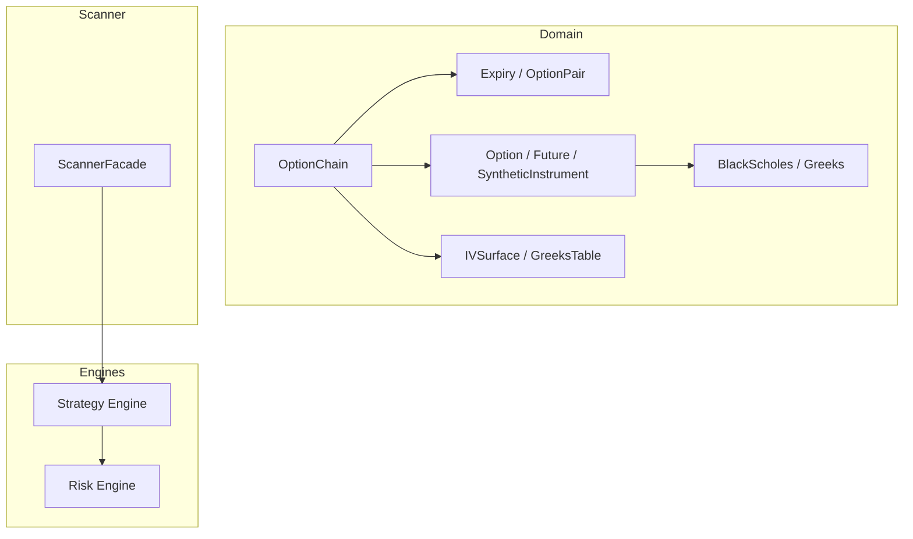

**Diagram sources**
- [chain.py:1-202](file://ntrade/domain/instruments/chain.py#L1-L202)
- [expiry.py:1-171](file://ntrade/domain/instruments/expiry.py#L1-L171)
- [derivatives.py:1-245](file://ntrade/domain/instruments/derivatives.py#L1-L245)
- [surface.py:1-85](file://ntrade/domain/analytics/surface.py#L1-L85)
- [greeks.py:1-120](file://ntrade/domain/analytics/greeks.py#L1-L120)
- [strategies.py:1-67](file://ntrade/engines/strategies.py#L1-L67)
- [risk_engine.py:1-141](file://ntrade/engines/risk_engine.py#L1-L141)
- [scanner.py:1-166](file://ntrade/domain/scanner.py#L1-L166)

**Section sources**
- [chain.py:1-202](file://ntrade/domain/instruments/chain.py#L1-L202)
- [expiry.py:1-171](file://ntrade/domain/instruments/expiry.py#L1-L171)
- [derivatives.py:1-245](file://ntrade/domain/instruments/derivatives.py#L1-L245)
- [surface.py:1-85](file://ntrade/domain/analytics/surface.py#L1-L85)
- [greeks.py:1-120](file://ntrade/domain/analytics/greeks.py#L1-L120)
- [strategies.py:1-67](file://ntrade/engines/strategies.py#L1-L67)
- [risk_engine.py:1-141](file://ntrade/engines/risk_engine.py#L1-L141)
- [scanner.py:1-166](file://ntrade/domain/scanner.py#L1-L166)

## Core Components
- OptionChain: Composite object mirroring a market option chain; provides calls/puts lists, expiries, ATM selection, strike lookup, PCR, max pain, IV surface, and Greeks table.
- Expiry and OptionPair: Group options by expiry date; provide ATM/OTM/ITM selection and pair analytics like straddle premium and synthetic forward price.
- Option: Represents an individual option with Greeks, intrinsic/extrinsic value, moneyness, Black-Scholes pricing, and implied volatility calculation.
- BlackScholes and Greeks: Pure math engine for pricing, greeks, and implied volatility via bisection solver.
- IVSurface and GreeksTable: Domain-typed wrappers around DataFrames for analytics escape hatches.
- ScannerFacade: Pluggable scanners returning ranked results with signals and metadata.
- RiskEngine: Pre-execution signal screening with static limits and circuit breakers (daily loss, drawdown, price deviation).
- Portfolio and Account: Position and holdings tracking with P&L and live metrics.

**Section sources**
- [chain.py:1-202](file://ntrade/domain/instruments/chain.py#L1-L202)
- [expiry.py:1-171](file://ntrade/domain/instruments/expiry.py#L1-L171)
- [derivatives.py:1-245](file://ntrade/domain/instruments/derivatives.py#L1-L245)
- [greeks.py:1-120](file://ntrade/domain/analytics/greeks.py#L1-L120)
- [surface.py:1-85](file://ntrade/domain/analytics/surface.py#L1-L85)
- [scanner.py:1-166](file://ntrade/domain/scanner.py#L1-L166)
- [risk_engine.py:1-141](file://ntrade/engines/risk_engine.py#L1-L141)
- [portfolio.py:1-173](file://ntrade/domain/portfolio.py#L1-L173)

## Architecture Overview
The system composes instruments and analytics to drive strategy decisions and risk-managed execution. OptionChain fetches and indexes options; Expiry and OptionPair provide structured views; BlackScholes computes prices and Greeks; ScannerFacade discovers opportunities; RiskEngine gates signals; Portfolio tracks exposures.

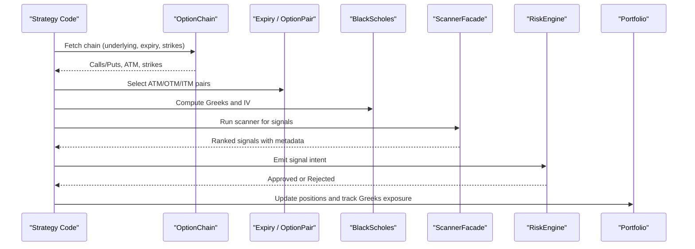

**Diagram sources**
- [chain.py:1-202](file://ntrade/domain/instruments/chain.py#L1-L202)
- [expiry.py:1-171](file://ntrade/domain/instruments/expiry.py#L1-L171)
- [greeks.py:1-120](file://ntrade/domain/analytics/greeks.py#L1-L120)
- [scanner.py:1-166](file://ntrade/domain/scanner.py#L1-L166)
- [risk_engine.py:1-141](file://ntrade/engines/risk_engine.py#L1-L141)
- [portfolio.py:1-173](file://ntrade/domain/portfolio.py#L1-L173)

## Detailed Component Analysis

### Option Chain Navigation and Strike Selection
- OptionChain exposes O(1) strike lookups via _strike_map, ATM selection based on underlying LTP or provided atm_strike, and convenience methods for ITM/OTM filtering.
- Expiry groups options by date and provides ATM offset, exact strike pair access, and interleaved OTM/ITM lists.
- OptionPair offers straddle premium, PCR at strike, and synthetic long/short prices.

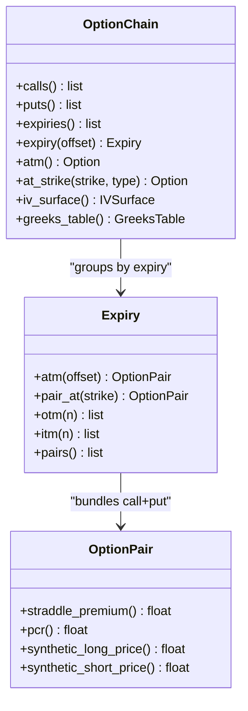

**Diagram sources**
- [chain.py:1-202](file://ntrade/domain/instruments/chain.py#L1-L202)
- [expiry.py:1-171](file://ntrade/domain/instruments/expiry.py#L1-L171)

**Section sources**
- [chain.py:1-202](file://ntrade/domain/instruments/chain.py#L1-L202)
- [expiry.py:1-171](file://ntrade/domain/instruments/expiry.py#L1-L171)
- [test_chain_navigation.py:1-274](file://tests/test_chain_navigation.py#L1-L274)

### Greeks-Based Decision Making and Volatility Surface
- BlackScholes provides price, Greeks, and implied volatility via bisection solver.
- Option delegates pricing and IV calculation to BlackScholes; Greeks are stored per Option and exposed via properties.
- IVSurface and GreeksTable wrap DataFrame analytics for strikes across expiries and types.

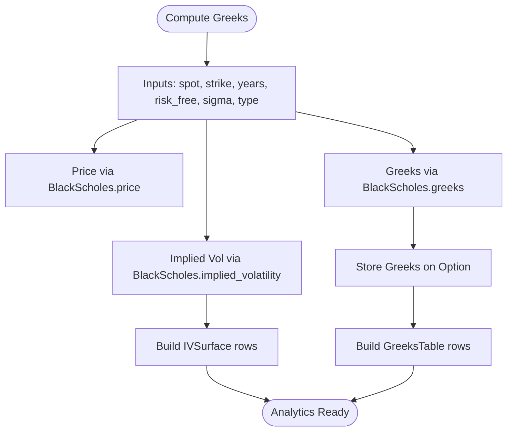

**Diagram sources**
- [greeks.py:1-120](file://ntrade/domain/analytics/greeks.py#L1-L120)
- [derivatives.py:1-245](file://ntrade/domain/instruments/derivatives.py#L1-L245)
- [surface.py:1-85](file://ntrade/domain/analytics/surface.py#L1-L85)

**Section sources**
- [greeks.py:1-120](file://ntrade/domain/analytics/greeks.py#L1-L120)
- [derivatives.py:1-245](file://ntrade/domain/instruments/derivatives.py#L1-L245)
- [surface.py:1-85](file://ntrade/domain/analytics/surface.py#L1-L85)
- [test_options_analytics.py:1-141](file://tests/test_options_analytics.py#L1-L141)

### Advanced Strategies: Iron Condors, Straddles, Spreads
- Straddle: Use OptionPair.straddle_premium to measure total premium; combine CE and PE legs at same strike.
- Iron Condor: Sell OTM call and put; buy further OTM call and put for hedge; compute net premium and payoff via SyntheticInstrument.payoff.
- Spreads: Vertical spreads use ITM/OTM selections from Expiry.otm/itm; manage delta and vega exposure via GreeksTable.

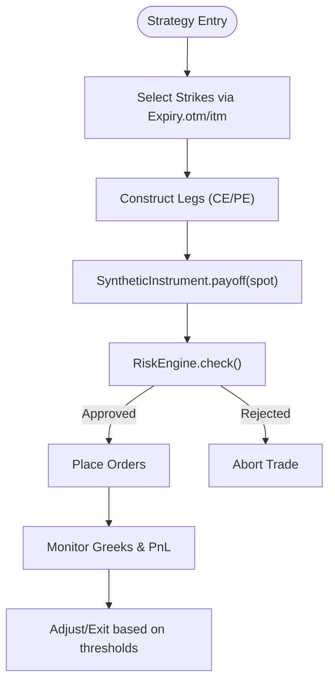

**Diagram sources**
- [expiry.py:1-171](file://ntrade/domain/instruments/expiry.py#L1-L171)
- [derivatives.py:1-245](file://ntrade/domain/instruments/derivatives.py#L1-L245)
- [risk_engine.py:1-141](file://ntrade/engines/risk_engine.py#L1-L141)

**Section sources**
- [expiry.py:1-171](file://ntrade/domain/instruments/expiry.py#L1-L171)
- [derivatives.py:1-245](file://ntrade/domain/instruments/derivatives.py#L1-L245)
- [risk_engine.py:1-141](file://ntrade/engines/risk_engine.py#L1-L141)

### Automated Options Scanning and Premium Collection
- ScannerFacade supports built-in and custom scanners; returns ranked results with signals and indicator values.
- Example patterns show ATM/OTM/ITM strike selection and option chain retrieval for scanning and trade execution.

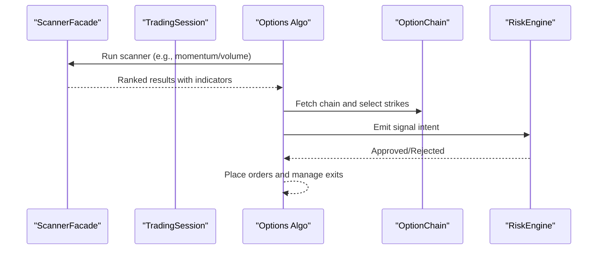

**Diagram sources**
- [scanner.py:1-166](file://ntrade/domain/scanner.py#L1-L166)
- [chain.py:1-202](file://ntrade/domain/instruments/chain.py#L1-L202)
- [risk_engine.py:1-141](file://ntrade/engines/risk_engine.py#L1-L141)
- [options.md:1-170](file://.agents/skills/dhan-tradehull/references/options.md#L1-L170)

**Section sources**
- [scanner.py:1-166](file://ntrade/domain/scanner.py#L1-L166)
- [options.md:1-170](file://.agents/skills/dhan-tradehull/references/options.md#L1-L170)
- [intraday_options_algo.py:1-299](file://.agents/skills/dhan-tradehull/examples/intraday_options_algo.py#L1-L299)
- [positional_spread_algo.py:1-292](file://.agents/skills/dhan-tradehull/examples/positional_spread_algo.py#L1-L292)

### Dynamic Hedging Techniques
- Use GreeksTable to monitor portfolio delta, gamma, vega, theta; rebalance by adjusting leg quantities or adding offsets.
- Implied volatility changes trigger vega adjustments; theta decay informs time-based exits.

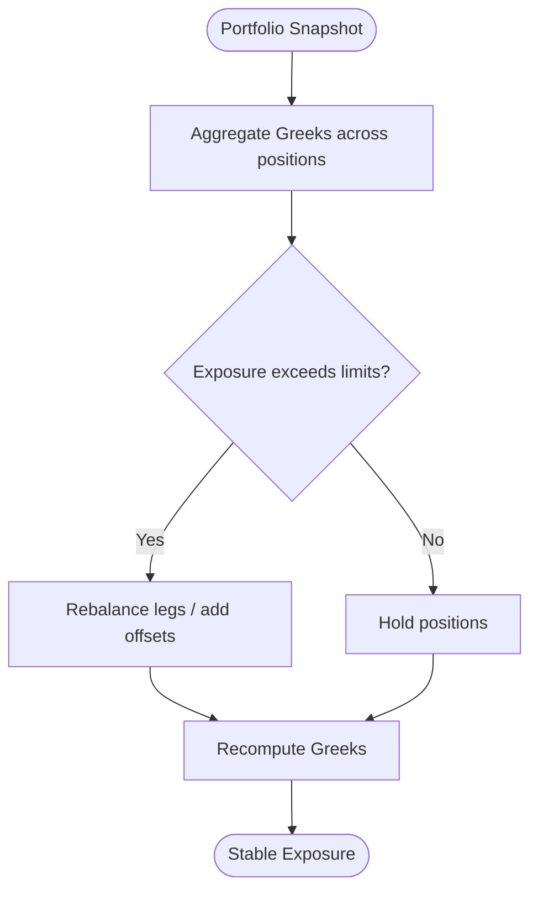

**Diagram sources**
- [surface.py:1-85](file://ntrade/domain/analytics/surface.py#L1-L85)
- [greeks.py:1-120](file://ntrade/domain/analytics/greeks.py#L1-L120)
- [portfolio.py:1-173](file://ntrade/domain/portfolio.py#L1-L173)

**Section sources**
- [surface.py:1-85](file://ntrade/domain/analytics/surface.py#L1-L85)
- [greeks.py:1-120](file://ntrade/domain/analytics/greeks.py#L1-L120)
- [portfolio.py:1-173](file://ntrade/domain/portfolio.py#L1-L173)

### Option Expiration Handling and Assignment Risk Management
- Track nearest_expiry and expiry_list; close or roll positions before expiry to avoid assignment risk.
- Use Expiry.date and Option.expiry to schedule pre-expiry exits; adjust stop-loss and take-profit near expiry.

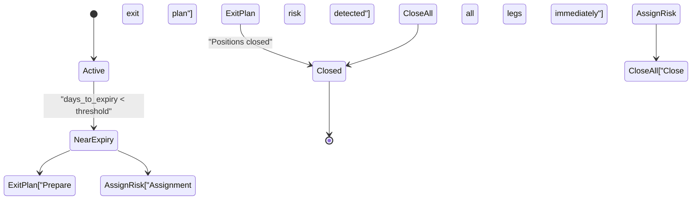

**Diagram sources**
- [chain.py:1-202](file://ntrade/domain/instruments/chain.py#L1-L202)
- [expiry.py:1-171](file://ntrade/domain/instruments/expiry.py#L1-L171)
- [derivatives.py:1-245](file://ntrade/domain/instruments/derivatives.py#L1-L245)

**Section sources**
- [chain.py:1-202](file://ntrade/domain/instruments/chain.py#L1-L202)
- [expiry.py:1-171](file://ntrade/domain/instruments/expiry.py#L1-L171)
- [derivatives.py:1-245](file://ntrade/domain/instruments/derivatives.py#L1-L245)

### Portfolio-Level Greeks Exposure Control
- Aggregate Greeks across positions; enforce limits via RiskEngine and custom checks.
- Use Portfolio.pnl and market_value to compute equity and drawdown; integrate with RiskEngine halt/resume.

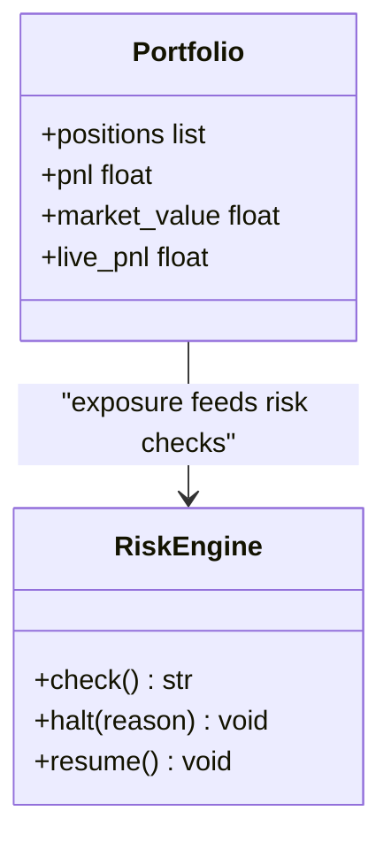

**Diagram sources**
- [portfolio.py:1-173](file://ntrade/domain/portfolio.py#L1-L173)
- [risk_engine.py:1-141](file://ntrade/engines/risk_engine.py#L1-L141)

**Section sources**
- [portfolio.py:1-173](file://ntrade/domain/portfolio.py#L1-L173)
- [risk_engine.py:1-141](file://ntrade/engines/risk_engine.py#L1-L141)

### Practical Examples: Automated Scanning, Premium Collection, Volatility Arbitrage
- Automated scanning: Use ScannerFacade to rank instruments; filter by indicators and volatility conditions.
- Premium collection: Sell OTM options with defined risk via spreads; collect theta decay while managing vega and gamma.
- Volatility arbitrage: Compare IV across strikes/expiries; exploit skew and term structure anomalies.

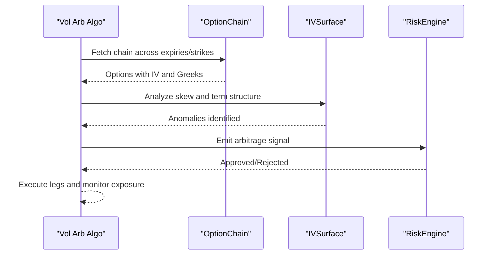

**Diagram sources**
- [chain.py:1-202](file://ntrade/domain/instruments/chain.py#L1-L202)
- [surface.py:1-85](file://ntrade/domain/analytics/surface.py#L1-L85)
- [risk_engine.py:1-141](file://ntrade/engines/risk_engine.py#L1-L141)

**Section sources**
- [chain.py:1-202](file://ntrade/domain/instruments/chain.py#L1-L202)
- [surface.py:1-85](file://ntrade/domain/analytics/surface.py#L1-L85)
- [risk_engine.py:1-141](file://ntrade/engines/risk_engine.py#L1-L141)
- [options.md:1-170](file://.agents/skills/dhan-tradehull/references/options.md#L1-L170)

### Bid-Ask Spread Handling and Liquidity Constraints
- Use LTP, bid/ask from chain data; prefer limit orders to avoid slippage.
- Filter strikes by volume and open interest; avoid deep ITM/OTM where IV may be uncomputable.

**Section sources**
- [options.md:1-170](file://.agents/skills/dhan-tradehull/references/options.md#L1-L170)
- [chain.py:1-202](file://ntrade/domain/instruments/chain.py#L1-L202)

### Corporate Action Adjustments
- Adjust strikes and contracts for splits/dividends; update underlying quotes and recompute IV/Greeks accordingly.
- Maintain metadata on positions to track adjustments over time.

[No sources needed since this section provides general guidance]

## Dependency Analysis
Key dependencies between components:
- OptionChain depends on Option and Expiry; builds strike maps and analytics tables.
- Option depends on BlackScholes for pricing and Greeks; stores iv and Greeks.
- IVSurface and GreeksTable wrap DataFrames for analytics.
- ScannerFacade orchestrates scanners and integrates with strategies.
- RiskEngine screens signals and enforces portfolio-level limits.

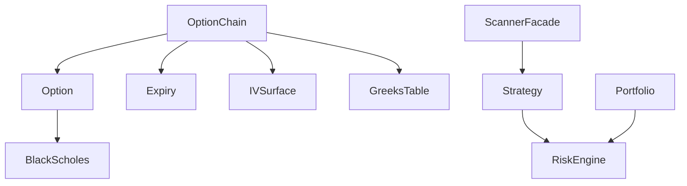

**Diagram sources**
- [chain.py:1-202](file://ntrade/domain/instruments/chain.py#L1-L202)
- [expiry.py:1-171](file://ntrade/domain/instruments/expiry.py#L1-L171)
- [derivatives.py:1-245](file://ntrade/domain/instruments/derivatives.py#L1-L245)
- [greeks.py:1-120](file://ntrade/domain/analytics/greeks.py#L1-L120)
- [surface.py:1-85](file://ntrade/domain/analytics/surface.py#L1-L85)
- [scanner.py:1-166](file://ntrade/domain/scanner.py#L1-L166)
- [strategies.py:1-67](file://ntrade/engines/strategies.py#L1-L67)
- [risk_engine.py:1-141](file://ntrade/engines/risk_engine.py#L1-L141)
- [portfolio.py:1-173](file://ntrade/domain/portfolio.py#L1-L173)

**Section sources**
- [chain.py:1-202](file://ntrade/domain/instruments/chain.py#L1-L202)
- [expiry.py:1-171](file://ntrade/domain/instruments/expiry.py#L1-L171)
- [derivatives.py:1-245](file://ntrade/domain/instruments/derivatives.py#L1-L245)
- [greeks.py:1-120](file://ntrade/domain/analytics/greeks.py#L1-L120)
- [surface.py:1-85](file://ntrade/domain/analytics/surface.py#L1-L85)
- [scanner.py:1-166](file://ntrade/domain/scanner.py#L1-L166)
- [strategies.py:1-67](file://ntrade/engines/strategies.py#L1-L67)
- [risk_engine.py:1-141](file://ntrade/engines/risk_engine.py#L1-L141)
- [portfolio.py:1-173](file://ntrade/domain/portfolio.py#L1-L173)

## Performance Considerations
- Prefer O(1) strike lookups via OptionChain._strike_map.
- Cache scanner results within rate_limit_seconds to avoid re-scans.
- Use GreeksTable and IVSurface to batch analytics; minimize repeated BlackScholes calls.
- Limit notional and quantity via RiskEngine to reduce transaction costs and slippage.

[No sources needed since this section provides general guidance]

## Troubleshooting Guide
- If OptionChain has no broker adapter, fetching will raise RuntimeError; ensure underlying has a valid broker.
- Implied volatility may return NOT_COMPUTED when inputs are invalid (years <= 0 or market_price <= 0); validate inputs.
- RiskEngine halts on daily loss or drawdown thresholds; resume only after corrective actions.
- Missing strikes in OptionChain.at_strike return None; handle gracefully in strategy logic.

**Section sources**
- [chain.py:1-202](file://ntrade/domain/instruments/chain.py#L1-L202)
- [greeks.py:1-120](file://ntrade/domain/analytics/greeks.py#L1-L120)
- [risk_engine.py:1-141](file://ntrade/engines/risk_engine.py#L1-L141)

## Conclusion
nTrade’s options framework provides robust tools for chain navigation, strike selection, Greeks-based analytics, and risk-managed execution. By combining OptionChain, Expiry/OptionPair, BlackScholes, and ScannerFacade, traders can implement advanced strategies with disciplined risk controls. Practical examples illustrate automated scanning, premium collection, and volatility arbitrage, while lifecycle management ensures safe handling of expirations and assignment risks.

[No sources needed since this section summarizes without analyzing specific files]

## Appendices
- References for strike selection and option chain usage patterns.
- Example algorithms for intraday and positional strategies.

**Section sources**
- [options.md:1-170](file://.agents/skills/dhan-tradehull/references/options.md#L1-L170)
- [intraday_options_algo.py:1-299](file://.agents/skills/dhan-tradehull/examples/intraday_options_algo.py#L1-L299)
- [positional_spread_algo.py:1-292](file://.agents/skills/dhan-tradehull/examples/positional_spread_algo.py#L1-L292)