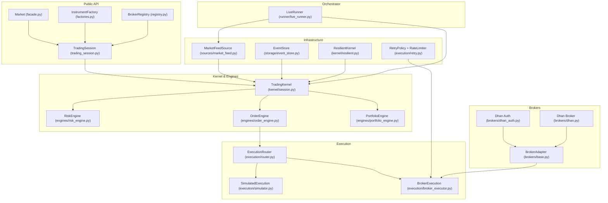
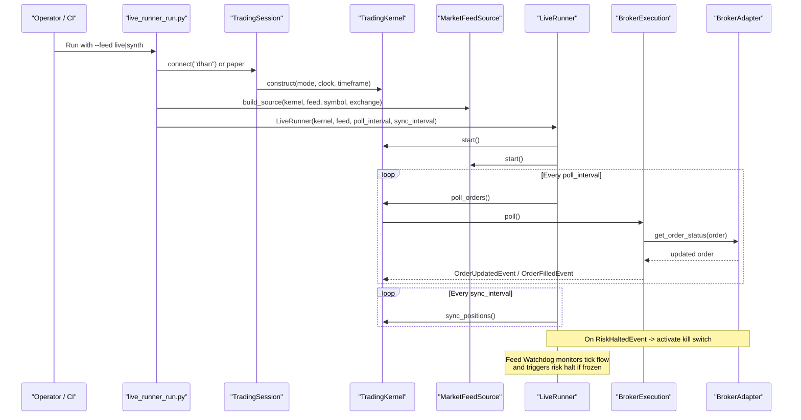
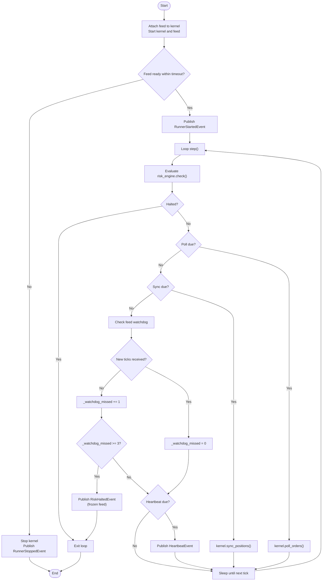
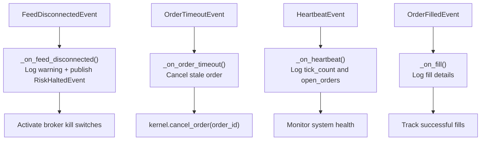
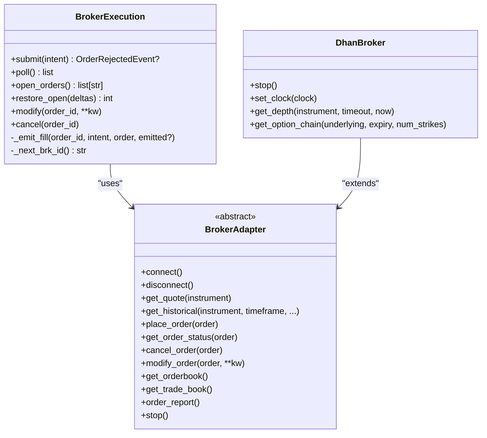
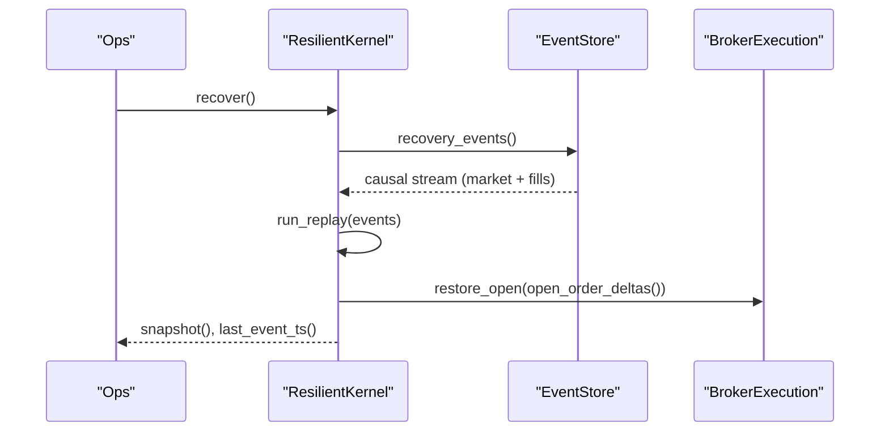
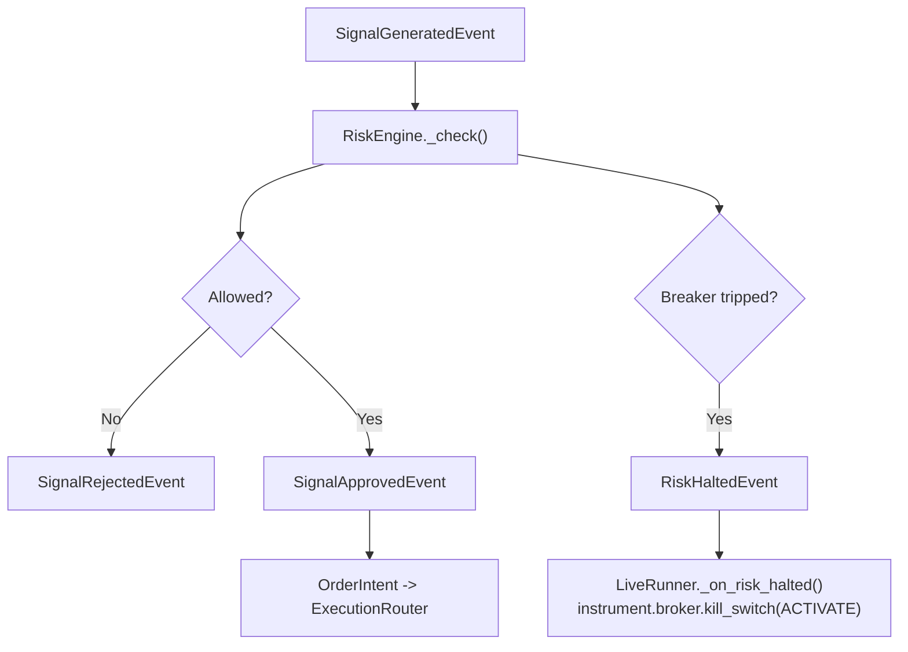
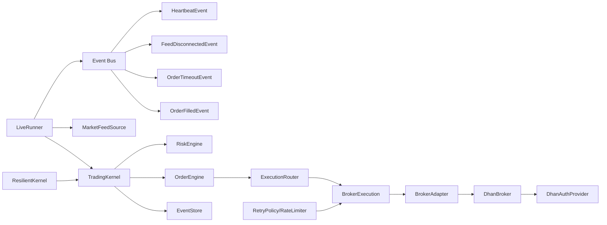

# Production Deployment Patterns

<cite>
**Referenced Files in This Document**
- [live_runner.py](file://ntrade/runner/live_runner.py)
- [trading_session.py](file://ntrade/kernel/trading_session.py)
- [broker_executor.py](file://ntrade/execution/broker_executor.py)
- [resilient.py](file://ntrade/kernel/resilient.py)
- [retry.py](file://ntrade/execution/retry.py)
- [lifecycle.py](file://ntrade/events/lifecycle.py)
- [order.py](file://ntrade/events/order.py)
- [base.py](file://ntrade/brokers/base.py)
- [dhan.py](file://ntrade/brokers/dhan.py)
- [registry.py](file://ntrade/registry.py)
- [facade.py](file://ntrade/facade.py)
- [factories.py](file://ntrade/factories.py)
- [live_runner_run.py](file://scripts/live_runner_run.py)
- [dhan_auth.py](file://ntrade/brokers/dhan_auth.py)
- [test_live_runner.py](file://tests/test_live_runner.py)
- [ARCHITECTURE.md](file://ARCHITECTURE.md)
</cite>

## Update Summary
**Changes Made**
- Enhanced LiveRunner with improved lifecycle management and event handling
- Added subscription to HeartbeatEvent, FeedDisconnectedEvent, and OrderTimeoutEvent
- Implemented feed watchdog mechanism for monitoring tick flow and risk halting
- Updated stop method to properly call broker shutdown hooks
- Added comprehensive event-driven error handling and graceful degradation

## Table of Contents
1. [Introduction](#introduction)
2. [Project Structure](#project-structure)
3. [Core Components](#core-components)
4. [Architecture Overview](#architecture-overview)
5. [Detailed Component Analysis](#detailed-component-analysis)
6. [Dependency Analysis](#dependency-analysis)
7. [Performance Considerations](#performance-considerations)
8. [Troubleshooting Guide](#troubleshooting-guide)
9. [Conclusion](#conclusion)
10. [Appendices](#appendices)

## Introduction
This document provides production deployment patterns for trading strategies using nTrade. It focuses on live runner configuration, multi-broker execution setup, monitoring and observability, error handling with circuit breakers, graceful degradation, containerized deployments, Kubernetes configurations, resource management, performance tuning, security and compliance, strategy versioning and rollback, and disaster recovery. The guidance is grounded in the codebase's orchestration loop, event-driven kernel, resilient replay/recovery, retry policies, and broker abstraction layer.

**Updated** Enhanced with improved lifecycle management, comprehensive event handling, and robust feed monitoring mechanisms.

## Project Structure
At a high level, nTrade separates concerns into:
- Public API and factories for instrument creation and session management
- Event-centric trading kernel with engines for market data, indicators, strategies, risk, orders, and portfolio
- Execution layer routing to simulated or live broker adapters
- Infrastructure for resilience, storage, replay, and feeds
- Orchestrator harness for live sessions

**Diagram sources**
- [trading_session.py:39-143](file://ntrade/kernel/trading_session.py#L39-L143)
- [factories.py:20-67](file://ntrade/factories.py#L20-L67)
- [registry.py:61-125](file://ntrade/registry.py#L61-L125)
- [broker_executor.py:53-107](file://ntrade/execution/broker_executor.py#L53-L107)
- [resilient.py:17-78](file://ntrade/kernel/resilient.py#L17-L78)
- [retry.py:19-98](file://ntrade/execution/retry.py#L19-98)
- [base.py:25-163](file://ntrade/brokers/base.py#L25-L163)
- [dhan.py:51-102](file://ntrade/brokers/dhan.py#L51-L102)
- [dhan_auth.py:114-151](file://ntrade/brokers/dhan_auth.py#L114-L151)
- [live_runner.py:21-73](file://ntrade/runner/live_runner.py#L21-L73)
- [ARCHITECTURE.md:20-51](file://ARCHITECTURE.md#L20-L51)

**Section sources**
- [ARCHITECTURE.md:20-51](file://ARCHITECTURE.md#L20-L51)
- [trading_session.py:39-143](file://ntrade/kernel/trading_session.py#L39-L143)
- [factories.py:20-67](file://ntrade/factories.py#L20-L67)
- [registry.py:61-125](file://ntrade/registry.py#L61-L125)
- [broker_executor.py:53-107](file://ntrade/execution/broker_executor.py#L53-L107)
- [resilient.py:17-78](file://ntrade/kernel/resilient.py#L17-L78)
- [retry.py:19-98](file://ntrade/execution/retry.py#L19-98)
- [base.py:25-163](file://ntrade/brokers/base.py#L25-L163)
- [dhan.py:51-102](file://ntrade/brokers/dhan.py#L51-L102)
- [dhan_auth.py:114-151](file://ntrade/brokers/dhan_auth.py#L114-L151)
- [live_runner.py:21-73](file://ntrade/runner/live_runner.py#L21-L73)

## Core Components
- **LiveRunner** orchestrates the live day with enhanced lifecycle management: starts feed and kernel, polls order status, syncs positions, monitors feed health via watchdog, and triggers kill switch on risk halt. Now subscribes to additional events including HeartbeatEvent, FeedDisconnectedEvent, and OrderTimeoutEvent.
- **TradingSession** unifies broker connection, instrument creation, engine wiring, and strategy registration.
- **BrokerExecution** routes order intents to real brokers, tracks open orders, emits lifecycle events, and supports crash recovery via deltas.
- **ResilientKernel** enables deterministic state rebuild from an EventStore after crashes without re-trading.
- **RetryPolicy** and **RateLimiter** provide configurable backoff and rate limiting for flaky calls.
- **Lifecycle events** standardize kernel and runner state transitions and heartbeats.

**Updated** LiveRunner now includes comprehensive event subscription and feed watchdog monitoring for enhanced reliability.

**Section sources**
- [live_runner.py:21-94](file://ntrade/runner/live_runner.py#L21-L94)
- [trading_session.py:39-143](file://ntrade/kernel/trading_session.py#L39-L143)
- [broker_executor.py:53-107](file://ntrade/execution/broker_executor.py#L53-L107)
- [resilient.py:17-78](file://ntrade/kernel/resilient.py#L17-L78)
- [retry.py:19-98](file://ntrade/execution/retry.py#L19-98)
- [lifecycle.py:11-57](file://ntrade/events/lifecycle.py#L11-L57)

## Architecture Overview
The system follows Clean Architecture principles with layered separation and zero-parity across live, replay, and backtest modes. The kernel drives engines through canonical events; execution targets are interchangeable; brokers are abstracted behind an adapter.

**Diagram sources**
- [live_runner_run.py:26-57](file://scripts/live_runner_run.py#L26-L57)
- [trading_session.py:73-116](file://ntrade/kernel/trading_session.py#L73-L116)
- [live_runner.py:55-94](file://ntrade/runner/live_runner.py#L55-L94)
- [broker_executor.py:118-181](file://ntrade/execution/broker_executor.py#L118-L181)
- [base.py:96-135](file://ntrade/brokers/base.py#L96-L135)

## Detailed Component Analysis

### Enhanced LiveRunner Orchestration and Monitoring
LiveRunner is the production entry point for unattended trading days with significantly enhanced lifecycle management and event handling:

**Key Enhancements:**
- **Comprehensive Event Subscription**: Subscribes to HeartbeatEvent, FeedDisconnectedEvent, OrderTimeoutEvent, and OrderFilledEvent
- **Feed Watchdog Mechanism**: Monitors tick flow and triggers risk halting when no new ticks received for multiple consecutive checks
- **Improved Stop Method**: Properly calls broker shutdown hooks to prevent daemon thread leaks
- **Enhanced Error Handling**: Robust handling of feed disconnections and order timeouts

**Diagram sources**
- [live_runner.py:55-94](file://ntrade/runner/live_runner.py#L55-L94)
- [live_runner.py:162-182](file://ntrade/runner/live_runner.py#L162-L182)
- [lifecycle.py:34-50](file://ntrade/events/lifecycle.py#L34-L50)

**Section sources**
- [live_runner.py:21-218](file://ntrade/runner/live_runner.py#L21-L218)
- [lifecycle.py:34-50](file://ntrade/events/lifecycle.py#L34-L50)

### Enhanced Event-Driven Error Handling
The LiveRunner now implements comprehensive event-driven error handling:

**Feed Disconnection Handling:**
- Subscribes to FeedDisconnectedEvent
- Immediately triggers RiskHaltedEvent to activate kill switches
- Logs warning with disconnection reason

**Order Timeout Management:**
- Subscribes to OrderTimeoutEvent
- Automatically cancels stale PENDING orders that exceed timeout thresholds
- Logs detailed information about timed-out orders

**Heartbeat Monitoring:**
- Subscribes to HeartbeatEvent for process health monitoring
- Logs heartbeat information including tick counts and open orders
- Provides visibility into system liveness

**Diagram sources**
- [live_runner.py:185-202](file://ntrade/runner/live_runner.py#L185-L202)
- [lifecycle.py:52-57](file://ntrade/events/lifecycle.py#L52-L57)
- [order.py:80-91](file://ntrade/events/order.py#L80-L91)

**Section sources**
- [live_runner.py:185-202](file://ntrade/runner/live_runner.py#L185-L202)
- [lifecycle.py:52-57](file://ntrade/events/lifecycle.py#L52-L57)
- [order.py:80-91](file://ntrade/events/order.py#L80-L91)

### Improved Broker Shutdown and Resource Management
The stop method has been enhanced to properly manage broker resources:

**Enhanced Cleanup Process:**
- Stops feed and kernel first
- Iterates through all instruments to find broker adapters
- Calls broker.stop() method on each broker adapter that exposes it
- Prevents daemon thread leaks from auth providers
- Publishes RunnerStoppedEvent with cleanup reason

**Resource Leak Prevention:**
- Ensures DhanAuthProvider proactive refresh timers are cancelled
- Prevents background threads from outliving the trading session
- Maintains proper resource lifecycle management

**Section sources**
- [live_runner.py:139-149](file://ntrade/runner/live_runner.py#L139-L149)
- [dhan.py:97-102](file://ntrade/brokers/dhan.py#L97-L102)

### Multi-Broker Execution Setup
BrokerExecution implements zero-parity order flow:
- Submits intent, immediately publishes acceptance, tracks open orders
- Polls broker for status updates, emitting partial-safe fills and updates
- Handles timeouts, stale entries, and crash recovery via delta restoration

**Diagram sources**
- [broker_executor.py:53-107](file://ntrade/execution/broker_executor.py#L53-L107)
- [base.py:25-163](file://ntrade/brokers/base.py#L25-L163)
- [dhan.py:51-102](file://ntrade/brokers/dhan.py#L51-L102)

**Section sources**
- [broker_executor.py:53-181](file://ntrade/execution/broker_executor.py#L53-L181)
- [base.py:96-135](file://ntrade/brokers/base.py#L96-L135)
- [dhan.py:97-102](file://ntrade/brokers/dhan.py#L97-L102)

### Resilience and Crash Recovery
ResilientKernel replays causal events to rebuild state deterministically without re-trading:
- Pauses recording during recovery
- Rebuilds open-order trackers for BrokerExecution
- Ensures sequence IDs do not collide post-recovery

**Diagram sources**
- [resilient.py:43-78](file://ntrade/kernel/resilient.py#L43-L78)
- [broker_executor.py:188-231](file://ntrade/execution/broker_executor.py#L188-L231)

**Section sources**
- [resilient.py:17-78](file://ntrade/kernel/resilient.py#L17-L78)
- [broker_executor.py:188-231](file://ntrade/execution/broker_executor.py#L188-L231)

### Error Handling and Circuit Breakers
- RiskEngine enforces static limits and dynamic circuit breakers (daily loss, drawdown, price deviation). When halted, it publishes RiskHaltedEvent.
- LiveRunner subscribes to RiskHaltedEvent and activates broker kill switches per instrument.
- RetryPolicy and RateLimiter protect hot-path broker calls with exponential backoff and jitter.

**Diagram sources**
- [ARCHITECTURE.md:283-289](file://ARCHITECTURE.md#L283-L289)
- [live_runner.py:203-218](file://ntrade/runner/live_runner.py#L203-L218)
- [retry.py:19-67](file://ntrade/execution/retry.py#L19-67)

**Section sources**
- [ARCHITECTURE.md:283-289](file://ARCHITECTURE.md#L283-L289)
- [live_runner.py:203-218](file://ntrade/runner/live_runner.py#L203-L218)
- [retry.py:19-67](file://ntrade/execution/retry.py#L19-67)

### Enhanced Graceful Degradation Strategies
- **Feed Watchdog**: Detects frozen feeds by monitoring tick flow and triggers risk halt to prevent stale decisions when no new ticks received for 3 consecutive checks
- Position sync failures preserve previous state rather than wiping balances or positions
- Stale order tracking evicts unrecoverable open orders after repeated failures
- Paper mode provides deterministic offline fallback for development and testing

**Updated** Enhanced with feed watchdog mechanism that monitors tick flow and automatically triggers risk halting when feeds become frozen.

**Section sources**
- [live_runner.py:162-182](file://ntrade/runner/live_runner.py#L162-L182)
- [broker_executor.py:130-141](file://ntrade/execution/broker_executor.py#L130-L141)
- [trading_session.py:96-116](file://ntrade/kernel/trading_session.py#L96-L116)

### Containerized Deployments and Kubernetes Configurations
Recommended production pattern:
- Build a minimal Python image with dependencies pinned via pyproject.toml
- Use environment variables for secrets (DHAN_CLIENT_ID, DHAN_ACCESS_TOKEN, DHAN_PIN, DHAN_TOTP_SECRET, token/cooldown paths)
- Configure Liveness/Readiness probes around heartbeat events and feed connectivity
- Set resource requests/limits based on benchmark results
- Use Horizontal Pod Autoscaler on CPU/memory and custom metrics (e.g., open orders, fill latency)
- Persist EventStore and logs to volume mounts for audit and recovery

[No sources needed since this section provides general guidance]

### Cloud-Native Observability and Alerting
- Subscribe to lifecycle events (RunnerStartedEvent, RunnerStoppedEvent, HeartbeatEvent) for process health
- Emit metrics from BrokerExecution (poll counts, fill rates, rejection reasons, timeouts)
- Implement distributed tracing spans around submit/poll cycles and broker calls
- Alert on:
  - Feed watchdog trips (no ticks)
  - RiskHaltedEvent occurrences
  - Elevated rejection rates or timeout spikes
  - Heartbeat gaps exceeding thresholds
  - Feed disconnection events

**Updated** Enhanced with feed disconnection monitoring and comprehensive event-based alerting.

**Section sources**
- [lifecycle.py:34-50](file://ntrade/events/lifecycle.py#L34-L50)
- [broker_executor.py:118-181](file://ntrade/execution/broker_executor.py#L118-L181)
- [live_runner.py:189-192](file://ntrade/runner/live_runner.py#L189-L192)

### Resource Management, Memory Optimization, and Performance Tuning
- Instrument flyweight caching avoids duplicate objects and subscriptions
- EventStore append-only design minimizes memory churn; consider rotating files
- Tune poll_interval and sync_interval to balance latency vs overhead
- Use ReplayClock/SimulationClock for deterministic runs and faster rehearsal
- Benchmark latency and throughput with provided scripts; set appropriate resource quotas

**Section sources**
- [registry.py:16-54](file://ntrade/registry.py#L16-54)
- [ARCHITECTURE.md:302-308](file://ARCHITECTURE.md#L302-L308)
- [live_runner_run.py:59-64](file://scripts/live_runner_run.py#L59-L64)

### Security Considerations, Credential Management, and Compliance
- Load credentials from environment or .env; never commit secrets
- Use shared token store with proactive expiry checks and cooldown files to avoid rate-limits
- Restrict file permissions on token/cooldown paths
- Enforce least privilege for service accounts and network egress rules
- Maintain audit trails via EventStore and structured logs for compliance

**Section sources**
- [dhan_auth.py:114-151](file://ntrade/brokers/dhan_auth.py#L114-L151)
- [.gitignore:1-25](file://.gitignore#L1-L25)

### Strategy Versioning, Rollback Procedures, and Disaster Recovery
- Version strategies and their risk parameters; pin versions in deployment manifests
- Use EventStore snapshots and last_event_ts to resume from known points
- Implement blue/green or canary rollouts for strategy updates
- On failure, trigger ResilientKernel.recover() to rebuild state deterministically before switching traffic
- Maintain runbooks for kill switch activation, feed restarts, and broker reconnects

**Section sources**
- [resilient.py:124-147](file://ntrade/kernel/resilient.py#L124-L147)
- [ARCHITECTURE.md:204-215](file://ARCHITECTURE.md#L204-L215)

## Dependency Analysis
Key runtime dependencies and relationships:
- LiveRunner depends on TradingKernel and MarketFeedSource
- BrokerExecution depends on BrokerAdapter and context bus
- ResilientKernel extends TradingKernel and uses EventStore
- RetryPolicy and RateLimiter are used in hot paths for resilience
- Lifecycle events decouple components and enable observability

**Updated** Enhanced dependency graph showing new event subscriptions and broker shutdown hooks.

**Diagram sources**
- [live_runner.py:21-56](file://ntrade/runner/live_runner.py#L21-56)
- [broker_executor.py:53-107](file://ntrade/execution/broker_executor.py#L53-L107)
- [resilient.py:17-78](file://ntrade/kernel/resilient.py#L17-L78)
- [retry.py:19-98](file://ntrade/execution/retry.py#L19-98)
- [lifecycle.py:11-57](file://ntrade/events/lifecycle.py#L11-L57)
- [order.py:80-91](file://ntrade/events/order.py#L80-L91)

**Section sources**
- [live_runner.py:21-56](file://ntrade/runner/live_runner.py#L21-56)
- [broker_executor.py:53-107](file://ntrade/execution/broker_executor.py#L53-L107)
- [resilient.py:17-78](file://ntrade/kernel/resilient.py#L17-L78)
- [retry.py:19-98](file://ntrade/execution/retry.py#L19-98)
- [lifecycle.py:11-57](file://ntrade/events/lifecycle.py#L11-L57)
- [order.py:80-91](file://ntrade/events/order.py#L80-L91)

## Performance Considerations
- Minimize polling frequency while ensuring timely fill detection; tune poll_interval and sync_interval per broker SLAs
- Use synthetic feeds for rehearsal to validate pipeline latency and throughput before going live
- Leverage flyweight instruments and cached history to reduce memory footprint
- Avoid synchronous blocking in handlers; use asynchronous patterns where possible
- Monitor and alert on heartbeat gaps and feed stalls
- **Updated** Feed watchdog adds minimal overhead but provides critical protection against frozen feeds

[No sources needed since this section provides general guidance]

## Troubleshooting Guide
Common issues and resolutions:
- Feed not ready: verify warmup_timeout and min_ticks; check network and credentials
- No new ticks: feed watchdog will trip risk halt; inspect feed connectivity and broker subscription
- Orders stuck PENDING: check timeout threshold and broker status; review stale eviction logic
- Risk halt triggered: inspect daily loss, drawdown, and price deviation settings; resume only after remediation
- Crash recovery: ensure EventStore contains causal events; call recover() before registering strategies
- **Updated** Feed disconnections: monitor FeedDisconnectedEvent and check network connectivity
- **Updated** Order timeouts: review OrderTimeoutEvent handling and cancel stale orders appropriately

**Section sources**
- [live_runner.py:61-73](file://ntrade/runner/live_runner.py#L61-L73)
- [live_runner.py:162-182](file://ntrade/runner/live_runner.py#L162-L182)
- [live_runner.py:189-197](file://ntrade/runner/live_runner.py#L189-L197)
- [broker_executor.py:130-141](file://ntrade/execution/broker_executor.py#L130-L141)
- [resilient.py:51-78](file://ntrade/kernel/resilient.py#L51-L78)

## Conclusion
nTrade provides a robust, event-driven foundation for production trading systems. By combining LiveRunner orchestration with enhanced lifecycle management, resilient replay/recovery, configurable retry policies, and a clean broker abstraction, teams can deploy scalable, observable, and secure trading applications. The recent enhancements include comprehensive event handling, feed watchdog monitoring, and proper resource cleanup, ensuring reliability, performance, and compliance in live environments.

**Updated** Enhanced with improved event-driven architecture, comprehensive error handling, and robust resource management for production deployments.

[No sources needed since this section summarizes without analyzing specific files]

## Appendices

### Practical Deployment Checklist
- Pin dependencies and build reproducible images
- Inject secrets via environment variables; restrict file permissions
- Configure Liveness/Readiness probes using heartbeat and feed status
- Set resource requests/limits based on benchmarks
- Enable EventStore persistence and log rotation
- Define alerting rules for risk halts, feed stalls, and order anomalies
- Prepare runbooks for kill switch, feed restarts, and crash recovery
- **Updated** Monitor feed watchdog trips and handle feed disconnections proactively
- **Updated** Ensure broker shutdown hooks are properly wired to prevent resource leaks

[No sources needed since this section provides general guidance]

### Enhanced Event Monitoring Configuration
For production deployments, configure comprehensive event monitoring:

**Critical Events to Monitor:**
- HeartbeatEvent: System liveness and performance metrics
- FeedDisconnectedEvent: Network connectivity issues
- OrderTimeoutEvent: Stale order management
- RiskHaltedEvent: Circuit breaker activations
- RunnerStartedEvent/RunnerStoppedEvent: Lifecycle management

**Alerting Thresholds:**
- Feed watchdog trips: Immediate investigation required
- Heartbeat gaps > 60 seconds: System health concern
- Order timeout frequency > 5%: Execution issues
- Risk halt frequency: Strategy or market conditions

**Section sources**
- [lifecycle.py:34-50](file://ntrade/events/lifecycle.py#L34-L50)
- [order.py:80-91](file://ntrade/events/order.py#L80-L91)
- [live_runner.py:185-202](file://ntrade/runner/live_runner.py#L185-L202)