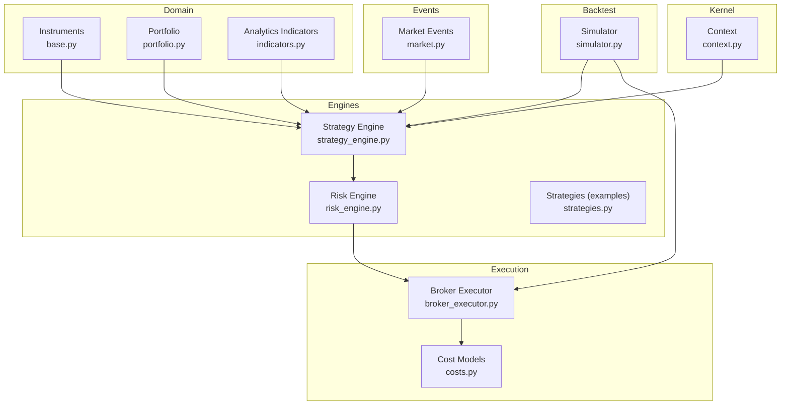
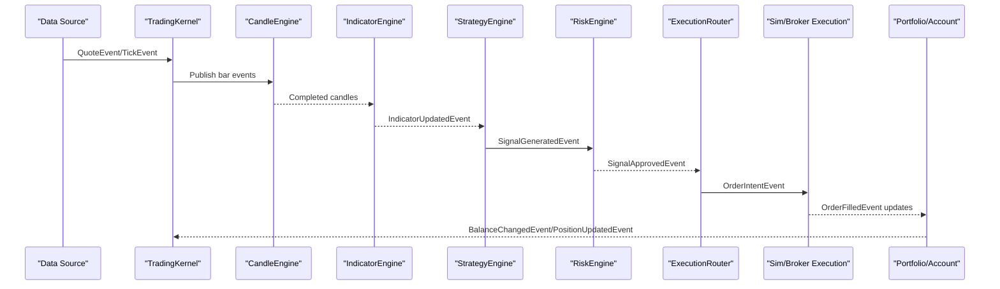
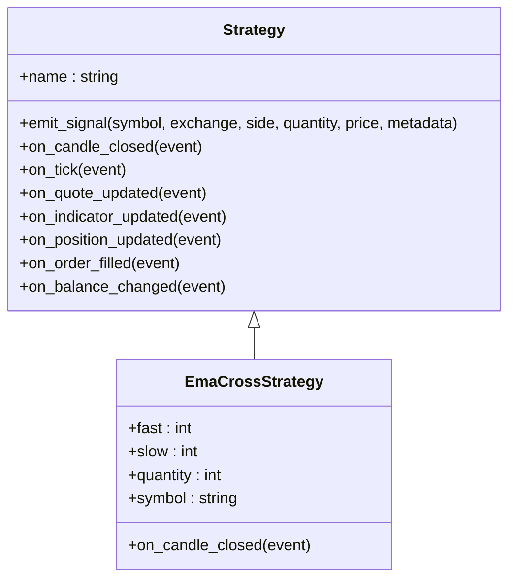
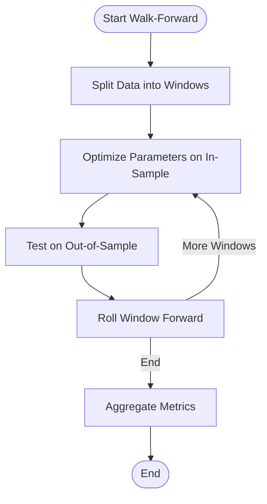
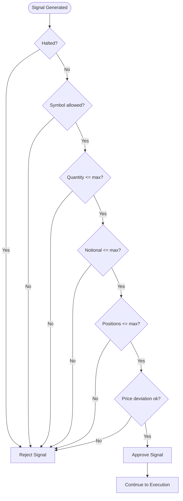
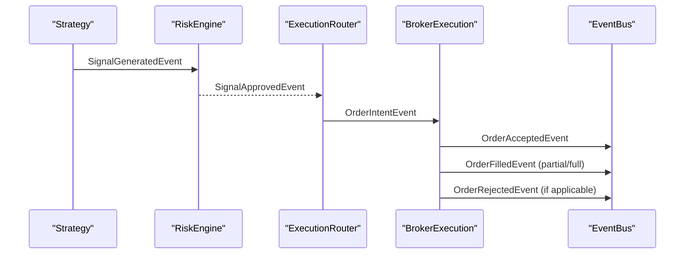
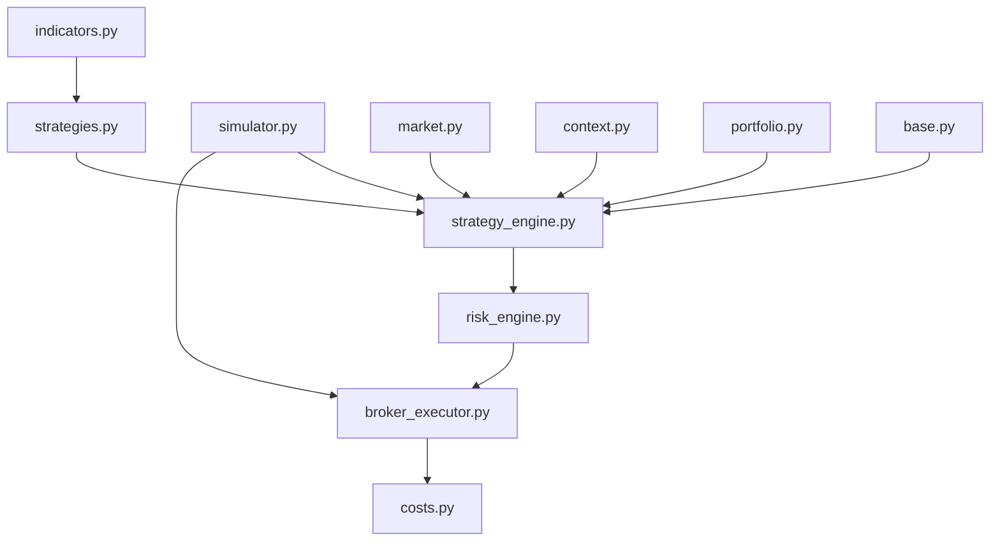

# Statistical Arbitrage Strategies

<cite>
**Referenced Files in This Document**
- [indicators.py](file://ntrade/domain/analytics/indicators.py)
- [strategies.py](file://ntrade/engines/strategies.py)
- [simulator.py](file://ntrade/backtest/simulator.py)
- [portfolio.py](file://ntrade/domain/portfolio.py)
- [broker_executor.py](file://ntrade/execution/broker_executor.py)
- [risk_engine.py](file://ntrade/engines/risk_engine.py)
- [costs.py](file://ntrade/execution/costs.py)
- [market.py](file://ntrade/events/market.py)
- [strategy_engine.py](file://ntrade/engines/strategy_engine.py)
- [context.py](file://ntrade/kernel/context.py)
- [base.py](file://ntrade/domain/instruments/base.py)
</cite>

## Table of Contents
1. [Introduction](#introduction)
2. [Project Structure](#project-structure)
3. [Core Components](#core-components)
4. [Architecture Overview](#architecture-overview)
5. [Detailed Component Analysis](#detailed-component-analysis)
6. [Dependency Analysis](#dependency-analysis)
7. [Performance Considerations](#performance-considerations)
8. [Troubleshooting Guide](#troubleshooting-guide)
9. [Conclusion](#conclusion)
10. [Appendices](#appendices)

## Introduction
This document explains how to implement statistical arbitrage strategies using nTrade’s analytics and execution stack. It covers mean reversion, pairs trading, and momentum-based approaches; cointegration testing, correlation analysis, and z-score signal generation; cross-sectional momentum and factor investing; market-neutral portfolio construction; robust backtesting (walk-forward and Monte Carlo); risk management tailored for statistical strategies; and real-time monitoring, execution optimization, and performance attribution. The guidance maps directly to the codebase components that provide indicators, strategy hooks, event-driven engines, cost models, and execution targets.

## Project Structure
The repository is organized into domain, engines, execution, backtest, events, kernel, and utilities. For statistical arbitrage:
- Analytics and indicators are provided by a pure-Pandas indicator bundle.
- Strategy logic is implemented as event-driven classes with hooks.
- Backtesting uses a zero-parity simulator over historical bars.
- Execution supports both simulated and live broker flows with consistent cost modeling.
- Risk engine screens signals and enforces circuit breakers.
- Portfolio and context provide shared state across engines.

**Diagram sources**
- [base.py:50-152](file://ntrade/domain/instruments/base.py#L50-L152)
- [portfolio.py:63-135](file://ntrade/domain/portfolio.py#L63-L135)
- [indicators.py:15-195](file://ntrade/domain/analytics/indicators.py#L15-L195)
- [strategy_engine.py:18-102](file://ntrade/engines/strategy_engine.py#L18-L102)
- [risk_engine.py:19-141](file://ntrade/engines/risk_engine.py#L19-L141)
- [strategies.py:13-67](file://ntrade/engines/strategies.py#L13-L67)
- [broker_executor.py:53-107](file://ntrade/execution/broker_executor.py#L53-L107)
- [costs.py:21-64](file://ntrade/execution/costs.py#L21-L64)
- [simulator.py:58-113](file://ntrade/backtest/simulator.py#L58-L113)
- [market.py:11-83](file://ntrade/events/market.py#L11-L83)
- [context.py:17-79](file://ntrade/kernel/context.py#L17-L79)

**Section sources**
- [indicators.py:15-195](file://ntrade/domain/analytics/indicators.py#L15-L195)
- [strategies.py:13-67](file://ntrade/engines/strategies.py#L13-L67)
- [simulator.py:58-113](file://ntrade/backtest/simulator.py#L58-L113)
- [portfolio.py:63-135](file://ntrade/domain/portfolio.py#L63-L135)
- [broker_executor.py:53-107](file://ntrade/execution/broker_executor.py#L53-L107)
- [risk_engine.py:19-141](file://ntrade/engines/risk_engine.py#L19-L141)
- [costs.py:21-64](file://ntrade/execution/costs.py#L21-L64)
- [market.py:11-83](file://ntrade/events/market.py#L11-L83)
- [strategy_engine.py:18-102](file://ntrade/engines/strategy_engine.py#L18-L102)
- [context.py:17-79](file://ntrade/kernel/context.py#L17-L79)
- [base.py:50-152](file://ntrade/domain/instruments/base.py#L50-L152)

## Core Components
- Indicator bundle provides RSI, ATR, EMA/SMA, VWAP, Supertrend, Heikin-Ashi, Renko bricks, and a compute_bundle utility to extract latest values per candle. These are essential for building mean-reversion and momentum signals.
- Strategy base class defines hooks (on_candle_closed, on_tick, etc.) and emit_signal to publish trade signals through the event bus.
- BacktestSimulator runs the same kernel and engines over OHLCV data with configurable slippage, commission, statutory costs, and futures carry costs.
- BrokerExecution routes order intents to a broker adapter, handling lifecycle, timeouts, partial fills, and statutory/commission costs consistently with simulation.
- RiskEngine screens signals via allowlists, notional/quantity caps, position limits, price deviation checks, daily loss cap, and drawdown halt/resume.
- Portfolio and Account model positions and holdings with PnL and market value calculations.
- Context holds shared mutable state (bus, clock, instruments, portfolio, account).

**Section sources**
- [indicators.py:15-195](file://ntrade/domain/analytics/indicators.py#L15-L195)
- [strategy_engine.py:18-102](file://ntrade/engines/strategy_engine.py#L18-L102)
- [simulator.py:58-113](file://ntrade/backtest/simulator.py#L58-L113)
- [broker_executor.py:53-107](file://ntrade/execution/broker_executor.py#L53-L107)
- [risk_engine.py:19-141](file://ntrade/engines/risk_engine.py#L19-L141)
- [portfolio.py:63-135](file://ntrade/domain/portfolio.py#L63-L135)
- [context.py:17-79](file://ntrade/kernel/context.py#L17-L79)

## Architecture Overview
Statistical arbitrage workflows in nTrade follow an event-driven pipeline:
- Historical or live data produces QuoteEvent/TickEvent/CandleClosedEvent.
- IndicatorEngine computes bundles from OHLCV and publishes IndicatorUpdatedEvent.
- StrategyEngine dispatches events to registered strategies.
- Strategies emit SignalGeneratedEvent which RiskEngine screens.
- Approved signals become order intents routed via ExecutionRouter to either SimulatedExecution or BrokerExecution.
- Fills update portfolio/account and publish OrderFilledEvent.

**Diagram sources**
- [market.py:11-83](file://ntrade/events/market.py#L11-L83)
- [strategy_engine.py:48-102](file://ntrade/engines/strategy_engine.py#L48-L102)
- [risk_engine.py:19-141](file://ntrade/engines/risk_engine.py#L19-L141)
- [broker_executor.py:53-107](file://ntrade/execution/broker_executor.py#L53-L107)
- [simulator.py:116-143](file://ntrade/backtest/simulator.py#L116-L143)

## Detailed Component Analysis

### Mean Reversion Strategies
Mean reversion relies on deviations from a moving average or equilibrium and typically uses volatility-normalized metrics like z-scores. In nTrade:
- Use EMA/SMA/VWAP from the indicator bundle to define the equilibrium level.
- Compute z-score as (price - mean) / std over a rolling window.
- Generate signals when z-score exceeds thresholds (e.g., > 2 for short, < -2 for long), with exits near mean or threshold reversal.
- Incorporate ATR for dynamic stop-loss and position sizing based on volatility regimes.

Implementation tips:
- Subscribe to on_candle_closed and read bundle keys such as ema_9, ema_21, atr_14, vwap.
- Maintain rolling windows for mean/std computation outside the indicator bundle if needed.
- Emit signals via emit_signal with side and quantity derived from volatility-adjusted sizing.

**Section sources**
- [indicators.py:38-53](file://ntrade/domain/analytics/indicators.py#L38-L53)
- [indicators.py:29-36](file://ntrade/domain/analytics/indicators.py#L29-L36)
- [strategy_engine.py:37-45](file://ntrade/engines/strategy_engine.py#L37-L45)

### Pairs Trading and Cointegration
Pairs trading exploits stable relationships between two assets. Steps:
- Select candidate pairs and test for cointegration (e.g., Engle-Granger or Johansen).
- Estimate hedge ratio via OLS regression of one asset on the other.
- Compute spread = y - beta*x and derive z-score over rolling window.
- Trade spread deviations: enter when |z| > threshold, exit when z crosses zero or reaches bounds.
- Monitor correlation stability and cointegration residuals; adjust hedge ratio periodically.

Integration with nTrade:
- Use indicator bundle for trend filters (e.g., avoid mean-reversion trades during strong trends).
- Use ATR to size legs proportionally to volatility.
- Implement pair-specific RiskEngine rules (allowlist, max notional per pair).

Note: Cointegration tests and correlation matrices are analytical steps you can implement using Pandas/NumPy and feed results into your strategy’s decision logic.

**Section sources**
- [indicators.py:29-36](file://ntrade/domain/analytics/indicators.py#L29-L36)
- [risk_engine.py:84-111](file://ntrade/engines/risk_engine.py#L84-L111)

### Momentum-Based Approaches
Momentum strategies capture trends using moving averages and breakout signals. Example:
- EMA crossover (fast vs slow) generates golden/death cross signals.
- Combine with Supertrend direction filter to reduce whipsaws.
- Use ATR for trailing stops and volatility scaling.

nTrade example:
- EmaCrossStrategy demonstrates hook usage and signal emission on candle close.

**Diagram sources**
- [strategy_engine.py:18-45](file://ntrade/engines/strategy_engine.py#L18-L45)
- [strategies.py:13-67](file://ntrade/engines/strategies.py#L13-L67)

**Section sources**
- [strategies.py:13-67](file://ntrade/engines/strategies.py#L13-L67)
- [indicators.py:43-46](file://ntrade/domain/analytics/indicators.py#L43-L46)
- [indicators.py:55-92](file://ntrade/domain/analytics/indicators.py#L55-L92)

### Cross-Sectional Momentum and Factor Investing
Cross-sectional momentum ranks assets by recent returns and goes long top decile, short bottom decile. Factor investing extends this by combining multiple factors (value, quality, volatility).
- Compute rolling returns across universe; rank and form portfolios.
- Apply sector/regime filters; rebalance at fixed intervals.
- Use indicator bundle for regime detection (trend strength via ATR, momentum via EMA).
- Position sizing proportional to factor exposure and volatility.

nTrade integration:
- Use StrategyEngine to process IndicatorUpdatedEvent and emit signals per instrument.
- Use RiskEngine to enforce notional caps and position counts across the universe.

**Section sources**
- [strategy_engine.py:48-102](file://ntrade/engines/strategy_engine.py#L48-L102)
- [risk_engine.py:84-111](file://ntrade/engines/risk_engine.py#L84-L111)
- [indicators.py:29-36](file://ntrade/domain/analytics/indicators.py#L29-L36)

### Market-Neutral Portfolio Construction
Goal: balance exposures to achieve net-zero beta or factor neutrality while capturing alpha.
- Construct long/short book with equal dollar weights or volatility-weighted.
- Hedge systematic risk using index futures or options; monitor hedge ratios.
- Enforce sector neutrality and limit single-name risk.
- Use RiskEngine to enforce global position count and notional constraints.

nTrade integration:
- Use Portfolio and Account to track positions and equity curve.
- Use BacktestSimulator to evaluate market-neutral strategies under realistic costs.

**Section sources**
- [portfolio.py:63-135](file://ntrade/domain/portfolio.py#L63-L135)
- [simulator.py:58-113](file://ntrade/backtest/simulator.py#L58-L113)
- [risk_engine.py:84-111](file://ntrade/engines/risk_engine.py#L84-L111)

### Z-Score Calculations for Signal Generation
Z-score standardizes deviations from mean to create symmetric signals:
- z = (x - μ) / σ over rolling window.
- Thresholds determine entry/exit; consider regime-dependent thresholds.
- Combine with trend filters to avoid counter-trend entries.

nTrade integration:
- Use indicator bundle for baseline levels (EMA/SMA/VWAP) and volatility (ATR).
- Compute z-score in strategy logic and emit signals accordingly.

**Section sources**
- [indicators.py:38-53](file://ntrade/domain/analytics/indicators.py#L38-L53)
- [indicators.py:29-36](file://ntrade/domain/analytics/indicators.py#L29-L36)
- [strategy_engine.py:37-45](file://ntrade/engines/strategy_engine.py#L37-L45)

### Backtesting Methodologies
Walk-forward analysis:
- Split data into in-sample and out-of-sample windows; roll forward and re-optimize parameters.
- Evaluate performance stability across windows.

Monte Carlo simulations:
- Resample trades or returns to assess distribution of outcomes.
- Stress-test under varying slippage/commission/statutory costs.

nTrade capabilities:
- BacktestSimulator runs strategies over OHLCV with configurable cost models and futures carry costs.
- Results include equity curve, total return, commissions, statutory costs, and max drawdown.

[No sources needed since this diagram shows conceptual workflow, not actual code structure]

**Section sources**
- [simulator.py:116-143](file://ntrade/backtest/simulator.py#L116-L143)
- [simulator.py:194-220](file://ntrade/backtest/simulator.py#L194-L220)

### Risk Management for Statistical Strategies
Key controls:
- Allowlist symbols per strategy.
- Max notional and quantity per signal.
- Max open positions across portfolio or per strategy.
- Price deviation guard to prevent fat-finger orders.
- Daily loss cap and drawdown halt/resume.

nTrade implementation:
- RiskEngine screens signals and enforces circuit breakers.
- Use context.account.balance and portfolio.positions to compute equity and drawdown.

**Diagram sources**
- [risk_engine.py:84-111](file://ntrade/engines/risk_engine.py#L84-L111)

**Section sources**
- [risk_engine.py:19-141](file://ntrade/engines/risk_engine.py#L19-L141)

### Real-Time Signal Monitoring and Execution Optimization
Monitoring:
- Subscribe to IndicatorUpdatedEvent and SignalGeneratedEvent to log signals and approvals/rejections.
- Track open orders and fill status via BrokerExecution poll loop.

Execution optimization:
- Use BarAwareExecution for limit fills aligned with bar high/low.
- Configure slippage and commission models to reflect realistic execution costs.
- Handle timeouts and partial fills; resume after recovery.

nTrade integration:
- BrokerExecution manages order lifecycle and publishes OrderAccepted/OrderFilled/OrderRejected events.
- Costs module applies commission, statutory charges, and GST consistently.

**Diagram sources**
- [broker_executor.py:70-107](file://ntrade/execution/broker_executor.py#L70-L107)
- [broker_executor.py:118-181](file://ntrade/execution/broker_executor.py#L118-L181)
- [costs.py:164-174](file://ntrade/execution/costs.py#L164-L174)

**Section sources**
- [broker_executor.py:53-107](file://ntrade/execution/broker_executor.py#L53-L107)
- [costs.py:21-64](file://ntrade/execution/costs.py#L21-L64)

### Performance Attribution
Attribution decomposes returns into:
- Alpha from signals (mean reversion, momentum, factors).
- Beta from market exposure (hedged in market-neutral).
- Costs: commissions, statutory charges, slippage, futures carry.

nTrade tools:
- BacktestResult includes commissions_total, statutory_total, futures_costs_total, max_drawdown_pct.
- Equity curve tracks mark-to-market performance.

**Section sources**
- [simulator.py:194-220](file://ntrade/backtest/simulator.py#L194-L220)
- [costs.py:164-174](file://ntrade/execution/costs.py#L164-L174)

## Dependency Analysis
The following diagram highlights key dependencies among core modules used in statistical arbitrage implementations.

**Diagram sources**
- [indicators.py:15-195](file://ntrade/domain/analytics/indicators.py#L15-L195)
- [strategies.py:13-67](file://ntrade/engines/strategies.py#L13-L67)
- [strategy_engine.py:48-102](file://ntrade/engines/strategy_engine.py#L48-L102)
- [risk_engine.py:19-141](file://ntrade/engines/risk_engine.py#L19-L141)
- [broker_executor.py:53-107](file://ntrade/execution/broker_executor.py#L53-L107)
- [costs.py:21-64](file://ntrade/execution/costs.py#L21-L64)
- [simulator.py:58-113](file://ntrade/backtest/simulator.py#L58-L113)
- [market.py:11-83](file://ntrade/events/market.py#L11-L83)
- [context.py:17-79](file://ntrade/kernel/context.py#L17-L79)
- [portfolio.py:63-135](file://ntrade/domain/portfolio.py#L63-L135)
- [base.py:50-152](file://ntrade/domain/instruments/base.py#L50-L152)

**Section sources**
- [indicators.py:15-195](file://ntrade/domain/analytics/indicators.py#L15-L195)
- [strategies.py:13-67](file://ntrade/engines/strategies.py#L13-L67)
- [strategy_engine.py:48-102](file://ntrade/engines/strategy_engine.py#L48-L102)
- [risk_engine.py:19-141](file://ntrade/engines/risk_engine.py#L19-L141)
- [broker_executor.py:53-107](file://ntrade/execution/broker_executor.py#L53-L107)
- [costs.py:21-64](file://ntrade/execution/costs.py#L21-L64)
- [simulator.py:58-113](file://ntrade/backtest/simulator.py#L58-L113)
- [market.py:11-83](file://ntrade/events/market.py#L11-L83)
- [context.py:17-79](file://ntrade/kernel/context.py#L17-L79)
- [portfolio.py:63-135](file://ntrade/domain/portfolio.py#L63-L135)
- [base.py:50-152](file://ntrade/domain/instruments/base.py#L50-L152)

## Performance Considerations
- Indicator computations should be vectorized and limited to the latest completed candle to minimize overhead.
- Rolling windows for z-score and correlation should use efficient rolling functions and avoid unnecessary recomputation.
- Backtests should configure realistic slippage and statutory costs to ensure convergence with live PnL.
- Futures carry costs must be modeled for accurate holding-period PnL.
- Risk checks should be lightweight and run per signal to avoid bottlenecks.

[No sources needed since this section provides general guidance]

## Troubleshooting Guide
Common issues and resolutions:
- Missing indicator values: Ensure sufficient warm-up candles before reading EMA/SMA/ATR; handle NaN gracefully.
- Signal rejection: Verify allowlist, quantity/notional caps, and price deviation thresholds in RiskEngine.
- Execution failures: Check broker connectivity, order lifecycle polling, and timeout handling in BrokerExecution.
- Cost discrepancies: Confirm commission and statutory models are applied consistently across simulation and live execution.
- Drawdown halts: Review daily loss cap and drawdown thresholds; resume only after conditions normalize.

**Section sources**
- [risk_engine.py:84-111](file://ntrade/engines/risk_engine.py#L84-L111)
- [broker_executor.py:118-181](file://ntrade/execution/broker_executor.py#L118-L181)
- [costs.py:164-174](file://ntrade/execution/costs.py#L164-L174)

## Conclusion
nTrade’s event-driven architecture, indicator bundle, and consistent cost modeling enable robust implementation of statistical arbitrage strategies. By leveraging mean reversion, pairs trading, and momentum techniques within a disciplined risk framework, and validating via walk-forward and Monte Carlo methods, practitioners can build reliable, market-neutral portfolios with transparent performance attribution.

[No sources needed since this section summarizes without analyzing specific files]

## Appendices
- Practical examples:
  - Mean reversion: Use EMA/SMA as equilibrium, ATR for volatility scaling, z-score thresholds for entries/exits.
  - Pairs trading: Cointegration test, hedge ratio estimation, spread z-score trading with periodic re-estimation.
  - Cross-sectional momentum: Rank universes by returns, construct long/short portfolios, rebalance regularly.
  - Market-neutral: Hedge beta using futures/options, enforce sector neutrality, monitor hedge ratios.
- Backtesting:
  - Use BacktestSimulator with realistic slippage/commission/statutory costs and futures carry costs.
  - Implement walk-forward optimization and Monte Carlo resampling for outcome distributions.
- Risk management:
  - Configure RiskEngine with allowlists, notional/quantity caps, position limits, price deviation guards, daily loss cap, and drawdown halt/resume.
- Execution:
  - Use BarAwareExecution for limit fills aligned with bar ranges; handle timeouts and partial fills; monitor order lifecycle events.

[No sources needed since this section provides general guidance]