# Basic Usage Examples

<cite>
**Referenced Files in This Document**
- [ema_cross_run.py](file://scripts/ema_cross_run.py)
- [paper_gate_run.py](file://scripts/paper_gate_run.py)
- [live_read_check.py](file://scripts/live_read_check.py)
- [trading_session.py](file://ntrade/kernel/trading_session.py)
- [session.py](file://ntrade/kernel/session.py)
- [clock.py](file://ntrade/kernel/clock.py)
- [market_feed.py](file://ntrade/sources/market_feed.py)
- [synthetic_feed.py](file://ntrade/sources/synthetic_feed.py)
- [strategies.py](file://ntrade/engines/strategies.py)
- [simulator.py](file://ntrade/execution/simulator.py)
- [portfolio.py](file://ntrade/domain/portfolio.py)
- [cash.py](file://ntrade/domain/instruments/cash.py)
- [facade.py](file://ntrade/facade.py)
- [paper.py](file://ntrade/brokers/paper.py)
</cite>

## Table of Contents
1. [Introduction](#introduction)
2. [Project Structure](#project-structure)
3. [Core Components](#core-components)
4. [Architecture Overview](#architecture-overview)
5. [Detailed Component Analysis](#detailed-component-analysis)
6. [Dependency Analysis](#dependency-analysis)
7. [Performance Considerations](#performance-considerations)
8. [Troubleshooting Guide](#troubleshooting-guide)
9. [Conclusion](#conclusion)
10. [Appendices](#appendices)

## Introduction
This guide provides practical, beginner-friendly examples to help you get started with nTrade. You will learn how to:
- Connect to a broker via TradingSession
- Create instruments and access market data
- Run historical backtests using replay mode
- Set up real-time streaming with simulated feeds
- Place orders through the kernel’s execution pipeline
- Manage portfolios and track positions and balances
- Configure common patterns, handle errors, and debug your code

The examples are grounded in the repository’s working scripts and core modules, ensuring that what you learn here maps directly to production-grade behavior.

## Project Structure
At a high level, nTrade is organized into layers:
- Brokers: adapters for live brokers (e.g., Dhan) and paper trading
- Domain: instruments, market data models, portfolio/account
- Engines: event-driven processing (candles, indicators, strategies, risk, portfolio)
- Kernel: orchestrates engines, clock, event bus, and execution routing
- Sources: feed canonical events (ticks, quotes) into the kernel
- Execution: simulated or broker-backed order filling
- Scripts: runnable examples demonstrating end-to-end flows

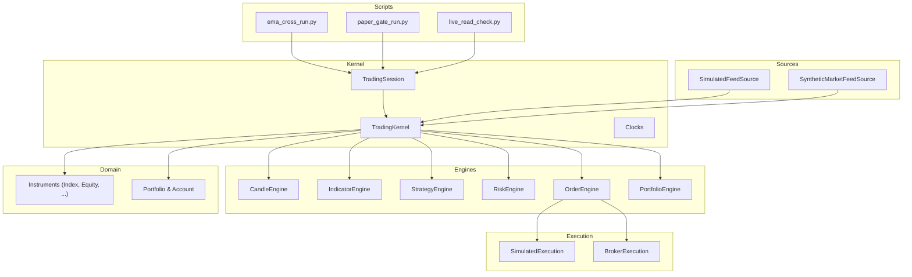

**Diagram sources**
- [ema_cross_run.py:1-87](file://scripts/ema_cross_run.py#L1-L87)
- [paper_gate_run.py:1-66](file://scripts/paper_gate_run.py#L1-L66)
- [live_read_check.py:1-188](file://scripts/live_read_check.py#L1-L188)
- [trading_session.py:1-306](file://ntrade/kernel/trading_session.py#L1-L306)
- [session.py:1-198](file://ntrade/kernel/session.py#L1-L198)
- [clock.py:1-55](file://ntrade/kernel/clock.py#L1-L55)
- [market_feed.py:1-105](file://ntrade/sources/market_feed.py#L1-L105)
- [synthetic_feed.py:1-77](file://ntrade/sources/synthetic_feed.py#L1-L77)
- [strategies.py:1-67](file://ntrade/engines/strategies.py#L1-L67)
- [simulator.py:1-147](file://ntrade/execution/simulator.py#L1-L147)
- [portfolio.py:1-173](file://ntrade/domain/portfolio.py#L1-L173)
- [cash.py:1-50](file://ntrade/domain/instruments/cash.py#L1-L50)

**Section sources**
- [trading_session.py:1-306](file://ntrade/kernel/trading_session.py#L1-L306)
- [session.py:1-198](file://ntrade/kernel/session.py#L1-L198)

## Core Components
- TradingSession: Unified entry point to connect to brokers, create instruments, register strategies, and start/stop sessions. Supports live, paper, and replay modes.
- TradingKernel: Wires the engine stack (market, candles, indicators, strategy, risk, order, portfolio), manages the event bus, clock, and execution target.
- Instruments: Domain objects representing assets like Index, Equity, ETF, Currency, Commodity.
- Market Data Sources: SimulatedFeedSource and SyntheticMarketFeedSource produce canonical TickEvent/QuoteEvent streams for offline testing.
- Strategies: Reusable logic like EmaCrossStrategy reacting to candle events and emitting signals.
- Execution: SimulatedExecution for deterministic fills; BrokerExecution for live broker integration.
- Portfolio & Account: Track positions, holdings, balance, and P&L.

Key usage patterns:
- Connect via TradingSession.connect("dhan") or TradingSession.paper()
- Create instruments via session.index(), session.stock(), etc.
- Register instruments and strategies with the kernel
- Start the kernel and feed events from a source
- Read account/portfolio state after run

**Section sources**
- [trading_session.py:1-306](file://ntrade/kernel/trading_session.py#L1-L306)
- [session.py:1-198](file://ntrade/kernel/session.py#L1-L198)
- [cash.py:1-50](file://ntrade/domain/instruments/cash.py#L1-L50)
- [market_feed.py:1-105](file://ntrade/sources/market_feed.py#L1-L105)
- [synthetic_feed.py:1-77](file://ntrade/sources/synthetic_feed.py#L1-L77)
- [strategies.py:1-67](file://ntrade/engines/strategies.py#L1-L67)
- [simulator.py:1-147](file://ntrade/execution/simulator.py#L1-L147)
- [portfolio.py:1-173](file://ntrade/domain/portfolio.py#L1-L173)

## Architecture Overview
The zero-parity design ensures identical behavior across live, replay, and backtest by funneling all market data through canonical events and a shared kernel.

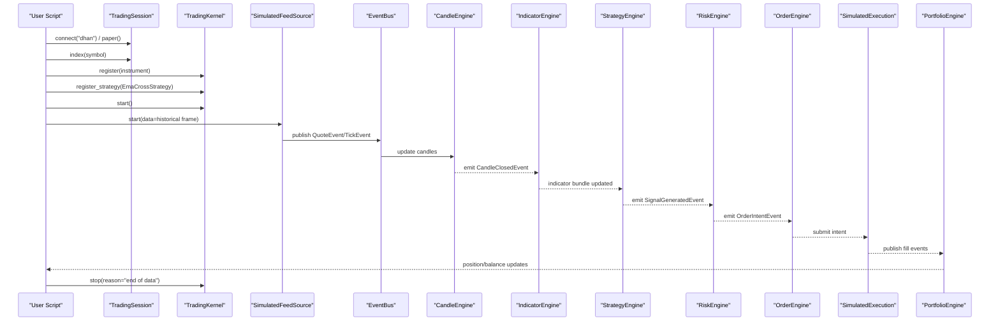

**Diagram sources**
- [ema_cross_run.py:1-87](file://scripts/ema_cross_run.py#L1-L87)
- [trading_session.py:1-306](file://ntrade/kernel/trading_session.py#L1-L306)
- [session.py:1-198](file://ntrade/kernel/session.py#L1-L198)
- [market_feed.py:1-105](file://ntrade/sources/market_feed.py#L1-L105)
- [strategies.py:1-67](file://ntrade/engines/strategies.py#L1-L67)
- [simulator.py:1-147](file://ntrade/execution/simulator.py#L1-L147)

## Detailed Component Analysis

### EMA Crossover Backtest (Historical Data + Replay)
This example demonstrates fetching historical data, setting up a replay kernel, registering a strategy, feeding events, and reporting results.

Steps:
- Connect to a broker session and fetch historical OHLCV for an index
- Initialize a TradingKernel in replay mode with a ReplayClock
- Register the instrument and EmaCrossStrategy
- Feed historical data via SimulatedFeedSource
- Stop the kernel and print event counts, fills, final position, balance, and equity

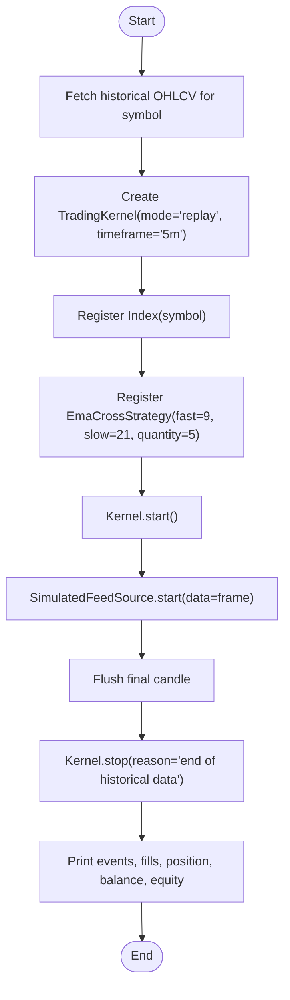

**Diagram sources**
- [ema_cross_run.py:1-87](file://scripts/ema_cross_run.py#L1-L87)
- [market_feed.py:1-105](file://ntrade/sources/market_feed.py#L1-L105)
- [strategies.py:1-67](file://ntrade/engines/strategies.py#L1-L67)
- [clock.py:1-55](file://ntrade/kernel/clock.py#L1-L55)

**Section sources**
- [ema_cross_run.py:1-87](file://scripts/ema_cross_run.py#L1-L87)
- [trading_session.py:1-306](file://ntrade/kernel/trading_session.py#L1-L306)
- [session.py:1-198](file://ntrade/kernel/session.py#L1-L198)
- [market_feed.py:1-105](file://ntrade/sources/market_feed.py#L1-L105)
- [strategies.py:1-67](file://ntrade/engines/strategies.py#L1-L67)
- [clock.py:1-55](file://ntrade/kernel/clock.py#L1-L55)

### Paper Trading Gate (Validation Checklist)
Use this script to validate a strategy over synthetic ticks derived from historical bars before going live. It prints a checklist and exits non-zero if conditions fail (e.g., no fills or excessive drawdown).

Steps:
- Connect to a broker session and fetch historical data
- Initialize a replay kernel and register instrument + strategy
- Use SyntheticMarketFeedSource to generate 1-second ticks per minute bar
- Join the feed thread, flush candles, stop kernel, and build a report
- Fail closed based on fills and max drawdown thresholds

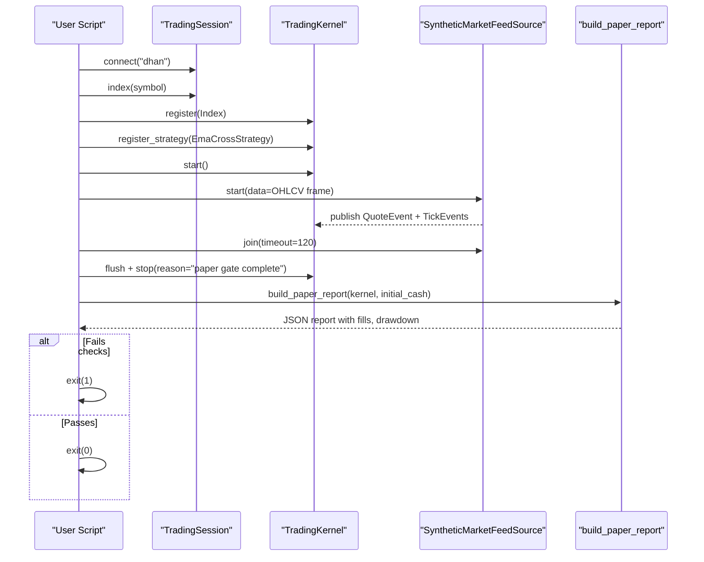

**Diagram sources**
- [paper_gate_run.py:1-66](file://scripts/paper_gate_run.py#L1-L66)
- [synthetic_feed.py:1-77](file://ntrade/sources/synthetic_feed.py#L1-L77)
- [trading_session.py:1-306](file://ntrade/kernel/trading_session.py#L1-L306)
- [session.py:1-198](file://ntrade/kernel/session.py#L1-L198)

**Section sources**
- [paper_gate_run.py:1-66](file://scripts/paper_gate_run.py#L1-L66)
- [synthetic_feed.py:1-77](file://ntrade/sources/synthetic_feed.py#L1-L77)
- [trading_session.py:1-306](file://ntrade/kernel/trading_session.py#L1-L306)
- [session.py:1-198](file://ntrade/kernel/session.py#L1-L198)

### Live Read-Only Check (Connectivity and API Endpoints)
Verify connection and read-only endpoints against a live broker without placing orders. Useful for environment setup and troubleshooting.

Steps:
- Connect to the broker via TradingSession.connect("dhan")
- Validate quote, depth, history, option chain, expiry lists, and account endpoints
- Record PASS/FAIL/DEGRADED statuses and summarize results

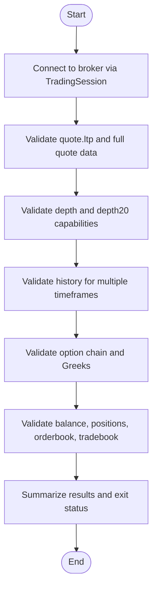

**Diagram sources**
- [live_read_check.py:1-188](file://scripts/live_read_check.py#L1-L188)
- [trading_session.py:1-306](file://ntrade/kernel/trading_session.py#L1-L306)

**Section sources**
- [live_read_check.py:1-188](file://scripts/live_read_check.py#L1-L188)
- [trading_session.py:1-306](file://ntrade/kernel/trading_session.py#L1-L306)

### Real-Time Streaming Setup (Simulated)
For local development and testing, use SimulatedFeedSource to stream canonical events from a price path or OHLCV frame. This mirrors live websockets so strategies behave identically.

Steps:
- Create a TradingKernel (live or replay)
- Attach SimulatedFeedSource with either prices list or OHLCV DataFrame
- Start the source to publish TickEvent/QuoteEvent
- Observe strategy reactions and portfolio updates

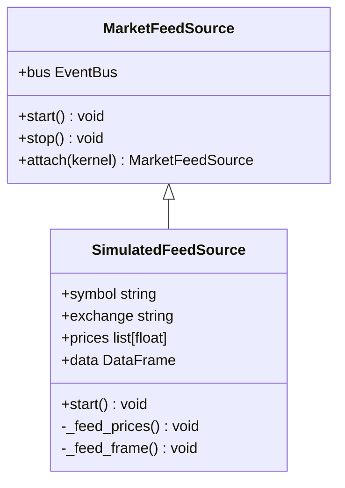

**Diagram sources**
- [market_feed.py:1-105](file://ntrade/sources/market_feed.py#L1-L105)

**Section sources**
- [market_feed.py:1-105](file://ntrade/sources/market_feed.py#L1-L105)

### Historical Data Retrieval (via Instrument.history)
Access historical OHLCV data through the instrument object created by TradingSession. The returned series includes a DataFrame for downstream processing.

Steps:
- Use session.index(symbol) to create an Index instrument
- Call instrument.history(timeframe, days=N, force=True) to fetch data
- Access series.df for pandas operations

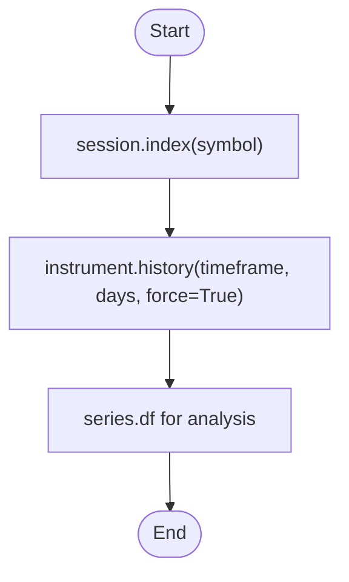

**Diagram sources**
- [trading_session.py:1-306](file://ntrade/kernel/trading_session.py#L1-L306)
- [cash.py:1-50](file://ntrade/domain/instruments/cash.py#L1-L50)

**Section sources**
- [trading_session.py:1-306](file://ntrade/kernel/trading_session.py#L1-L306)
- [cash.py:1-50](file://ntrade/domain/instruments/cash.py#L1-L50)

### Basic Order Placement (Through Strategy Signals)
Orders are placed via the kernel’s execution pipeline when strategies emit signals. In simulation, SimulatedExecution generates deterministic fills with configurable costs and slippage.

Steps:
- Implement or register a Strategy that emits signals on candle closures
- The StrategyEngine routes signals to RiskEngine and then OrderEngine
- OrderEngine submits intents to SimulatedExecution (or BrokerExecution live)
- Fills update PortfolioEngine and account/position state

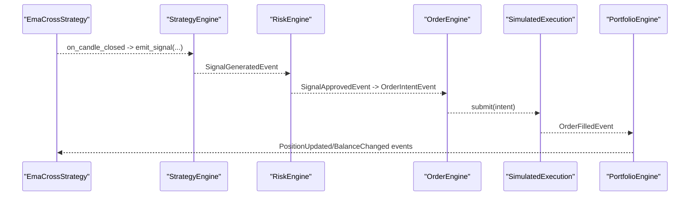

**Diagram sources**
- [strategies.py:1-67](file://ntrade/engines/strategies.py#L1-L67)
- [simulator.py:1-147](file://ntrade/execution/simulator.py#L1-L147)
- [session.py:1-198](file://ntrade/kernel/session.py#L1-L198)

**Section sources**
- [strategies.py:1-67](file://ntrade/engines/strategies.py#L1-L67)
- [simulator.py:1-147](file://ntrade/execution/simulator.py#L1-L147)
- [session.py:1-198](file://ntrade/kernel/session.py#L1-L198)

### Portfolio Management (Positions and Balance)
Track positions and balance updates through the domain models and kernel context.

Key concepts:
- Position tracks symbol, quantity, avg_price, ltp, product, exchange
- Portfolio aggregates positions and computes pnl and market value
- Account holds balance and holdings, supports refresh from broker

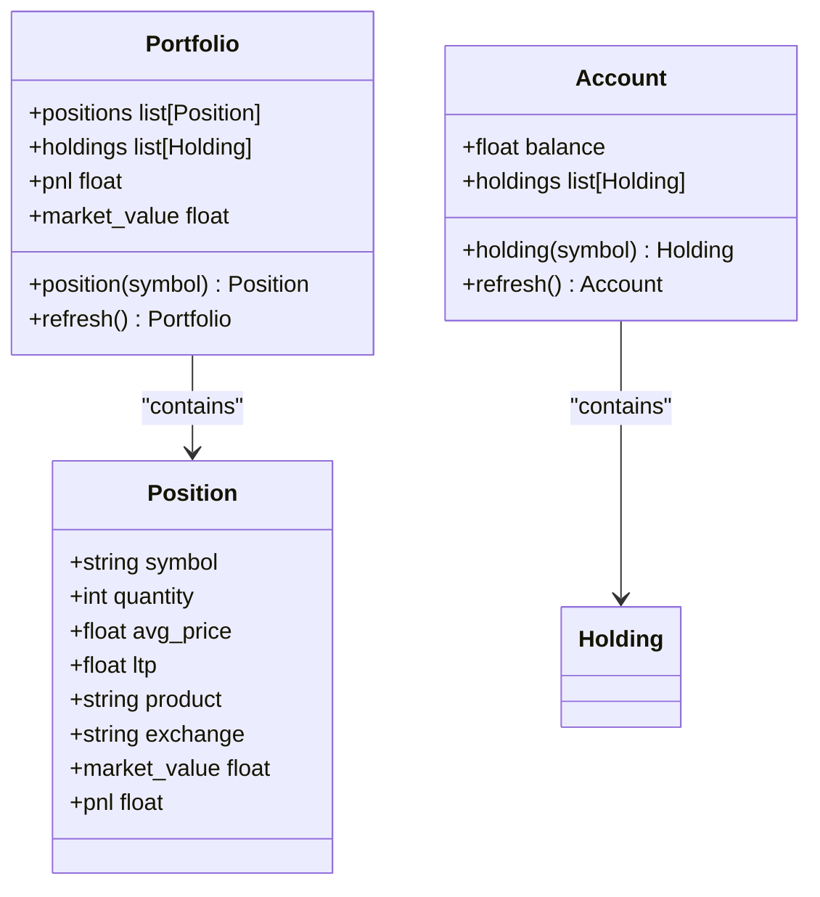

**Diagram sources**
- [portfolio.py:1-173](file://ntrade/domain/portfolio.py#L1-L173)

**Section sources**
- [portfolio.py:1-173](file://ntrade/domain/portfolio.py#L1-L173)

### Connecting to Different Brokers and Paper Trading
- Live broker: TradingSession.connect("dhan") retrieves a broker adapter from the registry and initializes a live session
- Paper trading: TradingSession.paper() seeds a PaperBroker with initial cash for deterministic runs
- Legacy facade: Market(broker="dhan") wraps TradingSession for backward compatibility

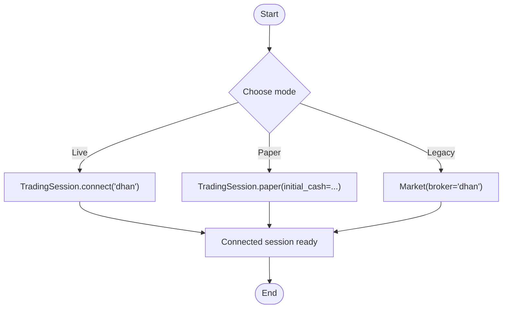

**Diagram sources**
- [trading_session.py:1-306](file://ntrade/kernel/trading_session.py#L1-L306)
- [paper.py:1-216](file://ntrade/brokers/paper.py#L1-L216)
- [facade.py:1-101](file://ntrade/facade.py#L1-L101)

**Section sources**
- [trading_session.py:1-306](file://ntrade/kernel/trading_session.py#L1-L306)
- [paper.py:1-216](file://ntrade/brokers/paper.py#L1-L216)
- [facade.py:1-101](file://ntrade/facade.py#L1-L101)

### Running Simple Backtests
Backtesting uses the same kernel stack with a ReplayClock and deterministic execution. You can replay recorded events or synthesize ticks from OHLCV frames.

Steps:
- Initialize TradingKernel(mode="replay", clock=ReplayClock())
- Register instruments and strategies
- Feed events via SimulatedFeedSource or SyntheticMarketFeedSource
- Analyze fills and portfolio state after stop

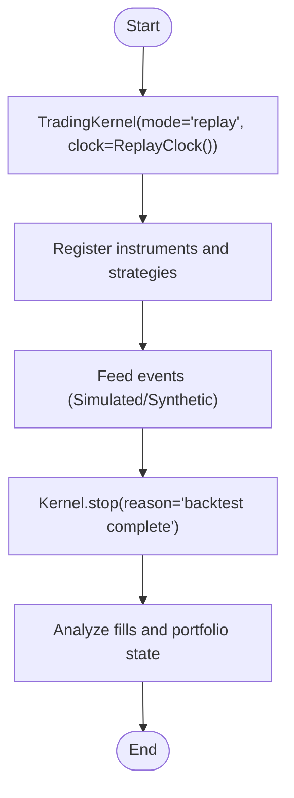

**Diagram sources**
- [session.py:1-198](file://ntrade/kernel/session.py#L1-L198)
- [clock.py:1-55](file://ntrade/kernel/clock.py#L1-L55)
- [market_feed.py:1-105](file://ntrade/sources/market_feed.py#L1-L105)
- [synthetic_feed.py:1-77](file://ntrade/sources/synthetic_feed.py#L1-L77)

**Section sources**
- [session.py:1-198](file://ntrade/kernel/session.py#L1-L198)
- [clock.py:1-55](file://ntrade/kernel/clock.py#L1-L55)
- [market_feed.py:1-105](file://ntrade/sources/market_feed.py#L1-L105)
- [synthetic_feed.py:1-77](file://ntrade/sources/synthetic_feed.py#L1-L77)

## Dependency Analysis
The kernel wires engines and execution targets in a cohesive pipeline. Modes differ only by clock and execution target, preserving zero parity.

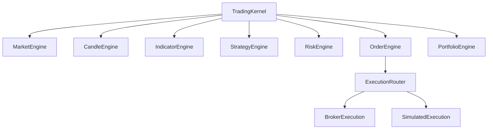

**Diagram sources**
- [session.py:1-198](file://ntrade/kernel/session.py#L1-L198)

**Section sources**
- [session.py:1-198](file://ntrade/kernel/session.py#L1-L198)

## Performance Considerations
- Prefer vectorized pandas operations for historical data processing
- Use ReplayClock for deterministic replay to avoid wall-clock jitter
- Minimize event churn by batching where possible (e.g., per-bar QuoteEvent plus synthesized ticks)
- Avoid unnecessary refresh calls; cache instrument metadata once hydrated
- For live runs, poll orders and sync positions at reasonable intervals to reduce overhead

## Troubleshooting Guide
Common issues and debugging techniques:
- Connection failures: Use live_read_check.py to validate endpoints and credentials
- No fills in backtests: Ensure instruments are registered and indicators have enough warm-up candles
- Degraded responses: Some endpoints may return partial data; check sanity predicates in live_read_check.py
- Error logging for orders: Capture stdout around order placement and log both request and raw reply; many rejections provide no explicit reason
- Event inspection: Print kernel.bus.history to see event flow and counts

Practical tips:
- Wrap order placement blocks in try/except and log sent/received details
- Use paper mode to isolate strategy logic from network variability
- Flush candles before stopping kernels to ensure final bars are processed

**Section sources**
- [live_read_check.py:1-188](file://scripts/live_read_check.py#L1-L188)
- [ema_cross_run.py:1-87](file://scripts/ema_cross_run.py#L1-L87)
- [paper_gate_run.py:1-66](file://scripts/paper_gate_run.py#L1-L66)

## Conclusion
You now have a solid foundation to build and test trading systems with nTrade:
- Use TradingSession for unified broker connections and instrument creation
- Leverage TradingKernel and engines for robust, zero-parity event processing
- Employ SimulatedFeedSource and SyntheticMarketFeedSource for realistic offline testing
- Track portfolio and account state to validate performance and risk
- Follow the provided scripts as templates for live validation and backtesting

## Appendices
- Configuration patterns:
  - Initial cash seeding via TradingSession.paper(initial_cash=...)
  - Timeframe selection for candle aggregation
  - Statutory cost configuration in SimulatedExecution for realistic P&L
- Debugging utilities:
  - Event history inspection via kernel.bus.history
  - Paper gate reports for go-live readiness
  - Live read-only checks for environment health