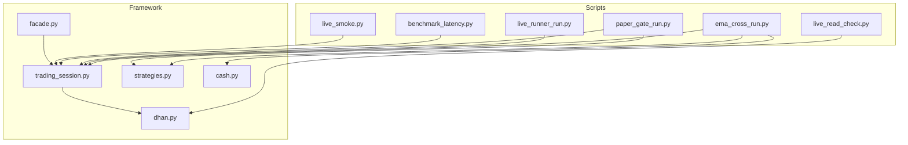
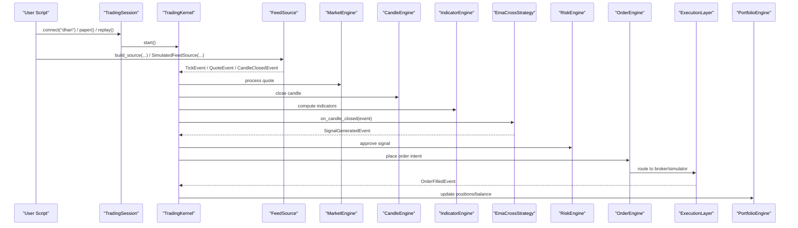
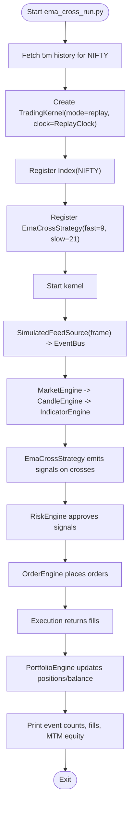
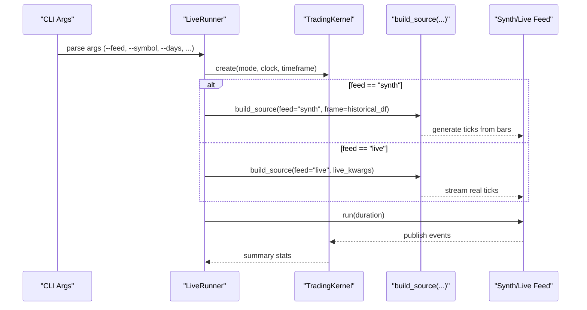
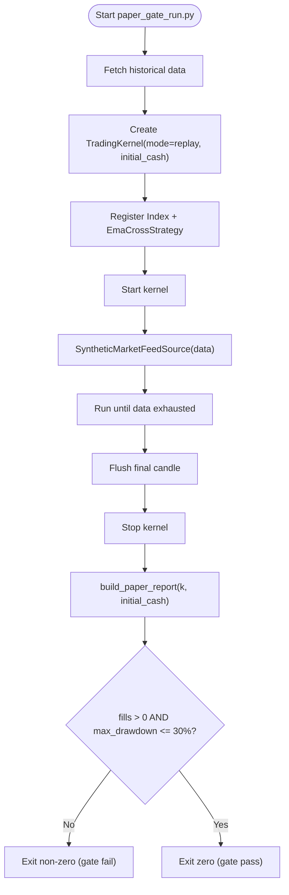
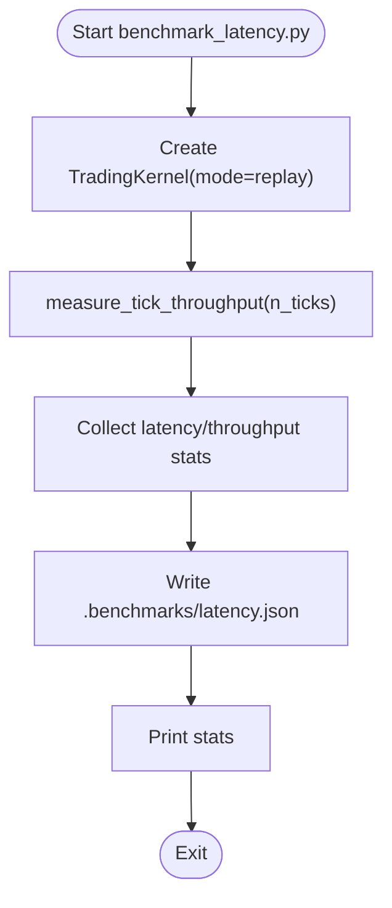
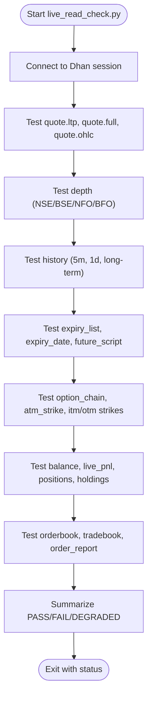
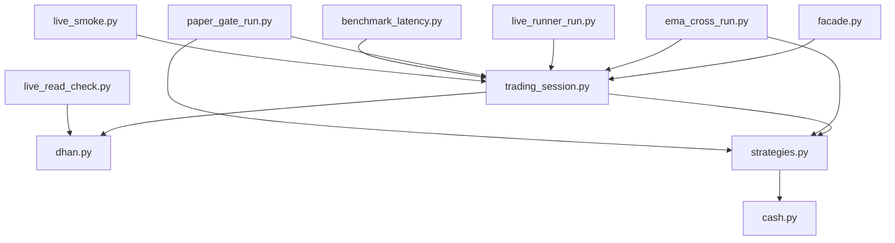

# Examples & Tutorials

<cite>
**Referenced Files in This Document**
- [ema_cross_run.py](file://scripts/ema_cross_run.py)
- [live_runner_run.py](file://scripts/live_runner_run.py)
- [paper_gate_run.py](file://scripts/paper_gate_run.py)
- [benchmark_latency.py](file://scripts/benchmark_latency.py)
- [live_read_check.py](file://scripts/live_read_check.py)
- [live_smoke.py](file://scripts/live_smoke.py)
- [facade.py](file://ntrade/facade.py)
- [trading_session.py](file://ntrade/kernel/trading_session.py)
- [strategies.py](file://ntrade/engines/strategies.py)
- [cash.py](file://ntrade/domain/instruments/cash.py)
- [dhan.py](file://ntrade/brokers/dhan.py)
</cite>

## Table of Contents
1. [Introduction](#introduction)
2. [Project Structure](#project-structure)
3. [Core Components](#core-components)
4. [Architecture Overview](#architecture-overview)
5. [Detailed Component Analysis](#detailed-component-analysis)
6. [Dependency Analysis](#dependency-analysis)
7. [Performance Considerations](#performance-considerations)
8. [Troubleshooting Guide](#troubleshooting-guide)
9. [Conclusion](#conclusion)
10. [Appendices](#appendices)

## Introduction
This document provides comprehensive examples and tutorials for using nTrade across common and advanced scenarios. It includes step-by-step guidance for basic market data access, real-time streaming, order placement, and portfolio management. Advanced topics cover multi-strategy execution, options trading workflows, and risk management implementation. You will also find complete working examples from the scripts directory (EMA crossover strategy, live runner setup, paper trading gate checks), benchmarking and performance testing with latency measurement, integration test patterns with mock brokers and synthetic data, best practices for strategy development, error handling, production deployment, debugging, logging, monitoring, custom broker integration, indicator development, and risk rule implementation. Use cases include algorithmic trading, market making, and statistical arbitrage with detailed explanations.

## Project Structure
The repository is organized into clear layers:
- Scripts: runnable examples and utilities for live, replay, paper, and benchmarking flows
- Core framework: kernel, engines, domain models, brokers, execution, sources, storage, scanners, simulators
- Tests: unit and integration tests demonstrating end-to-end workflows

**Diagram sources**
- [ema_cross_run.py:1-87](file://scripts/ema_cross_run.py#L1-L87)
- [live_runner_run.py:1-69](file://scripts/live_runner_run.py#L1-L69)
- [paper_gate_run.py:1-66](file://scripts/paper_gate_run.py#L1-L66)
- [benchmark_latency.py:1-37](file://scripts/benchmark_latency.py#L1-L37)
- [live_read_check.py:1-188](file://scripts/live_read_check.py#L1-L188)
- [live_smoke.py:1-70](file://scripts/live_smoke.py#L1-L70)
- [facade.py:1-101](file://ntrade/facade.py#L1-L101)
- [trading_session.py:1-306](file://ntrade/kernel/trading_session.py#L1-L306)
- [strategies.py:1-67](file://ntrade/engines/strategies.py#L1-L67)
- [cash.py:1-50](file://ntrade/domain/instruments/cash.py#L1-L50)
- [dhan.py:1-800](file://ntrade/brokers/dhan.py#L1-L800)

**Section sources**
- [ema_cross_run.py:1-87](file://scripts/ema_cross_run.py#L1-L87)
- [live_runner_run.py:1-69](file://scripts/live_runner_run.py#L1-L69)
- [paper_gate_run.py:1-66](file://scripts/paper_gate_run.py#L1-L66)
- [benchmark_latency.py:1-37](file://scripts/benchmark_latency.py#L1-L37)
- [live_read_check.py:1-188](file://scripts/live_read_check.py#L1-L188)
- [live_smoke.py:1-70](file://scripts/live_smoke.py#L1-L70)
- [facade.py:1-101](file://ntrade/facade.py#L1-L101)
- [trading_session.py:1-306](file://ntrade/kernel/trading_session.py#L1-L306)
- [strategies.py:1-67](file://ntrade/engines/strategies.py#L1-L67)
- [cash.py:1-50](file://ntrade/domain/instruments/cash.py#L1-L50)
- [dhan.py:1-800](file://ntrade/brokers/dhan.py#L1-L800)

## Core Components
- TradingSession: Unified entry point combining broker connection, instrument creation, engine kernel, and strategy management. Supports live, paper, and replay modes.
- Market facade: Legacy public facade that delegates to TradingSession for backward compatibility.
- Strategies: Reusable strategies built on canonical events; example EmaCrossStrategy demonstrates momentum-based signals.
- Instruments: Domain types for cash instruments like Equity, Index, ETF, Currency, Commodity, Bond, Crypto, Spot.
- Broker adapters: DhanBroker implements the BrokerAdapter interface for market data, orders, portfolio, and option chains.

Key usage patterns:
- Connect a session and create instruments
- Register strategies and start the kernel
- Stream or replay data through the event pipeline
- Query account/portfolio and manage orders

**Section sources**
- [trading_session.py:1-306](file://ntrade/kernel/trading_session.py#L1-L306)
- [facade.py:1-101](file://ntrade/facade.py#L1-L101)
- [strategies.py:1-67](file://ntrade/engines/strategies.py#L1-L67)
- [cash.py:1-50](file://ntrade/domain/instruments/cash.py#L1-L50)
- [dhan.py:1-800](file://ntrade/brokers/dhan.py#L1-L800)

## Architecture Overview
The nTrade architecture follows an event-driven pipeline:
- Sources publish canonical events (ticks, quotes, candles)
- Engines process events (market, candle, indicator, order, portfolio, risk)
- Strategies react to events and emit signals
- Execution layer routes orders to brokers or simulators
- Portfolio and risk engines update state and enforce constraints

**Diagram sources**
- [trading_session.py:1-306](file://ntrade/kernel/trading_session.py#L1-L306)
- [strategies.py:1-67](file://ntrade/engines/strategies.py#L1-L67)
- [dhan.py:1-800](file://ntrade/brokers/dhan.py#L1-L800)

## Detailed Component Analysis

### EMA Crossover Strategy Tutorial
This tutorial walks through running the EMA 9/21 crossover strategy over historical data via the kernel flow. The script fetches 5m OHLCV data, feeds it through a simulated source, and exercises the full pipeline from market data to fills and portfolio updates.

Steps:
- Connect to a broker session and fetch historical data for the symbol
- Initialize a TradingKernel in replay mode with a ReplayClock
- Register the index instrument and the EmaCrossStrategy
- Start the kernel and feed the historical frame as canonical events
- Flush final partial candle and stop the kernel
- Inspect event counts, fills, position state, balance, and mark-to-market equity

**Diagram sources**
- [ema_cross_run.py:1-87](file://scripts/ema_cross_run.py#L1-L87)
- [strategies.py:1-67](file://ntrade/engines/strategies.py#L1-L67)

**Section sources**
- [ema_cross_run.py:1-87](file://scripts/ema_cross_run.py#L1-L87)
- [strategies.py:1-67](file://ntrade/engines/strategies.py#L1-L67)

### Live Runner Setup Tutorial
Use the LiveRunner harness to run strategies either in synthetic mode (offline rehearsal) or live mode (real Dhan websocket). Synthetic mode fetches historical data and extrapolates to ticks; live mode drives the real feed.

Steps:
- Parse arguments for feed type, symbol, exchange, days, duration, poll/sync intervals, timeframe, and live kwargs
- Choose clock based on mode (LiveClock for live, ReplayClock for synth)
- Create TradingKernel with selected mode and timeframe
- For synth mode, fetch historical frame and register the index instrument
- Build the feed source via build_source with feed type and parameters
- Instantiate LiveRunner and run for specified duration
- Print session summary including ticks published, polls, syncs, fills, and balance

**Diagram sources**
- [live_runner_run.py:1-69](file://scripts/live_runner_run.py#L1-L69)

**Section sources**
- [live_runner_run.py:1-69](file://scripts/live_runner_run.py#L1-L69)

### Paper Trading Gate Checks Tutorial
Run a strategy over real historical data in synth/paper mode and validate before going live. The script prints a validation checklist and exits non-zero if conditions fail (e.g., zero fills or excessive drawdown).

Steps:
- Connect to a session and fetch historical data for the symbol/timeframe
- Initialize a TradingKernel in replay mode with initial cash
- Register the index instrument and EmaCrossStrategy
- Start the kernel and feed synthetic data via SyntheticMarketFeedSource
- Flush final candle and stop the kernel
- Build a paper report and print JSON
- Fail closed: exit non-zero when no fills or max drawdown exceeds threshold

**Diagram sources**
- [paper_gate_run.py:1-66](file://scripts/paper_gate_run.py#L1-L66)

**Section sources**
- [paper_gate_run.py:1-66](file://scripts/paper_gate_run.py#L1-L66)

### Benchmarking and Performance Testing Tutorial
Measure kernel event-pipeline latency and throughput by generating ticks and recording statistics. Results are written to a JSON file for analysis.

Steps:
- Create a TradingKernel in replay mode with a ReplayClock
- Measure tick throughput using measure_tick_throughput with a specified number of ticks
- Write results to .benchmarks/latency.json and print them

**Diagram sources**
- [benchmark_latency.py:1-37](file://scripts/benchmark_latency.py#L1-L37)

**Section sources**
- [benchmark_latency.py:1-37](file://scripts/benchmark_latency.py#L1-L37)

### Live Read-Only Check Tutorial
Verify the Dhan connection and every read/get endpoint exposed by the framework against the real API without placing orders.

Steps:
- Connect to the broker session and check connectivity
- Test quote endpoints (ltp, full quote, OHLC)
- Test depth endpoints for equities and capability flags
- Test historical data retrieval across timeframes and long-term ranges
- Test expiry lists, future scripts, start date, instrument file
- Test option chain endpoints (ATM, greeks, PCR, max pain)
- Test account endpoints (balance, live PnL, positions, holdings, orderbook, tradebook, order report)
- Record PASS/FAIL/DEGRADED status and summarize results

**Diagram sources**
- [live_read_check.py:1-188](file://scripts/live_read_check.py#L1-L188)

**Section sources**
- [live_read_check.py:1-188](file://scripts/live_read_check.py#L1-L188)

### Live Smoke Test Tutorial
Exercise the nTrade framework against the real Dhan API in a read-only smoke test covering quotes, history, indicators, option chains, and account endpoints.

Steps:
- Connect to a live session
- Refresh and inspect quotes for an index
- Fetch and analyze historical data
- Compute indicators and display values
- Retrieve option chain and ATM details
- Check balance and statistics
- Test new endpoints (live PnL, orderbook, tradebook, expiry list, lot size)

**Section sources**
- [live_smoke.py:1-70](file://scripts/live_smoke.py#L1-L70)

### Options Trading Workflow Tutorial
DhanBroker supports fetching option chains, resolving expiries, selecting ATM/ITM/OTM strikes, and retrieving Greeks and IV. The live read check validates these capabilities.

Key points:
- Option chain retrieval with fallback to next expiry on failure
- Resolution of target expiry and actual expiry index used
- Access to ATM strike, calls/puts, PCR, max pain
- Greeks and IV availability for ATM options
- Lot size retrieval for derivative contracts

**Section sources**
- [dhan.py:255-297](file://ntrade/brokers/dhan.py#L255-L297)
- [dhan.py:523-570](file://ntrade/brokers/dhan.py#L523-L570)
- [live_read_check.py:91-122](file://scripts/live_read_check.py#L91-L122)

### Risk Management Implementation Tutorial
Risk rules can be implemented within strategies or via dedicated risk engines. The paper gate script enforces safety caps (e.g., maximum drawdown) and ensures trades occur before going live.

Best practices:
- Validate fills and drawdown thresholds
- Enforce position limits and exposure caps
- Implement kill switches and circuit breakers
- Log all risk decisions and outcomes

**Section sources**
- [paper_gate_run.py:47-61](file://scripts/paper_gate_run.py#L47-L61)

### Custom Broker Integration Tutorial
To integrate a custom broker:
- Implement the BrokerAdapter interface (quote, depth, history, orders, portfolio, option chain)
- Handle authentication, token refresh, and transport retries
- Normalize responses to domain objects (Quote, MarketDepth, CandleSeries, OrderBook, TradeBook)
- Wire the broker into TradingSession via BrokerRegistry

Example reference:
- DhanBroker shows how to map broker-specific APIs to standardized domain types and handle edge cases (timeframes, DAY vs intraday, bracket orders, SEBI compliance)

**Section sources**
- [dhan.py:1-800](file://ntrade/brokers/dhan.py#L1-L800)

### Indicator Development Tutorial
Indicators are computed via the indicator engine and accessed through instrument bundles. Strategies consume precomputed indicators (e.g., EMAs) or fall back to computing them locally.

Recommendations:
- Use compute_bundle to project indicators onto instruments
- Cache indicator results per instrument
- Handle warm-up periods where insufficient data exists

**Section sources**
- [strategies.py:39-67](file://ntrade/engines/strategies.py#L39-L67)

### Multi-Strategy Execution Tutorial
Register multiple strategies with the same kernel to execute concurrently. Each strategy reacts to canonical events and emits signals independently.

Steps:
- Create a TradingKernel and register multiple strategies
- Ensure each strategy filters by symbol if needed
- Monitor event flow and fills per strategy

**Section sources**
- [trading_session.py:230-238](file://ntrade/kernel/trading_session.py#L230-L238)

### Algorithmic Trading, Market Making, Statistical Arbitrage
Common use cases:
- Algorithmic trading: implement signal generation and order routing
- Market making: maintain bid/ask quotes, manage inventory, hedge risks
- Statistical arbitrage: exploit mean-reversion or cointegration signals

Implementation tips:
- Use synthetic feeds for offline rehearsal
- Leverage live feeds for real-time execution
- Apply robust risk controls and monitoring

[No sources needed since this section provides general guidance]

## Dependency Analysis
The core dependencies among key components:

**Diagram sources**
- [facade.py:1-101](file://ntrade/facade.py#L1-L101)
- [trading_session.py:1-306](file://ntrade/kernel/trading_session.py#L1-L306)
- [dhan.py:1-800](file://ntrade/brokers/dhan.py#L1-L800)
- [strategies.py:1-67](file://ntrade/engines/strategies.py#L1-L67)
- [cash.py:1-50](file://ntrade/domain/instruments/cash.py#L1-L50)
- [ema_cross_run.py:1-87](file://scripts/ema_cross_run.py#L1-L87)
- [live_runner_run.py:1-69](file://scripts/live_runner_run.py#L1-L69)
- [paper_gate_run.py:1-66](file://scripts/paper_gate_run.py#L1-L66)
- [benchmark_latency.py:1-37](file://scripts/benchmark_latency.py#L1-L37)
- [live_read_check.py:1-188](file://scripts/live_read_check.py#L1-L188)
- [live_smoke.py:1-70](file://scripts/live_smoke.py#L1-L70)

**Section sources**
- [facade.py:1-101](file://ntrade/facade.py#L1-L101)
- [trading_session.py:1-306](file://ntrade/kernel/trading_session.py#L1-L306)
- [dhan.py:1-800](file://ntrade/brokers/dhan.py#L1-L800)
- [strategies.py:1-67](file://ntrade/engines/strategies.py#L1-L67)
- [cash.py:1-50](file://ntrade/domain/instruments/cash.py#L1-L50)
- [ema_cross_run.py:1-87](file://scripts/ema_cross_run.py#L1-L87)
- [live_runner_run.py:1-69](file://scripts/live_runner_run.py#L1-L69)
- [paper_gate_run.py:1-66](file://scripts/paper_gate_run.py#L1-L66)
- [benchmark_latency.py:1-37](file://scripts/benchmark_latency.py#L1-L37)
- [live_read_check.py:1-188](file://scripts/live_read_check.py#L1-L188)
- [live_smoke.py:1-70](file://scripts/live_smoke.py#L1-L70)

## Performance Considerations
- Use ReplayClock for deterministic replay and parity-critical paths
- Minimize network calls by caching historical data and indicators
- Batch operations where possible (e.g., bulk quotes, chains)
- Tune poll and sync intervals in LiveRunner for optimal throughput
- Monitor latency metrics and adjust pipeline configuration accordingly

[No sources needed since this section provides general guidance]

## Troubleshooting Guide
Common issues and resolutions:
- Authentication failures: ensure credentials are valid and tokens refreshed
- Rate limiting: space out requests and implement retries
- Degenerate data: handle None/zero values gracefully and mark DEGRADED status
- Timeframe mismatches: verify supported timeframes for the broker
- Option chain errors: fallback to next expiry and log actual expiry used

Debugging techniques:
- Print event flow counts to validate pipeline stages
- Inspect fills and portfolio state after runs
- Use paper gate reports to catch unhealthy drawdowns early

Logging strategies:
- Log critical decisions (risk approvals/rejections)
- Capture exceptions with context (instrument, timeframe, timestamp)
- Persist benchmark results for trend analysis

Monitoring approaches:
- Track ticks published, polls, syncs, fills, balance changes
- Alert on failed endpoints and degraded states
- Visualize latency distributions and throughput trends

**Section sources**
- [live_read_check.py:19-39](file://scripts/live_read_check.py#L19-L39)
- [paper_gate_run.py:47-61](file://scripts/paper_gate_run.py#L47-L61)
- [benchmark_latency.py:18-32](file://scripts/benchmark_latency.py#L18-L32)

## Conclusion
This guide provided practical examples and tutorials for using nTrade across a wide range of scenarios. From basic market data access and real-time streaming to advanced options trading and risk management, the scripts and components demonstrate robust, event-driven architecture. By following best practices for strategy development, error handling, and production deployment, you can build reliable algorithmic trading systems. Use the included benchmarks, integration tests, and monitoring techniques to optimize performance and ensure stability.

[No sources needed since this section summarizes without analyzing specific files]

## Appendices
- Best practices for strategy development: keep strategies stateless where possible, filter by symbol, handle warm-up periods
- Error handling: wrap external calls with retries, normalize responses, raise meaningful exceptions
- Production deployment: use environment variables for secrets, containerize runners, set up health checks
- Custom broker integration: adhere to BrokerAdapter contract, handle token lifecycle, normalize domain objects
- Indicator development: leverage compute_bundle, cache results, validate inputs
- Risk rule implementation: enforce caps, log decisions, integrate with kill switches

[No sources needed since this section provides general guidance]