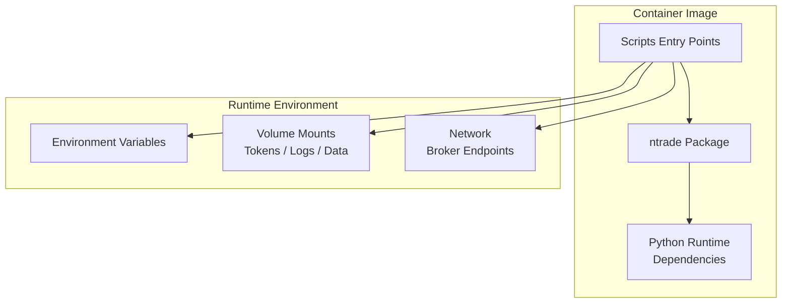
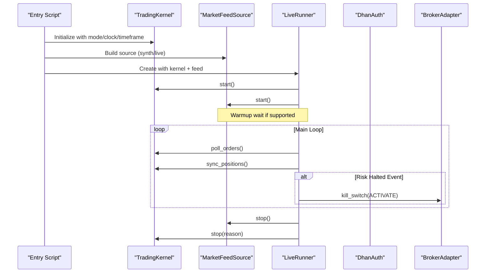
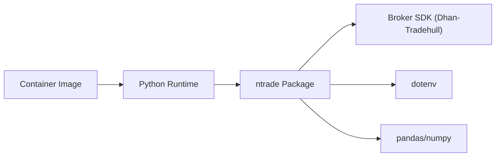

# Containerization & Orchestration

<cite>
**Referenced Files in This Document**
- [pyproject.toml](file://pyproject.toml)
- [ARCHITECTURE.md](file://ARCHITECTURE.md)
- [ntrade/__init__.py](file://ntrade/__init__.py)
- [scripts/live_runner_run.py](file://scripts/live_runner_run.py)
- [ntrade/runner/live_runner.py](file://ntrade/runner/live_runner.py)
- [ntrade/brokers/dhan_auth.py](file://ntrade/brokers/dhan_auth.py)
</cite>

## Table of Contents
1. [Introduction](#introduction)
2. [Project Structure](#project-structure)
3. [Core Components](#core-components)
4. [Architecture Overview](#architecture-overview)
5. [Detailed Component Analysis](#detailed-component-analysis)
6. [Dependency Analysis](#dependency-analysis)
7. [Performance Considerations](#performance-considerations)
8. [Troubleshooting Guide](#troubleshooting-guide)
9. [Conclusion](#conclusion)
10. [Appendices](#appendices)

## Introduction
This document provides a comprehensive containerization and orchestration guide for nTrade applications. It covers Docker image creation with multi-stage builds, environment configuration, volume mounting for persistence, network setup for broker connectivity, Kubernetes and Docker Compose patterns, health checks, resource limits, scaling strategies, load balancing, and service discovery considerations tailored to distributed trading systems. The guidance is grounded in the repository’s runtime entry points, authentication flows, and orchestration harnesses.

## Project Structure
At a high level, nTrade is a Python package with:
- A public API surface exposing domain objects, kernel, engines, execution, and sources.
- Scripts that drive live or synthetic runs via an orchestration harness.
- Broker authentication utilities that read credentials from environment variables and optional shared files.

Key observations:
- The application depends on Python >= 3.10 and specific packages defined in the project metadata.
- Live runs are orchestrated by a script that constructs a kernel and a feed source, then drives a runner loop.
- Authentication reads secrets from environment variables and optionally persists tokens to mounted volumes.

**Section sources**
- [pyproject.toml:1-25](file://pyproject.toml#L1-L25)
- [ntrade/__init__.py:1-105](file://ntrade/__init__.py#L1-L105)
- [scripts/live_runner_run.py:1-69](file://scripts/live_runner_run.py#L1-L69)

## Core Components
- Public API and Kernel: The package exposes core classes and events used by the kernel and runners.
- Live Runner: Orchestrates the event loop, polling, position synchronization, and risk-driven kill switch activation.
- Broker Authentication: Resolves credentials from environment variables and optional shared stores; supports PIN+TOTP fallback and proactive token expiry handling.

Operational implications:
- Containers must provide the correct Python version and install dependencies.
- Secrets must be injected via environment variables at runtime.
- Persistent state (tokens, logs, data) should be mounted as volumes.
- Network access to broker endpoints must be allowed.

**Section sources**
- [ntrade/__init__.py:1-105](file://ntrade/__init__.py#L1-L105)
- [ntrade/runner/live_runner.py:1-196](file://ntrade/runner/live_runner.py#L1-L196)
- [ntrade/brokers/dhan_auth.py:1-173](file://ntrade/brokers/dhan_auth.py#L1-L173)

## Architecture Overview
The runtime architecture centers around a kernel-driven event loop fed by market data sources and executed against either simulated or real brokers. The LiveRunner coordinates lifecycle, polling, and safety mechanisms.

**Diagram sources**
- [scripts/live_runner_run.py:1-69](file://scripts/live_runner_run.py#L1-L69)
- [ntrade/runner/live_runner.py:1-196](file://ntrade/runner/live_runner.py#L1-L196)

## Detailed Component Analysis

### Docker Image Creation (Multi-Stage Builds)
Recommended approach:
- Stage 1 (builder): Install build-time dependencies and compile wheels where applicable.
- Stage 2 (runtime): Minimal Python image, copy only necessary artifacts, set non-root user, configure timezone and locale, expose no ports unless needed, define health check and entrypoint.

Considerations:
- Pin Python base image version compatible with requires-python.
- Use dependency caching layers effectively.
- Exclude test code and development tools from production images.
- Set environment defaults for TZ and PYTHONUNBUFFERED.
- Provide a healthcheck that validates process liveness and broker connectivity readiness.

Security best practices:
- Run as non-root user.
- Minimize installed packages.
- Avoid embedding secrets in images; inject at runtime.
- Use read-only root filesystem where possible.
- Scan images for vulnerabilities.

[No sources needed since this section provides general guidance]

### Environment Variable Configuration
Required and recommended variables:
- DHAN_CLIENT_ID: Client identifier for broker authentication.
- DHAN_ACCESS_TOKEN: Optional JWT access token for direct login.
- DHAN_PIN: Optional PIN for PIN+TOTP fallback.
- DHAN_TOTP_SECRET: Optional TOTP secret for PIN+TOTP fallback.
- DHAN_TOKEN_PATH: Optional path to shared token store file.
- DHAN_COOLDOWN_PATH: Optional path to cooldown control file.
- DHAN_EXPIRY_BUFFER_S: Buffer seconds before token expiry to trigger proactive refresh.
- TZ: Timezone for consistent timestamps.
- Additional app-specific variables can be passed via environment or config files mounted into the container.

Behavioral notes:
- Authentication prioritizes shared store token, then .env access token if not expired, then PIN+TOTP fallback.
- Cooldown prevents rapid TOTP attempts.
- Token persistence uses secure file permissions when writing.

**Section sources**
- [ntrade/brokers/dhan_auth.py:1-173](file://ntrade/brokers/dhan_auth.py#L1-L173)

### Volume Mounting for Data Persistence
Mountable paths:
- Token store directory/file (DHAN_TOKEN_PATH).
- Cooldown control file (DHAN_COOLDOWN_PATH).
- Application logs directory.
- Historical data cache (if used by feeds or backtest/replay components).
- Benchmark results directory (e.g., benchmarks output).

Recommendations:
- Use named volumes or persistent volumes in Kubernetes.
- Ensure proper ownership and permissions for non-root users.
- Back up token and cooldown files securely.

[No sources needed since this section provides general guidance]

### Network Configuration for Broker Connections
Requirements:
- Outbound HTTPS/TCP access to broker endpoints.
- DNS resolution configured appropriately.
- Proxy settings if operating behind corporate proxies.
- Firewall rules allowing required ports.

Operational tips:
- Configure retries and timeouts at the transport layer.
- Monitor connection health and reconnect behavior.
- Use separate networks per environment (dev/staging/prod).

[No sources needed since this section provides general guidance]

### Health Checks and Readiness Probes
Health check strategy:
- Process-level liveness: ensure the main process is alive.
- Readiness probe: validate feed warmup and broker connectivity.
- Startup probe: allow time for initialization and token acquisition.

Implementation suggestions:
- Expose a lightweight HTTP endpoint returning status codes based on internal state.
- Alternatively, use command-based probes that run a small script to verify connectivity.
- Incorporate heartbeat metrics from the runner for observability.

[No sources needed since this section provides general guidance]

### Resource Limits and Scheduling
Guidelines:
- Define CPU and memory requests/limits appropriate for strategy complexity and data throughput.
- Use horizontal pod autoscaling (HPA) based on CPU/memory or custom metrics like tick throughput.
- Limit concurrency to avoid overwhelming broker rate limits.
- Tune poll intervals and sync intervals to balance latency and resource usage.

[No sources needed since this section provides general guidance]

### Kubernetes Orchestration Patterns
Patterns:
- Deployment with replicas for horizontal scaling.
- ConfigMaps for non-secret configuration.
- Secrets for sensitive values (tokens, PIN, TOTP).
- Volumes for persistent storage (tokens, logs, data).
- Services and Ingress for internal/external access if exposing APIs.
- PodDisruptionBudgets for availability during upgrades.
- Liveness/readiness/startup probes for resilience.

Scaling considerations:
- Stateless design enables easy horizontal scaling.
- Shared state (tokens, cooldown) must be externalized to shared storage.
- Use leader election if running stateful logic across replicas.

[No sources needed since this section provides general guidance]

### Docker Compose Orchestration Patterns
Patterns:
- Single-service compose for local development with environment variables and volumes.
- Multi-service compose including Redis/MQ for event bus if needed.
- Networks to isolate services.
- Healthchecks and restart policies.

[No sources needed since this section provides general guidance]

### Service Discovery and Distributed Trading Systems
Patterns:
- Use environment variables or configuration management for broker endpoints.
- For microservices, integrate with service discovery (e.g., Kubernetes DNS).
- Implement retry and circuit breaker patterns for inter-service calls.
- Centralize logging and metrics collection.

[No sources needed since this section provides general guidance]

## Dependency Analysis
The runtime depends on:
- Python runtime and standard library.
- Third-party libraries declared in project metadata.
- Broker SDK (optional but required for live trading).
- Optional dotenv for loading .env files.

**Diagram sources**
- [pyproject.toml:1-25](file://pyproject.toml#L1-L25)

**Section sources**
- [pyproject.toml:1-25](file://pyproject.toml#L1-L25)

## Performance Considerations
- Optimize image layers to reduce cold start times.
- Use efficient serialization for events and payloads.
- Tune polling and synchronization intervals to match market data rates.
- Monitor CPU and memory usage; scale horizontally under load.
- Leverage caching for historical data and instrument metadata.
- Avoid unnecessary I/O in hot paths.

[No sources needed since this section provides general guidance]

## Troubleshooting Guide
Common issues and resolutions:
- Missing DHAN_CLIENT_ID: Ensure the variable is set in the container environment.
- Invalid or expired token: Verify token validity and buffer settings; consider PIN+TOTP fallback.
- TOTP cooldown active: Wait for cooldown period to expire; check cooldown file path.
- Feed warmup failure: Inspect feed readiness and minimum tick thresholds.
- Risk halt triggered: Investigate risk engine conditions and monitor heartbeats.
- Kill switch activation failures: Validate broker capability and network connectivity.

Diagnostic steps:
- Check logs for error messages and warnings.
- Validate environment variables and mounted volumes.
- Test broker connectivity independently.
- Review heartbeat and watchdog metrics.

**Section sources**
- [ntrade/brokers/dhan_auth.py:1-173](file://ntrade/brokers/dhan_auth.py#L1-L173)
- [ntrade/runner/live_runner.py:1-196](file://ntrade/runner/live_runner.py#L1-L196)

## Conclusion
Containerizing nTrade involves building minimal, secure images, injecting secrets at runtime, mounting persistent volumes, and configuring networking for broker connectivity. Orchestration with Kubernetes or Docker Compose enables scalable, resilient deployments. Health checks, resource limits, and scaling strategies ensure operational reliability. Following these guidelines will help you deploy production-ready trading systems that are secure, observable, and scalable.

[No sources needed since this section summarizes without analyzing specific files]

## Appendices

### Production-Ready Dockerfile Template
- Use multi-stage builds.
- Pin Python version matching requires-python.
- Install only runtime dependencies.
- Set non-root user.
- Configure timezone and locale.
- Add healthcheck.
- Define entrypoint and command.

[No sources needed since this section provides general guidance]

### Example Environment Variables
- DHAN_CLIENT_ID
- DHAN_ACCESS_TOKEN
- DHAN_PIN
- DHAN_TOTP_SECRET
- DHAN_TOKEN_PATH
- DHAN_COOLDOWN_PATH
- DHAN_EXPIRY_BUFFER_S
- TZ

[No sources needed since this section provides general guidance]

### Example Volume Mounts
- Token store directory/file
- Cooldown control file
- Logs directory
- Data/cache directories

[No sources needed since this section provides general guidance]

### Example Health Check Commands
- Process liveness: check PID or HTTP endpoint.
- Readiness: validate feed warmup and broker connectivity.
- Startup: allow initialization time.

[No sources needed since this section provides general guidance]