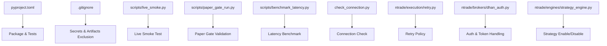
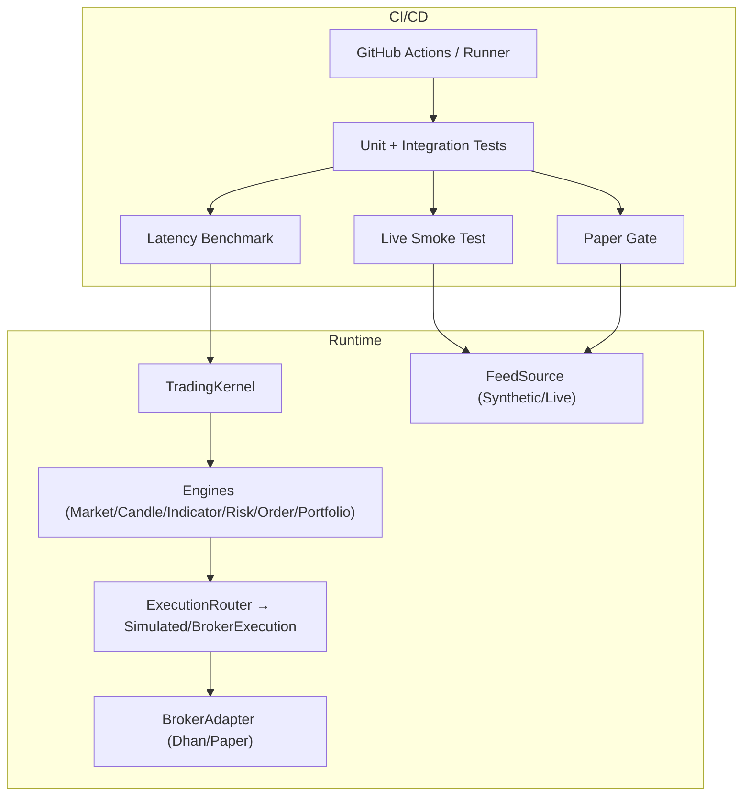
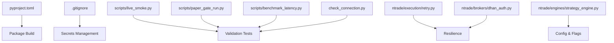

# Deployment Workflows

<cite>
**Referenced Files in This Document**
- [pyproject.toml](file://pyproject.toml)
- [.gitignore](file://.gitignore)
- [ARCHITECTURE.md](file://ARCHITECTURE.md)
- [scripts/live_smoke.py](file://scripts/live_smoke.py)
- [scripts/live_runner_run.py](file://scripts/live_runner_run.py)
- [scripts/paper_gate_run.py](file://scripts/paper_gate_run.py)
- [scripts/benchmark_latency.py](file://scripts/benchmark_latency.py)
- [check_connection.py](file://check_connection.py)
- [ntrade/execution/retry.py](file://ntrade/execution/retry.py)
- [ntrade/brokers/dhan_auth.py](file://ntrade/brokers/dhan_auth.py)
- [ntrade/engines/strategy_engine.py](file://ntrade/engines/strategy_engine.py)
</cite>

## Table of Contents
1. Introduction
2. Project Structure
3. Core Components
4. Architecture Overview
5. Detailed Component Analysis
6. Dependency Analysis
7. Performance Considerations
8. Troubleshooting Guide
9. Conclusion
10. Appendices

## Introduction
This document defines the end-to-end deployment workflow for nTrade applications, focusing on CI/CD pipeline setup, automated testing strategies, and deployment automation using GitHub Actions or similar tools. It covers blue-green deployments, rolling updates, rollback procedures, pre-deployment checks, smoke tests, post-deployment validation, environment-specific configurations, feature flags, gradual rollouts, disaster recovery, backup strategies, and business continuity planning for critical trading systems. The guidance is grounded in the repository’s existing scripts, configuration, and architecture to ensure practicality and traceability.

## Project Structure
The project is a Python package with clear separation between domain logic, broker adapters, kernel orchestration, execution engines, and operational scripts used for testing and validation. Key elements relevant to deployment include:
- Packaging and test configuration via pyproject.toml
- Secrets and artifacts exclusion via .gitignore
- Operational scripts for live smoke testing, paper gating, latency benchmarking, and connection checks
- Resilience utilities (retry policies) and authentication helpers for broker connectivity

**Diagram sources**
- [pyproject.toml:1-25](file://pyproject.toml#L1-L25)
- [.gitignore:1-25](file://.gitignore#L1-L25)
- [scripts/live_smoke.py:1-70](file://scripts/live_smoke.py#L1-L70)
- [scripts/paper_gate_run.py:1-66](file://scripts/paper_gate_run.py#L1-L66)
- [scripts/benchmark_latency.py:1-37](file://scripts/benchmark_latency.py#L1-L37)
- [check_connection.py:1-43](file://check_connection.py#L1-L43)
- [ntrade/execution/retry.py:1-42](file://ntrade/execution/retry.py#L1-L42)
- [ntrade/brokers/dhan_auth.py:42-78](file://ntrade/brokers/dhan_auth.py#L42-L78)
- [ntrade/engines/strategy_engine.py:70-101](file://ntrade/engines/strategy_engine.py#L70-L101)

**Section sources**
- [pyproject.toml:1-25](file://pyproject.toml#L1-L25)
- [.gitignore:1-25](file://.gitignore#L1-L25)

## Core Components
- Packaging and test harness:
  - Python version constraint and dependencies are defined centrally.
  - Pytest configuration points to the tests directory.
- Operational scripts:
  - Live smoke test exercises real broker connectivity and read-only endpoints.
  - Paper gate runs historical data through synthetic feed and validates strategy behavior.
  - Latency benchmark measures kernel throughput and writes results.
  - Connection check validates broker API access without placing orders.
- Resilience and auth:
  - RetryPolicy provides exponential backoff and jitter for flaky calls.
  - Broker auth helper loads environment variables and manages token expiry safely.
- Strategy control:
  - Strategy engine supports enabling/disabling strategies at runtime, useful for feature flags and gradual rollout.

**Section sources**
- [pyproject.toml:1-25](file://pyproject.toml#L1-L25)
- [scripts/live_smoke.py:1-70](file://scripts/live_smoke.py#L1-L70)
- [scripts/paper_gate_run.py:1-66](file://scripts/paper_gate_run.py#L1-L66)
- [scripts/benchmark_latency.py:1-37](file://scripts/benchmark_latency.py#L1-L37)
- [check_connection.py:1-43](file://check_connection.py#L1-L43)
- [ntrade/execution/retry.py:1-42](file://ntrade/execution/retry.py#L1-L42)
- [ntrade/brokers/dhan_auth.py:42-78](file://ntrade/brokers/dhan_auth.py#L42-L78)
- [ntrade/engines/strategy_engine.py:70-101](file://ntrade/engines/strategy_engine.py#L70-L101)

## Architecture Overview
The nTrade framework follows a layered, event-centric architecture that enables zero-parity across live, replay, and backtest modes. For deployment, this means the same code paths can be validated offline before going live, reducing risk during production releases.

**Diagram sources**
- [ARCHITECTURE.md:1-389](file://ARCHITECTURE.md#L1-L389)
- [scripts/live_runner_run.py:1-69](file://scripts/live_runner_run.py#L1-L69)
- [scripts/paper_gate_run.py:1-66](file://scripts/paper_gate_run.py#L1-L66)
- [scripts/benchmark_latency.py:1-37](file://scripts/benchmark_latency.py#L1-L37)

## Detailed Component Analysis

### CI/CD Pipeline Setup (GitHub Actions)
Recommended stages:
- Install dependencies and cache virtualenv
- Run unit and integration tests
- Execute paper gate validation over historical data
- Run live smoke test against sandbox or limited credentials
- Perform latency benchmark and publish metrics
- Build package artifact for deployment

Key inputs:
- Environment variables for secrets (e.g., Dhan credentials) stored securely in repository settings
- Feature flags controlled via environment variables or config files injected at runtime

Outputs:
- Test reports
- Paper gate report JSON
- Latency metrics JSON
- Package artifact (wheel/sdist)

Operational notes:
- Use separate jobs for test, smoke, and deploy stages to isolate failures
- Fail fast on test and paper gate failures; allow smoke to be non-blocking if needed
- Publish artifacts and metrics as job outputs for auditability

[No sources needed since this section provides general guidance]

### Automated Testing Strategies
- Unit tests: Validate core logic, resilience patterns, and broker adapters
- Integration tests: Exercise kernel pipelines, event bus, and execution routing
- Paper gate: Replay historical data through synthetic feed and validate strategy behavior and risk limits
- Live smoke: Connect to broker and verify read-only endpoints (quotes, history, balance, orderbook/tradebook)
- Latency benchmark: Measure tick throughput and record baseline metrics

Validation gates:
- Paper gate must produce trades and respect drawdown thresholds
- Smoke test must pass connectivity and basic data retrieval
- Benchmarks should meet performance thresholds

**Section sources**
- [scripts/paper_gate_run.py:1-66](file://scripts/paper_gate_run.py#L1-L66)
- [scripts/live_smoke.py:1-70](file://scripts/live_smoke.py#L1-L70)
- [scripts/benchmark_latency.py:1-37](file://scripts/benchmark_latency.py#L1-L37)

### Pre-Deployment Checks
- Connection check: Verify broker API connectivity and data retrieval without placing orders
- Auth readiness: Ensure shared token store and JWT expiry handling are correct
- Configuration validation: Confirm environment variables and feature flags are set appropriately

**Section sources**
- [check_connection.py:1-43](file://check_connection.py#L1-L43)
- [ntrade/brokers/dhan_auth.py:42-78](file://ntrade/brokers/dhan_auth.py#L42-L78)

### Smoke Tests
- Live smoke test connects to the broker, fetches quotes, history, indicators, option chain, balance, and additional endpoints
- Validates that the system can interact with the broker’s APIs and process market data correctly

**Section sources**
- [scripts/live_smoke.py:1-70](file://scripts/live_smoke.py#L1-L70)

### Post-Deployment Validation
- Paper gate re-run on recent historical data to confirm strategy behavior under current configuration
- Latency benchmark to ensure performance remains within acceptable bounds
- Health checks on running services (if applicable) and monitoring dashboards

**Section sources**
- [scripts/paper_gate_run.py:1-66](file://scripts/paper_gate_run.py#L1-L66)
- [scripts/benchmark_latency.py:1-37](file://scripts/benchmark_latency.py#L1-L37)

### Blue-Green Deployment Pattern
- Maintain two identical environments (blue and green)
- Route traffic to blue during normal operation
- Deploy new version to green while blue remains active
- Validate green with smoke and paper gate tests
- Switch traffic to green after successful validation
- Keep blue as immediate rollback target

[No sources needed since this section provides general guidance]

### Rolling Updates
- Incrementally update instances or pods with the new version
- Monitor health and error rates during rollout
- Pause or abort if thresholds are exceeded
- Gradually increase traffic to new version while draining old instances

[No sources needed since this section provides general guidance]

### Rollback Procedures
- Immediate switch back to previous stable environment (blue)
- Revert configuration changes and feature flags
- Investigate failure causes and re-validate before retrying

[No sources needed since this section provides general guidance]

### Environment-Specific Configurations
- Use environment variables for secrets and runtime settings
- Separate configs for dev, staging, and production
- Feature flags toggled via environment variables or config files

**Section sources**
- [.gitignore:1-25](file://.gitignore#L1-L25)

### Feature Flags and Gradual Rollout
- Enable/disable strategies at runtime using strategy engine controls
- Gradually enable features by toggling flags per instance or user segment
- Monitor impact and adjust flags based on metrics

**Section sources**
- [ntrade/engines/strategy_engine.py:70-101](file://ntrade/engines/strategy_engine.py#L70-L101)

### Disaster Recovery and Backup Strategies
- EventStore records append-only events for deterministic replay and crash recovery
- Use recorded events to reconstruct state and resume operations
- Regular backups of persistent stores and logs
- Document recovery runbooks and practice drills

**Section sources**
- [ARCHITECTURE.md:1-389](file://ARCHITECTURE.md#L1-L389)

### Business Continuity Planning
- Define SLAs and SLOs for availability and latency
- Implement circuit breakers and risk controls to prevent cascading failures
- Maintain redundant infrastructure and failover mechanisms
- Establish communication plans and escalation procedures

[No sources needed since this section provides general guidance]

## Dependency Analysis
The deployment workflow depends on:
- Python packaging and test configuration
- Operational scripts for validation
- Resilience utilities and authentication helpers
- Strategy engine for runtime control

**Diagram sources**
- [pyproject.toml:1-25](file://pyproject.toml#L1-L25)
- [.gitignore:1-25](file://.gitignore#L1-L25)
- [scripts/live_smoke.py:1-70](file://scripts/live_smoke.py#L1-L70)
- [scripts/paper_gate_run.py:1-66](file://scripts/paper_gate_run.py#L1-L66)
- [scripts/benchmark_latency.py:1-37](file://scripts/benchmark_latency.py#L1-L37)
- [check_connection.py:1-43](file://check_connection.py#L1-L43)
- [ntrade/execution/retry.py:1-42](file://ntrade/execution/retry.py#L1-L42)
- [ntrade/brokers/dhan_auth.py:42-78](file://ntrade/brokers/dhan_auth.py#L42-L78)
- [ntrade/engines/strategy_engine.py:70-101](file://ntrade/engines/strategy_engine.py#L70-L101)

**Section sources**
- [pyproject.toml:1-25](file://pyproject.toml#L1-L25)
- [.gitignore:1-25](file://.gitignore#L1-L25)

## Performance Considerations
- Use latency benchmarks to establish baselines and detect regressions
- Optimize event processing pipelines and reduce overhead in hot paths
- Cache frequently accessed data where appropriate
- Monitor resource utilization and scale horizontally if needed

[No sources needed since this section provides general guidance]

## Troubleshooting Guide
Common issues and resolutions:
- Broker connectivity failures: Verify credentials, network access, and token expiry handling
- Authentication errors: Check shared token store and JWT validity
- Strategy not trading: Review paper gate output and strategy configuration
- Performance degradation: Analyze latency benchmarks and event throughput

**Section sources**
- [check_connection.py:1-43](file://check_connection.py#L1-L43)
- [ntrade/brokers/dhan_auth.py:42-78](file://ntrade/brokers/dhan_auth.py#L42-L78)
- [scripts/paper_gate_run.py:1-66](file://scripts/paper_gate_run.py#L1-L66)
- [scripts/benchmark_latency.py:1-37](file://scripts/benchmark_latency.py#L1-L37)

## Conclusion
This deployment workflow leverages the nTrade framework’s robust architecture and operational scripts to ensure reliable, repeatable, and safe releases. By integrating automated testing, validation, and monitoring into CI/CD, teams can confidently deploy trading systems with minimal risk and quick recovery capabilities.

[No sources needed since this section summarizes without analyzing specific files]

## Appendices

### Example CI/CD Workflow Steps
- Install dependencies and cache virtualenv
- Run unit and integration tests
- Execute paper gate validation
- Run live smoke test
- Perform latency benchmark
- Build and publish package artifact
- Deploy to staging or production with blue-green or rolling updates

[No sources needed since this section provides general guidance]

### Example Pre-Deployment Checklist
- All tests pass
- Paper gate produces expected trades and respects risk limits
- Live smoke test passes connectivity checks
- Latency benchmarks meet thresholds
- Configuration and feature flags are verified

[No sources needed since this section provides general guidance]

### Example Post-Deployment Validation
- Re-run paper gate on recent data
- Monitor latency and error rates
- Validate key metrics and alerts

[No sources needed since this section provides general guidance]