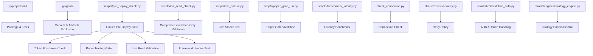
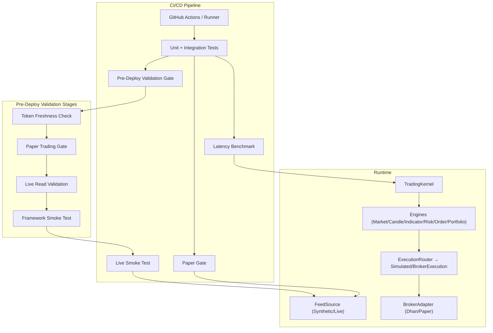
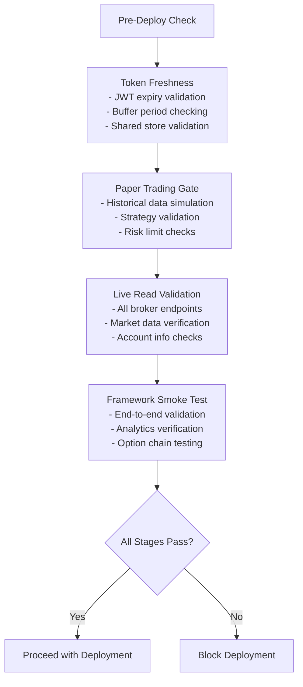
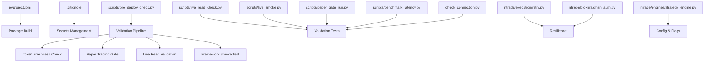

# Deployment Workflows

<cite>
**Referenced Files in This Document**
- [pyproject.toml](file://pyproject.toml)
- [.gitignore](file://.gitignore)
- [ARCHITECTURE.md](file://ARCHITECTURE.md)
- [scripts/pre_deploy_check.py](file://scripts/pre_deploy_check.py)
- [scripts/live_read_check.py](file://scripts/live_read_check.py)
- [scripts/live_smoke.py](file://scripts/live_smoke.py)
- [scripts/paper_gate_run.py](file://scripts/paper_gate_run.py)
- [scripts/benchmark_latency.py](file://scripts/benchmark_latency.py)
- [check_connection.py](file://check_connection.py)
- [ntrade/execution/retry.py](file://ntrade/execution/retry.py)
- [ntrade/brokers/dhan_auth.py](file://ntrade/brokers/dhan_auth.py)
- [ntrade/engines/strategy_engine.py](file://ntrade/engines/strategy_engine.py)
- [tests/test_pre_deploy_check.py](file://tests/test_pre_deploy_check.py)
</cite>

## Update Summary
**Changes Made**
- Added comprehensive pre-deploy validation system with unified deployment readiness checks
- Integrated four-stage validation pipeline: token freshness, paper trading gate, live read validation, and framework smoke testing
- Enhanced CI/CD pipeline with automated pre-deployment validation gates
- Updated deployment procedures with fail-closed security policies for token management
- Added strict mode support for production deployments with enhanced validation

## Table of Contents
1. Introduction
2. Project Structure
3. Core Components
4. Architecture Overview
5. Detailed Component Analysis
6. Dependency Analysis
7. Performance Considerations
8. Troubleshooting Guide
9. Conclusion
10. Appendices

## Introduction
This document defines the end-to-end deployment workflow for nTrade applications, focusing on CI/CD pipeline setup, automated testing strategies, and deployment automation using GitHub Actions or similar tools. It covers blue-green deployments, rolling updates, rollback procedures, pre-deployment checks, smoke tests, post-deployment validation, environment-specific configurations, feature flags, gradual rollouts, disaster recovery, backup strategies, and business continuity planning for critical trading systems. The guidance is grounded in the repository's existing scripts, configuration, and architecture to ensure practicality and traceability.

**Updated** Added comprehensive pre-deploy validation system that provides unified deployment readiness checks across four critical stages before any go-live deployment.

## Project Structure
The project is a Python package with clear separation between domain logic, broker adapters, kernel orchestration, execution engines, and operational scripts used for testing and validation. Key elements relevant to deployment include:
- Packaging and test configuration via pyproject.toml
- Secrets and artifacts exclusion via .gitignore
- Comprehensive pre-deploy validation system with unified deployment readiness checks
- Operational scripts for live smoke testing, paper gating, latency benchmarking, and connection checks
- Resilience utilities (retry policies) and authentication helpers for broker connectivity



**Diagram sources**
- [pyproject.toml:1-25](file://pyproject.toml#L1-L25)
- [.gitignore:1-25](file://.gitignore#L1-L25)
- [scripts/pre_deploy_check.py:1-112](file://scripts/pre_deploy_check.py#L1-L112)
- [scripts/live_read_check.py:1-212](file://scripts/live_read_check.py#L1-L212)
- [scripts/live_smoke.py:1-70](file://scripts/live_smoke.py#L1-L70)
- [scripts/paper_gate_run.py:1-66](file://scripts/paper_gate_run.py#L1-L66)
- [scripts/benchmark_latency.py:1-37](file://scripts/benchmark_latency.py#L1-L37)
- [check_connection.py:1-43](file://check_connection.py#L1-L43)
- [ntrade/execution/retry.py:1-42](file://ntrade/execution/retry.py#L1-L42)
- [ntrade/brokers/dhan_auth.py:1-200](file://ntrade/brokers/dhan_auth.py#L1-L200)
- [ntrade/engines/strategy_engine.py:70-101](file://ntrade/engines/strategy_engine.py#L70-L101)

**Section sources**
- [pyproject.toml:1-25](file://pyproject.toml#L1-L25)
- [.gitignore:1-25](file://.gitignore#L1-L25)

## Core Components
- **Packaging and test harness**:
  - Python version constraint and dependencies are defined centrally.
  - Pytest configuration points to the tests directory.
- **Pre-deploy validation system**:
  - Unified deployment readiness checker that validates all critical components before go-live
  - Four-stage validation pipeline with fail-closed security policies
  - Configurable strict mode for production deployments
- **Operational scripts**:
  - Live smoke test exercises real broker connectivity and read-only endpoints.
  - Paper gate runs historical data through synthetic feed and validates strategy behavior.
  - Latency benchmark measures kernel throughput and writes results.
  - Connection check validates broker API access without placing orders.
  - Comprehensive live read validation covering all broker endpoints.
- **Resilience and auth**:
  - RetryPolicy provides exponential backoff and jitter for flaky calls.
  - Broker auth helper loads environment variables and manages token expiry safely.
- **Strategy control**:
  - Strategy engine supports enabling/disabling strategies at runtime, useful for feature flags and gradual rollout.

**Section sources**
- [pyproject.toml:1-25](file://pyproject.toml#L1-L25)
- [scripts/pre_deploy_check.py:1-112](file://scripts/pre_deploy_check.py#L1-L112)
- [scripts/live_read_check.py:1-212](file://scripts/live_read_check.py#L1-L212)
- [scripts/live_smoke.py:1-70](file://scripts/live_smoke.py#L1-L70)
- [scripts/paper_gate_run.py:1-66](file://scripts/paper_gate_run.py#L1-L66)
- [scripts/benchmark_latency.py:1-37](file://scripts/benchmark_latency.py#L1-L37)
- [check_connection.py:1-43](file://check_connection.py#L1-L43)
- [ntrade/execution/retry.py:1-42](file://ntrade/execution/retry.py#L1-L42)
- [ntrade/brokers/dhan_auth.py:1-200](file://ntrade/brokers/dhan_auth.py#L1-L200)
- [ntrade/engines/strategy_engine.py:70-101](file://ntrade/engines/strategy_engine.py#L70-L101)

## Architecture Overview
The nTrade framework follows a layered, event-centric architecture that enables zero-parity across live, replay, and backtest modes. For deployment, this means the same code paths can be validated offline before going live, reducing risk during production releases. The new pre-deploy validation system ensures comprehensive readiness checks before any deployment proceeds.



**Diagram sources**
- [ARCHITECTURE.md:1-389](file://ARCHITECTURE.md#L1-L389)
- [scripts/pre_deploy_check.py:1-112](file://scripts/pre_deploy_check.py#L1-L112)
- [scripts/live_read_check.py:1-212](file://scripts/live_read_check.py#L1-L212)
- [scripts/live_runner_run.py:1-69](file://scripts/live_runner_run.py#L1-L69)
- [scripts/paper_gate_run.py:1-66](file://scripts/paper_gate_run.py#L1-L66)
- [scripts/benchmark_latency.py:1-37](file://scripts/benchmark_latency.py#L1-L37)

## Detailed Component Analysis

### Pre-Deploy Validation System
**New** The comprehensive pre-deploy validation system provides unified deployment readiness checks across four critical stages:

#### Stage 1: Token Freshness Check
- Validates JWT token expiration status using configurable buffer periods
- Fail-closed policy: near-expiry tokens prevent deployment
- Supports shared token store with automatic refresh detection
- Configurable expiry buffer via `EXPIRY_BUFFER_S` environment variable

#### Stage 2: Paper Trading Gate
- Executes strategy over historical data in synthetic/paper mode
- Validates strategy behavior and risk limits
- Fails if no trades are generated or drawdown exceeds 30% threshold
- Ensures strategy logic works correctly before live deployment

#### Stage 3: Live Read Validation
- Comprehensive read-only validation of all broker endpoints
- Tests market data, option chains, account information, and order books
- Supports strict mode for production deployments (fails on DEGRADED responses)
- Validates connectivity and data integrity across all supported instruments

#### Stage 4: Framework Smoke Test
- End-to-end framework validation against real broker APIs
- Exercises core functionality including quotes, history, indicators, and option chains
- Validates complete data flow from market data to analytics
- Ensures framework integration works correctly with live broker



**Diagram sources**
- [scripts/pre_deploy_check.py:1-112](file://scripts/pre_deploy_check.py#L1-L112)
- [scripts/live_read_check.py:1-212](file://scripts/live_read_check.py#L1-L212)

**Section sources**
- [scripts/pre_deploy_check.py:1-112](file://scripts/pre_deploy_check.py#L1-L112)
- [scripts/live_read_check.py:1-212](file://scripts/live_read_check.py#L1-L212)
- [tests/test_pre_deploy_check.py:1-150](file://tests/test_pre_deploy_check.py#L1-L150)

### CI/CD Pipeline Setup (GitHub Actions)
Recommended stages:
- Install dependencies and cache virtualenv
- Run unit and integration tests
- Execute comprehensive pre-deploy validation gate
- Perform latency benchmark and publish metrics
- Build package artifact for deployment

Key inputs:
- Environment variables for secrets (e.g., Dhan credentials) stored securely in repository settings
- Feature flags controlled via environment variables or config files injected at runtime
- Strict mode flag for production deployments

Outputs:
- Test reports
- Pre-deploy validation report with stage-by-stage results
- Paper gate report JSON
- Latency metrics JSON
- Package artifact (wheel/sdist)

Operational notes:
- Use separate jobs for test, pre-deploy validation, and deploy stages to isolate failures
- Fail fast on test and pre-deploy validation failures
- Publish artifacts and metrics as job outputs for auditability
- Support both staging (non-strict) and production (strict) validation modes

[No sources needed since this section provides general guidance]

### Automated Testing Strategies
- Unit tests: Validate core logic, resilience patterns, and broker adapters
- Integration tests: Exercise kernel pipelines, event bus, and execution routing
- Pre-deploy validation: Comprehensive readiness checks across all deployment stages
- Paper gate: Replay historical data through synthetic feed and validate strategy behavior and risk limits
- Live smoke: Connect to broker and verify read-only endpoints (quotes, history, balance, orderbook/tradebook)
- Latency benchmark: Measure tick throughput and record baseline metrics

Validation gates:
- Pre-deploy validation must pass all four stages
- Paper gate must produce trades and respect drawdown thresholds
- Live smoke test must pass connectivity and basic data retrieval
- Benchmarks should meet performance thresholds

**Section sources**
- [scripts/pre_deploy_check.py:1-112](file://scripts/pre_deploy_check.py#L1-L112)
- [scripts/paper_gate_run.py:1-66](file://scripts/paper_gate_run.py#L1-L66)
- [scripts/live_read_check.py:1-212](file://scripts/live_read_check.py#L1-L212)
- [scripts/live_smoke.py:1-70](file://scripts/live_smoke.py#L1-L70)
- [scripts/benchmark_latency.py:1-37](file://scripts/benchmark_latency.py#L1-L37)

### Pre-Deployment Checks
**Updated** The pre-deployment validation system now provides comprehensive readiness checks:

- **Token freshness validation**: Verify JWT token validity and expiration status with configurable buffer periods
- **Paper trading gate**: Validate strategy behavior over historical data with risk limit enforcement
- **Live read validation**: Comprehensive endpoint testing across all broker capabilities
- **Framework smoke testing**: End-to-end validation of core framework functionality

**Section sources**
- [scripts/pre_deploy_check.py:1-112](file://scripts/pre_deploy_check.py#L1-L112)
- [scripts/live_read_check.py:1-212](file://scripts/live_read_check.py#L1-L212)
- [check_connection.py:1-43](file://check_connection.py#L1-L43)
- [ntrade/brokers/dhan_auth.py:1-200](file://ntrade/brokers/dhan_auth.py#L1-L200)

### Smoke Tests
**Updated** Enhanced smoke testing with comprehensive framework validation:
- Live smoke test connects to the broker, fetches quotes, history, indicators, option chain, balance, and additional endpoints
- Validates that the system can interact with the broker's APIs and process market data correctly
- Includes advanced features like option chain analytics, greeks calculation, and position management
- Provides detailed output for debugging and monitoring

**Section sources**
- [scripts/live_smoke.py:1-70](file://scripts/live_smoke.py#L1-L70)

### Post-Deployment Validation
**Updated** Enhanced post-deployment validation with comprehensive monitoring:
- Re-run paper gate on recent historical data to confirm strategy behavior under current configuration
- Execute live read validation to ensure all endpoints remain functional
- Monitor latency benchmarks to ensure performance remains within acceptable bounds
- Health checks on running services (if applicable) and monitoring dashboards
- Validate key metrics and alerts are functioning correctly

**Section sources**
- [scripts/paper_gate_run.py:1-66](file://scripts/paper_gate_run.py#L1-L66)
- [scripts/live_read_check.py:1-212](file://scripts/live_read_check.py#L1-L212)
- [scripts/benchmark_latency.py:1-37](file://scripts/benchmark_latency.py#L1-L37)

### Blue-Green Deployment Pattern
**Updated** Enhanced blue-green deployment with pre-deploy validation:
- Maintain two identical environments (blue and green)
- Route traffic to blue during normal operation
- Deploy new version to green while blue remains active
- Execute comprehensive pre-deploy validation on green environment
- Validate green with smoke and paper gate tests
- Switch traffic to green after successful validation
- Keep blue as immediate rollback target

[No sources needed since this section provides general guidance]

### Rolling Updates
**Updated** Rolling updates with staged validation:
- Incrementally update instances or pods with the new version
- Execute pre-deploy validation on each instance before marking it ready
- Monitor health and error rates during rollout
- Pause or abort if thresholds are exceeded
- Gradually increase traffic to new version while draining old instances

[No sources needed since this section provides general guidance]

### Rollback Procedures
**Updated** Enhanced rollback procedures with validation:
- Immediate switch back to previous stable environment (blue)
- Revert configuration changes and feature flags
- Investigate failure causes and re-validate before retrying
- Document root cause and update validation criteria if needed

[No sources needed since this section provides general guidance]

### Environment-Specific Configurations
**Updated** Enhanced environment configuration with validation support:
- Use environment variables for secrets and runtime settings
- Separate configs for dev, staging, and production
- Feature flags toggled via environment variables or config files
- Strict mode configuration for production deployments
- Token expiry buffer configuration for different environments

**Section sources**
- [.gitignore:1-25](file://.gitignore#L1-L25)
- [scripts/pre_deploy_check.py:1-112](file://scripts/pre_deploy_check.py#L1-L112)

### Feature Flags and Gradual Rollout
**Updated** Enhanced feature flag support with validation:
- Enable/disable strategies at runtime using strategy engine controls
- Gradually enable features by toggling flags per instance or user segment
- Monitor impact and adjust flags based on metrics
- Validate feature flag combinations during pre-deploy checks

**Section sources**
- [ntrade/engines/strategy_engine.py:70-101](file://ntrade/engines/strategy_engine.py#L70-L101)

### Disaster Recovery and Backup Strategies
**Updated** Enhanced disaster recovery with validation:
- EventStore records append-only events for deterministic replay and crash recovery
- Use recorded events to reconstruct state and resume operations
- Regular backups of persistent stores and logs
- Document recovery runbooks and practice drills
- Validate recovery procedures with pre-deploy validation system

**Section sources**
- [ARCHITECTURE.md:1-389](file://ARCHITECTURE.md#L1-L389)

### Business Continuity Planning
**Updated** Enhanced business continuity with comprehensive validation:
- Define SLAs and SLOs for availability and latency
- Implement circuit breakers and risk controls to prevent cascading failures
- Maintain redundant infrastructure and failover mechanisms
- Establish communication plans and escalation procedures
- Regular validation of all critical components through pre-deploy checks

[No sources needed since this section provides general guidance]

## Dependency Analysis
**Updated** Enhanced dependency analysis with pre-deploy validation:
The deployment workflow depends on:
- Python packaging and test configuration
- Comprehensive pre-deploy validation system with four-stage pipeline
- Operational scripts for validation
- Resilience utilities and authentication helpers
- Strategy engine for runtime control



**Diagram sources**
- [pyproject.toml:1-25](file://pyproject.toml#L1-L25)
- [.gitignore:1-25](file://.gitignore#L1-L25)
- [scripts/pre_deploy_check.py:1-112](file://scripts/pre_deploy_check.py#L1-L112)
- [scripts/live_read_check.py:1-212](file://scripts/live_read_check.py#L1-L212)
- [scripts/live_smoke.py:1-70](file://scripts/live_smoke.py#L1-L70)
- [scripts/paper_gate_run.py:1-66](file://scripts/paper_gate_run.py#L1-L66)
- [scripts/benchmark_latency.py:1-37](file://scripts/benchmark_latency.py#L1-L37)
- [check_connection.py:1-43](file://check_connection.py#L1-L43)
- [ntrade/execution/retry.py:1-42](file://ntrade/execution/retry.py#L1-L42)
- [ntrade/brokers/dhan_auth.py:1-200](file://ntrade/brokers/dhan_auth.py#L1-L200)
- [ntrade/engines/strategy_engine.py:70-101](file://ntrade/engines/strategy_engine.py#L70-L101)

**Section sources**
- [pyproject.toml:1-25](file://pyproject.toml#L1-L25)
- [.gitignore:1-25](file://.gitignore#L1-L25)

## Performance Considerations
**Updated** Enhanced performance considerations with validation:
- Use latency benchmarks to establish baselines and detect regressions
- Optimize event processing pipelines and reduce overhead in hot paths
- Cache frequently accessed data where appropriate
- Monitor resource utilization and scale horizontally if needed
- Validate performance characteristics during pre-deploy checks
- Monitor memory usage and token refresh overhead

[No sources needed since this section provides general guidance]

## Troubleshooting Guide
**Updated** Enhanced troubleshooting guide with pre-deploy validation insights:
Common issues and resolutions:
- **Token-related issues**: Verify credentials, network access, and token expiry handling; check shared token store and JWT validity
- **Paper gate failures**: Review strategy configuration, historical data quality, and risk limit settings
- **Live read validation failures**: Check broker connectivity, endpoint availability, and data format compatibility
- **Framework smoke test failures**: Validate framework installation, dependencies, and broker integration
- **Strategy not trading**: Review paper gate output and strategy configuration
- **Performance degradation**: Analyze latency benchmarks and event throughput

**Section sources**
- [scripts/pre_deploy_check.py:1-112](file://scripts/pre_deploy_check.py#L1-L112)
- [scripts/live_read_check.py:1-212](file://scripts/live_read_check.py#L1-L212)
- [check_connection.py:1-43](file://check_connection.py#L1-L43)
- [ntrade/brokers/dhan_auth.py:1-200](file://ntrade/brokers/dhan_auth.py#L1-L200)
- [scripts/paper_gate_run.py:1-66](file://scripts/paper_gate_run.py#L1-L66)
- [scripts/benchmark_latency.py:1-37](file://scripts/benchmark_latency.py#L1-L37)

## Conclusion
**Updated** Enhanced conclusion with comprehensive validation:
This deployment workflow leverages the nTrade framework's robust architecture and comprehensive pre-deploy validation system to ensure reliable, repeatable, and safe releases. By integrating automated testing, validation, and monitoring into CI/CD with fail-closed security policies, teams can confidently deploy trading systems with minimal risk and quick recovery capabilities. The four-stage validation pipeline ensures that all critical components are verified before any deployment proceeds, significantly reducing the risk of production failures.

[No sources needed since this section summarizes without analyzing specific files]

## Appendices

### Example CI/CD Workflow Steps
**Updated** Enhanced CI/CD workflow with pre-deploy validation:
- Install dependencies and cache virtualenv
- Run unit and integration tests
- Execute comprehensive pre-deploy validation gate
- Execute paper gate validation
- Run live smoke test
- Perform latency benchmark
- Build and publish package artifact
- Deploy to staging or production with blue-green or rolling updates

[No sources needed since this section provides general guidance]

### Example Pre-Deployment Checklist
**Updated** Enhanced pre-deployment checklist with comprehensive validation:
- All tests pass
- Pre-deploy validation passes all four stages (token freshness, paper gate, live read, framework smoke)
- Paper gate produces expected trades and respects risk limits
- Live smoke test passes connectivity checks
- Latency benchmarks meet thresholds
- Configuration and feature flags are verified
- Strict mode validation passes for production deployments

[No sources needed since this section provides general guidance]

### Example Post-Deployment Validation
**Updated** Enhanced post-deployment validation:
- Re-run paper gate on recent data
- Execute live read validation to ensure all endpoints remain functional
- Monitor latency and error rates
- Validate key metrics and alerts
- Confirm framework stability under load

[No sources needed since this section provides general guidance]

### Pre-Deploy Validation Command Examples
**New** Usage examples for the pre-deploy validation system:

```bash
# Basic pre-deploy validation
python scripts/pre_deploy_check.py

# Production deployment with strict mode
python scripts/pre_deploy_check.py --strict

# Custom stage paths for testing
python scripts/pre_deploy_check.py \
    --paper-gate scripts/paper_gate_run.py \
    --live-read scripts/live_read_check.py \
    --live-smoke scripts/live_smoke.py \
    --token-path /path/to/token.json
```

**Section sources**
- [scripts/pre_deploy_check.py:1-112](file://scripts/pre_deploy_check.py#L1-L112)