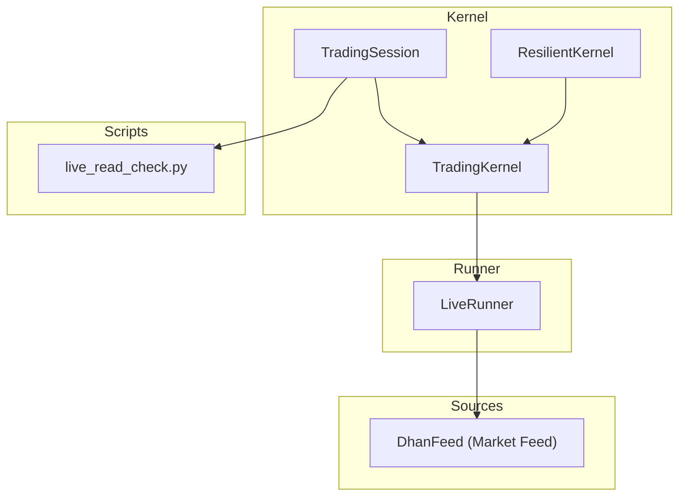
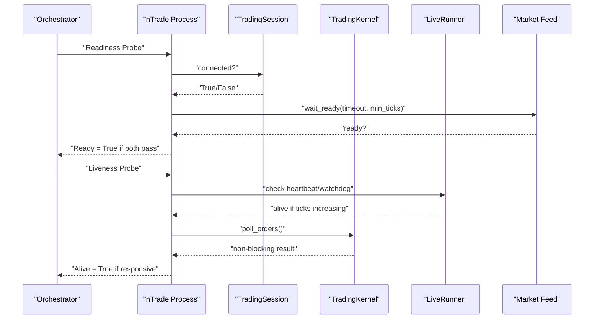
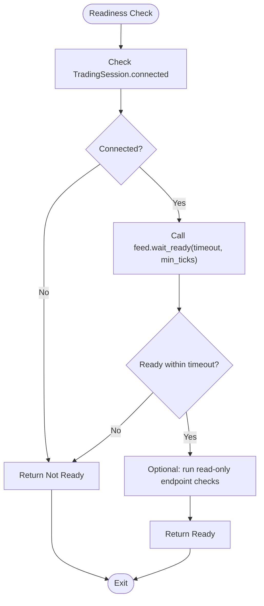
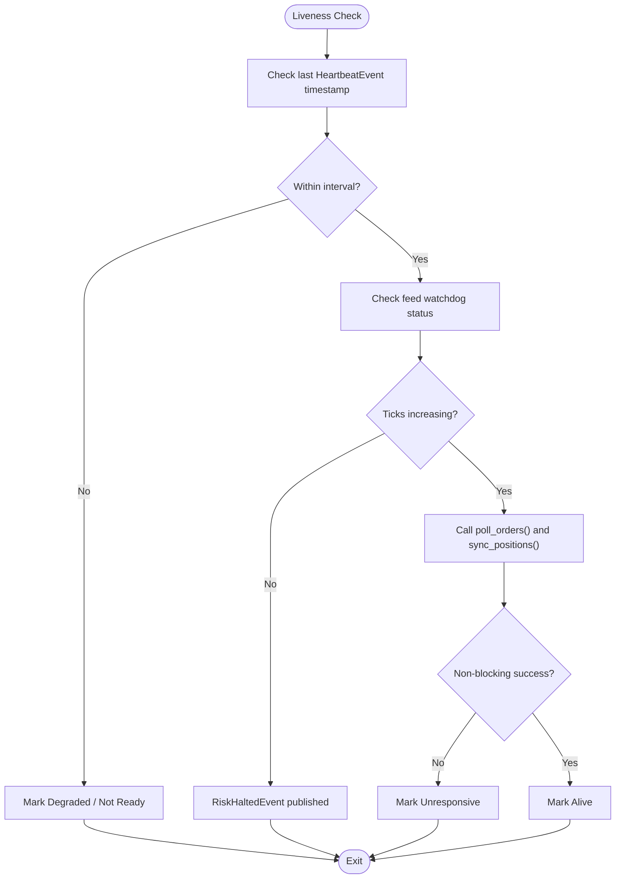
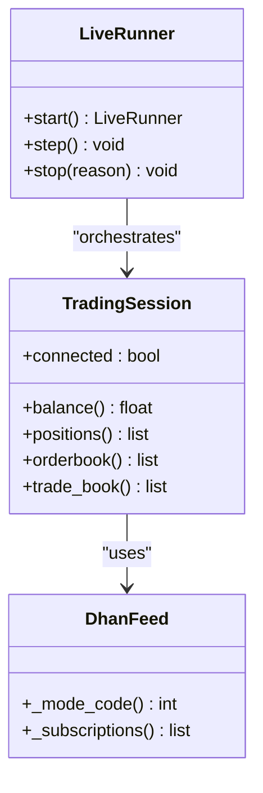
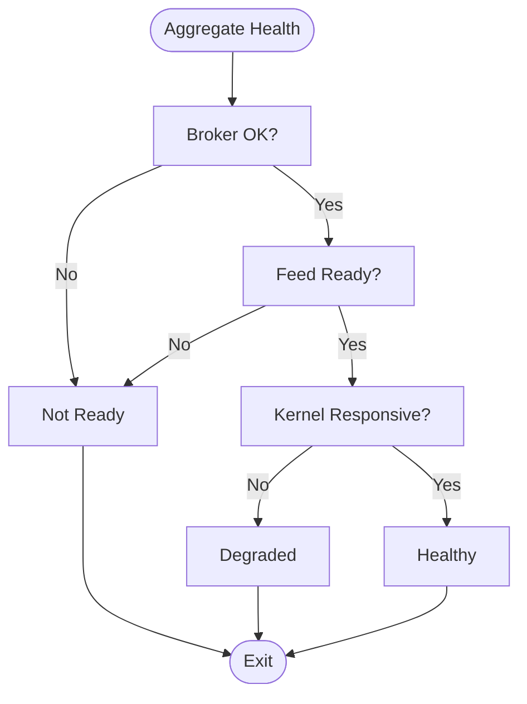
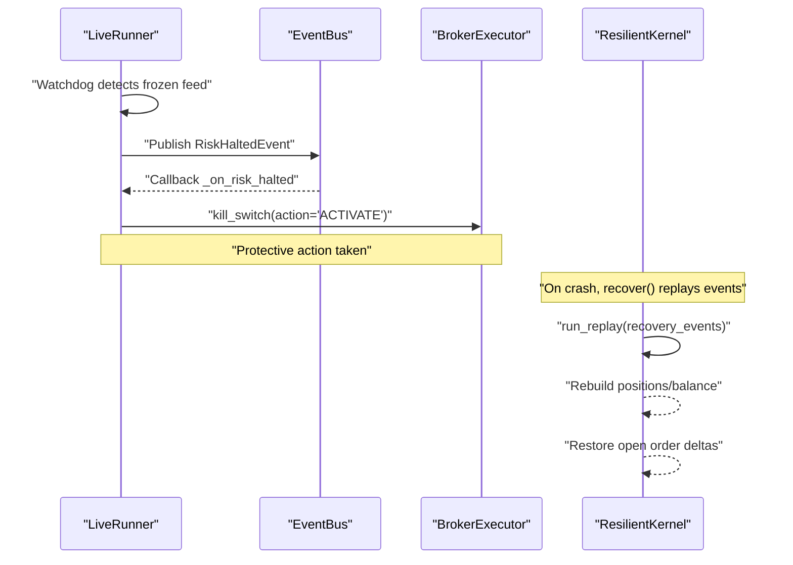
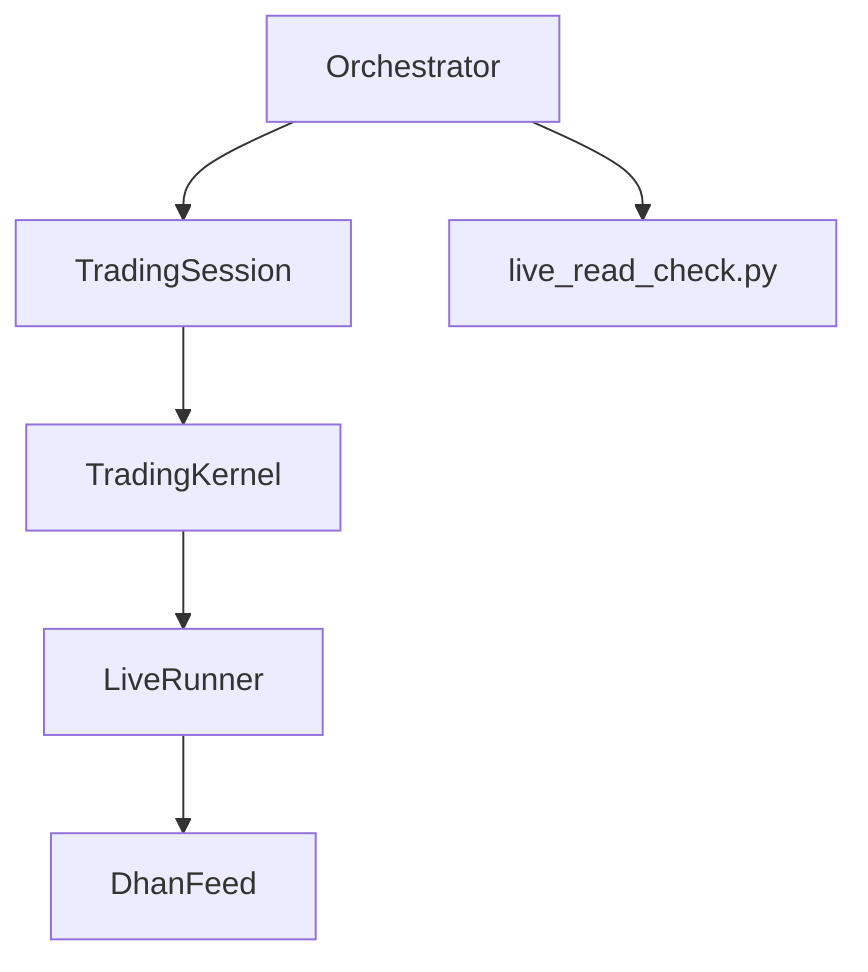

# Health Monitoring

<cite>
**Referenced Files in This Document**
- [trading_session.py](file://ntrade/kernel/trading_session.py)
- [session.py](file://ntrade/kernel/session.py)
- [live_runner.py](file://ntrade/runner/live_runner.py)
- [resilient.py](file://ntrade/kernel/resilient.py)
- [dhan_feed.py](file://ntrade/sources/dhan_feed.py)
- [live_read_check.py](file://scripts/live_read_check.py)
- [pyproject.toml](file://pyproject.toml)
</cite>

## Table of Contents
1. [Introduction](#introduction)
2. [Project Structure](#project-structure)
3. [Core Components](#core-components)
4. [Architecture Overview](#architecture-overview)
5. [Detailed Component Analysis](#detailed-component-analysis)
6. [Dependency Analysis](#dependency-analysis)
7. [Performance Considerations](#performance-considerations)
8. [Troubleshooting Guide](#troubleshooting-guide)
9. [Conclusion](#conclusion)
10. [Appendices](#appendices)

## Introduction
This document provides health monitoring guidance for nTrade production deployments on container orchestration platforms such as Kubernetes and Docker Swarm. It focuses on:
- Readiness probes to ensure the trading session is fully initialized before receiving traffic
- Liveness probes to detect deadlocked or unresponsive processes
- Custom health checks for broker connectivity, market data feed status, and system resource availability
- Aggregation strategies for multiple health checks and failure response patterns
- Graceful degradation and automatic recovery mechanisms

The guidance maps directly to existing components in the codebase that expose readiness signals, liveness indicators, and operational endpoints suitable for orchestrator integration.

## Project Structure
Health-relevant subsystems are primarily located under:
- Kernel and session management for lifecycle and state
- Live runner for orchestration loop, watchdog, and heartbeats
- Market data sources for feed readiness and mode validation
- Resilience layer for crash recovery and state rebuild
- Scripts for live read-only verification of broker endpoints

**Diagram sources**
- [trading_session.py:39-143](file://ntrade/kernel/trading_session.py#L39-L143)
- [session.py:38-104](file://ntrade/kernel/session.py#L38-L104)
- [live_runner.py:21-73](file://ntrade/runner/live_runner.py#L21-L73)
- [dhan_feed.py:128-144](file://ntrade/sources/dhan_feed.py#L128-L144)
- [live_read_check.py:41-56](file://scripts/live_read_check.py#L41-L56)

**Section sources**
- [trading_session.py:39-143](file://ntrade/kernel/trading_session.py#L39-L143)
- [session.py:38-104](file://ntrade/kernel/session.py#L38-L104)
- [live_runner.py:21-73](file://ntrade/runner/live_runner.py#L21-L73)
- [dhan_feed.py:128-144](file://ntrade/sources/dhan_feed.py#L128-L144)
- [live_read_check.py:41-56](file://scripts/live_read_check.py#L41-L56)

## Core Components
- TradingSession: Unified entry point for broker connection, instrument creation, kernel wiring, and strategy management. Exposes a connected property used by readiness checks.
- TradingKernel: Coordinates engine stack, event bus, clock, and execution targets. Provides poll_orders and sync_positions for liveness and reconciliation.
- LiveRunner: Orchestrates the live loop, feed warmup, periodic polling/sync, feed watchdog, and heartbeat emission.
- ResilientKernel: Extends TradingKernel with crash recovery using an EventStore; supports snapshotting recovered state.
- DhanFeed: Market data source with explicit mode validation and subscription handling.
- live_read_check.py: Read-only script exercising broker endpoints to validate connectivity and data quality.

Key readiness and liveness hooks:
- Readiness: TradingSession.connected and feed wait_ready()
- Liveness: LiveRunner heartbeat, feed watchdog, and poll_orders/sync_positions responsiveness

**Section sources**
- [trading_session.py:286-299](file://ntrade/kernel/trading_session.py#L286-L299)
- [session.py:158-169](file://ntrade/kernel/session.py#L158-L169)
- [live_runner.py:55-73](file://ntrade/runner/live_runner.py#L55-L73)
- [live_runner.py:143-174](file://ntrade/runner/live_runner.py#L143-L174)
- [resilient.py:43-78](file://ntrade/kernel/resilient.py#L43-L78)
- [dhan_feed.py:128-144](file://ntrade/sources/dhan_feed.py#L128-L144)
- [live_read_check.py:41-56](file://scripts/live_read_check.py#L41-L56)

## Architecture Overview
The following diagram shows how orchestrators can probe health via application-level endpoints or internal signals derived from the kernel and runner.

**Diagram sources**
- [trading_session.py:286-299](file://ntrade/kernel/trading_session.py#L286-L299)
- [live_runner.py:55-73](file://ntrade/runner/live_runner.py#L55-L73)
- [live_runner.py:143-174](file://ntrade/runner/live_runner.py#L143-L174)
- [session.py:158-169](file://ntrade/kernel/session.py#L158-L169)

## Detailed Component Analysis

### Readiness Probes
- Broker connectivity: Use TradingSession.connected to verify the broker adapter is connected.
- Feed warmup: Use feed.wait_ready(timeout, min_ticks) to ensure the market data feed has started and received minimum ticks.
- Optional deeper checks: Run a subset of read-only endpoints via live_read_check.py to validate broker capabilities and data integrity.

**Diagram sources**
- [trading_session.py:286-299](file://ntrade/kernel/trading_session.py#L286-L299)
- [live_runner.py:55-73](file://ntrade/runner/live_runner.py#L55-L73)
- [live_read_check.py:41-56](file://scripts/live_read_check.py#L41-L56)

**Section sources**
- [trading_session.py:286-299](file://ntrade/kernel/trading_session.py#L286-L299)
- [live_runner.py:55-73](file://ntrade/runner/live_runner.py#L55-L73)
- [live_read_check.py:41-56](file://scripts/live_read_check.py#L41-L56)

### Liveness Probes
- Heartbeat: LiveRunner emits HeartbeatEvent periodically with tick counts and open orders. A simple liveness check can monitor these events or query the process for recent activity.
- Feed watchdog: LiveRunner tracks tick progression; if no new ticks are observed for a threshold, it publishes RiskHaltedEvent to halt risk and trigger protective actions.
- Polling responsiveness: Ensure poll_orders() and sync_positions() respond without blocking indefinitely.

**Diagram sources**
- [live_runner.py:143-174](file://ntrade/runner/live_runner.py#L143-L174)
- [session.py:158-169](file://ntrade/kernel/session.py#L158-L169)

**Section sources**
- [live_runner.py:143-174](file://ntrade/runner/live_runner.py#L143-L174)
- [session.py:158-169](file://ntrade/kernel/session.py#L158-L169)

### Custom Health Checks
- Broker connectivity: Validate session.connected and optionally call balance(), positions(), orderbook(), trade_book() to confirm read paths.
- Market data feed: Verify feed modes and subscriptions; ensure depth/full modes are valid per feed implementation.
- System resources: Monitor memory/CPU usage externally; integrate with orchestrator metrics.

**Diagram sources**
- [trading_session.py:188-216](file://ntrade/kernel/trading_session.py#L188-L216)
- [dhan_feed.py:128-144](file://ntrade/sources/dhan_feed.py#L128-L144)
- [live_runner.py:21-73](file://ntrade/runner/live_runner.py#L21-L73)

**Section sources**
- [trading_session.py:188-216](file://ntrade/kernel/trading_session.py#L188-L216)
- [dhan_feed.py:128-144](file://ntrade/sources/dhan_feed.py#L128-L144)
- [live_runner.py:21-73](file://ntrade/runner/live_runner.py#L21-L73)

### Health Check Aggregation and Failure Response
- Aggregation: Combine broker connectivity, feed readiness, and kernel responsiveness into a single health status. Use PASS/FAIL/DEGRADED categories similar to live_read_check.py.
- Failure response: On readiness failure, do not route traffic. On liveness failure, restart the process. For degraded states, reduce load or switch to paper mode if supported.

[No sources needed since this diagram shows conceptual workflow, not actual code structure]

### Graceful Degradation and Automatic Recovery
- Graceful degradation: If market data feed stalls, rely on LiveRunner’s feed watchdog to publish RiskHaltedEvent, which triggers kill switch activation to prevent unsafe trading.
- Automatic recovery: Use ResilientKernel to replay causal events from EventStore after a crash, rebuilding portfolio and position state deterministically before resuming operations.

**Diagram sources**
- [live_runner.py:181-196](file://ntrade/runner/live_runner.py#L181-L196)
- [resilient.py:43-78](file://ntrade/kernel/resilient.py#L43-L78)
- [resilient.py:105-122](file://ntrade/kernel/resilient.py#L105-L122)

**Section sources**
- [live_runner.py:181-196](file://ntrade/runner/live_runner.py#L181-L196)
- [resilient.py:43-78](file://ntrade/kernel/resilient.py#L43-L78)
- [resilient.py:105-122](file://ntrade/kernel/resilient.py#L105-L122)

## Dependency Analysis
Health-related dependencies center around TradingSession, TradingKernel, LiveRunner, and market feed sources. The orchestrator interacts with the process through readiness/liveness probes and optional HTTP endpoints.

**Diagram sources**
- [trading_session.py:39-143](file://ntrade/kernel/trading_session.py#L39-L143)
- [session.py:38-104](file://ntrade/kernel/session.py#L38-L104)
- [live_runner.py:21-73](file://ntrade/runner/live_runner.py#L21-L73)
- [dhan_feed.py:128-144](file://ntrade/sources/dhan_feed.py#L128-L144)
- [live_read_check.py:41-56](file://scripts/live_read_check.py#L41-L56)

**Section sources**
- [trading_session.py:39-143](file://ntrade/kernel/trading_session.py#L39-L143)
- [session.py:38-104](file://ntrade/kernel/session.py#L38-L104)
- [live_runner.py:21-73](file://ntrade/runner/live_runner.py#L21-L73)
- [dhan_feed.py:128-144](file://ntrade/sources/dhan_feed.py#L128-L144)
- [live_read_check.py:41-56](file://scripts/live_read_check.py#L41-L56)

## Performance Considerations
- Keep readiness checks lightweight: broker connectivity and feed warmup should be fast and idempotent.
- Avoid heavy I/O in liveness probes: use heartbeat timestamps and minimal polling calls.
- Tune feed warmup timeouts and min_ticks based on expected market data cadence.
- Monitor memory and CPU externally; avoid embedding expensive diagnostics in health endpoints.

[No sources needed since this section provides general guidance]

## Troubleshooting Guide
Common issues and mitigations:
- Feed not ready: Increase warmup_timeout or adjust min_ticks; verify feed mode codes and subscriptions.
- Frozen feed: Watchdog will publish RiskHaltedEvent; ensure kill switch activation is wired and effective.
- Crash recovery: Confirm EventStore is recording causal events; use ResilientKernel.snapshot() to inspect recovered state.
- Broker endpoint failures: Use live_read_check.py to isolate failing endpoints and categorize as FAIL or DEGRADED.

**Section sources**
- [live_runner.py:143-174](file://ntrade/runner/live_runner.py#L143-L174)
- [resilient.py:136-147](file://ntrade/kernel/resilient.py#L136-L147)
- [live_read_check.py:19-38](file://scripts/live_read_check.py#L19-L38)

## Conclusion
For production deployments, implement readiness probes using TradingSession.connected and feed.wait_ready(), and liveness probes leveraging LiveRunner heartbeats and feed watchdog signals. Aggregate health checks across broker connectivity, market data feed, and kernel responsiveness. Employ graceful degradation via risk halts and automatic recovery through ResilientKernel to maintain robust operation under adverse conditions.

[No sources needed since this section summarizes without analyzing specific files]

## Appendices
- Environment and dependencies: pyproject.toml lists core dependencies including pandas, numpy, python-dotenv, and Dhan-Tradehull.

**Section sources**
- [pyproject.toml:1-25](file://pyproject.toml#L1-L25)