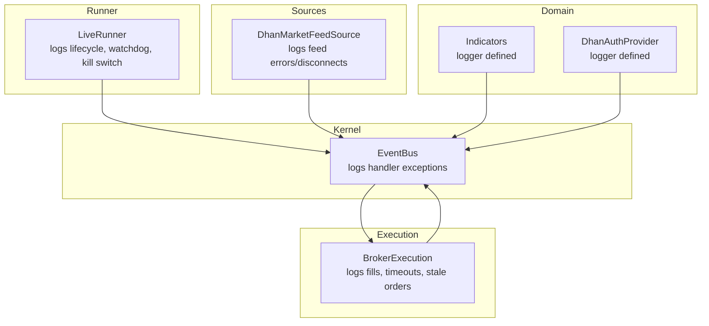
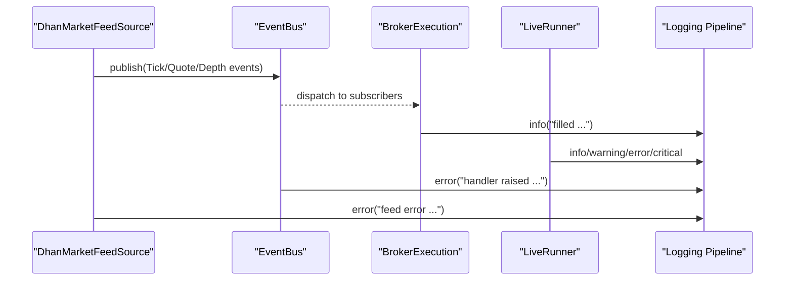
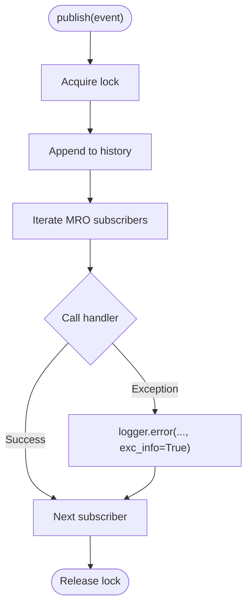
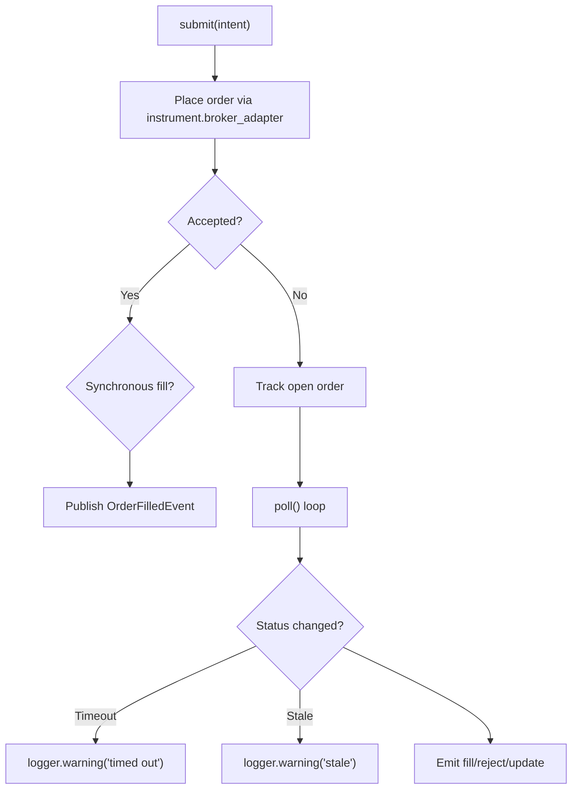
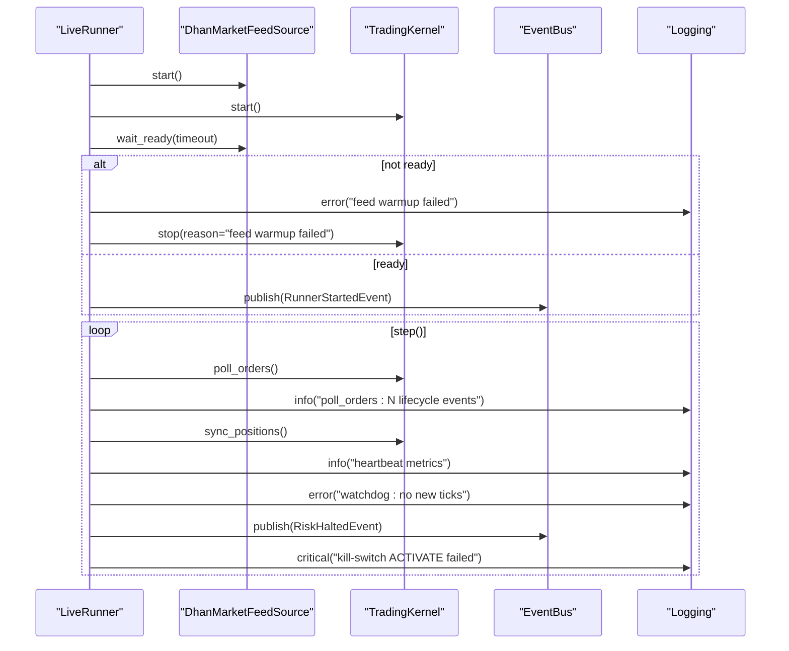
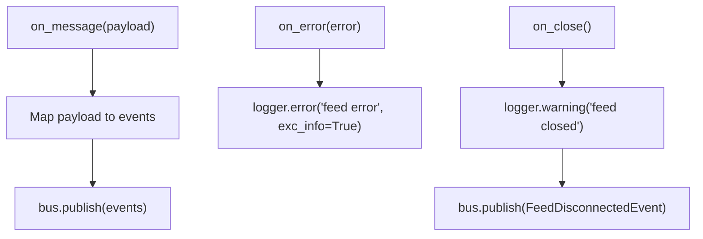
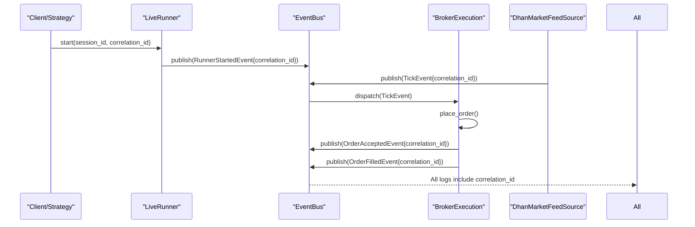
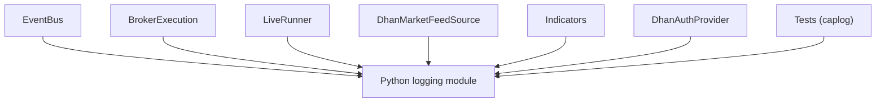

# Logging Strategies

<cite>
**Referenced Files in This Document**
- [event_bus.py](file://ntrade/kernel/event_bus.py)
- [broker_executor.py](file://ntrade/execution/broker_executor.py)
- [live_runner.py](file://ntrade/runner/live_runner.py)
- [dhan_feed.py](file://ntrade/sources/dhan_feed.py)
- [indicators.py](file://ntrade/domain/analytics/indicators.py)
- [dhan_auth_provider.py](file://ntrade/brokers/dhan_auth_provider.py)
- [test_observability.py](file://tests/test_observability.py)
- [test_dhan_feed.py](file://tests/test_dhan_feed.py)
- [test_event_bus_clock.py](file://tests/test_event_bus_clock.py)
- [pyproject.toml](file://pyproject.toml)
</cite>

## Table of Contents
1. Introduction
2. Project Structure
3. Core Components
4. Architecture Overview
5. Detailed Component Analysis
6. Dependency Analysis
7. Performance Considerations
8. Troubleshooting Guide
9. Conclusion
10. Appendices

## Introduction
This document defines the logging strategy for nTrade production deployments. It specifies how structured logging should be implemented using Python’s logging module with JSON formatting to support log aggregation systems. It covers appropriate log levels per component, contextual logging with correlation IDs for tracing across the event-driven architecture, rotation and retention policies, centralized collection setup, sensitive data masking, and compliance considerations for financial data.

The guidance is grounded in the existing codebase where logging is already used by core components (event bus, execution, runner, feeds), and it extends those patterns into a unified, production-ready approach.

## Project Structure
nTrade uses a modular architecture with clear separation between kernel, engines, execution, sources, and storage. Logging is currently implemented via Python’s standard logging.getLogger at the module level in several key components:
- Kernel event bus logs handler exceptions
- Execution layer logs fills and warnings on stale orders
- Live runner logs lifecycle events, feed warmup failures, watchdog alerts, and kill-switch outcomes
- Market feed logs errors and disconnects
- Analytics indicators and broker auth providers define dedicated loggers

**Diagram sources**
- [event_bus.py:20-22](file://ntrade/kernel/event_bus.py#L20-L22)
- [broker_executor.py:36](file://ntrade/execution/broker_executor.py#L36)
- [live_runner.py:18](file://ntrade/runner/live_runner.py#L18)
- [dhan_feed.py:21](file://ntrade/sources/dhan_feed.py#L21)
- [indicators.py:12](file://ntrade/domain/analytics/indicators.py#L12)
- [dhan_auth_provider.py:25](file://ntrade/brokers/dhan_auth_provider.py#L25)

**Section sources**
- [event_bus.py:20-22](file://ntrade/kernel/event_bus.py#L20-L22)
- [broker_executor.py:36](file://ntrade/execution/broker_executor.py#L36)
- [live_runner.py:18](file://ntrade/runner/live_runner.py#L18)
- [dhan_feed.py:21](file://ntrade/sources/dhan_feed.py#L21)
- [indicators.py:12](file://ntrade/domain/analytics/indicators.py#L12)
- [dhan_auth_provider.py:25](file://ntrade/brokers/dhan_auth_provider.py#L25)

## Core Components
The following components are central to logging behavior and must be considered when designing the unified logging strategy:

- Event Bus
  - Logs handler exceptions during event dispatch with full stack traces.
  - Uses a dedicated logger name “ntrade.bus”.

- Broker Execution
  - Logs fill events at INFO level and warnings for stale or timed-out orders.
  - Uses logger name “ntrade.execution”.

- Live Runner
  - Logs lifecycle events (start/stop), feed warmup failures, heartbeat metrics, watchdog alerts, and critical kill-switch failures.
  - Uses logger name “ntrade.runner”.

- Dhan Market Feed Source
  - Logs feed errors and close events; publishes disconnect events to the bus.
  - Uses logger name “ntrade.feed.dhan”.

- Indicators and Auth Provider
  - Define dedicated loggers for analytics and authentication flows.

These components demonstrate consistent use of module-level loggers and structured messages. The production strategy will extend this pattern with JSON formatting, correlation IDs, rotation, and centralized collection.

**Section sources**
- [event_bus.py:60-66](file://ntrade/kernel/event_bus.py#L60-L66)
- [broker_executor.py:284-285](file://ntrade/execution/broker_executor.py#L284-L285)
- [broker_executor.py:136-140](file://ntrade/execution/broker_executor.py#L136-L140)
- [broker_executor.py:147-153](file://ntrade/execution/broker_executor.py#L147-L153)
- [live_runner.py:65-70](file://ntrade/runner/live_runner.py#L65-L70)
- [live_runner.py:165-173](file://ntrade/runner/live_runner.py#L165-L173)
- [live_runner.py:191-195](file://ntrade/runner/live_runner.py#L191-L195)
- [dhan_feed.py:216-224](file://ntrade/sources/dhan_feed.py#L216-L224)
- [indicators.py:12](file://ntrade/domain/analytics/indicators.py#L12)
- [dhan_auth_provider.py:25](file://ntrade/brokers/dhan_auth_provider.py#L25)

## Architecture Overview
The logging architecture aligns with the event-driven design:
- Each subsystem owns its logger and emits structured records.
- A centralized configuration applies JSON formatting and routing to file handlers with rotation.
- Correlation IDs propagate through events and context to enable cross-component tracing.
- Aggregation pipelines collect JSON logs from all components for analysis and alerting.

**Diagram sources**
- [dhan_feed.py:206-213](file://ntrade/sources/dhan_feed.py#L206-L213)
- [event_bus.py:47-66](file://ntrade/kernel/event_bus.py#L47-L66)
- [broker_executor.py:284-285](file://ntrade/execution/broker_executor.py#L284-L285)
- [live_runner.py:65-70](file://ntrade/runner/live_runner.py#L65-L70)

## Detailed Component Analysis

### Event Bus Logging
- Purpose: Capture handler exceptions without crashing the bus; ensure observability of subscriber failures.
- Level: ERROR with exception details.
- Logger: “ntrade.bus”.
- Recommendation: Add correlation_id and session_id fields to every log record emitted by the bus to tie events together.

**Diagram sources**
- [event_bus.py:47-66](file://ntrade/kernel/event_bus.py#L47-L66)

**Section sources**
- [event_bus.py:47-66](file://ntrade/kernel/event_bus.py#L47-L66)

### Broker Execution Logging
- Purpose: Record fills, order state transitions, timeouts, and stale order evictions.
- Levels:
  - INFO for successful fills
  - WARNING for stale orders and timeouts
- Logger: “ntrade.execution”
- Recommendation: Include correlation_id, order_id, symbol, exchange, side, quantity, price, and strategy in structured fields. Avoid printing raw secrets; mask tokens and credentials if present.

**Diagram sources**
- [broker_executor.py:70-107](file://ntrade/execution/broker_executor.py#L70-L107)
- [broker_executor.py:136-140](file://ntrade/execution/broker_executor.py#L136-L140)
- [broker_executor.py:147-153](file://ntrade/execution/broker_executor.py#L147-L153)
- [broker_executor.py:284-285](file://ntrade/execution/broker_executor.py#L284-L285)

**Section sources**
- [broker_executor.py:136-140](file://ntrade/execution/broker_executor.py#L136-L140)
- [broker_executor.py:147-153](file://ntrade/execution/broker_executor.py#L147-L153)
- [broker_executor.py:284-285](file://ntrade/execution/broker_executor.py#L284-L285)

### Live Runner Logging
- Purpose: Orchestration lifecycle, feed readiness, watchdog monitoring, risk halt handling, and kill-switch activation.
- Levels:
  - INFO for routine operations (poll results, fills)
  - ERROR for feed warmup failure and watchdog alerts
  - CRITICAL for kill-switch activation failures
- Logger: “ntrade.runner”
- Recommendation: Include correlation_id, session_id, and timestamps. For heartbeats, include tick counts and open order counts.

**Diagram sources**
- [live_runner.py:55-73](file://ntrade/runner/live_runner.py#L55-L73)
- [live_runner.py:83-88](file://ntrade/runner/live_runner.py#L83-L88)
- [live_runner.py:165-173](file://ntrade/runner/live_runner.py#L165-L173)
- [live_runner.py:191-195](file://ntrade/runner/live_runner.py#L191-L195)

**Section sources**
- [live_runner.py:65-70](file://ntrade/runner/live_runner.py#L65-L70)
- [live_runner.py:83-88](file://ntrade/runner/live_runner.py#L83-L88)
- [live_runner.py:165-173](file://ntrade/runner/live_runner.py#L165-L173)
- [live_runner.py:191-195](file://ntrade/runner/live_runner.py#L191-L195)

### Dhan Market Feed Logging
- Purpose: Report feed connectivity issues and message processing errors.
- Levels:
  - ERROR for feed errors
  - WARNING for feed close
- Logger: “ntrade.feed.dhan”
- Recommendation: Include correlation_id, session_id, and reason codes. Publish FeedDisconnectedEvent to the bus for downstream reaction.

**Diagram sources**
- [dhan_feed.py:206-224](file://ntrade/sources/dhan_feed.py#L206-L224)

**Section sources**
- [dhan_feed.py:216-224](file://ntrade/sources/dhan_feed.py#L216-L224)

### Contextual Logging and Correlation IDs
- Use a correlation ID that propagates across event boundaries:
  - Generate a unique correlation_id per request/session (e.g., UUID).
  - Attach it to events and context metadata so each log record includes correlation_id, session_id, timestamp, and component name.
- In tests, caplog can target specific loggers to assert behavior:
  - Example usage targets “ntrade.execution”, “ntrade.feed.dhan”, and “ntrade.bus”.

[No sources needed since this diagram shows conceptual workflow, not actual code structure]

**Section sources**
- [test_observability.py:58](file://tests/test_observability.py#L58)
- [test_dhan_feed.py:8](file://tests/test_dhan_feed.py#L8)
- [test_event_bus_clock.py:115](file://tests/test_event_bus_clock.py#L115)

## Dependency Analysis
Current logging dependencies rely on Python’s standard logging module. No external logging libraries are declared in project dependencies. Tests use pytest’s caplog to capture logs from specific loggers.

**Diagram sources**
- [pyproject.toml:10-15](file://pyproject.toml#L10-L15)
- [event_bus.py:20-22](file://ntrade/kernel/event_bus.py#L20-L22)
- [broker_executor.py:36](file://ntrade/execution/broker_executor.py#L36)
- [live_runner.py:18](file://ntrade/runner/live_runner.py#L18)
- [dhan_feed.py:21](file://ntrade/sources/dhan_feed.py#L21)
- [indicators.py:12](file://ntrade/domain/analytics/indicators.py#L12)
- [dhan_auth_provider.py:25](file://ntrade/brokers/dhan_auth_provider.py#L25)

**Section sources**
- [pyproject.toml:10-15](file://pyproject.toml#L10-L15)
- [test_observability.py:58](file://tests/test_observability.py#L58)
- [test_dhan_feed.py:8](file://tests/test_dhan_feed.py#L8)
- [test_event_bus_clock.py:115](file://tests/test_event_bus_clock.py#L115)

## Performance Considerations
- Keep log messages concise and structured; avoid heavy object serialization in hot paths.
- Use INFO for normal operational events (fills, polls), WARNING for recoverable issues (timeouts, stale orders), ERROR for failures (handler exceptions, feed errors), and CRITICAL for severe conditions (kill-switch failures).
- Avoid excessive DEBUG logging in production; reserve DEBUG for development environments.
- Ensure log formatting is efficient (JSON lines) and handlers are configured for asynchronous writes if necessary.

[No sources needed since this section provides general guidance]

## Troubleshooting Guide
Common issues and their logging signals:
- Handler exceptions in event bus: captured with ERROR and stack traces.
- Stale orders: WARNING logged after repeated poll failures; order evicted from tracking.
- Timed-out orders: WARNING logged when PENDING exceeds threshold.
- Feed warmup failure: ERROR logged; runner stops kernel and publishes stopped event.
- Feed disconnect: WARNING logged; FeedDisconnectedEvent published.
- Kill-switch failure: CRITICAL logged indicating potential continued order acceptance.

Recommended actions:
- Inspect ERROR logs from “ntrade.bus” to identify failing subscribers.
- Review WARNING logs from “ntrade.execution” for order lifecycle anomalies.
- Check ERROR logs from “ntrade.runner” for feed readiness and watchdog alerts.
- Investigate WARNING/ERROR logs from “ntrade.feed.dhan” for connectivity issues.

**Section sources**
- [event_bus.py:60-66](file://ntrade/kernel/event_bus.py#L60-L66)
- [broker_executor.py:136-140](file://ntrade/execution/broker_executor.py#L136-L140)
- [broker_executor.py:147-153](file://ntrade/execution/broker_executor.py#L147-L153)
- [live_runner.py:65-70](file://ntrade/runner/live_runner.py#L65-L70)
- [live_runner.py:165-173](file://ntrade/runner/live_runner.py#L165-L173)
- [dhan_feed.py:216-224](file://ntrade/sources/dhan_feed.py#L216-L224)
- [live_runner.py:191-195](file://ntrade/runner/live_runner.py#L191-L195)

## Conclusion
nTrade’s logging foundation is solid, with clear logger names and appropriate levels across core components. To achieve production-grade observability:
- Centralize configuration with JSON formatting and rotation.
- Propagate correlation IDs across events and context.
- Enforce sensitive data masking and compliance rules.
- Collect logs centrally for aggregation, alerting, and auditing.

[No sources needed since this section summarizes without analyzing specific files]

## Appendices

### Structured Logging Configuration (Production)
- Configure root or named loggers with JSON formatter.
- Add file handlers with rotation (size-based and/or time-based).
- Set retention policies aligned with compliance requirements.
- Route logs to centralized collectors (e.g., syslog, cloud logging services).

[No sources needed since this section provides general guidance]

### Sensitive Data Masking and Compliance
- Mask tokens, passwords, API keys, and personal identifiers before logging.
- Redact order payloads containing sensitive fields.
- Ensure audit trails meet regulatory requirements for financial data.
- Apply field-level filtering in log formatters.

[No sources needed since this section provides general guidance]