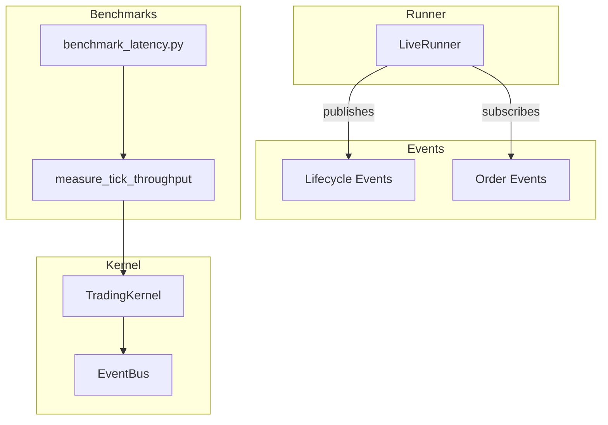
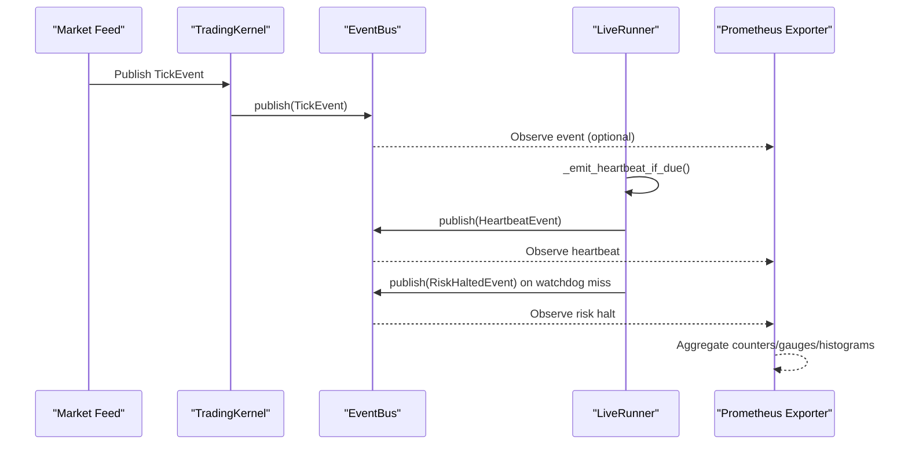
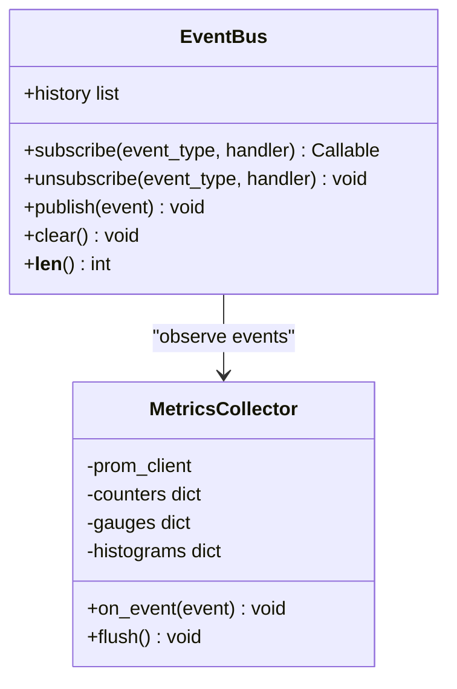
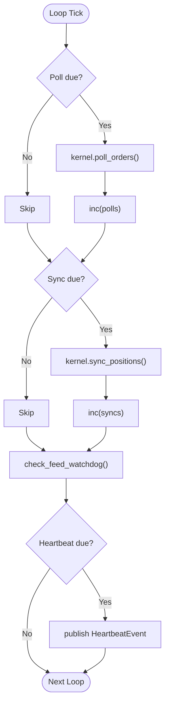
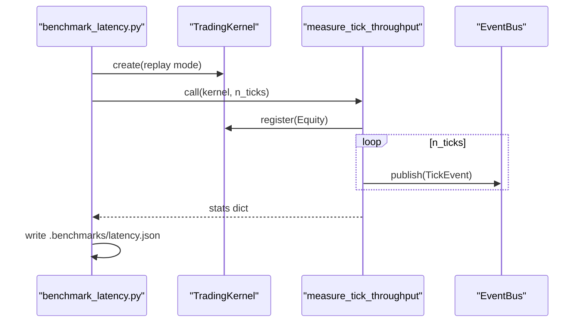
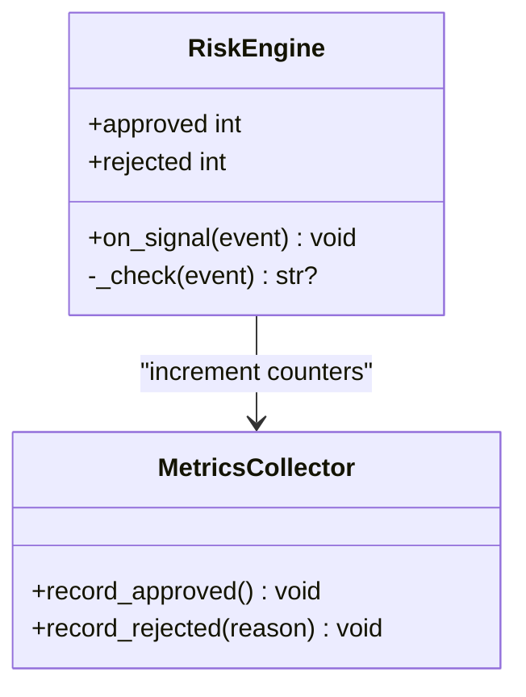
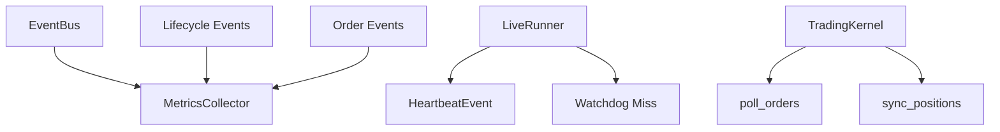

# Metrics Collection

<cite>
**Referenced Files in This Document**
- [event_bus.py](file://ntrade/kernel/event_bus.py)
- [session.py](file://ntrade/kernel/session.py)
- [live_runner.py](file://ntrade/runner/live_runner.py)
- [lifecycle.py](file://ntrade/events/lifecycle.py)
- [order.py](file://ntrade/events/order.py)
- [bench.py](file://ntrade/runner/bench.py)
- [benchmark_latency.py](file://scripts/benchmark_latency.py)
- [test_benchmark.py](file://tests/test_benchmark.py)
- [risk_engine.py](file://ntrade/engines/risk_engine.py)
</cite>

## Table of Contents
1. [Introduction](#introduction)
2. [Project Structure](#project-structure)
3. [Core Components](#core-components)
4. [Architecture Overview](#architecture-overview)
5. [Detailed Component Analysis](#detailed-component-analysis)
6. [Dependency Analysis](#dependency-analysis)
7. [Performance Considerations](#performance-considerations)
8. [Troubleshooting Guide](#troubleshooting-guide)
9. [Conclusion](#conclusion)
10. [Appendices](#appendices)

## Introduction
This document provides a comprehensive guide to metrics collection for nTrade, focusing on built-in performance indicators and how to integrate Prometheus for custom metrics export. It covers:
- Built-in tick throughput measurement and latency benchmarking utilities
- Event-driven observability hooks (heartbeats, feed disconnects, order lifecycle events)
- Metric naming conventions, label strategies, and aggregation patterns
- Examples of trading-specific metrics (order success rates, fill ratios, portfolio P&L changes)
- Grafana dashboard configuration guidance with pre-built panels
- Alerting rules for critical thresholds (latency spikes, error rates, resource utilization)

The goal is to enable robust monitoring of the event pipeline, engine performance, and trading outcomes while keeping instrumentation lightweight and non-blocking.

## Project Structure
nTrade’s observability surface is centered around an event bus and a set of lifecycle/order events. The live orchestration loop emits periodic heartbeats and watchdog signals. Benchmark utilities measure tick throughput and write results to disk.

**Diagram sources**
- [event_bus.py:24-81](file://ntrade/kernel/event_bus.py#L24-L81)
- [session.py:38-132](file://ntrade/kernel/session.py#L38-L132)
- [live_runner.py:21-196](file://ntrade/runner/live_runner.py#L21-L196)
- [lifecycle.py:11-57](file://ntrade/events/lifecycle.py#L11-L57)
- [order.py:11-91](file://ntrade/events/order.py#L11-L91)
- [bench.py:11-25](file://ntrade/runner/bench.py#L11-L25)
- [benchmark_latency.py:18-32](file://scripts/benchmark_latency.py#L18-L32)

**Section sources**
- [event_bus.py:24-81](file://ntrade/kernel/event_bus.py#L24-L81)
- [session.py:38-132](file://ntrade/kernel/session.py#L38-L132)
- [live_runner.py:21-196](file://ntrade/runner/live_runner.py#L21-L196)
- [lifecycle.py:11-57](file://ntrade/events/lifecycle.py#L11-L57)
- [order.py:11-91](file://ntrade/events/order.py#L11-L91)
- [bench.py:11-25](file://ntrade/runner/bench.py#L11-L25)
- [benchmark_latency.py:18-32](file://scripts/benchmark_latency.py#L18-L32)

## Core Components
- EventBus: Thread-safe publish/subscribe with history and exception isolation. Ideal place to attach metrics collectors that observe all events without disrupting handlers.
- TradingKernel: Wires engines and execution targets; exposes poll_orders/sync_positions and lifecycle events. Good integration point for session-level counters.
- LiveRunner: Orchestrates the live loop, publishes HeartbeatEvent, monitors feed health, and reacts to risk halts. Excellent source for operational metrics like tick counts and open orders.
- Lifecycle and Order Events: Provide structured data for system state and trading outcomes. Use these as metric labels and counters.
- Benchmarks: measure_tick_throughput and benchmark_latency.py provide baseline tick throughput and wall-clock latency measurements.

Key built-in metrics available today:
- Tick throughput: events_per_sec, ticks, wall_seconds from measure_tick_throughput
- Operational heartbeat: tick_count, open_orders via HeartbeatEvent
- Feed health: watchdog misses leading to RiskHaltedEvent
- Order lifecycle: accepted/rejected/filled/updated/timeout events

**Section sources**
- [event_bus.py:24-81](file://ntrade/kernel/event_bus.py#L24-L81)
- [session.py:38-132](file://ntrade/kernel/session.py#L38-L132)
- [live_runner.py:143-174](file://ntrade/runner/live_runner.py#L143-L174)
- [lifecycle.py:45-57](file://ntrade/events/lifecycle.py#L45-L57)
- [order.py:11-91](file://ntrade/events/order.py#L11-L91)
- [bench.py:11-25](file://ntrade/runner/bench.py#L11-L25)
- [benchmark_latency.py:18-32](file://scripts/benchmark_latency.py#L18-L32)

## Architecture Overview
The metrics architecture leverages the event bus to collect both system-level and trading-specific metrics. Prometheus exporters can subscribe to events or read kernel state periodically.

**Diagram sources**
- [session.py:114-132](file://ntrade/kernel/session.py#L114-L132)
- [event_bus.py:47-66](file://ntrade/kernel/event_bus.py#L47-L66)
- [live_runner.py:143-174](file://ntrade/runner/live_runner.py#L143-L174)
- [lifecycle.py:45-57](file://ntrade/events/lifecycle.py#L45-L57)

## Detailed Component Analysis

### EventBus-based Metrics Collector
Attach a lightweight collector to the EventBus to record:
- Total events processed
- Per-event-type counters
- Latency per handler (optional, sampled)

Implementation guidance:
- Subscribe to base Event type to capture all events
- Increment counters by event type
- Record timestamps for latency histograms if needed
- Avoid blocking; use async or buffered writes to Prometheus client

**Diagram sources**
- [event_bus.py:24-81](file://ntrade/kernel/event_bus.py#L24-L81)

**Section sources**
- [event_bus.py:24-81](file://ntrade/kernel/event_bus.py#L24-L81)

### LiveRunner Operational Metrics
LiveRunner already emits HeartbeatEvent and monitors feed health. Extend it to expose:
- tick_count gauge (sum across instruments)
- open_orders gauge
- watchdog_missed counter
- polls and syncs counters

**Diagram sources**
- [live_runner.py:75-174](file://ntrade/runner/live_runner.py#L75-L174)

**Section sources**
- [live_runner.py:75-174](file://ntrade/runner/live_runner.py#L75-L174)

### Benchmark Utilities for Tick Throughput
Use measure_tick_throughput to quantify event pipeline performance:
- Returns ticks, wall_seconds, events_per_sec
- Can be extended to include fanout and ticks_per_sec

**Diagram sources**
- [benchmark_latency.py:18-32](file://scripts/benchmark_latency.py#L18-L32)
- [bench.py:11-25](file://ntrade/runner/bench.py#L11-L25)
- [session.py:106-116](file://ntrade/kernel/session.py#L106-L116)

**Section sources**
- [benchmark_latency.py:18-32](file://scripts/benchmark_latency.py#L18-L32)
- [bench.py:11-25](file://ntrade/runner/bench.py#L11-L25)
- [test_benchmark.py:9-14](file://tests/test_benchmark.py#L9-L14)

### Risk Engine Indicators
RiskEngine tracks approvals and rejections. Expose:
- approved_signals counter
- rejected_signals counter
- rejection reasons histogram

**Diagram sources**
- [risk_engine.py:72-82](file://ntrade/engines/risk_engine.py#L72-L82)

**Section sources**
- [risk_engine.py:72-82](file://ntrade/engines/risk_engine.py#L72-L82)

## Dependency Analysis
Metrics collection depends on:
- EventBus for event observation
- LiveRunner for operational state
- TradingKernel for lifecycle and execution polling
- Event types for labeling and categorization

**Diagram sources**
- [event_bus.py:24-81](file://ntrade/kernel/event_bus.py#L24-L81)
- [live_runner.py:143-174](file://ntrade/runner/live_runner.py#L143-L174)
- [session.py:158-169](file://ntrade/kernel/session.py#L158-L169)
- [lifecycle.py:45-57](file://ntrade/events/lifecycle.py#L45-L57)
- [order.py:11-91](file://ntrade/events/order.py#L11-L91)

**Section sources**
- [event_bus.py:24-81](file://ntrade/kernel/event_bus.py#L24-L81)
- [live_runner.py:143-174](file://ntrade/runner/live_runner.py#L143-L174)
- [session.py:158-169](file://ntrade/kernel/session.py#L158-L169)
- [lifecycle.py:45-57](file://ntrade/events/lifecycle.py#L45-L57)
- [order.py:11-91](file://ntrade/events/order.py#L11-L91)

## Performance Considerations
- Keep metrics collection non-blocking: sample latency measurements, batch updates
- Use low-cardinality labels: symbol, exchange, side, strategy name
- Avoid high-frequency gauges; prefer counters and histograms for distributions
- Separate system metrics (CPU, memory) from trading metrics (fills, orders)
- Use Prometheus pushgateway only if necessary; prefer pull model

[No sources needed since this section provides general guidance]

## Troubleshooting Guide
Common issues and resolutions:
- Missing metrics: Ensure EventBus subscriptions are active and not cleared
- High latency: Sample histogram updates; avoid synchronous I/O in handlers
- Stale heartbeats: Verify LiveRunner loop is running and feed is alive
- Order timeouts: Monitor OrderTimeoutEvent and ensure cancellation logic triggers

**Section sources**
- [live_runner.py:154-174](file://ntrade/runner/live_runner.py#L154-L174)
- [order.py:80-91](file://ntrade/events/order.py#L80-L91)

## Conclusion
nTrade provides a solid foundation for metrics collection through its event-driven architecture. By integrating Prometheus at the EventBus and LiveRunner layers, you can capture comprehensive performance and trading metrics. Follow the naming conventions and label strategies outlined here to maintain clarity and usability in dashboards and alerts.

[No sources needed since this section summarizes without analyzing specific files]

## Appendices

### Prometheus Integration Guide
Steps to integrate Prometheus client library:
1. Install prometheus-client package
2. Create a MetricsCollector class with counters, gauges, and histograms
3. Subscribe to EventBus for all events and update metrics accordingly
4. Expose /metrics endpoint via HTTP server
5. Configure Prometheus to scrape the endpoint

Example metric names:
- ntrade_events_total{type="tick"}
- ntrade_heartbeats_total
- ntrade_order_accepted_total{side="BUY",strategy="momentum"}
- ntrade_order_filled_total{side="SELL"}
- ntrade_order_rejected_total{reason="insufficient_funds"}
- ntrade_fill_ratio{symbol="NIFTY"}
- ntrade_portfolio_pnl_change{currency="INR"}

Label strategies:
- Use symbol, exchange, side, strategy for order metrics
- Use reason for rejection categories
- Avoid high-cardinality fields like order_id in labels

Aggregation patterns:
- Sum over time windows for throughput
- Percentiles for latency histograms
- Ratio calculations for success rates and fill ratios

### Grafana Dashboard Configuration
Pre-built panels for trading system monitoring:
- Tick throughput panel: rate(ntrade_events_total{type="tick"}) over 5m
- Heartbeat gauge: ntrade_heartbeats_total
- Order success rate: sum(rate(ntrade_order_filled_total)) / sum(rate(ntrade_order_accepted_total))
- Fill ratio by symbol: ntrade_fill_ratio
- Portfolio P&L changes: ntrade_portfolio_pnl_change
- Error rate: sum(rate(ntrade_order_rejected_total)) over time

Alerting rules examples:
- Latency spikes: histogram_quantile(0.95, rate(ntrade_event_latency_bucket[5m])) > 100ms
- Error rates: sum(rate(ntrade_order_rejected_total[5m])) > 10/min
- Resource utilization: process_cpu_seconds_total > 0.8
- Feed disconnection: ntrade_feed_disconnected_total > 0

[No sources needed since this section provides general guidance]