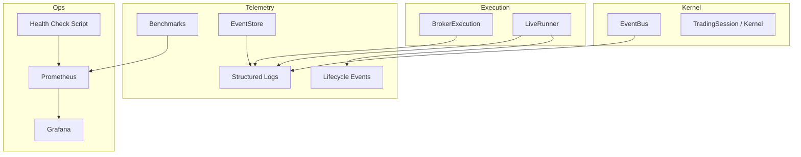
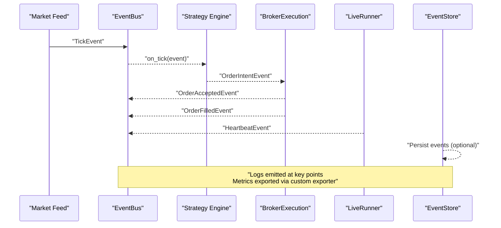
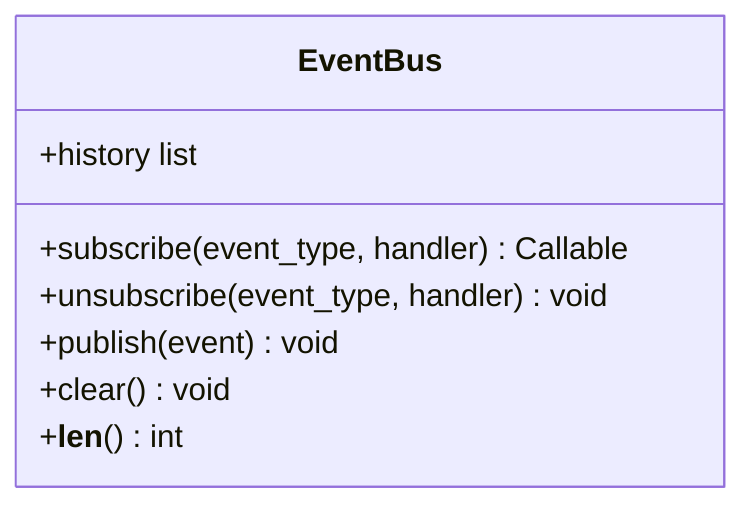
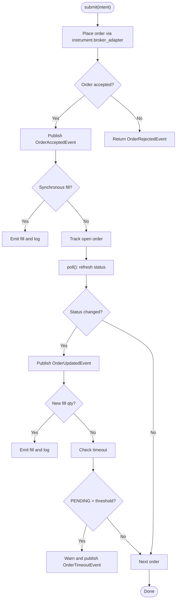
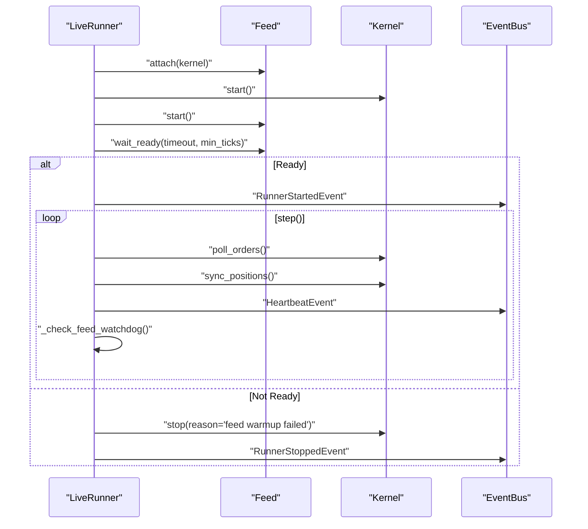
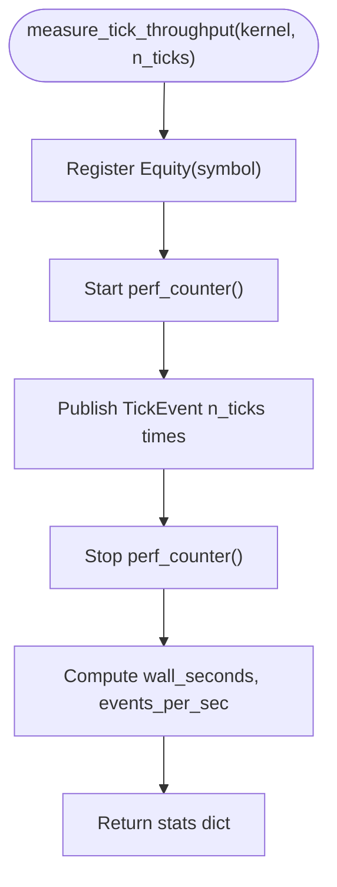
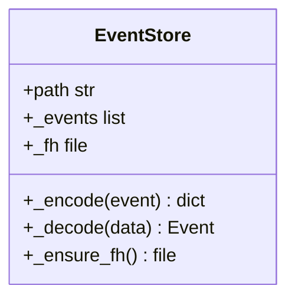
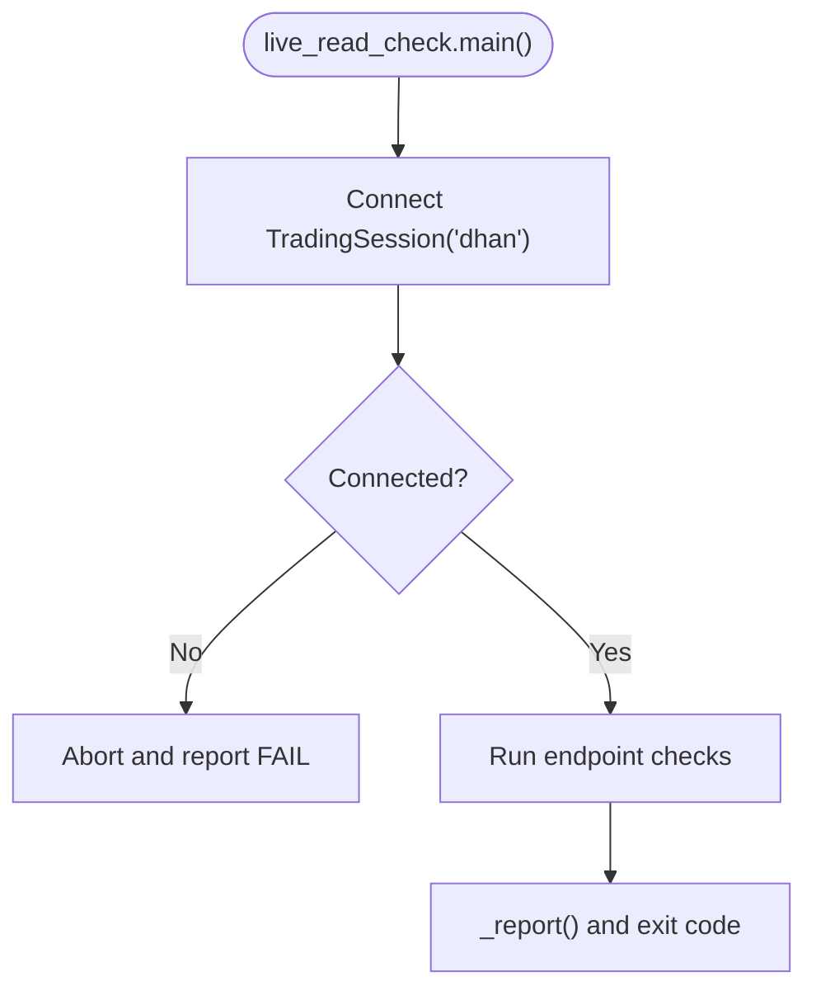
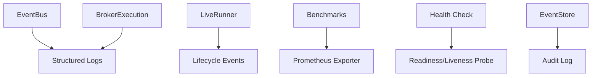

# Monitoring & Observability

<cite>
**Referenced Files in This Document**
- [ntrade/runner/bench.py](file://ntrade/runner/bench.py)
- [scripts/benchmark_latency.py](file://scripts/benchmark_latency.py)
- [tests/test_benchmark.py](file://tests/test_benchmark.py)
- [ntrade/kernel/event_bus.py](file://ntrade/kernel/event_bus.py)
- [tests/test_event_bus_clock.py](file://tests/test_event_bus_clock.py)
- [tests/test_event_bus_threads.py](file://tests/test_event_bus_threads.py)
- [ntrade/storage/event_store.py](file://ntrade/storage/event_store.py)
- [ntrade/execution/broker_executor.py](file://ntrade/execution/broker_executor.py)
- [tests/test_observability.py](file://tests/test_observability.py)
- [ntrade/runner/live_runner.py](file://ntrade/runner/live_runner.py)
- [scripts/live_read_check.py](file://scripts/live_read_check.py)
</cite>

## Table of Contents
1. [Introduction](#introduction)
2. [Project Structure](#project-structure)
3. [Core Components](#core-components)
4. [Architecture Overview](#architecture-overview)
5. [Detailed Component Analysis](#detailed-component-analysis)
6. [Dependency Analysis](#dependency-analysis)
7. [Performance Considerations](#performance-considerations)
8. [Troubleshooting Guide](#troubleshooting-guide)
9. [Conclusion](#conclusion)
10. [Appendices](#appendices)

## Introduction
This document provides a comprehensive monitoring and observability guide for nTrade production deployments. It focuses on:
- Metrics collection using Prometheus and Grafana dashboards
- Custom metric definitions for trading performance
- Structured logging, log aggregation, and alerting rules
- Latency benchmarking and performance profiling techniques
- Distributed tracing for the event-driven architecture
- Error tracking and debugging tools
- Health check endpoints, readiness probes, and liveness probes for container orchestration

The guidance is grounded in the existing codebase components that already emit logs, events, and benchmarks, and it shows how to extend them into a full observability stack suitable for production.

## Project Structure
Observability-related capabilities are primarily implemented across:
- Event bus and lifecycle events (event-driven telemetry backbone)
- Execution layer logging (order lifecycle and fills)
- Benchmark utilities for latency measurement
- Live runner orchestration with heartbeats and watchdogs
- Read-only health checks against broker APIs
- Event store for replay and audit

**Diagram sources**
- [ntrade/kernel/event_bus.py:1-81](file://ntrade/kernel/event_bus.py#L1-L81)
- [ntrade/execution/broker_executor.py:1-290](file://ntrade/execution/broker_executor.py#L1-L290)
- [ntrade/runner/live_runner.py:1-196](file://ntrade/runner/live_runner.py#L1-L196)
- [ntrade/storage/event_store.py:51-87](file://ntrade/storage/event_store.py#L51-L87)
- [scripts/benchmark_latency.py:1-36](file://scripts/benchmark_latency.py#L1-L36)
- [scripts/live_read_check.py:1-188](file://scripts/live_read_check.py#L1-L188)

**Section sources**
- [ntrade/kernel/event_bus.py:1-81](file://ntrade/kernel/event_bus.py#L1-L81)
- [ntrade/execution/broker_executor.py:1-290](file://ntrade/execution/broker_executor.py#L1-L290)
- [ntrade/runner/live_runner.py:1-196](file://ntrade/runner/live_runner.py#L1-L196)
- [ntrade/storage/event_store.py:51-87](file://ntrade/storage/event_store.py#L51-L87)
- [scripts/benchmark_latency.py:1-36](file://scripts/benchmark_latency.py#L1-L36)
- [scripts/live_read_check.py:1-188](file://scripts/live_read_check.py#L1-L188)

## Core Components
- EventBus: Synchronous publish/subscribe with bounded history and serialized dispatch; logs handler exceptions.
- BrokerExecution: Emits structured logs for fills, rejections, timeouts, and updates; publishes order lifecycle events.
- LiveRunner: Orchestrates feed warmup, periodic polling/sync, heartbeat emission, and risk-triggered kill switch; logs critical states.
- Benchmarks: measure_tick_throughput and CLI script to quantify kernel throughput and write JSON results.
- EventStore: Encodes/decodes events to/from JSON for persistence and replay.
- Health Checks: live_read_check validates broker connectivity and read endpoints with PASS/FAIL/DEGRADED status.

These components provide the foundation for metrics, logging, and operational visibility.

**Section sources**
- [ntrade/kernel/event_bus.py:1-81](file://ntrade/kernel/event_bus.py#L1-L81)
- [ntrade/execution/broker_executor.py:1-290](file://ntrade/execution/broker_executor.py#L1-L290)
- [ntrade/runner/live_runner.py:1-196](file://ntrade/runner/live_runner.py#L1-L196)
- [ntrade/runner/bench.py:1-26](file://ntrade/runner/bench.py#L1-L26)
- [ntrade/storage/event_store.py:51-87](file://ntrade/storage/event_store.py#L51-L87)
- [scripts/live_read_check.py:1-188](file://scripts/live_read_check.py#L1-L188)

## Architecture Overview
The observability architecture leverages the event-driven core to propagate signals for metrics, logging, and tracing. The flow below shows how a tick event propagates through the kernel and execution layers, producing logs and lifecycle events that can be consumed by Prometheus exporters or distributed tracing instrumentation.

**Diagram sources**
- [ntrade/kernel/event_bus.py:1-81](file://ntrade/kernel/event_bus.py#L1-L81)
- [ntrade/execution/broker_executor.py:1-290](file://ntrade/execution/broker_executor.py#L1-L290)
- [ntrade/runner/live_runner.py:1-196](file://ntrade/runner/live_runner.py#L1-L196)
- [ntrade/storage/event_store.py:51-87](file://ntrade/storage/event_store.py#L51-L87)

## Detailed Component Analysis

### EventBus Observability
- Serialization: Publishes are serialized with a reentrant lock to prevent torn state during concurrent dispatch.
- History: Bounded deque maintains recent events for replay/debugging.
- Logging: Handler exceptions are logged with context to avoid silent failures.

**Diagram sources**
- [ntrade/kernel/event_bus.py:1-81](file://ntrade/kernel/event_bus.py#L1-L81)

**Section sources**
- [ntrade/kernel/event_bus.py:1-81](file://ntrade/kernel/event_bus.py#L1-L81)
- [tests/test_event_bus_clock.py:95-127](file://tests/test_event_bus_clock.py#L95-L127)
- [tests/test_event_bus_threads.py:1-62](file://tests/test_event_bus_threads.py#L1-L62)

### BrokerExecution Logging and Lifecycle
- Fills and rejections are logged with details such as side, symbol, quantity, price, and order_id.
- Timeout detection emits warnings and OrderTimeoutEvent for stale PENDING orders.
- Updates and lifecycle transitions are published as structured events.

**Diagram sources**
- [ntrade/execution/broker_executor.py:1-290](file://ntrade/execution/broker_executor.py#L1-L290)

**Section sources**
- [ntrade/execution/broker_executor.py:1-290](file://ntrade/execution/broker_executor.py#L1-L290)
- [tests/test_observability.py:1-62](file://tests/test_observability.py#L1-L62)

### LiveRunner Orchestration and Heartbeats
- Warmup: Ensures feed is ready before starting; stops cleanly on failure.
- Heartbeat: Periodically publishes HeartbeatEvent with tick counts and open orders.
- Watchdog: Detects frozen feeds and triggers RiskHaltedEvent.
- Kill Switch: Activates broker kill switch upon risk halt.

**Diagram sources**
- [ntrade/runner/live_runner.py:1-196](file://ntrade/runner/live_runner.py#L1-L196)

**Section sources**
- [ntrade/runner/live_runner.py:1-196](file://ntrade/runner/live_runner.py#L1-L196)

### Benchmarking and Latency Measurement
- measure_tick_throughput: Publishes synthetic ticks and measures wall time, events per second, and fanout.
- CLI: scripts/benchmark_latency.py writes JSON results to .benchmarks/latency.json.
- Tests: Validate stats structure and bus event fanout behavior.

**Diagram sources**
- [ntrade/runner/bench.py:1-26](file://ntrade/runner/bench.py#L1-L26)
- [scripts/benchmark_latency.py:1-36](file://scripts/benchmark_latency.py#L1-L36)
- [tests/test_benchmark.py:1-14](file://tests/test_benchmark.py#L1-L14)

**Section sources**
- [ntrade/runner/bench.py:1-26](file://ntrade/runner/bench.py#L1-L26)
- [scripts/benchmark_latency.py:1-36](file://scripts/benchmark_latency.py#L1-L36)
- [tests/test_benchmark.py:1-14](file://tests/test_benchmark.py#L1-L14)

### Event Store Persistence and Replay
- Encodes events to JSON-safe dicts with type markers for reconstruction.
- Decodes events back into typed objects, skipping unknown types gracefully.
- Appends to file handles for persistent storage.

**Diagram sources**
- [ntrade/storage/event_store.py:51-87](file://ntrade/storage/event_store.py#L51-L87)

**Section sources**
- [ntrade/storage/event_store.py:51-87](file://ntrade/storage/event_store.py#L51-L87)

### Health Check Endpoint Validation
- live_read_check connects to broker and validates multiple read-only endpoints.
- Reports PASS/FAIL/DEGRADED statuses with concise summaries.
- Useful for readiness/liveness probes in container orchestration.

**Diagram sources**
- [scripts/live_read_check.py:1-188](file://scripts/live_read_check.py#L1-L188)

**Section sources**
- [scripts/live_read_check.py:1-188](file://scripts/live_read_check.py#L1-L188)

## Dependency Analysis
Observability depends on the event bus for decoupled telemetry, execution layer for order lifecycle logs, and runner for orchestration signals. Benchmarks and health checks provide operational tooling.

**Diagram sources**
- [ntrade/kernel/event_bus.py:1-81](file://ntrade/kernel/event_bus.py#L1-L81)
- [ntrade/execution/broker_executor.py:1-290](file://ntrade/execution/broker_executor.py#L1-L290)
- [ntrade/runner/live_runner.py:1-196](file://ntrade/runner/live_runner.py#L1-L196)
- [ntrade/runner/bench.py:1-26](file://ntrade/runner/bench.py#L1-L26)
- [scripts/live_read_check.py:1-188](file://scripts/live_read_check.py#L1-L188)
- [ntrade/storage/event_store.py:51-87](file://ntrade/storage/event_store.py#L51-L87)

**Section sources**
- [ntrade/kernel/event_bus.py:1-81](file://ntrade/kernel/event_bus.py#L1-L81)
- [ntrade/execution/broker_executor.py:1-290](file://ntrade/execution/broker_executor.py#L1-L290)
- [ntrade/runner/live_runner.py:1-196](file://ntrade/runner/live_runner.py#L1-L196)
- [ntrade/runner/bench.py:1-26](file://ntrade/runner/bench.py#L1-L26)
- [scripts/live_read_check.py:1-188](file://scripts/live_read_check.py#L1-L188)
- [ntrade/storage/event_store.py:51-87](file://ntrade/storage/event_store.py#L51-L87)

## Performance Considerations
- Event Bus Throughput: Use bounded history and serialized dispatch to maintain stability under load. Monitor queue sizes and handler latencies.
- Benchmarking: Regularly run measure_tick_throughput to track regressions; compare events_per_sec and wall_seconds across deployments.
- Heartbeat and Watchdog: Tune intervals and thresholds to detect stalls early without false positives.
- Storage I/O: EventStore append operations should be monitored for disk latency; consider batching or async writers if needed.
- Profiling: Use Python profilers (cProfile, py-spy) alongside structured logs to identify hotspots in strategy engines and broker adapters.

[No sources needed since this section provides general guidance]

## Troubleshooting Guide
- Handler Exceptions: EventBus logs errors with traceback; inspect logs under logger "ntrade.bus".
- Stale Orders: BrokerExecution warns and evicts orders after repeated poll failures; review network connectivity and broker API rate limits.
- Feed Freezes: LiveRunner watchdog triggers RiskHaltedEvent; verify feed connectivity and subscription payloads.
- Health Checks: live_read_check reports FAIL/DEGRADED; focus on degraded endpoints indicating partial functionality.
- Benchmark Failures: Ensure sufficient ticks and stable environment; compare results to baseline.

**Section sources**
- [ntrade/kernel/event_bus.py:1-81](file://ntrade/kernel/event_bus.py#L1-L81)
- [ntrade/execution/broker_executor.py:1-290](file://ntrade/execution/broker_executor.py#L1-L290)
- [ntrade/runner/live_runner.py:1-196](file://ntrade/runner/live_runner.py#L1-L196)
- [scripts/live_read_check.py:1-188](file://scripts/live_read_check.py#L1-L188)

## Conclusion
nTrade’s event-driven architecture provides a solid foundation for observability. By leveraging structured logging, lifecycle events, benchmarks, and health checks, you can build a robust monitoring system with Prometheus and Grafana. Extend the existing components with custom metrics and tracing instrumentation to achieve comprehensive visibility into trading performance and system health.

[No sources needed since this section summarizes without analyzing specific files]

## Appendices

### Prometheus Metrics Collection Strategy
- Custom Metrics:
  - ntrade_events_total: Counter of events published by type.
  - ntrade_order_lifecycle_duration_seconds: Histogram of order lifecycle durations.
  - ntrade_fill_price_gauge: Gauge of latest fill prices per symbol.
  - ntrade_open_orders_count: Gauge of open orders.
  - ntrade_feed_tick_rate: Gauge of tick rate from feeds.
- Exporters:
  - Implement a lightweight HTTP endpoint exposing metrics in Prometheus format.
  - Subscribe to EventBus and lifecycle events to update counters and gauges.
- Alerting Rules:
  - High error rate: increase in handler exceptions per minute.
  - Low tick rate: drop below threshold for sustained period.
  - Stale orders: count of orders exceeding timeout threshold.
  - Health check failures: any FAIL status from live_read_check.

### Grafana Dashboard Setup
- Panels:
  - Events per second by type (line chart).
  - Order lifecycle duration histogram (histogram panel).
  - Open orders count (gauge).
  - Feed tick rate (time series).
  - Health check status (state timeline).
- Annotations:
  - Deployments, config changes, and incidents annotated on dashboards.

### Structured Logging and Aggregation
- Logger Names:
  - ntrade.bus: Event bus handler exceptions.
  - ntrade.execution: Order lifecycle events and fills.
  - ntrade.runner: Orchestration and risk events.
- Aggregation:
  - Ship logs to centralized systems (e.g., Elasticsearch, Loki) with structured fields (timestamp, level, message, context).
  - Correlate logs with metrics using trace IDs or order IDs.

### Distributed Tracing for Event-Driven Architecture
- Trace Context:
  - Inject correlation IDs into events to trace across handlers.
- Instrumentation:
  - Add spans around publish/subscribe paths and broker adapter calls.
- Visualization:
  - Use Jaeger or similar to visualize event flows and identify bottlenecks.

### Health Check Endpoints and Probes
- Readiness Probe:
  - Execute live_read_check and return success if all endpoints PASS.
- Liveness Probe:
  - Monitor heartbeat events and feed tick progress; fail if no new ticks for threshold.
- Startup Probe:
  - Verify feed warmup completes within timeout; fail otherwise.

### Latency Benchmarking Implementation
- Baseline:
  - Run scripts/benchmark_latency.py regularly to establish baselines.
- Regression Testing:
  - Integrate benchmarks into CI/CD pipelines to catch performance regressions.
- Profiling Techniques:
  - Use cProfile and py-spy to profile hot paths during benchmarks.

### Error Tracking and Debugging Tools
- Error Aggregation:
  - Centralize exceptions from EventBus and BrokerExecution.
- Debugging:
  - Use EventStore to replay events and reproduce issues.
- Operational Scripts:
  - Leverage live_read_check for quick validation of broker connectivity and data availability.