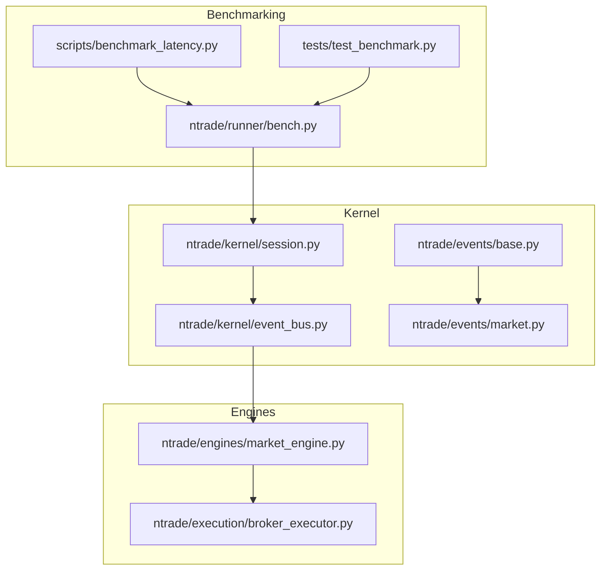
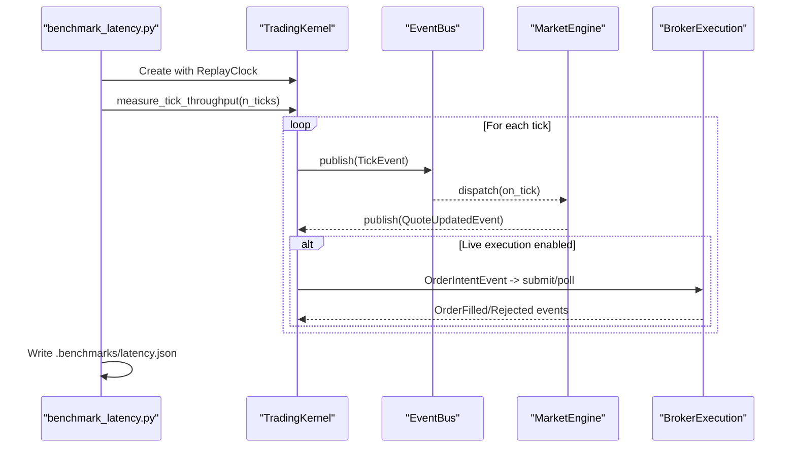
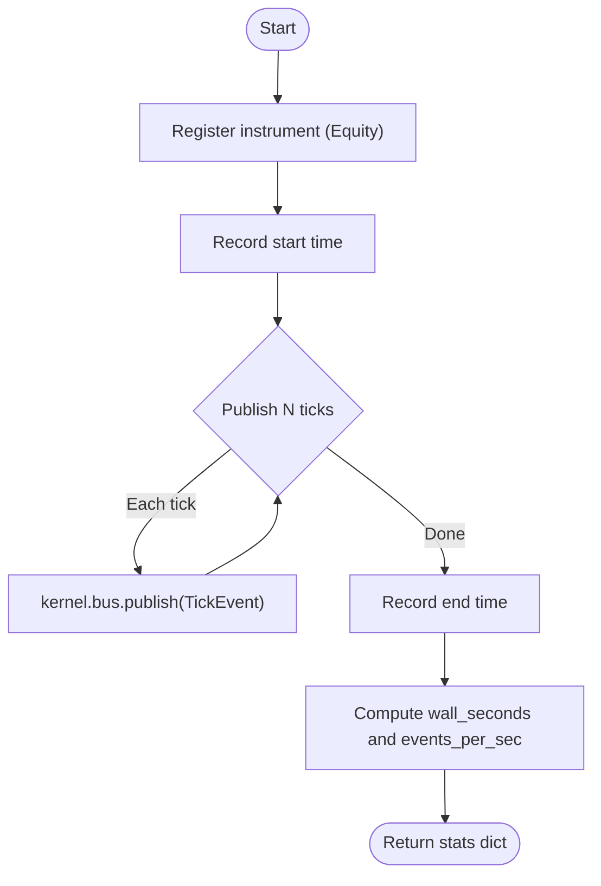
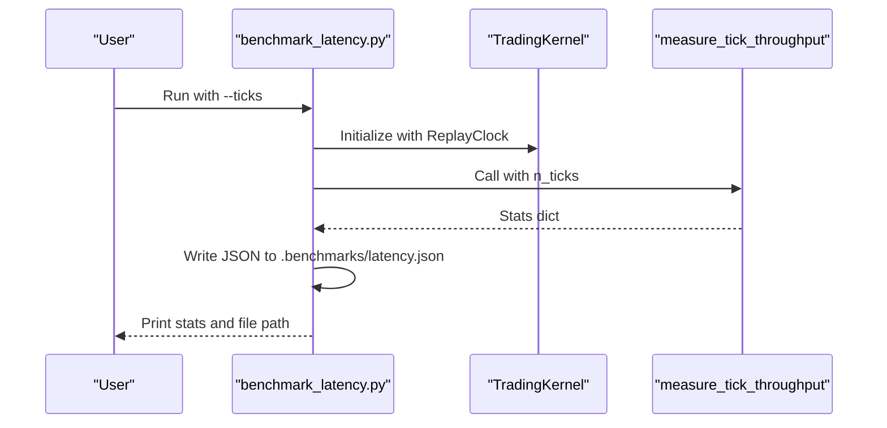
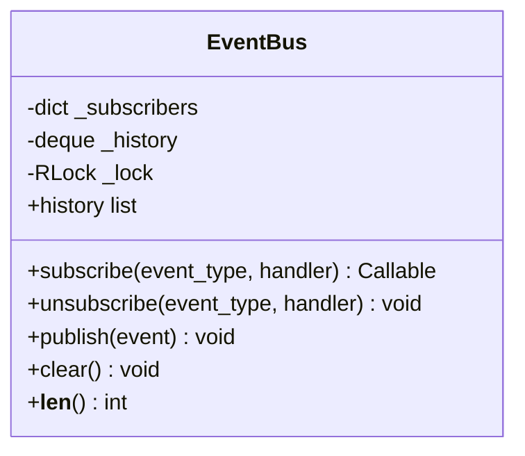
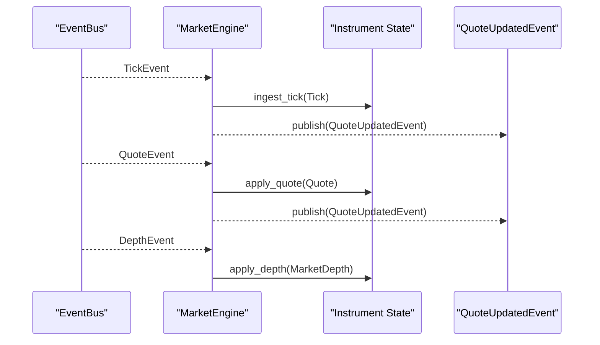
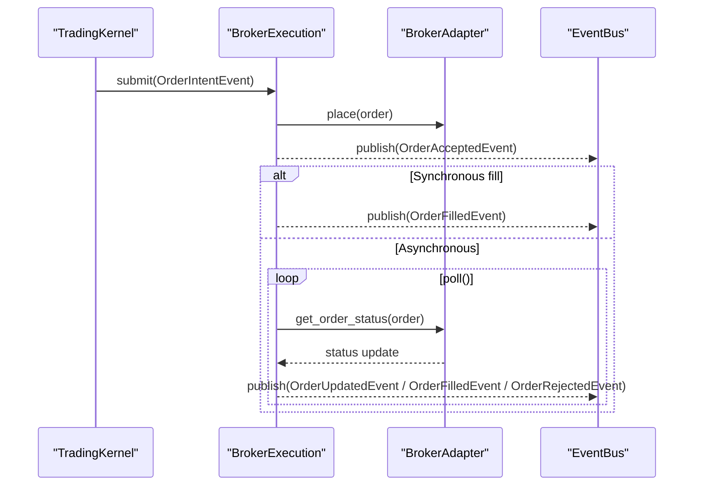
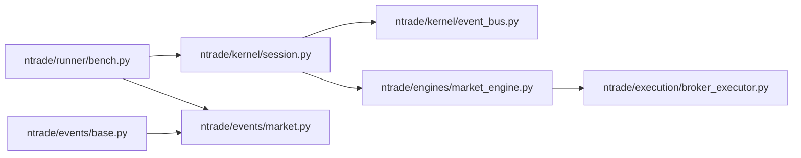

# Performance Profiling

<cite>
**Referenced Files in This Document**
- [scripts/benchmark_latency.py](file://scripts/benchmark_latency.py)
- [ntrade/runner/bench.py](file://ntrade/runner/bench.py)
- [tests/test_benchmark.py](file://tests/test_benchmark.py)
- [ntrade/kernel/event_bus.py](file://ntrade/kernel/event_bus.py)
- [ntrade/events/base.py](file://ntrade/events/base.py)
- [ntrade/events/market.py](file://ntrade/events/market.py)
- [ntrade/kernel/session.py](file://ntrade/kernel/session.py)
- [ntrade/engines/market_engine.py](file://ntrade/engines/market_engine.py)
- [ntrade/execution/broker_executor.py](file://ntrade/execution/broker_executor.py)
</cite>

## Table of Contents
1. Introduction
2. Project Structure
3. Core Components
4. Architecture Overview
5. Detailed Component Analysis
6. Dependency Analysis
7. Performance Considerations
8. Troubleshooting Guide
9. Conclusion
10. Appendices

## Introduction
This document provides comprehensive performance profiling guidance for nTrade systems, focusing on built-in benchmarking tools and recommended techniques to measure latency, throughput, and memory usage across the event-driven kernel, market data handling, and broker communication paths. It explains how to use cProfile, line_profiler, and memory_profiler to identify bottlenecks in trading strategies and kernel operations, and outlines a regression testing strategy with automated benchmarks suitable for continuous integration.

## Project Structure
The performance measurement surface centers around:
- A micro-benchmark utility that publishes synthetic ticks through the kernel’s event bus and measures wall-clock time and throughput.
- A CLI script that orchestrates a replay-mode kernel and writes results to a JSON file.
- The kernel’s event bus, which serializes dispatch and records history for replay and measurement.
- Market engines and execution components that consume events and may be profiled for end-to-end latency.

**Diagram sources**
- [scripts/benchmark_latency.py:1-36](file://scripts/benchmark_latency.py#L1-L36)
- [ntrade/runner/bench.py:1-26](file://ntrade/runner/bench.py#L1-L26)
- [tests/test_benchmark.py:1-15](file://tests/test_benchmark.py#L1-L15)
- [ntrade/kernel/session.py:1-200](file://ntrade/kernel/session.py#L1-L200)
- [ntrade/kernel/event_bus.py:1-81](file://ntrade/kernel/event_bus.py#L1-L81)
- [ntrade/events/base.py:1-22](file://ntrade/events/base.py#L1-L22)
- [ntrade/events/market.py:1-83](file://ntrade/events/market.py#L1-L83)
- [ntrade/engines/market_engine.py:1-64](file://ntrade/engines/market_engine.py#L1-L64)
- [ntrade/execution/broker_executor.py:1-290](file://ntrade/execution/broker_executor.py#L1-L290)

**Section sources**
- [scripts/benchmark_latency.py:1-36](file://scripts/benchmark_latency.py#L1-L36)
- [ntrade/runner/bench.py:1-26](file://ntrade/runner/bench.py#L1-L26)
- [tests/test_benchmark.py:1-15](file://tests/test_benchmark.py#L1-L15)
- [ntrade/kernel/event_bus.py:1-81](file://ntrade/kernel/event_bus.py#L1-L81)
- [ntrade/events/base.py:1-22](file://ntrade/events/base.py#L1-L22)
- [ntrade/events/market.py:1-83](file://ntrade/events/market.py#L1-L83)
- [ntrade/kernel/session.py:1-200](file://ntrade/kernel/session.py#L1-L200)
- [ntrade/engines/market_engine.py:1-64](file://ntrade/engines/market_engine.py#L1-L64)
- [ntrade/execution/broker_executor.py:1-290](file://ntrade/execution/broker_executor.py#L1-L290)

## Core Components
- Benchmark harness (measure_tick_throughput): Publishes a controlled number of TickEvent instances into the kernel’s event bus and measures wall-clock duration to compute throughput metrics.
- Latency benchmark CLI: Instantiates a TradingKernel in replay mode with a ReplayClock, runs the throughput measurement, and persists results as JSON.
- Event bus: Thread-safe publish/subscribe with serialized dispatch and bounded history used for replay and measurement.
- Market engine: Normalizes raw market events into instrument state and emits normalized QuoteUpdatedEvent downstream.
- Broker executor: Routes order intents to live brokers, tracks lifecycle, and emits fill/rejection events; useful for measuring broker communication latency.

Key responsibilities:
- Throughput measurement: Wall-clock timing around event publication loops.
- Replay determinism: ReplayClock ensures consistent timestamps for reproducible measurements.
- Serialization: EventBus uses a reentrant lock to serialize dispatch and protect shared read-models.

**Section sources**
- [ntrade/runner/bench.py:1-26](file://ntrade/runner/bench.py#L1-L26)
- [scripts/benchmark_latency.py:1-36](file://scripts/benchmark_latency.py#L1-L36)
- [ntrade/kernel/event_bus.py:1-81](file://ntrade/kernel/event_bus.py#L1-L81)
- [ntrade/engines/market_engine.py:1-64](file://ntrade/engines/market_engine.py#L1-L64)
- [ntrade/execution/broker_executor.py:1-290](file://ntrade/execution/broker_executor.py#L1-L290)

## Architecture Overview
The benchmark flow exercises the full kernel pipeline:
- The CLI constructs a TradingKernel with a ReplayClock.
- The benchmark function publishes synthetic TickEvent messages.
- The EventBus serializes dispatch and records history.
- Engines (MarketEngine, StrategyEngine, etc.) process events and emit derived events.
- Optional execution path (BrokerExecution) can be included to measure end-to-end latency including broker interactions.

**Diagram sources**
- [scripts/benchmark_latency.py:1-36](file://scripts/benchmark_latency.py#L1-L36)
- [ntrade/kernel/session.py:1-200](file://ntrade/kernel/session.py#L1-L200)
- [ntrade/kernel/event_bus.py:1-81](file://ntrade/kernel/event_bus.py#L1-L81)
- [ntrade/engines/market_engine.py:1-64](file://ntrade/engines/market_engine.py#L1-L64)
- [ntrade/execution/broker_executor.py:1-290](file://ntrade/execution/broker_executor.py#L1-L290)

## Detailed Component Analysis

### Benchmark Harness: measure_tick_throughput
- Purpose: Measure kernel event pipeline throughput by publishing N ticks and computing wall_seconds and events_per_sec.
- Data model: Uses frozen dataclass events for deterministic timestamps and replay parity.
- Measurement approach: time.perf_counter() around the publish loop; returns a dict with throughput metrics.

**Diagram sources**
- [ntrade/runner/bench.py:1-26](file://ntrade/runner/bench.py#L1-L26)
- [ntrade/events/base.py:1-22](file://ntrade/events/base.py#L1-L22)
- [ntrade/events/market.py:1-83](file://ntrade/events/market.py#L1-L83)

**Section sources**
- [ntrade/runner/bench.py:1-26](file://ntrade/runner/bench.py#L1-L26)
- [tests/test_benchmark.py:1-15](file://tests/test_benchmark.py#L1-L15)

### Latency Benchmark CLI
- Purpose: Provide a command-line entry point to run throughput tests and persist results.
- Behavior: Creates a replay-mode kernel, runs measure_tick_throughput, and writes JSON output to .benchmarks/latency.json.

**Diagram sources**
- [scripts/benchmark_latency.py:1-36](file://scripts/benchmark_latency.py#L1-L36)
- [ntrade/kernel/session.py:1-200](file://ntrade/kernel/session.py#L1-L200)
- [ntrade/runner/bench.py:1-26](file://ntrade/runner/bench.py#L1-L26)

**Section sources**
- [scripts/benchmark_latency.py:1-36](file://scripts/benchmark_latency.py#L1-L36)

### Event Bus: Serialization and History
- Serializes dispatch using a reentrant lock to prevent concurrent modification of shared read-models.
- Records every published event in a bounded deque for replay and measurement.
- Exceptions in handlers are logged and swallowed to ensure robustness.

**Diagram sources**
- [ntrade/kernel/event_bus.py:1-81](file://ntrade/kernel/event_bus.py#L1-L81)

**Section sources**
- [ntrade/kernel/event_bus.py:1-81](file://ntrade/kernel/event_bus.py#L1-L81)

### Market Engine: Event Processing Pipeline
- Subscribes to TickEvent, QuoteEvent, DepthEvent.
- Normalizes incoming events into instrument state and broadcasts QuoteUpdatedEvent.
- Acts as a key hotspot for profiling market data handling efficiency.

**Diagram sources**
- [ntrade/engines/market_engine.py:1-64](file://ntrade/engines/market_engine.py#L1-L64)
- [ntrade/events/market.py:1-83](file://ntrade/events/market.py#L1-L83)

**Section sources**
- [ntrade/engines/market_engine.py:1-64](file://ntrade/engines/market_engine.py#L1-L64)

### Broker Execution: Latency and Lifecycle
- Submits orders via BrokerAdapter, immediately publishes acceptance, and polls for lifecycle updates.
- Emits fills, rejections, timeouts, and updates; supports crash recovery and stale-order eviction.
- Ideal target for measuring broker communication latency and end-to-end order lifecycle timing.

**Diagram sources**
- [ntrade/execution/broker_executor.py:1-290](file://ntrade/execution/broker_executor.py#L1-L290)

**Section sources**
- [ntrade/execution/broker_executor.py:1-290](file://ntrade/execution/broker_executor.py#L1-L290)

## Dependency Analysis
The benchmark harness depends on kernel session wiring and event types. The event bus is central to all processing and measurement. Market and execution engines extend the pipeline and introduce additional hotspots.

**Diagram sources**
- [ntrade/runner/bench.py:1-26](file://ntrade/runner/bench.py#L1-L26)
- [ntrade/kernel/session.py:1-200](file://ntrade/kernel/session.py#L1-L200)
- [ntrade/kernel/event_bus.py:1-81](file://ntrade/kernel/event_bus.py#L1-L81)
- [ntrade/engines/market_engine.py:1-64](file://ntrade/engines/market_engine.py#L1-L64)
- [ntrade/execution/broker_executor.py:1-290](file://ntrade/execution/broker_executor.py#L1-L290)
- [ntrade/events/base.py:1-22](file://ntrade/events/base.py#L1-L22)
- [ntrade/events/market.py:1-83](file://ntrade/events/market.py#L1-L83)

**Section sources**
- [ntrade/runner/bench.py:1-26](file://ntrade/runner/bench.py#L1-L26)
- [ntrade/kernel/session.py:1-200](file://ntrade/kernel/session.py#L1-L200)
- [ntrade/kernel/event_bus.py:1-81](file://ntrade/kernel/event_bus.py#L1-L81)
- [ntrade/engines/market_engine.py:1-64](file://ntrade/engines/market_engine.py#L1-L64)
- [ntrade/execution/broker_executor.py:1-290](file://ntrade/execution/broker_executor.py#L1-L290)
- [ntrade/events/base.py:1-22](file://ntrade/events/base.py#L1-L22)
- [ntrade/events/market.py:1-83](file://ntrade/events/market.py#L1-L83)

## Performance Considerations
- Use replay mode with ReplayClock for deterministic, repeatable measurements.
- Keep the event bus history size appropriate for your workload; it impacts memory and dispatch overhead.
- Profile hot paths:
  - Event bus dispatch (handler exceptions are logged but do not stop dispatch).
  - MarketEngine normalization and quote projection.
  - BrokerExecution lifecycle polling and network calls.
- Avoid heavy work inside event handlers; offload to background tasks if necessary.
- Ensure instruments are registered before publishing ticks to avoid early exits in engines.

[No sources needed since this section provides general guidance]

## Troubleshooting Guide
Common issues and remedies:
- Low throughput: Check handler complexity and event fanout; consider reducing history size or optimizing handlers.
- Stalled broker orders: Monitor timeout logic and stale-order eviction; verify broker connectivity and polling frequency.
- Inconsistent timestamps: Ensure ReplayClock is used in replay/backtest modes and that events carry kernel timestamps.
- Memory growth: Inspect event history length and large object creation in handlers; clear caches where appropriate.

**Section sources**
- [ntrade/kernel/event_bus.py:1-81](file://ntrade/kernel/event_bus.py#L1-L81)
- [ntrade/execution/broker_executor.py:1-290](file://ntrade/execution/broker_executor.py#L1-L290)

## Conclusion
nTrade provides a solid foundation for performance profiling through its event-driven architecture and built-in benchmark utilities. By leveraging the micro-benchmark harness, replay mode, and targeted profiling tools, teams can establish baselines, detect regressions, and optimize critical paths such as market data handling and broker communication. Integrating these benchmarks into CI ensures ongoing performance stability.

[No sources needed since this section summarizes without analyzing specific files]

## Appendices

### Using cProfile for Kernel and Strategy Hotspots
- Profile the benchmark runner to capture overall pipeline timing:
  - Run the CLI under cProfile and analyze top-level functions.
- Profile individual engines:
  - Wrap MarketEngine.on_tick/on_quote/on_depth calls to isolate normalization costs.
- Profile strategy hooks:
  - Use cProfile per-event within StrategyEngine._dispatch to identify slow strategies.

[No sources needed since this section provides general guidance]

### Using line_profiler for Line-Level Bottlenecks
- Apply line_profiler to:
  - measure_tick_throughput to validate publish loop overhead.
  - MarketEngine methods to pinpoint expensive projections.
  - BrokerExecution.poll to assess network call distribution.
- Focus on tight loops and frequent calls; exclude I/O-heavy sections when isolating CPU-bound code.

[No sources needed since this section provides general guidance]

### Using memory_profiler for Memory Footprint
- Profile event creation and history growth:
  - Track memory usage during high-throughput tick bursts.
- Inspect handler allocations:
  - Identify temporary objects created per event that may accumulate.
- Validate event history bounds and cache sizes to prevent unbounded growth.

[No sources needed since this section provides general guidance]

### Automated Regression Testing and CI Integration
- Add pytest-based assertions for throughput thresholds:
  - Assert minimum events_per_sec and maximum wall_seconds for fixed tick counts.
- Persist benchmark results:
  - Use the CLI to write .benchmarks/latency.json and compare against baselines in CI.
- Gate merges on performance:
  - Fail CI if throughput drops below configured thresholds or if latency increases beyond limits.

**Section sources**
- [tests/test_benchmark.py:1-15](file://tests/test_benchmark.py#L1-L15)
- [scripts/benchmark_latency.py:1-36](file://scripts/benchmark_latency.py#L1-L36)

### Establishing and Monitoring Production Baselines
- Baseline establishment:
  - Run benchmarks under production-like conditions (same number of subscribers, similar event rates).
  - Record median and p95 latencies for event processing and broker round-trips.
- Continuous monitoring:
  - Periodically execute benchmarks and store results for trend analysis.
  - Alert on significant deviations from baseline metrics.

[No sources needed since this section provides general guidance]