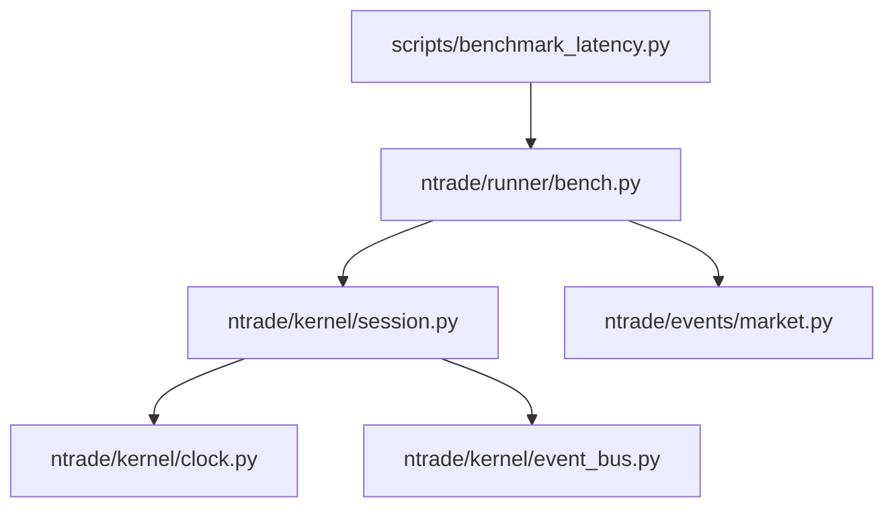
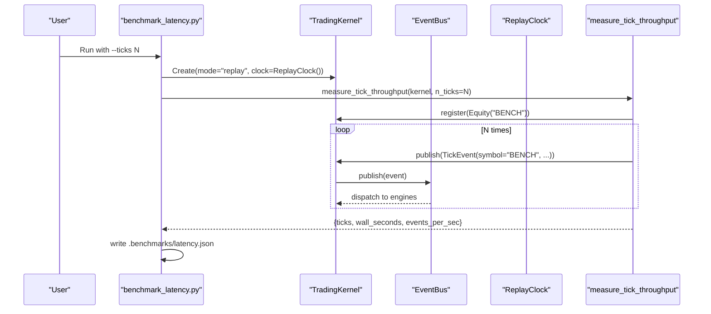
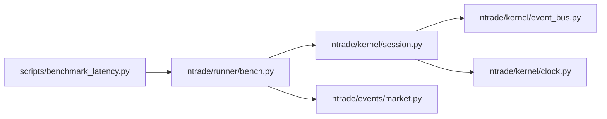

# Benchmarking Methodology

<cite>
**Referenced Files in This Document**
- [scripts/benchmark_latency.py](file://scripts/benchmark_latency.py)
- [ntrade/runner/bench.py](file://ntrade/runner/bench.py)
- [tests/test_benchmark.py](file://tests/test_benchmark.py)
- [ntrade/kernel/session.py](file://ntrade/kernel/session.py)
- [ntrade/kernel/clock.py](file://ntrade/kernel/clock.py)
- [ntrade/events/market.py](file://ntrade/events/market.py)
- [ntrade/kernel/event_bus.py](file://ntrade/kernel/event_bus.py)
</cite>

## Table of Contents
1. [Introduction](#introduction)
2. [Project Structure](#project-structure)
3. [Core Components](#core-components)
4. [Architecture Overview](#architecture-overview)
5. [Detailed Component Analysis](#detailed-component-analysis)
6. [Dependency Analysis](#dependency-analysis)
7. [Performance Considerations](#performance-considerations)
8. [Troubleshooting Guide](#troubleshooting-guide)
9. [Conclusion](#conclusion)
10. [Appendices](#appendices)

## Introduction
This document explains the nTrade benchmarking methodology and tools for measuring kernel event-pipeline latency and tick throughput. It covers how to run the built-in latency benchmark, interpret its metrics, extend the framework with custom benchmarks, and establish reproducible performance regression tests. The guidance includes environment setup best practices, baseline establishment, drift monitoring, and statistical interpretation of results.

## Project Structure
The benchmarking capability is implemented as a small script that constructs a replay-mode TradingKernel and measures tick throughput through the kernel’s event bus and engine stack. The core measurement logic lives in a dedicated module, while the kernel orchestrates engines and time via a deterministic clock.

**Diagram sources**
- [scripts/benchmark_latency.py:18-32](file://scripts/benchmark_latency.py#L18-L32)
- [ntrade/runner/bench.py:11-25](file://ntrade/runner/bench.py#L11-L25)
- [ntrade/kernel/session.py:38-103](file://ntrade/kernel/session.py#L38-L103)
- [ntrade/kernel/clock.py:31-46](file://ntrade/kernel/clock.py#L31-L46)
- [ntrade/events/market.py:11-22](file://ntrade/events/market.py#L11-L22)
- [ntrade/kernel/event_bus.py:24-66](file://ntrade/kernel/event_bus.py#L24-L66)

**Section sources**
- [scripts/benchmark_latency.py:1-36](file://scripts/benchmark_latency.py#L1-L36)
- [ntrade/runner/bench.py:1-26](file://ntrade/runner/bench.py#L1-L26)
- [ntrade/kernel/session.py:1-200](file://ntrade/kernel/session.py#L1-L200)
- [ntrade/kernel/clock.py:1-55](file://ntrade/kernel/clock.py#L1-L55)
- [ntrade/events/market.py:1-83](file://ntrade/events/market.py#L1-L83)
- [ntrade/kernel/event_bus.py:1-81](file://ntrade/kernel/event_bus.py#L1-L81)

## Core Components
- Latency benchmark script: command-line entry point that builds a replay-mode kernel and writes JSON stats to .benchmarks/latency.json.
- Throughput measurement: publishes a fixed number of TickEvent events and measures wall-clock time to compute events per second.
- TradingKernel: wires the engine stack (market, candle, indicator, strategy, risk, portfolio, order), execution router, and event bus; exposes register and publish APIs used by the benchmark.
- ReplayClock: deterministic clock driven by event timestamps to ensure zero-parity behavior across runs.
- EventBus: thread-safe, serialized publish/subscribe backbone that records history and dispatches events to subscribers (engines).

Key responsibilities:
- scripts/benchmark_latency.py: CLI parsing, kernel construction, output serialization.
- ntrade/runner/bench.py: micro-benchmark implementation for tick throughput.
- ntrade/kernel/session.py: kernel orchestration and lifecycle.
- ntrade/kernel/clock.py: deterministic time source for replay/backtest.
- ntrade/events/market.py: TickEvent definition used by the benchmark.
- ntrade/kernel/event_bus.py: high-performance, serialized event dispatch.

**Section sources**
- [scripts/benchmark_latency.py:18-32](file://scripts/benchmark_latency.py#L18-L32)
- [ntrade/runner/bench.py:11-25](file://ntrade/runner/bench.py#L11-L25)
- [ntrade/kernel/session.py:38-103](file://ntrade/kernel/session.py#L38-L103)
- [ntrade/kernel/clock.py:31-46](file://ntrade/kernel/clock.py#L31-L46)
- [ntrade/events/market.py:11-22](file://ntrade/events/market.py#L11-L22)
- [ntrade/kernel/event_bus.py:24-66](file://ntrade/kernel/event_bus.py#L24-L66)

## Architecture Overview
The benchmark constructs a minimal but complete kernel in replay mode, registers an instrument, and then publishes synthetic ticks. The kernel’s event bus serializes dispatch, ensuring consistent timing characteristics across runs.

**Diagram sources**
- [scripts/benchmark_latency.py:18-32](file://scripts/benchmark_latency.py#L18-L32)
- [ntrade/runner/bench.py:11-25](file://ntrade/runner/bench.py#L11-L25)
- [ntrade/kernel/session.py:106-116](file://ntrade/kernel/session.py#L106-L116)
- [ntrade/kernel/event_bus.py:47-66](file://ntrade/kernel/event_bus.py#L47-L66)
- [ntrade/kernel/clock.py:31-46](file://ntrade/kernel/clock.py#L31-L46)

## Detailed Component Analysis

### Latency Benchmark Script
Purpose:
- Parse arguments for tick count and output path.
- Instantiate a replay-mode TradingKernel with ReplayClock.
- Invoke the throughput measurement and persist results as JSON.

Usage:
- Command-line invocation supports --ticks and --out flags.
- Default output path is .benchmarks/latency.json under the repository root.

Behavior:
- Creates a fresh kernel per run to avoid state leakage.
- Writes human-readable JSON and prints it to stdout.

**Section sources**
- [scripts/benchmark_latency.py:18-32](file://scripts/benchmark_latency.py#L18-L32)

### Throughput Measurement
Purpose:
- Measure wall-clock time to publish a fixed number of TickEvent instances through the kernel.
- Return a dictionary with ticks, wall_seconds, and events_per_sec.

Implementation highlights:
- Registers a synthetic Equity instrument before publishing ticks.
- Uses time.perf_counter for precise timing.
- Publishes events with monotonically increasing timestamps to exercise the ReplayClock.

Interpretation:
- events_per_sec reflects the end-to-end throughput of the kernel’s event pipeline under the current configuration.
- wall_seconds captures total elapsed time for all published events.

**Section sources**
- [ntrade/runner/bench.py:11-25](file://ntrade/runner/bench.py#L11-L25)

### TradingKernel and Event Bus
Kernel:
- Wires market, candle, indicator, strategy, risk, portfolio, and order engines.
- Provides register and publish methods used by the benchmark.
- Supports replay mode where the clock follows event timestamps.

Event Bus:
- Serializes publish calls using a reentrant lock to prevent concurrent dispatch races.
- Records event history up to a configurable limit.
- Swallows handler exceptions to keep the pipeline robust.

Implications for benchmarking:
- Deterministic timing due to ReplayClock and serialized dispatch.
- Consistent ordering ensures reproducible measurements.

**Section sources**
- [ntrade/kernel/session.py:38-103](file://ntrade/kernel/session.py#L38-L103)
- [ntrade/kernel/event_bus.py:24-66](file://ntrade/kernel/event_bus.py#L24-L66)

### Deterministic Time Source
ReplayClock:
- Drives kernel time based on event timestamps rather than wall time.
- Supports set and advance operations to follow event streams deterministically.

Impact:
- Ensures zero-parity between live and replay modes for decision-making.
- Stabilizes benchmark conditions by removing external time variability.

**Section sources**
- [ntrade/kernel/clock.py:31-46](file://ntrade/kernel/clock.py#L31-L46)

### Market Events
TickEvent:
- Represents a single trade/quote/depth print with symbol, exchange, price, quantity, side, and kind.
- Used by the benchmark to simulate realistic market data flow.

**Section sources**
- [ntrade/events/market.py:11-22](file://ntrade/events/market.py#L11-L22)

### Test Coverage
Unit test:
- Validates that measure_tick_throughput returns expected fields and reasonable values.
- Confirms positive events_per_sec and non-negative wall_seconds.

**Section sources**
- [tests/test_benchmark.py:9-14](file://tests/test_benchmark.py#L9-L14)

## Dependency Analysis
The benchmark depends on the kernel, event bus, and clock to provide a stable, deterministic environment for measuring throughput.

**Diagram sources**
- [scripts/benchmark_latency.py:18-32](file://scripts/benchmark_latency.py#L18-L32)
- [ntrade/runner/bench.py:11-25](file://ntrade/runner/bench.py#L11-L25)
- [ntrade/kernel/session.py:38-103](file://ntrade/kernel/session.py#L38-L103)
- [ntrade/kernel/event_bus.py:24-66](file://ntrade/kernel/event_bus.py#L24-L66)
- [ntrade/kernel/clock.py:31-46](file://ntrade/kernel/clock.py#L31-L46)
- [ntrade/events/market.py:11-22](file://ntrade/events/market.py#L11-L22)

**Section sources**
- [scripts/benchmark_latency.py:18-32](file://scripts/benchmark_latency.py#L18-L32)
- [ntrade/runner/bench.py:11-25](file://ntrade/runner/bench.py#L11-L25)
- [ntrade/kernel/session.py:38-103](file://ntrade/kernel/session.py#L38-L103)
- [ntrade/kernel/event_bus.py:24-66](file://ntrade/kernel/event_bus.py#L24-L66)
- [ntrade/kernel/clock.py:31-46](file://ntrade/kernel/clock.py#L31-L46)
- [ntrade/events/market.py:11-22](file://ntrade/events/market.py#L11-L22)

## Performance Considerations
- Use replay mode with ReplayClock to eliminate external time variability and ensure deterministic behavior.
- Keep the kernel fresh per run to avoid state accumulation affecting timings.
- Avoid registering heavy strategies or complex handlers during benchmark runs unless they are part of the measured workload.
- Ensure the event bus max_history is sufficient to capture the full run without truncation if you rely on history for analysis.
- Prefer perf_counter-based timing (already used) for accurate wall-time measurement.

[No sources needed since this section provides general guidance]

## Troubleshooting Guide
Common issues and resolutions:
- Missing .benchmarks directory: The script creates it automatically; verify permissions if writing fails.
- Unexpectedly low events_per_sec: Check for additional subscribers or heavy handlers registered on the bus.
- Non-deterministic results: Ensure ReplayClock is used and no external time sources are invoked inside handlers.
- Inconsistent baselines: Pin Python version, dependencies, and kernel configuration; record environment details alongside results.

**Section sources**
- [scripts/benchmark_latency.py:27-31](file://scripts/benchmark_latency.py#L27-L31)
- [ntrade/kernel/event_bus.py:47-66](file://ntrade/kernel/event_bus.py#L47-L66)

## Conclusion
The nTrade benchmarking toolkit provides a focused, deterministic way to measure kernel event-pipeline throughput. By leveraging replay mode, a deterministic clock, and a serialized event bus, you can obtain stable, reproducible metrics. Extend the framework by adding custom benchmarks that publish domain-specific events and measure their impact on the pipeline. Establish baselines, track regressions over time, and interpret events_per_sec and wall_seconds to monitor performance drift.

[No sources needed since this section summarizes without analyzing specific files]

## Appendices

### How to Use the Built-in Latency Benchmark
- Run the script with desired tick count and optional output path.
- Inspect the JSON file for ticks, wall_seconds, and events_per_sec.
- Integrate into CI by capturing the JSON artifact and comparing against a baseline.

**Section sources**
- [scripts/benchmark_latency.py:18-32](file://scripts/benchmark_latency.py#L18-L32)

### Measuring Tick Throughput Programmatically
- Construct a replay-mode TradingKernel with ReplayClock.
- Call measure_tick_throughput with the desired number of ticks.
- Analyze returned statistics to assess pipeline performance.

**Section sources**
- [ntrade/runner/bench.py:11-25](file://ntrade/runner/bench.py#L11-L25)

### Custom Benchmark Creation Patterns
- Define a function that constructs a kernel (or reuses one) and publishes a controlled sequence of events.
- Record start/end times with perf_counter and compute derived metrics (e.g., latency percentiles, throughput).
- Write results to a structured JSON file for comparison and trend analysis.
- Optionally subscribe to specific event types to measure downstream processing costs.

[No sources needed since this section provides general guidance]

### Statistical Analysis of Results
- Collect multiple runs to estimate variance and confidence intervals.
- Track mean and standard deviation of events_per_sec and wall_seconds.
- Use control charts to detect drift over time and alert on threshold breaches.

[No sources needed since this section provides general guidance]

### Setting Up Performance Regression Tests
- Add a pytest that invokes measure_tick_throughput and asserts minimum thresholds for events_per_sec.
- Store baseline metrics in a JSON file and compare new runs against them.
- Fail the build when regressions exceed acceptable bounds.

**Section sources**
- [tests/test_benchmark.py:9-14](file://tests/test_benchmark.py#L9-L14)

### Best Practices for Reproducible Benchmarks
- Pin Python and dependency versions.
- Use deterministic clocks and avoid external I/O during measurement.
- Isolate the kernel instance per run and clear any caches.
- Record environment metadata (OS, CPU, Python version) alongside results.

[No sources needed since this section provides general guidance]

### Interpreting Performance Metrics
- events_per_sec: higher is better; indicates overall pipeline throughput.
- wall_seconds: total elapsed time; useful for capacity planning.
- Compare trends across commits to identify regressions early.

[No sources needed since this section provides general guidance]