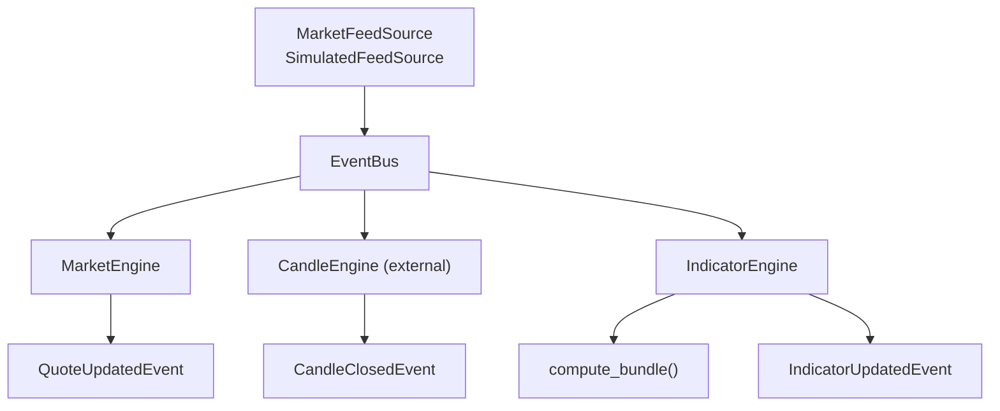
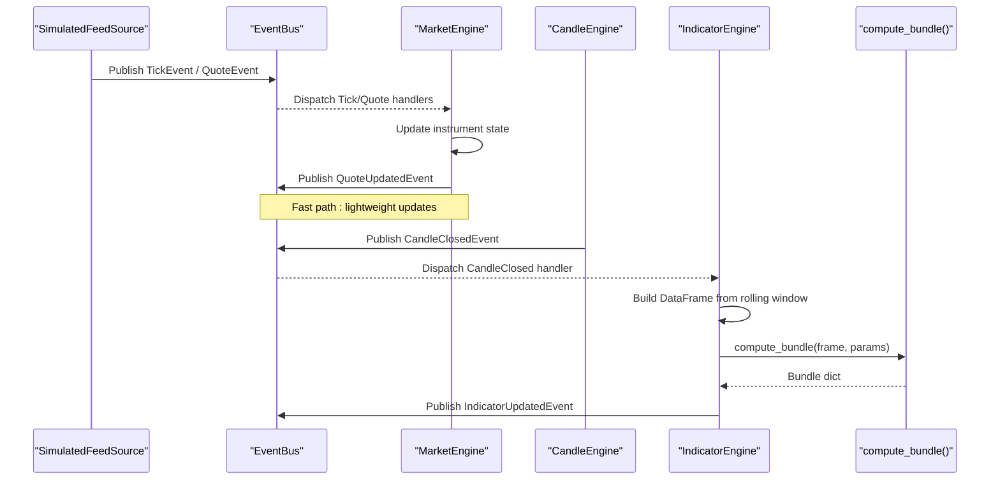
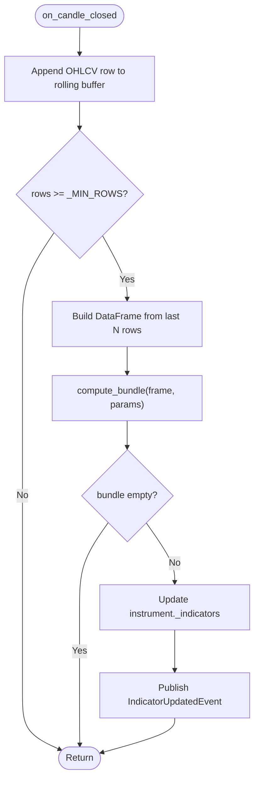
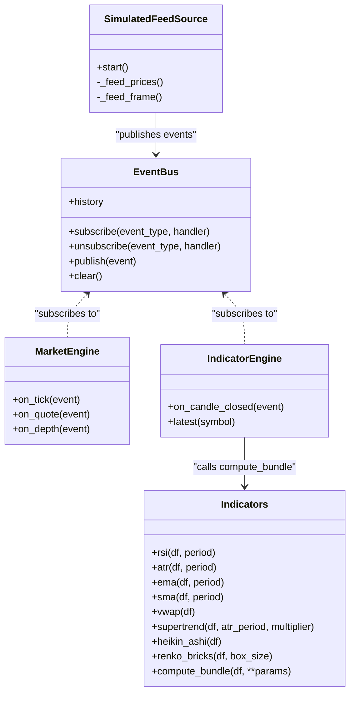

# CPU Profiling & Performance Analysis

<cite>
**Referenced Files in This Document**
- [pyproject.toml](file://pyproject.toml)
- [ntrade/kernel/event_bus.py](file://ntrade/kernel/event_bus.py)
- [ntrade/engines/market_engine.py](file://ntrade/engines/market_engine.py)
- [ntrade/engines/indicator_engine.py](file://ntrade/engines/indicator_engine.py)
- [ntrade/domain/analytics/indicators.py](file://ntrade/domain/analytics/indicators.py)
- [ntrade/sources/market_feed.py](file://ntrade/sources/market_feed.py)
- [ntrade/kernel/clock.py](file://ntrade/kernel/clock.py)
- [ntrade/runner/bench.py](file://ntrade/runner/bench.py)
- [scripts/benchmark_latency.py](file://scripts/benchmark_latency.py)
- [ntrade/events/market.py](file://ntrade/events/market.py)
- [ntrade/domain/market/quote.py](file://ntrade/domain/market/quote.py)
- [ntrade/domain/market/candles.py](file://ntrade/domain/market/candles.py)
</cite>

## Table of Contents
1. [Introduction](#introduction)
2. [Project Structure](#project-structure)
3. [Core Components](#core-components)
4. [Architecture Overview](#architecture-overview)
5. [Detailed Component Analysis](#detailed-component-analysis)
6. [Dependency Analysis](#dependency-analysis)
7. [Performance Considerations](#performance-considerations)
8. [Troubleshooting Guide](#troubleshooting-guide)
9. [Conclusion](#conclusion)
10. [Appendices](#appendices)

## Introduction
This guide provides a practical, code-mapped approach to CPU profiling and performance analysis for nTrade systems. It focuses on:
- Integrating and using CPU profilers (cProfile, line_profiler, py-spy, perf) with the nTrade event-driven pipeline
- Identifying hot paths across market data ingestion, indicator computation, and engine dispatch
- Analyzing computational bottlenecks in pandas-based indicator calculations and event bus fan-out
- Optimizing vectorized operations, parallelization patterns, and asynchronous execution for high-frequency scenarios
- Measuring throughput and latency with built-in benchmarks and scripts

The guidance is grounded in the actual nTrade modules that handle events, market data, indicators, and benchmarking.

## Project Structure
At a high level, nTrade uses an event-driven kernel where sources publish canonical market events into a thread-safe EventBus. Engines subscribe to these events, update read-model state, and broadcast derived events downstream. Indicator computation runs on candle close events using vectorized pandas operations.

**Diagram sources**
- [ntrade/sources/market_feed.py:23-105](file://ntrade/sources/market_feed.py#L23-L105)
- [ntrade/kernel/event_bus.py:24-81](file://ntrade/kernel/event_bus.py#L24-L81)
- [ntrade/engines/market_engine.py:15-64](file://ntrade/engines/market_engine.py#L15-L64)
- [ntrade/engines/indicator_engine.py:18-55](file://ntrade/engines/indicator_engine.py#L18-L55)
- [ntrade/domain/analytics/indicators.py:148-195](file://ntrade/domain/analytics/indicators.py#L148-L195)
- [ntrade/events/market.py:11-83](file://ntrade/events/market.py#L11-L83)

**Section sources**
- [pyproject.toml:1-25](file://pyproject.toml#L1-L25)
- [ntrade/kernel/event_bus.py:1-81](file://ntrade/kernel/event_bus.py#L1-L81)
- [ntrade/engines/market_engine.py:1-64](file://ntrade/engines/market_engine.py#L1-L64)
- [ntrade/engines/indicator_engine.py:1-55](file://ntrade/engines/indicator_engine.py#L1-L55)
- [ntrade/domain/analytics/indicators.py:1-195](file://ntrade/domain/analytics/indicators.py#L1-L195)
- [ntrade/sources/market_feed.py:1-105](file://ntrade/sources/market_feed.py#L1-L105)
- [ntrade/events/market.py:1-83](file://ntrade/events/market.py#L1-L83)

## Core Components
- Event Bus: Synchronous, reentrant-locked pub/sub with history buffering; central to concurrency and serialization of handlers.
- Market Engine: Normalizes raw Tick/Quote/Depth events into instrument state and publishes QuoteUpdatedEvent.
- Indicator Engine: Maintains rolling OHLCV windows per symbol, computes indicator bundles on CandleClosedEvent, and broadcasts IndicatorUpdatedEvent.
- Indicators: Pure functions over pandas DataFrames implementing RSI, ATR, EMA, SMA, VWAP, SuperTrend, Heikin-Ashi, Renko bricks, and a compute_bundle orchestrator.
- Market Feed Sources: Abstract source producing canonical events; SimulatedFeedSource demonstrates deterministic tick/quote publishing.
- Clocks: Deterministic time abstraction enabling replay/simulation parity.
- Benchmarks: measure_tick_throughput and benchmark_latency script provide baseline metrics for event pipeline throughput.

Key performance implications:
- Event bus lock serializes handler execution; heavy computations inside handlers can block other subscribers.
- Indicator computation builds DataFrames and runs multiple series operations per candle; this is a primary CPU hotspot.
- Market feed iteration and event publishing are I/O-bound but can become CPU-heavy when combined with heavy handlers.

**Section sources**
- [ntrade/kernel/event_bus.py:24-81](file://ntrade/kernel/event_bus.py#L24-L81)
- [ntrade/engines/market_engine.py:15-64](file://ntrade/engines/market_engine.py#L15-L64)
- [ntrade/engines/indicator_engine.py:18-55](file://ntrade/engines/indicator_engine.py#L18-L55)
- [ntrade/domain/analytics/indicators.py:148-195](file://ntrade/domain/analytics/indicators.py#L148-L195)
- [ntrade/sources/market_feed.py:47-105](file://ntrade/sources/market_feed.py#L47-L105)
- [ntrade/kernel/clock.py:14-55](file://ntrade/kernel/clock.py#L14-L55)
- [ntrade/runner/bench.py:11-26](file://ntrade/runner/bench.py#L11-L26)
- [scripts/benchmark_latency.py:18-32](file://scripts/benchmark_latency.py#L18-L32)

## Architecture Overview
The nTrade pipeline transforms raw market events into normalized quotes and derived indicators via engines. The event bus ensures safe, serialized dispatch across threads.

**Diagram sources**
- [ntrade/sources/market_feed.py:71-105](file://ntrade/sources/market_feed.py#L71-L105)
- [ntrade/kernel/event_bus.py:47-66](file://ntrade/kernel/event_bus.py#L47-L66)
- [ntrade/engines/market_engine.py:25-51](file://ntrade/engines/market_engine.py#L25-L51)
- [ntrade/engines/indicator_engine.py:28-51](file://ntrade/engines/indicator_engine.py#L28-L51)
- [ntrade/domain/analytics/indicators.py:148-195](file://ntrade/domain/analytics/indicators.py#L148-L195)
- [ntrade/events/market.py:51-83](file://ntrade/events/market.py#L51-L83)

## Detailed Component Analysis

### Event Bus Throughput and Serialization
- The EventBus holds a reentrant lock around publish to serialize handler execution and maintain consistent history.
- Handler exceptions are caught and logged; one failing handler does not crash the bus.
- History deque has bounded size; excessive history growth can increase memory pressure.

Profiling focus:
- Use cProfile to profile publish() and handler invocation overhead.
- Measure per-event cost by wrapping handler calls or adding micro-timers around critical sections.
- Identify if any subscriber performs heavy work that blocks others.

Optimization opportunities:
- Offload heavy computations out of the bus lock (e.g., queue heavy tasks to a worker pool).
- Reduce history size or clear periodically if not needed during live run.
- Ensure minimal object creation inside handlers to reduce GC pressure.

**Section sources**
- [ntrade/kernel/event_bus.py:24-81](file://ntrade/kernel/event_bus.py#L24-L81)

### Market Engine Hot Path
- Subscribes to TickEvent, QuoteEvent, DepthEvent; updates instrument state and publishes QuoteUpdatedEvent.
- Minimal allocations and fast path logic make it suitable for high-frequency updates.

Profiling focus:
- Profile on_tick/on_quote to identify attribute access and method call costs.
- Validate that instrument._stream.ingest_tick() and apply_quote() are efficient.

Optimization opportunities:
- Avoid unnecessary conversions or copies within handlers.
- Batch updates if downstream consumers can tolerate slightly higher latency.

**Section sources**
- [ntrade/engines/market_engine.py:15-64](file://ntrade/engines/market_engine.py#L15-L64)
- [ntrade/events/market.py:11-48](file://ntrade/events/market.py#L11-L48)

### Indicator Engine and compute_bundle Bottleneck
- Builds a DataFrame from rolling OHLCV rows and calls compute_bundle(), which computes multiple indicators (RSI, ATR, EMA, SMA, VWAP, SuperTrend, Heikin-Ashi, Renko).
- Supertrend and Heikin-Ashi contain loops over rows; these are potential CPU hotspots.
- compute_bundle orchestrates indicator computations with error handling and logging.

Profiling focus:
- Use cProfile to profile compute_bundle() and individual indicator functions.
- Use line_profiler on supertrend() and heikin_ashi() to identify slow lines.
- Profile DataFrame construction and slicing in IndicatorEngine.on_candle_closed().

Optimization opportunities:
- Vectorize loop-heavy parts (e.g., replace Python loops in supertrend/heikin_ashi with numpy/pandas vectorized ops).
- Reuse preallocated arrays or avoid repeated DataFrame copies where possible.
- Cache parameter-derived keys and avoid recomputation when parameters do not change.
- Consider numba JIT for tight loops if vectorization is insufficient.

**Diagram sources**
- [ntrade/engines/indicator_engine.py:28-51](file://ntrade/engines/indicator_engine.py#L28-L51)
- [ntrade/domain/analytics/indicators.py:148-195](file://ntrade/domain/analytics/indicators.py#L148-L195)

**Section sources**
- [ntrade/engines/indicator_engine.py:18-55](file://ntrade/engines/indicator_engine.py#L18-L55)
- [ntrade/domain/analytics/indicators.py:15-195](file://ntrade/domain/analytics/indicators.py#L15-L195)

### Market Feed Sources and Event Publishing
- SimulatedFeedSource iterates over prices or OHLCV frames and publishes TickEvent/QuoteEvent.
- Clock.set() is used to advance deterministic time in replay/simulation modes.

Profiling focus:
- Profile _feed_prices/_feed_frame loops to measure per-tick overhead.
- Validate clock.set() calls and bus.publish() frequency.

Optimization opportunities:
- Precompute timestamps and reuse objects where feasible.
- Batch publish calls if downstream consumers support batching.

**Section sources**
- [ntrade/sources/market_feed.py:71-105](file://ntrade/sources/market_feed.py#L71-L105)
- [ntrade/kernel/clock.py:31-46](file://ntrade/kernel/clock.py#L31-L46)

### Benchmarking Tools and Metrics
- measure_tick_throughput publishes n ticks and measures wall time and events_per_sec.
- benchmark_latency script writes results to .benchmarks/latency.json.

Usage examples:
- Run the benchmark script with varying tick counts to establish baselines.
- Integrate cProfile around measure_tick_throughput to identify hotspots in the kernel setup and event loop.

**Section sources**
- [ntrade/runner/bench.py:11-26](file://ntrade/runner/bench.py#L11-L26)
- [scripts/benchmark_latency.py:18-32](file://scripts/benchmark_latency.py#L18-L32)

## Dependency Analysis
The following diagram maps key runtime dependencies among core components involved in CPU-intensive paths.

**Diagram sources**
- [ntrade/kernel/event_bus.py:24-81](file://ntrade/kernel/event_bus.py#L24-L81)
- [ntrade/engines/market_engine.py:15-64](file://ntrade/engines/market_engine.py#L15-L64)
- [ntrade/engines/indicator_engine.py:18-55](file://ntrade/engines/indicator_engine.py#L18-L55)
- [ntrade/domain/analytics/indicators.py:15-195](file://ntrade/domain/analytics/indicators.py#L15-L195)
- [ntrade/sources/market_feed.py:47-105](file://ntrade/sources/market_feed.py#L47-L105)

**Section sources**
- [ntrade/kernel/event_bus.py:1-81](file://ntrade/kernel/event_bus.py#L1-L81)
- [ntrade/engines/market_engine.py:1-64](file://ntrade/engines/market_engine.py#L1-L64)
- [ntrade/engines/indicator_engine.py:1-55](file://ntrade/engines/indicator_engine.py#L1-L55)
- [ntrade/domain/analytics/indicators.py:1-195](file://ntrade/domain/analytics/indicators.py#L1-L195)
- [ntrade/sources/market_feed.py:1-105](file://ntrade/sources/market_feed.py#L1-L105)

## Performance Considerations
- Event Bus Lock Contention: Heavy handlers will block others. Move expensive work off the main dispatch path.
- Indicator Computation: Vectorize pandas operations; minimize Python loops; consider numba for tight loops.
- DataFrame Construction: Reuse buffers; avoid unnecessary copies; limit max_rows to necessary window sizes.
- Object Allocation: Minimize temporary objects in hot paths; prefer in-place updates where safe.
- Parallelism: For batch backtests, use multiprocessing to parallelize independent symbols or strategies.
- Asynchronous Execution: In live mode, ensure async producers do not block the bus; use queues and worker pools.

[No sources needed since this section provides general guidance]

## Troubleshooting Guide
Common issues and how to diagnose them:
- Missing indicator values: compute_bundle logs warnings when indicators fail; check logs for failed computations due to NaN or insufficient rows.
- Slow event processing: Profile publish() and handlers; identify long-running subscribers.
- Memory growth: Inspect EventBus.history size and rolling buffers; adjust max_history and max_rows.
- Incorrect timing: Verify clock usage in replay/simulation; ensure clock.set() advances deterministically.

Diagnostic steps:
- Use cProfile to generate call graphs for measure_tick_throughput and compute_bundle.
- Use line_profiler on supertrend() and heikin_ashi() to pinpoint slow lines.
- Add timers around critical sections in MarketEngine and IndicatorEngine to isolate bottlenecks.

**Section sources**
- [ntrade/domain/analytics/indicators.py:160-176](file://ntrade/domain/analytics/indicators.py#L160-L176)
- [ntrade/kernel/event_bus.py:47-66](file://ntrade/kernel/event_bus.py#L47-L66)
- [ntrade/engines/indicator_engine.py:28-51](file://ntrade/engines/indicator_engine.py#L28-L51)
- [ntrade/sources/market_feed.py:71-105](file://ntrade/sources/market_feed.py#L71-L105)

## Conclusion
By focusing profiling efforts on the event bus, market engine, and indicator computation, you can identify and resolve the most impactful CPU bottlenecks in nTrade. Vectorizing pandas operations, minimizing object churn, and offloading heavy work from the bus lock are key strategies. Use the provided benchmarks and profiler tools to establish baselines, validate optimizations, and maintain performance under high-frequency loads.

[No sources needed since this section summarizes without analyzing specific files]

## Appendices

### Practical Profiling Recipes
- cProfile:
  - Profile the entire benchmark run to capture end-to-end latency and event throughput.
  - Profile compute_bundle() directly to analyze indicator computation costs.
- line_profiler:
  - Apply to supertrend() and heikin_ashi() to find slow loops and optimize with vectorization or numba.
- py-spy:
  - Attach to a running process to sample CPU usage without modifying code; useful in live environments.
- perf (Linux):
  - Use perf record/profile to capture OS-level CPU samples and flame graphs for system-wide insights.

### Vectorization and Parallel Patterns
- Replace Python loops in indicator functions with pandas/numpy vectorized operations.
- Use concurrent.futures.ProcessPoolExecutor for batch backtests across symbols or strategies.
- For live high-frequency scenarios, decouple heavy computations from the event bus using queues and worker processes.

### Example Usage Paths
- Benchmark script: [scripts/benchmark_latency.py:18-32](file://scripts/benchmark_latency.py#L18-L32)
- Throughput measurement: [ntrade/runner/bench.py:11-26](file://ntrade/runner/bench.py#L11-L26)
- Indicator bundle computation: [ntrade/domain/analytics/indicators.py:148-195](file://ntrade/domain/analytics/indicators.py#L148-L195)
- Event bus publish: [ntrade/kernel/event_bus.py:47-66](file://ntrade/kernel/event_bus.py#L47-L66)
- Market feed publishing: [ntrade/sources/market_feed.py:71-105](file://ntrade/sources/market_feed.py#L71-L105)

**Section sources**
- [scripts/benchmark_latency.py:18-32](file://scripts/benchmark_latency.py#L18-L32)
- [ntrade/runner/bench.py:11-26](file://ntrade/runner/bench.py#L11-L26)
- [ntrade/domain/analytics/indicators.py:148-195](file://ntrade/domain/analytics/indicators.py#L148-L195)
- [ntrade/kernel/event_bus.py:47-66](file://ntrade/kernel/event_bus.py#L47-L66)
- [ntrade/sources/market_feed.py:71-105](file://ntrade/sources/market_feed.py#L71-L105)