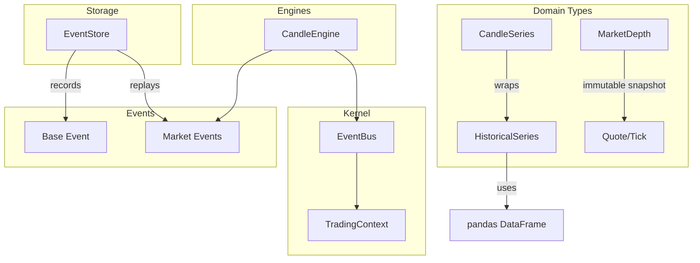
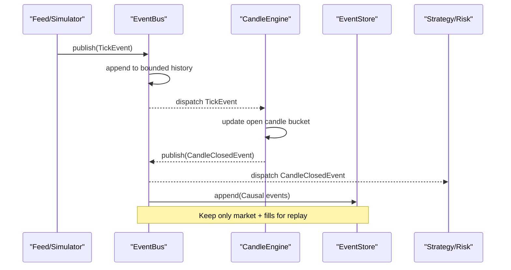
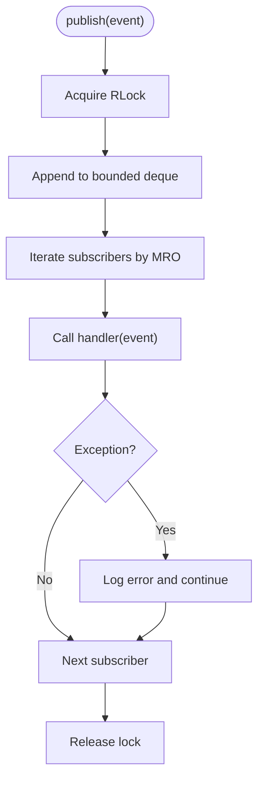
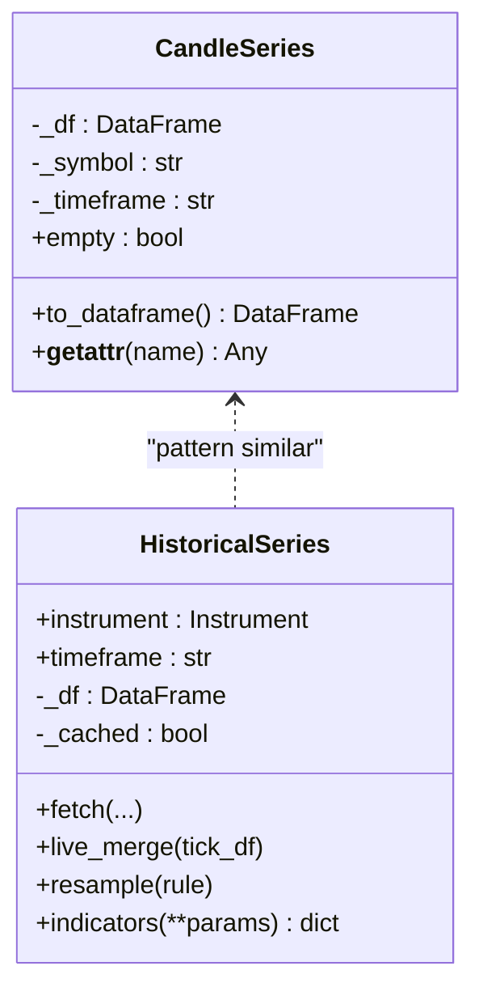
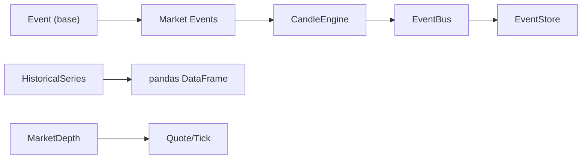

# Memory Optimization

<cite>
**Referenced Files in This Document**
- [event_bus.py](file://ntrade/kernel/event_bus.py)
- [candles.py](file://ntrade/domain/market/candles.py)
- [depth.py](file://ntrade/domain/market/depth.py)
- [base.py](file://ntrade/events/base.py)
- [event_store.py](file://ntrade/storage/event_store.py)
- [quote.py](file://ntrade/domain/market/quote.py)
- [market.py](file://ntrade/events/market.py)
- [context.py](file://ntrade/kernel/context.py)
- [bench.py](file://ntrade/runner/bench.py)
- [history.py](file://ntrade/domain/market/history.py)
- [candle_engine.py](file://ntrade/engines/candle_engine.py)
</cite>

## Table of Contents
1. Introduction
2. Project Structure
3. Core Components
4. Architecture Overview
5. Detailed Component Analysis
6. Dependency Analysis
7. Performance Considerations
8. Troubleshooting Guide
9. Conclusion

## Introduction
This guide provides a comprehensive memory optimization strategy for nTrade applications, focusing on event-driven pipelines, large dataset handling with pandas/numpy, and resource cleanup patterns. It explains how to manage the event bus memory footprint, optimize candle series storage, handle market depth efficiently, and apply profiling techniques to identify bottlenecks in trading pipelines. Practical examples include monitoring memory usage, performing heap analysis, and avoiding leaks in event-driven architectures.

## Project Structure
The nTrade kernel is event-driven and uses immutable dataclasses for events and domain types. Large datasets are wrapped by domain-typed containers that delegate to pandas DataFrames while keeping them behind clean boundaries. The event bus serializes dispatches and maintains a bounded history. An append-only event store supports replay and crash recovery. Engines aggregate ticks into candles and emit closed-candle events.

**Diagram sources**
- [event_bus.py:24-80](file://ntrade/kernel/event_bus.py#L24-L80)
- [candles.py:18-66](file://ntrade/domain/market/candles.py#L18-L66)
- [history.py:14-149](file://ntrade/domain/market/history.py#L14-L149)
- [depth.py:9-49](file://ntrade/domain/market/depth.py#L9-L49)
- [quote.py:9-91](file://ntrade/domain/market/quote.py#L9-L91)
- [candle_engine.py:19-113](file://ntrade/engines/candle_engine.py#L19-L113)
- [event_store.py:76-236](file://ntrade/storage/event_store.py#L76-L236)
- [base.py:16-22](file://ntrade/events/base.py#L16-L22)
- [market.py:11-83](file://ntrade/events/market.py#L11-L83)

**Section sources**
- [event_bus.py:24-80](file://ntrade/kernel/event_bus.py#L24-L80)
- [candles.py:18-66](file://ntrade/domain/market/candles.py#L18-L66)
- [history.py:14-149](file://ntrade/domain/market/history.py#L14-L149)
- [depth.py:9-49](file://ntrade/domain/market/depth.py#L9-L49)
- [quote.py:9-91](file://ntrade/domain/market/quote.py#L9-L91)
- [candle_engine.py:19-113](file://ntrade/engines/candle_engine.py#L19-L113)
- [event_store.py:76-236](file://ntrade/storage/event_store.py#L76-L236)
- [base.py:16-22](file://ntrade/events/base.py#L16-L22)
- [market.py:11-83](file://ntrade/events/market.py#L11-L83)

## Core Components
- EventBus: Thread-safe publish/subscribe with bounded history deque; exceptions in handlers are logged and swallowed to prevent crashes.
- CandleSeries: Domain-typed wrapper around a pandas DataFrame with delegation and escape hatch methods.
- HistoricalSeries: Instrument-attached DataFrame cache with fetch lifecycle, freshness checks, and resampling utilities.
- MarketDepth: Immutable order-book snapshot using frozen dataclasses and tuples for low overhead.
- Quote/Tick: Immutable point-in-time values with derived properties and staleness checks.
- EventStore: Append-only JSONL-backed record for deterministic replay and crash recovery.
- CandleEngine: Aggregates ticks into time-bucketed candles, emits closed-candle events, and bounds stored candles.

Key memory implications:
- Bounded event history prevents unbounded growth under high-frequency feeds.
- Frozen dataclasses and tuples minimize object overhead and avoid accidental mutation.
- DataFrame wrappers keep pandas behind domain boundaries and allow controlled access.
- Append-only event store persists only causal events, reducing replay payload size.

**Section sources**
- [event_bus.py:24-80](file://ntrade/kernel/event_bus.py#L24-L80)
- [candles.py:18-66](file://ntrade/domain/market/candles.py#L18-L66)
- [history.py:14-149](file://ntrade/domain/market/history.py#L14-L149)
- [depth.py:9-49](file://ntrade/domain/market/depth.py#L9-L49)
- [quote.py:9-91](file://ntrade/domain/market/quote.py#L9-L91)
- [event_store.py:76-236](file://ntrade/storage/event_store.py#L76-L236)
- [candle_engine.py:19-113](file://ntrade/engines/candle_engine.py#L19-L113)

## Architecture Overview
The event pipeline connects producers (feeds/simulators), engines (candle aggregation, indicators), and consumers (strategies/risk). Memory hotspots typically occur at:
- Event bus history accumulation
- DataFrame copies and concatenations in historical series
- Unbounded buffers in engines or custom handlers
- EventStore persistence without periodic rotation

**Diagram sources**
- [event_bus.py:47-76](file://ntrade/kernel/event_bus.py#L47-L76)
- [candle_engine.py:42-112](file://ntrade/engines/candle_engine.py#L42-L112)
- [event_store.py:89-114](file://ntrade/storage/event_store.py#L89-L114)
- [market.py:11-62](file://ntrade/events/market.py#L11-L62)

## Detailed Component Analysis

### EventBus Memory Management
- Uses a bounded deque for history; configure max_history to cap memory under heavy event rates.
- Subscribers list is keyed by event type; ensure handlers unsubscribe when no longer needed to avoid lingering references.
- Exceptions in handlers are caught and logged; this prevents handler-level memory leaks from crashing the bus but can mask issues if not monitored.

Optimization tips:
- Set max_history based on expected replay needs and available memory.
- Periodically call clear() during long-running sessions after archival to disk.
- Avoid storing large payloads inside events; pass lightweight identifiers and resolve via context.

**Diagram sources**
- [event_bus.py:47-76](file://ntrade/kernel/event_bus.py#L47-L76)

**Section sources**
- [event_bus.py:24-80](file://ntrade/kernel/event_bus.py#L24-L80)

### CandleSeries and HistoricalSeries
- CandleSeries wraps a DataFrame and delegates attribute access; use to_dataframe() sparingly to avoid unintended copies.
- HistoricalSeries caches DataFrame per timeframe; ensure timeframe changes trigger fresh fetches to avoid stale data.
- live_merge performs in-place updates; be mindful of repeated concat operations which allocate new frames.

Optimization tips:
- Reuse DataFrames where possible; avoid creating intermediate copies.
- Use resample() to downsample large series before analytics.
- Clear or replace underlying DataFrame when session ends to release memory.

**Diagram sources**
- [candles.py:18-66](file://ntrade/domain/market/candles.py#L18-L66)
- [history.py:14-149](file://ntrade/domain/market/history.py#L14-L149)

**Section sources**
- [candles.py:18-66](file://ntrade/domain/market/candles.py#L18-L66)
- [history.py:14-149](file://ntrade/domain/market/history.py#L14-L149)

### MarketDepth and Quote/Tick
- MarketDepth uses frozen dataclasses and tuples for bids/asks; minimal overhead and safe sharing across threads.
- Quote and Tick are immutable; use with_update() to create new instances rather than mutating.

Optimization tips:
- Prefer tuple slices for depth levels to avoid copying entire structures.
- Use mid_price/spread computed on-demand to avoid storing redundant fields.

**Section sources**
- [depth.py:9-49](file://ntrade/domain/market/depth.py#L9-L49)
- [quote.py:9-91](file://ntrade/domain/market/quote.py#L9-L91)

### EventStore for Replay and Recovery
- Appends events to an in-memory list and optionally writes JSONL lines; supports filtering for causal events.
- For long sessions, periodically flush and rotate files to avoid excessive memory and disk growth.

Optimization tips:
- Limit stored events to market data and fills for replay; avoid storing derived signals unless necessary.
- Close file handles explicitly when done to free resources.

**Section sources**
- [event_store.py:76-236](file://ntrade/storage/event_store.py#L76-L236)

### CandleEngine Buffering
- Maintains open and closed candle buffers per symbol; closed buffer is bounded by max_candles.
- Emits CandleClosedEvent upon bucket transitions; partial candles flushed at session end.

Optimization tips:
- Tune max_candles to balance memory vs. analytical needs.
- Avoid retaining extra state beyond what engines require.

**Section sources**
- [candle_engine.py:19-113](file://ntrade/engines/candle_engine.py#L19-L113)

## Dependency Analysis
Memory-sensitive dependencies:
- EventBus depends on Event base and uses threading primitives; ensure handlers do not retain large objects.
- CandleEngine subscribes to TickEvent and QuoteEvent; emissions should be lightweight.
- HistoricalSeries depends on pandas; avoid unnecessary copies and use efficient operations.
- EventStore depends on JSON serialization; keep event payloads small.

**Diagram sources**
- [base.py:16-22](file://ntrade/events/base.py#L16-L22)
- [market.py:11-83](file://ntrade/events/market.py#L11-L83)
- [candle_engine.py:19-113](file://ntrade/engines/candle_engine.py#L19-L113)
- [event_bus.py:24-80](file://ntrade/kernel/event_bus.py#L24-L80)
- [event_store.py:76-236](file://ntrade/storage/event_store.py#L76-L236)
- [history.py:14-149](file://ntrade/domain/market/history.py#L14-L149)
- [depth.py:9-49](file://ntrade/domain/market/depth.py#L9-L49)
- [quote.py:9-91](file://ntrade/domain/market/quote.py#L9-L91)

**Section sources**
- [base.py:16-22](file://ntrade/events/base.py#L16-L22)
- [market.py:11-83](file://ntrade/events/market.py#L11-L83)
- [candle_engine.py:19-113](file://ntrade/engines/candle_engine.py#L19-L113)
- [event_bus.py:24-80](file://ntrade/kernel/event_bus.py#L24-L80)
- [event_store.py:76-236](file://ntrade/storage/event_store.py#L76-L236)
- [history.py:14-149](file://ntrade/domain/market/history.py#L14-L149)
- [depth.py:9-49](file://ntrade/domain/market/depth.py#L9-L49)
- [quote.py:9-91](file://ntrade/domain/market/quote.py#L9-L91)

## Performance Considerations
- Event bus throughput and fanout: measure ticks/sec and events/sec to detect spikes in handler count or heavy processing.
- DataFrame operations: prefer vectorized operations, avoid row-wise loops, and reuse frames.
- Bounded buffers: set appropriate limits for event history and candle buffers to cap memory.
- I/O batching: batch writes to EventStore to reduce syscalls and GC pressure.
- Context snapshots: use shallow snapshots for read-only iteration; deep snapshots only when required.

Practical benchmarking:
- Use the provided micro-benchmark to measure tick throughput and derive events/sec.
- Monitor bus.history length to estimate fanout and potential memory growth.

**Section sources**
- [bench.py:11-26](file://ntrade/runner/bench.py#L11-L26)
- [event_bus.py:24-80](file://ntrade/kernel/event_bus.py#L24-L80)

## Troubleshooting Guide
Common memory issues and resolutions:
- Unbounded event history: increase max_history cautiously; archive and clear periodically.
- Handler leaks: ensure unsubscribe() is called when handlers are no longer needed; avoid capturing large closures.
- DataFrame copies: inspect live_merge and resample paths; consider in-place modifications where safe.
- EventStore growth: rotate JSONL files and limit stored event types to causal ones.
- Stale quotes: use Quote.is_stale() to discard outdated snapshots and refresh from broker.

Monitoring and profiling:
- Track len(bus.history) and engine buffers to detect growth anomalies.
- Use Python’s memory profilers (e.g., tracemalloc) to capture allocations around publish/concat operations.
- Inspect indicator computations for NaN or failures that may cause unexpected allocations.

**Section sources**
- [event_bus.py:47-76](file://ntrade/kernel/event_bus.py#L47-L76)
- [history.py:91-124](file://ntrade/domain/market/history.py#L91-L124)
- [event_store.py:89-114](file://ntrade/storage/event_store.py#L89-L114)
- [quote.py:55-63](file://ntrade/domain/market/quote.py#L55-L63)

## Conclusion
By applying bounded histories, immutable data structures, careful DataFrame management, and disciplined event storage, nTrade applications can achieve stable memory profiles under high-frequency trading workloads. Combine these practices with continuous monitoring and profiling to identify and eliminate bottlenecks early.