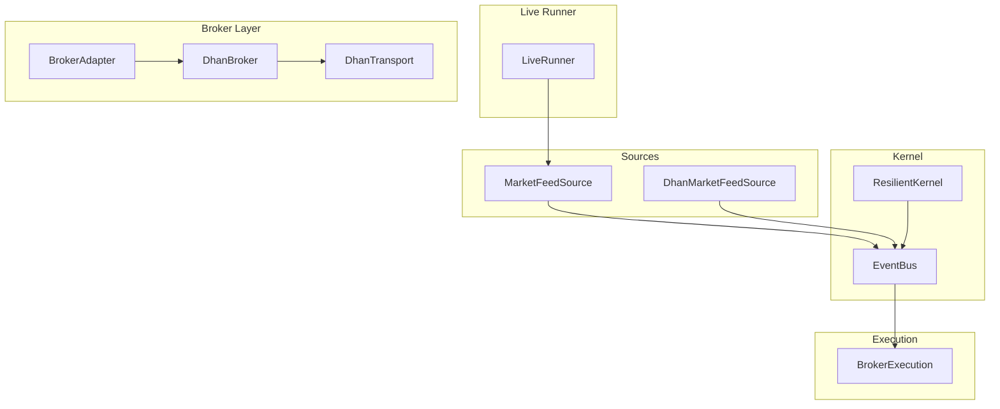
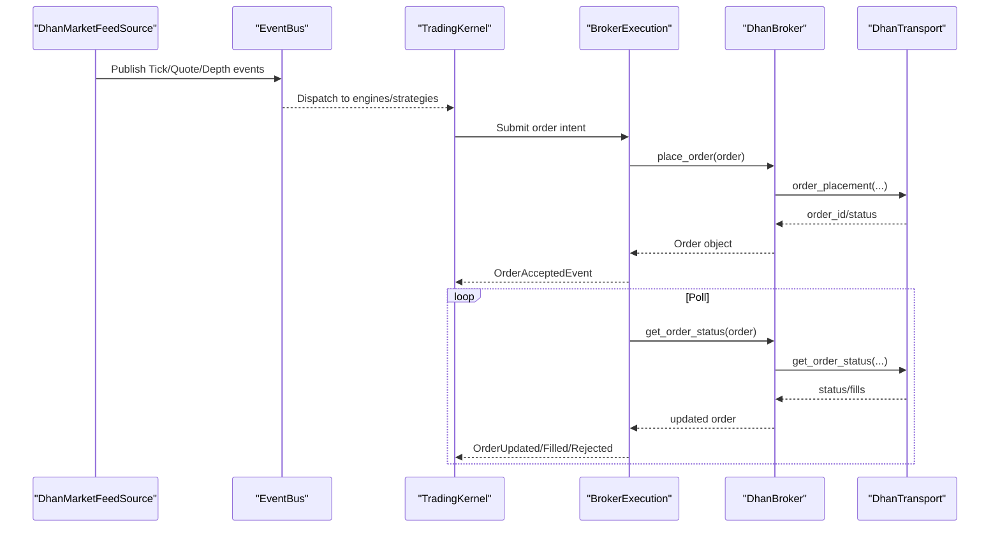
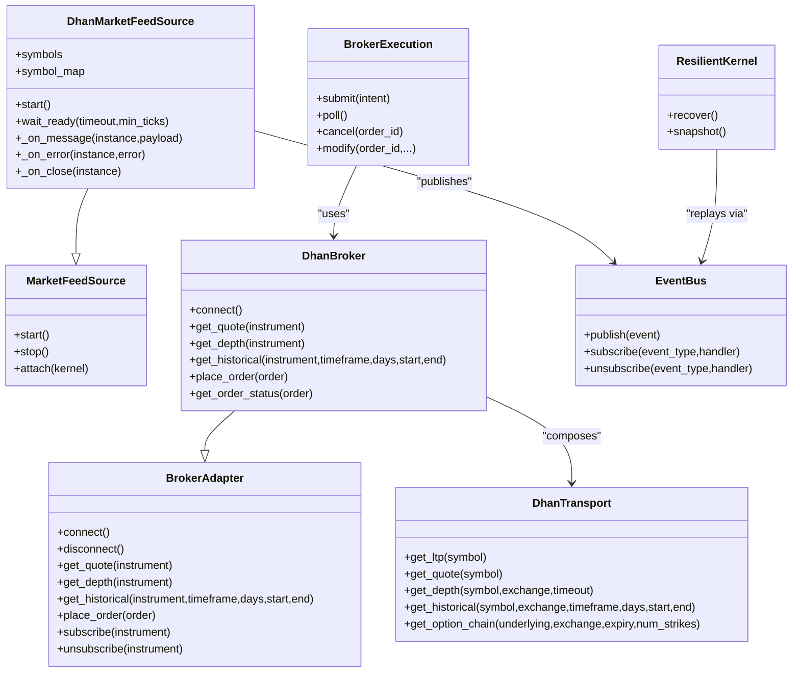

# Network & I/O Optimization

<cite>
**Referenced Files in This Document**
- [dhan_transport.py](file://ntrade/brokers/dhan_transport.py)
- [dhan_feed.py](file://ntrade/sources/dhan_feed.py)
- [retry.py](file://ntrade/execution/retry.py)
- [resilient.py](file://ntrade/kernel/resilient.py)
- [stream.py](file://ntrade/domain/market/stream.py)
- [base.py](file://ntrade/brokers/base.py)
- [market_feed.py](file://ntrade/sources/market_feed.py)
- [broker_executor.py](file://ntrade/execution/broker_executor.py)
- [event_bus.py](file://ntrade/kernel/event_bus.py)
- [dhan.py](file://ntrade/brokers/dhan.py)
- [live_runner.py](file://ntrade/runner/live_runner.py)
- [clock.py](file://ntrade/kernel/clock.py)
- [bench.py](file://ntrade/runner/bench.py)
</cite>

## Table of Contents
1. [Introduction](#introduction)
2. [Project Structure](#project-structure)
3. [Core Components](#core-components)
4. [Architecture Overview](#architecture-overview)
5. [Detailed Component Analysis](#detailed-component-analysis)
6. [Dependency Analysis](#dependency-analysis)
7. [Performance Considerations](#performance-considerations)
8. [Troubleshooting Guide](#troubleshooting-guide)
9. [Conclusion](#conclusion)
10. [Appendices](#appendices)

## Introduction
This guide explains how nTrade optimizes network and I/O for high-throughput trading systems. It focuses on WebSocket connection pooling, API rate limiting strategies, request batching, connection reuse, efficient market data streaming, resilience patterns, error handling, and async I/O techniques. The guidance is grounded in the repository’s broker adapters, transport layer, event bus, feed sources, and execution pipeline.

## Project Structure
The networking and I/O stack spans several layers:
- Feed source (WebSocket): DhanMarketFeedSource consumes a live websocket and publishes canonical events to the kernel bus.
- Transport layer: DhanTransport wraps REST/websocket calls with retry and normalization.
- Broker adapter: BrokerAdapter abstracts broker-specific APIs; DhanBroker composes auth, mapper, and transport.
- Execution: BrokerExecution polls order lifecycle asynchronously and emits lifecycle events.
- Kernel: EventBus serializes dispatches; ResilientKernel supports crash recovery via replay.
- Orchestration: LiveRunner drives polling/sync intervals and watchdogs for feed liveness.

**Diagram sources**
- [live_runner.py](file://ntrade/runner/live_runner.py)
- [event_bus.py](file://ntrade/kernel/event_bus.py)
- [resilient.py](file://ntrade/kernel/resilient.py)
- [market_feed.py](file://ntrade/sources/market_feed.py)
- [dhan_feed.py](file://ntrade/sources/dhan_feed.py)
- [base.py](file://ntrade/brokers/base.py)
- [dhan.py](file://ntrade/brokers/dhan.py)
- [dhan_transport.py](file://ntrade/brokers/dhan_transport.py)
- [broker_executor.py](file://ntrade/execution/broker_executor.py)

**Section sources**
- [live_runner.py](file://ntrade/runner/live_runner.py)
- [event_bus.py](file://ntrade/kernel/event_bus.py)
- [market_feed.py](file://ntrade/sources/market_feed.py)
- [dhan_feed.py](file://ntrade/sources/dhan_feed.py)
- [base.py](file://ntrade/brokers/base.py)
- [dhan.py](file://ntrade/brokers/dhan.py)
- [dhan_transport.py](file://ntrade/brokers/dhan_transport.py)
- [broker_executor.py](file://ntrade/execution/broker_executor.py)
- [resilient.py](file://ntrade/kernel/resilient.py)

## Core Components
- DhanMarketFeedSource: A thin adapter over dhanhq MarketFeed that maps wire payloads to canonical Tick/Quote/Depth events and publishes them to the kernel bus. It manages subscription modes, background thread lifecycle, and disconnect events.
- DhanTransport: Wraps Tradehull API calls with retry policies, timestamp resolution, and normalization. Handles LTP, quotes, depth snapshots, historical data, option chains, and order/portfolio endpoints.
- RetryPolicy and RateLimiter: Exponential backoff with jitter and a thread-safe token-bucket limiter for controlling outbound call rates.
- BrokerAdapter and DhanBroker: Abstract broker interface and concrete Dhan implementation. They manage subscriptions multiplexing, instrument metadata, and order lifecycle.
- BrokerExecution: Asynchronous order submission and polling, emitting lifecycle events and handling timeouts and partial fills.
- EventBus: Synchronous publish/subscribe with reentrant lock ensuring serialized dispatch and safe multi-threaded access.
- ResilientKernel: Crash recovery by replaying recorded causal events to rebuild state deterministically before resuming live trading.
- LiveRunner: Orchestrates start/stop, warmup, periodic poll/sync, heartbeat, and risk-triggered kill switch.

**Section sources**
- [dhan_feed.py](file://ntrade/sources/dhan_feed.py)
- [dhan_transport.py](file://ntrade/brokers/dhan_transport.py)
- [retry.py](file://ntrade/execution/retry.py)
- [base.py](file://ntrade/brokers/base.py)
- [dhan.py](file://ntrade/brokers/dhan.py)
- [broker_executor.py](file://ntrade/execution/broker_executor.py)
- [event_bus.py](file://ntrade/kernel/event_bus.py)
- [resilient.py](file://ntrade/kernel/resilient.py)
- [live_runner.py](file://ntrade/runner/live_runner.py)

## Architecture Overview
The system separates concerns across layers:
- Feed source decouples WebSocket internals from the kernel.
- Transport encapsulates broker API calls with resilience.
- Broker adapter exposes domain-friendly methods.
- Execution handles asynchronous order lifecycle.
- Kernel provides deterministic time and event-driven processing.

**Diagram sources**
- [dhan_feed.py](file://ntrade/sources/dhan_feed.py)
- [event_bus.py](file://ntrade/kernel/event_bus.py)
- [broker_executor.py](file://ntrade/execution/broker_executor.py)
- [dhan.py](file://ntrade/brokers/dhan.py)
- [dhan_transport.py](file://ntrade/brokers/dhan_transport.py)

## Detailed Component Analysis

### WebSocket Connection Pooling and Streaming
- DhanMarketFeedSource constructs a single MarketFeed instance per run, subscribes to multiple symbols with mode codes, and runs it in a background thread. Each payload is mapped to canonical events and published to the kernel bus. Disconnects are emitted as lifecycle events.
- LiveStream maintains per-instrument subscription state and buffers recent ticks. It notifies disconnect/reconnect and emits typed events to handlers.

Optimization tips:
- Reuse a single websocket per broker session; multiplex subscriptions internally.
- Use appropriate mode codes (ticker/quote/full/depth) to minimize bandwidth.
- Buffer recent ticks locally for low-latency reads without extra network calls.

**Section sources**
- [dhan_feed.py](file://ntrade/sources/dhan_feed.py)
- [stream.py](file://ntrade/domain/market/stream.py)

### API Rate Limiting Strategies
- RetryPolicy implements exponential backoff with jitter to handle transient failures.
- RateLimiter provides a thread-safe token bucket to enforce a maximum call rate.
- DhanBroker includes inline retries for flaky LTP calls; DhanTransport uses RetryPolicy for critical reads.

Best practices:
- Wrap all outbound broker calls through RetryPolicy where applicable.
- Apply a shared RateLimiter at the broker or transport boundary to respect provider limits.
- Tune base_delay, max_retries, and max_delay based on observed failure patterns.

**Section sources**
- [retry.py](file://ntrade/execution/retry.py)
- [dhan.py](file://ntrade/brokers/dhan.py)
- [dhan_transport.py](file://ntrade/brokers/dhan_transport.py)

### Network Request Optimization and Batching
- Historical data retrieval uses dedicated endpoints for long-term ranges and daily OHLC when intraday wrappers block certain instruments.
- Depth snapshots are bounded with timeouts to avoid hanging threads.
- Option chain requests include fallback logic across expiries.

Recommendations:
- Batch symbol lookups and instrument metadata fetches where possible.
- Cache instrument metadata and expiry lists to reduce repeated calls.
- Use timeout guards around blocking IO like depth snapshot reads.

**Section sources**
- [dhan.py](file://ntrade/brokers/dhan.py)
- [dhan_transport.py](file://ntrade/brokers/dhan_transport.py)

### Efficient Market Data Streaming
- DhanMarketFeedSource translates raw payloads into canonical events, skipping malformed packets safely.
- LiveStream caches last tick and recent history, enabling fast local reads.
- EventBus serializes dispatch to prevent torn state under concurrent producers.

Guidelines:
- Keep payload mapping lightweight and off the hot path.
- Avoid heavy computations in event handlers; delegate to engines.
- Monitor feed throughput using benchmark utilities.

**Section sources**
- [dhan_feed.py](file://ntrade/sources/dhan_feed.py)
- [stream.py](file://ntrade/domain/market/stream.py)
- [event_bus.py](file://ntrade/kernel/event_bus.py)
- [bench.py](file://ntrade/runner/bench.py)

### Connection Resilience Patterns
- ResilientKernel replays recorded causal events to rebuild state after crashes, then resumes live trading deterministically.
- LiveRunner monitors feed liveness via watchdog and triggers risk halt if no new ticks arrive.
- BrokerExecution tracks open orders, detects stale status refreshes, and evicts them after thresholds.

Patterns:
- Record causal events for recovery and auditability.
- Implement watchdogs to detect frozen feeds and trigger safety mechanisms.
- Evict stale open orders to prevent memory leaks and inconsistent state.

**Section sources**
- [resilient.py](file://ntrade/kernel/resilient.py)
- [live_runner.py](file://ntrade/runner/live_runner.py)
- [broker_executor.py](file://ntrade/execution/broker_executor.py)

### Error Handling for Network Failures
- DhanTransport raises specific errors for critical failures (e.g., zero LTP), preventing silent corruption.
- DhanBroker returns empty structures or safe defaults for non-critical endpoints while preserving integrity for critical ones.
- EventBus swallows handler exceptions to keep the kernel running.

Strategies:
- Differentiate between critical and non-critical endpoints; fail fast on critical.
- Normalize responses to domain types to avoid leaking raw broker artifacts.
- Ensure event handlers are resilient to exceptions.

**Section sources**
- [dhan_transport.py](file://ntrade/brokers/dhan_transport.py)
- [dhan.py](file://ntrade/brokers/dhan.py)
- [event_bus.py](file://ntrade/kernel/event_bus.py)

### Async I/O Patterns and Throughput
- DhanMarketFeedSource runs the websocket in a background thread and publishes events to the kernel bus.
- BrokerExecution polls order status asynchronously and emits lifecycle events.
- EventBus serializes dispatch with a reentrant lock to ensure consistency.

Recommendations:
- Offload blocking IO to background threads or async loops.
- Use event-driven pipelines to decouple producers and consumers.
- Measure throughput and fanout to identify bottlenecks.

**Section sources**
- [dhan_feed.py](file://ntrade/sources/dhan_feed.py)
- [broker_executor.py](file://ntrade/execution/broker_executor.py)
- [event_bus.py](file://ntrade/kernel/event_bus.py)

### Broker API Optimization and Connection Reuse
- DhanBroker composes auth, mapper, and transport; it ensures tokens are refreshed before critical operations.
- Subscriptions are multiplexed over a shared transport managed by the adapter.
- Instrument metadata and expiry lists are fetched once and reused.

Practices:
- Reuse authenticated sessions and transports across calls.
- Cache static metadata and refresh only when necessary.
- Propagate clock injection for zero-parity timestamps across layers.

**Section sources**
- [dhan.py](file://ntrade/brokers/dhan.py)
- [base.py](file://ntrade/brokers/base.py)
- [clock.py](file://ntrade/kernel/clock.py)

## Dependency Analysis
The following diagram shows key dependencies among components involved in network and I/O optimization.

**Diagram sources**
- [market_feed.py](file://ntrade/sources/market_feed.py)
- [dhan_feed.py](file://ntrade/sources/dhan_feed.py)
- [base.py](file://ntrade/brokers/base.py)
- [dhan.py](file://ntrade/brokers/dhan.py)
- [dhan_transport.py](file://ntrade/brokers/dhan_transport.py)
- [broker_executor.py](file://ntrade/execution/broker_executor.py)
- [event_bus.py](file://ntrade/kernel/event_bus.py)
- [resilient.py](file://ntrade/kernel/resilient.py)

**Section sources**
- [market_feed.py](file://ntrade/sources/market_feed.py)
- [dhan_feed.py](file://ntrade/sources/dhan_feed.py)
- [base.py](file://ntrade/brokers/base.py)
- [dhan.py](file://ntrade/brokers/dhan.py)
- [dhan_transport.py](file://ntrade/brokers/dhan_transport.py)
- [broker_executor.py](file://ntrade/execution/broker_executor.py)
- [event_bus.py](file://ntrade/kernel/event_bus.py)
- [resilient.py](file://ntrade/kernel/resilient.py)

## Performance Considerations
- Event Bus Serialization: The bus uses a reentrant lock to serialize dispatch, preventing race conditions under concurrent producers.
- Feed Watchdog: LiveRunner monitors tick counts to detect frozen feeds and triggers risk halts.
- Throughput Measurement: Benchmarks measure ticks/sec and events/sec to quantify performance.
- Time Source: TradingClock ensures deterministic timestamps across live, replay, and simulation.

Recommendations:
- Profile event handler latency and move heavy work off the dispatch path.
- Tune poll/sync intervals in LiveRunner to balance freshness and overhead.
- Use ReplayClock/SimulationClock for deterministic testing and backtesting.

**Section sources**
- [event_bus.py](file://ntrade/kernel/event_bus.py)
- [live_runner.py](file://ntrade/runner/live_runner.py)
- [bench.py](file://ntrade/runner/bench.py)
- [clock.py](file://ntrade/kernel/clock.py)

## Troubleshooting Guide
Common issues and resolutions:
- WebSocket disconnects: DhanMarketFeedSource emits disconnect events; ensure handlers re-subscribe or restart the feed.
- Stale open orders: BrokerExecution evicts orders after repeated status-refresh failures; verify broker connectivity and adjust thresholds.
- Zero LTP or bad payloads: DhanTransport raises explicit errors; guard consumers against zero values and log anomalies.
- Feed not warming up: LiveRunner waits for minimum ticks within a timeout; investigate credentials and subscription codes.
- Token expiration: DhanBroker refreshes tokens before critical calls; ensure auth provider is configured correctly.

**Section sources**
- [dhan_feed.py](file://ntrade/sources/dhan_feed.py)
- [broker_executor.py](file://ntrade/execution/broker_executor.py)
- [dhan_transport.py](file://ntrade/brokers/dhan_transport.py)
- [live_runner.py](file://ntrade/runner/live_runner.py)
- [dhan.py](file://ntrade/brokers/dhan.py)

## Conclusion
nTrade’s architecture emphasizes separation of concerns, deterministic time, and event-driven processing. Network and I/O optimizations are achieved through WebSocket multiplexing, retry/backoff, rate limiting, timeout guards, and resilient orchestration. By following the patterns outlined here—connection reuse, request batching, robust error handling, and async I/O—you can build high-throughput, reliable trading systems.

## Appendices

### TCP Tuning and Buffer Management
- Use OS-level TCP tuning (buffer sizes, congestion control) appropriate for your environment.
- Prefer small, frequent messages over large batches to reduce latency spikes.
- Avoid blocking IO in event handlers; use background threads or async loops.

[No sources needed since this section provides general guidance]

### Connection Pooling Strategy
- Maintain one websocket per broker session; multiplex subscriptions.
- Reuse authenticated sessions and transports across calls.
- Implement reconnect logic with exponential backoff and jitter.

[No sources needed since this section provides general guidance]

### Request Batching and Caching
- Batch symbol lookups and instrument metadata fetches.
- Cache expiry lists and instrument metadata; refresh on change.
- Use dedicated endpoints for long-range historical data.

[No sources needed since this section provides general guidance]

### Async I/O Patterns
- Offload blocking IO to background threads or async loops.
- Use event-driven pipelines to decouple producers and consumers.
- Measure throughput and fanout to identify bottlenecks.

[No sources needed since this section provides general guidance]